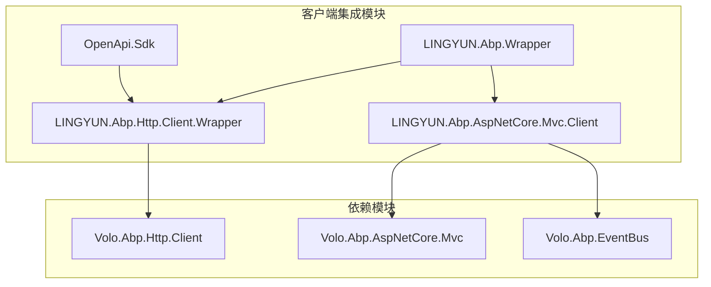
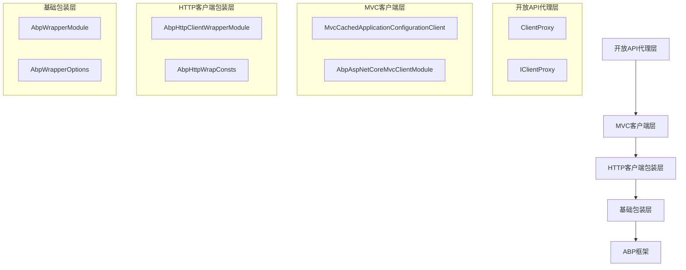
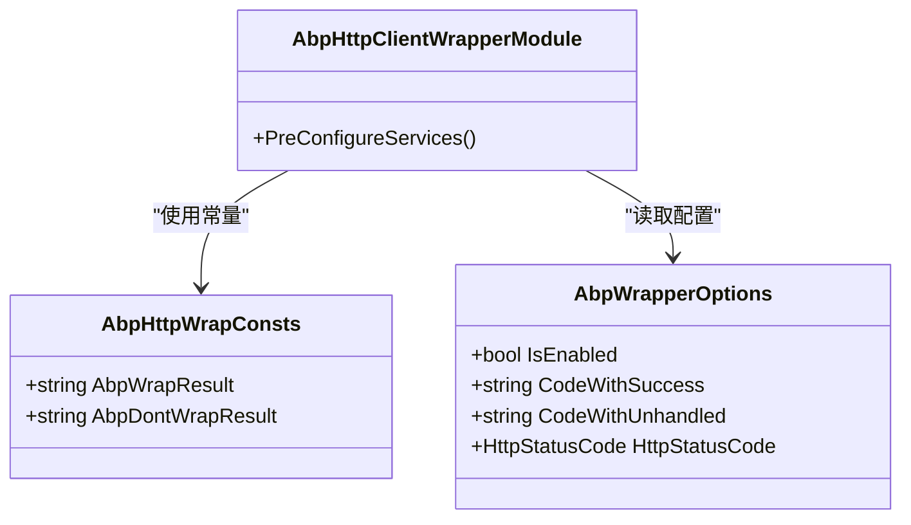
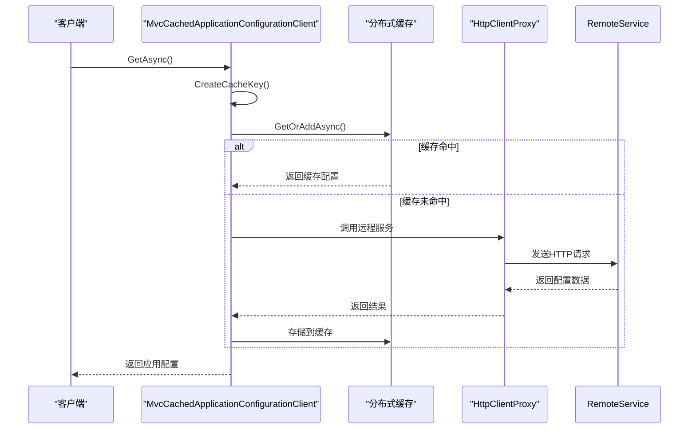
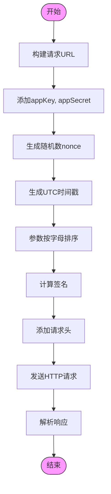
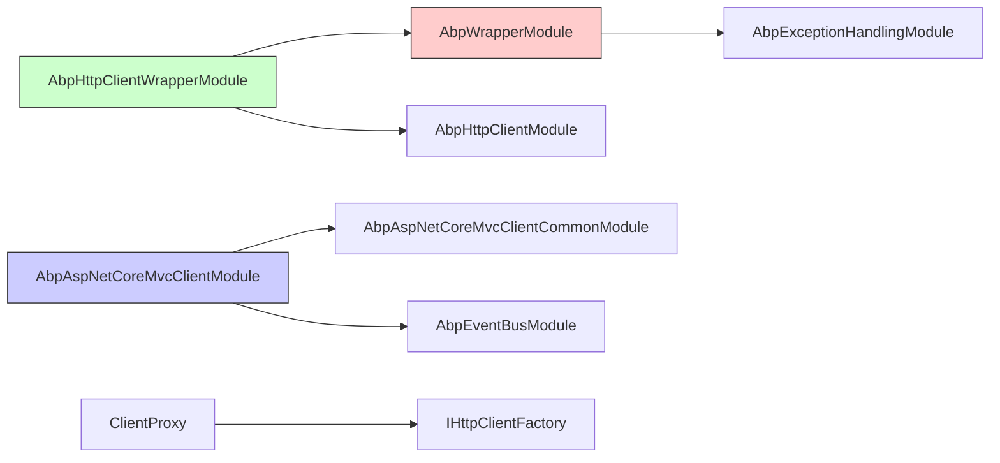

# 客户端集成

<cite>
**本文档引用的文件**
- [AbpHttpClientWrapperModule.cs](file://aspnet-core/framework/common/LINGYUN.Abp.Http.Client.Wrapper/LINGYUN/Abp/Http/Client/Wrapper/AbpHttpClientWrapperModule.cs)
- [ClientProxy.cs](file://aspnet-core/framework/open-api/OpenApi.Sdk/OpenApi/ClientProxy.cs)
- [AbpWrapperOptions.cs](file://aspnet-core/framework/common/LINGYUN.Abp.Wrapper/LINGYUN/Abp/Wrapper/AbpWrapperOptions.cs)
- [AbpExceptionHandlingWrapperMiddleware.cs](file://aspnet-core/framework/common/LINGYUN.Abp.AspNetCore.Wrapper/LINGYUN/Abp/AspNetCore/Wrapper/AbpExceptionHandlingWrapperMiddleware.cs)
- [AbpAspNetCoreMvcClientModule.cs](file://aspnet-core/framework/common/LINGYUN.Abp.AspNetCore.Mvc.Client/LINGYUN/Abp/AspNetCore/Mvc/Client/AbpAspNetCoreMvcClientModule.cs)
- [AbpAspNetCoreMvcClientCacheOptions.cs](file://aspnet-core/framework/common/LINGYUN.Abp.AspNetCore.Mvc.Client/LINGYUN/Abp/AspNetCore/Mvc/Client/AbpAspNetCoreMvcClientCacheOptions.cs)
- [MvcCachedApplicationConfigurationClient.cs](file://aspnet-core/framework/common/LINGYUN.Abp.AspNetCore.Mvc.Client/LINGYUN/Abp/AspNetCore/Mvc/Client/MvcCachedApplicationConfigurationClient.cs)
- [ApiResponse.cs](file://aspnet-core/framework/open-api/OpenApi.Sdk/OpenApi/ApiResponse.cs)
- [ApiResponse`T.cs](file://aspnet-core/framework/open-api/OpenApi.Sdk/OpenApi/ApiResponse`T.cs)
</cite>

## 目录
1. [简介](#简介)
2. [项目结构](#项目结构)
3. [核心组件](#核心组件)
4. [架构概述](#架构概述)
5. [详细组件分析](#详细组件分析)
6. [依赖分析](#依赖分析)
7. [性能考虑](#性能考虑)
8. [故障排除指南](#故障排除指南)
9. [结论](#结论)

## 简介
本文档深入探讨了ABP Next Admin项目中的MVC客户端集成功能，重点介绍客户端代理生成、API调用封装和跨域支持的实现机制。文档详细描述了客户端集成的技术架构、配置方式和使用场景，并为开发者提供最佳实践指南，包括如何配置客户端代理、处理跨域请求以及优化客户端性能。

## 项目结构
客户端集成功能主要分布在以下几个模块中：
- `LINGYUN.Abp.Http.Client.Wrapper`: HTTP客户端包装器模块
- `LINGYUN.Abp.AspNetCore.Mvc.Client`: MVC客户端模块
- `OpenApi.Sdk`: 开放API客户端代理模块
- `LINGYUN.Abp.Wrapper`: 响应包装器核心模块

**图示来源**
- [AbpHttpClientWrapperModule.cs](file://aspnet-core/framework/common/LINGYUN.Abp.Http.Client.Wrapper/LINGYUN/Abp/Http/Client/Wrapper/AbpHttpClientWrapperModule.cs)
- [AbpAspNetCoreMvcClientModule.cs](file://aspnet-core/framework/common/LINGYUN.Abp.AspNetCore.Mvc.Client/LINGYUN/Abp/AspNetCore/Mvc/Client/AbpAspNetCoreMvcClientModule.cs)

**节来源**
- [AbpHttpClientWrapperModule.cs](file://aspnet-core/framework/common/LINGYUN.Abp.Http.Client.Wrapper/LINGYUN/Abp/Http/Client/Wrapper/AbpHttpClientWrapperModule.cs)
- [AbpAspNetCoreMvcClientModule.cs](file://aspnet-core/framework/common/LINGYUN.Abp.AspNetCore.Mvc.Client/LINGYUN/Abp/AspNetCore/Mvc/Client/AbpAspNetCoreMvcClientModule.cs)

## 核心组件
客户端集成的核心组件包括HTTP客户端包装器、MVC客户端缓存机制和开放API客户端代理。这些组件共同实现了统一的API调用封装、响应包装和跨服务通信功能。

**节来源**
- [AbpHttpClientWrapperModule.cs](file://aspnet-core/framework/common/LINGYUN.Abp.Http.Client.Wrapper/LINGYUN/Abp/Http/Client/Wrapper/AbpHttpClientWrapperModule.cs)
- [MvcCachedApplicationConfigurationClient.cs](file://aspnet-core/framework/common/LINGYUN.Abp.AspNetCore.Mvc.Client/LINGYUN/Abp/AspNetCore/Mvc/Client/MvcCachedApplicationConfigurationClient.cs)
- [ClientProxy.cs](file://aspnet-core/framework/open-api/OpenApi.Sdk/OpenApi/ClientProxy.cs)

## 架构概述
客户端集成采用分层架构设计，从下到上分为基础包装层、HTTP客户端层、MVC客户端层和开放API代理层。这种设计实现了关注点分离，使各层职责清晰明确。

**图示来源**
- [ClientProxy.cs](file://aspnet-core/framework/open-api/OpenApi.Sdk/OpenApi/ClientProxy.cs)
- [AbpHttpClientWrapperModule.cs](file://aspnet-core/framework/common/LINGYUN.Abp.Http.Client.Wrapper/LINGYUN/Abp/Http/Client/Wrapper/AbpHttpClientWrapperModule.cs)
- [AbpWrapperOptions.cs](file://aspnet-core/framework/common/LINGYUN.Abp.Wrapper/LINGYUN/Abp/Wrapper/AbpWrapperOptions.cs)

## 详细组件分析

### HTTP客户端包装器分析
HTTP客户端包装器通过在HTTP请求头中添加特定标记来控制响应包装行为，实现了对API响应的统一包装和异常处理。

**图示来源**
- [AbpHttpClientWrapperModule.cs](file://aspnet-core/framework/common/LINGYUN.Abp.Http.Client.Wrapper/LINGYUN/Abp/Http/Client/Wrapper/AbpHttpClientWrapperModule.cs)
- [AbpHttpWrapConsts.cs](file://aspnet-core/framework/common/LINGYUN.Abp.Wrapper/LINGYUN/Abp/Wrapper/AbpHttpWrapConsts.cs)
- [AbpWrapperOptions.cs](file://aspnet-core/framework/common/LINGYUN.Abp.Wrapper/LINGYUN/Abp/Wrapper/AbpWrapperOptions.cs)

### MVC客户端缓存分析
MVC客户端实现了应用配置的缓存机制，通过分布式缓存减少重复的API调用，提高系统性能。

**图示来源**
- [MvcCachedApplicationConfigurationClient.cs](file://aspnet-core/framework/common/LINGYUN.Abp.AspNetCore.Mvc.Client/LINGYUN/Abp/AspNetCore/Mvc/Client/MvcCachedApplicationConfigurationClient.cs)
- [AbpAspNetCoreMvcClientCacheOptions.cs](file://aspnet-core/framework/common/LINGYUN.Abp.AspNetCore.Mvc.Client/LINGYUN/Abp/AspNetCore/Mvc/Client/AbpAspNetCoreMvcClientCacheOptions.cs)

### 开放API客户端代理分析
开放API客户端代理实现了安全的API调用机制，包括签名验证、时间戳和随机数生成等功能。

**图示来源**
- [ClientProxy.cs](file://aspnet-core/framework/open-api/OpenApi.Sdk/OpenApi/ClientProxy.cs)
- [ApiResponse.cs](file://aspnet-core/framework/open-api/OpenApi.Sdk/OpenApi/ApiResponse.cs)

**节来源**
- [ClientProxy.cs](file://aspnet-core/framework/open-api/OpenApi.Sdk/OpenApi/ClientProxy.cs)
- [ApiResponse.cs](file://aspnet-core/framework/open-api/OpenApi.Sdk/OpenApi/ApiResponse.cs)

## 依赖分析
客户端集成模块依赖于多个ABP框架核心模块，形成了完整的依赖链。

**图示来源**
- [AbpWrapperModule.cs](file://aspnet-core/framework/common/LINGYUN.Abp.Wrapper/LINGYUN/Abp/Wrapper/AbpWrapperModule.cs)
- [AbpHttpClientWrapperModule.cs](file://aspnet-core/framework/common/LINGYUN.Abp.Http.Client.Wrapper/LINGYUN/Abp/Http/Client/Wrapper/AbpHttpClientWrapperModule.cs)
- [AbpAspNetCoreMvcClientModule.cs](file://aspnet-core/framework/common/LINGYUN.Abp.AspNetCore.Mvc.Client/LINGYUN/Abp/AspNetCore/Mvc/Client/AbpAspNetCoreMvcClientModule.cs)

**节来源**
- [AbpWrapperModule.cs](file://aspnet-core/framework/common/LINGYUN.Abp.Wrapper/LINGYUN/Abp/Wrapper/AbpWrapperModule.cs)
- [AbpHttpClientWrapperModule.cs](file://aspnet-core/framework/common/LINGYUN.Abp.Http.Client.Wrapper/LINGYUN/Abp/Http/Client/Wrapper/AbpHttpClientWrapperModule.cs)

## 性能考虑
客户端集成在性能方面进行了多项优化：
1. 使用分布式缓存减少重复的API调用
2. 通过连接复用提高HTTP客户端性能
3. 异步调用避免线程阻塞
4. 响应包装的条件控制减少不必要的处理开销

## 故障排除指南
常见问题及解决方案：

**节来源**
- [AbpExceptionHandlingWrapperMiddleware.cs](file://aspnet-core/framework/common/LINGYUN.Abp.AspNetCore.Wrapper/LINGYUN/Abp/AspNetCore/Wrapper/AbpExceptionHandlingWrapperMiddleware.cs)
- [MvcCurrentApplicationConfigurationCacheResetEventHandler.cs](file://aspnet-core/framework/common/LINGYUN.Abp.AspNetCore.Mvc.Client/LINGYUN/Abp/AspNetCore/Mvc/Client/MvcCurrentApplicationConfigurationCacheResetEventHandler.cs)

## 结论
ABP Next Admin的客户端集成提供了完整的解决方案，包括HTTP客户端包装、MVC客户端缓存和开放API代理等功能。通过合理的架构设计和配置选项，开发者可以轻松实现跨服务通信、响应统一包装和性能优化。