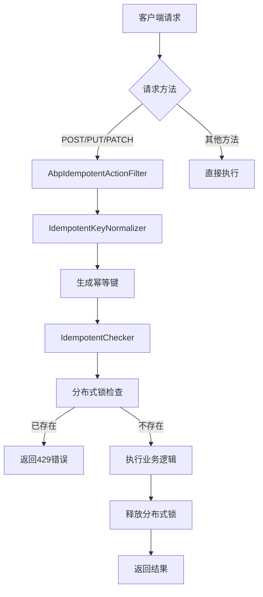
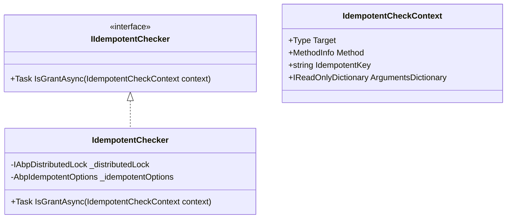
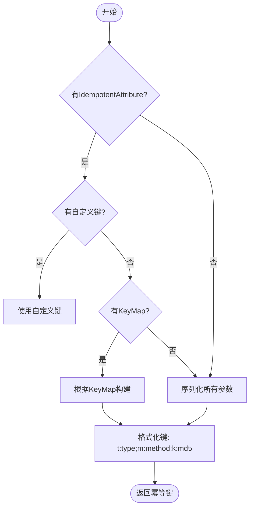
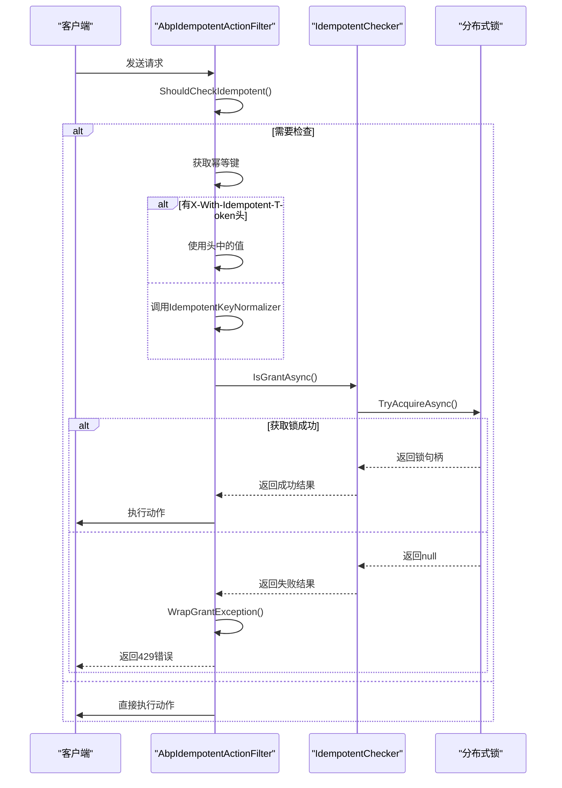
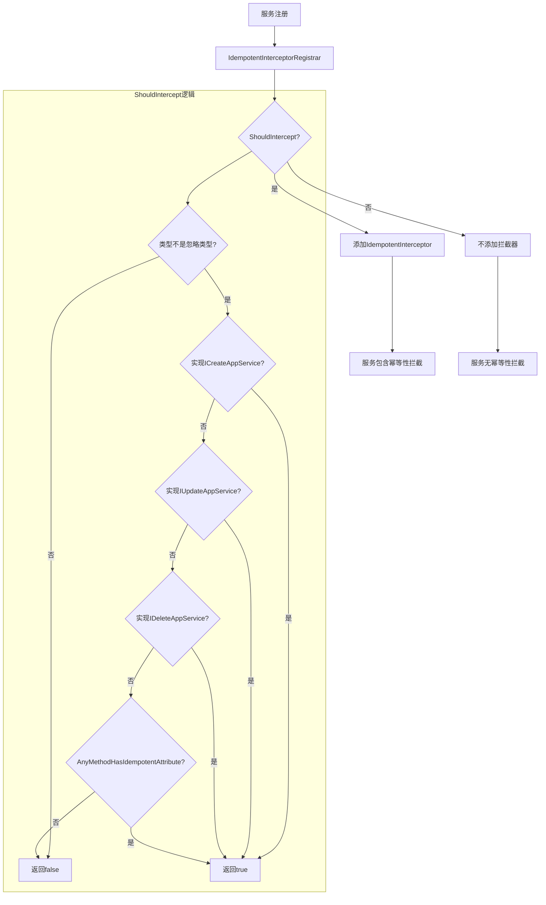
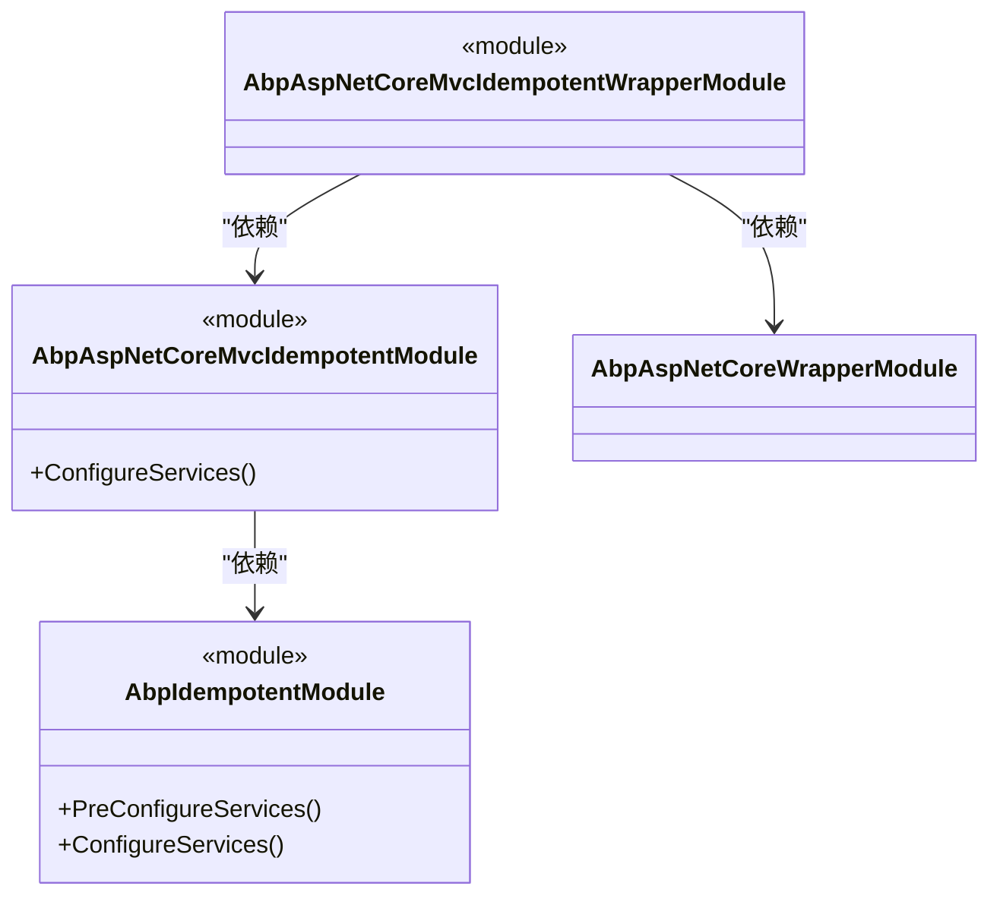
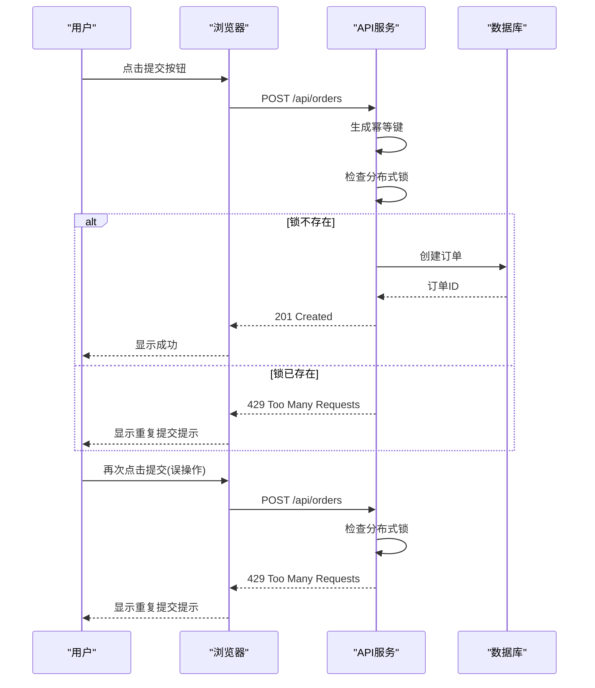
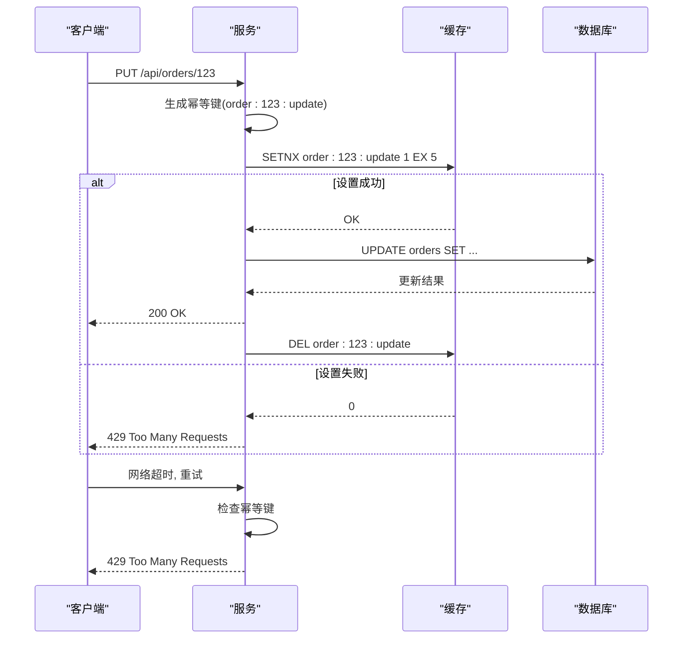

# 幂等性处理

<cite>
**本文档中引用的文件**   
- [AbpIdempotentModule.cs](file://aspnet-core/framework/common/LINGYUN.Abp.Idempotent/LINGYUN/Abp/Idempotent/AbpIdempotentModule.cs)
- [AbpIdempotentOptions.cs](file://aspnet-core/framework/common/LINGYUN.Abp.Idempotent/LINGYUN/Abp/Idempotent/AbpIdempotentOptions.cs)
- [IdempotentAttribute.cs](file://aspnet-core/framework/common/LINGYUN.Abp.Idempotent/LINGYUN/Abp/Idempotent/IdempotentAttribute.cs)
- [IdempotentChecker.cs](file://aspnet-core/framework/common/LINGYUN.Abp.Idempotent/LINGYUN/Abp/Idempotent/IdempotentChecker.cs)
- [IdempotentKeyNormalizer.cs](file://aspnet-core/framework/common/LINGYUN.Abp.Idempotent/LINGYUN/Abp/Idempotent/IdempotentKeyNormalizer.cs)
- [AbpAspNetCoreMvcIdempotentModule.cs](file://aspnet-core/framework/mvc/LINGYUN.Abp.AspNetCore.Mvc.Idempotent/LINGYUN/Abp/AspNetCore/Mvc/Idempotent/AbpAspNetCoreMvcIdempotentModule.cs)
- [AbpIdempotentActionFilter.cs](file://aspnet-core/framework/mvc/LINGYUN.Abp.AspNetCore.Mvc.Idempotent/LINGYUN/Abp/AspNetCore/Mvc/Idempotent/AbpIdempotentActionFilter.cs)
- [AbpAspNetCoreMvcIdempotentOptions.cs](file://aspnet-core/framework/mvc/LINGYUN.Abp.AspNetCore.Mvc.Idempotent/LINGYUN/Abp/AspNetCore/Mvc/Idempotent/AbpAspNetCoreMvcIdempotentOptions.cs)
- [AbpWrapIdempotentActionFilter.cs](file://aspnet-core/framework/mvc/LINGYUN.Abp.AspNetCore.Mvc.Idempotent.Wrapper/LINGYUN/Abp/AspNetCore/Mvc/Idempotent/Wrapper/AbpWrapIdempotentActionFilter.cs)
- [IdempotentErrorCodes.cs](file://aspnet-core/framework/common/LINGYUN.Abp.Idempotent/LINGYUN/Abp/Idempotent/IdempotentErrorCodes.cs)
- [IdempotentInterceptorRegistrar.cs](file://aspnet-core/framework/common/LINGYUN.Abp.Idempotent/LINGYUN/Abp/Idempotent/IdempotentInterceptorRegistrar.cs)
</cite>

## 目录
1. [简介](#简介)
2. [技术架构](#技术架构)
3. [核心组件](#核心组件)
4. [配置方式](#配置方式)
5. [使用场景](#使用场景)
6. [最佳实践](#最佳实践)
7. [异常处理](#异常处理)
8. [代码示例](#代码示例)
9. [结论](#结论)

## 简介
幂等性处理是确保接口在多次调用时产生相同结果的重要机制，特别是在分布式系统和高并发场景下。LINGYUN.Abp.Idempotent模块提供了完整的幂等性解决方案，通过分布式锁和智能键生成机制，有效防止重复提交和数据不一致问题。该模块支持自动幂等性检查、自定义幂等键生成、灵活的超时配置，并与ABP框架无缝集成。

**Section sources**
- [README.md](file://aspnet-core/framework/common/LINGYUN.Abp.Idempotent/README.md)

## 技术架构
幂等性处理模块采用分层架构设计，包含配置层、拦截层、检查层和存储层。该架构通过AOP（面向切面编程）和MVC过滤器实现，确保在不侵入业务代码的情况下提供幂等性保护。



**Diagram sources **
- [AbpIdempotentActionFilter.cs](file://aspnet-core/framework/mvc/LINGYUN.Abp.AspNetCore.Mvc.Idempotent/LINGYUN/Abp/AspNetCore/Mvc/Idempotent/AbpIdempotentActionFilter.cs)
- [IdempotentChecker.cs](file://aspnet-core/framework/common/LINGYUN.Abp.Idempotent/LINGYUN/Abp/Idempotent/IdempotentChecker.cs)
- [IdempotentKeyNormalizer.cs](file://aspnet-core/framework/common/LINGYUN.Abp.Idempotent/LINGYUN/Abp/Idempotent/IdempotentKeyNormalizer.cs)

## 核心组件

### 幂等性检查器 (IdempotentChecker)
`IdempotentChecker`是幂等性处理的核心组件，实现了`IIdempotentChecker`接口。它利用分布式锁机制来确保同一操作在指定时间内只能执行一次。检查器首先验证全局配置是否启用幂等性，然后检查方法是否标记了`IgnoreIdempotent`属性以决定是否跳过检查。



**Diagram sources **
- [IIdempotentChecker.cs](file://aspnet-core/framework/common/LINGYUN.Abp.Idempotent/LINGYUN/Abp/Idempotent/IIdempotentChecker.cs)
- [IdempotentChecker.cs](file://aspnet-core/framework/common/LINGYUN.Abp.Idempotent/LINGYUN/Abp/Idempotent/IdempotentChecker.cs)
- [IdempotentCheckContext.cs](file://aspnet-core/framework/common/LINGYUN.Abp.Idempotent/LINGYUN/Abp/Idempotent/IdempotentCheckContext.cs)

**Section sources**
- [IdempotentChecker.cs](file://aspnet-core/framework/common/LINGYUN.Abp.Idempotent/LINGYUN/Abp/Idempotent/IdempotentChecker.cs)

### 幂等键规范化器 (IdempotentKeyNormalizer)
`IdempotentKeyNormalizer`负责生成唯一的幂等键，这是幂等性处理的关键。它根据方法的类型、名称和参数生成一个MD5哈希值作为唯一标识。规范化器支持多种键生成策略，包括自定义键、参数映射和默认序列化。



**Diagram sources **
- [IdempotentKeyNormalizer.cs](file://aspnet-core/framework/common/LINGYUN.Abp.Idempotent/LINGYUN/Abp/Idempotent/IdempotentKeyNormalizer.cs)
- [IdempotentKeyNormalizerContext.cs](file://aspnet-core/framework/common/LINGYUN.Abp.Idempotent/LINGYUN/Abp/Idempotent/IdempotentKeyNormalizerContext.cs)

**Section sources**
- [IdempotentKeyNormalizer.cs](file://aspnet-core/framework/common/LINGYUN.Abp.Idempotent/LINGYUN/Abp/Idempotent/IdempotentKeyNormalizer.cs)

### MVC动作过滤器 (AbpIdempotentActionFilter)
`AbpIdempotentActionFilter`是MVC层面的幂等性实现，作为动作过滤器集成到ASP.NET Core管道中。它负责在控制器动作执行前进行幂等性检查，支持通过HTTP头传递幂等令牌或自动生成。



**Diagram sources **
- [AbpIdempotentActionFilter.cs](file://aspnet-core/framework/mvc/LINGYUN.Abp.AspNetCore.Mvc.Idempotent/LINGYUN/Abp/AspNetCore/Mvc/Idempotent/AbpIdempotentActionFilter.cs)
- [AbpAspNetCoreMvcIdempotentModule.cs](file://aspnet-core/framework/mvc/LINGYUN.Abp.AspNetCore.Mvc.Idempotent/LINGYUN/Abp/AspNetCore/Mvc/Idempotent/AbpAspNetCoreMvcIdempotentModule.cs)

**Section sources**
- [AbpIdempotentActionFilter.cs](file://aspnet-core/framework/mvc/LINGYUN.Abp.AspNetCore.Mvc.Idempotent/LINGYUN/Abp/AspNetCore/Mvc/Idempotent/AbpIdempotentActionFilter.cs)

### 拦截器注册器 (IdempotentInterceptorRegistrar)
`IdempotentInterceptorRegistrar`负责在服务注册时自动为符合条件的服务添加幂等性拦截器。它通过检查服务类型是否实现特定接口或方法是否有`Idempotent`属性来决定是否应用拦截。



**Diagram sources **
- [IdempotentInterceptorRegistrar.cs](file://aspnet-core/framework/common/LINGYUN.Abp.Idempotent/LINGYUN/Abp/Idempotent/IdempotentInterceptorRegistrar.cs)
- [IdempotentInterceptor.cs](file://aspnet-core/framework/common/LINGYUN.Abp.Idempotent/LINGYUN/Abp/Idempotent/IdempotentInterceptor.cs)

**Section sources**
- [IdempotentInterceptorRegistrar.cs](file://aspnet-core/framework/common/LINGYUN.Abp.Idempotent/LINGYUN/Abp/Idempotent/IdempotentInterceptorRegistrar.cs)

## 配置方式

### 全局配置
幂等性模块通过`AbpIdempotentOptions`类提供全局配置选项，可以在模块的`ConfigureServices`方法中进行配置。

```mermaid
classDiagram
class AbpIdempotentOptions {
+bool IsEnabled
+int DefaultTimeout
+string IdempotentTokenName
+int HttpStatusCode
+AbpIdempotentOptions()
}
note right of AbpIdempotentOptions
默认值 :
- IsEnabled : false
- DefaultTimeout : 5000 (5秒)
- IdempotentTokenName : X-With-Idempotent-Token
- HttpStatusCode : 429 (Too Many Requests)
end
```

**Diagram sources **
- [AbpIdempotentOptions.cs](file://aspnet-core/framework/common/LINGYUN.Abp.Idempotent/LINGYUN/Abp/Idempotent/AbpIdempotentOptions.cs)

**Section sources**
- [AbpIdempotentOptions.cs](file://aspnet-core/framework/common/LINGYUN.Abp.Idempotent/LINGYUN/Abp/Idempotent/AbpIdempotentOptions.cs)

### MVC特定配置
`AbpAspNetCoreMvcIdempotentOptions`提供了MVC特定的配置，主要用于控制哪些HTTP方法需要进行幂等性检查。

```mermaid
classDiagram
class AbpAspNetCoreMvcIdempotentOptions {
+List<string> SupportedMethods
+AbpAspNetCoreMvcIdempotentOptions()
}
note right of AbpAspNetCoreMvcIdempotentOptions
默认支持的方法 :
- POST
- PUT
- PATCH
DELETE方法默认不支持
end
```

**Diagram sources **
- [AbpAspNetCoreMvcIdempotentOptions.cs](file://aspnet-core/framework/mvc/LINGYUN.Abp.AspNetCore.Mvc.Idempotent/LINGYUN/Abp/AspNetCore/Mvc/Idempotent/AbpAspNetCoreMvcIdempotentOptions.cs)

**Section sources**
- [AbpAspNetCoreMvcIdempotentOptions.cs](file://aspnet-core/framework/mvc/LINGYUN.Abp.AspNetCore.Mvc.Idempotent/LINGYUN/Abp/AspNetCore/Mvc/Idempotent/AbpAspNetCoreMvcIdempotentOptions.cs)

### 模块依赖配置
要使用幂等性功能，需要在模块上添加相应的依赖。



**Diagram sources **
- [AbpIdempotentModule.cs](file://aspnet-core/framework/common/LINGYUN.Abp.Idempotent/LINGYUN/Abp/Idempotent/AbpIdempotentModule.cs)
- [AbpAspNetCoreMvcIdempotentModule.cs](file://aspnet-core/framework/mvc/LINGYUN.Abp.AspNetCore.Mvc.Idempotent/LINGYUN/Abp/AspNetCore/Mvc/Idempotent/AbpAspNetCoreMvcIdempotentModule.cs)
- [AbpAspNetCoreMvcIdempotentWrapperModule.cs](file://aspnet-core/framework/mvc/LINGYUN.Abp.AspNetCore.Mvc.Idempotent.Wrapper/LINGYUN/Abp/AspNetCore/Mvc/Idempotent/Wrapper/AbpAspNetCoreMvcIdempotentWrapperModule.cs)

**Section sources**
- [AbpIdempotentModule.cs](file://aspnet-core/framework/common/LINGYUN.Abp.Idempotent/LINGYUN/Abp/Idempotent/AbpIdempotentModule.cs)

## 使用场景

### 创建操作幂等性
在创建资源的场景中，幂等性可以防止用户重复提交表单导致创建多个相同资源。



**Diagram sources **
- [IdempotentChecker.cs](file://aspnet-core/framework/common/LINGYUN.Abp.Idempotent/LINGYUN/Abp/Idempotent/IdempotentChecker.cs)
- [AbpIdempotentActionFilter.cs](file://aspnet-core/framework/mvc/LINGYUN.Abp.AspNetCore.Mvc.Idempotent/LINGYUN/Abp/AspNetCore/Mvc/Idempotent/AbpIdempotentActionFilter.cs)

### 更新操作幂等性
在更新资源的场景中，幂等性可以确保多次更新请求只产生一次实际更新。



**Diagram sources **
- [IdempotentChecker.cs](file://aspnet-core/framework/common/LINGYUN.Abp.Idempotent/LINGYUN/Abp/Idempotent/IdempotentChecker.cs)
- [IdempotentKeyNormalizer.cs](file://aspnet-core/framework/common/LINGYUN.Abp.Idempotent/LINGYUN/Abp/Idempotent/IdempotentKeyNormalizer.cs)

### 分布式环境下的幂等性
在微服务架构中，幂等性确保跨服务调用的一致性。

```mermaid
graph TD
    A[前端服务] --> B[订单服务]
    B --> C[库存服务]
    C --> D[支付服务]
    
    subgraph "幂等性保障"
        B --> E[(Redis分布式锁)]
        C --> E
        D --> E
    end
    
    A -->|创建订单| B
    B -->|检查幂等键| E
    alt 锁不存在
        E -->|获取锁| B
        B -->|扣