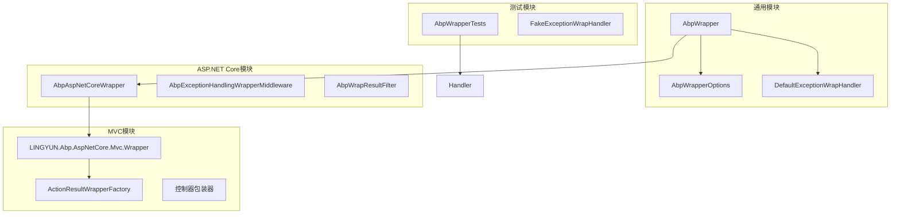
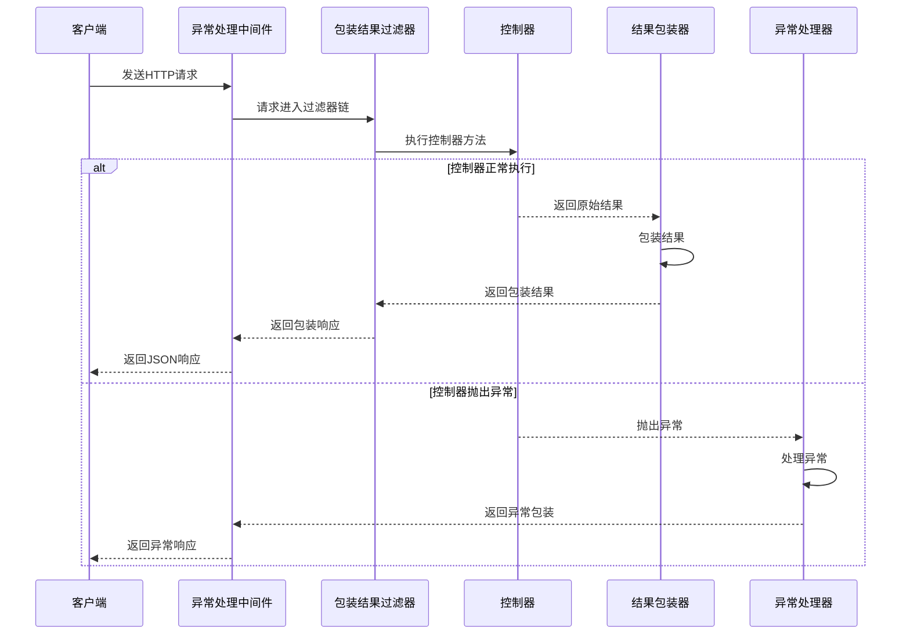
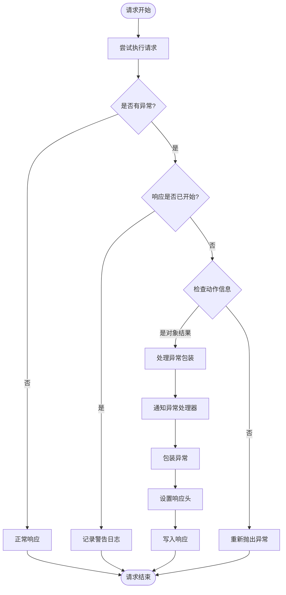
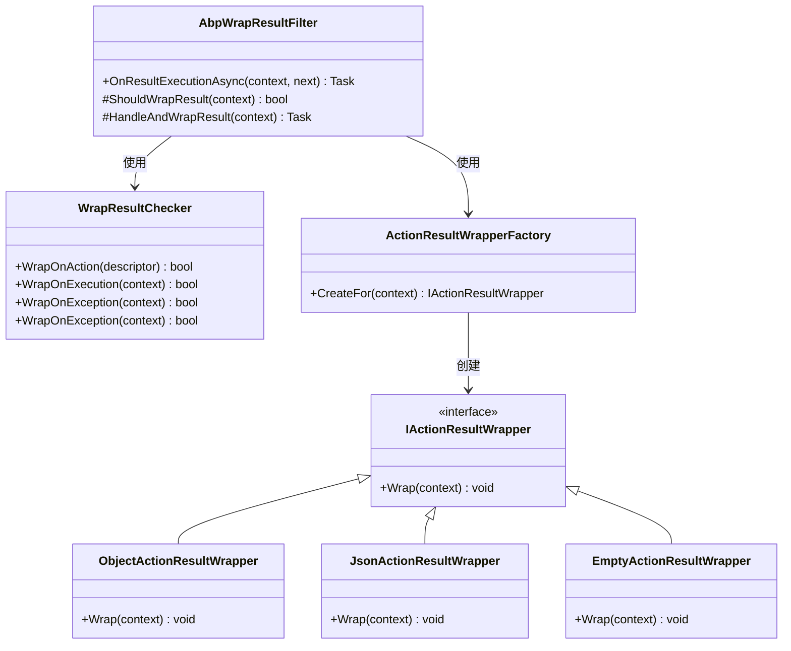
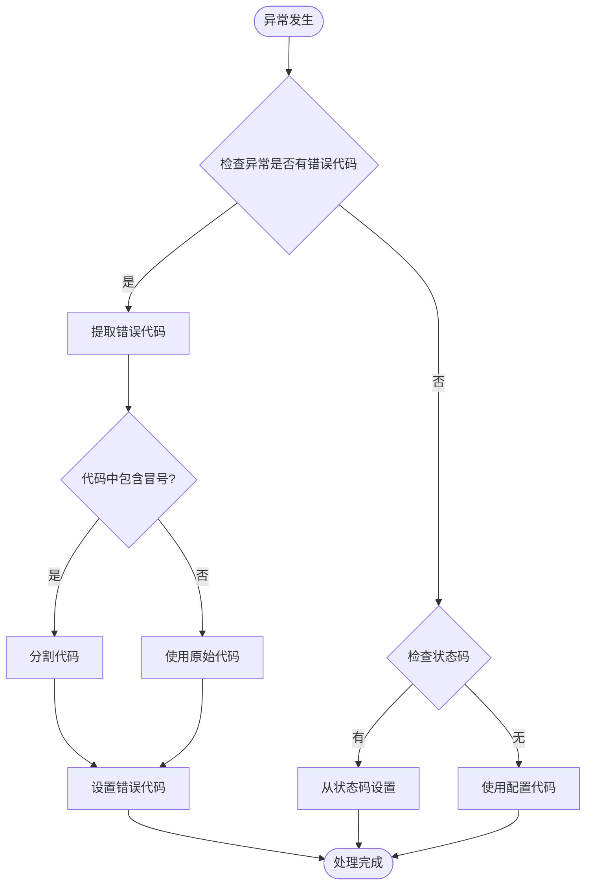

# 请求包装

<cite>
**本文档中引用的文件**
- [AbpWrapperOptions.cs](file://aspnet-core/framework/common/LINGYUN.Abp.Wrapper/LINGYUN/Abp/Wrapper/AbpWrapperOptions.cs)
- [AbpWrapperModule.cs](file://aspnet-core/framework/common/LINGYUN.Abp.Wrapper/LINGYUN/Abp/Wrapper/AbpWrapperModule.cs)
- [AbpAspNetCoreWrapperModule.cs](file://aspnet-core/framework/common/LINGYUN.Abp.AspNetCore.Wrapper/LINGYUN/Abp/AspNetCore/Wrapper/AbpAspNetCoreWrapperModule.cs)
- [AbpExceptionHandlingWrapperMiddleware.cs](file://aspnet-core/framework/common/LINGYUN.Abp.AspNetCore.Wrapper/LINGYUN/Abp/AspNetCore/Wrapper/AbpExceptionHandlingWrapperMiddleware.cs)
- [AbpWrapResultFilter.cs](file://aspnet-core/framework/mvc/LINGYUN.Abp.AspNetCore.Mvc.Wrapper/LINGYUN/Abp/AspNetCore/Mvc/Wrapper/Filters/AbpWrapResultFilter.cs)
- [WrapResultChecker.cs](file://aspnet-core/framework/mvc/LINGYUN.Abp.AspNetCore.Mvc.Wrapper/LINGYUN/Abp/AspNetCore/Mvc/Wrapper/WrapResultChecker.cs)
- [IWrapResultChecker.cs](file://aspnet-core/framework/mvc/LINGYUN.Abp.AspNetCore.Mvc.Wrapper/LINGYUN/Abp/AspNetCore/Mvc/Wrapper/IWrapResultChecker.cs)
- [ActionResultWrapperFactory.cs](file://aspnet-core/framework/mvc/LINGYUN.Abp.AspNetCore.Mvc.Wrapper/LINGYUN/Abp/AspNetCore/Mvc/Wrapper/Wraping/ActionResultWrapperFactory.cs)
- [ObjectActionResultWrapper.cs](file://aspnet-core/framework/mvc/LINGYUN.Abp.AspNetCore.Mvc.Wrapper/LINGYUN/Abp/AspNetCore/Mvc/Wrapper/Wraping/ObjectActionResultWrapper.cs)
- [JsonActionResultWrapper.cs](file://aspnet-core/framework/mvc/LINGYUN.Abp.AspNetCore.Mvc.Wrapper/LINGYUN/Abp/AspNetCore/Mvc/Wrapper/Wraping/JsonActionResultWrapper.cs)
- [DefaultExceptionWrapHandler.cs](file://aspnet-core/framework/common/LINGYUN.Abp.Wrapper/LINGYUN/Abp/Wrapper/DefaultExceptionWrapHandler.cs)
- [ExceptionWrapContext.cs](file://aspnet-core/framework/common/LINGYUN.Abp.Wrapper/LINGYUN/Abp/Wrapper/ExceptionWrapContext.cs)
- [WrapResult.cs](file://aspnet-core/framework/common/LINGYUN.Abp.Wrapper/LINGYUN/Abp/Wrapper/WrapResult.cs)
- [WrapResult`T.cs](file://aspnet-core/framework/common/LINGYUN.Abp.Wrapper/LINGYUN/Abp/Wrapper/WrapResult`T.cs)
- [AbpWrapperApplicationBuilderExtensions.cs](file://aspnet-core/framework/common/LINGYUN.Abp.AspNetCore.Wrapper/Microsoft/AspNetCore/Builder/AbpWrapperApplicationBuilderExtensions.cs)
- [IgnoreWrapResultAttribute.cs](file://aspnet-core/framework/common/LINGYUN.Abp.Wrapper/LINGYUN/Abp/Wrapper/IgnoreWrapResultAttribute.cs)
- [FakeExceptionWrapHandler.cs](file://aspnet-core/tests/LINGYUN.Abp.Wrapper.Tests/LINGYUN/Abp/Wrapper/FakeExceptionWrapHandler.cs)
</cite>

## 目录
1. [简介](#简介)
2. [项目结构](#项目结构)
3. [核心组件](#核心组件)
4. [架构概览](#架构概览)
5. [详细组件分析](#详细组件分析)
6. [配置与使用](#配置与使用)
7. [最佳实践](#最佳实践)
8. [故障排除](#故障排除)
9. [总结](#总结)

## 简介

ABP框架的请求包装功能是一个强大的工具，用于统一处理HTTP请求的结果包装和异常处理。该功能通过标准化的响应格式，确保所有API调用都返回一致的结构化数据，同时提供了灵活的配置选项来控制包装行为。

请求包装系统主要包含以下核心功能：
- **自动结果包装**：将控制器方法的返回值包装成统一的结构化格式
- **异常处理包装**：对未处理的异常进行统一处理并返回标准化的错误信息
- **配置化控制**：通过配置选项精确控制哪些请求需要包装
- **自定义处理器**：支持为特定异常类型注册自定义的包装处理器

## 项目结构

请求包装功能分布在多个模块中，形成了清晰的分层架构：



**图表来源**
- [AbpWrapperModule.cs](file://aspnet-core/framework/common/LINGYUN.Abp.Wrapper/LINGYUN/Abp/Wrapper/AbpWrapperModule.cs#L1-L9)
- [AbpAspNetCoreWrapperModule.cs](file://aspnet-core/framework/common/LINGYUN.Abp.AspNetCore.Wrapper/LINGYUN/Abp/AspNetCore/Wrapper/AbpAspNetCoreWrapperModule.cs#L1-L12)

## 核心组件

### AbpWrapperOptions 配置选项

`AbpWrapperOptions`是请求包装系统的核心配置类，提供了丰富的配置选项来控制包装行为：

```csharp
public class AbpWrapperOptions
{
    // 未处理异常代码，默认: 500
    public string CodeWithUnhandled { get; set; }
    
    // 是否启用包装器，默认: false
    public bool IsEnabled { get; set; }
    
    // 成功时返回代码，默认：0
    public string CodeWithSuccess { get; set; }
    
    // 资源为空时是否提示错误，默认: false
    public bool ErrorWithEmptyResult { get; set; }
    
    // 是否启用401错误包装，默认: false
    public bool IsWrapUnauthorizedEnabled { get; set; }
    
    // 包装后的返回状态码，默认：200
    public HttpStatusCode HttpStatusCode { get; set; }
    
    // 忽略的URL前缀列表
    public IList<string> IgnorePrefixUrls { get; }
    
    // 忽略的命名空间列表
    public IList<string> IgnoreNamespaces { get; }
    
    // 忽略的控制器列表
    public ITypeList IgnoreControllers { get; }
    
    // 忽略的返回值类型列表
    public ITypeList IgnoreReturnTypes { get; }
    
    // 忽略的异常类型列表
    public ITypeList<Exception> IgnoreExceptions { get; }
    
    // 异常处理器字典
    internal IDictionary<Type, IExceptionWrapHandler> ExceptionHandles { get; }
}
```

**章节来源**
- [AbpWrapperOptions.cs](file://aspnet-core/framework/common/LINGYUN.Abp.Wrapper/LINGYUN/Abp/Wrapper/AbpWrapperOptions.cs#L1-L118)

### WrapResult 结构体

`WrapResult`是包装后返回数据的标准结构，支持泛型以保持类型安全：

```csharp
// 泛型版本
public class WrapResult<TResult>
{
    public string Code { get; set; }      // 错误代码
    public string Message { get; set; }   // 错误提示消息
    public string Details { get; set; }   // 补充消息
    public TResult Result { get; set; }   // 返回值
}

// 特化版本
public class WrapResult : WrapResult<object>
{
    public WrapResult() { }
    public WrapResult(string code, string message, string details = null)
        : base(code, message, details) { }
    
    public WrapResult(string code, object result, string message = "OK")
        : base(code, result, message) { }
}
```

**章节来源**
- [WrapResult`T.cs](file://aspnet-core/framework/common/LINGYUN.Abp.Wrapper/LINGYUN/Abp/Wrapper/WrapResult`T.cs#L1-L49)
- [WrapResult.cs](file://aspnet-core/framework/common/LINGYUN.Abp.Wrapper/LINGYUN/Abp/Wrapper/WrapResult.cs#L1-L25)

## 架构概览

请求包装系统采用多层架构设计，从底层的异常处理到上层的控制器包装，形成了完整的处理链：



**图表来源**
- [AbpExceptionHandlingWrapperMiddleware.cs](file://aspnet-core/framework/common/LINGYUN.Abp.AspNetCore.Wrapper/LINGYUN/Abp/AspNetCore/Wrapper/AbpExceptionHandlingWrapperMiddleware.cs#L25-L74)
- [AbpWrapResultFilter.cs](file://aspnet-core/framework/mvc/LINGYUN.Abp.AspNetCore.Mvc.Wrapper/LINGYUN/Abp/AspNetCore/Mvc/Wrapper/Filters/AbpWrapResultFilter.cs#L15-L37)

## 详细组件分析

### 异常处理中间件

`AbpExceptionHandlingWrapperMiddleware`是整个包装系统的入口点，负责捕获和处理所有未处理的异常：



**图表来源**
- [AbpExceptionHandlingWrapperMiddleware.cs](file://aspnet-core/framework/common/LINGYUN.Abp.AspNetCore.Wrapper/LINGYUN/Abp/AspNetCore/Wrapper/AbpExceptionHandlingWrapperMiddleware.cs#L25-L74)

**章节来源**
- [AbpExceptionHandlingWrapperMiddleware.cs](file://aspnet-core/framework/common/LINGYUN.Abp.AspNetCore.Wrapper/LINGYUN/Abp/AspNetCore/Wrapper/AbpExceptionHandlingWrapperMiddleware.cs#L1-L147)

### 包装结果过滤器

`AbpWrapResultFilter`负责在控制器执行完成后对结果进行包装：



**图表来源**
- [AbpWrapResultFilter.cs](file://aspnet-core/framework/mvc/LINGYUN.Abp.AspNetCore.Mvc.Wrapper/LINGYUN/Abp/AspNetCore/Mvc/Wrapper/Filters/AbpWrapResultFilter.cs#L15-L54)
- [ActionResultWrapperFactory.cs](file://aspnet-core/framework/mvc/LINGYUN.Abp.AspNetCore.Mvc.Wrapper/LINGYUN/Abp/AspNetCore/Mvc/Wrapper/Wraping/ActionResultWrapperFactory.cs#L1-L23)

**章节来源**
- [AbpWrapResultFilter.cs](file://aspnet-core/framework/mvc/LINGYUN.Abp.AspNetCore.Mvc.Wrapper/LINGYUN/Abp/AspNetCore/Mvc/Wrapper/Filters/AbpWrapResultFilter.cs#L1-L54)

### 异常包装处理器

`DefaultExceptionWrapHandler`提供了默认的异常处理逻辑：



**图表来源**
- [DefaultExceptionWrapHandler.cs](file://aspnet-core/framework/common/LINGYUN.Abp.Wrapper/LINGYUN/Abp/Wrapper/DefaultExceptionWrapHandler.cs#L8-L39)

**章节来源**
- [DefaultExceptionWrapHandler.cs](file://aspnet-core/framework/common/LINGYUN.Abp.Wrapper/LINGYUN/Abp/Wrapper/DefaultExceptionWrapHandler.cs#L1-L41)

### 自定义异常处理器

开发者可以通过实现`IExceptionWrapHandler`接口来自定义异常处理逻辑：

```csharp
public class CustomExceptionWrapHandler : IExceptionWrapHandler
{
    public void Wrap(ExceptionWrapContext context)
    {
        // 自定义异常处理逻辑
        context.WithCode("CUSTOM_ERROR_CODE")
               .WithMessage("自定义错误消息")
               .WithDetails("自定义详细信息");
    }
}
```

然后在配置中注册自定义处理器：

```csharp
Configure<AbpWrapperOptions>(options =>
{
    options.AddHandler<CustomException>(new CustomExceptionWrapHandler());
});
```

**章节来源**
- [FakeExceptionWrapHandler.cs](file://aspnet-core/tests/LINGYUN.Abp.Wrapper.Tests/LINGYUN/Abp/Wrapper/FakeExceptionWrapHandler.cs#L1-L11)

## 配置与使用

### 基本配置

在启动模块中启用请求包装功能：

```csharp
[DependsOn(typeof(AbpAspNetCoreWrapperModule))]
public class MyApplicationModule : AbpModule
{
    public override void ConfigureServices(ServiceConfigurationContext context)
    {
        Configure<AbpWrapperOptions>(options =>
        {
            options.IsEnabled = true;
            options.CodeWithSuccess = "0";
            options.CodeWithUnhandled = "500";
            options.HttpStatusCode = HttpStatusCode.OK;
            options.ErrorWithEmptyResult = true;
            options.IsWrapUnauthorizedEnabled = true;
            
            // 添加自定义异常处理器
            options.AddHandler<BusinessException>(new BusinessExceptionWrapHandler());
        });
    }
}
```

### 启用异常处理中间件

在`Startup.cs`或程序入口处添加异常处理中间件：

```csharp
public void Configure(IApplicationBuilder app, IWebHostEnvironment env)
{
    app.UseWrapperExceptionHandling();
    
    // 其他中间件...
}
```

**章节来源**
- [AbpWrapperApplicationBuilderExtensions.cs](file://aspnet-core/framework/common/LINGYUN.Abp.AspNetCore.Wrapper/Microsoft/AspNetCore/Builder/AbpWrapperApplicationBuilderExtensions.cs#L1-L17)

### 控制器级别忽略包装

使用`IgnoreWrapResultAttribute`属性来忽略特定控制器或方法的包装：

```csharp
[IgnoreWrapResult]
public class PublicApiController : ControllerBase
{
    [HttpGet]
    [IgnoreWrapResult]
    public IActionResult GetRawData()
    {
        return Ok(new { data = "raw" });
    }
    
    [HttpGet]
    public IActionResult GetWrappedData()
    {
        return Ok(new { data = "wrapped" });
    }
}
```

### 接口级别忽略包装

实现`IWrapDisabled`接口来禁用整个接口的包装：

```csharp
public interface IMyService : IApplicationService, IWrapDisabled
{
    // 这个服务的所有方法都不会被包装
}
```

## 最佳实践

### 1. 统一错误代码策略

建议为不同类型的错误定义统一的错误代码：

```csharp
Configure<AbpWrapperOptions>(options =>
{
    // 业务错误
    options.AddHandler<BusinessException>(new BusinessErrorWrapHandler());
    
    // 参数验证错误
    options.AddHandler<ArgumentException>(new ValidationErrorWrapHandler());
    
    // 权限错误
    options.AddHandler<AbpAuthorizationException>(new AuthorizationErrorWrapHandler());
    
    // 数据不存在错误
    options.AddHandler<EntityNotFoundException>(new NotFoundErrorWrapHandler());
});
```

### 2. 自定义异常处理器

为特定业务异常创建专门的处理器：

```csharp
public class BusinessErrorWrapHandler : IExceptionWrapHandler
{
    public void Wrap(ExceptionWrapContext context)
    {
        var exception = context.Exception as BusinessException;
        
        context.WithCode(exception.Code ?? "BUSINESS_ERROR")
               .WithMessage(exception.Message)
               .WithData("errorCode", exception.ErrorCode);
    }
}
```

### 3. 性能优化配置

对于高并发场景，合理配置包装选项：

```csharp
Configure<AbpWrapperOptions>(options =>
{
    // 只包装特定路径下的请求
    options.IgnorePrefixUrls.Add("/api/public/");
    
    // 忽略不需要包装的控制器
    options.IgnoreControllers.Add(typeof(HealthCheckController));
    
    // 忽略特定的返回类型
    options.IgnoreReturnTypes.Add(typeof(FileStreamResult));
});
```

### 4. 日志集成

在异常处理器中集成日志记录：

```csharp
public class LoggingExceptionWrapHandler : IExceptionWrapHandler
{
    private readonly ILogger<LoggingExceptionWrapHandler> _logger;
    
    public LoggingExceptionWrapHandler(ILogger<LoggingExceptionWrapHandler> logger)
    {
        _logger = logger;
    }
    
    public void Wrap(ExceptionWrapContext context)
    {
        _logger.LogError(context.Exception, "处理异常时发生错误");
        
        context.WithCode("INTERNAL_ERROR")
               .WithMessage("服务器内部错误，请稍后重试");
    }
}
```

## 故障排除

### 常见问题及解决方案

#### 1. 包装结果不生效

**问题**：控制器返回的数据没有被包装

**可能原因**：
- 包装功能未启用（`IsEnabled = false`）
- 控制器或方法标记了`IgnoreWrapResultAttribute`
- 返回类型被配置为忽略（`IgnoreReturnTypes`）

**解决方案**：
```csharp
// 检查配置
Configure<AbpWrapperOptions>(options =>
{
    options.IsEnabled = true; // 确保启用包装
});

// 检查控制器是否被忽略
[IgnoreWrapResult] // 移除此属性
public class MyController : ControllerBase
{
    // 方法内容
}
```

#### 2. 异常处理不正确

**问题**：异常被包装但格式不符合预期

**解决方案**：
```csharp
// 注册自定义异常处理器
Configure<AbpWrapperOptions>(options =>
{
    options.AddHandler<CustomBusinessException>(new CustomBusinessExceptionWrapHandler());
});
```

#### 3. 性能问题

**问题**：包装操作影响性能

**解决方案**：
- 合理配置忽略规则
- 使用异步处理
- 避免在包装器中执行复杂计算

### 调试技巧

#### 启用详细日志

```csharp
Configure<AbpExceptionHandlingOptions>(options =>
{
    options.SendExceptionsDetailsToClients = true;
    options.SendStackTraceToClients = true;
});
```

#### 自定义调试处理器

```csharp
public class DebugExceptionWrapHandler : IExceptionWrapHandler
{
    public void Wrap(ExceptionWrapContext context)
    {
        // 在开发环境中显示详细信息
        if (context.ServiceProvider.GetService<IWebHostEnvironment>().IsDevelopment())
        {
            context.WithDetails(context.Exception.ToString());
        }
    }
}
```

**章节来源**
- [AbpExceptionHandlingWrapperMiddleware.cs](file://aspnet-core/framework/common/LINGYUN.Abp.AspNetCore.Wrapper/LINGYUN/Abp/AspNetCore/Wrapper/AbpExceptionHandlingWrapperMiddleware.cs#L39-L74)

## 总结

ABP框架的请求包装功能提供了一个强大而灵活的解决方案来统一处理API请求的结果包装和异常处理。通过合理的配置和自定义，开发者可以构建出符合业务需求的标准化API响应格式。

### 主要优势

1. **统一性**：确保所有API调用都返回一致的结构化数据
2. **灵活性**：支持多种配置选项和自定义处理器
3. **可扩展性**：易于扩展和定制以满足特定需求
4. **性能优化**：通过智能的忽略规则提高性能

### 使用建议

- 在项目初期就启用包装功能，避免后期重构
- 根据业务需求设计合理的错误代码体系
- 为关键异常类型创建专门的处理逻辑
- 合理配置忽略规则以平衡功能性和性能

通过遵循本文档的指导原则和最佳实践，开发者可以充分利用ABP框架的请求包装功能，构建出高质量、易维护的API系统。