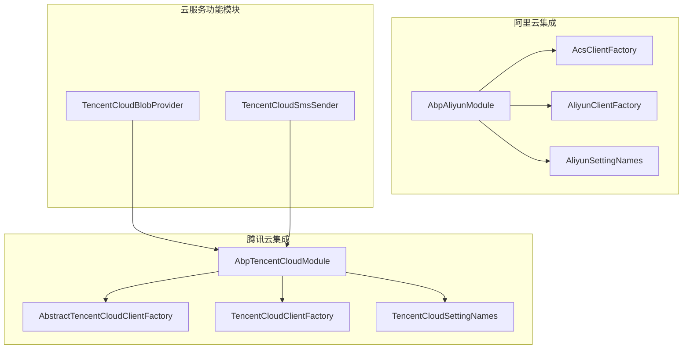
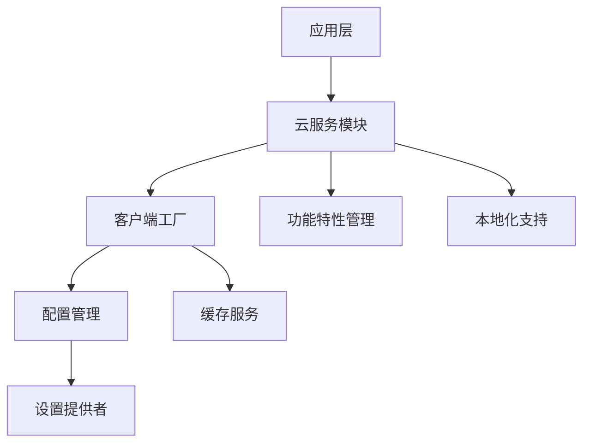
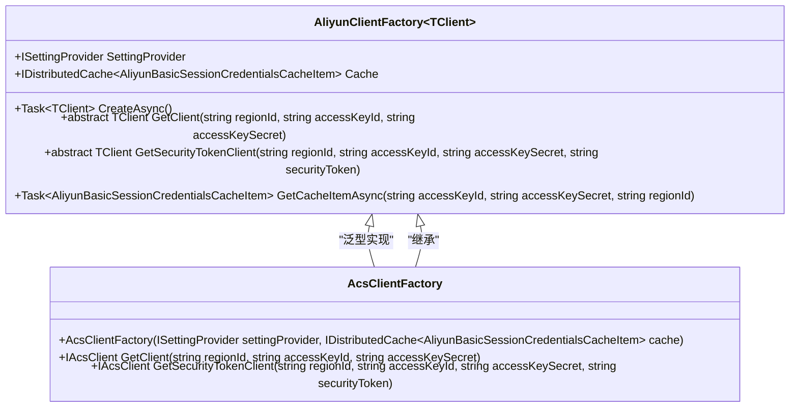
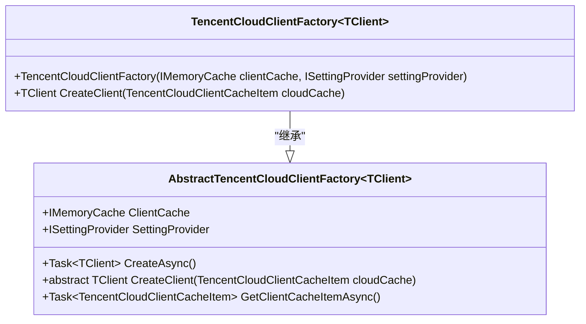
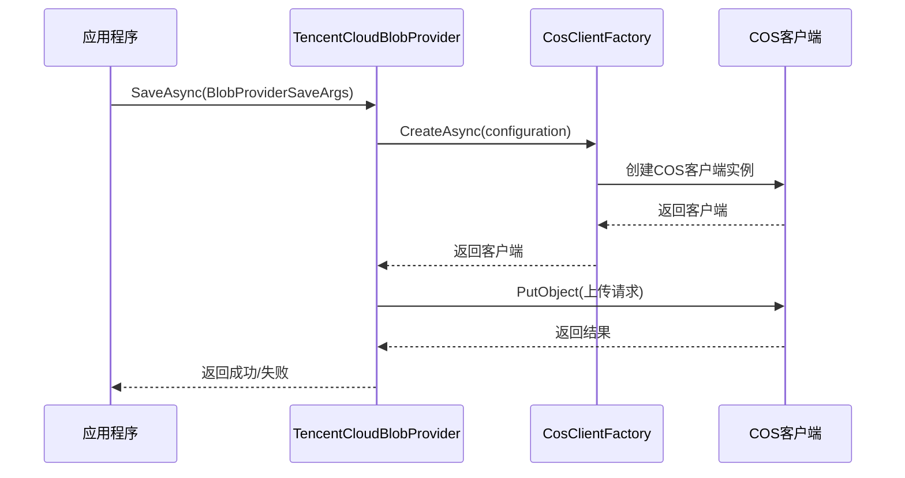

# 云服务集成扩展

<cite>
**本文档引用的文件**  
- [AbpAliyunModule.cs](file://aspnet-core/framework/cloud-aliyun/LINGYUN.Abp.Aliyun/LINGYUN/Abp/Aliyun/AbpAliyunModule.cs)
- [AcsClientFactory.cs](file://aspnet-core/framework/cloud-aliyun/LINGYUN.Abp.Aliyun/LINGYUN/Abp/Aliyun/AcsClientFactory.cs)
- [AliyunClientFactory.cs](file://aspnet-core/framework/cloud-aliyun/LINGYUN.Abp.Aliyun/LINGYUN/Abp/Aliyun/AliyunClientFactory.cs)
- [AliyunSettingNames.cs](file://aspnet-core/framework/cloud-aliyun/LINGYUN.Abp.Aliyun/LINGYUN/Abp/Aliyun/Settings/AliyunSettingNames.cs)
- [AbpTencentCloudModule.cs](file://aspnet-core/framework/cloud-tencent/LINGYUN.Abp.Tencent/LINGYUN/Abp/Tencent/AbpTencentCloudModule.cs)
- [AbstractTencentCloudClientFactory.cs](file://aspnet-core/framework/cloud-tencent/LINGYUN.Abp.Tencent/LINGYUN/Abp/Tencent/AbstractTencentCloudClientFactory.cs)
- [TencentCloudClientFactory.cs](file://aspnet-core/framework/cloud-tencent/LINGYUN.Abp.Tencent/LINGYUN/Abp/Tencent/TencentCloudClientFactory.cs)
- [TencentCloudSettingNames.cs](file://aspnet-core/framework/cloud-tencent/LINGYUN.Abp.Tencent/LINGYUN/Abp/Tencent/Settings/TencentCloudSettingNames.cs)
- [TencentCloudBlobProvider.cs](file://aspnet-core/framework/cloud-tencent/LINGYUN.Abp.BlobStoring.Tencent/LINGYUN/Abp/BlobStoring/Tencent/TencentCloudBlobProvider.cs)
- [TencentCloudSmsSender.cs](file://aspnet-core/framework/cloud-tencent/LINGYUN.Abp.Sms.Tencent/LINGYUN/Abp/Sms/Tencent/TencentCloudSmsSender.cs)
- [README.md](file://aspnet-core/framework/cloud-aliyun/README.md)
- [README.md](file://aspnet-core/framework/cloud-tencent/README.md)
</cite>

## 目录
1. [简介](#简介)
2. [项目结构](#项目结构)
3. [核心组件](#核心组件)
4. [架构概述](#架构概述)
5. [详细组件分析](#详细组件分析)
6. [依赖分析](#依赖分析)
7. [性能考虑](#性能考虑)
8. [故障排除指南](#故障排除指南)
9. [结论](#结论)

## 简介
本文档详细介绍了在ABP框架中集成阿里云和腾讯云服务的机制。文档深入探讨了云服务SDK封装、配置管理、服务调用和错误处理等关键技术。通过分析阿里云和腾讯云的集成模块，本文档为开发者提供了完整的云服务集成解决方案，包括配置管理、服务降级、熔断机制和性能监控等最佳实践。

## 项目结构
项目中的云服务集成主要分布在`aspnet-core/framework/cloud-aliyun`和`aspnet-core/framework/cloud-tencent`两个目录下。每个云服务商都有独立的模块化设计，遵循ABP框架的模块化架构原则。

**图示来源**
- [AbpAliyunModule.cs](file://aspnet-core/framework/cloud-aliyun/LINGYUN.Abp.Aliyun/LINGYUN/Abp/Aliyun/AbpAliyunModule.cs)
- [AbpTencentCloudModule.cs](file://aspnet-core/framework/cloud-tencent/LINGYUN.Abp.Tencent/LINGYUN/Abp/Tencent/AbpTencentCloudModule.cs)

**本节来源**
- [cloud-aliyun](file://aspnet-core/framework/cloud-aliyun)
- [cloud-tencent](file://aspnet-core/framework/cloud-tencent)

## 核心组件
云服务集成的核心组件包括客户端工厂、配置管理、设置提供者和功能特性管理。这些组件共同构成了云服务集成的基础架构，为上层应用提供统一的云服务访问接口。

**本节来源**
- [AbpAliyunModule.cs](file://aspnet-core/framework/cloud-aliyun/LINGYUN.Abp.Aliyun/LINGYUN/Abp/Aliyun/AbpAliyunModule.cs#L1-L35)
- [AbpTencentCloudModule.cs](file://aspnet-core/framework/cloud-tencent/LINGYUN.Abp.Tencent/LINGYUN/Abp/Tencent/AbpTencentCloudModule.cs#L1-L39)

## 架构概述
云服务集成采用分层架构设计，包括模块层、客户端工厂层、配置管理层和功能特性层。这种设计实现了关注点分离，提高了代码的可维护性和可扩展性。

**图示来源**
- [AbpAliyunModule.cs](file://aspnet-core/framework/cloud-aliyun/LINGYUN.Abp.Aliyun/LINGYUN/Abp/Aliyun/AbpAliyunModule.cs)
- [AbpTencentCloudModule.cs](file://aspnet-core/framework/cloud-tencent/LINGYUN.Abp.Tencent/LINGYUN/Abp/Tencent/AbpTencentCloudModule.cs)

## 详细组件分析

### 阿里云集成分析
阿里云集成模块提供了完整的SDK封装和配置管理功能，支持多种阿里云服务的集成。

#### 客户端工厂实现

**图示来源**
- [AliyunClientFactory.cs](file://aspnet-core/framework/cloud-aliyun/LINGYUN.Abp.Aliyun/LINGYUN/Abp/Aliyun/AliyunClientFactory.cs#L1-L180)
- [AcsClientFactory.cs](file://aspnet-core/framework/cloud-aliyun/LINGYUN.Abp.Aliyun/LINGYUN/Abp/Aliyun/AcsClientFactory.cs#L1-L35)

#### 配置管理
阿里云服务的配置通过`AliyunSettingNames`类进行管理，支持多种配置项：

| 配置项 | 描述 | 默认值 |
|--------|------|--------|
| RegionId | 地域ID | 无 |
| AccessKeyId | RAM账号的AccessKey ID | 无 |
| AccessKeySecret | RAM账号的AccessKey Secret | 无 |
| UseSecurityTokenService | 是否使用STS Token访问 | false |
| RamRoleArn | RAM子账号的AssumeRole方式访问 | 无 |
| RoleSessionName | 用户自定义参数 | 无 |
| DurationSeconds | 过期时间（秒） | 3000 |

**本节来源**
- [AliyunSettingNames.cs](file://aspnet-core/framework/cloud-aliyun/LINGYUN.Abp.Aliyun/LINGYUN/Abp/Aliyun/Settings/AliyunSettingNames.cs#L1-L83)

### 腾讯云集成分析
腾讯云集成模块提供了灵活的客户端创建机制和完善的配置管理功能。

#### 客户端工厂实现

**图示来源**
- [AbstractTencentCloudClientFactory.cs](file://aspnet-core/framework/cloud-tencent/LINGYUN.Abp.Tencent/LINGYUN/Abp/Tencent/AbstractTencentCloudClientFactory.cs#L1-L38)
- [TencentCloudClientFactory.cs](file://aspnet-core/framework/cloud-tencent/LINGYUN.Abp.Tencent/LINGYUN/Abp/Tencent/TencentCloudClientFactory.cs#L1-L55)

#### 配置管理
腾讯云服务的配置通过`TencentCloudSettingNames`类进行管理，支持多种配置项：

| 配置项 | 描述 | 默认值 |
|--------|------|--------|
| SecretId | SecretId | 无 |
| SecretKey | SecretKey | 无 |
| EndPoint | 连接地域 | 无 |
| DurationSecond | 会话持续时间 | 无 |
| Connection.WebProxy | 代理服务器地址 | 空 |
| Connection.HttpMethod | 请求方法 | POST |
| Connection.Timeout | 连接超时时间（秒） | 60 |
| Sms.AppId | 短信SdkAppId | 无 |
| Sms.DefaultSignName | 默认短信签名 | 无 |
| Sms.DefaultTemplateId | 默认短信模板ID | 无 |

**本节来源**
- [TencentCloudSettingNames.cs](file://aspnet-core/framework/cloud-tencent/LINGYUN.Abp.Tencent/LINGYUN/Abp/Tencent/Settings/TencentCloudSettingNames.cs#L1-L66)

### 云服务功能模块分析

#### 腾讯云对象存储集成

**图示来源**
- [TencentCloudBlobProvider.cs](file://aspnet-core/framework/cloud-tencent/LINGYUN.Abp.BlobStoring.Tencent