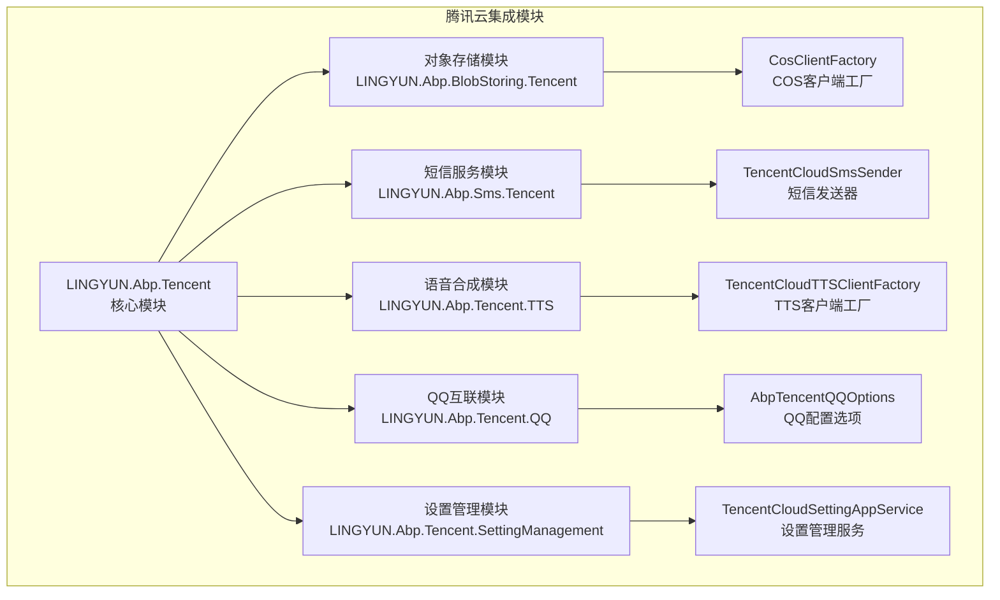
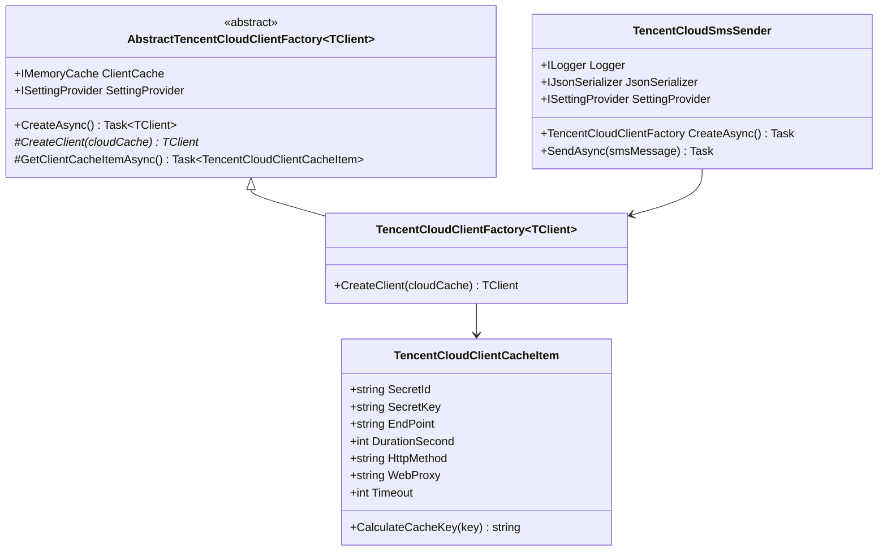
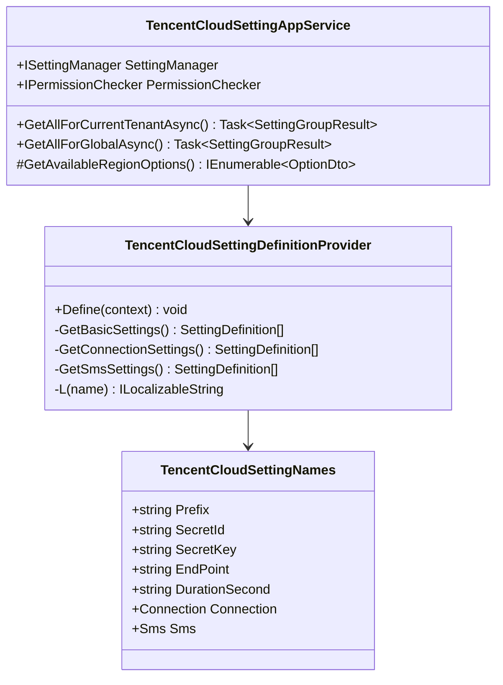
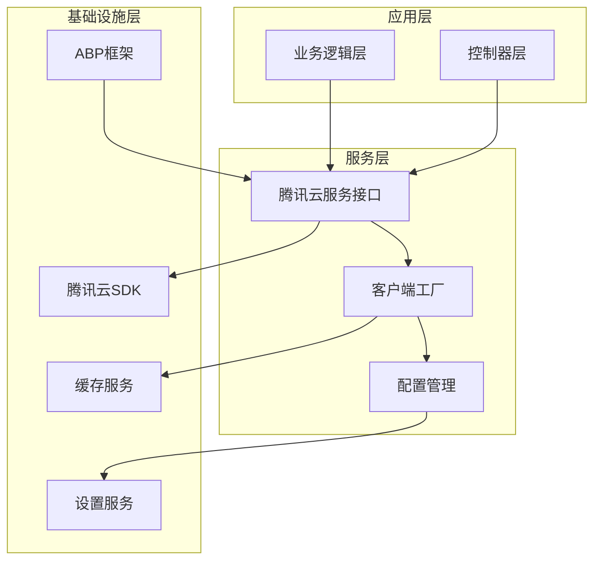
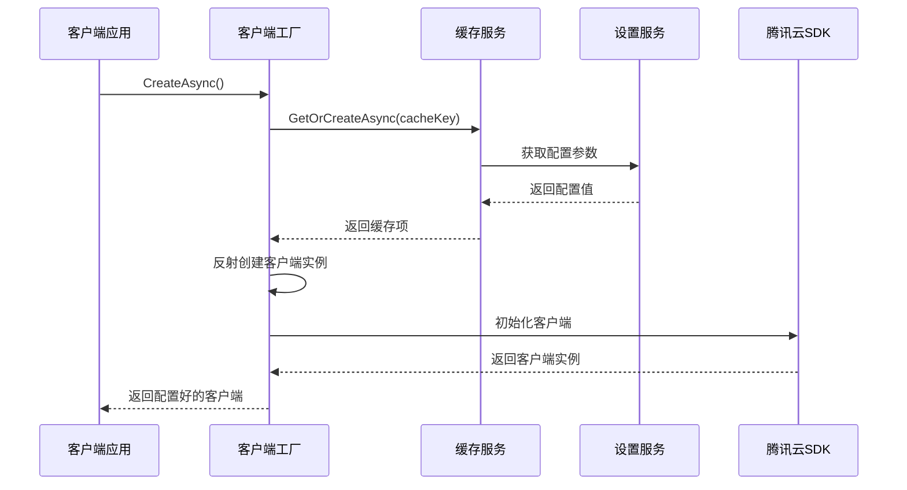
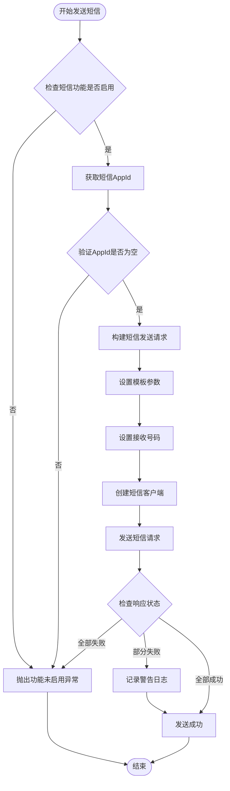
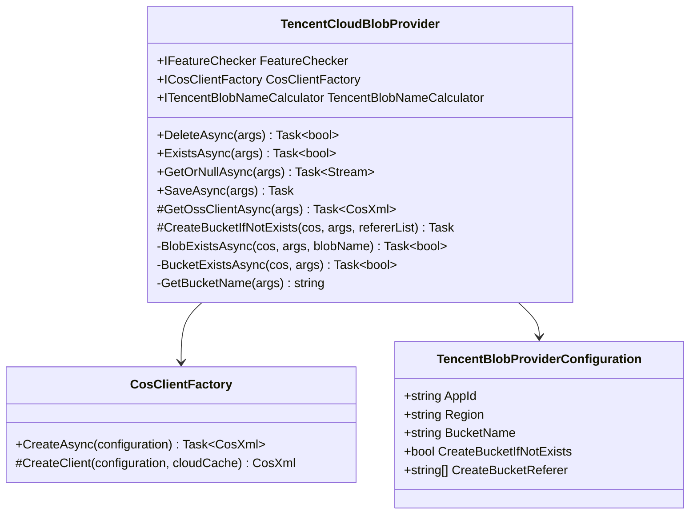
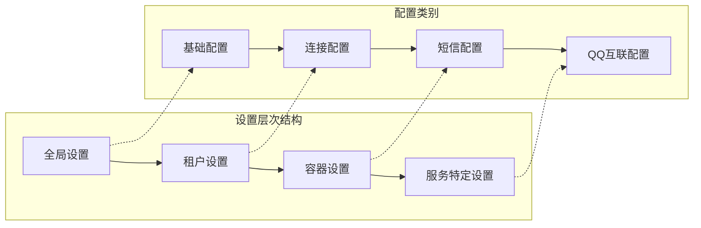
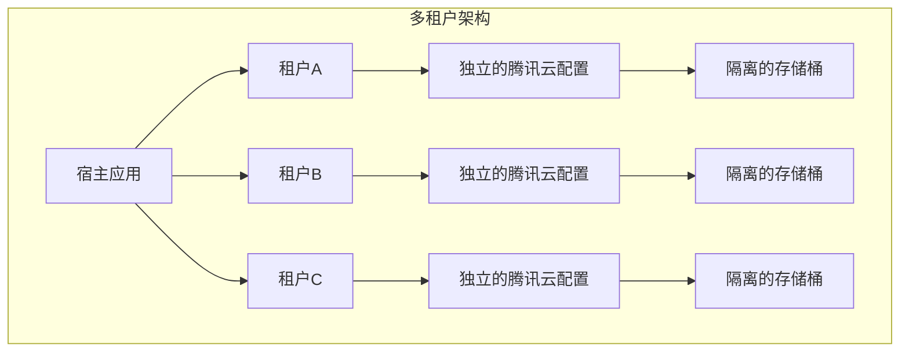
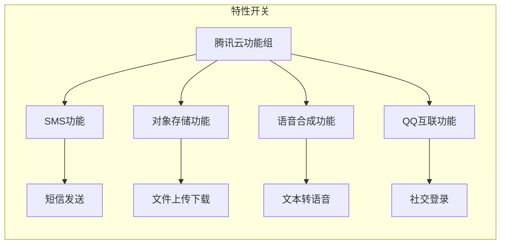

# 腾讯云集成模块技术文档

<cite>
**本文档中引用的文件**
- [README.md](file://aspnet-core/framework/cloud-tencent/README.md)
- [AbpTencentCloudModule.cs](file://aspnet-core/framework/cloud-tencent/LINGYUN.Abp.Tencent/LINGYUN/Abp/Tencent/AbpTencentCloudModule.cs)
- [TencentCloudClientFactory.cs](file://aspnet-core/framework/cloud-tencent/LINGYUN.Abp.Tencent/LINGYUN/Abp/Tencent/TencentCloudClientFactory.cs)
- [AbstractTencentCloudClientFactory.cs](file://aspnet-core/framework/cloud-tencent/LINGYUN.Abp.Tencent/LINGYUN/Abp/Tencent/AbstractTencentCloudClientFactory.cs)
- [TencentCloudSettingDefinitionProvider.cs](file://aspnet-core/framework/cloud-tencent/LINGYUN.Abp.Tencent/LINGYUN/Abp/Tencent/Settings/TencentCloudSettingDefinitionProvider.cs)
- [TencentCloudSettingNames.cs](file://aspnet-core/framework/cloud-tencent/LINGYUN.Abp.Tencent/LINGYUN/Abp/Tencent/Settings/TencentCloudSettingNames.cs)
- [TencentCloudSmsSender.cs](file://aspnet-core/framework/cloud-tencent/LINGYUN.Abp.Sms.Tencent/LINGYUN/Abp/Sms/Tencent/TencentCloudSmsSender.cs)
- [TencentCloudBlobProvider.cs](file://aspnet-core/framework/cloud-tencent/LINGYUN.Abp.BlobStoring.Tencent/LINGYUN/Abp/BlobStoring/Tencent/TencentCloudBlobProvider.cs)
- [TencentBlobProviderConfiguration.cs](file://aspnet-core/framework/cloud-tencent/LINGYUN.Abp.BlobStoring.Tencent/LINGYUN/Abp/BlobStoring/Tencent/TencentBlobProviderConfiguration.cs)
- [TencentCloudTTSClientFactory.cs](file://aspnet-core/framework/cloud-tencent/LINGYUN.Abp.Tencent.TTS/LINGYUN/Abp/Tencent/TTS/TencentCloudTTSClientFactory.cs)
- [TencentCloudSettingAppService.cs](file://aspnet-core/framework/cloud-tencent/LINGYUN.Abp.Tencent.SettingManagement/LINGYUN/Abp/Tencent/SettingManagement/TencentCloudSettingAppService.cs)
- [TencentCloudFeatures.cs](file://aspnet-core/framework/cloud-tencent/LINGYUN.Abp.Tencent/LINGYUN/Abp/Tencent/Features/TencentCloudFeatures.cs)
</cite>

## 目录
1. [简介](#简介)
2. [项目结构](#项目结构)
3. [核心组件](#核心组件)
4. [架构概览](#架构概览)
5. [详细组件分析](#详细组件分析)
6. [配置管理](#配置管理)
7. [服务集成](#服务集成)
8. [最佳实践](#最佳实践)
9. [故障排除](#故障排除)
10. [总结](#总结)

## 简介

LINGYUN.Abp.Tencent 是一个完整的腾讯云服务集成模块，为 ABP 框架提供了与腾讯云各项服务的无缝集成能力。该模块集成了对象存储（COS）、短信服务、语音合成（TTS）、QQ 互联等多种腾讯云核心服务，通过统一的配置管理和客户端工厂模式，简化了云服务的使用和维护。

该模块的主要特点包括：
- **统一的客户端工厂**：支持动态创建腾讯云各服务的客户端实例
- **多租户支持**：完整的多租户配置和隔离机制
- **配置管理**：基于 ABP 设置系统的灵活配置管理
- **特性开关**：支持按需启用或禁用特定功能
- **缓存优化**：智能的客户端实例缓存机制
- **错误处理**：完善的异常处理和日志记录

## 项目结构

腾讯云集成模块采用分层架构设计，每个子模块专注于特定的功能领域：

**图表来源**
- [README.md](file://aspnet-core/framework/cloud-tencent/README.md#L1-L43)

**章节来源**
- [README.md](file://aspnet-core/framework/cloud-tencent/README.md#L1-L43)

## 核心组件

### 客户端工厂系统

腾讯云集成的核心是客户端工厂系统，它负责创建和管理腾讯云各服务的客户端实例：

**图表来源**
- [AbstractTencentCloudClientFactory.cs](file://aspnet-core/framework/cloud-tencent/LINGYUN.Abp.Tencent/LINGYUN/Abp/Tencent/AbstractTencentCloudClientFactory.cs#L1-L125)
- [TencentCloudClientFactory.cs](file://aspnet-core/framework/cloud-tencent/LINGYUN.Abp.Tencent/LINGYUN/Abp/Tencent/TencentCloudClientFactory.cs#L1-L55)
- [TencentCloudSmsSender.cs](file://aspnet-core/framework/cloud-tencent/LINGYUN.Abp.Sms.Tencent/LINGYUN/Abp/Sms/Tencent/TencentCloudSmsSender.cs#L21-L103)

### 配置管理系统

配置管理系统提供了完整的设置定义和管理功能：

**图表来源**
- [TencentCloudSettingDefinitionProvider.cs](file://aspnet-core/framework/cloud-tencent/LINGYUN.Abp.Tencent/LINGYUN/Abp/Tencent/Settings/TencentCloudSettingDefinitionProvider.cs#L1-L164)
- [TencentCloudSettingNames.cs](file://aspnet-core/framework/cloud-tencent/LINGYUN.Abp.Tencent/LINGYUN/Abp/Tencent/Settings/TencentCloudSettingNames.cs#L1-L66)
- [TencentCloudSettingAppService.cs](file://aspnet-core/framework/cloud-tencent/LINGYUN.Abp.Tencent.SettingManagement/LINGYUN/Abp/Tencent/SettingManagement/TencentCloudSettingAppService.cs#L1-L203)

**章节来源**
- [AbstractTencentCloudClientFactory.cs](file://aspnet-core/framework/cloud-tencent/LINGYUN.Abp.Tencent/LINGYUN/Abp/Tencent/AbstractTencentCloudClientFactory.cs#L1-L125)
- [TencentCloudSettingDefinitionProvider.cs](file://aspnet-core/framework/cloud-tencent/LINGYUN.Abp.Tencent/LINGYUN/Abp/Tencent/Settings/TencentCloudSettingDefinitionProvider.cs#L1-L164)
- [TencentCloudSettingAppService.cs](file://aspnet-core/framework/cloud-tencent/LINGYUN.Abp.Tencent.SettingManagement/LINGYUN/Abp/Tencent/SettingManagement/TencentCloudSettingAppService.cs#L1-L203)

## 架构概览

腾讯云集成模块采用了分层架构设计，确保了模块的可扩展性和可维护性：

**图表来源**
- [AbpTencentCloudModule.cs](file://aspnet-core/framework/cloud-tencent/LINGYUN.Abp.Tencent/LINGYUN/Abp/Tencent/AbpTencentCloudModule.cs#L1-L41)
- [TencentCloudClientFactory.cs](file://aspnet-core/framework/cloud-tencent/LINGYUN.Abp.Tencent/LINGYUN/Abp/Tencent/TencentCloudClientFactory.cs#L1-L55)

## 详细组件分析

### 客户端工厂实现

客户端工厂系统是整个模块的核心，它通过反射机制动态创建腾讯云各服务的客户端实例：

**图表来源**
- [AbstractTencentCloudClientFactory.cs](file://aspnet-core/framework/cloud-tencent/LINGYUN.Abp.Tencent/LINGYUN/Abp/Tencent/AbstractTencentCloudClientFactory.cs#L30-L50)
- [TencentCloudClientFactory.cs](file://aspnet-core/framework/cloud-tencent/LINGYUN.Abp.Tencent/LINGYUN/Abp/Tencent/TencentCloudClientFactory.cs#L15-L45)

### 短信服务集成

短信服务模块提供了完整的腾讯云短信发送功能：

**图表来源**
- [TencentCloudSmsSender.cs](file://aspnet-core/framework/cloud-tencent/LINGYUN.Abp.Sms.Tencent/LINGYUN/Abp/Sms/Tencent/TencentCloudSmsSender.cs#L42-L95)

### 对象存储集成

对象存储模块实现了完整的腾讯云COS服务集成：

**图表来源**
- [TencentCloudBlobProvider.cs](file://aspnet-core/framework/cloud-tencent/LINGYUN.Abp.BlobStoring.Tencent/LINGYUN/Abp/BlobStoring/Tencent/TencentCloudBlobProvider.cs#L17-L183)
- [TencentBlobProviderConfiguration.cs](file://aspnet-core/framework/cloud-tencent/LINGYUN.Abp.BlobStoring.Tencent/LINGYUN/Abp/BlobStoring/Tencent/TencentBlobProviderConfiguration.cs#L1-L63)

**章节来源**
- [TencentCloudSmsSender.cs](file://aspnet-core/framework/cloud-tencent/LINGYUN.Abp.Sms.Tencent/LINGYUN/Abp/Sms/Tencent/TencentCloudSmsSender.cs#L42-L95)
- [TencentCloudBlobProvider.cs](file://aspnet-core/framework/cloud-tencent/LINGYUN.Abp.BlobStoring.Tencent/LINGYUN/Abp/BlobStoring/Tencent/TencentCloudBlobProvider.cs#L17-L183)

## 配置管理

### 设置定义结构

腾讯云模块提供了完整的设置定义体系，支持多层级配置：

**图表来源**
- [TencentCloudSettingDefinitionProvider.cs](file://aspnet-core/framework/cloud-tencent/LINGYUN.Abp.Tencent/LINGYUN/Abp/Tencent/Settings/TencentCloudSettingDefinitionProvider.cs#L10-L164)

### 配置参数详解

#### 基础配置参数

| 参数名称 | 描述 | 默认值 | 类型 |
|---------|------|--------|------|
| SecretId | 腾讯云访问密钥ID | 必填 | 字符串 |
| SecretKey | 腾讯云访问密钥 | 必填 | 字符串 |
| EndPoint | 服务区域端点 | ap-guangzhou | 字符串 |
| DurationSecond | 会话持续时间 | 600秒 | 数字 |

#### 连接配置参数

| 参数名称 | 描述 | 默认值 | 类型 |
|---------|------|--------|------|
| HttpMethod | HTTP请求方法 | POST | 字符串 |
| Timeout | 请求超时时间 | 60秒 | 数字 |
| WebProxy | 代理服务器地址 | 无 | 字符串 |

#### 短信服务配置

| 参数名称 | 描述 | 默认值 | 类型 |
|---------|------|--------|------|
| AppId | 短信应用ID | 必填 | 字符串 |
| DefaultSignName | 默认签名名称 | 必填 | 字符串 |
| DefaultTemplateId | 默认模板ID | 必填 | 字符串 |

**章节来源**
- [TencentCloudSettingDefinitionProvider.cs](file://aspnet-core/framework/cloud-tencent/LINGYUN.Abp.Tencent/LINGYUN/Abp/Tencent/Settings/TencentCloudSettingDefinitionProvider.cs#L10-L164)
- [TencentCloudSettingNames.cs](file://aspnet-core/framework/cloud-tencent/LINGYUN.Abp.Tencent/LINGYUN/Abp/Tencent/Settings/TencentCloudSettingNames.cs#L1-L66)

## 服务集成

### 多租户支持

腾讯云集成模块完全支持ABP框架的多租户架构：

### 特性管理

模块提供了完整的特性开关机制：

**图表来源**
- [TencentCloudFeatures.cs](file://aspnet-core/framework/cloud-tencent/LINGYUN.Abp.Tencent/LINGYUN/Abp/Tencent/Features/TencentCloudFeatures.cs#L1-L28)

**章节来源**
- [TencentCloudFeatures.cs](file://aspnet-core/framework/cloud-tencent/LINGYUN.Abp.Tencent/LINGYUN/Abp/Tencent/Features/TencentCloudFeatures.cs#L1-L28)

## 最佳实践

### 客户端实例管理

1. **使用依赖注入**：通过ABP的依赖注入系统获取客户端实例
2. **避免重复创建**：利用内置的缓存机制，避免重复创建客户端实例
3. **异常处理**：实现完善的异常处理和重试机制

### 配置安全

1. **密钥加密**：敏感配置如SecretId和SecretKey自动加密存储
2. **权限控制**：通过权限系统控制配置的读写访问
3. **环境隔离**：开发、测试、生产环境使用不同的配置

### 性能优化

1. **连接池管理**：合理配置连接池大小和超时时间
2. **缓存策略**：利用内存缓存减少重复的配置加载
3. **异步操作**：所有云服务调用都采用异步模式

### 监控和日志

1. **请求追踪**：记录所有云服务调用的详细信息
2. **性能监控**：监控API调用延迟和成功率
3. **错误告警**：及时发现和处理服务异常

## 故障排除

### 常见问题及解决方案

#### 1. 客户端创建失败

**症状**：无法创建腾讯云客户端实例
**原因**：配置参数错误或网络连接问题
**解决方案**：
- 检查SecretId和SecretKey是否正确
- 验证网络连接和防火墙设置
- 查看日志获取详细错误信息

#### 2. 短信发送失败

**症状**：短信发送请求返回错误
**原因**：模板参数不匹配或签名未审核通过
**解决方案**：
- 确认短信模板和签名已通过腾讯云审核
- 检查模板参数是否符合要求
- 验证手机号格式是否正确

#### 3. 对象存储访问失败

**症状**：无法上传或下载文件
**原因**：存储桶权限或网络问题
**解决方案**：
- 检查存储桶是否存在且权限正确
- 验证网络连接和DNS解析
- 查看防盗链配置是否正确

### 调试技巧

1. **启用详细日志**：设置日志级别为Debug或Trace
2. **使用调试工具**：利用HTTP调试工具分析请求响应
3. **模拟环境**：在测试环境中复现问题

**章节来源**
- [TencentCloudSmsSender.cs](file://aspnet-core/framework/cloud-tencent/LINGYUN.Abp.Sms.Tencent/LINGYUN/Abp/Sms/Tencent/TencentCloudSmsSender.cs#L75-L95)
- [TencentCloudBlobProvider.cs](file://aspnet-core/framework/cloud-tencent/LINGYUN.Abp.BlobStoring.Tencent/LINGYUN/Abp/BlobStoring/Tencent/TencentCloudBlobProvider.cs#L77-L85)

## 总结

腾讯云集成模块为ABP框架提供了完整而强大的腾讯云服务集成能力。通过统一的客户端工厂、灵活的配置管理和完善的错误处理机制，开发者可以轻松地在应用中集成腾讯云的各项服务。

### 主要优势

1. **统一管理**：通过单一接口管理多个腾讯云服务
2. **配置灵活**：支持多层级配置和动态更新
3. **性能优化**：内置缓存和连接池管理
4. **安全可靠**：完善的权限控制和异常处理
5. **易于扩展**：模块化设计便于添加新的服务支持

### 适用场景

- 需要集成腾讯云对象存储的应用
- 实现短信通知功能的系统
- 需要语音合成服务的应用
- 社交登录和用户认证场景
- 多租户架构的云服务平台

通过遵循本文档提供的最佳实践和配置指南，开发者可以充分利用腾讯云集成模块的强大功能，构建高质量的企业级应用系统。