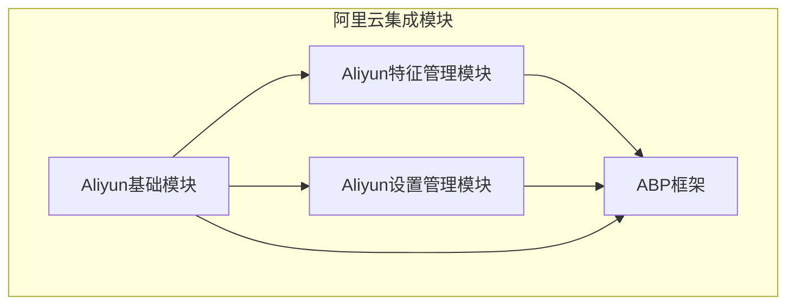
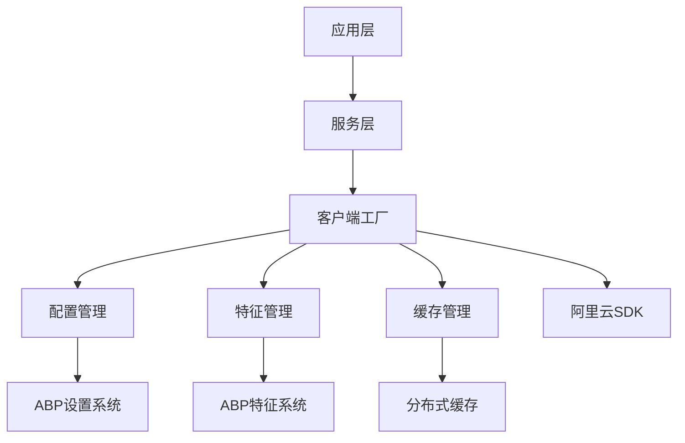
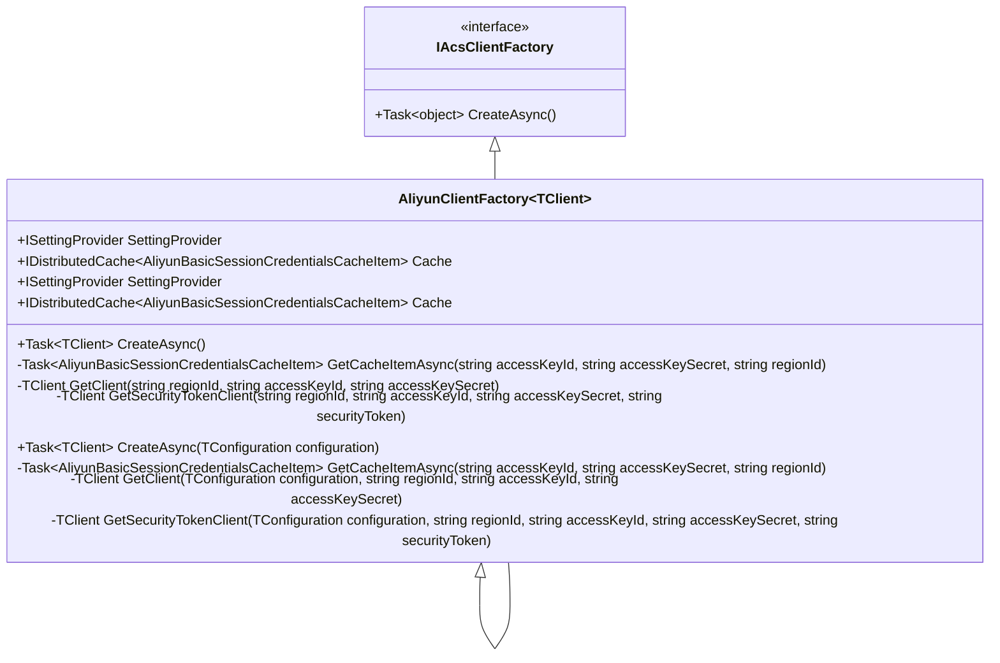
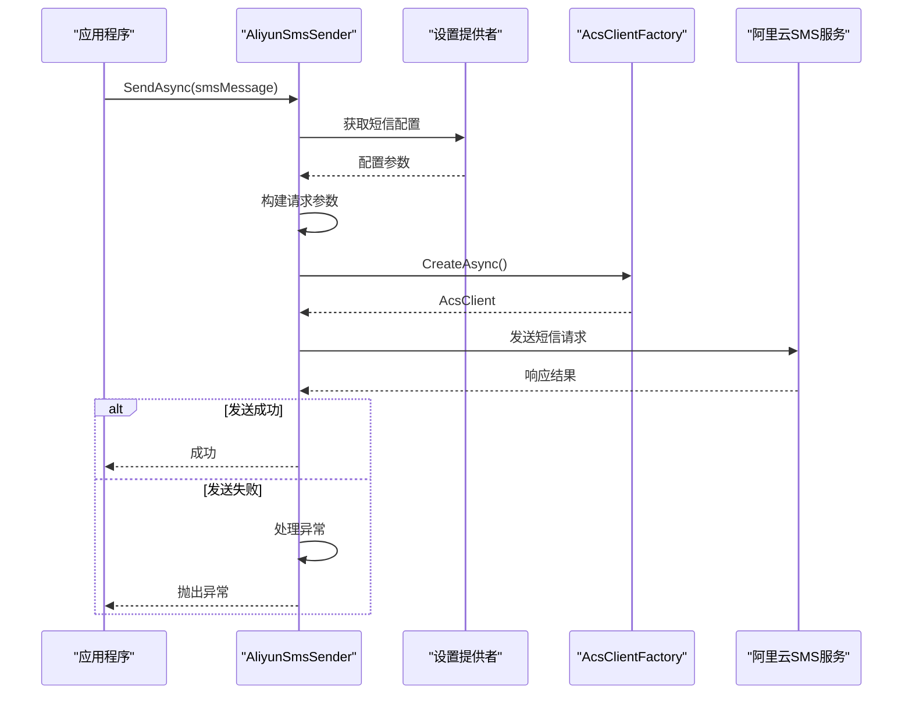
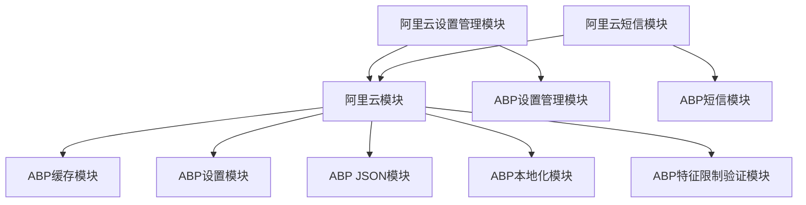

# 阿里云集成

<cite>
**本文档引用的文件**  
- [AbpAliyunModule.cs](file://aspnet-core/framework/cloud-aliyun/LINGYUN.Abp.Aliyun/LINGYUN/Abp/Aliyun/AbpAliyunModule.cs)
- [AliyunClientFactory.cs](file://aspnet-core/framework/cloud-aliyun/LINGYUN.Abp.Aliyun/LINGYUN/Abp/Aliyun/AliyunClientFactory.cs)
- [AliyunSettingNames.cs](file://aspnet-core/framework/cloud-aliyun/LINGYUN.Abp.Aliyun/LINGYUN/Abp/Aliyun/Settings/AliyunSettingNames.cs)
- [AliyunSettingProvider.cs](file://aspnet-core/framework/cloud-aliyun/LINGYUN.Abp.Aliyun/LINGYUN/Abp/Aliyun/Settings/AliyunSettingProvider.cs)
- [AliyunFeatureNames.cs](file://aspnet-core/framework/cloud-aliyun/LINGYUN.Abp.Aliyun/LINGYUN/Abp/Aliyun/Features/AliyunFeatureNames.cs)
- [AliyunFeatureDefinitionProvider.cs](file://aspnet-core/framework/cloud-aliyun/LINGYUN.Abp.Aliyun/LINGYUN/Abp/Aliyun/Features/AliyunFeatureDefinitionProvider.cs)
- [AliyunSettingAppService.cs](file://aspnet-core/framework/cloud-aliyun/LINGYUN.Abp.Aliyun.SettingManagement/LINGYUN/Abp/Aliyun/SettingManagement/AliyunSettingAppService.cs)
- [AliyunSmsSender.cs](file://aspnet-core/framework/common/LINGYUN.Abp.Sms.Aliyun/LINGYUN/Abp/Sms/Aliyun/AliyunSmsSender.cs)
- [AliyunSmsResponse.cs](file://aspnet-core/framework/common/LINGYUN.Abp.Sms.Aliyun/LINGYUN/Abp/Sms/Aliyun/AliyunSmsResponse.cs)
- [AliyunBasicSessionCredentialsCacheItem.cs](file://aspnet-core/framework/cloud-aliyun/LINGYUN.Abp.Aliyun/LINGYUN/Abp/Aliyun/AliyunBasicSessionCredentialsCacheItem.cs)
- [README.md](file://aspnet-core/framework/cloud-aliyun/LINGYUN.Abp.Aliyun/README.md)
- [README.md](file://aspnet-core/framework/cloud-aliyun/LINGYUN.Abp.Aliyun.SettingManagement/README.md)
</cite>

## 目录
1. [简介](#简介)
2. [项目结构](#项目结构)
3. [核心组件](#核心组件)
4. [架构概述](#架构概述)
5. [详细组件分析](#详细组件分析)
6. [依赖分析](#依赖分析)
7. [性能考虑](#性能考虑)
8. [故障排除指南](#故障排除指南)
9. [结论](#结论)

## 简介
本文档详细介绍了在ABP框架中集成阿里云服务的技术实现。文档涵盖了阿里云SDK的封装机制、服务注册与配置管理，包括OSS对象存储、短信服务、特征管理等核心功能的集成方式。深入解析了Aliyun模块的技术架构、配置参数和使用场景，涵盖服务凭证配置、区域选择、客户端初始化等关键环节。为开发者提供阿里云集成的最佳实践指南，包括如何处理网络异常、实现服务降级和熔断、监控调用性能以及安全配置建议。

## 项目结构
阿里云集成模块主要由三个核心组件构成：基础SDK集成模块、特征管理模块和设置管理模块。这些模块共同提供了完整的阿里云服务集成能力。



**图示来源**
- [README.md](file://aspnet-core/framework/cloud-aliyun/LINGYUN.Abp.Aliyun/README.md)

**本节来源**
- [README.md](file://aspnet-core/framework/cloud-aliyun/LINGYUN.Abp.Aliyun/README.md)
- [README.md](file://aspnet-core/framework/cloud-aliyun/LINGYUN.Abp.Aliyun.SettingManagement/README.md)

## 核心组件
阿里云集成模块的核心组件包括客户端工厂、配置管理、特征管理和异常处理机制。这些组件共同实现了安全、高效和可配置的阿里云服务访问。

**本节来源**
- [AliyunClientFactory.cs](file://aspnet-core/framework/cloud-aliyun/LINGYUN.Abp.Aliyun/LINGYUN/Abp/Aliyun/AliyunClientFactory.cs)
- [AliyunSettingProvider.cs](file://aspnet-core/framework/cloud-aliyun/LINGYUN.Abp.Aliyun/LINGYUN/Abp/Aliyun/Settings/AliyunSettingProvider.cs)
- [AliyunFeatureDefinitionProvider.cs](file://aspnet-core/framework/cloud-aliyun/LINGYUN.Abp.Aliyun/LINGYUN/Abp/Aliyun/Features/AliyunFeatureDefinitionProvider.cs)

## 架构概述
阿里云集成模块采用分层架构设计，从基础SDK封装到高层应用服务，提供了完整的阿里云服务集成解决方案。



**图示来源**
- [AbpAliyunModule.cs](file://aspnet-core/framework/cloud-aliyun/LINGYUN.Abp.Aliyun/LINGYUN/Abp/Aliyun/AbpAliyunModule.cs)
- [AliyunClientFactory.cs](file://aspnet-core/framework/cloud-aliyun/LINGYUN.Abp.Aliyun/LINGYUN/Abp/Aliyun/AliyunClientFactory.cs)

## 详细组件分析

### 客户端工厂分析
客户端工厂是阿里云集成的核心，负责创建和管理阿里云服务客户端实例。

#### 客户端工厂类图


**图示来源**
- [AliyunClientFactory.cs](file://aspnet-core/framework/cloud-aliyun/LINGYUN.Abp.Aliyun/LINGYUN/Abp/Aliyun/AliyunClientFactory.cs)

**本节来源**
- [AliyunClientFactory.cs](file://aspnet-core/framework/cloud-aliyun/LINGYUN.Abp.Aliyun/LINGYUN/Abp/Aliyun/AliyunClientFactory.cs)

### 配置管理分析
配置管理组件负责定义和管理阿里云服务的所有配置参数。

#### 配置参数表
| 配置项 | 说明 | 类型 | 默认值 | 是否必需 |
|-------|------|------|-------|---------|
| **认证配置** | | | | |
| AliyunSettingNames.Authorization.RegionId | 阿里云服务区域 | 可选 | oss-cn-hangzhou | 否 |
| AliyunSettingNames.Authorization.AccessKeyId | RAM账号的AccessKey ID | 必须 | 无 | 是 |
| AliyunSettingNames.Authorization.AccessKeySecret | RAM账号的AccessKey Secret | 必须 | 无 | 是 |
| AliyunSettingNames.Authorization.UseSecurityTokenService | 是否使用STS Token访问 | 可选 | true | 否 |
| AliyunSettingNames.Authorization.RamRoleArn | RAM角色ARN | 启用STS时必须 | 无 | 是 |
| AliyunSettingNames.Authorization.RoleSessionName | 用户自定义令牌名称 | 可选 | 无 | 否 |
| AliyunSettingNames.Authorization.DurationSeconds | 令牌过期时间（秒） | 可选 | 3600 | 否 |
| AliyunSettingNames.Authorization.Policy | 权限策略 | 可选 | 无 | 否 |
| **短信服务配置** | | | | |
| AliyunSettingNames.Sms.Domain | 短信服务域名 | 可选 | dysmsapi.aliyuncs.com | 否 |
| AliyunSettingNames.Sms.Version | API版本 | 可选 | 2017-05-25 | 否 |
| AliyunSettingNames.Sms.ActionName | API方法名 | 可选 | SendSms | 否 |
| AliyunSettingNames.Sms.DefaultSignName | 默认短信签名 | 可选 | 无 | 否 |
| AliyunSettingNames.Sms.DefaultTemplateCode | 默认短信模板代码 | 可选 | 无 | 否 |
| AliyunSettingNames.Sms.DefaultPhoneNumber | 默认接收号码 | 可选 | 无 | 否 |
| AliyunSettingNames.Sms.VisableErrorToClient | 是否向客户端显示错误 | 可选 | false | 否 |

**本节来源**
- [AliyunSettingNames.cs](file://aspnet-core/framework/cloud-aliyun/LINGYUN.Abp.Aliyun/LINGYUN/Abp/Aliyun/Settings/AliyunSettingNames.cs)
- [AliyunSettingProvider.cs](file://aspnet-core/framework/cloud-aliyun/LINGYUN.Abp.Aliyun/LINGYUN/Abp/Aliyun/Settings/AliyunSettingProvider.cs)

### 特征管理分析
特征管理组件提供了基于功能的访问控制和限制管理。

#### 特征管理类图
```mermaid
classDiagram
class AliyunFeatureNames {
+const string GroupName
+const string Enable
+class Sms {
+const string Enable
+const string SendLimit
+const string SendLimitInterval
+const int DefaultSendLimit
+const int DefaultSendLimitInterval
}
+class BlobStoring {
+const string Enable
}
}
class AliyunFeatureDefinitionProvider {
+void Define(IFeatureDefinitionContext context)
-ILocalizableString L(string name)
}
AliyunFeatureDefinitionProvider --> AliyunFeatureNames : "使用"
```

**图示来源**
- [AliyunFeatureNames.cs](file://aspnet-core/framework/cloud-aliyun/LINGYUN.Abp.Aliyun/LINGYUN/Abp/Aliyun/Features/AliyunFeatureNames.cs)
- [AliyunFeatureDefinitionProvider.cs](file://aspnet-core/framework/cloud-aliyun/LINGYUN.Abp.Aliyun/LINGYUN/Abp/Aliyun/Features/AliyunFeatureDefinitionProvider.cs)

**本节来源**
- [AliyunFeatureNames.cs](file://aspnet-core/framework/cloud-aliyun/LINGYUN.Abp.Aliyun/LINGYUN/Abp/Aliyun/Features/AliyunFeatureNames.cs)
- [AliyunFeatureDefinitionProvider.cs](file://aspnet-core/framework/cloud-aliyun/LINGYUN.Abp.Aliyun/LINGYUN/Abp/Aliyun/Features/AliyunFeatureDefinitionProvider.cs)

### 短信服务分析
短信服务组件实现了基于阿里云SMS API的短信发送功能。

#### 短信发送序列图


**图示来源**
- [AliyunSmsSender.cs](file://aspnet-core/framework/common/LINGYUN.Abp.Sms.Aliyun/LINGYUN/Abp/Sms/Aliyun/AliyunSmsSender.cs)

**本节来源**
- [AliyunSmsSender.cs](file://aspnet-core/framework/common/LINGYUN.Abp.Sms.Aliyun/LINGYUN/Abp/Sms/Aliyun/AliyunSmsSender.cs)
- [AliyunSmsResponse.cs](file://aspnet-core/framework/common/LINGYUN.Abp.Sms.Aliyun/LINGYUN/Abp/Sms/Aliyun/AliyunSmsResponse.cs)

## 依赖分析
阿里云集成模块依赖于ABP框架的核心组件，并与其他模块形成紧密的集成关系。



**图示来源**
- [AbpAliyunModule.cs](file://aspnet-core/framework/cloud-aliyun/LINGY