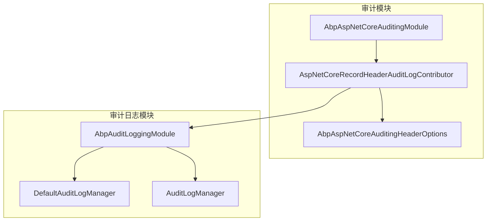
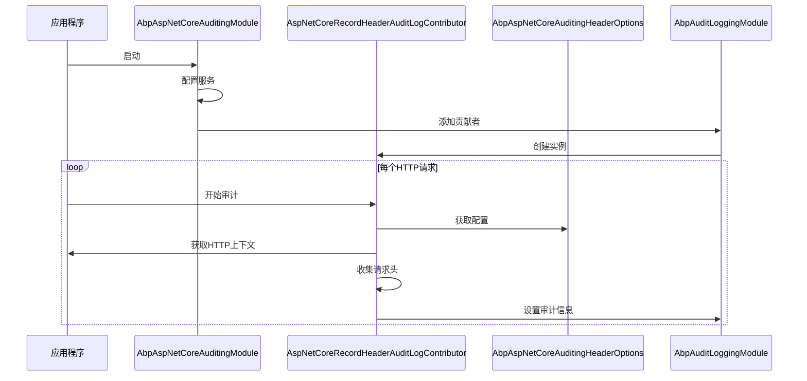
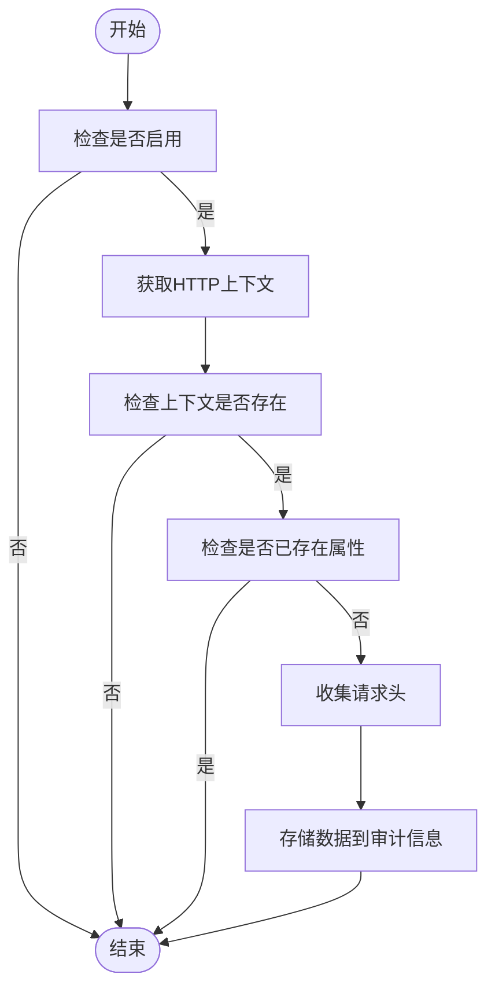
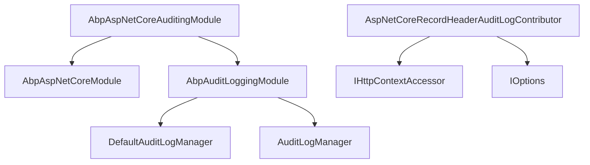

# ASP.NET Core 审计

<cite>
**本文档中引用的文件**  
- [AbpAspNetCoreAuditingModule.cs](file://aspnet-core/framework/auditing/LINGYUN.Abp.AspNetCore.Auditing/LINGYUN/Abp/AspNetCore/Auditing/AbpAspNetCoreAuditingModule.cs)
- [AspNetCoreRecordHeaderAuditLogContributor.cs](file://aspnet-core/framework/auditing/LINGYUN.Abp.AspNetCore.Auditing/LINGYUN/Abp/AspNetCore/Auditing/AspNetCoreRecordHeaderAuditLogContributor.cs)
- [AbpAspNetCoreAuditingHeaderOptions.cs](file://aspnet-core/framework/auditing/LINGYUN.Abp.AspNetCore.Auditing/LINGYUN/Abp/AspNetCore/Auditing/AbpAspNetCoreAuditingHeaderOptions.cs)
- [AbpAuditLoggingModule.cs](file://aspnet-core/framework/auditing/LINGYUN.Abp.AuditLogging/LINGYUN/Abp/AuditLogging/AbpAuditLoggingModule.cs)
- [DefaultAuditLogManager.cs](file://aspnet-core/framework/auditing/LINGYUN.Abp.AuditLogging/LINGYUN/Abp/AuditLogging/DefaultAuditLogManager.cs)
- [AuditLogManager.cs](file://aspnet-core/framework/auditing/LINGYUN.Abp.AuditLogging.EntityFrameworkCore/LINGYUN/Abp/AuditLogging/EntityFrameworkCore/AuditLogManager.cs)
- [AuditLogAppService.cs](file://aspnet-core/modules/auditing/LINGYUN.Abp.Auditing.Application/LINGYUN/Abp/Auditing/AuditLogs/AuditLogAppService.cs)
- [AuditLogController.cs](file://aspnet-core/modules/auditing/LINGYUN.Abp.Auditing.HttpApi/LINGYUN/Abp/Auditing/AuditLogs/AuditLogController.cs)
- [README.md](file://aspnet-core/framework/auditing/LINGYUN.Abp.AspNetCore.Auditing/README.md)
</cite>

## 目录
1. [简介](#简介)
2. [项目结构](#项目结构)
3. [核心组件](#核心组件)
4. [架构概述](#架构概述)
5. [详细组件分析](#详细组件分析)
6. [依赖分析](#依赖分析)
7. [性能考虑](#性能考虑)
8. [故障排除指南](#故障排除指南)
9. [结论](#结论)

## 简介
LINGYUN.Abp.AspNetCore.Auditing 模块是 ABP 框架中用于 ASP.NET Core 应用程序的审计功能扩展。该模块专注于在审计日志中记录 HTTP 请求头信息，为开发者提供了一种灵活的方式来监控和分析应用程序的 HTTP 通信。通过该模块，开发者可以配置哪些 HTTP 请求头需要被记录，并在审计日志中查看这些信息，从而更好地理解客户端与服务器之间的交互。

## 项目结构
该模块位于 `aspnet-core/framework/auditing` 目录下，主要包含 ASP.NET Core 审计相关的功能实现。模块通过 `AbpAspNetCoreAuditingModule` 类进行注册和配置，利用 `AspNetCoreRecordHeaderAuditLogContributor` 贡献者来收集 HTTP 请求头信息。审计数据的存储和管理由 `AbpAuditLogging` 模块负责，该模块提供了多种数据存储选项，包括 Entity Framework Core 和 Elasticsearch。

**图源**
- [AbpAspNetCoreAuditingModule.cs](file://aspnet-core/framework/auditing/LINGYUN.Abp.AspNetCore.Auditing/LINGYUN/Abp/AspNetCore/Auditing/AbpAspNetCoreAuditingModule.cs)
- [AspNetCoreRecordHeaderAuditLogContributor.cs](file://aspnet-core/framework/auditing/LINGYUN.Abp.AspNetCore.Auditing/LINGYUN/Abp/AspNetCore/Auditing/AspNetCoreRecordHeaderAuditLogContributor.cs)
- [AbpAspNetCoreAuditingHeaderOptions.cs](file://aspnet-core/framework/auditing/LINGYUN.Abp.AspNetCore.Auditing/LINGYUN/Abp/AspNetCore/Auditing/AbpAspNetCoreAuditingHeaderOptions.cs)
- [AbpAuditLoggingModule.cs](file://aspnet-core/framework/auditing/LINGYUN.Abp.AuditLogging/LINGYUN/Abp/AuditLogging/AbpAuditLoggingModule.cs)
- [DefaultAuditLogManager.cs](file://aspnet-core/framework/auditing/LINGYUN.Abp.AuditLogging/LINGYUN/Abp/AuditLogging/DefaultAuditLogManager.cs)
- [AuditLogManager.cs](file://aspnet-core/framework/auditing/LINGYUN.Abp.AuditLogging.EntityFrameworkCore/LINGYUN/Abp/AuditLogging/EntityFrameworkCore/AuditLogManager.cs)

**节源**
- [AbpAspNetCoreAuditingModule.cs](file://aspnet-core/framework/auditing/LINGYUN.Abp.AspNetCore.Auditing/LINGYUN/Abp/AspNetCore/Auditing/AbpAspNetCoreAuditingModule.cs)
- [AbpAuditLoggingModule.cs](file://aspnet-core/framework/auditing/LINGYUN.Abp.AuditLogging/LINGYUN/Abp/AuditLogging/AbpAuditLoggingModule.cs)

## 核心组件
LINGYUN.Abp.AspNetCore.Auditing 模块的核心组件包括 `AbpAspNetCoreAuditingModule`、`AspNetCoreRecordHeaderAuditLogContributor` 和 `AbpAspNetCoreAuditingHeaderOptions`。`AbpAspNetCoreAuditingModule` 是模块的主类，负责在应用程序启动时注册审计功能。`AspNetCoreRecordHeaderAuditLogContributor` 是一个审计日志贡献者，它在审计日志创建前收集 HTTP 请求头信息。`AbpAspNetCoreAuditingHeaderOptions` 则提供了配置选项，允许开发者指定哪些 HTTP 请求头需要被记录。

**节源**
- [AbpAspNetCoreAuditingModule.cs](file://aspnet-core/framework/auditing/LINGYUN.Abp.AspNetCore.Auditing/LINGYUN/Abp/AspNetCore/Auditing/AbpAspNetCoreAuditingModule.cs)
- [AspNetCoreRecordHeaderAuditLogContributor.cs](file://aspnet-core/framework/auditing/LINGYUN.Abp.AspNetCore.Auditing/LINGYUN/Abp/AspNetCore/Auditing/AspNetCoreRecordHeaderAuditLogContributor.cs)
- [AbpAspNetCoreAuditingHeaderOptions.cs](file://aspnet-core/framework/auditing/LINGYUN.Abp.AspNetCore.Auditing/LINGYUN/Abp/AspNetCore/Auditing/AbpAspNetCoreAuditingHeaderOptions.cs)

## 架构概述
该模块的架构设计遵循了 ABP 框架的模块化原则。`AbpAspNetCoreAuditingModule` 依赖于 `AbpAspNetCoreModule`，确保在 ASP.NET Core 应用程序中正确集成审计功能。`AspNetCoreRecordHeaderAuditLogContributor` 实现了 `AuditLogContributor` 接口，通过 `PreContribute` 方法在审计日志创建前收集 HTTP 请求头信息。这些信息随后被存储在 `AuditLogInfo` 对象的 `ExtraProperties` 中，最终由 `AbpAuditLogging` 模块处理和存储。

**图源**
- [AbpAspNetCoreAuditingModule.cs](file://aspnet-core/framework/auditing/LINGYUN.Abp.AspNetCore.Auditing/LINGYUN/Abp/AspNetCore/Auditing/AbpAspNetCoreAuditingModule.cs)
- [AspNetCoreRecordHeaderAuditLogContributor.cs](file://aspnet-core/framework/auditing/LINGYUN.Abp.AspNetCore.Auditing/LINGYUN/Abp/AspNetCore/Auditing/AspNetCoreRecordHeaderAuditLogContributor.cs)
- [AbpAspNetCoreAuditingHeaderOptions.cs](file://aspnet-core/framework/auditing/LINGYUN.Abp.AspNetCore.Auditing/LINGYUN/Abp/AspNetCore/Auditing/AbpAspNetCoreAuditingHeaderOptions.cs)
- [AbpAuditLoggingModule.cs](file://aspnet-core/framework/auditing/LINGYUN.Abp.AuditLogging/LINGYUN/Abp/AuditLogging/AbpAuditLoggingModule.cs)

## 详细组件分析
### AspNetCoreRecordHeaderAuditLogContributor 分析
`AspNetCoreRecordHeaderAuditLogContributor` 是该模块的核心实现类，负责收集 HTTP 请求头信息。它通过 `IHttpContextAccessor` 获取当前 HTTP 上下文，并根据 `AbpAspNetCoreAuditingHeaderOptions` 的配置决定是否记录请求头。如果配置允许，它会遍历指定的请求头名称，从 `HttpRequest.Headers` 中获取相应的值，并将它们存储在审计信息的 `ExtraProperties` 中。

**图源**
- [AspNetCoreRecordHeaderAuditLogContributor.cs](file://aspnet-core/framework/auditing/LINGYUN.Abp.AspNetCore.Auditing/LINGYUN/Abp/AspNetCore/Auditing/AspNetCoreRecordHeaderAuditLogContributor.cs)
- [AbpAspNetCoreAuditingHeaderOptions.cs](file://aspnet-core/framework/auditing/LINGYUN.Abp.AspNetCore.Auditing/LINGYUN/Abp/AspNetCore/Auditing/AbpAspNetCoreAuditingHeaderOptions.cs)

**节源**
- [AspNetCoreRecordHeaderAuditLogContributor.cs](file://aspnet-core/framework/auditing/LINGYUN.Abp.AspNetCore.Auditing/LINGYUN/Abp/AspNetCore/Auditing/AspNetCoreRecordHeaderAuditLogContributor.cs)

### 配置选项分析
`AbpAspNetCoreAuditingHeaderOptions` 类提供了两个主要的配置选项：`IsEnabled` 和 `HttpHeaders`。`IsEnabled` 是一个布尔值，用于控制是否在审计日志中记录 HTTP 请求头，默认值为 `true`。`HttpHeaders` 是一个字符串列表，用于指定需要记录的 HTTP 请求头名称。开发者可以通过依赖注入在应用程序中配置这些选项，从而灵活地控制审计日志的内容。

**节源**
- [AbpAspNetCoreAuditingHeaderOptions.cs](file://aspnet-core/framework/auditing/LINGYUN.Abp.AspNetCore.Auditing/LINGYUN/Abp/AspNetCore/Auditing/AbpAspNetCoreAuditingHeaderOptions.cs)

## 依赖分析
该模块依赖于 ABP 框架的核心模块 `AbpAspNetCoreModule`，以确保在 ASP.NET Core 应用程序中正确集成。同时，它还依赖于 `AbpAuditLogging` 模块来处理审计日志的存储和管理。`AspNetCoreRecordHeaderAuditLogContributor` 依赖于 `IHttpContextAccessor` 来获取 HTTP 上下文，以及 `IOptions<AbpAspNetCoreAuditingHeaderOptions>` 来获取配置信息。这些依赖关系通过构造函数注入实现，确保了组件之间的松耦合。

**图源**
- [AbpAspNetCoreAuditingModule.cs](file://aspnet-core/framework/auditing/LINGYUN.Abp.AspNetCore.Auditing/LINGYUN/Abp/AspNetCore/Auditing/AbpAspNetCoreAuditingModule.cs)
- [AspNetCoreRecordHeaderAuditLogContributor.cs](file://aspnet-core/framework/auditing/LINGYUN.Abp.AspNetCore.Auditing/LINGYUN/Abp/AspNetCore/Auditing/AspNetCoreRecordHeaderAuditLogContributor.cs)
- [AbpAuditLoggingModule.cs](file://aspnet-core/framework/auditing/LINGYUN.Abp.AuditLogging/LINGYUN/Abp/AuditLogging/AbpAuditLoggingModule.cs)

**节源**
- [AbpAspNetCoreAuditingModule.cs](file://aspnet-core/framework/auditing/LINGYUN.Abp.AspNetCore.Auditing/LINGYUN/Abp/AspNetCore/Auditing/AbpAspNetCoreAuditingModule.cs)
- [AspNetCoreRecordHeaderAuditLogContributor.cs](file://aspnet-core/framework/auditing/LINGYUN.Abp.AspNetCore.Auditing/LINGYUN/Abp/AspNetCore/Auditing/AspNetCoreRecordHeaderAuditLogContributor.cs)
- [AbpAuditLoggingModule.cs](file://aspnet-core/framework/auditing/LINGYUN.Abp.AuditLogging/LINGYUN/Abp/AuditLogging/AbpAuditLoggingModule.cs)

## 性能考虑
该模块在设计时考虑了性能影响。首先，它只在配置启用时才收集 HTTP 请求头信息，避免了不必要的性能开销。其次，它只收集指定的请求头，而不是所有请求头，进一步减少了数据量。最后，审计日志的存储和处理由 `AbpAuditLogging` 模块异步完成，不会阻塞主请求处理流程。然而，开发者仍需注意，记录大量请求头信息可能会增加数据库存储和网络传输的负担，因此应根据实际需求谨慎配置。

## 故障排除指南
如果审计日志中没有记录预期的 HTTP 请求头信息，首先应检查 `AbpAspNetCoreAuditingHeaderOptions` 的配置是否正确，特别是 `IsEnabled` 是否为 `true` 以及 `HttpHeaders` 是否包含需要记录的请求头名称。其次，确保 `AbpAspNetCoreAuditingModule` 已在应用程序模块中正确引用。如果问题仍然存在，可以启用详细的日志记录来调试 `AspNetCoreRecordHeaderAuditLogContributor` 的执行过程。

**节源**
- [AbpAspNetCoreAuditingHeaderOptions.cs](file://aspnet-core/framework/auditing/LINGYUN.Abp.AspNetCore.Auditing/LINGYUN/Abp/AspNetCore/Auditing/AbpAspNetCoreAuditingHeaderOptions.cs)
- [AspNetCoreRecordHeaderAuditLogContributor.cs](file://aspnet-core/framework/auditing/LINGYUN.Abp.AspNetCore.Auditing/LINGYUN/Abp/AspNetCore/Auditing/AspNetCoreRecordHeaderAuditLogContributor.cs)

## 结论
LINGYUN.Abp.AspNetCore.Auditing 模块为 ABP 框架的 ASP.NET Core 应用程序提供了一个灵活且高效的 HTTP 请求头审计解决方案。通过简单的配置，开发者可以轻松地记录和分析应用程序的 HTTP 通信，从而提高系统的可观察性和安全性。该