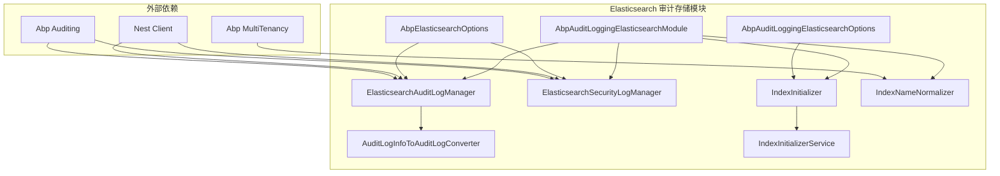
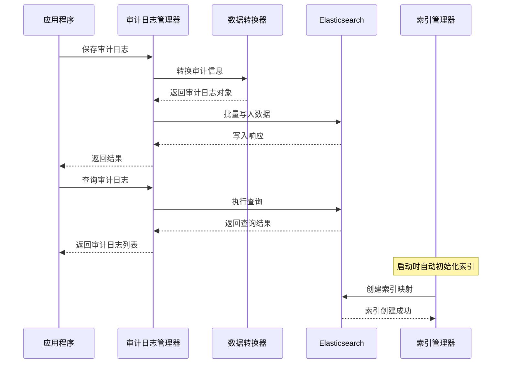
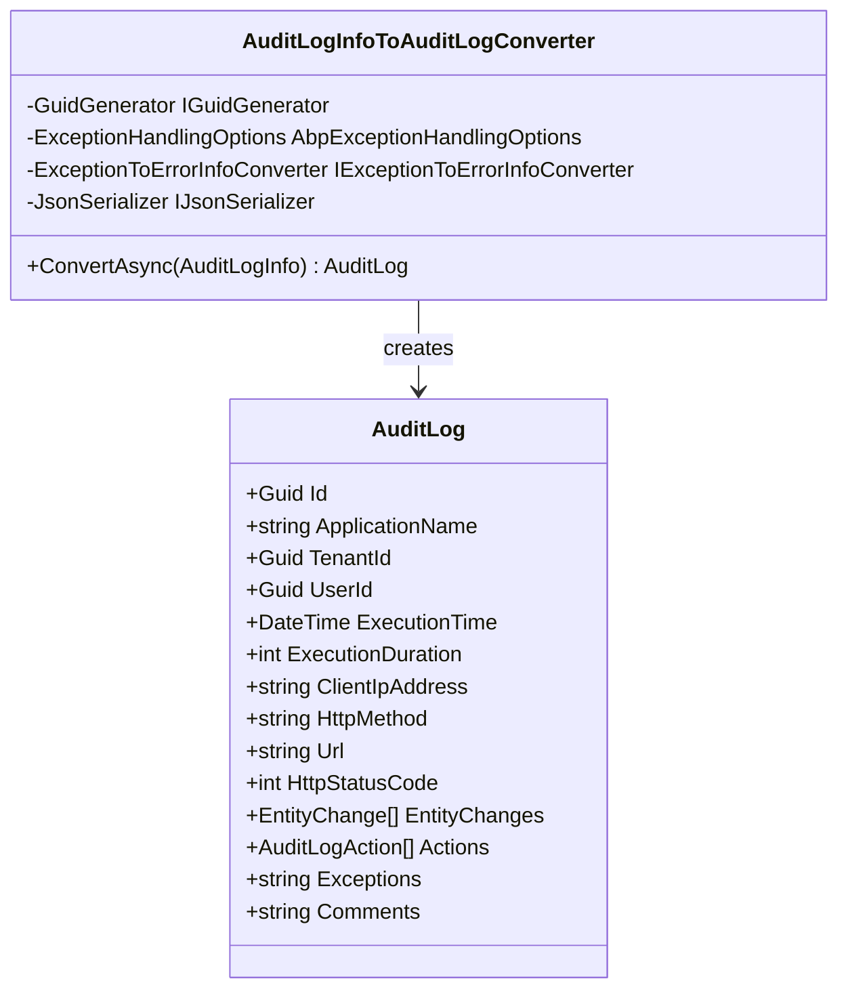
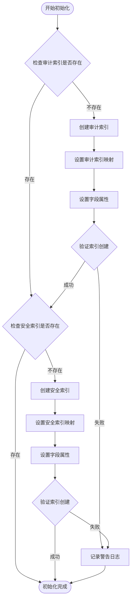
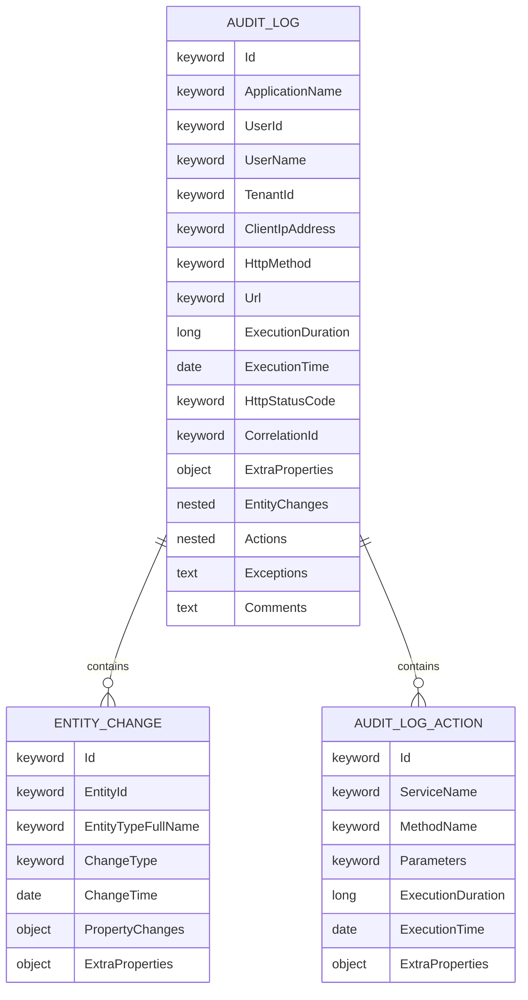
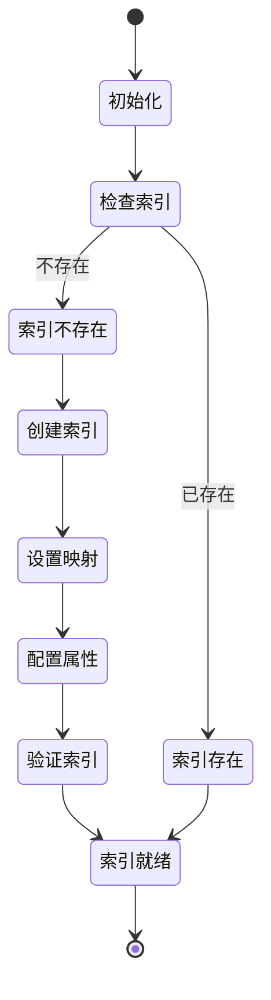

# Elasticsearch 审计存储

<cite>
**本文档中引用的文件**
- [AbpAuditLoggingElasticsearchModule.cs](file://aspnet-core/framework/auditing/LINGYUN.Abp.AuditLogging.Elasticsearch/LINGYUN/Abp/AuditLogging/Elasticsearch/AbpAuditLoggingElasticsearchModule.cs)
- [AbpAuditLoggingElasticsearchOptions.cs](file://aspnet-core/framework/auditing/LINGYUN.Abp.AuditLogging.Elasticsearch/LINGYUN/Abp/AuditLogging/Elasticsearch/AbpAuditLoggingElasticsearchOptions.cs)
- [ElasticsearchAuditLogManager.cs](file://aspnet-core/framework/auditing/LINGYUN.Abp.AuditLogging.Elasticsearch/LINGYUN/Abp/AuditLogging/Elasticsearch/ElasticsearchAuditLogManager.cs)
- [ElasticsearchSecurityLogManager.cs](file://aspnet-core/framework/auditing/LINGYUN.Abp.AuditLogging.Elasticsearch/LINGYUN/Abp/AuditLogging/Elasticsearch/ElasticsearchSecurityLogManager.cs)
- [IndexInitializer.cs](file://aspnet-core/framework/auditing/LINGYUN.Abp.AuditLogging.Elasticsearch/LINGYUN/Abp/AuditLogging/Elasticsearch/IndexInitializer.cs)
- [IndexNameNormalizer.cs](file://aspnet-core/framework/auditing/LINGYUN.Abp.AuditLogging.Elasticsearch/LINGYUN/Abp/AuditLogging/Elasticsearch/IndexNameNormalizer.cs)
- [AuditLogInfoToAuditLogConverter.cs](file://aspnet-core/framework/auditing/LINGYUN.Abp.AuditLogging.Elasticsearch/LINGYUN/Abp/AuditLogging/Elasticsearch/AuditLogInfoToAuditLogConverter.cs)
- [README.md](file://aspnet-core/framework/auditing/LINGYUN.Abp.AuditLogging.Elasticsearch/README.md)
- [AbpElasticsearchOptions.cs](file://aspnet-core/framework/elasticsearch/LINGYUN.Abp.Elasticsearch/LINGYUN/Abp/Elasticsearch/AbpElasticsearchOptions.cs)
- [ElasticsearchClientFactory.cs](file://aspnet-core/framework/elasticsearch/LINGYUN.Abp.Elasticsearch/LINGYUN/Abp/Elasticsearch/ElasticsearchClientFactory.cs)
</cite>

## 目录
1. [简介](#简介)
2. [项目结构](#项目结构)
3. [核心组件](#核心组件)
4. [架构概览](#架构概览)
5. [详细组件分析](#详细组件分析)
6. [配置选项](#配置选项)
7. [索引管理策略](#索引管理策略)
8. [性能优化](#性能优化)
9. [部署指南](#部署指南)
10. [故障排除](#故障排除)
11. [总结](#总结)

## 简介

LINGYUN.Abp.AuditLogging.Elasticsearch 是一个专门用于将审计日志存储到 Elasticsearch 的模块。该模块提供了高性能的审计日志存储解决方案，支持全文搜索、复杂查询和实时分析功能。通过与 Elasticsearch 的深度集成，该模块能够处理大规模审计数据，并提供强大的搜索和分析能力。

该模块主要实现了以下功能：
- 审计日志的 Elasticsearch 存储和检索
- 安全日志的 Elasticsearch 管理
- 自动化的索引初始化和管理
- 多租户索引隔离
- 高性能的数据写入和查询
- 灵活的配置选项和扩展性

## 项目结构



**图表来源**
- [AbpAuditLoggingElasticsearchModule.cs](file://aspnet-core/framework/auditing/LINGYUN.Abp.AuditLogging.Elasticsearch/LINGYUN/Abp/AuditLogging/Elasticsearch/AbpAuditLoggingElasticsearchModule.cs#L1-L22)
- [ElasticsearchAuditLogManager.cs](file://aspnet-core/framework/auditing/LINGYUN.Abp.AuditLogging.Elasticsearch/LINGYUN/Abp/AuditLogging/Elasticsearch/ElasticsearchAuditLogManager.cs#L1-L38)

**章节来源**
- [AbpAuditLoggingElasticsearchModule.cs](file://aspnet-core/framework/auditing/LINGYUN.Abp.AuditLogging.Elasticsearch/LINGYUN/Abp/AuditLogging/Elasticsearch/AbpAuditLoggingElasticsearchModule.cs#L1-L22)
- [README.md](file://aspnet-core/framework/auditing/LINGYUN.Abp.AuditLogging.Elasticsearch/README.md#L1-L38)

## 核心组件

### 模块入口点

`AbpAuditLoggingElasticsearchModule` 是整个模块的入口点，负责配置和注册所有必要的服务：

```csharp
[DependsOn(
    typeof(AbpAuditLoggingModule),
    typeof(AbpElasticsearchModule),
    typeof(AbpJsonModule))]
public class AbpAuditLoggingElasticsearchModule : AbpModule
{
    public override void ConfigureServices(ServiceConfigurationContext context)
    {
        var configuration = context.Services.GetConfiguration();
        Configure<AbpAuditLoggingElasticsearchOptions>(
            configuration.GetSection("AuditLogging:Elasticsearch"));
        
        context.Services.AddHostedService<IndexInitializerService>();
    }
}
```

### 审计日志管理器

`ElasticsearchAuditLogManager` 是核心组件之一，实现了 `IAuditLogManager` 接口，负责审计日志的存储和检索：

```csharp
[Dependency(ReplaceServices = true)]
public class ElasticsearchAuditLogManager : IAuditLogManager, ITransientDependency
{
    private readonly AbpAuditingOptions _auditingOptions;
    private readonly AbpElasticsearchOptions _elasticsearchOptions;
    private readonly IIndexNameNormalizer _indexNameNormalizer;
    private readonly IElasticsearchClientFactory _clientFactory;
    private readonly IAuditLogInfoToAuditLogConverter _converter;
    private readonly IClock _clock;
}
```

### 安全日志管理器

`ElasticsearchSecurityLogManager` 负责安全日志的存储和检索：

```csharp
[Dependency(ReplaceServices = true)]
public class ElasticsearchSecurityLogManager : ISecurityLogManager, ITransientDependency
{
    private readonly AbpSecurityLogOptions _securityLogOptions;
    private readonly AbpElasticsearchOptions _elasticsearchOptions;
    private readonly IIndexNameNormalizer _indexNameNormalizer;
    private readonly IGuidGenerator _guidGenerator;
    private readonly IElasticsearchClientFactory _clientFactory;
    private readonly IClock _clock;
}
```

**章节来源**
- [AbpAuditLoggingElasticsearchModule.cs](file://aspnet-core/framework/auditing/LINGYUN.Abp.AuditLogging.Elasticsearch/LINGYUN/Abp/AuditLogging/Elasticsearch/AbpAuditLoggingElasticsearchModule.cs#L1-L22)
- [ElasticsearchAuditLogManager.cs](file://aspnet-core/framework/auditing/LINGYUN.Abp.AuditLogging.Elasticsearch/LINGYUN/Abp/AuditLogging/Elasticsearch/ElasticsearchAuditLogManager.cs#L17-L38)
- [ElasticsearchSecurityLogManager.cs](file://aspnet-core/framework/auditing/LINGYUN.Abp.AuditLogging.Elasticsearch/LINGYUN/Abp/AuditLogging/Elasticsearch/ElasticsearchSecurityLogManager.cs#L17-L37)

## 架构概览



**图表来源**
- [ElasticsearchAuditLogManager.cs](file://aspnet-core/framework/auditing/LINGYUN.Abp.AuditLogging.Elasticsearch/LINGYUN/Abp/AuditLogging/Elasticsearch/ElasticsearchAuditLogManager.cs#L170-L200)
- [IndexInitializer.cs](file://aspnet-core/framework/auditing/LINGYUN.Abp.AuditLogging.Elasticsearch/LINGYUN/Abp/AuditLogging/Elasticsearch/IndexInitializer.cs#L34-L62)

## 详细组件分析

### 数据转换器

`AuditLogInfoToAuditLogConverter` 负责将抽象的 `AuditLogInfo` 对象转换为 Elasticsearch 友好的 `AuditLog` 对象：



**图表来源**
- [AuditLogInfoToAuditLogConverter.cs](file://aspnet-core/framework/auditing/LINGYUN.Abp.AuditLogging.Elasticsearch/LINGYUN/Abp/AuditLogging/Elasticsearch/AuditLogInfoToAuditLogConverter.cs#L15-L115)

### 索引初始化器

`IndexInitializer` 负责在应用程序启动时自动创建所需的 Elasticsearch 索引：



**图表来源**
- [IndexInitializer.cs](file://aspnet-core/framework/auditing/LINGYUN.Abp.AuditLogging.Elasticsearch/LINGYUN/Abp/AuditLogging/Elasticsearch/IndexInitializer.cs#L34-L106)

### 查询构建器

`ElasticsearchAuditLogManager` 提供了强大的查询构建功能，支持多种过滤条件：

```csharp
protected virtual List<Func<QueryContainerDescriptor<AuditLog>, QueryContainer>> BuildQueryDescriptor(
    DateTime? startTime = null,
    DateTime? endTime = null,
    string httpMethod = null,
    string url = null,
    Guid? userId = null,
    string userName = null,
    string applicationName = null,
    string correlationId = null,
    string clientId = null,
    string clientIpAddress = null,
    int? maxExecutionDuration = null,
    int? minExecutionDuration = null,
    bool? hasException = null,
    HttpStatusCode? httpStatusCode = null)
{
    var querys = new List<Func<QueryContainerDescriptor<AuditLog>, QueryContainer>>();
    
    if (startTime.HasValue)
    {
        querys.Add((log) => log.DateRange((q) => q.Field(GetField(nameof(AuditLog.ExecutionTime)))
            .GreaterThanOrEquals(_clock.Normalize(startTime.Value))));
    }
    
    // ... 其他查询条件
    
    return querys;
}
```

**章节来源**
- [AuditLogInfoToAuditLogConverter.cs](file://aspnet-core/framework/auditing/LINGYUN.Abp.AuditLogging.Elasticsearch/LINGYUN/Abp/AuditLogging/Elasticsearch/AuditLogInfoToAuditLogConverter.cs#L25-L115)
- [IndexInitializer.cs](file://aspnet-core/framework/auditing/LINGYUN.Abp.AuditLogging.Elasticsearch/LINGYUN/Abp/AuditLogging/Elasticsearch/IndexInitializer.cs#L34-L106)
- [ElasticsearchAuditLogManager.cs](file://aspnet-core/framework/auditing/LINGYUN.Abp.AuditLogging.Elasticsearch/LINGYUN/Abp/AuditLogging/Elasticsearch/ElasticsearchAuditLogManager.cs#L200-L280)

## 配置选项

### 基本配置

在 `appsettings.json` 中配置 Elasticsearch 审计存储：

```json
{
  "Elasticsearch": {
    "NodeUris": "http://localhost:9200",
    "UserName": "elastic",
    "Password": "changeme",
    "ConnectionTimeout": "00:01:00",
    "ConnectionLimit": 10
  },
  "AuditLogging": {
    "Elasticsearch": {
      "IndexPrefix": "auditlogging",
      "IndexSettings": {
        "NumberOfShards": 3,
        "NumberOfReplicas": 1
      }
    }
  }
}
```

### 配置选项说明

| 配置项 | 类型 | 默认值 | 说明 |
|--------|------|--------|------|
| `NodeUris` | string | 必填 | Elasticsearch 节点地址，多个节点用逗号分隔 |
| `UserName` | string | null | 认证用户名 |
| `Password` | string | null | 认证密码 |
| `ConnectionTimeout` | timespan | 00:01:00 | 连接超时时间 |
| `ConnectionLimit` | int | 10 | 最大连接数 |
| `IndexPrefix` | string | "auditlogging" | 索引前缀 |
| `FieldCamelCase` | bool | false | 字段命名是否使用 camelCase |

### 高级配置

```json
{
  "Elasticsearch": {
    "NodeUris": "http://es1:9200,http://es2:9200,http://es3:9200",
    "UserName": "admin",
    "Password": "password",
    "ConnectionTimeout": "00:02:00",
    "ConnectionLimit": 20,
    "DisableDirectStreaming": false,
    "FieldCamelCase": true
  },
  "AuditLogging": {
    "Elasticsearch": {
      "IndexPrefix": "prod-audit",
      "IndexSettings": {
        "NumberOfShards": 5,
        "NumberOfReplicas": 2,
        "RefreshInterval": "30s",
        "MaxResultWindow": 100000
      }
    }
  }
}
```

**章节来源**
- [AbpAuditLoggingElasticsearchOptions.cs](file://aspnet-core/framework/auditing/LINGYUN.Abp.AuditLogging.Elasticsearch/LINGYUN/Abp/AuditLogging/Elasticsearch/AbpAuditLoggingElasticsearchOptions.cs#L1-L17)
- [AbpElasticsearchOptions.cs](file://aspnet-core/framework/elasticsearch/LINGYUN.Abp.Elasticsearch/LINGYUN/Abp/Elasticsearch/AbpElasticsearchOptions.cs#L1-L36)

## 索引管理策略

### 索引命名规范

系统使用 `IndexNameNormalizer` 来生成索引名称，支持多租户环境：

```csharp
public string NormalizeIndex(string index)
{
    if (_currentTenant.IsAvailable)
    {
        return $"{_options.IndexPrefix}-{index}-{_currentTenant.Id:N}";
    }
    return _options.IndexPrefix.IsNullOrWhiteSpace()
        ? index
        : $"{_options.IndexPrefix}-{index}";
}
```

### 索引映射设计

审计日志索引映射包含以下关键字段：



**图表来源**
- [IndexInitializer.cs](file://aspnet-core/framework/auditing/LINGYUN.Abp.AuditLogging.Elasticsearch/LINGYUN/Abp/AuditLogging/Elasticsearch/IndexInitializer.cs#L50-L80)

### 索引生命周期管理



**章节来源**
- [IndexNameNormalizer.cs](file://aspnet-core/framework/auditing/LINGYUN.Abp.AuditLogging.Elasticsearch/LINGYUN/Abp/AuditLogging/Elasticsearch/IndexNameNormalizer.cs#L17-L31)
- [IndexInitializer.cs](file://aspnet-core/framework/auditing/LINGYUN.Abp.AuditLogging.Elasticsearch/LINGYUN/Abp/AuditLogging/Elasticsearch/IndexInitializer.cs#L50-L106)

## 性能优化

### 批量写入优化

系统使用批量写入来提高性能：

```csharp
// 使用 Bulk 命令传输可能存在参数庞大的日志结构
var response = await client.BulkAsync(
    dsl => dsl.Index(CreateIndex())
              .Create<AuditLog>(ct => 
                ct.Id(auditLog.Id)
                  .Document(auditLog)));
```

### 查询性能优化

1. **字段映射优化**：为常用查询字段使用 `.keyword` 类型
2. **索引分片优化**：根据数据量调整分片数量
3. **查询缓存**：利用 Elasticsearch 查询缓存机制
4. **分页优化**：合理设置 `max_result_window`

### 内存优化

```csharp
// 支持选择性包含详情字段
SourceFilter(SourceFilterDescriptor<AuditLog> selector)
{
    selector.IncludeAll();
    if (!includeDetails)
    {
        selector.Excludes(field =>
            field.Field(f => f.Actions)
                 .Field(f => f.Comments)
                 .Field(f => f.Exceptions)
                 .Field(f => f.EntityChanges));
    }
    return selector;
}
```

### 连接池优化

```csharp
// 配置连接池参数
public AbpElasticsearchOptions()
{
    ConnectionLimit = ConnectionConfiguration.DefaultConnectionLimit;
    ConnectionTimeout = ConnectionConfiguration.DefaultTimeout;
}
```

**章节来源**
- [ElasticsearchAuditLogManager.cs](file://aspnet-core/framework/auditing/LINGYUN.Abp.AuditLogging.Elasticsearch/LINGYUN/Abp/AuditLogging/Elasticsearch/ElasticsearchAuditLogManager.cs#L170-L200)
- [ElasticsearchAuditLogManager.cs](file://aspnet-core/framework/auditing/LINGYUN.Abp.AuditLogging.Elasticsearch/LINGYUN/Abp/AuditLogging/Elasticsearch/ElasticsearchAuditLogManager.cs#L80-L100)

## 部署指南

### 环境准备

1. **Elasticsearch 集群部署**
   ```bash
   # 单节点部署
   docker run -d --name elasticsearch \
     -p 9200:9200 -p 9300:9300 \
     -e "discovery.type=single-node" \
     -e "xpack.security.enabled=false" \
     docker.elastic.co/elasticsearch/elasticsearch:8.11.0
   ```

2. **Kibana 可视化**
   ```bash
   docker run -d --name kibana \
     -p 5601:5601 \
     -e ELASTICSEARCH_HOSTS=http://elasticsearch:9200 \
     docker.elastic.co/kibana/kibana:8.11.0
   ```

### 应用程序配置

在 `appsettings.json` 中添加配置：

```json
{
  "Elasticsearch": {
    "NodeUris": "http://localhost:9200",
    "ConnectionTimeout": "00:01:00",
    "ConnectionLimit": 10
  },
  "AuditLogging": {
    "Elasticsearch": {
      "IndexPrefix": "auditlogging"
    }
  }
}
```

### 依赖注入配置

```csharp
[DependsOn(typeof(AbpAuditLoggingElasticsearchModule))]
public class YourProjectModule : AbpModule
{
    public override void ConfigureServices(ServiceConfigurationContext context)
    {
        // 其他配置...
    }
}
```

### Docker Compose 部署

```yaml
version: '3.8'
services:
  elasticsearch:
    image: docker.elastic.co/elasticsearch/elasticsearch:8.11.0
    ports:
      - "9200:9200"
      - "9300:9300"
    environment:
      - discovery.type=single-node
      - xpack.security.enabled=false
    volumes:
      - es-data:/usr/share/elasticsearch/data
      
  kibana:
    image: docker.elastic.co/kibana/kibana:8.11.0
    ports:
      - "5601:5601"
    environment:
      - ELASTICSEARCH_HOSTS=http://elasticsearch:9200
    depends_on:
      - elasticsearch
      
  app:
    build: .
    ports:
      - "8080:80"
    depends_on:
      - elasticsearch
    environment:
      - ASPNETCORE_ENVIRONMENT=Production
      - Elasticsearch__NodeUris=http://elasticsearch:9200

volumes:
  es-data:
```

## 故障排除

### 常见问题及解决方案

#### 1. 索引创建失败

**问题症状**：应用程序启动时出现索引创建错误

**解决方案**：
```csharp
// 检查 Elasticsearch 连接状态
var health = await client.Cluster.HealthAsync();
if (health.Status != Health.Green && health.Status != Health.Yellow)
{
    // 处理集群健康状态异常
}
```

#### 2. 查询超时

**问题症状**：复杂的审计日志查询返回超时

**解决方案**：
```json
{
  "AuditLogging": {
    "Elasticsearch": {
      "IndexSettings": {
        "Search": {
          "Slowlog": {
            "Threshold": {
              "Query": {
                "Warn": "10s",
                "Info": "5s",
                "Debug": "2s",
                "Trace": "500ms"
              }
            }
          }
        }
      }
    }
  }
}
```

#### 3. 内存不足

**问题症状**：大批量审计日志写入时内存溢出

**解决方案**：
```csharp
// 分批处理大量数据
var batchSize = 1000;
for (int i = 0; i < totalCount; i += batchSize)
{
    var batch = items.Skip(i).Take(batchSize);
    await ProcessBatchAsync(batch);
}
```

#### 4. 多租户索引冲突

**问题症状**：不同租户的审计日志混合在一起

**解决方案**：
```csharp
// 确保索引命名正确
public string NormalizeIndex(string index)
{
    if (_currentTenant.IsAvailable)
    {
        return $"{_options.IndexPrefix}-{index}-{_currentTenant.Id:N}";
    }
    return $"{_options.IndexPrefix}-{index}";
}
```

### 监控和诊断

#### 1. 索引统计监控

```csharp
// 获取索引统计信息
var stats = await client.Indices.StatsAsync("*audit*");
foreach (var index in stats.Indices)
{
    Console.WriteLine($"Index: {index.Key}, Documents: {index.Value.primaries.docs.count}");
}
```

#### 2. 查询性能监控

```csharp
// 监控慢查询
var slowQueries = await client.SearchAsync<AuditLog>(s => s
    .Query(q => q
        .Range(r => r
            .Field(f => f.ExecutionDuration)
            .GreaterThan(1000)))
    .Size(100));
```

#### 3. 错误日志分析

```csharp
// 分析审计日志错误
var errors = await client.SearchAsync<AuditLog>(s => s
    .Query(q => q
        .Exists(e => e.Field(f => f.Exceptions)))
    .Sort(s => s
        .Descending(f => f.ExecutionTime))
    .Size(50));
```

**章节来源**
- [IndexInitializer.cs](file://aspnet-core/framework/auditing/LINGYUN.Abp.AuditLogging.Elasticsearch/LINGYUN/Abp/AuditLogging/Elasticsearch/IndexInitializer.cs#L70-L80)
- [ElasticsearchAuditLogManager.cs](file://aspnet-core/framework/auditing/LINGYUN.Abp.AuditLogging.Elasticsearch/LINGYUN/Abp/AuditLogging/Elasticsearch/ElasticsearchAuditLogManager.cs#L200-L280)

## 总结

LINGYUN.Abp.AuditLogging.Elasticsearch 模块提供了一个强大而灵活的审计日志存储解决方案。通过与 Elasticsearch 的深度集成，该模块具有以下优势：

### 主要特性

1. **高性能存储**：利用 Elasticsearch 的分布式架构和索引优化技术
2. **灵活查询**：支持复杂的全文搜索和多维度查询
3. **可扩展性**：支持水平扩展和多租户隔离
4. **易维护**：自动化的索引管理和配置简化
5. **企业级**：完整的错误处理和监控机制

### 最佳实践建议

1. **生产环境配置**：使用集群部署，配置适当的分片和副本
2. **性能调优**：根据数据量调整索引设置和查询参数
3. **监控告警**：建立完善的监控体系，及时发现和解决问题
4. **定期维护**：定期清理过期索引，优化索引结构
5. **安全考虑**：启用身份认证和加密传输

### 未来发展方向

1. **实时分析**：集成 Elasticsearch 的实时分析功能
2. **机器学习**：利用 Elasticsearch 的机器学习插件进行异常检测
3. **可视化增强**：开发更丰富的 Kibana 仪表板和报告
4. **云原生支持**：更好的容器化和 Kubernetes 部署支持

通过合理配置和使用这个模块，您可以构建一个高效、可靠的企业级审计日志系统，为您的应用程序提供强大的审计和分析能力。