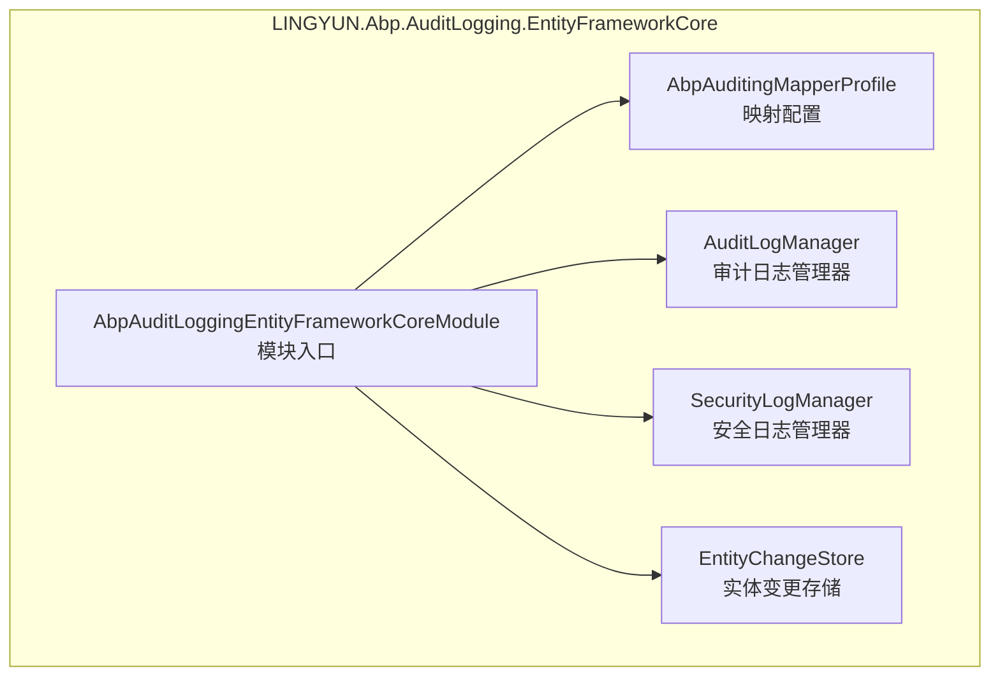
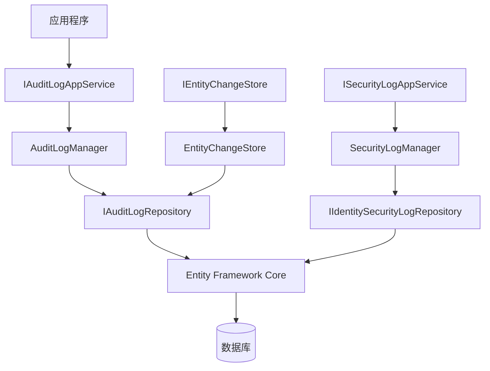
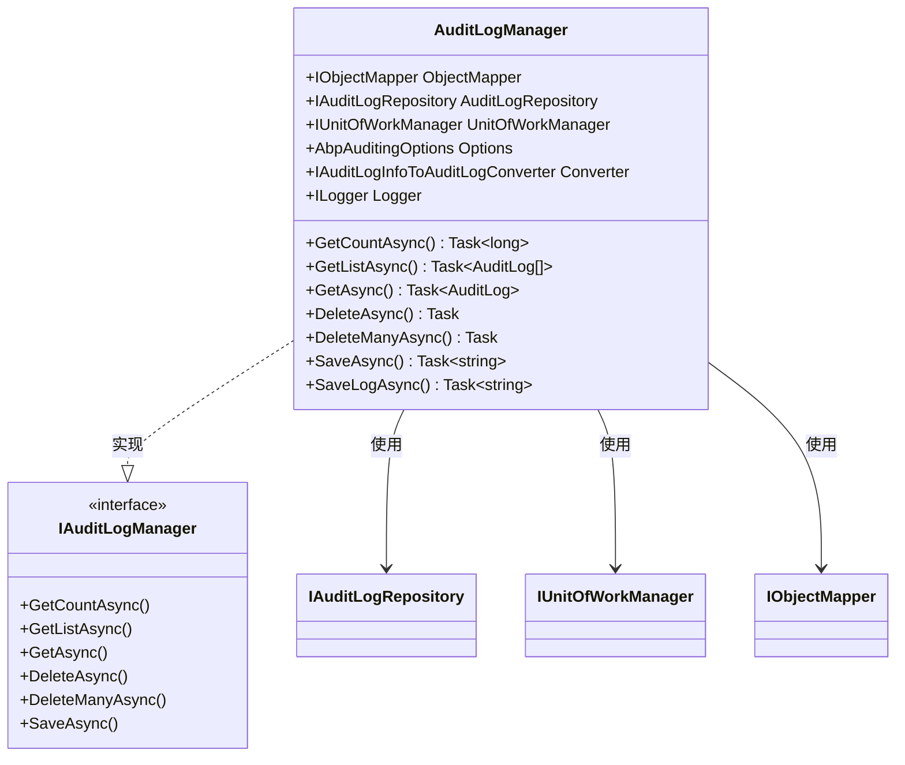
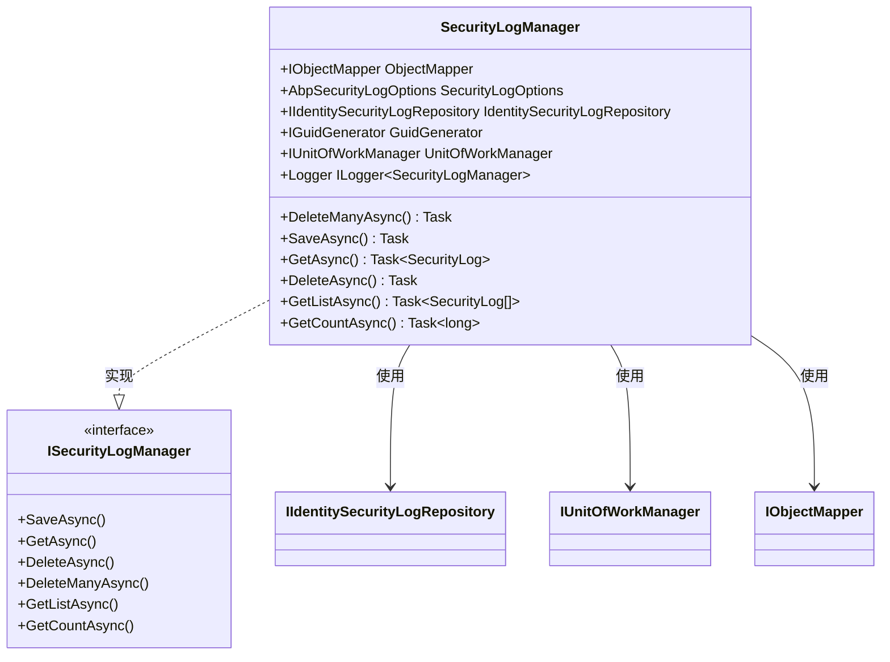
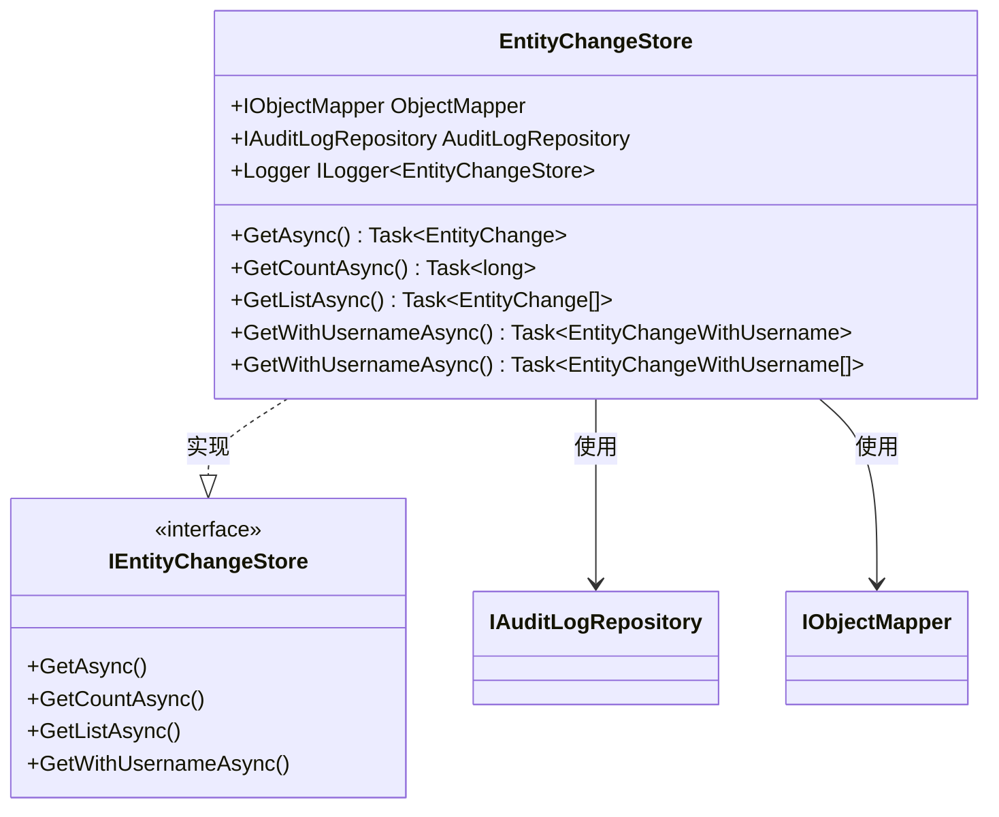
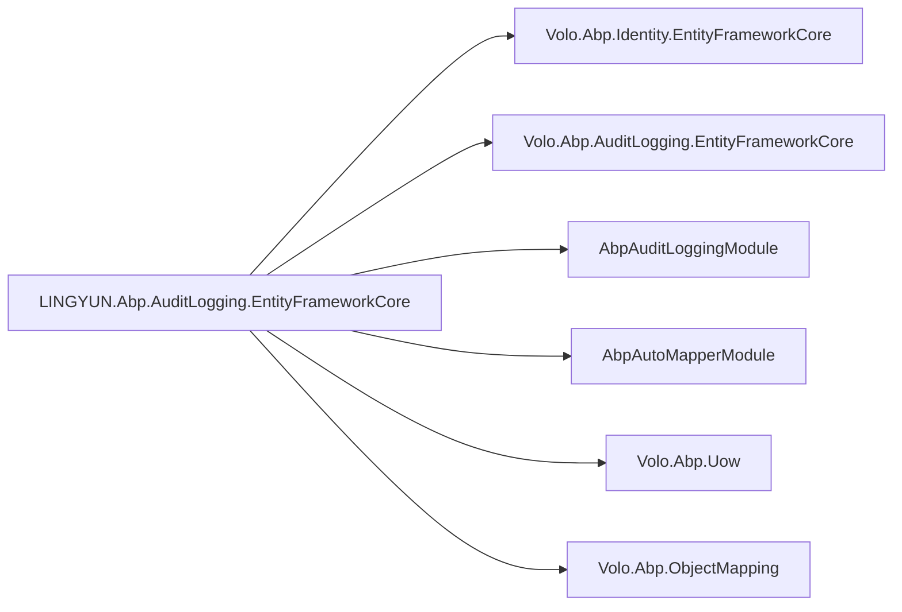

# Entity Framework Core 审计存储

<cite>
**本文档引用的文件**
- [AbpAuditLoggingEntityFrameworkCoreModule.cs](file://aspnet-core/framework/auditing/LINGYUN.Abp.AuditLogging.EntityFrameworkCore/LINGYUN/Abp/AuditLogging/EntityFrameworkCore/AbpAuditLoggingEntityFrameworkCoreModule.cs)
- [AbpAuditingMapperProfile.cs](file://aspnet-core/framework/auditing/LINGYUN.Abp.AuditLogging.EntityFrameworkCore/LINGYUN/Abp/AuditLogging/EntityFrameworkCore/AbpAuditingMapperProfile.cs)
- [AuditLogManager.cs](file://aspnet-core/framework/auditing/LINGYUN.Abp.AuditLogging.EntityFrameworkCore/LINGYUN/Abp/AuditLogging/EntityFrameworkCore/AuditLogManager.cs)
- [SecurityLogManager.cs](file://aspnet-core/framework/auditing/LINGYUN.Abp.AuditLogging.EntityFrameworkCore/LINGYUN/Abp/AuditLogging/EntityFrameworkCore/SecurityLogManager.cs)
- [EntityChangeStore.cs](file://aspnet-core/framework/auditing/LINGYUN.Abp.AuditLogging.EntityFrameworkCore/LINGYUN/Abp/AuditLogging/EntityFrameworkCore/EntityChangeStore.cs)
- [AuditLog.cs](file://aspnet-core/framework/auditing/LINGYUN.Abp.AuditLogging/LINGYUN/Abp/AuditLogging/AuditLog.cs)
- [EntityChange.cs](file://aspnet-core/framework/auditing/LINGYUN.Abp.AuditLogging/LINGYUN/Abp/AuditLogging/EntityChange.cs)
- [SingleMigrationsDbContext.cs](file://aspnet-core/migrations/LY.MicroService.Applications.Single.EntityFrameworkCore/SingleMigrationsDbContext.cs)
- [README.md](file://aspnet-core/framework/auditing/README.md)
</cite>

## 目录
1. [简介](#简介)
2. [项目结构](#项目结构)
3. [核心组件](#核心组件)
4. [架构概述](#架构概述)
5. [详细组件分析](#详细组件分析)
6. [依赖分析](#依赖分析)
7. [性能考虑](#性能考虑)
8. [故障排除指南](#故障排除指南)
9. [结论](#结论)

## 简介
LINGYUN.Abp.AuditLogging.EntityFrameworkCore 模块为 ABP 框架提供了基于 Entity Framework Core 的审计日志持久化解决方案。该模块实现了完整的审计日志存储、检索和管理功能，支持实体变更跟踪和安全日志记录。通过与 ABP 框架的深度集成，开发者可以轻松配置和使用审计功能来监控应用程序的行为。

## 项目结构
该模块遵循标准的 .NET 库项目结构，包含核心实现类、映射配置和模块定义。主要目录结构包括实体框架核心相关的服务实现和 AutoMapper 配置文件。

**图示来源**
- [AbpAuditLoggingEntityFrameworkCoreModule.cs](file://aspnet-core/framework/auditing/LINGYUN.Abp.AuditLogging.EntityFrameworkCore/LINGYUN/Abp/AuditLogging/EntityFrameworkCore/AbpAuditLoggingEntityFrameworkCoreModule.cs)
- [AbpAuditingMapperProfile.cs](file://aspnet-core/framework/auditing/LINGYUN.Abp.AuditLogging.EntityFrameworkCore/LINGYUN/Abp/AuditLogging/EntityFrameworkCore/AbpAuditingMapperProfile.cs)
- [AuditLogManager.cs](file://aspnet-core/framework/auditing/LINGYUN.Abp.AuditLogging.EntityFrameworkCore/LINGYUN/Abp/AuditLogging/EntityFrameworkCore/AuditLogManager.cs)
- [SecurityLogManager.cs](file://aspnet-core/framework/auditing/LINGYUN.Abp.AuditLogging.EntityFrameworkCore/LINGYUN/Abp/AuditLogging/EntityFrameworkCore/SecurityLogManager.cs)
- [EntityChangeStore.cs](file://aspnet-core/framework/auditing/LINGYUN.Abp.AuditLogging.EntityFrameworkCore/LINGYUN/Abp/AuditLogging/EntityFrameworkCore/EntityChangeStore.cs)

**本节来源**
- [AbpAuditLoggingEntityFrameworkCoreModule.cs](file://aspnet-core/framework/auditing/LINGYUN.Abp.AuditLogging.EntityFrameworkCore/LINGYUN/Abp/AuditLogging/EntityFrameworkCore/AbpAuditLoggingEntityFrameworkCoreModule.cs)

## 核心组件
该模块的核心组件包括审计日志管理器、安全日志管理器和实体变更存储，它们分别负责处理不同类型的审计数据。这些组件通过依赖注入与 Entity Framework Core 仓储进行交互，实现了对审计数据的增删改查操作。

**本节来源**
- [AuditLogManager.cs](file://aspnet-core/framework/auditing/LINGYUN.Abp.AuditLogging.EntityFrameworkCore/LINGYUN/Abp/AuditLogging/EntityFrameworkCore/AuditLogManager.cs)
- [SecurityLogManager.cs](file://aspnet-core/framework/auditing/LINGYUN.Abp.AuditLogging.EntityFrameworkCore/LINGYUN/Abp/AuditLogging/EntityFrameworkCore/SecurityLogManager.cs)
- [EntityChangeStore.cs](file://aspnet-core/framework/auditing/LINGYUN.Abp.AuditLogging.EntityFrameworkCore/LINGYUN/Abp/AuditLogging/EntityFrameworkCore/EntityChangeStore.cs)

## 架构概述
该模块采用分层架构设计，上层应用通过 ABP 框架的标准接口与底层数据存储进行交互。Entity Framework Core 作为数据访问层，负责将领域对象映射到数据库表结构。

**图示来源**
- [AuditLogManager.cs](file://aspnet-core/framework/auditing/LINGYUN.Abp.AuditLogging.EntityFrameworkCore/LINGYUN/Abp/AuditLogging/EntityFrameworkCore/AuditLogManager.cs)
- [SecurityLogManager.cs](file://aspnet-core/framework/auditing/LINGYUN.Abp.AuditLogging.EntityFrameworkCore/LINGYUN/Abp/AuditLogging/EntityFrameworkCore/SecurityLogManager.cs)
- [EntityChangeStore.cs](file://aspnet-core/framework/auditing/LINGYUN.Abp.AuditLogging.EntityFrameworkCore/LINGYUN/Abp/AuditLogging/EntityFrameworkCore/EntityChangeStore.cs)

## 详细组件分析

### 审计日志管理器分析
`AuditLogManager` 类实现了 `IAuditLogManager` 接口，负责审计日志的业务逻辑处理。它通过对象映射将 EF Core 实体转换为领域模型，并在事务上下文中执行数据持久化操作。

#### 对象导向组件：

**图示来源**
- [AuditLogManager.cs](file://aspnet-core/framework/auditing/LINGYUN.Abp.AuditLogging.EntityFrameworkCore/LINGYUN/Abp/AuditLogging/EntityFrameworkCore/AuditLogManager.cs)

**本节来源**
- [AuditLogManager.cs](file://aspnet-core/framework/auditing/LINGYUN.Abp.AuditLogging.EntityFrameworkCore/LINGYUN/Abp/AuditLogging/EntityFrameworkCore/AuditLogManager.cs)

### 安全日志管理器分析
`SecurityLogManager` 类专门处理安全相关的日志记录，如登录尝试、身份验证失败等事件。它直接使用 ABP 身份模块的安全日志仓储进行数据持久化。

#### 对象导向组件：

**图示来源**
- [SecurityLogManager.cs](file://aspnet-core/framework/auditing/LINGYUN.Abp.AuditLogging.EntityFrameworkCore/LINGYUN/Abp/AuditLogging/EntityFrameworkCore/SecurityLogManager.cs)

**本节来源**
- [SecurityLogManager.cs](file://aspnet-core/framework/auditing/LINGYUN.Abp.AuditLogging.EntityFrameworkCore/LINGYUN/Abp/AuditLogging/EntityFrameworkCore/SecurityLogManager.cs)

### 实体变更存储分析
`EntityChangeStore` 类提供对实体变更记录的访问接口，允许查询特定审计日志中的所有实体变更或按条件筛选变更记录。

#### 对象导向组件：

**图示来源**
- [EntityChangeStore.cs](file://aspnet-core/framework/auditing/LINGYUN.Abp.AuditLogging.EntityFrameworkCore/LINGYUN/Abp/AuditLogging/EntityFrameworkCore/EntityChangeStore.cs)

**本节来源**
- [EntityChangeStore.cs](file://aspnet-core/framework/auditing/LINGYUN.Abp.AuditLogging.EntityFrameworkCore/LINGYUN/Abp/AuditLogging/EntityFrameworkCore/EntityChangeStore.cs)

## 依赖分析
该模块依赖于多个 ABP 框架核心组件，包括身份认证、自动映射和审计日志基础设施。通过正确的依赖配置，确保了模块间的松耦合和高内聚。

**图示来源**
- [AbpAuditLoggingEntityFrameworkCoreModule.cs](file://aspnet-core/framework/auditing/LINGYUN.Abp.AuditLogging.EntityFrameworkCore/LINGYUN/Abp/AuditLogging/EntityFrameworkCore/AbpAuditLoggingEntityFrameworkCoreModule.cs)

**本节来源**
- [AbpAuditLoggingEntityFrameworkCoreModule.cs](file://aspnet-core/framework/auditing/LINGYUN.Abp.AuditLogging.EntityFrameworkCore/LINGYUN/Abp/AuditLogging/EntityFrameworkCore/AbpAuditLoggingEntityFrameworkCoreModule.cs)

## 性能考虑
为了优化大规模审计日志的查询性能，建议在关键字段上创建适当的数据库索引。例如，在 `AuditLog` 表的 `ExecutionTime`、`UserId` 和 `TenantId` 字段上创建复合索引可以显著提高按时间范围和用户查询的效率。此外，对于归档和清理操作，应使用批量删除而非逐条删除以减少事务开销。

## 故障排除指南
当遇到审计日志无法保存的问题时，首先检查 `appsettings.json` 中的审计配置是否正确启用。确认数据库连接字符串配置无误，并确保相应的数据库迁移已正确应用。如果问题仍然存在，查看日志输出以获取详细的错误信息，特别是 `AuditLogManager` 中的异常捕获部分可能会提供有价值的调试线索。

**本节来源**
- [AuditLogManager.cs](file://aspnet-core/framework/auditing/LINGYUN.Abp.AuditLogging.EntityFrameworkCore/LINGYUN/Abp/AuditLogging/EntityFrameworkCore/AuditLogManager.cs)
- [README.md](file://aspnet-core/framework/auditing/README.md)

## 结论
LINGYUN.Abp.AuditLogging.EntityFrameworkCore 模块为 ABP 应用程序提供了一个强大而灵活的审计日志存储解决方案。通过合理的配置和优化，开发者可以有效地管理和利用审计数据来增强系统的可追溯性和安全性。