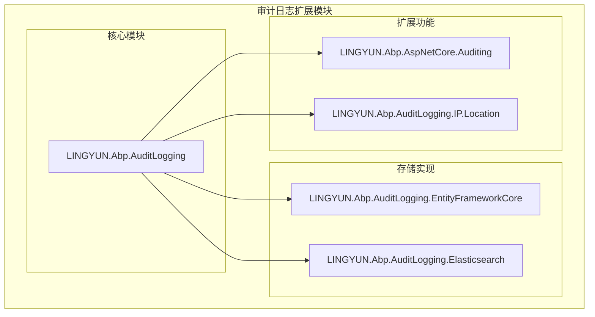
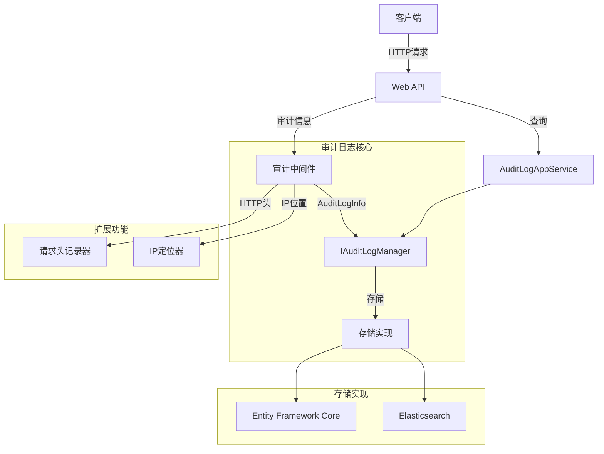
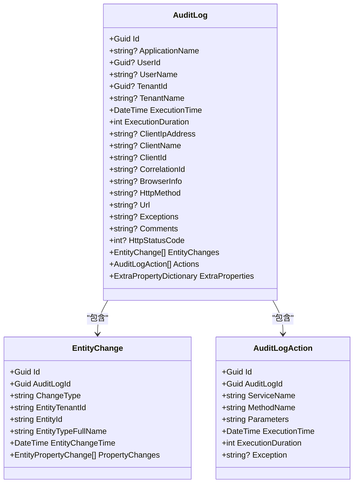
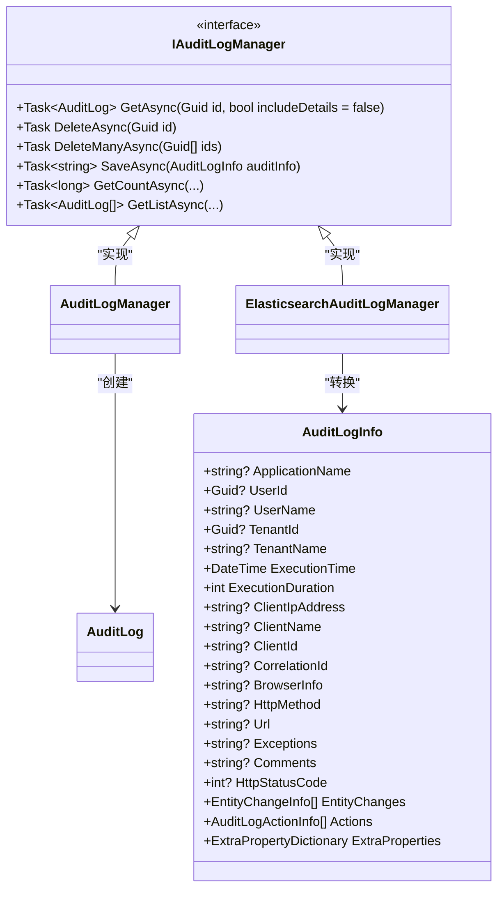
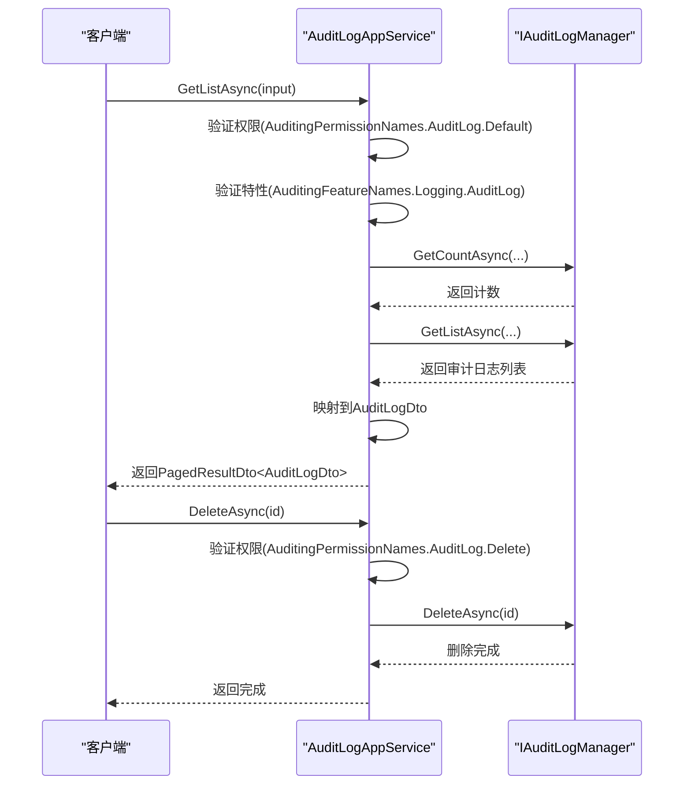
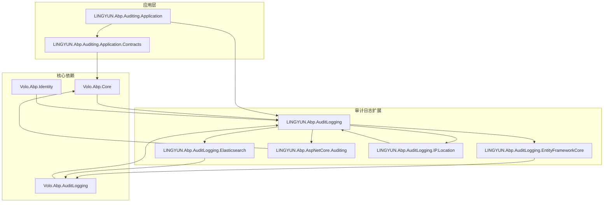

# 审计日志扩展

<cite>
**本文档引用的文件**
- [AuditLog.cs](file://aspnet-core/framework/auditing/LINGYUN.Abp.AuditLogging/LINGYUN/Abp/AuditLogging/AuditLog.cs)
- [IAuditLogManager.cs](file://aspnet-core/framework/auditing/LINGYUN.Abp.AuditLogging/LINGYUN/Abp/AuditLogging/IAuditLogManager.cs)
- [AuditLogAppService.cs](file://aspnet-core/modules/auditing/LINGYUN.Abp.Auditing.Application/LINGYUN/Abp/Auditing/AuditLogs/AuditLogAppService.cs)
- [AbpAuditLoggingElasticsearchModule.cs](file://aspnet-core/framework/auditing/LINGYUN.Abp.AuditLogging.Elasticsearch/LINGYUN/Abp/AuditLogging/Elasticsearch/AbpAuditLoggingElasticsearchModule.cs)
- [AbpAuditLoggingEntityFrameworkCoreModule.cs](file://aspnet-core/framework/auditing/LINGYUN.Abp.AuditLogging.EntityFrameworkCore/LINGYUN/Abp/AuditLogging/EntityFrameworkCore/AbpAuditLoggingEntityFrameworkCoreModule.cs)
- [AbpAspNetCoreAuditingModule.cs](file://aspnet-core/framework/auditing/LINGYUN.Abp.AspNetCore.Auditing/LINGYUN/Abp/AspNetCore/Auditing/AbpAspNetCoreAuditingModule.cs)
- [AbpAuditLoggingIPLocationModule.cs](file://aspnet-core/framework/auditing/LINGYUN.Abp.AuditLogging.IP.Location/LINGYUN/Abp/AuditLogging/IP/Location/AbpAuditLoggingIPLocationModule.cs)
- [AuditingFeatureNames.cs](file://aspnet-core/modules/auditing/LINGYUN.Abp.Auditing.Application.Contracts/LINGYUN/Abp/Auditing/Features/AuditingFeatureNames.cs)
</cite>

## 目录
1. [简介](#简介)
2. [项目结构](#项目结构)
3. [核心组件](#核心组件)
4. [架构概述](#架构概述)
5. [详细组件分析](#详细组件分析)
6. [依赖分析](#依赖分析)
7. [性能考虑](#性能考虑)
8. [故障排除指南](#故障排除指南)
9. [结论](#结论)

## 简介
本文档详细介绍了ABP框架中审计日志功能的扩展实现。文档涵盖了ASP.NET Core审计、审计日志实体、Elasticsearch存储和Entity Framework Core集成等方面的内容。详细描述了审计日志的配置方式、数据结构、存储策略和查询方法，并为开发者提供了审计日志的最佳实践，包括如何自定义审计规则、如何集成分布式追踪以及如何优化审计日志性能。

## 项目结构
ABP框架的审计日志扩展模块位于`aspnet-core/framework/auditing`目录下，包含多个子模块，每个子模块负责不同的功能。主要模块包括：

- `LINGYUN.Abp.AspNetCore.Auditing`：用于在审计日志中加入特定的HTTP请求头记录
- `LINGYUN.Abp.AuditLogging`：审计日志核心模块，提供审计日志的基础功能和接口定义
- `LINGYUN.Abp.AuditLogging.Elasticsearch`：审计模块的Elasticsearch实现
- `LINGYUN.Abp.AuditLogging.EntityFrameworkCore`：审计模块的Entity Framework Core实现
- `LINGYUN.Abp.AuditLogging.IP.Location`：用于在审计日志中记录IP位置信息

**Diagram sources**
- [AuditLog.cs](file://aspnet-core/framework/auditing/LINGYUN.Abp.AuditLogging/LINGYUN/Abp/AuditLogging/AuditLog.cs)
- [IAuditLogManager.cs](file://aspnet-core/framework/auditing/LINGYUN.Abp.AuditLogging/LINGYUN/Abp/AuditLogging/IAuditLogManager.cs)

**Section sources**
- [AuditLog.cs](file://aspnet-core/framework/auditing/LINGYUN.Abp.AuditLogging/LINGYUN/Abp/AuditLogging/AuditLog.cs)
- [IAuditLogManager.cs](file://aspnet-core/framework/auditing/LINGYUN.Abp.AuditLogging/LINGYUN/Abp/AuditLogging/IAuditLogManager.cs)

## 核心组件
审计日志扩展的核心组件包括审计日志实体、审计日志管理器接口、存储实现和应用服务。这些组件共同构成了一个完整的审计日志系统，能够记录应用程序的审计信息，并提供查询和管理功能。

**Section sources**
- [AuditLog.cs](file://aspnet-core/framework/auditing/LINGYUN.Abp.AuditLogging/LINGYUN/Abp/AuditLogging/AuditLog.cs)
- [IAuditLogManager.cs](file://aspnet-core/framework/auditing/LINGYUN.Abp.AuditLogging/LINGYUN/Abp/AuditLogging/IAuditLogManager.cs)

## 架构概述
ABP框架的审计日志扩展采用模块化设计，各模块之间通过接口进行通信。核心模块`LINGYUN.Abp.AuditLogging`定义了审计日志的基础功能和接口，其他模块则实现了具体的存储和扩展功能。

**Diagram sources**
- [AbpAuditLoggingModule.cs](file://aspnet-core/framework/auditing/LINGYUN.Abp.AuditLogging/LINGYUN/Abp/AuditLogging/AbpAuditLoggingModule.cs)
- [IAuditLogManager.cs](file://aspnet-core/framework/auditing/LINGYUN.Abp.AuditLogging/LINGYUN/Abp/AuditLogging/IAuditLogManager.cs)
- [AuditLogAppService.cs](file://aspnet-core/modules/auditing/LINGYUN.Abp.Auditing.Application/LINGYUN/Abp/Auditing/AuditLogs/AuditLogAppService.cs)

## 详细组件分析
### 审计日志实体分析
审计日志实体`AuditLog`是审计日志系统的核心数据结构，包含了审计日志的所有信息。该实体实现了`IHasExtraProperties`接口，允许存储额外的属性。

**Diagram sources**
- [AuditLog.cs](file://aspnet-core/framework/auditing/LINGYUN.Abp.AuditLogging/LINGYUN/Abp/AuditLogging/AuditLog.cs)

**Section sources**
- [AuditLog.cs](file://aspnet-core/framework/auditing/LINGYUN.Abp.AuditLogging/LINGYUN/Abp/AuditLogging/AuditLog.cs)

### 审计日志管理器分析
审计日志管理器`IAuditLogManager`接口定义了审计日志的核心操作，包括获取、删除和保存审计日志。

**Diagram sources**
- [IAuditLogManager.cs](file://aspnet-core/framework/auditing/LINGYUN.Abp.AuditLogging/LINGYUN/Abp/AuditLogging/IAuditLogManager.cs)

**Section sources**
- [IAuditLogManager.cs](file://aspnet-core/framework/auditing/LINGYUN.Abp.AuditLogging/LINGYUN/Abp/AuditLogging/IAuditLogManager.cs)

### 应用服务分析
审计日志应用服务`AuditLogAppService`提供了审计日志的查询和管理接口，通过ABP框架的权限和特性验证机制确保安全性。

**Diagram sources**
- [AuditLogAppService.cs](file://aspnet-core/modules/auditing/LINGYUN.Abp.Auditing.Application/LINGYUN/Abp/Auditing/AuditLogs/AuditLogAppService.cs)

**Section sources**
- [AuditLogAppService.cs](file://aspnet-core/modules/auditing/LINGYUN.Abp.Auditing.Application/LINGYUN/Abp/Auditing/AuditLogs/AuditLogAppService.cs)

## 依赖分析
审计日志扩展模块依赖于ABP框架的核心模块和其他相关模块，形成了一个完整的依赖关系网络。

**Diagram sources**
- [AbpAuditLoggingModule.cs](file://aspnet-core/framework/auditing/LINGYUN.Abp.AuditLogging/LINGYUN/Abp/AuditLogging/AbpAuditLoggingModule.cs)
- [AbpAuditLoggingEntityFrameworkCoreModule.cs](file://aspnet-core/framework/auditing/LINGYUN.Abp.AuditLogging.EntityFrameworkCore/LINGYUN/Abp/AuditLogging/EntityFrameworkCore/AbpAuditLoggingEntityFrameworkCoreModule.cs)
- [AbpAuditLoggingElasticsearchModule.cs](file://aspnet-core/framework/auditing/LINGYUN.Abp.AuditLogging.Elasticsearch/LINGYUN/Abp/AuditLogging/Elasticsearch/AbpAuditLoggingElasticsearchModule.cs)
- [AbpAspNetCoreAuditingModule.cs](file://aspnet-core/framework/auditing/LINGYUN.Abp.AspNetCore.Auditing/LINGYUN/Abp/AspNetCore/Auditing/AbpAspNetCoreAuditingModule.cs)
- [AbpAuditLoggingIPLocationModule.cs](file://aspnet-core/framework/auditing/LINGYUN.Abp.AuditLogging.IP.Location/LINGYUN/Abp/AuditLogging/IP/Location/AbpAuditLoggingIPLocationModule.cs)

**Section sources**
- [AbpAuditLoggingModule.cs](file://aspnet-core/framework/auditing/LINGYUN.Abp.AuditLogging/LINGYUN/Abp/AuditLogging/AbpAuditLoggingModule.cs)
- [AbpAuditLoggingEntityFrameworkCoreModule.cs](file://aspnet-core/framework/auditing/LINGYUN.Abp.AuditLogging.EntityFrameworkCore/LINGYUN/Abp/AuditLogging/EntityFrameworkCore/AbpAuditLoggingEntityFrameworkCoreModule.cs)
- [AbpAuditLoggingElasticsearchModule.cs](file://aspnet-core/framework/auditing/LINGYUN.Abp.AuditLogging.Elasticsearch/LINGYUN/Abp/AuditLogging/Elasticsearch/AbpAuditLoggingElasticsearchModule.cs)

## 性能考虑
在使用审计日志扩展时，需要考虑以下性能因素：

1. **存储选择**：根据查询模式选择合适的存储后端。对于复杂的全文搜索和分析场景，Elasticsearch是更好的选择；对于简单的CRUD操作，Entity Framework Core可能更合适。
2. **索引优化**：在Elasticsearch中合理配置索引前缀和分片策略，以提高查询性能。
3. **批量操作**：使用`DeleteManyAsync`等批量操作方法，减少数据库往返次数。
4. **缓存策略**：对于频繁查询但不经常变化的数据，考虑使用缓存。
5. **异步处理**：审计日志的记录应该是异步的，避免影响主业务流程的性能。

## 故障排除指南
### 常见问题
1. **审计日志未记录**：检查`appsettings.json`中的审计配置是否正确，确保`IsEnabled`设置为`true`。
2. **Elasticsearch连接失败**：检查Elasticsearch的连接字符串和网络配置，确保服务可访问。
3. **权限不足**：确保用户具有`AuditingPermissionNames.AuditLog.Default`权限才能查询审计日志。
4. **特性未启用**：检查`AuditingFeatureNames.Logging.AuditLog`特性是否已启用。

### 调试技巧
1. 使用ABP框架的日志系统查看审计日志模块的详细日志。
2. 检查数据库或Elasticsearch中的实际数据，确认审计日志是否正确存储。
3. 使用调试工具跟踪`AuditLogAppService`的调用过程，查看权限和特性验证是否通过。

**Section sources**
- [AuditingFeatureNames.cs](file://aspnet-core/modules/auditing/LINGYUN.Abp.Auditing.Application.Contracts/LINGYUN/Abp/Auditing/Features/AuditingFeatureNames.cs)
- [AuditLogAppService.cs](file://aspnet-core/modules/auditing/LINGYUN.Abp.Auditing.Application/LINGYUN/Abp/Auditing/AuditLogs/AuditLogAppService.cs)

## 结论
ABP框架的审计日志扩展提供了一个功能强大且灵活的审计日志系统。通过模块化设计，开发者可以根据具体需求选择合适的存储后端和扩展功能。系统提供了完整的配置选项、数据结构和API，使得审计日志的管理和查询变得简单高效。结合最佳实践，可以构建一个高性能、安全可靠的审计日志解决方案。