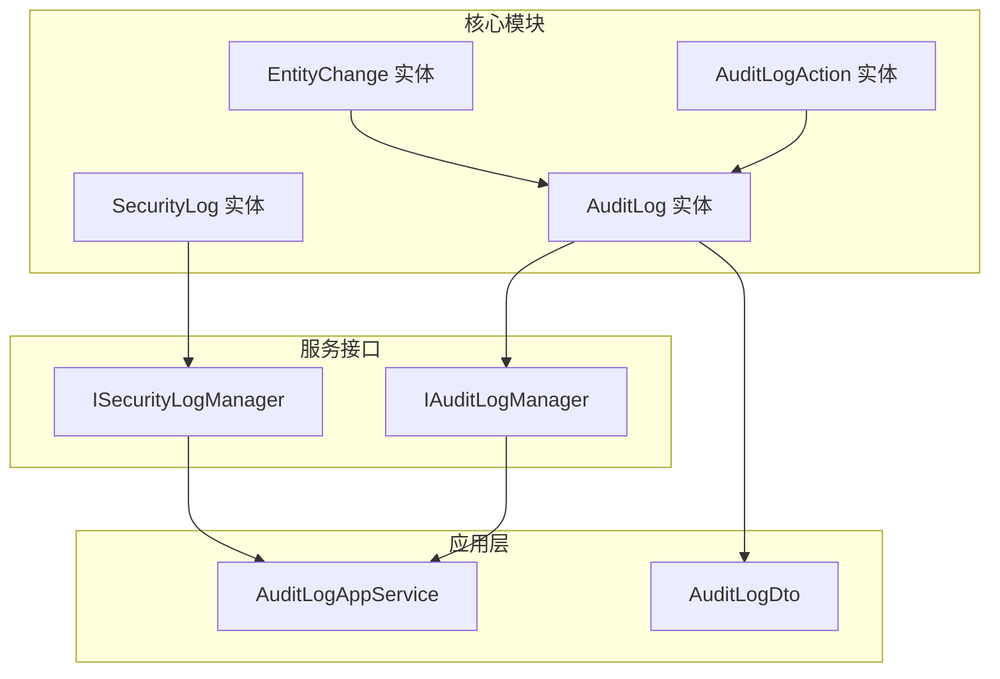
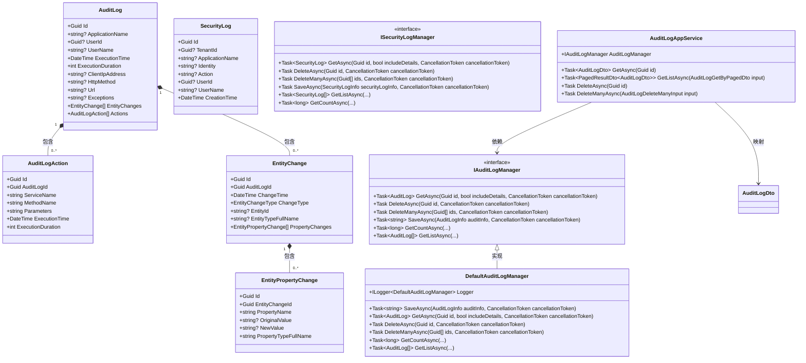
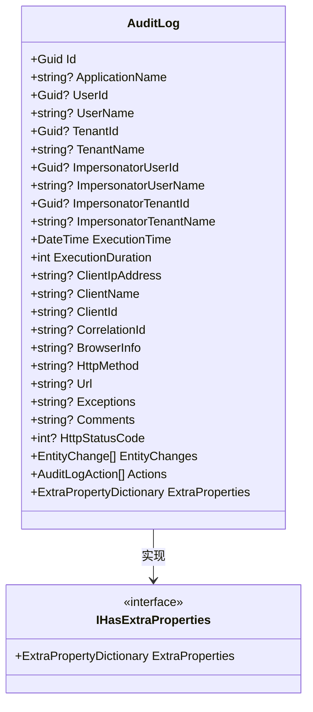
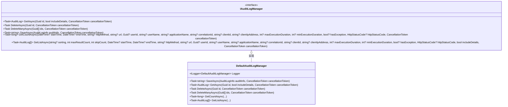
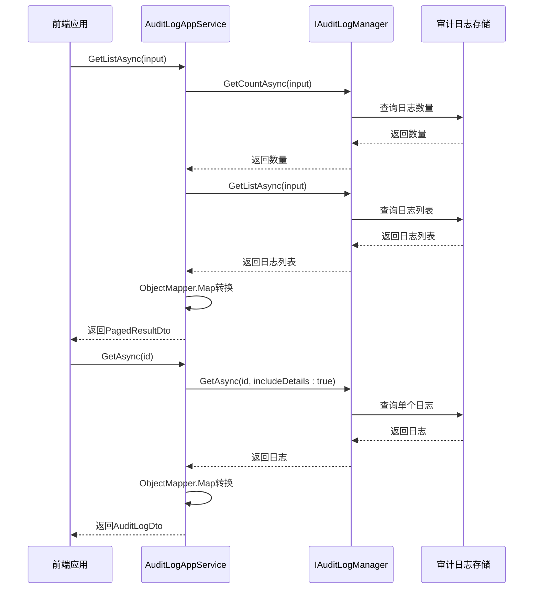

# 审计日志核心

<cite>
**本文档中引用的文件**  
- [AuditLog.cs](file://aspnet-core/framework/auditing/LINGYUN.Abp.AuditLogging/LINGYUN/Abp/AuditLogging/AuditLog.cs)
- [IAuditLogManager.cs](file://aspnet-core/framework/auditing/LINGYUN.Abp.AuditLogging/LINGYUN/Abp/AuditLogging/IAuditLogManager.cs)
- [DefaultAuditLogManager.cs](file://aspnet-core/framework/auditing/LINGYUN.Abp.AuditLogging/LINGYUN/Abp/AuditLogging/DefaultAuditLogManager.cs)
- [AuditLogAction.cs](file://aspnet-core/framework/auditing/LINGYUN.Abp.AuditLogging/LINGYUN/Abp/AuditLogging/AuditLogAction.cs)
- [EntityChange.cs](file://aspnet-core/framework/auditing/LINGYUN.Abp.AuditLogging/LINGYUN/Abp/AuditLogging/EntityChange.cs)
- [EntityPropertyChange.cs](file://aspnet-core/framework/auditing/LINGYUN.Abp.AuditLogging/LINGYUN/Abp/AuditLogging/EntityPropertyChange.cs)
- [SecurityLog.cs](file://aspnet-core/framework/auditing/LINGYUN.Abp.AuditLogging/LINGYUN/Abp/AuditLogging/SecurityLog.cs)
- [ISecurityLogManager.cs](file://aspnet-core/framework/auditing/LINGYUN.Abp.AuditLogging/LINGYUN/Abp/AuditLogging/ISecurityLogManager.cs)
- [AbpAuditLoggingModule.cs](file://aspnet-core/framework/auditing/LINGYUN.Abp.AuditLogging/LINGYUN/Abp/AuditLogging/AbpAuditLoggingModule.cs)
- [AuditLogAppService.cs](file://aspnet-core/modules/auditing/LINGYUN.Abp.Auditing.Application/LINGYUN/Abp/Auditing/AuditLogs/AuditLogAppService.cs)
- [AuditLogDto.cs](file://aspnet-core/modules/auditing/LINGYUN.Abp.Auditing.Application.Contracts/LINGYUN/Abp/Auditing/AuditLogs/AuditLogDto.cs)
- [AuditingFeatureNames.cs](file://aspnet-core/modules/auditing/LINGYUN.Abp.Auditing.Application.Contracts/LINGYUN/Abp/Auditing/Features/AuditingFeatureNames.cs)
</cite>

## 目录
1. [引言](#引言)
2. [项目结构](#项目结构)
3. [核心组件](#核心组件)
4. [架构概述](#架构概述)
5. [详细组件分析](#详细组件分析)
6. [依赖分析](#依赖分析)
7. [性能考虑](#性能考虑)
8. [故障排除指南](#故障排除指南)
9. [结论](#结论)

## 引言
本文档详细介绍了LINGYUN.Abp.AuditLogging模块的核心功能，包括审计日志的实体模型、管理器和服务接口。文档深入解释了审计日志的数据结构、字段含义和业务规则，并为开发者提供了使用指南，展示如何创建、存储和查询审计日志，以及如何扩展审计日志功能。

## 项目结构
审计日志功能主要分布在`aspnet-core/framework/auditing/LINGYUN.Abp.AuditLogging`目录下，包含核心实体模型、管理器接口和默认实现。相关应用程序服务位于`aspnet-core/modules/auditing`目录下。



**图示来源**
- [AuditLog.cs](file://aspnet-core/framework/auditing/LINGYUN.Abp.AuditLogging/LINGYUN/Abp/AuditLogging/AuditLog.cs)
- [IAuditLogManager.cs](file://aspnet-core/framework/auditing/LINGYUN.Abp.AuditLogging/LINGYUN/Abp/AuditLogging/IAuditLogManager.cs)
- [AuditLogAppService.cs](file://aspnet-core/modules/auditing/LINGYUN.Abp.Auditing.Application/LINGYUN/Abp/Auditing/AuditLogs/AuditLogAppService.cs)

**节来源**
- [AuditLog.cs](file://aspnet-core/framework/auditing/LINGYUN.Abp.AuditLogging/LINGYUN/Abp/AuditLogging/AuditLog.cs)
- [IAuditLogManager.cs](file://aspnet-core/framework/auditing/LINGYUN.Abp.AuditLogging/LINGYUN/Abp/AuditLogging/IAuditLogManager.cs)
- [AuditLogAppService.cs](file://aspnet-core/modules/auditing/LINGYUN.Abp.Auditing.Application/LINGYUN/Abp/Auditing/AuditLogs/AuditLogAppService.cs)

## 核心组件
审计日志模块的核心组件包括审计日志实体、审计日志管理器接口和默认实现。这些组件共同构成了审计日志功能的基础架构。

**节来源**
- [AuditLog.cs](file://aspnet-core/framework/auditing/LINGYUN.Abp.AuditLogging/LINGYUN/Abp/AuditLogging/AuditLog.cs)
- [IAuditLogManager.cs](file://aspnet-core/framework/auditing/LINGYUN.Abp.AuditLogging/LINGYUN/Abp/AuditLogging/IAuditLogManager.cs)
- [DefaultAuditLogManager.cs](file://aspnet-core/framework/auditing/LINGYUN.Abp.AuditLogging/LINGYUN/Abp/AuditLogging/DefaultAuditLogManager.cs)

## 架构概述
LINGYUN.Abp.AuditLogging模块采用分层架构设计，包含实体层、服务接口层和应用服务层。实体层定义了审计日志的数据结构，服务接口层定义了审计日志的操作契约，应用服务层实现了具体的业务逻辑。



**图示来源**
- [AuditLog.cs](file://aspnet-core/framework/auditing/LINGYUN.Abp.AuditLogging/LINGYUN/Abp/AuditLogging/AuditLog.cs)
- [AuditLogAction.cs](file://aspnet-core/framework/auditing/LINGYUN.Abp.AuditLogging/LINGYUN/Abp/AuditLogging/AuditLogAction.cs)
- [EntityChange.cs](file://aspnet-core/framework/auditing/LINGYUN.Abp.AuditLogging/LINGYUN/Abp/AuditLogging/EntityChange.cs)
- [EntityPropertyChange.cs](file://aspnet-core/framework/auditing/LINGYUN.Abp.AuditLogging/LINGYUN/Abp/AuditLogging/EntityPropertyChange.cs)
- [SecurityLog.cs](file://aspnet-core/framework/auditing/LINGYUN.Abp.AuditLogging/LINGYUN/Abp/AuditLogging/SecurityLog.cs)
- [IAuditLogManager.cs](file://aspnet-core/framework/auditing/LINGYUN.Abp.AuditLogging/LINGYUN/Abp/AuditLogging/IAuditLogManager.cs)
- [ISecurityLogManager.cs](file://aspnet-core/framework/auditing/LINGYUN.Abp.AuditLogging/LINGYUN/Abp/AuditLogging/ISecurityLogManager.cs)
- [DefaultAuditLogManager.cs](file://aspnet-core/framework/auditing/LINGYUN.Abp.AuditLogging/LINGYUN/Abp/AuditLogging/DefaultAuditLogManager.cs)
- [AuditLogAppService.cs](file://aspnet-core/modules/auditing/LINGYUN.Abp.Auditing.Application/LINGYUN/Abp/Auditing/AuditLogs/AuditLogAppService.cs)

## 详细组件分析
### 审计日志实体分析
审计日志实体（AuditLog）是审计日志功能的核心数据结构，包含了审计日志的所有必要信息。

#### 实体模型
审计日志实体包含以下主要字段：
- **ApplicationName**: 应用程序名称，标识产生审计日志的应用
- **UserId/UserName**: 用户ID和用户名，标识执行操作的用户
- **ExecutionTime**: 执行时间，记录操作发生的时间点
- **ExecutionDuration**: 执行时长，以毫秒为单位，记录操作执行的时间
- **ClientIpAddress**: 客户端IP地址，记录请求来源的IP
- **HttpMethod/Url**: HTTP方法和URL，记录请求的HTTP信息
- **Exceptions**: 异常信息，记录操作中发生的异常
- **EntityChanges**: 实体变更列表，记录操作中涉及的实体变更
- **Actions**: 操作列表，记录具体执行的方法调用



**图示来源**
- [AuditLog.cs](file://aspnet-core/framework/auditing/LINGYUN.Abp.AuditLogging/LINGYUN/Abp/AuditLogging/AuditLog.cs)

**节来源**
- [AuditLog.cs](file://aspnet-core/framework/auditing/LINGYUN.Abp.AuditLogging/LINGYUN/Abp/AuditLogging/AuditLog.cs)

### 审计日志管理器分析
审计日志管理器（IAuditLogManager）定义了审计日志的核心操作接口。

#### 接口设计
IAuditLogManager接口提供了以下主要方法：
- **SaveAsync**: 保存审计日志信息
- **GetAsync**: 获取单个审计日志
- **GetListAsync**: 获取审计日志列表，支持分页和过滤
- **GetCountAsync**: 获取审计日志数量，用于分页计算
- **DeleteAsync/DeleteManyAsync**: 删除审计日志



**图示来源**
- [IAuditLogManager.cs](file://aspnet-core/framework/auditing/LINGYUN.Abp.AuditLogging/LINGYUN/Abp/AuditLogging/IAuditLogManager.cs)
- [DefaultAuditLogManager.cs](file://aspnet-core/framework/auditing/LINGYUN.Abp.AuditLogging/LINGYUN/Abp/AuditLogging/DefaultAuditLogManager.cs)

**节来源**
- [IAuditLogManager.cs](file://aspnet-core/framework/auditing/LINGYUN.Abp.AuditLogging/LINGYUN/Abp/AuditLogging/IAuditLogManager.cs)
- [DefaultAuditLogManager.cs](file://aspnet-core/framework/auditing/LINGYUN.Abp.AuditLogging/LINGYUN/Abp/AuditLogging/DefaultAuditLogManager.cs)

### 审计日志应用服务分析
审计日志应用服务（AuditLogAppService）是审计日志功能的API入口，提供了RESTful接口供前端调用。

#### 服务实现
AuditLogAppService实现了IAuditLogAppService接口，主要功能包括：
- **权限控制**: 使用[Authorize]特性进行权限验证
- **功能开关**: 使用[RequiresFeature]特性检查功能是否启用
- **数据转换**: 使用ObjectMapper将实体对象转换为DTO对象
- **分页查询**: 支持分页查询审计日志列表



**图示来源**
- [AuditLogAppService.cs](file://aspnet-core/modules/auditing/LINGYUN.Abp.Auditing.Application/LINGYUN/Abp/Auditing/AuditLogs/AuditLogAppService.cs)
- [IAuditLogManager.cs](file://aspnet-core/framework/auditing/LINGYUN.Abp.AuditLogging/LINGYUN/Abp/AuditLogging/IAuditLogManager.cs)

**节来源**
- [AuditLogAppService.cs](file://aspnet-core/modules/auditing/LINGYUN.Abp.Auditing.Application/LINGYUN/Abp/Auditing/AuditLogs/AuditLogAppService.cs)

## 依赖分析
审计日志模块依赖于多个ABP框架核心模块，形成了完整的依赖关系链。

```mermaid
graph LR
    AbpAuditLoggingModule[AbpAuditLoggingModule] -->