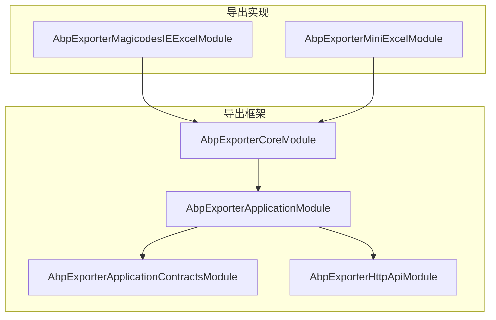
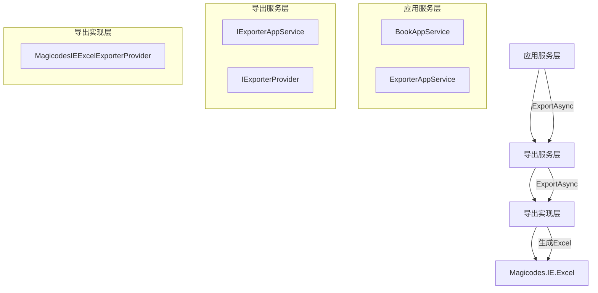
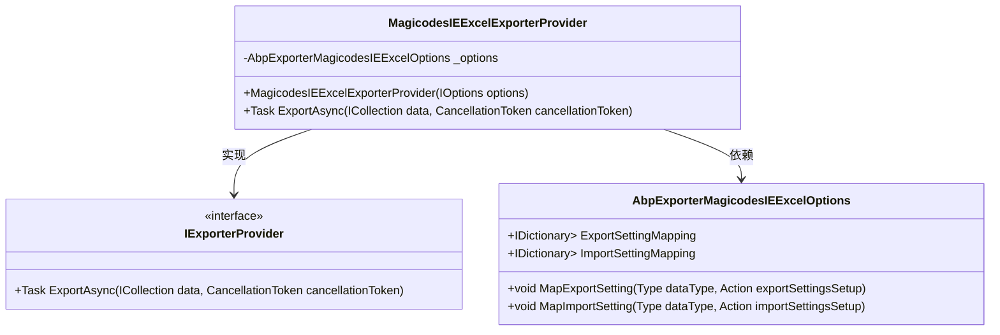
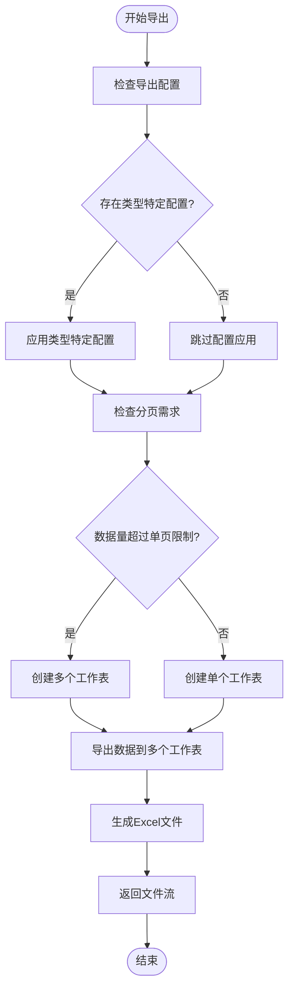

# Excel导出功能

<cite>
**本文档引用的文件**   
- [MagicodesIEExcelExporterProvider.cs](file://aspnet-core/framework/exporter/LINGYUN.Abp.Exporter.MagicodesIE.Excel/LINGYUN/Abp/Exporter/MagicodesIEExcelExporterProvider.cs)
- [AbpExporterMagicodesIEExcelOptions.cs](file://aspnet-core/framework/exporter/LINGYUN.Abp.Exporter.MagicodesIE.Excel/LINGYUN/Abp/Exporter/AbpExporterMagicodesIEExcelOptions.cs)
- [AbpExporterMagicodesIEExcelModule.cs](file://aspnet-core/framework/exporter/LINGYUN.Abp.Exporter.MagicodesIE.Excel/LINGYUN/Abp/Exporter/AbpExporterMagicodesIEExcelModule.cs)
- [BookAppService.cs](file://aspnet-core/modules/demo/LINGYUN.Abp.Demo.Application/LINGYUN/Abp/Demo/Books/BookAppService.cs)
- [BookDto.cs](file://aspnet-core/modules/demo/LINGYUN.Abp.Demo.Application.Contracts/LINGYUN/Abp/Demo/Books/BookDto.cs)
- [BookExportListInput.cs](file://aspnet-core/modules/demo/LINGYUN.Abp.Demo.Application.Contracts/LINGYUN/Abp/Demo/Books/BookExportListInput.cs)
- [BookController.cs](file://aspnet-core/modules/demo/LINGYUN.Abp.Demo.HttpApi/LINGYUN/Abp/Demo/Books/BookController.cs)
- [MicroServiceApplicationsSingleModule.Configure.cs](file://aspnet-core/services/LY.MicroService.Applications.Single/MicroServiceApplicationsSingleModule.Configure.cs)
</cite>

## 目录
1. [简介](#简介)
2. [项目结构](#项目结构)
3. [核心组件](#核心组件)
4. [架构概述](#架构概述)
5. [详细组件分析](#详细组件分析)
6. [依赖分析](#依赖分析)
7. [性能考虑](#性能考虑)
8. [故障排除指南](#故障排除指南)
9. [结论](#结论)

## 简介
本项目实现了基于MagicodesIE.Excel的Excel导出功能，提供了一套完整的数据导出解决方案。系统通过抽象层设计，支持多种导出器实现，其中MagicodesIE.Excel作为主要的Excel导出实现。该功能允许开发者配置数据模型映射、样式设置和复杂表头处理，支持大数据量分页导出、模板导出和自定义样式导出等高级功能。

## 项目结构
项目采用模块化设计，Excel导出功能主要位于`aspnet-core/framework/exporter/`目录下，通过多个模块协同工作实现完整的导出功能。

**图表来源**
- [AbpExporterCoreModule.cs](file://aspnet-core/framework/exporter/LINGYUN.Abp.Exporter.Core/LINGYUN/Abp/Exporter/AbpExporterCoreModule.cs)
- [AbpExporterMagicodesIEExcelModule.cs](file://aspnet-core/framework/exporter/LINGYUN.Abp.Exporter.MagicodesIE.Excel/LINGYUN/Abp/Exporter/AbpExporterMagicodesIEExcelModule.cs)
- [AbpExporterMiniExcelModule.cs](file://aspnet-core/framework/exporter/LINGYUN.Abp.Exporter.MiniExcel/LINGYUN/Abp/Exporter/AbpExporterMiniExcelModule.cs)

**章节来源**
- [AbpExporterCoreModule.cs](file://aspnet-core/framework/exporter/LINGYUN.Abp.Exporter.Core/LINGYUN/Abp/Exporter/AbpExporterCoreModule.cs)
- [AbpExporterMagicodesIEExcelModule.cs](file://aspnet-core/framework/exporter/LINGYUN.Abp.Exporter.MagicodesIE.Excel/LINGYUN/Abp/Exporter/AbpExporterMagicodesIEExcelModule.cs)

## 核心组件
Excel导出功能的核心组件包括导出提供者、导出选项配置和导出服务接口。系统通过`IExporterProvider`接口定义导出契约，`MagicodesIEExcelExporterProvider`实现具体的Excel导出逻辑，`AbpExporterMagicodesIEExcelOptions`提供配置选项。

**章节来源**
- [IExporterProvider.cs](file://aspnet-core/framework/exporter/LINGYUN.Abp.Exporter.Core/LINGYUN/Abp/Exporter/IExporterProvider.cs)
- [MagicodesIEExcelExporterProvider.cs](file://aspnet-core/framework/exporter/LINGYUN.Abp.Exporter.MagicodesIE.Excel/LINGYUN/Abp/Exporter/MagicodesIEExcelExporterProvider.cs)
- [AbpExporterMagicodesIEExcelOptions.cs](file://aspnet-core/framework/exporter/LINGYUN.Abp.Exporter.MagicodesIE.Excel/LINGYUN/Abp/Exporter/AbpExporterMagicodesIEExcelOptions.cs)

## 架构概述
系统采用分层架构设计，从上到下分为应用服务层、导出服务层和导出实现层。应用服务层通过`IExporterAppService`接口调用导出功能，导出服务层通过`IExporterProvider`接口抽象导出实现，导出实现层使用MagicodesIE.Excel库完成具体的Excel文件生成。

**图表来源**
- [IExporterAppService.cs](file://aspnet-core/framework/exporter/LINGYUN.Abp.Exporter.Application.Contracts/LINGYUN/Abp/Exporter/IExporterAppService.cs)
- [IExporterProvider.cs](file://aspnet-core/framework/exporter/LINGYUN.Abp.Exporter.Core/LINGYUN/Abp/Exporter/IExporterProvider.cs)
- [MagicodesIEExcelExporterProvider.cs](file://aspnet-core/framework/exporter/LINGYUN.Abp.Exporter.MagicodesIE.Excel/LINGYUN/Abp/Exporter/MagicodesIEExcelExporterProvider.cs)

## 详细组件分析

### MagicodesIEExcelExporterProvider分析
`MagicodesIEExcelExporterProvider`是Excel导出的核心实现类，负责将数据集合转换为Excel文件流。该类实现了`IExporterProvider`接口，提供异步导出功能。

**图表来源**
- [MagicodesIEExcelExporterProvider.cs](file://aspnet-core/framework/exporter/LINGYUN.Abp.Exporter.MagicodesIE.Excel/LINGYUN/Abp/Exporter/MagicodesIEExcelExporterProvider.cs)
- [AbpExporterMagicodesIEExcelOptions.cs](file://aspnet-core/framework/exporter/LINGYUN.Abp.Exporter.MagicodesIE.Excel/LINGYUN/Abp/Exporter/AbpExporterMagicodesIEExcelOptions.cs)

**章节来源**
- [MagicodesIEExcelExporterProvider.cs](file://aspnet-core/framework/exporter/LINGYUN.Abp.Exporter.MagicodesIE.Excel/LINGYUN/Abp/Exporter/MagicodesIEExcelExporterProvider.cs)

### 导出流程分析
Excel导出流程包括数据准备、配置应用、分页处理和文件生成四个主要步骤。系统支持大数据量导出时的自动分页功能，确保生成的Excel文件符合工作表行数限制。

**图表来源**
- [MagicodesIEExcelExporterProvider.cs](file://aspnet-core/framework/exporter/LINGYUN.Abp.Exporter.MagicodesIE.Excel/LINGYUN/Abp/Exporter/MagicodesIEExcelExporterProvider.cs)

**章节来源**
- [Magic