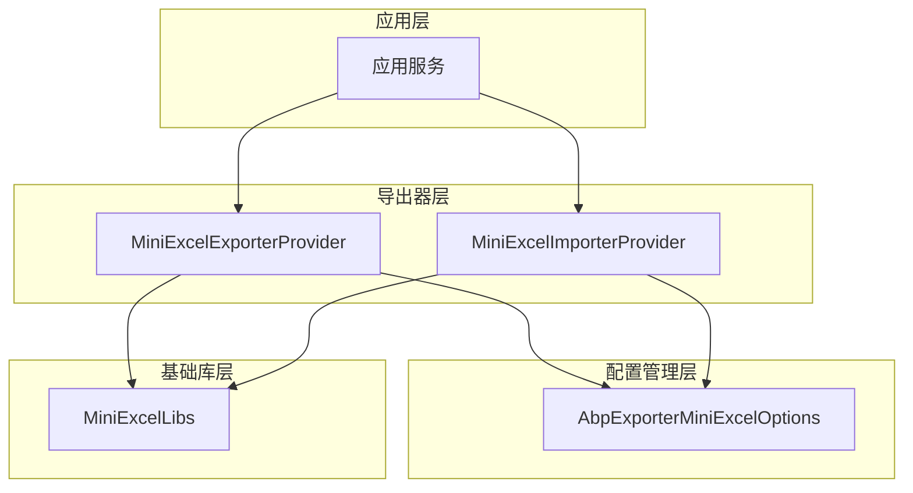
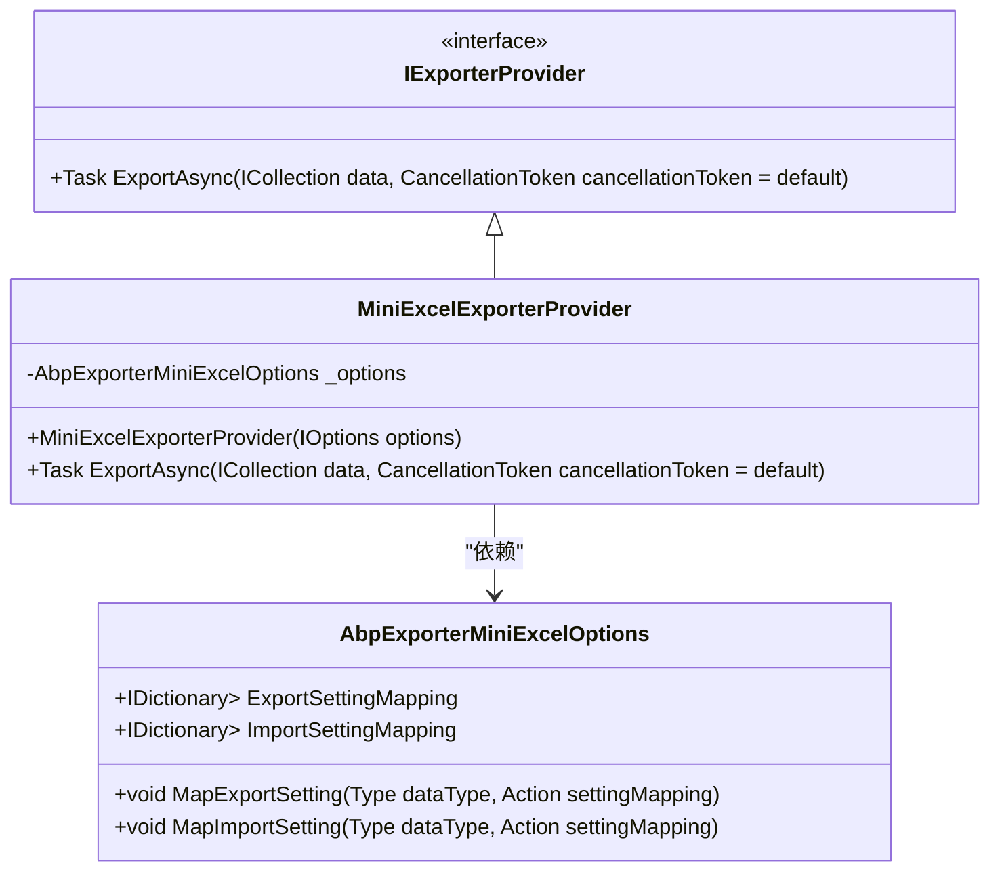
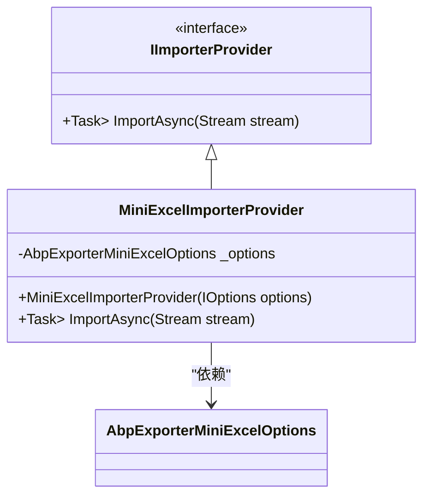
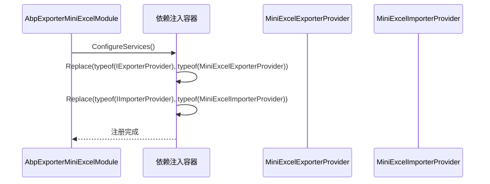
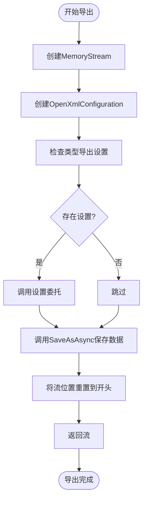
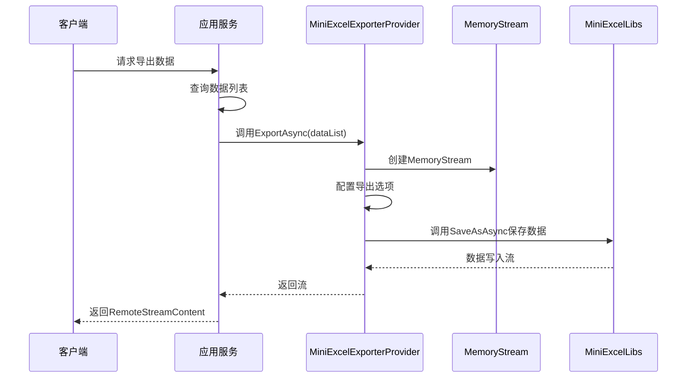

# MiniExcel导出功能

<cite>
**本文档引用的文件**
- [MiniExcelExporterProvider.cs](file://aspnet-core/framework/exporter/LINGYUN.Abp.Exporter.MiniExcel/LINGYUN/Abp/Exporter/MiniExcelExporterProvider.cs)
- [AbpExporterMiniExcelOptions.cs](file://aspnet-core/framework/exporter/LINGYUN.Abp.Exporter.MiniExcel/LINGYUN/Abp/Exporter/AbpExporterMiniExcelOptions.cs)
- [MiniExcelImporterProvider.cs](file://aspnet-core/framework/exporter/LINGYUN.Abp.Exporter.MiniExcel/LINGYUN/Abp/Exporter/MiniExcelImporterProvider.cs)
- [AbpExporterMiniExcelModule.cs](file://aspnet-core/framework/exporter/LINGYUN.Abp.Exporter.MiniExcel/LINGYUN/Abp/Exporter/AbpExporterMiniExcelModule.cs)
- [IExporterProvider.cs](file://aspnet-core/framework/exporter/LINGYUN.Abp.Exporter.Core/LINGYUN/Abp/Exporter/IExporterProvider.cs)
- [IImporterProvider.cs](file://aspnet-core/framework/exporter/LINGYUN.Abp.Exporter.Core/LINGYUN/Abp/Exporter/IImporterProvider.cs)
- [ExporterAppService.cs](file://aspnet-core/framework/exporter/LINGYUN.Abp.Exporter.Application/LINGYUN/Abp/Exporter/ExporterAppService.cs)
- [BookAppService.cs](file://aspnet-core/modules/demo/LINGYUN.Abp.Demo.Application/LINGYUN/Abp/Demo/Books/BookAppService.cs)
</cite>

## 目录
1. [简介](#简介)
2. [技术架构](#技术架构)
3. [核心组件分析](#核心组件分析)
4. [配置与使用](#配置与使用)
5. [性能优化策略](#性能优化策略)
6. [实际应用示例](#实际应用示例)
7. [结论](#结论)

## 简介
MiniExcel导出功能是ABP框架中用于高效处理Excel数据导出的核心模块。该功能基于MiniExcelLibs库实现，提供了轻量级、高性能的数据导出能力，特别适用于处理大数据量的导出场景。本文档将深入解析MiniExcel导出功能的实现机制、技术架构和最佳实践。

## 技术架构
MiniExcel导出功能采用分层架构设计，通过依赖注入机制提供灵活的扩展能力。整个架构由核心接口层、实现层和配置管理层组成，实现了关注点分离和高内聚低耦合的设计原则。



**图表来源**
- [MiniExcelExporterProvider.cs](file://aspnet-core/framework/exporter/LINGYUN.Abp.Exporter.MiniExcel/LINGYUN/Abp/Exporter/MiniExcelExporterProvider.cs)
- [MiniExcelImporterProvider.cs](file://aspnet-core/framework/exporter/LINGYUN.Abp.Exporter.MiniExcel/LINGYUN/Abp/Exporter/MiniExcelImporterProvider.cs)
- [AbpExporterMiniExcelOptions.cs](file://aspnet-core/framework/exporter/LINGYUN.Abp.Exporter.MiniExcel/LINGYUN/Abp/Exporter/AbpExporterMiniExcelOptions.cs)

## 核心组件分析

### 导出提供者
`MiniExcelExporterProvider`是MiniExcel导出功能的核心实现类，负责将数据集合转换为Excel文件流。该类实现了`IExporterProvider`接口，遵循ABP框架的依赖注入规范。



**图表来源**
- [IExporterProvider.cs](file://aspnet-core/framework/exporter/LINGYUN.Abp.Exporter.Core/LINGYUN/Abp/Exporter/IExporterProvider.cs)
- [MiniExcelExporterProvider.cs](file://aspnet-core/framework/exporter/LINGYUN.Abp.Exporter.MiniExcel/LINGYUN/Abp/Exporter/MiniExcelExporterProvider.cs)
- [AbpExporterMiniExcelOptions.cs](file://aspnet-core/framework/exporter/LINGYUN.Abp.Exporter.MiniExcel/LINGYUN/Abp/Exporter/AbpExporterMiniExcelOptions.cs)

**节来源**
- [MiniExcelExporterProvider.cs](file://aspnet-core/framework/exporter/LINGYUN.Abp.Exporter.MiniExcel/LINGYUN/Abp/Exporter/MiniExcelExporterProvider.cs#L1-L40)
- [AbpExporterMiniExcelOptions.cs](file://aspnet-core/framework/exporter/LINGYUN.Abp.Exporter.MiniExcel/LINGYUN/Abp/Exporter/AbpExporterMiniExcelOptions.cs#L1-L25)

### 导入提供者
`MiniExcelImporterProvider`负责将Excel文件流解析为数据对象集合，与导出功能形成完整的数据交换闭环。



**图表来源**
- [IImporterProvider.cs](file://aspnet-core/framework/exporter/LINGYUN.Abp.Exporter.Core/LINGYUN/Abp/Exporter/IImporterProvider.cs)
- [MiniExcelImporterProvider.cs](file://aspnet-core/framework/exporter/LINGYUN.Abp.Exporter.MiniExcel/LINGYUN/Abp/Exporter/MiniExcelImporterProvider.cs)
- [AbpExporterMiniExcelOptions.cs](file://aspnet-core/framework/exporter/LINGYUN.Abp.Exporter.MiniExcel/LINGYUN/Abp/Exporter/AbpExporterMiniExcelOptions.cs)

**节来源**
- [MiniExcelImporterProvider.cs](file://aspnet-core/framework/exporter/LINGYUN.Abp.Exporter.MiniExcel/LINGYUN/Abp/Exporter/MiniExcelImporterProvider.cs#L1-L35)

### 模块注册
`AbpExporterMiniExcelModule`负责在应用程序启动时注册MiniExcel导出功能所需的服务，通过替换默认的导出/导入提供者来激活MiniExcel实现。



**图表来源**
- [AbpExporterMiniExcelModule.cs](file://aspnet-core/framework/exporter/LINGYUN.Abp.Exporter.MiniExcel/LINGYUN/Abp/Exporter/AbpExporterMiniExcelModule.cs)

**节来源**
- [AbpExporterMiniExcelModule.cs](file://aspnet-core/framework/exporter/LINGYUN.Abp.Exporter.MiniExcel/LINGYUN/Abp/Exporter/AbpExporterMiniExcelModule.cs#L1-L21)

## 配置与使用

### 模块依赖配置
要在项目中使用MiniExcel导出功能，需要在模块上添加对`AbpExporterMiniExcelModule`的依赖。

```csharp
[DependsOn(typeof(AbpExporterMiniExcelModule))]
public class YourProjectModule : AbpModule
{
    // 模块配置
}
```

### 导出设置映射
通过`AbpExporterMiniExcelOptions`可以为特定数据类型配置导出选项，如表头行索引、列宽等。

```csharp
Configure<AbpExporterMiniExcelOptions>(options =>
{
    options.MapExportSetting(typeof(YourDataType), config =>
    {
        config.HeaderRowIndex = 2; // 表头从第二行开始
        // 其他配置项
    });
});
```

## 性能优化策略

### 内存优化
MiniExcel导出功能采用流式处理机制，避免了将整个Excel文件加载到内存中，有效防止内存溢出问题。



**图表来源**
- [MiniExcelExporterProvider.cs](file://aspnet-core/framework/exporter/LINGYUN.Abp.Exporter.MiniExcel/LINGYUN/Abp/Exporter/MiniExcelExporterProvider.cs)

**节来源**
- [MiniExcelExporterProvider.cs](file://aspnet-core/framework/exporter/LINGYUN.Abp.Exporter.MiniExcel/LINGYUN/Abp/Exporter/MiniExcelExporterProvider.cs#L1-L40)

### 流式处理
导出过程采用异步流式处理，数据被直接写入流中，而不是先构建完整的内存对象再序列化。

## 实际应用示例

### 基础导出服务
在应用服务中注入`IExporterProvider`并调用其`ExportAsync`方法实现数据导出。



**图表来源**
- [ExporterAppService.cs](file://aspnet-core/framework/exporter/LINGYUN.Abp.Exporter.Application/LINGYUN/Abp/Exporter/ExporterAppService.cs)
- [BookAppService.cs](file://aspnet-core/modules/demo/LINGYUN.Abp.Demo.Application/LINGYUN/Abp/Demo/Books/BookAppService.cs)

**节来源**
- [ExporterAppService.cs](file://aspnet-core/framework/exporter/LINGYUN.Abp.Exporter.Application/LINGYUN/Abp/Exporter/ExporterAppService.cs#L20-L50)
- [BookAppService.cs](file://aspnet-core/modules/demo/LINGYUN.Abp.Demo.Application/LINGYUN/Abp/Demo/Books/BookAppService.cs#L230-L286)

## 结论
MiniExcel导出功能通过轻量级设计和流式处理机制，为ABP框架提供了高效、可靠的Excel数据导出能力。其模块化的架构设计使得功能易于集成和扩展，而内存优化策略确保了在处理大数据量时的稳定性和性能表现。开发者可以通过简单的配置和API调用，快速实现复杂的导出需求，同时避免常见的内存溢出问题。