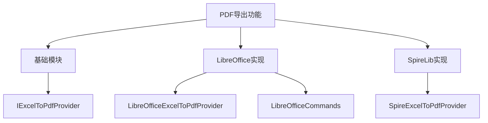
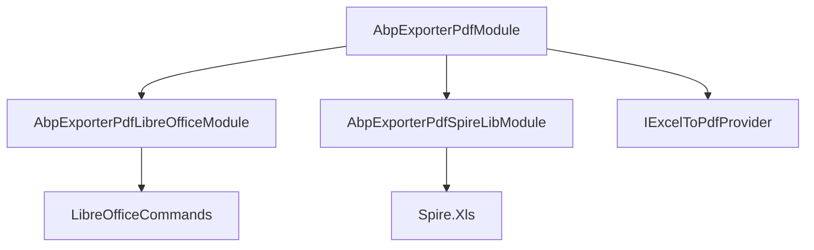
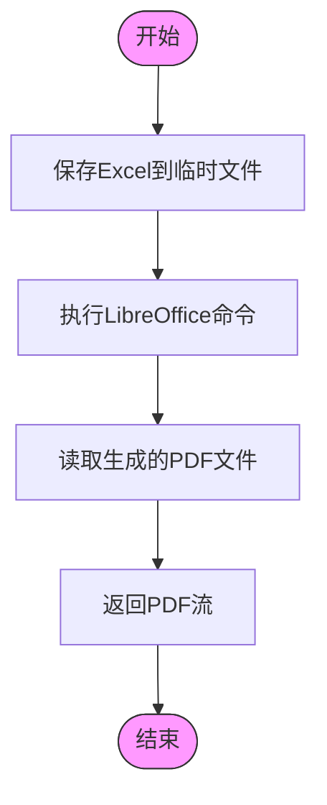
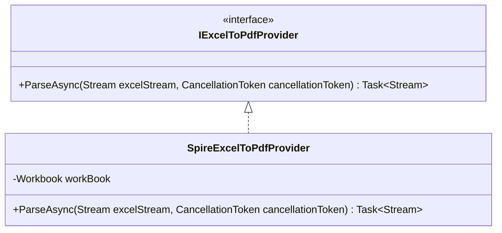
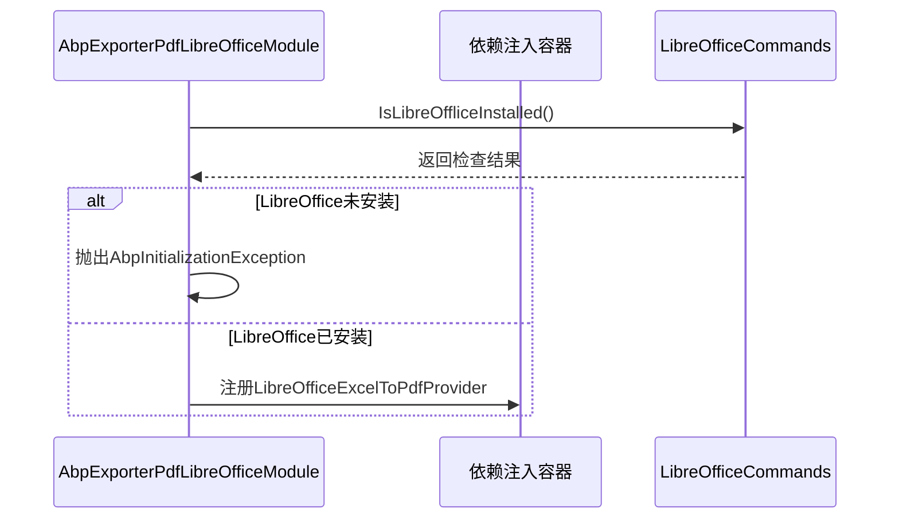
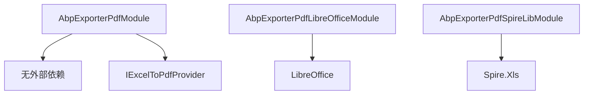

# PDF导出功能

<cite>
**本文档引用的文件**  
- [AbpExporterPdfModule.cs](file://aspnet-core/framework/exporter/LINGYUN.Abp.Exporter.Pdf/LINGYUN/Abp/Exporter/Pdf/AbpExporterPdfModule.cs)
- [IExcelToPdfProvider.cs](file://aspnet-core/framework/exporter/LINGYUN.Abp.Exporter.Pdf/LINGYUN/Abp/Exporter/Pdf/IExcelToPdfProvider.cs)
- [OriginalExcelToPdfProvider.cs](file://aspnet-core/framework/exporter/LINGYUN.Abp.Exporter.Pdf/LINGYUN/Abp/Exporter/Pdf/OriginalExcelToPdfProvider.cs)
- [LibreOfficeExcelToPdfProvider.cs](file://aspnet-core/framework/exporter/LINGYUN.Abp.Exporter.Pdf.LibreOffice/LINGYUN/Abp/Exporter/Pdf/LibreOffice/LibreOfficeExcelToPdfProvider.cs)
- [SpireExcelToPdfProvider.cs](file://aspnet-core/framework/exporter/LINGYUN.Abp.Exporter.Pdf.SpireLib/LINGYUN/Abp/Exporter/Pdf/SpireLib/SpireExcelToPdfProvider.cs)
- [LibreOfficeCommands.cs](file://aspnet-core/framework/exporter/LINGYUN.Abp.Exporter.Pdf.LibreOffice/LINGYUN/Abp/Exporter/Pdf/LibreOffice/LibreOfficeCommands.cs)
- [AbpExporterPdfLibreOfficeModule.cs](file://aspnet-core/framework/exporter/LINGYUN.Abp.Exporter.Pdf.LibreOffice/LINGYUN/Abp/Exporter/Pdf/LibreOffice/AbpExporterPdfLibreOfficeModule.cs)
- [AbpExporterPdfSpireLibModule.cs](file://aspnet-core/framework/exporter/LINGYUN.Abp.Exporter.Pdf.SpireLib/LINGYUN/Abp/Exporter/Pdf/SpireLib/AbpExporterPdfSpireLibModule.cs)
- [README.md](file://aspnet-core/framework/exporter/LINGYUN.Abp.Exporter.Pdf/README.md)
- [README.md](file://aspnet-core/framework/exporter/LINGYUN.Abp.Exporter.Pdf.LibreOffice/README.md)
</cite>

## 目录
1. [简介](#简介)
2. [项目结构](#项目结构)
3. [核心组件](#核心组件)
4. [架构概述](#架构概述)
5. [详细组件分析](#详细组件分析)
6. [依赖分析](#依赖分析)
7. [性能考虑](#性能考虑)
8. [故障排除指南](#故障排除指南)
9. [结论](#结论)

## 简介
本项目提供了基于LibreOffice和SpireLib的PDF导出功能，支持将Excel文件转换为PDF格式。系统通过模块化设计，允许开发者根据环境选择合适的转换引擎。LibreOffice实现基于命令行工具，适用于服务器环境；SpireLib实现基于商业库，提供更稳定的转换服务。系统还包含原始提供者作为默认实现，确保在没有安装特定依赖时仍能正常运行。

## 项目结构
项目采用分层架构，核心PDF导出功能位于`aspnet-core/framework/exporter`目录下，包含基础模块和两个具体实现模块。基础模块`LINGYUN.Abp.Exporter.Pdf`定义了通用接口和基础服务，而`LINGYUN.Abp.Exporter.Pdf.LibreOffice`和`LINGYUN.Abp.Exporter.Pdf.SpireLib`分别实现了基于LibreOffice和SpireLib的具体转换逻辑。

**图表来源**
- [AbpExporterPdfModule.cs](file://aspnet-core/framework/exporter/LINGYUN.Abp.Exporter.Pdf/LINGYUN/Abp/Exporter/Pdf/AbpExporterPdfModule.cs)
- [LibreOfficeExcelToPdfProvider.cs](file://aspnet-core/framework/exporter/LINGYUN.Abp.Exporter.Pdf.LibreOffice/LINGYUN/Abp/Exporter/Pdf/LibreOffice/LibreOfficeExcelToPdfProvider.cs)
- [SpireExcelToPdfProvider.cs](file://aspnet-core/framework/exporter/LINGYUN.Abp.Exporter.Pdf.SpireLib/LINGYUN/Abp/Exporter/Pdf/SpireLib/SpireExcelToPdfProvider.cs)

**章节来源**
- [AbpExporterPdfModule.cs](file://aspnet-core/framework/exporter/LINGYUN.Abp.Exporter.Pdf/LINGYUN/Abp/Exporter/Pdf/AbpExporterPdfModule.cs)
- [README.md](file://aspnet-core/framework/exporter/LINGYUN.Abp.Exporter.Pdf/README.md)

## 核心组件
核心组件包括`IExcelToPdfProvider`接口，定义了将Excel流转换为PDF流的契约。系统提供了三种实现：`OriginalExcelToPdfProvider`作为默认实现，直接返回输入流；`LibreOfficeExcelToPdfProvider`使用LibreOffice命令行工具进行转换；`SpireExcelToPdfProvider`使用Spire.Xls库进行转换。这些组件通过依赖注入系统注册，允许在运行时选择合适的实现。

**章节来源**
- [IExcelToPdfProvider.cs](file://aspnet-core/framework/exporter/LINGYUN.Abp.Exporter.Pdf/LINGYUN/Abp/Exporter/Pdf/IExcelToPdfProvider.cs)
- [OriginalExcelToPdfProvider.cs](file://aspnet-core/framework/exporter/LINGYUN.Abp.Exporter.Pdf/LINGYUN/Abp/Exporter/Pdf/OriginalExcelToPdfProvider.cs)

## 架构概述
系统采用模块化架构，通过ABP框架的模块系统实现功能扩展。基础模块`AbpExporterPdfModule`提供核心接口，而具体实现模块如`AbpExporterPdfLibreOfficeModule`和`AbpExporterPdfSpireLibModule`通过`DependsOn`特性依赖基础模块。这种设计实现了关注点分离，允许独立开发和测试各个组件。

**图表来源**
- [AbpExporterPdfModule.cs](file://aspnet-core/framework/exporter/LINGYUN.Abp.Exporter.Pdf/LINGYUN/Abp/Exporter/Pdf/AbpExporterPdfModule.cs)
- [AbpExporterPdfLibreOfficeModule.cs](file://aspnet-core/framework/exporter/LINGYUN.Abp.Exporter.Pdf.LibreOffice/LINGYUN/Abp/Exporter/Pdf/LibreOffice/AbpExporterPdfLibreOfficeModule.cs)
- [AbpExporterPdfSpireLibModule.cs](file://aspnet-core/framework/exporter/LINGYUN.Abp.Exporter.Pdf.SpireLib/LINGYUN/Abp/Exporter/Pdf/SpireLib/AbpExporterPdfSpireLibModule.cs)

## 详细组件分析

### LibreOffice实现分析
LibreOffice实现通过调用本地安装的LibreOffice命令行工具进行文档转换。该实现首先将输入的Excel流保存到临时文件，然后调用`soffice.com`或`libreoffice`命令进行转换，最后读取生成的PDF文件并返回其流。

#### 转换流程图

**图表来源**
- [LibreOfficeExcelToPdfProvider.cs](file://aspnet-core/framework/exporter/LINGYUN.Abp.Exporter.Pdf.LibreOffice/LINGYUN/Abp/Exporter/Pdf/LibreOffice/LibreOfficeExcelToPdfProvider.cs)
- [LibreOfficeCommands.cs](file://aspnet-core/framework/exporter/LINGYUN.Abp.Exporter.Pdf.LibreOffice/LINGYUN/Abp/Exporter/Pdf/LibreOffice/LibreOfficeCommands.cs)

**章节来源**
- [LibreOfficeExcelToPdfProvider.cs](file://aspnet-core/framework/exporter/LINGYUN.Abp.Exporter.Pdf.LibreOffice/LINGYUN/Abp/Exporter/Pdf/LibreOffice/LibreOfficeExcelToPdfProvider.cs)

### SpireLib实现分析
SpireLib实现使用Spire.Xls库直接在内存中进行文档转换，无需创建临时文件。该实现创建Workbook对象，加载输入流，然后直接将工作表保存为PDF流。

#### 类图

**图表来源**
- [SpireExcelToPdfProvider.cs](file://aspnet-core/framework/exporter/LINGYUN.Abp.Exporter.Pdf.SpireLib/LINGYUN/Abp/Exporter/Pdf/SpireLib/SpireExcelToPdfProvider.cs)
- [IExcelToPdfProvider.cs](file://aspnet-core/framework/exporter/LINGYUN.Abp.Exporter.Pdf/LINGYUN/Abp/Exporter/Pdf/IExcelToPdfProvider.cs)

**章节来源**
- [SpireExcelToPdfProvider.cs](file://aspnet-core/framework/exporter/LINGYUN.Abp.Exporter.Pdf.SpireLib/LINGYUN/Abp/Exporter/Pdf/SpireLib/SpireExcelToPdfProvider.cs)

### 配置与初始化
系统在模块初始化时注册相应的服务。LibreOffice模块在注册服务前会检查LibreOffice是否已安装，如果未安装则抛出异常。SpireLib模块则直接注册服务，依赖外部库的可用性。

**图表来源**
- [AbpExporterPdfLibreOfficeModule.cs](file://aspnet-core/framework/exporter/LINGYUN.Abp.Exporter.Pdf.LibreOffice/LINGYUN/Abp/Exporter/Pdf/LibreOffice/AbpExporterPdfLibreOfficeModule.cs)
- [LibreOfficeCommands.cs](file://aspnet-core/framework/exporter/LINGYUN.Abp.Exporter.Pdf.LibreOffice/LINGYUN/Abp/Exporter/Pdf/LibreOffice/LibreOfficeCommands.cs)

**章节来源**
- [AbpExporterPdfLibreOfficeModule.cs](file://aspnet-core/framework/exporter/LINGYUN.Abp.Exporter.Pdf.LibreOffice/LINGYUN/Abp/Exporter/Pdf/LibreOffice/AbpExporterPdfLibreOfficeModule.cs)

## 依赖分析
系统依赖关系清晰，基础模块不依赖任何外部库，而具体实现模块依赖各自的转换引擎。LibreOffice实现依赖操作系统环境和LibreOffice安装，SpireLib实现依赖Spire.Xls商业库。这种设计允许项目根据部署环境选择合适的实现方式。

**图表来源**
- [AbpExporterPdfModule.cs](file://aspnet-core/framework/exporter/LINGYUN.Abp.Exporter.Pdf/LINGYUN/Abp/Exporter/Pdf/AbpExporterPdfModule.cs)
- [AbpExporterPdfLibreOfficeModule.cs](file://aspnet-core/framework/exporter/LINGYUN.Abp.Exporter.Pdf.LibreOffice/LINGYUN/Abp/Exporter/Pdf/LibreOffice/AbpExporterPdfLibreOfficeModule.cs)
- [AbpExporterPdfSpireLibModule.cs](file://aspnet-core/framework/exporter/LINGYUN.Abp.Exporter.Pdf.SpireLib/LINGYUN/Abp/Exporter/Pdf/SpireLib/AbpExporterPdfSpireLibModule.cs)

**章节来源**
- [AbpExporterPdfModule.cs](file://aspnet-core/framework/exporter/LINGYUN.Abp.Exporter.Pdf/LINGYUN/Abp/Exporter/Pdf/AbpExporterPdfModule.cs)
- [AbpExporterPdfLibreOfficeModule.cs](file://aspnet-core/framework/exporter/LINGYUN.Abp.Exporter.Pdf.LibreOffice/LINGYUN/Abp/Exporter/Pdf/LibreOffice/AbpExporterPdfLibreOfficeModule.cs)
- [AbpExporterPdfSpireLibModule.cs](file://aspnet-core/framework/exporter/LINGYUN.Abp.Exporter.Pdf.SpireLib/LINGYUN/Abp/Exporter/Pdf/SpireLib/AbpExporterPdfSpireLibModule.cs)

## 性能考虑
LibreOffice实现在转换过程中需要创建临时文件，这可能影响性能，特别是在高并发场景下。SpireLib实现在内存中完成转换，避免了磁盘I/O，通常具有更好的性能表现。开发者应根据实际需求和部署环境选择合适的实现方式。对于需要处理大量文档转换的场景，建议使用SpireLib实现。

## 故障排除指南
常见问题包括LibreOffice未安装、路径配置错误和权限问题。对于LibreOffice实现，确保`soffice.com`或`libreoffice`命令可在系统路径中访问，或通过`LibreOfficeCommands.WindowsCliDir`和`LibreOfficeCommands.UnixCliDir`指定自定义路径。在Linux环境中，可能需要安装额外的字体包以正确显示中文字符。

**章节来源**
- [LibreOfficeCommands.cs](file://aspnet-core/framework/exporter/LINGYUN.Abp.Exporter.Pdf.LibreOffice/LINGYUN/Abp/Exporter/Pdf/LibreOffice/LibreOfficeCommands.cs)
- [README.md](file://aspnet-core/framework/exporter/LINGYUN.Abp.Exporter.Pdf.LibreOffice/README.md)

## 结论
本PDF导出功能提供了灵活的架构设计，支持多种文档转换引擎。开发者可以根据项目需求和部署环境选择合适的实现方式。对于需要开源解决方案的场景，LibreOffice实现是一个不错的选择；对于需要高性能和稳定性的生产环境，SpireLib实现更为合适。系统的模块化设计使得扩展新的转换引擎变得简单，只需实现`IExcelToPdfProvider`接口并注册服务即可。