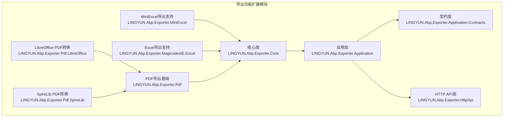
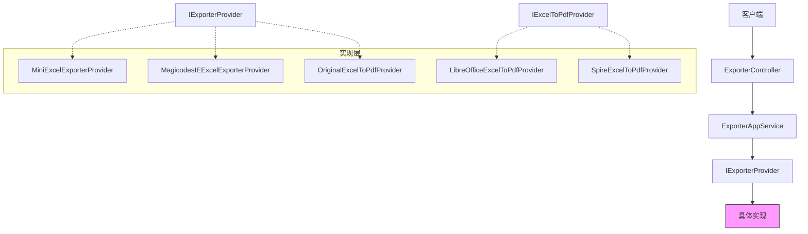
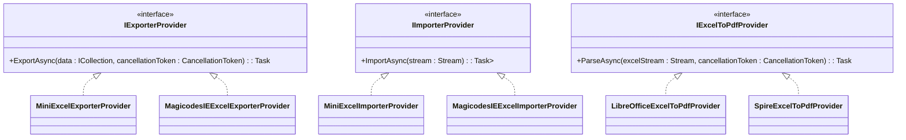
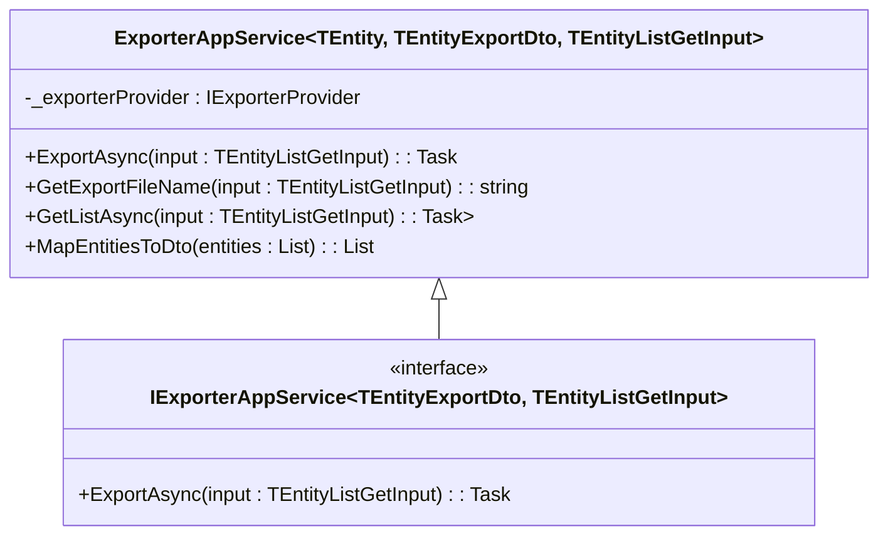
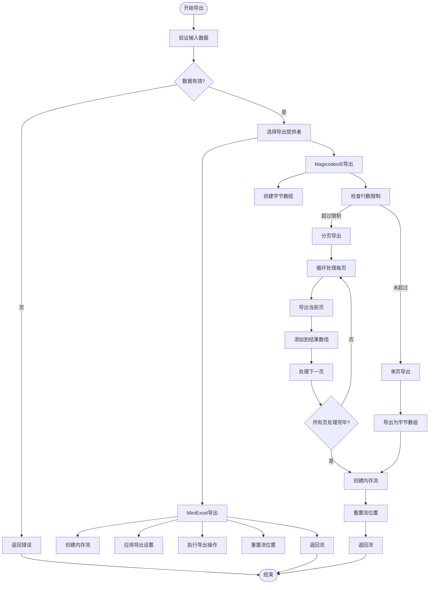
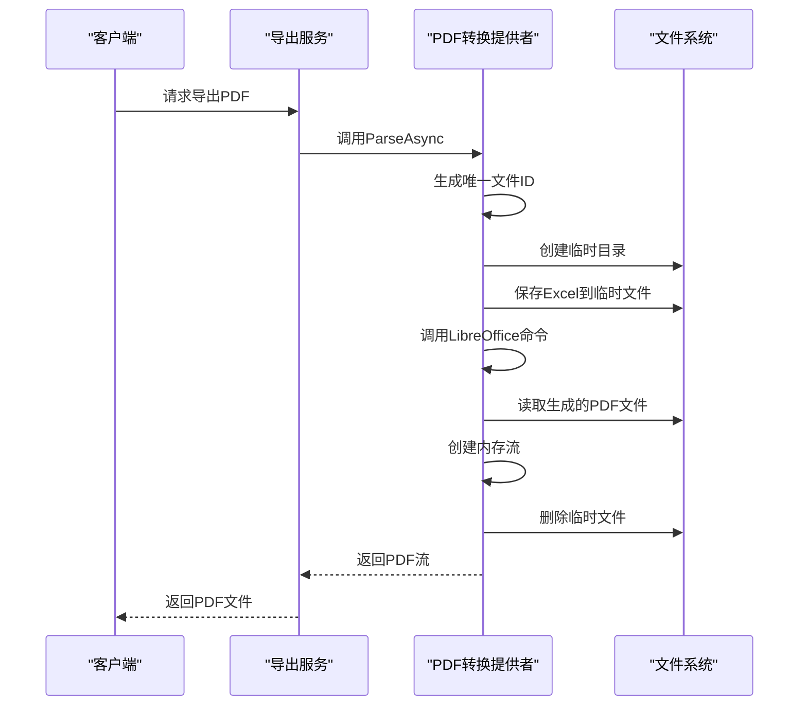
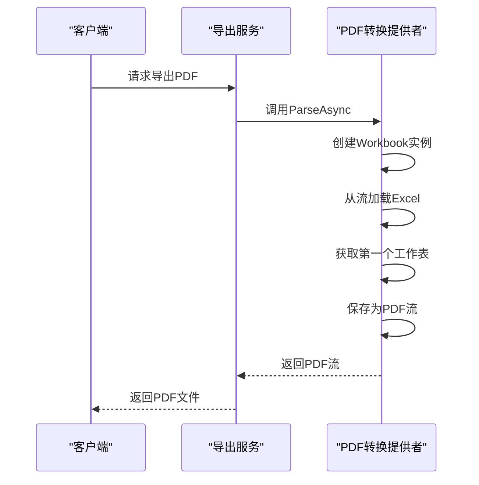
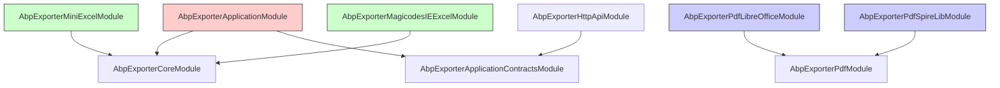

# 导出功能扩展

<cite>
**本文档中引用的文件**  
- [IExporterProvider.cs](file://aspnet-core/framework/exporter/LINGYUN.Abp.Exporter.Core/LINGYUN/Abp/Exporter/IExporterProvider.cs)
- [MiniExcelExporterProvider.cs](file://aspnet-core/framework/exporter/LINGYUN.Abp.Exporter.MiniExcel/LINGYUN/Abp/Exporter/MiniExcelExporterProvider.cs)
- [MagicodesIEExcelExporterProvider.cs](file://aspnet-core/framework/exporter/LINGYUN.Abp.Exporter.MagicodesIE.Excel/LINGYUN/Abp/Exporter/MagicodesIEExcelExporterProvider.cs)
- [LibreOfficeExcelToPdfProvider.cs](file://aspnet-core/framework/exporter/LINGYUN.Abp.Exporter.Pdf.LibreOffice/LINGYUN/Abp/Exporter/Pdf/LibreOffice/LibreOfficeExcelToPdfProvider.cs)
- [SpireExcelToPdfProvider.cs](file://aspnet-core/framework/exporter/LINGYUN.Abp.Exporter.Pdf.SpireLib/LINGYUN/Abp/Exporter/Pdf/SpireLib/SpireExcelToPdfProvider.cs)
- [ExporterAppService.cs](file://aspnet-core/framework/exporter/LINGYUN.Abp.Exporter.Application/LINGYUN/Abp/Exporter/ExporterAppService.cs)
- [IExporterAppService.cs](file://aspnet-core/framework/exporter/LINGYUN.Abp.Exporter.Application.Contracts/LINGYUN/Abp/Exporter/IExporterAppService.cs)
- [ExporterController.cs](file://aspnet-core/framework/exporter/LINGYUN.Abp.Exporter.HttpApi/LINGYUN/Abp/Exporter/ExporterController.cs)
</cite>

## 目录
1. [简介](#简介)
2. [项目结构](#项目结构)
3. [核心组件](#核心组件)
4. [架构概述](#架构概述)
5. [详细组件分析](#详细组件分析)
6. [依赖分析](#依赖分析)
7. [性能考虑](#性能考虑)
8. [故障排除指南](#故障排除指南)
9. [结论](#结论)

## 简介
本项目提供了一套完整的数据导出功能扩展，支持多种导出格式，包括Excel、PDF等。系统采用模块化设计，通过依赖注入机制实现不同导出格式的灵活切换。导出功能基于ABP框架构建，提供了统一的API接口和可扩展的架构，使开发者能够轻松集成和定制导出功能。

## 项目结构
导出功能扩展模块采用分层架构设计，各层职责明确，便于维护和扩展。

**图示来源**  
- [IExporterProvider.cs](file://aspnet-core/framework/exporter/LINGYUN.Abp.Exporter.Core/LINGYUN/Abp/Exporter/IExporterProvider.cs)
- [ExporterAppService.cs](file://aspnet-core/framework/exporter/LINGYUN.Abp.Exporter.Application/LINGYUN/Abp/Exporter/ExporterAppService.cs)
- [IExporterAppService.cs](file://aspnet-core/framework/exporter/LINGYUN.Abp.Exporter.Application.Contracts/LINGYUN/Abp/Exporter/IExporterAppService.cs)

**本节来源**  
- [IExporterProvider.cs](file://aspnet-core/framework/exporter/LINGYUN.Abp.Exporter.Core/LINGYUN/Abp/Exporter/IExporterProvider.cs)
- [ExporterAppService.cs](file://aspnet-core/framework/exporter/LINGYUN.Abp.Exporter.Application/LINGYUN/Abp/Exporter/ExporterAppService.cs)

## 核心组件
导出功能扩展的核心组件包括导出提供者接口、具体实现类、应用服务和控制器。核心设计基于接口编程和依赖注入，确保系统的可扩展性和可测试性。

**本节来源**  
- [IExporterProvider.cs](file://aspnet-core/framework/exporter/LINGYUN.Abp.Exporter.Core/LINGYUN/Abp/Exporter/IExporterProvider.cs)
- [ExporterAppService.cs](file://aspnet-core/framework/exporter/LINGYUN.Abp.Exporter.Application/LINGYUN/Abp/Exporter/ExporterAppService.cs)

## 架构概述
导出功能扩展采用典型的分层架构，从上到下分为HTTP API层、应用层、核心层和具体实现层。这种分层设计实现了关注点分离，提高了代码的可维护性和可测试性。

**图示来源**  
- [ExporterController.cs](file://aspnet-core/framework/exporter/LINGYUN.Abp.Exporter.HttpApi/LINGYUN/Abp/Exporter/ExporterController.cs)
- [ExporterAppService.cs](file://aspnet-core/framework/exporter/LINGYUN.Abp.Exporter.Application/LINGYUN/Abp/Exporter/ExporterAppService.cs)
- [IExporterProvider.cs](file://aspnet-core/framework/exporter/LINGYUN.Abp.Exporter.Core/LINGYUN/Abp/Exporter/IExporterProvider.cs)

## 详细组件分析

### 核心接口分析
导出功能的核心是`IExporterProvider`接口，它定义了所有导出提供者必须实现的方法。

**图示来源**  
- [IExporterProvider.cs](file://aspnet-core/framework/exporter/LINGYUN.Abp.Exporter.Core/LINGYUN/Abp/Exporter/IExporterProvider.cs)
- [MiniExcelExporterProvider.cs](file://aspnet-core/framework/exporter/LINGYUN.Abp.Exporter.MiniExcel/LINGYUN/Abp/Exporter/MiniExcelExporterProvider.cs)
- [MagicodesIEExcelExporterProvider.cs](file://aspnet-core/framework/exporter/LINGYUN.Abp.Exporter.MagicodesIE.Excel/LINGYUN/Abp/Exporter/MagicodesIEExcelExporterProvider.cs)

### 应用服务分析
`ExporterAppService`是导出功能的应用服务基类，为具体的业务实体导出提供了通用实现。

**图示来源**  
- [ExporterAppService.cs](file://aspnet-core/framework/exporter/LINGYUN.Abp.Exporter.Application/LINGYUN/Abp/Exporter/ExporterAppService.cs)
- [IExporterAppService.cs](file://aspnet-core/framework/exporter/LINGYUN.Abp.Exporter.Application.Contracts/LINGYUN/Abp/Exporter/IExporterAppService.cs)

### 导出实现分析
导出功能通过不同的提供者实现多种格式的导出，包括MiniExcel和MagicodesIE.Excel两种Excel导出方式。

**图示来源**  
- [MiniExcelExporterProvider.cs](file://aspnet-core/framework/exporter/LINGYUN.Abp.Exporter.MiniExcel/LINGYUN/Abp/Exporter/MiniExcelExporterProvider.cs)
- [MagicodesIEExcelExporterProvider.cs](file://aspnet-core/framework/exporter/LINGYUN.Abp.Exporter.MagicodesIE.Excel/LINGYUN/Abp/Exporter/MagicodesIEExcelExporterProvider.cs)

### PDF转换分析
PDF转换功能通过两种不同的实现方式提供：LibreOffice和SpireLib，为开发者提供了灵活的选择。

**图示来源**  
- [LibreOfficeExcelToPdfProvider.cs](file://aspnet-core/framework/exporter/LINGYUN.Abp.Exporter.Pdf.LibreOffice/LINGYUN/Abp/Exporter/Pdf/LibreOffice/LibreOfficeExcelToPdfProvider.cs)
- [SpireExcelToPdfProvider.cs](file://aspnet-core/framework/exporter/LINGYUN.Abp.Exporter.Pdf.SpireLib/LINGYUN/Abp/Exporter/Pdf/SpireLib/SpireExcelToPdfProvider.cs)

**本节来源**  
- [MiniExcelExporterProvider.cs](file://aspnet-core/framework/exporter/LINGYUN.Abp.Exporter.MiniExcel/LINGYUN/Abp/Exporter/MiniExcelExporterProvider.cs)
- [MagicodesIEExcelExporterProvider.cs](file://aspnet-core/framework/exporter/LINGYUN.Abp.Exporter.MagicodesIE.Excel/LINGYUN/Abp/Exporter/MagicodesIEExcelExporterProvider.cs)
- [LibreOfficeExcelToPdfProvider.cs](file://aspnet-core/framework/exporter/LINGYUN.Abp.Exporter.Pdf.LibreOffice/LINGYUN/Abp/Exporter/Pdf/LibreOffice/LibreOfficeExcelToPdfProvider.cs)
- [SpireExcelToPdfProvider.cs](file://aspnet-core/framework/exporter/LINGYUN.Abp.Exporter.Pdf.SpireLib/LINGYUN/Abp/Exporter/Pdf/SpireLib/SpireExcelToPdfProvider.cs)

## 依赖分析
导出功能扩展模块的依赖关系清晰，各组件之间通过接口进行通信，降低了耦合度。

**图示来源**  
- [AbpExporterApplicationModule.cs](file://aspnet-core/framework/exporter/LINGYUN.Abp.Exporter.Application/LINGYUN/Abp/Exporter/AbpExporterApplicationModule.cs)
- [AbpExporterMiniExcelModule.cs](file://aspnet-core/framework/exporter/LINGYUN.Abp.Exporter.MiniExcel/LINGYUN/Abp/Exporter/AbpExporterMiniExcelModule.cs)
- [AbpExporterPdfLibreOfficeModule.cs](file://aspnet-core/framework/exporter/LINGYUN.Abp.Exporter.Pdf.LibreOffice/LINGYUN/Abp/Exporter/Pdf/LibreOffice/AbpExporterPdfLibreOfficeModule.cs)
- [AbpExporterPdfSpireLibModule.cs](file://aspnet-core/framework/exporter/LINGYUN.Abp.Exporter.Pdf.SpireLib/LINGYUN/Abp/Exporter/Pdf/SpireLib/AbpExporterPdfSpireLibModule.cs)

**本节来源**  
- [AbpExporterApplicationModule.cs](file://aspnet-core/framework/exporter/LINGYUN.Abp.Exporter.Application/LINGYUN/Abp/Exporter/AbpExporterApplicationModule.cs)
- [AbpExporterMiniExcelModule.cs](file://aspnet-core/framework/exporter/LINGYUN.Abp.Exporter.MiniExcel/LINGYUN/Abp/Exporter/AbpExporterMiniExcelModule.cs)

## 性能考虑
在处理大数据量导出时，需要考虑内存使用、文件大小和导出时间等因素。MiniExcel和MagicodesIE.Excel都提供了处理大数据量的机制，其中MagicodesIE.Excel通过分页导出避免内存溢出问题。PDF转换方面，SpireLib直接在内存中完成转换，而LibreOffice需要创建临时文件，前者性能更高但需要商业许可，后者使用开源工具但需要额外的系统配置。

## 故障排除指南
常见问题包括PDF转换工具未安装、临时文件权限问题、大文件导出超时等。对于LibreOffice转换，需要确保LibreOffice已正确安装并配置环境变量。对于大文件导出，建议增加请求超时时间并考虑分批导出策略。

**本节来源**  
- [LibreOfficeExcelToPdfProvider.cs](file://aspnet-core/framework/exporter/LINGYUN.Abp.Exporter.Pdf.LibreOffice/LINGYUN/Abp/Exporter/Pdf/LibreOffice/LibreOfficeExcelToPdfProvider.cs)
- [SpireExcelToPdfProvider.cs](file://aspnet-core/framework/exporter/LINGYUN.Abp.Exporter.Pdf.SpireLib/LINGYUN/Abp/Exporter/Pdf/SpireLib/SpireExcelToPdfProvider.cs)

## 结论
导出功能扩展提供了一套完整、灵活且可扩展的数据导出解决方案。通过模块化设计和依赖注入，开发者可以轻松集成和定制导出功能。系统支持多种导出格式和转换方式，满足不同场景的需求。建议根据具体需求选择合适的导出实现，并注意处理大数据量导出时的性能和内存问题。