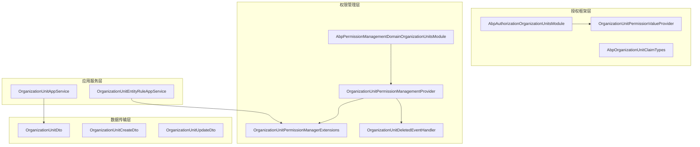
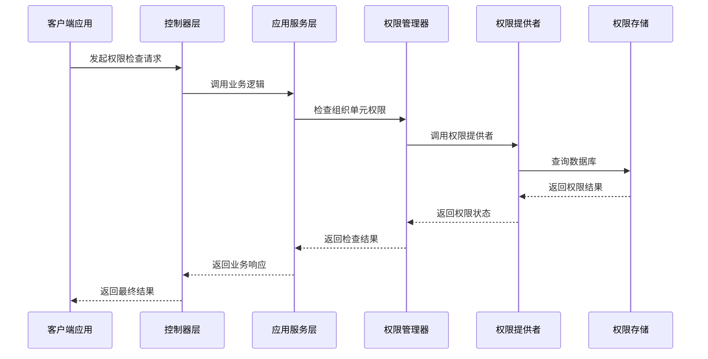
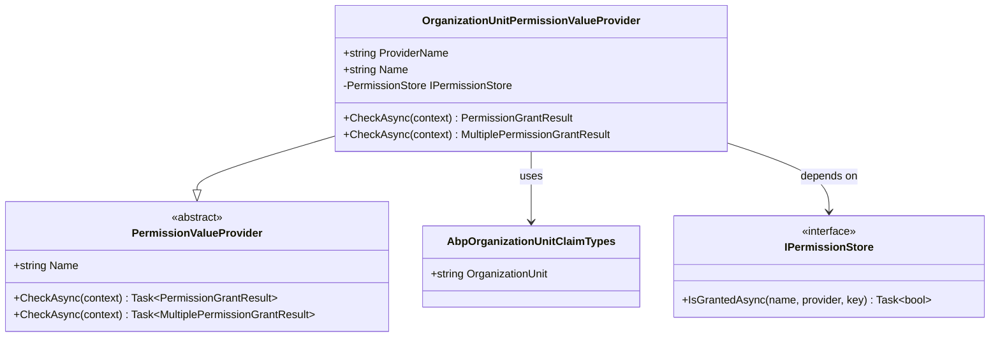
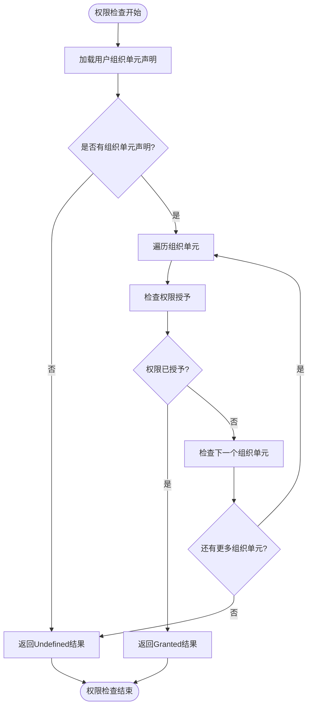
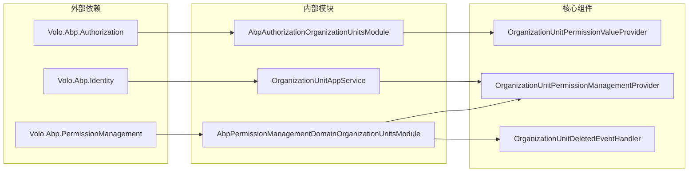

# 授权扩展

<cite>
**本文档中引用的文件**
- [AbpAuthorizationOrganizationUnitsModule.cs](file://aspnet-core/framework/authorization/LINGYUN.Abp.Authorization.OrganizationUnits/LINGYUN/Abp/Authorization/OrganizationUnits/AbpAuthorizationOrganizationUnitsModule.cs)
- [OrganizationUnitPermissionValueProvider.cs](file://aspnet-core/framework/authorization/LINGYUN.Abp.Authorization.OrganizationUnits/LINGYUN/Abp/Authorization/Permissions/OrganizationUnitPermissionValueProvider.cs)
- [AbpOrganizationUnitClaimTypes.cs](file://aspnet-core/framework/authorization/LINGYUN.Abp.Authorization.OrganizationUnits/LINGYUN/Abp/Authorization/OrganizationUnits/AbpOrganizationUnitClaimTypes.cs)
- [OrganizationUnitPermissionManagementProvider.cs](file://aspnet-core/modules/permissions-management/LINGYUN.Abp.PermissionManagement.Domain.OrganizationUnits/LINGYUN/Abp/PermissionManagement/OrganizationUnits/OrganizationUnitPermissionManagementProvider.cs)
- [AbpPermissionManagementDomainOrganizationUnitsModule.cs](file://aspnet-core/modules/permissions-management/LINGYUN.Abp.PermissionManagement.Domain.OrganizationUnits/LINGYUN/Abp/PermissionManagement/OrganizationUnits/AbpPermissionManagementDomainOrganizationUnitsModule.cs)
- [OrganizationUnitPermissionManagerExtensions.cs](file://aspnet-core/modules/permissions-management/LINGYUN.Abp.PermissionManagement.Domain.OrganizationUnits/Volo/Abp/PermissionManagement/OrganizationUnitPermissionManagerExtensions.cs)
- [OrganizationUnitDeletedEventHandler.cs](file://aspnet-core/modules/permissions-management/LINGYUN.Abp.PermissionManagement.Domain.OrganizationUnits/LINGYUN/Abp/PermissionManagement/OrganizationUnits/OrganizationUnitDeletedEventHandler.cs)
- [OrganizationUnitAppService.cs](file://aspnet-core/modules/identity/LINGYUN.Abp.Identity.Application/LINGYUN/Abp/Identity/OrganizationUnitAppService.cs)
- [OrganizationUnitDto.cs](file://aspnet-core/modules/identity/LINGYUN.Abp.Identity.Application.Contracts/LINGYUN/Abp/Identity/Dto/OrganizationUnitDto.cs)
- [OrganizationUnitEntityRuleAppService.cs](file://aspnet-core/modules/data-protection/LINGYUN.Abp.DataProtectionManagement.Application/LINGYUN/Abp/DataProtectionManagement/OrganizationUnitEntityRuleAppService.cs)
</cite>

## 目录
1. [简介](#简介)
2. [项目结构](#项目结构)
3. [核心组件](#核心组件)
4. [架构概览](#架构概览)
5. [详细组件分析](#详细组件分析)
6. [依赖关系分析](#依赖关系分析)
7. [性能考虑](#性能考虑)
8. [故障排除指南](#故障排除指南)
9. [结论](#结论)

## 简介

授权扩展模块是基于ABP框架构建的细粒度权限控制系统，专门设计用于支持组织单元级别的权限控制。该模块提供了完整的组织单元权限管理解决方案，包括基于组织单元的权限验证、角色分配、用户管理和权限继承等核心功能。

该模块的核心价值在于：
- **细粒度权限控制**：支持按组织单元维度进行精确的权限管理
- **灵活的权限模型**：支持权限的继承、覆盖和组合
- **自动化的权限清理**：组织单元删除时自动清理相关权限
- **高性能查询**：优化的权限检查算法，支持批量权限验证
- **无缝集成**：与ABP身份认证和权限管理系统深度集成

## 项目结构

授权扩展模块采用分层架构设计，主要分为以下几个层次：



**图表来源**
- [AbpAuthorizationOrganizationUnitsModule.cs](file://aspnet-core/framework/authorization/LINGYUN.Abp.Authorization.OrganizationUnits/LINGYUN/Abp/Authorization/OrganizationUnits/AbpAuthorizationOrganizationUnitsModule.cs#L1-L19)
- [AbpPermissionManagementDomainOrganizationUnitsModule.cs](file://aspnet-core/modules/permissions-management/LINGYUN.Abp.PermissionManagement.Domain.OrganizationUnits/LINGYUN/Abp/PermissionManagement/OrganizationUnits/AbpPermissionManagementDomainOrganizationUnitsModule.cs#L1-L26)

**章节来源**
- [AbpAuthorizationOrganizationUnitsModule.cs](file://aspnet-core/framework/authorization/LINGYUN.Abp.Authorization.OrganizationUnits/LINGYUN/Abp/Authorization/OrganizationUnits/AbpAuthorizationOrganizationUnitsModule.cs#L1-L19)
- [AbpPermissionManagementDomainOrganizationUnitsModule.cs](file://aspnet-core/modules/permissions-management/LINGYUN.Abp.PermissionManagement.Domain.OrganizationUnits/LINGYUN/Abp/PermissionManagement/OrganizationUnits/AbpPermissionManagementDomainOrganizationUnitsModule.cs#L1-L26)

## 核心组件

### 权限值提供者 (OrganizationUnitPermissionValueProvider)

这是组织单元权限验证的核心组件，负责检查用户是否具有特定组织单元的权限。

```csharp
public class OrganizationUnitPermissionValueProvider : PermissionValueProvider
{
    public const string ProviderName = "O";
    
    public override string Name => ProviderName;
    
    public async override Task<PermissionGrantResult> CheckAsync(PermissionValueCheckContext context)
    {
        var organizationUnits = context.Principal?.FindAll(AbpOrganizationUnitClaimTypes.OrganizationUnit)
            .Select(c => c.Value).ToArray();
            
        if (organizationUnits == null || !organizationUnits.Any())
        {
            return PermissionGrantResult.Undefined;
        }
        
        foreach (var organizationUnit in organizationUnits.Distinct())
        {
            if (await PermissionStore.IsGrantedAsync(context.Permission.Name, Name, organizationUnit))
            {
                return PermissionGrantResult.Granted;
            }
        }
        
        return PermissionGrantResult.Undefined;
    }
}
```

### 权限管理提供者 (OrganizationUnitPermissionManagementProvider)

负责管理组织单元权限的分配和检查，支持多种权限检查模式。

```csharp
public class OrganizationUnitPermissionManagementProvider : PermissionManagementProvider
{
    public override string Name => OrganizationUnitPermissionValueProvider.ProviderName;
    
    public override async Task<MultiplePermissionValueProviderGrantInfo> CheckAsync(string[] names, string providerName, string providerKey)
    {
        var multiplePermissionValueProviderGrantInfo = new MultiplePermissionValueProviderGrantInfo(names);
        var permissionGrants = new List<PermissionGrant>();
        
        if (providerName == Name)
        {
            permissionGrants.AddRange(await PermissionGrantRepository.GetListAsync(names, providerName, providerKey));
        }
        
        // 处理角色和用户权限检查逻辑
        // ...
        
        return multiplePermissionValueProviderGrantInfo;
    }
}
```

**章节来源**
- [OrganizationUnitPermissionValueProvider.cs](file://aspnet-core/framework/authorization/LINGYUN.Abp.Authorization.OrganizationUnits/LINGYUN/Abp/Authorization/Permissions/OrganizationUnitPermissionValueProvider.cs#L1-L83)
- [OrganizationUnitPermissionManagementProvider.cs](file://aspnet-core/modules/permissions-management/LINGYUN.Abp.PermissionManagement.Domain.OrganizationUnits/LINGYUN/Abp/PermissionManagement/OrganizationUnits/OrganizationUnitPermissionManagementProvider.cs#L1-L108)

## 架构概览

授权扩展采用多层架构设计，确保了系统的可扩展性和维护性：



**图表来源**
- [OrganizationUnitPermissionValueProvider.cs](file://aspnet-core/framework/authorization/LINGYUN.Abp.Authorization.OrganizationUnits/LINGYUN/Abp/Authorization/Permissions/OrganizationUnitPermissionValueProvider.cs#L25-L45)
- [OrganizationUnitPermissionManagerExtensions.cs](file://aspnet-core/modules/permissions-management/LINGYUN.Abp.PermissionManagement.Domain.OrganizationUnits/Volo/Abp/PermissionManagement/OrganizationUnitPermissionManagerExtensions.cs#L8-L20)

## 详细组件分析

### 组织单元权限值提供者



**图表来源**
- [OrganizationUnitPermissionValueProvider.cs](file://aspnet-core/framework/authorization/LINGYUN.Abp.Authorization.OrganizationUnits/LINGYUN/Abp/Authorization/Permissions/OrganizationUnitPermissionValueProvider.cs#L10-L20)
- [AbpOrganizationUnitClaimTypes.cs](file://aspnet-core/framework/authorization/LINGYUN.Abp.Authorization.OrganizationUnits/LINGYUN/Abp/Authorization/OrganizationUnits/AbpOrganizationUnitClaimTypes.cs#L3-L6)

### 权限管理提供者架构



**图表来源**
- [OrganizationUnitPermissionValueProvider.cs](file://aspnet-core/framework/authorization/LINGYUN.Abp.Authorization.OrganizationUnits/LINGYUN/Abp/Authorization/Permissions/OrganizationUnitPermissionValueProvider.cs#L25-L45)

### 批量权限检查流程

对于需要同时检查多个权限的情况，系统提供了高效的批量检查机制：

```csharp
public async override Task<MultiplePermissionGrantResult> CheckAsync(PermissionValuesCheckContext context)
{
    var permissionNames = context.Permissions.Select(x => x.Name).Distinct().ToList();
    var result = new MultiplePermissionGrantResult(permissionNames.ToArray());
    
    var organizationUnits = context.Principal?.FindAll(AbpOrganizationUnitClaimTypes.OrganizationUnit)
        .Select(c => c.Value).ToArray();
        
    if (organizationUnits == null || !organizationUnits.Any())
    {
        return result;
    }
    
    foreach (var organizationUnit in organizationUnits.Distinct())
    {
        var multipleResult = await PermissionStore.IsGrantedAsync(permissionNames.ToArray(), Name, organizationUnit);
        
        foreach (var grantResult in multipleResult.Result.Where(grantResult =>
            result.Result.ContainsKey(grantResult.Key) &&
            result.Result[grantResult.Key] == PermissionGrantResult.Undefined &&
            grantResult.Value != PermissionGrantResult.Undefined))
        {
            result.Result[grantResult.Key] = grantResult.Value;
            permissionNames.RemoveAll(x => x == grantResult.Key);
        }
        
        if (result.AllGranted || result.AllProhibited)
        {
            break;
        }
        
        if (permissionNames.IsNullOrEmpty())
        {
            break;
        }
    }
    
    return result;
}
```

**章节来源**
- [OrganizationUnitPermissionValueProvider.cs](file://aspnet-core/framework/authorization/LINGYUN.Abp.Authorization.OrganizationUnits/LINGYUN/Abp/Authorization/Permissions/OrganizationUnitPermissionValueProvider.cs#L47-L83)

### 组织单元权限管理扩展

系统提供了便捷的扩展方法来简化组织单元权限的操作：

```csharp
// 获取特定组织单元的权限状态
public static Task<PermissionWithGrantedProviders> GetForOrganizationUnitAsync(
    this IPermissionManager permissionManager,
    string organizationUnitCode,
    string permissionName)

// 获取组织单元的所有权限
public static Task<List<PermissionWithGrantedProviders>> GetAllForOrganizationUnitAsync(
    this IPermissionManager permissionManager,
    string organizationUnitCode)

// 设置组织单元权限
public static Task SetForOrganizationUnitAsync(
    this IPermissionManager permissionManager,
    string organizationUnitCode,
    string permissionName,
    bool isGranted)
```

### 自动权限清理机制

当组织单元被删除时，系统会自动清理相关的权限数据：

```csharp
public async Task HandleEventAsync(EntityDeletedEto<OrganizationUnitEto> eventData)
{
    await PermissionManager.DeleteAsync(OrganizationUnitPermissionValueProvider.ProviderName, eventData.Entity.Code);
    await PermissionManager.DeleteAsync(OrganizationUnitPermissionValueProvider.ProviderName, eventData.Entity.Id.ToString());
}
```

**章节来源**
- [OrganizationUnitPermissionManagerExtensions.cs](file://aspnet-core/modules/permissions-management/LINGYUN.Abp.PermissionManagement.Domain.OrganizationUnits/Volo/Abp/PermissionManagement/OrganizationUnitPermissionManagerExtensions.cs#L1-L41)
- [OrganizationUnitDeletedEventHandler.cs](file://aspnet-core/modules/permissions-management/LINGYUN.Abp.PermissionManagement.Domain.OrganizationUnits/LINGYUN/Abp/PermissionManagement/OrganizationUnits/OrganizationUnitDeletedEventHandler.cs#L20-L27)

## 依赖关系分析

授权扩展模块的依赖关系体现了清晰的分层架构：



**图表来源**
- [AbpAuthorizationOrganizationUnitsModule.cs](file://aspnet-core/framework/authorization/LINGYUN.Abp.Authorization.OrganizationUnits/LINGYUN/Abp/Authorization/OrganizationUnits/AbpAuthorizationOrganizationUnitsModule.cs#L5-L7)
- [AbpPermissionManagementDomainOrganizationUnitsModule.cs](file://aspnet-core/modules/permissions-management/LINGYUN.Abp.PermissionManagement.Domain.OrganizationUnits/LINGYUN/Abp/PermissionManagement/OrganizationUnits/AbpPermissionManagementDomainOrganizationUnitsModule.cs#L8-L14)

**章节来源**
- [AbpAuthorizationOrganizationUnitsModule.cs](file://aspnet-core/framework/authorization/LINGYUN.Abp.Authorization.OrganizationUnits/LINGYUN/Abp/Authorization/OrganizationUnits/AbpAuthorizationOrganizationUnitsModule.cs#L1-L19)
- [AbpPermissionManagementDomainOrganizationUnitsModule.cs](file://aspnet-core/modules/permissions-management/LINGYUN.Abp.PermissionManagement.Domain.OrganizationUnits/LINGYUN/Abp/PermissionManagement/OrganizationUnits/AbpPermissionManagementDomainOrganizationUnitsModule.cs#L1-L26)

## 性能考虑

### 权限检查优化

1. **批量权限检查**：支持一次检查多个权限，减少数据库查询次数
2. **缓存策略**：利用ABP的权限缓存机制提高查询性能
3. **索引优化**：在权限表上建立适当的索引以加速查询
4. **去重处理**：对重复的组织单元进行去重处理

### 内存使用优化

1. **流式处理**：对于大量权限检查，采用流式处理避免内存溢出
2. **异步操作**：所有数据库操作都采用异步模式
3. **资源释放**：及时释放不再使用的资源

### 数据库查询优化

1. **单次查询**：通过IN子句一次性获取多个组织单元的权限
2. **投影查询**：只查询必要的字段，减少网络传输
3. **连接池**：合理配置数据库连接池参数

## 故障排除指南

### 常见问题及解决方案

#### 1. 权限检查失败

**症状**：用户无法访问应该有权限的功能

**可能原因**：
- 用户未正确分配到组织单元
- 组织单元权限未正确设置
- 权限提供者配置错误

**解决方案**：
```csharp
// 检查用户是否属于正确的组织单元
var organizationUnits = currentUser.FindOrganizationUnits();
if (!organizationUnits.Any())
{
    // 用户未分配到任何组织单元
}

// 检查具体权限
var permissionResult = await permissionManager.GetAsync(
    "YourPermissionName", 
    OrganizationUnitPermissionValueProvider.ProviderName, 
    "YourOrganizationUnitCode");
```

#### 2. 权限继承问题

**症状**：子组织单元无法继承父组织单元的权限

**解决方案**：
- 确保权限提供者正确实现了继承逻辑
- 检查组织单元层级关系
- 验证权限存储中的数据完整性

#### 3. 性能问题

**症状**：权限检查响应时间过长

**解决方案**：
- 启用权限缓存
- 优化数据库索引
- 减少不必要的权限检查
- 使用批量权限检查

**章节来源**
- [OrganizationUnitPermissionValueProvider.cs](file://aspnet-core/framework/authorization/LINGYUN.Abp.Authorization.OrganizationUnits/LINGYUN/Abp/Authorization/Permissions/OrganizationUnitPermissionValueProvider.cs#L25-L45)

## 结论

授权扩展模块为ABP应用程序提供了强大而灵活的组织单元权限管理能力。通过其精心设计的架构和丰富的功能特性，开发者可以轻松实现复杂的权限控制需求。

### 主要优势

1. **细粒度控制**：支持按组织单元维度进行精确的权限管理
2. **高度可扩展**：模块化设计便于功能扩展和定制
3. **性能优异**：优化的查询算法和缓存机制确保高性能
4. **易于使用**：简洁的API和丰富的扩展方法降低开发难度
5. **自动维护**：自动权限清理机制减少维护工作量

### 最佳实践建议

1. **合理设计组织单元结构**：根据业务需求设计清晰的组织单元层级
2. **充分利用权限继承**：通过合理的权限继承减少重复配置
3. **启用权限缓存**：在生产环境中启用权限缓存以提高性能
4. **定期清理无效权限**：定期检查和清理不再需要的权限数据
5. **监控权限使用情况**：建立权限使用监控机制，及时发现异常

该模块为现代企业级应用提供了坚实的权限管理基础，是构建安全可靠系统的理想选择。