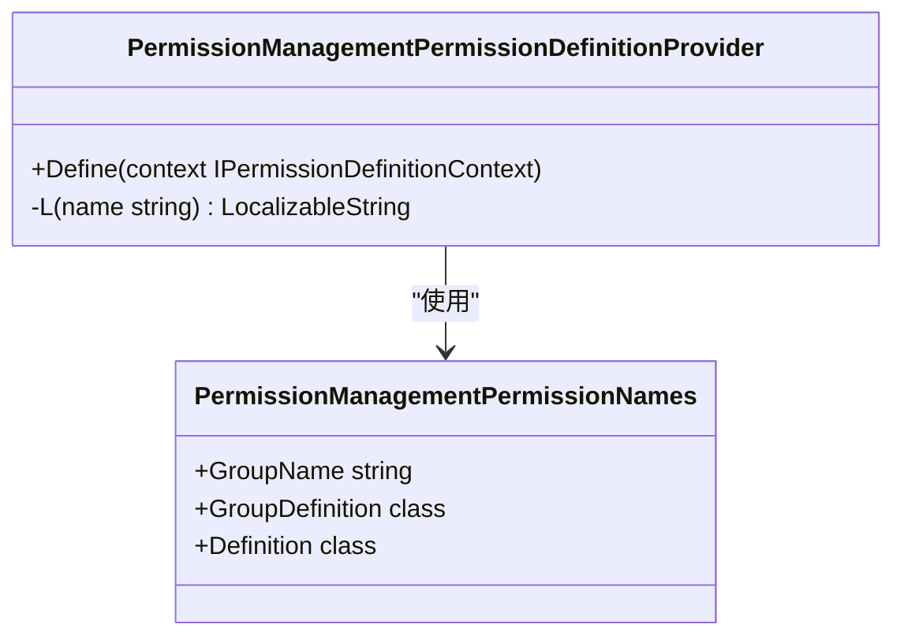
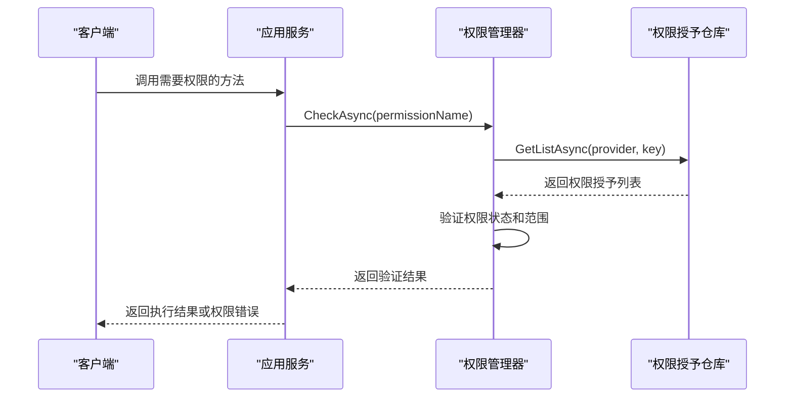
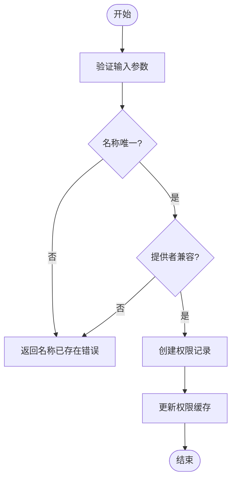
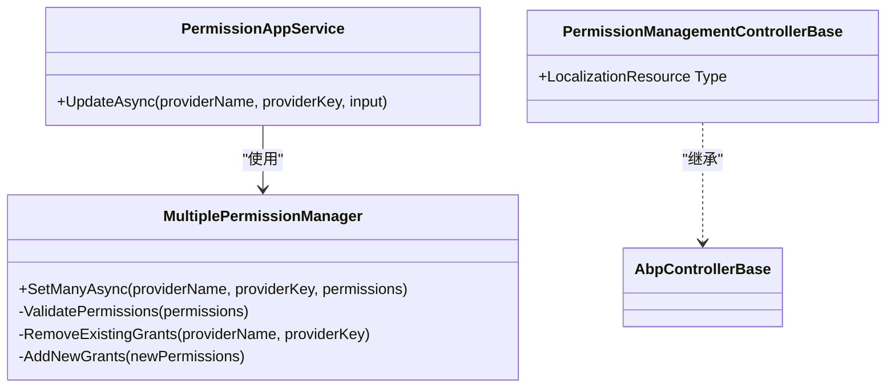
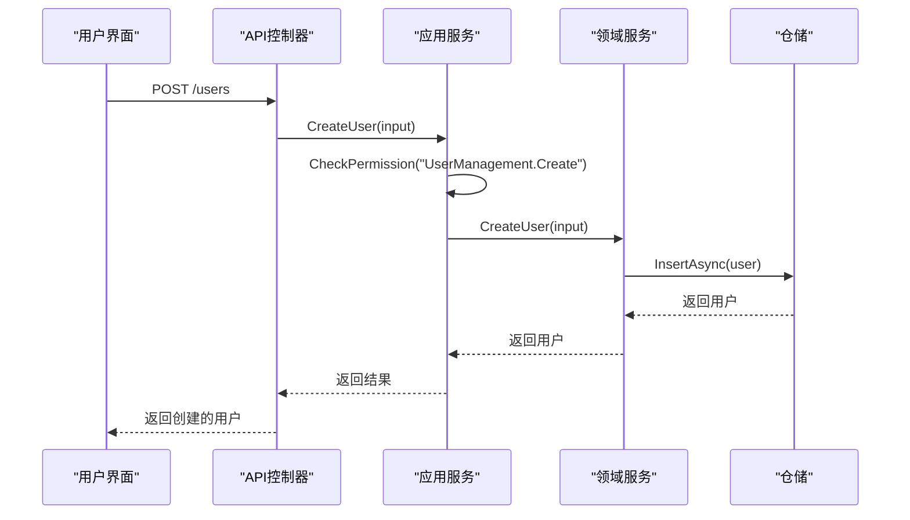
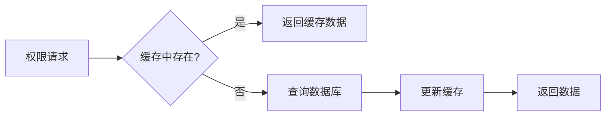

# 权限管理

<cite>
**本文档中引用的文件**  
- [AbpPermissionManagementApplicationModule.cs](file://aspnet-core/modules/permissions-management/LINGYUN.Abp.PermissionManagement.Application/LINGYUN/Abp/PermissionManagement/AbpPermissionManagementApplicationModule.cs)
- [PermissionAppService.cs](file://aspnet-core/modules/permissions-management/LINGYUN.Abp.PermissionManagement.Application/LINGYUN/Abp/PermissionManagement/PermissionAppService.cs)
- [MultiplePermissionManager.cs](file://aspnet-core/modules/permissions-management/LINGYUN.Abp.PermissionManagement.Application/LINGYUN/Abp/PermissionManagement/MultiplePermissionManager.cs)
- [PermissionManagementErrorCodes.cs](file://aspnet-core/modules/permissions-management/LINGYUN.Abp.PermissionManagement.Application.Contracts/LINGYUN/Abp/PermissionManagement/PermissionManagementErrorCodes.cs)
- [PermissionManagementPermissionNames.cs](file://aspnet-core/modules/permissions-management/LINGYUN.Abp.PermissionManagement.Application.Contracts/LINGYUN/Abp/PermissionManagement/Permissions/PermissionManagementPermissionNames.cs)
- [PermissionManagementPermissionDefinitionProvider.cs](file://aspnet-core/modules/permissions-management/LINGYUN.Abp.PermissionManagement.Application.Contracts/LINGYUN/Abp/PermissionManagement/Permissions/PermissionManagementPermissionDefinitionProvider.cs)
- [IPermissionDefinitionAppService.cs](file://aspnet-core/modules/permissions-management/LINGYUN.Abp.PermissionManagement.Application.Contracts/LINGYUN/Abp/PermissionManagement/Definitions/IPermissionDefinitionAppService.cs)
- [IPermissionGroupDefinitionAppService.cs](file://aspnet-core/modules/permissions-management/LINGYUN.Abp.PermissionManagement.Application.Contracts/LINGYUN/Abp/PermissionManagement/Definitions/IPermissionGroupDefinitionAppService.cs)
- [AbpPermissionManagementHttpApiModule.cs](file://aspnet-core/modules/permissions-management/LINGYUN.Abp.PermissionManagement.HttpApi/LINGYUN/Abp/PermissionManagement/HttpApi/AbpPermissionManagementHttpApiModule.cs)
- [PermissionManagementControllerBase.cs](file://aspnet-core/modules/permissions-management/LINGYUN.Abp.PermissionManagement.HttpApi/LINGYUN/Abp/PermissionManagement/HttpApi/PermissionManagementControllerBase.cs)
</cite>

## 目录
1. [简介](#简介)
2. [权限定义与注册](#权限定义与注册)
3. [权限验证机制](#权限验证机制)
4. [权限树结构设计](#权限树结构设计)
5. [自定义权限创建](#自定义权限创建)
6. [服务层与应用层权限检查](#服务层与应用层权限检查)
7. [API文档](#api文档)
8. [实际使用案例](#实际使用案例)
9. [权限缓存策略与性能优化](#权限缓存策略与性能优化)
10. [结论](#结论)

## 简介
本项目基于ABP框架构建了一个完整的权限管理系统，实现了权限的定义、注册、验证和管理机制。系统支持多租户架构，提供了灵活的权限树结构设计，允许动态创建和管理权限。权限管理模块通过分层架构实现了高内聚低耦合的设计原则，包括应用服务层、领域服务层和HTTP API层，确保了系统的可维护性和可扩展性。

**Section sources**
- [AbpPermissionManagementApplicationModule.cs](file://aspnet-core/modules/permissions-management/LINGYUN.Abp.PermissionManagement.Application/LINGYUN/Abp/PermissionManagement/AbpPermissionManagementApplicationModule.cs)
- [AbpPermissionManagementHttpApiModule.cs](file://aspnet-core/modules/permissions-management/LINGYUN.Abp.PermissionManagement.HttpApi/LINGYUN/Abp/PermissionManagement/HttpApi/AbpPermissionManagementHttpApiModule.cs)

## 权限定义与注册
权限系统通过`PermissionManagementPermissionDefinitionProvider`类定义权限结构，采用树形层级组织权限。权限分为权限组（Group）和具体权限项（Permission），每个权限组包含多个子权限。权限定义包括名称、显示名称、多租户范围等属性。

权限注册通过实现`PermissionDefinitionProvider`接口完成，系统在启动时自动加载所有权限定义。权限名称采用点分隔的命名空间格式，如"PermissionManagement.GroupDefinitions.Create"，便于权限的分类管理和查找。



**Diagram sources**
- [PermissionManagementPermissionDefinitionProvider.cs](file://aspnet-core/modules/permissions-management/LINGYUN.Abp.PermissionManagement.Application.Contracts/LINGYUN/Abp/PermissionManagement/Permissions/PermissionManagementPermissionDefinitionProvider.cs)
- [PermissionManagementPermissionNames.cs](file://aspnet-core/modules/permissions-management/LINGYUN.Abp.PermissionManagement.Application.Contracts/LINGYUN/Abp/PermissionManagement/Permissions/PermissionManagementPermissionNames.cs)

**Section sources**
- [PermissionManagementPermissionDefinitionProvider.cs](file://aspnet-core/modules/permissions-management/LINGYUN.Abp.PermissionManagement.Application.Contracts/LINGYUN/Abp/PermissionManagement/Permissions/PermissionManagementPermissionDefinitionProvider.cs)
- [PermissionManagementPermissionNames.cs](file://aspnet-core/modules/permissions-management/LINGYUN.Abp.PermissionManagement.Application.Contracts/LINGYUN/Abp/PermissionManagement/Permissions/PermissionManagementPermissionNames.cs)

## 权限验证机制
权限验证通过ABP框架的授权系统实现，支持方法级别的权限检查。系统使用`IMultiplePermissionManager`接口进行权限验证，该接口继承自ABP的`IPermissionManager`并扩展了批量权限操作功能。

权限验证流程包括：检查权限状态、验证权限提供者兼容性、确认多租户范围匹配等。当权限验证失败时，系统会抛出相应的应用异常，包含详细的错误代码和消息。



**Diagram sources**
- [MultiplePermissionManager.cs](file://aspnet-core/modules/permissions-management/LINGYUN.Abp.PermissionManagement.Application/LINGYUN/Abp/PermissionManagement/MultiplePermissionManager.cs)
- [PermissionAppService.cs](file://aspnet-core/modules/permissions-management/LINGYUN.Abp.PermissionManagement.Application/LINGYUN/Abp/PermissionManagement/PermissionAppService.cs)

**Section sources**
- [MultiplePermissionManager.cs](file://aspnet-core/modules/permissions-management/LINGYUN.Abp.PermissionManagement.Application/LINGYUN/Abp/PermissionManagement/MultiplePermissionManager.cs)
- [PermissionAppService.cs](file://aspnet-core/modules/permissions-management/LINGYUN.Abp.PermissionManagement.Application/LINGYUN/Abp/PermissionManagement/PermissionAppService.cs)

## 权限树结构设计
权限树结构采用分组管理模式，将相关权限组织在同一个权限组下。这种设计提高了权限管理的可读性和可维护性。权限树支持无限层级嵌套，允许创建复杂的权限结构以满足不同业务场景的需求。

权限组和权限项都实现了静态和动态属性的区分，静态权限由代码定义且不可修改，动态权限可通过管理界面创建和修改。权限树结构还支持国际化显示，每个权限的显示名称可以针对不同语言进行本地化配置。

```mermaid
tree
root((权限树))
--> Group1[权限管理]
--> Group2[用户管理]
--> Group3[角色管理]
Group1 --> P1[权限组定义]
Group1 --> P2[权限定义]
P1 --> C1[创建]
P1 --> C2[更新]
P1 --> C3[删除]
P2 --> D1[创建]
P2 --> D2[更新]
D2 --> D21[批量更新]
P2 --> D3[删除]
```

**Diagram sources**
- [PermissionManagementPermissionDefinitionProvider.cs](file://aspnet-core/modules/permissions-management/LINGYUN.Abp.PermissionManagement.Application.Contracts/LINGYUN/Abp/PermissionManagement/Permissions/PermissionManagementPermissionDefinitionProvider.cs)
- [PermissionManagementPermissionNames.cs](file://aspnet-core/modules/permissions-management/LINGYUN.Abp.PermissionManagement.Application.Contracts/LINGYUN/Abp/PermissionManagement/Permissions/PermissionManagementPermissionNames.cs)

**Section sources**
- [PermissionManagementPermissionDefinitionProvider.cs](file://aspnet-core/modules/permissions-management/LINGYUN.Abp.PermissionManagement.Application.Contracts/LINGYUN/Abp/PermissionManagement/Permissions/PermissionManagementPermissionDefinitionProvider.cs)

## 自定义权限创建
系统支持通过应用服务接口创建自定义权限。`IPermissionDefinitionAppService`和`IPermissionGroupDefinitionAppService`接口提供了完整的CRUD操作，允许在运行时动态创建和管理权限。

创建自定义权限时，需要指定权限名称、显示名称、所属权限组和多租户范围等属性。系统会对输入参数进行验证，确保权限名称的唯一性，并检查权限提供者的兼容性。



**Diagram sources**
- [IPermissionDefinitionAppService.cs](file://aspnet-core/modules/permissions-management/LINGYUN.Abp.PermissionManagement.Application.Contracts/LINGYUN/Abp/PermissionManagement/Definitions/IPermissionDefinitionAppService.cs)
- [IPermissionGroupDefinitionAppService.cs](file://aspnet-core/modules/permissions-management/LINGYUN.Abp.PermissionManagement.Application.Contracts/LINGYUN/Abp/PermissionManagement/Definitions/IPermissionGroupDefinitionAppService.cs)

**Section sources**
- [IPermissionDefinitionAppService.cs](file://aspnet-core/modules/permissions-management/LINGYUN.Abp.PermissionManagement.Application.Contracts/LINGYUN/Abp/PermissionManagement/Definitions/IPermissionDefinitionAppService.cs)
- [IPermissionGroupDefinitionAppService.cs](file://aspnet-core/modules/permissions-management/LINGYUN.Abp.PermissionManagement.Application.Contracts/LINGYUN/Abp/PermissionManagement/Definitions/IPermissionGroupDefinitionAppService.cs)

## 服务层与应用层权限检查
在服务层和应用层，权限检查通过依赖注入的权限管理器实现。应用服务继承自`PermissionAppService`，该服务重写了权限更新方法，支持批量权限操作。

权限检查通常在方法执行前进行，使用`AuthorizationService`或直接调用`PermissionManager`的验证方法。对于需要复杂权限逻辑的场景，可以实现自定义的权限检查器。



**Diagram sources**
- [PermissionAppService.cs](file://aspnet-core/modules/permissions-management/LINGYUN.Abp.PermissionManagement.Application/LINGYUN/Abp/PermissionManagement/PermissionAppService.cs)
- [MultiplePermissionManager.cs](file://aspnet-core/modules/permissions-management/LINGYUN.Abp.PermissionManagement.Application/LINGYUN/Abp/PermissionManagement/MultiplePermissionManager.cs)
- [PermissionManagementControllerBase.cs](file://aspnet-core/modules/permissions-management/LINGYUN.Abp.PermissionManagement.HttpApi/LINGYUN/Abp/PermissionManagement/HttpApi/PermissionManagementControllerBase.cs)

**Section sources**
- [PermissionAppService.cs](file://aspnet-core/modules/permissions-management/LINGYUN.Abp.PermissionManagement.Application/LINGYUN/Abp/PermissionManagement/PermissionAppService.cs)
- [MultiplePermissionManager.cs](file://aspnet-core/modules/permissions-management/LINGYUN.Abp.PermissionManagement.Application/LINGYUN/Abp/PermissionManagement/MultiplePermissionManager.cs)
- [PermissionManagementControllerBase.cs](file://aspnet-core/modules/permissions-management/LINGYUN.Abp.PermissionManagement.HttpApi/LINGYUN/Abp/PermissionManagement/HttpApi/PermissionManagementControllerBase.cs)

## API文档
权限管理模块提供了完整的HTTP API接口，通过控制器暴露给前端应用。API接口遵循RESTful设计原则，支持标准的HTTP方法和状态码。

### 权限服务接口
| 接口 | 方法 | 描述 |
|------|------|------|
| `/api/permission-management/definitions` | GET | 获取权限定义列表 |
| `/api/permission-management/definitions/{name}` | GET | 获取指定权限定义 |
| `/api/permission-management/definitions` | POST | 创建权限定义 |
| `/api/permission-management/definitions/{name}` | PUT | 更新权限定义 |
| `/api/permission-management/definitions/{name}` | DELETE | 删除权限定义 |

### 权限验证特性
系统提供了`[RequiresPermission]`特性，可用于方法级别的权限验证。该特性支持单个权限和多个权限的验证，可以指定权限验证的逻辑关系（AND/OR）。

### 权限管理控制器
权限管理控制器继承自`PermissionManagementControllerBase`，该基类设置了正确的本地化资源。控制器通过依赖注入获取应用服务实例，将HTTP请求转发给应用服务处理。

**Section sources**
- [AbpPermissionManagementHttpApiModule.cs](file://aspnet-core/modules/permissions-management/LINGYUN.Abp.PermissionManagement.HttpApi/LINGYUN/Abp/PermissionManagement/HttpApi/AbpPermissionManagementHttpApiModule.cs)
- [PermissionManagementControllerBase.cs](file://aspnet-core/modules/permissions-management/LINGYUN.Abp.PermissionManagement.HttpApi/LINGYUN/Abp/PermissionManagement/HttpApi/PermissionManagementControllerBase.cs)

## 实际使用案例
### CRUD操作中的权限控制
在CRUD操作中，权限控制通常与业务逻辑紧密结合。例如，在创建用户时，需要验证"UserManagement.Create"权限；在更新用户信息时，需要验证"UserManagement.Update"权限。



### 动态权限分配
系统支持动态权限分配，管理员可以通过管理界面为用户或角色分配权限。权限分配通过`MultiplePermissionManager.SetManyAsync`方法实现，该方法会先删除现有权限，然后添加新的权限授予。

### 权限继承与覆盖
权限系统支持继承和覆盖机制。子权限组自动继承父权限组的权限，但可以在子级别覆盖特定权限。这种设计既保证了权限管理的一致性，又提供了足够的灵活性。

**Section sources**
- [MultiplePermissionManager.cs](file://aspnet-core/modules/permissions-management/LINGYUN.Abp.PermissionManagement.Application/LINGYUN/Abp/PermissionManagement/MultiplePermissionManager.cs)
- [PermissionAppService.cs](file://aspnet-core/modules/permissions-management/LINGYUN.Abp.PermissionManagement.Application/LINGYUN/Abp/PermissionManagement/PermissionAppService.cs)

## 权限缓存策略与性能优化
系统采用分布式缓存来存储权限授予信息，显著提高了权限验证的性能。权限缓存使用`IDistributedCache<PermissionGrantCacheItem>`接口，支持多种缓存后端（如Redis、Memory等）。

缓存策略包括：
- 权限授予缓存：存储用户的权限授予列表，避免频繁数据库查询
- 权限定义缓存：存储权限定义结构，减少权限验证时的元数据查询
- 缓存失效机制：当权限被修改时，自动清除相关缓存项

性能优化技巧：
1. 批量权限验证：使用`IsEnabledAsync`方法一次性验证多个权限
2. 缓存预热：在系统启动时预加载常用权限数据
3. 异步操作：所有权限操作都支持异步模式，避免阻塞主线程
4. 连接池：数据库连接使用连接池技术，提高数据库访问效率



**Diagram sources**
- [MultiplePermissionManager.cs](file://aspnet-core/modules/permissions-management/LINGYUN.Abp.PermissionManagement.Application/LINGYUN/Abp/PermissionManagement/MultiplePermissionManager.cs)
- [AbpPermissionManagementApplicationModule.cs](file://aspnet-core/modules/permissions-management/LINGYUN.Abp.PermissionManagement.Application/LINGYUN/Abp/PermissionManagement/AbpPermissionManagementApplicationModule.cs)

**Section sources**
- [MultiplePermissionManager.cs](file://aspnet-core/modules/permissions-management/LINGYUN.Abp.PermissionManagement.Application/LINGYUN/Abp/PermissionManagement/MultiplePermissionManager.cs)

## 结论
本权限管理系统基于ABP框架构建，提供了完整的权限管理解决方案。系统具有良好的架构设计，支持权限的定义、注册、验证和管理。通过权限树结构、自定义权限创建、动态权限分配等特性，系统能够满足复杂的业务需求。同时，通过缓存策略和性能优化，确保了系统的高效运行。该权限管理系统可作为企业级应用的权限管理基础，具有良好的可扩展性和维护性。