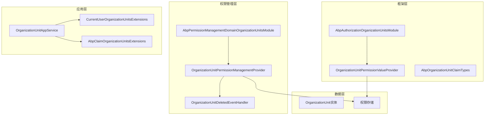
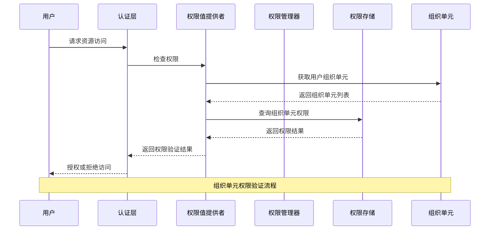
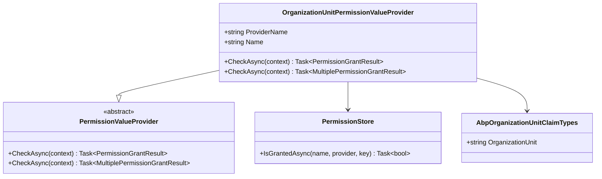
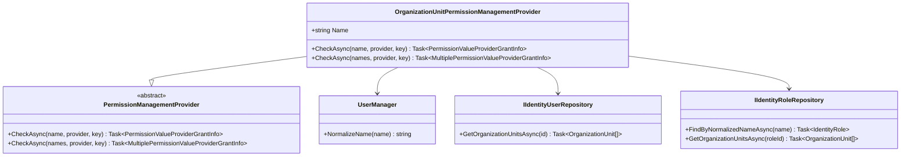
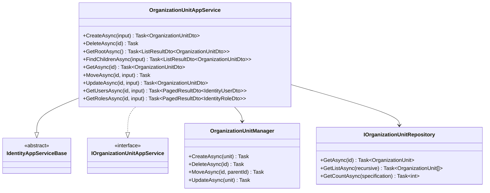
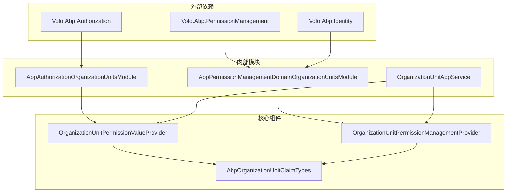

# 组织单元授权

<cite>
**本文档中引用的文件**
- [AbpAuthorizationOrganizationUnitsModule.cs](file://aspnet-core/framework/authorization/LINGYUN.Abp.Authorization.OrganizationUnits/LINGYUN/Abp/Authorization/OrganizationUnits/AbpAuthorizationOrganizationUnitsModule.cs)
- [OrganizationUnitPermissionValueProvider.cs](file://aspnet-core/framework/authorization/LINGYUN.Abp.Authorization.OrganizationUnits/LINGYUN/Abp/Authorization/Permissions/OrganizationUnitPermissionValueProvider.cs)
- [AbpPermissionManagementDomainOrganizationUnitsModule.cs](file://aspnet-core/modules/permissions-management/LINGYUN.Abp.PermissionManagement.Domain.OrganizationUnits/LINGYUN/Abp/PermissionManagement/OrganizationUnits/AbpPermissionManagementDomainOrganizationUnitsModule.cs)
- [OrganizationUnitPermissionManagementProvider.cs](file://aspnet-core/modules/permissions-management/LINGYUN.Abp.PermissionManagement.Domain.OrganizationUnits/LINGYUN/Abp/PermissionManagement/OrganizationUnits/OrganizationUnitPermissionManagementProvider.cs)
- [AbpClaimOrganizationUnitsExtensions.cs](file://aspnet-core/framework/authorization/LINGYUN.Abp.Authorization.OrganizationUnits/System/Security/Principal/AbpClaimOrganizationUnitsExtensions.cs)
- [CurrentUserOrganizationUnitsExtensions.cs](file://aspnet-core/framework/authorization/LINGYUN.Abp.Authorization.OrganizationUnits/Volo/Abp/Users/CurrentUserOrganizationUnitsExtensions.cs)
- [OrganizationUnitAppService.cs](file://aspnet-core/modules/identity/LINGYUN.Abp.Identity.Application/LINGYUN/Abp/Identity/OrganizationUnitAppService.cs)
- [OrganizationUnitDto.cs](file://aspnet-core/modules/identity/LINGYUN.Abp.Identity.Application.Contracts/LINGYUN/Abp/Identity/Dto/OrganizationUnitDto.cs)
- [OrganizationUnitCreateDto.cs](file://aspnet-core/modules/identity/LINGYUN.Abp.Identity.Application.Contracts/LINGYUN/Abp/Identity/Dto/OrganizationUnitCreateDto.cs)
- [AbpOrganizationUnitClaimTypes.cs](file://aspnet-core/framework/authorization/LINGYUN.Abp.Authorization.OrganizationUnits/LINGYUN/Abp/Authorization/OrganizationUnits/AbpOrganizationUnitClaimTypes.cs)
</cite>

## 目录
1. [简介](#简介)
2. [项目结构](#项目结构)
3. [核心组件](#核心组件)
4. [架构概览](#架构概览)
5. [详细组件分析](#详细组件分析)
6. [依赖关系分析](#依赖关系分析)
7. [性能考虑](#性能考虑)
8. [故障排除指南](#故障排除指南)
9. [结论](#结论)

## 简介

组织单元授权模块是ABP框架的一个重要扩展，提供了基于组织单元的细粒度权限控制机制。该模块允许管理员为不同的组织单元分配特定的权限，从而实现更灵活和精确的访问控制。通过组织单元授权，可以确保用户只能访问其所属组织单元范围内的资源，这对于大型企业级应用尤其重要。

该模块的核心功能包括：
- 组织单元权限验证
- 多组织单元权限检查
- 组织单元与用户、角色的关系管理
- 自动权限清理机制
- 数据保护集成

## 项目结构

组织单元授权模块采用分层架构设计，主要分为以下几个层次：



**图表来源**
- [AbpAuthorizationOrganizationUnitsModule.cs](file://aspnet-core/framework/authorization/LINGYUN.Abp.Authorization.OrganizationUnits/LINGYUN/Abp/Authorization/OrganizationUnits/AbpAuthorizationOrganizationUnitsModule.cs#L1-L19)
- [OrganizationUnitPermissionValueProvider.cs](file://aspnet-core/framework/authorization/LINGYUN.Abp.Authorization.OrganizationUnits/LINGYUN/Abp/Authorization/Permissions/OrganizationUnitPermissionValueProvider.cs#L1-L83)

**章节来源**
- [AbpAuthorizationOrganizationUnitsModule.cs](file://aspnet-core/framework/authorization/LINGYUN.Abp.Authorization.OrganizationUnits/LINGYUN/Abp/Authorization/OrganizationUnits/AbpAuthorizationOrganizationUnitsModule.cs#L1-L19)
- [AbpPermissionManagementDomainOrganizationUnitsModule.cs](file://aspnet-core/modules/permissions-management/LINGYUN.Abp.PermissionManagement.Domain.OrganizationUnits/LINGYUN/Abp/PermissionManagement/OrganizationUnits/AbpPermissionManagementDomainOrganizationUnitsModule.cs#L1-L26)

## 核心组件

### 权限值提供者 (OrganizationUnitPermissionValueProvider)

这是组织单元授权的核心组件，负责检查用户是否具有特定的组织单元权限。

```csharp
public class OrganizationUnitPermissionValueProvider : PermissionValueProvider
{
    public const string ProviderName = "O";
    
    public override string Name => ProviderName;
    
    public async override Task<PermissionGrantResult> CheckAsync(PermissionValueCheckContext context)
    {
        var organizationUnits = context.Principal?.FindAll(AbpOrganizationUnitClaimTypes.OrganizationUnit)
            .Select(c => c.Value).ToArray();
            
        if (organizationUnits == null || !organizationUnits.Any())
        {
            return PermissionGrantResult.Undefined;
        }
        
        foreach (var organizationUnit in organizationUnits.Distinct())
        {
            if (await PermissionStore.IsGrantedAsync(context.Permission.Name, Name, organizationUnit))
            {
                return PermissionGrantResult.Granted;
            }
        }
        
        return PermissionGrantResult.Undefined;
    }
}
```

### 权限管理提供者 (OrganizationUnitPermissionManagementProvider)

负责管理组织单元的权限分配和检查逻辑。

```csharp
public class OrganizationUnitPermissionManagementProvider : PermissionManagementProvider
{
    public override string Name => OrganizationUnitPermissionValueProvider.ProviderName;
    
    public override async Task<MultiplePermissionValueProviderGrantInfo> CheckAsync(string[] names, string providerName, string providerKey)
    {
        var multiplePermissionValueProviderGrantInfo = new MultiplePermissionValueProviderGrantInfo(names);
        var permissionGrants = new List<PermissionGrant>();
        
        if (providerName == Name)
        {
            permissionGrants.AddRange(await PermissionGrantRepository.GetListAsync(names, providerName, providerKey));
        }
        
        // 处理角色和用户权限继承
        // ...
        
        return multiplePermissionValueProviderGrantInfo;
    }
}
```

**章节来源**
- [OrganizationUnitPermissionValueProvider.cs](file://aspnet-core/framework/authorization/LINGYUN.Abp.Authorization.OrganizationUnits/LINGYUN/Abp/Authorization/Permissions/OrganizationUnitPermissionValueProvider.cs#L1-L83)
- [OrganizationUnitPermissionManagementProvider.cs](file://aspnet-core/modules/permissions-management/LINGYUN.Abp.PermissionManagement.Domain.OrganizationUnits/LINGYUN/Abp/PermissionManagement/OrganizationUnits/OrganizationUnitPermissionManagementProvider.cs#L1-L108)

## 架构概览

组织单元授权系统采用多层架构设计，实现了权限验证、权限管理和数据保护的完整解决方案：



**图表来源**
- [OrganizationUnitPermissionValueProvider.cs](file://aspnet-core/framework/authorization/LINGYUN.Abp.Authorization.OrganizationUnits/LINGYUN/Abp/Authorization/Permissions/OrganizationUnitPermissionValueProvider.cs#L20-L40)
- [OrganizationUnitPermissionManagementProvider.cs](file://aspnet-core/modules/permissions-management/LINGYUN.Abp.PermissionManagement.Domain.OrganizationUnits/LINGYUN/Abp/PermissionManagement/OrganizationUnits/OrganizationUnitPermissionManagementProvider.cs#L40-L80)

## 详细组件分析

### 组织单元权限值提供者



**图表来源**
- [OrganizationUnitPermissionValueProvider.cs](file://aspnet-core/framework/authorization/LINGYUN.Abp.Authorization.OrganizationUnits/LINGYUN/Abp/Authorization/Permissions/OrganizationUnitPermissionValueProvider.cs#L13-L40)
- [AbpOrganizationUnitClaimTypes.cs](file://aspnet-core/framework/authorization/LINGYUN.Abp.Authorization.OrganizationUnits/LINGYUN/Abp/Authorization/OrganizationUnits/AbpOrganizationUnitClaimTypes.cs#L1-L6)

### 组织单元权限管理提供者



**图表来源**
- [OrganizationUnitPermissionManagementProvider.cs](file://aspnet-core/modules/permissions-management/LINGYUN.Abp.PermissionManagement.Domain.OrganizationUnits/LINGYUN/Abp/PermissionManagement/OrganizationUnits/OrganizationUnitPermissionManagementProvider.cs#L15-L40)

### 组织单元应用服务



**图表来源**
- [OrganizationUnitAppService.cs](file://aspnet-core/modules/identity/LINGYUN.Abp.Identity.Application/LINGYUN/Abp/Identity/OrganizationUnitAppService.cs#L15-L50)

**章节来源**
- [OrganizationUnitAppService.cs](file://aspnet-core/modules/identity/LINGYUN.Abp.Identity.Application/LINGYUN/Abp/Identity/OrganizationUnitAppService.cs#L1-L233)

### 组织单元扩展方法

系统提供了两个关键的扩展方法来简化组织单元的查询操作：

```csharp
// 从ClaimsPrincipal获取组织单元
public static string[] FindOrganizationUnits(this ClaimsPrincipal principal)
{
    var userOusOrNull = principal.Claims?.Where(c => c.Type == AbpOrganizationUnitClaimTypes.OrganizationUnit);
    if (userOusOrNull == null || !userOusOrNull.Any())
    {
        return new string[0];
    }
    
    return userOusOrNull.Select(x => x.Value).ToArray();
}

// 从ICurrentUser获取组织单元
public static string[] FindOrganizationUnits(this ICurrentUser currentUser)
{
    var organizationUnits = currentUser.FindClaims(AbpOrganizationUnitClaimTypes.OrganizationUnit);
    if (organizationUnits.IsNullOrEmpty())
    {
        return new string[0];
    }
    
    return organizationUnits.Select(x => x.Value).ToArray();
}
```

**章节来源**
- [AbpClaimOrganizationUnitsExtensions.cs](file://aspnet-core/framework/authorization/LINGYUN.Abp.Authorization.OrganizationUnits/System/Security/Principal/AbpClaimOrganizationUnitsExtensions.cs#L1-L24)
- [CurrentUserOrganizationUnitsExtensions.cs](file://aspnet-core/framework/authorization/LINGYUN.Abp.Authorization.OrganizationUnits/Volo/Abp/Users/CurrentUserOrganizationUnitsExtensions.cs#L1-L22)

## 依赖关系分析

组织单元授权模块的依赖关系复杂但清晰，遵循了良好的分层架构原则：



**图表来源**
- [AbpAuthorizationOrganizationUnitsModule.cs](file://aspnet-core/framework/authorization/LINGYUN.Abp.Authorization.OrganizationUnits/LINGYUN/Abp/Authorization/OrganizationUnits/AbpAuthorizationOrganizationUnitsModule.cs#L1-L10)
- [AbpPermissionManagementDomainOrganizationUnitsModule.cs](file://aspnet-core/modules/permissions-management/LINGYUN.Abp.PermissionManagement.Domain.OrganizationUnits/LINGYUN/Abp/PermissionManagement/OrganizationUnits/AbpPermissionManagementDomainOrganizationUnitsModule.cs#L1-L15)

**章节来源**
- [AbpAuthorizationOrganizationUnitsModule.cs](file://aspnet-core/framework/authorization/LINGYUN.Abp.Authorization.OrganizationUnits/LINGYUN/Abp/Authorization/OrganizationUnits/AbpAuthorizationOrganizationUnitsModule.cs#L1-L19)
- [AbpPermissionManagementDomainOrganizationUnitsModule.cs](file://aspnet-core/modules/permissions-management/LINGYUN.Abp.PermissionManagement.Domain.OrganizationUnits/LINGYUN/Abp/PermissionManagement/OrganizationUnits/AbpPermissionManagementDomainOrganizationUnitsModule.cs#L1-L26)

## 性能考虑

### 权限检查优化

组织单元权限检查采用了多种优化策略：

1. **批量权限检查**：支持一次性检查多个权限，减少数据库查询次数
2. **缓存机制**：利用ABP框架的缓存系统存储权限检查结果
3. **索引优化**：在权限表中为ProviderName和ProviderKey字段建立复合索引
4. **去重处理**：对重复的组织单元进行去重，避免重复检查

### 查询优化

```csharp
// 批量权限检查的优化实现
public async override Task<MultiplePermissionGrantResult> CheckAsync(PermissionValuesCheckContext context)
{
    var permissionNames = context.Permissions.Select(x => x.Name).Distinct().ToList();
    
    // 早期退出条件
    if (permissionNames.IsNullOrEmpty()) return result;
    
    var organizationUnits = context.Principal?.FindAll(AbpOrganizationUnitClaimTypes.OrganizationUnit)
        .Select(c => c.Value).ToArray();
        
    if (organizationUnits == null || !organizationUnits.Any()) return result;
    
    // 优先处理已授予的权限
    foreach (var organizationUnit in organizationUnits.Distinct())
    {
        var multipleResult = await PermissionStore.IsGrantedAsync(permissionNames.ToArray(), Name, organizationUnit);
        
        // 更新结果并移除已处理的权限
        foreach (var grantResult in multipleResult.Result.Where(grantResult =>
            result.Result.ContainsKey(grantResult.Key) &&
            result.Result[grantResult.Key] == PermissionGrantResult.Undefined &&
            grantResult.Value != PermissionGrantResult.Undefined))
        {
            result.Result[grantResult.Key] = grantResult.Value;
            permissionNames.RemoveAll(x => x == grantResult.Key);
        }
        
        // 如果所有权限都已确定，提前退出
        if (result.AllGranted || result.AllProhibited) break;
        if (permissionNames.IsNullOrEmpty()) break;
    }
    
    return result;
}
```

### 内存使用优化

- 使用`Distinct()`方法避免重复的组织单元处理
- 及时释放不需要的对象引用
- 合理使用异步模式避免阻塞线程

## 故障排除指南

### 常见问题及解决方案

#### 1. 权限验证失败

**问题描述**：用户无法访问应该有权限的资源

**可能原因**：
- 用户未正确分配到组织单元
- 组织单元权限未正确设置
- 权限值提供者未正确注册

**解决方案**：
```csharp
// 检查用户是否属于正确的组织单元
var organizationUnits = currentUser.FindOrganizationUnits();
if (organizationUnits.Length == 0)
{
    // 用户未分配到任何组织单元
}

// 检查组织单元权限
var permissionManager = serviceProvider.GetService<IPermissionManager>();
var hasPermission = await permissionManager.IsGrantedAsync(
    "YourPermissionName", 
    OrganizationUnitPermissionValueProvider.ProviderName, 
    "YourOrganizationUnitCode");
```

#### 2. 性能问题

**问题描述**：权限检查响应时间过长

**诊断步骤**：
1. 检查数据库索引是否正确
2. 分析权限检查的调用频率
3. 查看是否有不必要的权限检查

**优化建议**：
- 使用批量权限检查代替单个检查
- 实现适当的缓存策略
- 优化组织单元层级结构

#### 3. 权限继承问题

**问题描述**：子组织单元没有继承父组织单元的权限

**解决方案**：
```csharp
// 在权限管理提供者中实现权限继承逻辑
public override async Task<MultiplePermissionValueProviderGrantInfo> CheckAsync(string[] names, string providerName, string providerKey)
{
    var result = new MultiplePermissionValueProviderGrantInfo(names);
    
    // 递归检查父组织单元权限
    var currentUnit = await GetOrganizationUnitAsync(providerKey);
    while (currentUnit != null && currentUnit.ParentId.HasValue)
    {
        var parentPermissions = await PermissionGrantRepository.GetListAsync(names, providerName, currentUnit.ParentId.ToString());
        // 合并权限结果...
        
        currentUnit = await GetOrganizationUnitAsync(currentUnit.ParentId.Value);
    }
    
    return result;
}
```

**章节来源**
- [OrganizationUnitPermissionValueProvider.cs](file://aspnet-core/framework/authorization/LINGYUN.Abp.Authorization.OrganizationUnits/LINGYUN/Abp/Authorization/Permissions/OrganizationUnitPermissionValueProvider.cs#L40-L83)

## 结论

组织单元授权模块为ABP框架提供了强大的基于组织单元的权限控制能力。通过合理的架构设计和优化策略，该模块能够满足大多数企业级应用的权限管理需求。

### 主要优势

1. **灵活性**：支持复杂的组织单元层级结构和权限继承
2. **性能**：通过批量检查和缓存机制优化性能
3. **可扩展性**：模块化设计便于扩展和定制
4. **易用性**：提供简洁的API和扩展方法

### 最佳实践建议

1. **合理设计组织单元结构**：避免过深的层级结构
2. **定期清理无效权限**：使用事件处理器自动清理删除组织单元的权限
3. **监控权限检查性能**：定期分析权限检查的性能指标
4. **实施适当的缓存策略**：根据业务特点选择合适的缓存方案

该模块为构建安全、可扩展的企业级应用提供了坚实的基础，是现代权限管理系统的重要组成部分。