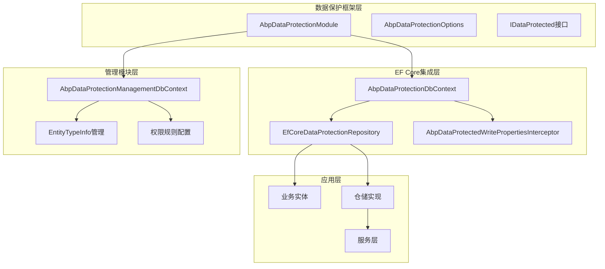
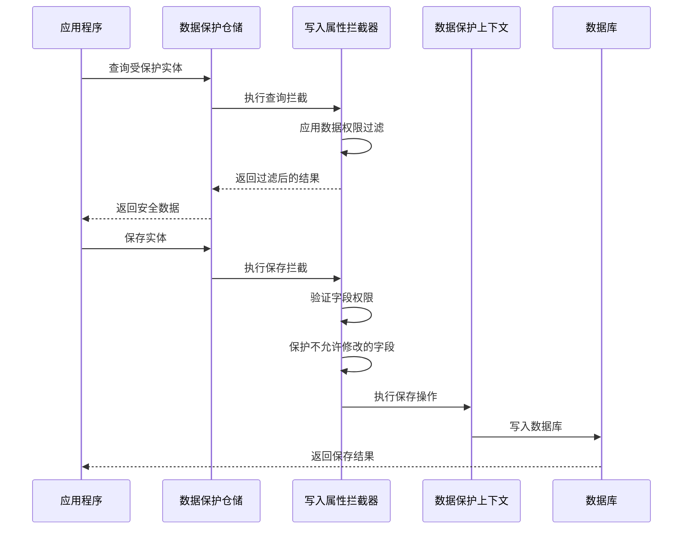
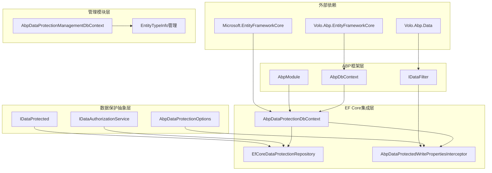

# Entity Framework Core 集成

<cite>
**本文档引用的文件**
- [AbpDataProtectionDbContext.cs](file://aspnet-core/framework/data-protection/LINGYUN.Abp.DataProtection.EntityFrameworkCore/LINGYUN/Abp/DataProtection/EntityFrameworkCore/AbpDataProtectionDbContext.cs)
- [EfCoreDataProtectionRepository.cs](file://aspnet-core/framework/data-protection/LINGYUN.Abp.DataProtection.EntityFrameworkCore/LINGYUN/Abp/DataProtection/EntityFrameworkCore/EfCoreDataProtectionRepository.cs)
- [AbpDataProtectedWritePropertiesInterceptor.cs](file://aspnet-core/framework/data-protection/LINGYUN.Abp.DataProtection.EntityFrameworkCore/LINGYUN/Abp/DataProtection/EntityFrameworkCore/AbpDataProtectedWritePropertiesInterceptor.cs)
- [AbpDataProtectionEntityFrameworkCoreModule.cs](file://aspnet-core/framework/data-protection/LINGYUN.Abp.DataProtection.EntityFrameworkCore/LINGYUN/Abp/DataProtection/EntityFrameworkCore/AbpDataProtectionEntityFrameworkCoreModule.cs)
- [AbpDataProtectionOptions.cs](file://aspnet-core/framework/data-protection/LINGYUN.Abp.DataProtection/LINGYUN/Abp/DataProtection/AbpDataProtectionOptions.cs)
- [IDataProtected.cs](file://aspnet-core/framework/data-protection/LINGYUN.Abp.DataProtection.Abstractions/LINGYUN/Abp/DataProtection/IDataProtected.cs)
- [IDataAuthorizationService.cs](file://aspnet-core/framework/data-protection/LINGYUN.Abp.DataProtection/LINGYUN/Abp/DataProtection/IDataAuthorizationService.cs)
- [DataAuthBase.cs](file://aspnet-core/framework/data-protection/LINGYUN.Abp.DataProtection/LINGYUN/Abp/DataProtection/DataAuthBase.cs)
- [AbpDataProtectionManagementDbContext.cs](file://aspnet-core/modules/data-protection/LINGYUN.Abp.DataProtectionManagement.EntityFrameworkCore/LINGYUN/Abp/DataProtectionManagement/EntityFrameworkCore/AbpDataProtectionManagementDbContext.cs)
- [AbpDataProtectionManagementDbContextModelCreatingExtensions.cs](file://aspnet-core/modules/data-protection/LINGYUN.Abp.DataProtectionManagement.EntityFrameworkCore/LINGYUN/Abp/DataProtectionManagement/EntityFrameworkCore/AbpDataProtectionManagementDbContextModelCreatingExtensions.cs)
- [FakeProtectionObject.cs](file://aspnet-core/tests/LINGYUN.Abp.DataProtection.Tests/LINGYUN/Abp/DataProtection/FakeProtectionObject.cs)
</cite>

## 目录
1. [简介](#简介)
2. [项目结构](#项目结构)
3. [核心组件](#核心组件)
4. [架构概览](#架构概览)
5. [详细组件分析](#详细组件分析)
6. [依赖关系分析](#依赖关系分析)
7. [性能考虑](#性能考虑)
8. [故障排除指南](#故障排除指南)
9. [结论](#结论)

## 简介

Entity Framework Core 集成模块为 ABP 框架提供了强大的数据保护功能，通过 Entity Framework Core 的拦截器和仓储模式实现了对敏感数据的自动保护。该模块支持基于角色、组织机构和自定义策略的数据访问控制，确保只有授权用户才能访问特定数据。

数据保护扩展的核心目标是：
- 自动拦截和保护敏感数据字段
- 提供基于角色和组织机构的数据访问控制
- 支持字段级别的权限管理
- 在数据库迁移过程中正确处理数据保护逻辑
- 提供灵活的配置选项和扩展点

## 项目结构

数据保护模块采用分层架构设计，主要包含以下核心组件：



**图表来源**
- [AbpDataProtectionDbContext.cs](file://aspnet-core/framework/data-protection/LINGYUN.Abp.DataProtection.EntityFrameworkCore/LINGYUN/Abp/DataProtection/EntityFrameworkCore/AbpDataProtectionDbContext.cs#L1-L57)
- [EfCoreDataProtectionRepository.cs](file://aspnet-core/framework/data-protection/LINGYUN.Abp.DataProtection.EntityFrameworkCore/LINGYUN/Abp/DataProtection/EntityFrameworkCore/EfCoreDataProtectionRepository.cs#L1-L317)

**章节来源**
- [AbpDataProtectionEntityFrameworkCoreModule.cs](file://aspnet-core/framework/data-protection/LINGYUN.Abp.DataProtection.EntityFrameworkCore/LINGYUN/Abp/DataProtection/EntityFrameworkCore/AbpDataProtectionEntityFrameworkCoreModule.cs#L1-L15)

## 核心组件

### 数据保护上下文 (AbpDataProtectionDbContext)

`AbpDataProtectionDbContext` 是数据保护功能的核心基类，继承自 `AbpDbContext` 并提供了数据保护相关的配置和拦截器注册功能。

```csharp
public abstract class AbpDataProtectionDbContext<TDbContext> : AbpDbContext<TDbContext>
    where TDbContext : DbContext
{
    public IOptions<AbpDataProtectionOptions> DataProtectionOptions => 
        LazyServiceProvider.LazyGetRequiredService<IOptions<AbpDataProtectionOptions>>();
    public ICurrentUser CurrentUser => 
        LazyServiceProvider.LazyGetRequiredService<ICurrentUser>();

    protected override void OnConfiguring(DbContextOptionsBuilder optionsBuilder)
    {
        base.OnConfiguring(optionsBuilder);
        
        if (LazyServiceProvider != null)
        {
            optionsBuilder.AddInterceptors(
                LazyServiceProvider.GetRequiredService<AbpDataProtectedWritePropertiesInterceptor>()
            );
        }
    }
}
```

### 数据保护仓储 (EfCoreDataProtectionRepository)

`EfCoreDataProtectionRepository` 提供了完整的数据保护仓储实现，支持自动的数据权限验证和过滤。

```csharp
public abstract class EfCoreDataProtectionRepository<TDbContext, TEntity, TKey, TEntityAuth> : 
    EfCoreRepository<TDbContext, TEntity, TKey>,
    IDataProtectionRepository<TEntity>
    where TDbContext : IEfCoreDbContext
    where TEntity : class, IEntity<TKey>, IDataProtected
    where TEntityAuth : DataAuthBase<TEntity, TKey>
{
    protected ICurrentUser CurrentUser => 
        LazyServiceProvider.GetRequiredService<ICurrentUser>();
    protected IDataAccessStrategyFilterBuilder StrategyFilterBuilder => 
        LazyServiceProvider.GetService<IDataAccessStrategyFilterBuilder>();
}
```

### 写入属性拦截器 (AbpDataProtectedWritePropertiesInterceptor)

拦截器负责在数据保存时自动保护敏感字段，只允许授权用户修改允许的字段。

```csharp
public class AbpDataProtectedWritePropertiesInterceptor : SaveChangesInterceptor, ITransientDependency
{
    public async override ValueTask<InterceptionResult<int>> SavingChangesAsync(
        DbContextEventData eventData, 
        InterceptionResult<int> result, 
        CancellationToken cancellationToken = default)
    {
        if (DataFilter.IsEnabled<IDataProtected>() && eventData.Context != null)
        {
            foreach (var entry in eventData.Context.ChangeTracker.Entries().ToList())
            {
                if (entry.State.IsIn(EntityState.Modified))
                {
                    // 字段级权限控制逻辑
                    var allowProperties = new List<string>();
                    // ... 权限验证和字段保护逻辑
                }
            }
        }
        return await base.SavingChangesAsync(eventData, result, cancellationToken);
    }
}
```

**章节来源**
- [AbpDataProtectionDbContext.cs](file://aspnet-core/framework/data-protection/LINGYUN.Abp.DataProtection.EntityFrameworkCore/LINGYUN/Abp/DataProtection/EntityFrameworkCore/AbpDataProtectionDbContext.cs#L1-L57)
- [EfCoreDataProtectionRepository.cs](file://aspnet-core/framework/data-protection/LINGYUN.Abp.DataProtection.EntityFrameworkCore/LINGYUN/Abp/DataProtection/EntityFrameworkCore/EfCoreDataProtectionRepository.cs#L1-L317)
- [AbpDataProtectedWritePropertiesInterceptor.cs](file://aspnet-core/framework/data-protection/LINGYUN.Abp.DataProtection.EntityFrameworkCore/LINGYUN/Abp/DataProtection/EntityFrameworkCore/AbpDataProtectedWritePropertiesInterceptor.cs#L1-L63)

## 架构概览

数据保护与 Entity Framework Core 的集成采用了多层架构设计，通过拦截器、仓储模式和依赖注入实现了透明的数据保护功能。



**图表来源**
- [EfCoreDataProtectionRepository.cs](file://aspnet-core/framework/data-protection/LINGYUN.Abp.DataProtection.EntityFrameworkCore/LINGYUN/Abp/DataProtection/EntityFrameworkCore/EfCoreDataProtectionRepository.cs#L40-L80)
- [AbpDataProtectedWritePropertiesInterceptor.cs](file://aspnet-core/framework/data-protection/LINGYUN.Abp.DataProtection.EntityFrameworkCore/LINGYUN/Abp/DataProtection/EntityFrameworkCore/AbpDataProtectedWritePropertiesInterceptor.cs#L20-L62)

## 详细组件分析

### 数据保护配置选项 (AbpDataProtectionOptions)

数据保护模块通过 `AbpDataProtectionOptions` 类提供全面的配置选项，支持启用/禁用数据保护、配置权限主体贡献者、设置字段忽略列表等。

```csharp
public class AbpDataProtectionOptions
{
    /// <summary>
    /// 是否启用数据保护
    /// 默认: true
    /// </summary>
    public bool IsEnabled { get; set; }
    
    /// <summary>
    /// 数据权限策略
    /// </summary>
    public IList<IDataAccessStrategyContributor> StrategyContributors { get; }
    
    /// <summary>
    /// 权限主体
    /// </summary>
    public IList<IDataAccessSubjectContributor> SubjectContributors { get; }
    
    /// <summary>
    /// 实体忽略字段
    /// </summary>
    public IDictionary<Type, string[]> EntityIgnoreProperties { get; }
    
    /// <summary>
    /// 全局忽略字段列表
    /// </summary>
    public IList<string> GlobalIgnoreProperties { get; set; }
}
```

### 数据保护接口 (IDataProtected)

`IDataProtected` 接口是最基础的数据保护标记接口，任何需要数据保护的实体都必须实现此接口。

```csharp
public interface IDataProtected
{
    Guid? CreatorId { get; }
}
```

### 数据授权服务 (IDataAuthorizationService)

数据授权服务负责验证用户对特定实体的操作权限，是数据保护功能的核心验证组件。

```csharp
public interface IDataAuthorizationService
{
    /// <summary>
    /// 验证操作实体数据权限
    /// </summary>
    /// <param name="operation">数据权限操作</param>
    /// <param name="entities">检查实体列表</param>
    /// <typeparam name="TEntity">实体类型</typeparam>
    /// <returns></returns>
    Task<AuthorizationResult> AuthorizeAsync<TEntity>(
        DataAccessOperation operation, 
        IEnumerable<TEntity> entities);
}
```

### 数据权限实体基类 (DataAuthBase)

`DataAuthBase` 是所有数据权限实体的基类，用于存储实体与角色、组织机构之间的关联信息。

```csharp
public abstract class DataAuthBase<TEntity, TKey> : Entity<long>, IMultiTenant
{
    public virtual Guid? TenantId { get; protected set; }
    public virtual TKey EntityId { get; protected set; }
    public virtual TEntity Entity { get; protected set; }
    public virtual string EntityType { get; protected set; }
    public virtual string Role { get; protected set; }
    public virtual string OrganizationUnit { get; protected set; }
}
```

### 管理数据库上下文 (AbpDataProtectionManagementDbContext)

管理模块的数据库上下文专门用于存储数据保护配置信息，包括实体类型信息、权限规则等。

```csharp
public class AbpDataProtectionManagementDbContext : 
    AbpDbContext<AbpDataProtectionManagementDbContext>, 
    IAbpDataProtectionManagementDbContext
{
    public virtual DbSet<EntityTypeInfo> EntityTypeInfos { get; set; }

    protected override void OnModelCreating(ModelBuilder modelBuilder)
    {
        base.OnModelCreating(modelBuilder);
        modelBuilder.ConfigureDataProtectionManagement();
    }
}
```

**章节来源**
- [AbpDataProtectionOptions.cs](file://aspnet-core/framework/data-protection/LINGYUN.Abp.DataProtection/LINGYUN/Abp/DataProtection/AbpDataProtectionOptions.cs#L1-L84)
- [IDataProtected.cs](file://aspnet-core/framework/data-protection/LINGYUN.Abp.DataProtection.Abstractions/LINGYUN/Abp/DataProtection/IDataProtected.cs#L1-L8)
- [IDataAuthorizationService.cs](file://aspnet-core/framework/data-protection/LINGYUN.Abp.DataProtection/LINGYUN/Abp/DataProtection/IDataAuthorizationService.cs#L1-L18)
- [DataAuthBase.cs](file://aspnet-core/framework/data-protection/LINGYUN.Abp.DataProtection/LINGYUN/Abp/DataProtection/DataAuthBase.cs#L1-L32)
- [AbpDataProtectionManagementDbContext.cs](file://aspnet-core/modules/data-protection/LINGYUN.Abp.DataProtectionManagement.EntityFrameworkCore/LINGYUN/Abp/DataProtectionManagement/EntityFrameworkCore/AbpDataProtectionManagementDbContext.cs#L1-L21)

## 依赖关系分析

数据保护模块的依赖关系体现了清晰的分层架构设计：



**图表来源**
- [AbpDataProtectionEntityFrameworkCoreModule.cs](file://aspnet-core/framework/data-protection/LINGYUN.Abp.DataProtection.EntityFrameworkCore/LINGYUN/Abp/DataProtection/EntityFrameworkCore/AbpDataProtectionEntityFrameworkCoreModule.cs#L1-L15)

**章节来源**
- [AbpDataProtectionEntityFrameworkCoreModule.cs](file://aspnet-core/framework/data-protection/LINGYUN.Abp.DataProtection.EntityFrameworkCore/LINGYUN/Abp/DataProtection/EntityFrameworkCore/AbpDataProtectionEntityFrameworkCoreModule.cs#L1-L15)

## 性能考虑

数据保护功能在提供强大安全性的同时，也需要考虑性能影响：

### 查询性能优化

1. **延迟加载**: 使用 `LazyServiceProvider` 实现延迟加载，避免不必要的服务解析
2. **查询过滤**: 在查询时自动应用数据权限过滤，减少网络传输
3. **字段选择**: 仅查询授权字段，减少数据传输量

### 写入性能优化

1. **批量操作**: 支持批量插入和更新操作，提高性能
2. **拦截器缓存**: 缓存权限验证结果，避免重复计算
3. **事务管理**: 合理使用事务，平衡一致性和性能

### 内存使用优化

1. **对象池**: 使用对象池技术复用拦截器实例
2. **弱引用**: 对大型对象使用弱引用，避免内存泄漏
3. **及时释放**: 确保资源及时释放，特别是在异常情况下

## 故障排除指南

### 常见问题及解决方案

#### 1. 数据保护拦截器未生效

**症状**: 修改实体时，敏感字段仍然被修改

**解决方案**:
```csharp
// 确保在模块配置中正确注册拦截器
protected override void OnConfiguring(DbContextOptionsBuilder optionsBuilder)
{
    base.OnConfiguring(optionsBuilder);
    
    if (LazyServiceProvider != null)
    {
        optionsBuilder.AddInterceptors(
            LazyServiceProvider.GetRequiredService<AbpDataProtectedWritePropertiesInterceptor>()
        );
    }
}
```

#### 2. 数据权限过滤不正确

**症状**: 用户能够看到不应该访问的数据

**解决方案**:
- 检查 `IDataAccessStrategyContributor` 实现是否正确
- 验证 `CurrentUser` 服务是否正确获取当前用户信息
- 确认 `DataFilter` 是否正确启用

#### 3. 性能问题

**症状**: 数据查询响应时间过长

**解决方案**:
- 使用 `DisableDataProtected` 特性临时禁用数据保护
- 优化数据库索引
- 考虑使用缓存策略

**章节来源**
- [AbpDataProtectedWritePropertiesInterceptor.cs](file://aspnet-core/framework/data-protection/LINGYUN.Abp.DataProtection.EntityFrameworkCore/LINGYUN/Abp/DataProtection/EntityFrameworkCore/AbpDataProtectedWritePropertiesInterceptor.cs#L20-L62)

## 结论

Entity Framework Core 集成模块为 ABP 框架提供了完整而强大的数据保护解决方案。通过拦截器、仓储模式和依赖注入的结合，实现了透明且高效的数据保护功能。

### 主要优势

1. **透明性**: 开发者无需手动处理数据保护逻辑
2. **灵活性**: 支持多种数据访问策略和权限控制方式
3. **可扩展性**: 提供丰富的扩展点和自定义选项
4. **性能**: 通过合理的优化策略保证良好的性能表现

### 最佳实践建议

1. **合理配置**: 根据业务需求合理配置数据保护选项
2. **性能监控**: 定期监控数据保护功能的性能影响
3. **测试覆盖**: 确保充分的单元测试和集成测试覆盖
4. **文档维护**: 保持配置文档和最佳实践的及时更新

该模块为现代企业应用提供了坚实的数据保护基础，确保敏感数据的安全性和合规性要求得到满足。