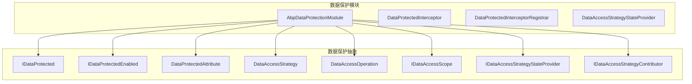
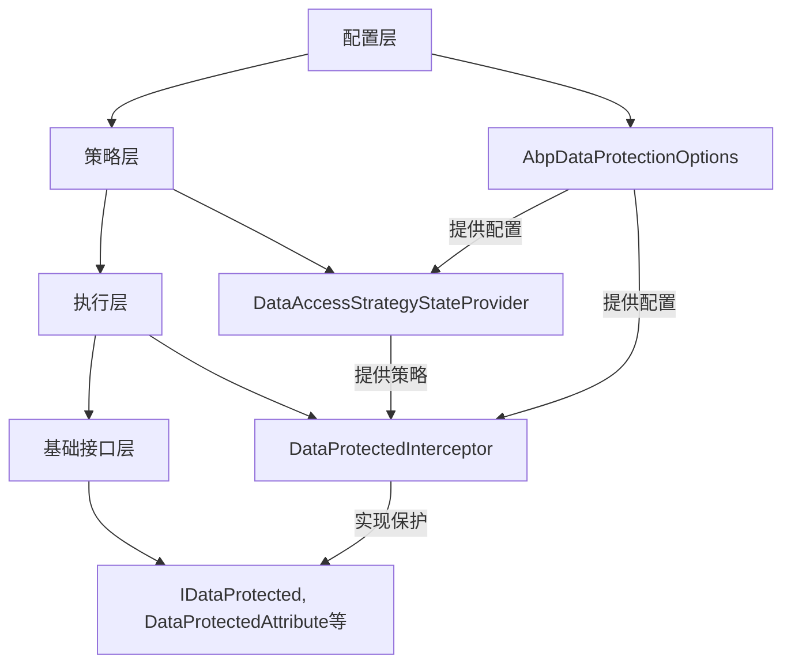
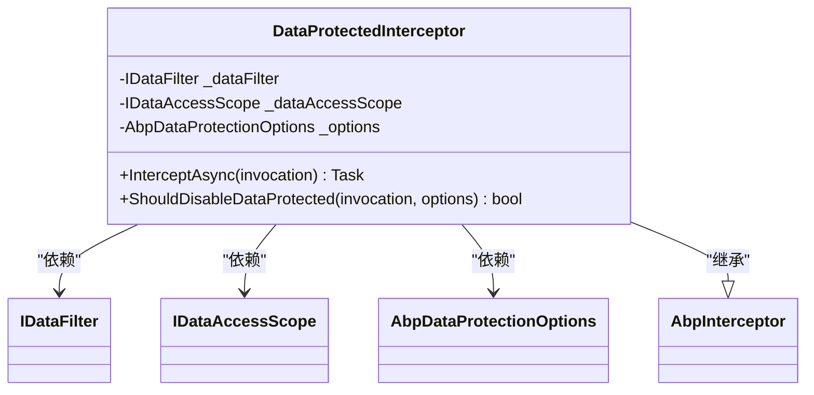
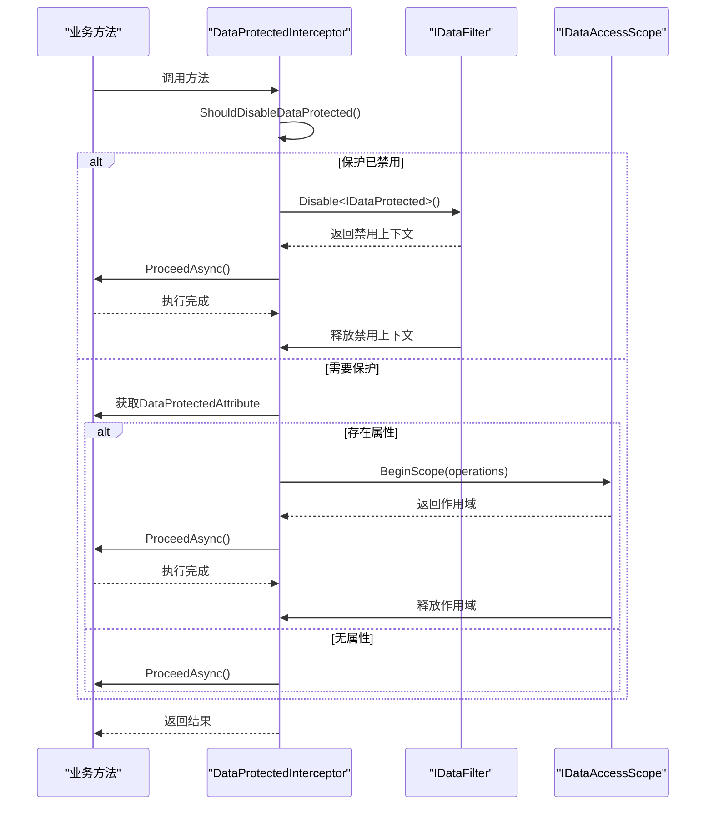
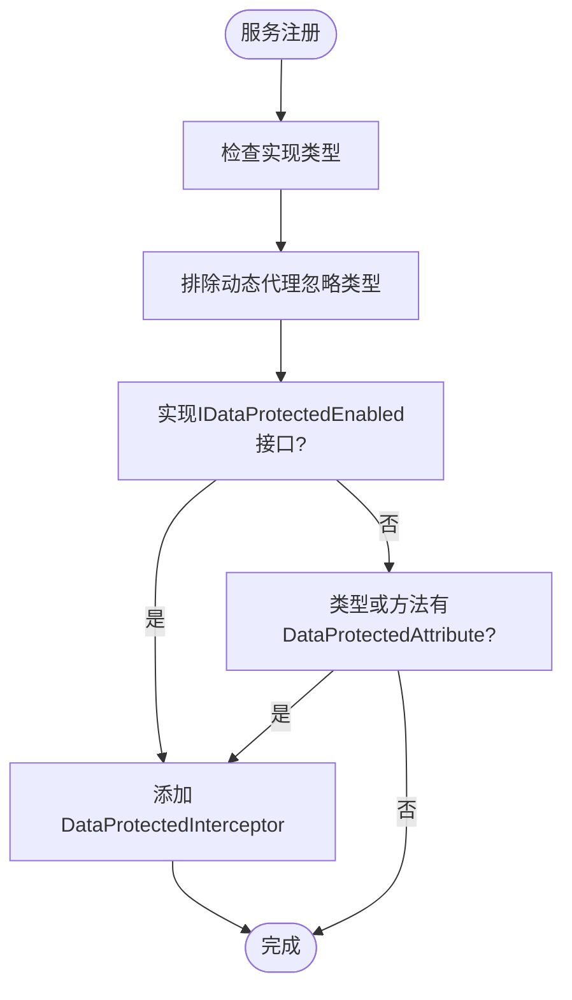
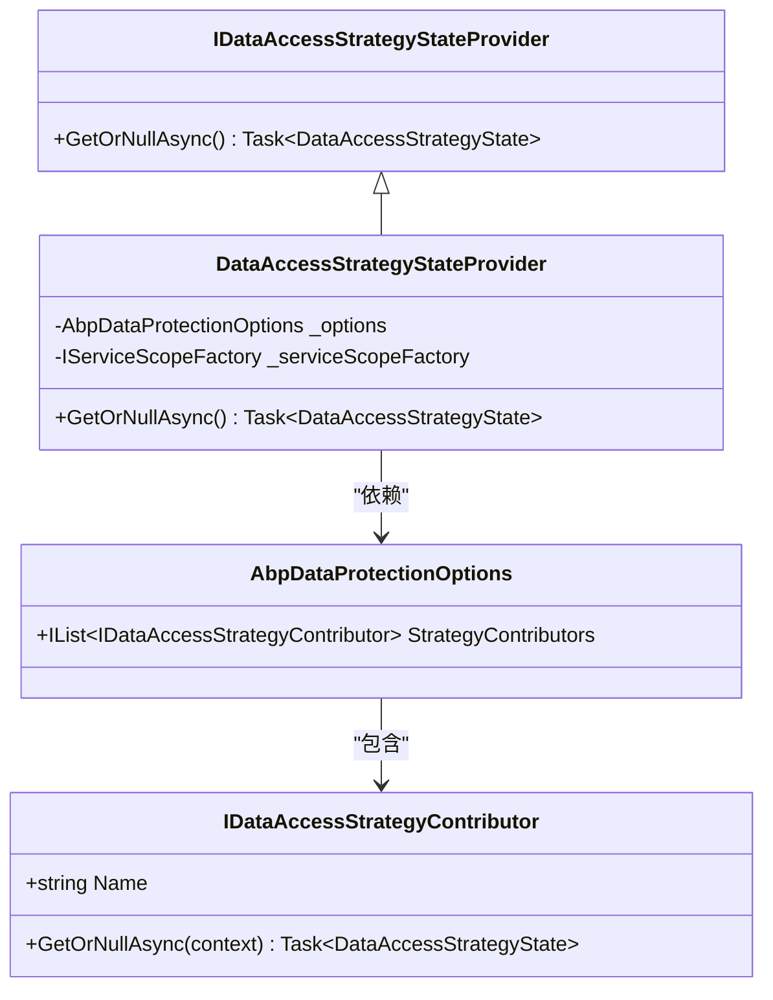
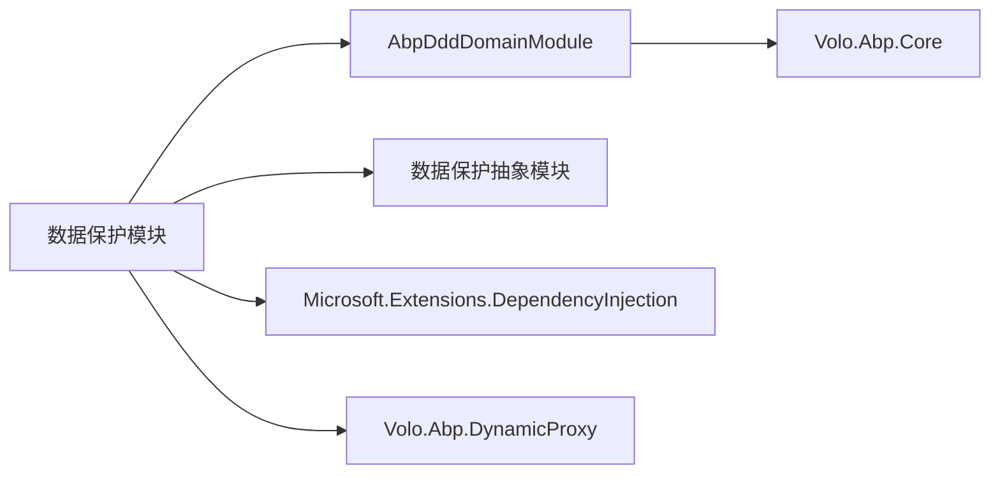

# 数据保护实现机制

<cite>
**本文档引用的文件**
- [AbpDataProtectionModule.cs](file://aspnet-core/framework/data-protection/LINGYUN.Abp.DataProtection/LINGYUN/Abp/DataProtection/AbpDataProtectionModule.cs)
- [AbpDataProtectionOptions.cs](file://aspnet-core/framework/data-protection/LINGYUN.Abp.DataProtection/LINGYUN/Abp/DataProtection/AbpDataProtectionOptions.cs)
- [DataProtectedInterceptor.cs](file://aspnet-core/framework/data-protection/LINGYUN.Abp.DataProtection/LINGYUN/Abp/DataProtection/DataProtectedInterceptor.cs)
- [DataProtectedInterceptorRegistrar.cs](file://aspnet-core/framework/data-protection/LINGYUN.Abp.DataProtection/LINGYUN/Abp/DataProtection/DataProtectedInterceptorRegistrar.cs)
- [IDataProtected.cs](file://aspnet-core/framework/data-protection/LINGYUN.Abp.DataProtection.Abstractions/LINGYUN/Abp/DataProtection/IDataProtected.cs)
- [IDataProtectedEnabled.cs](file://aspnet-core/framework/data-protection/LINGYUN.Abp.DataProtection.Abstractions/LINGYUN/Abp/DataProtection/IDataProtectedEnabled.cs)
- [DataProtectedAttribute.cs](file://aspnet-core/framework/data-protection/LINGYUN.Abp.DataProtection.Abstractions/LINGYUN/Abp/DataProtection/DataProtectedAttribute.cs)
- [DataAccessStrategy.cs](file://aspnet-core/framework/data-protection/LINGYUN.Abp.DataProtection.Abstractions/LINGYUN/Abp/DataProtection/DataAccessStrategy.cs)
- [DataAccessOperation.cs](file://aspnet-core/framework/data-protection/LINGYUN.Abp.DataProtection.Abstractions/LINGYUN/Abp/DataProtection/DataAccessOperation.cs)
- [IDataAccessScope.cs](file://aspnet-core/framework/data-protection/LINGYUN.Abp.DataProtection.Abstractions/LINGYUN/Abp/DataProtection/IDataAccessScope.cs)
- [DataAccessStrategyStateProvider.cs](file://aspnet-core/framework/data-protection/LINGYUN.Abp.DataProtection/LINGYUN/Abp/DataProtection/DataAccessStrategyStateProvider.cs)
- [IDataAccessStrategyStateProvider.cs](file://aspnet-core/framework/data-protection/LINGYUN.Abp.DataProtection/LINGYUN/Abp/DataProtection/IDataAccessStrategyStateProvider.cs)
- [IDataAccessStrategyContributor.cs](file://aspnet-core/framework/data-protection/LINGYUN.Abp.DataProtection/LINGYUN/Abp/DataProtection/IDataAccessStrategyContributor.cs)
</cite>

## 目录
1. [简介](#简介)
2. [项目结构](#项目结构)
3. [核心组件](#核心组件)
4. [架构概述](#架构概述)
5. [详细组件分析](#详细组件分析)
6. [依赖分析](#依赖分析)
7. [性能考虑](#性能考虑)
8. [故障排除指南](#故障排除指南)
9. [结论](#结论)

## 简介
本文件详细阐述了ABP框架中数据保护机制的实现。该机制旨在为应用程序提供强大的数据安全保护，通过定义数据访问策略、权限主体、过滤关键字和数据操作等核心概念，实现对敏感数据的细粒度访问控制。系统采用基于拦截器的动态代理技术，在运行时自动应用数据保护规则，确保数据安全。

## 项目结构
数据保护功能主要分布在两个核心模块中：`LINGYUN.Abp.DataProtection` 和 `LINGYUN.Abp.DataProtection.Abstractions`。前者包含具体的实现逻辑，后者定义了公共接口和抽象概念。这种分离设计使得数据保护功能既可独立使用，也可被其他模块轻松扩展。

**图示来源**
- [AbpDataProtectionModule.cs](file://aspnet-core/framework/data-protection/LINGYUN.Abp.DataProtection/LINGYUN/Abp/DataProtection/AbpDataProtectionModule.cs)
- [IDataProtected.cs](file://aspnet-core/framework/data-protection/LINGYUN.Abp.DataProtection.Abstractions/LINGYUN/Abp/DataProtection/IDataProtected.cs)
- [DataProtectedAttribute.cs](file://aspnet-core/framework/data-protection/LINGYUN.Abp.DataProtection.Abstractions/LINGYUN/Abp/DataProtection/DataProtectedAttribute.cs)

**本节来源**
- [AbpDataProtectionModule.cs](file://aspnet-core/framework/data-protection/LINGYUN.Abp.DataProtection/LINGYUN/Abp/DataProtection/AbpDataProtectionModule.cs)
- [AbpDataProtectionOptions.cs](file://aspnet-core/framework/data-protection/LINGYUN.Abp.DataProtection/LINGYUN/Abp/DataProtection/AbpDataProtectionOptions.cs)

## 核心组件
数据保护机制的核心组件包括数据保护拦截器、数据访问策略提供程序、数据保护选项配置以及一系列定义数据保护行为的接口和枚举。这些组件协同工作，实现了对数据访问的动态控制。

**本节来源**
- [DataProtectedInterceptor.cs](file://aspnet-core/framework/data-protection/LINGYUN.Abp.DataProtection/LINGYUN/Abp/DataProtection/DataProtectedInterceptor.cs)
- [DataAccessStrategyStateProvider.cs](file://aspnet-core/framework/data-protection/LINGYUN.Abp.DataProtection/LINGYUN/Abp/DataProtection/DataAccessStrategyStateProvider.cs)
- [AbpDataProtectionOptions.cs](file://aspnet-core/framework/data-protection/LINGYUN.Abp.DataProtection/LINGYUN/Abp/DataProtection/AbpDataProtectionOptions.cs)

## 架构概述
数据保护机制采用分层架构设计，从上到下分为配置层、策略层、执行层和基础接口层。配置层通过 `AbpDataProtectionOptions` 类集中管理所有配置；策略层负责确定当前请求的数据访问策略；执行层通过拦截器在方法调用时应用保护规则；基础接口层定义了所有核心概念。

**图示来源**
- [AbpDataProtectionOptions.cs](file://aspnet-core/framework/data-protection/LINGYUN.Abp.DataProtection/LINGYUN/Abp/DataProtection/AbpDataProtectionOptions.cs)
- [DataAccessStrategyStateProvider.cs](file://aspnet-core/framework/data-protection/LINGYUN.Abp.DataProtection/LINGYUN/Abp/DataProtection/DataAccessStrategyStateProvider.cs)
- [DataProtectedInterceptor.cs](file://aspnet-core/framework/data-protection/LINGYUN.Abp.DataProtection/LINGYUN/Abp/DataProtection/DataProtectedInterceptor.cs)

## 详细组件分析

### 数据保护拦截器分析
`DataProtectedInterceptor` 是数据保护机制的核心执行组件，它继承自 `AbpInterceptor` 并实现了 `ITransientDependency` 接口。该拦截器在方法调用前后进行拦截，根据配置和属性决定是否应用数据保护。

#### 对象导向组件：

**图示来源**
- [DataProtectedInterceptor.cs](file://aspnet-core/framework/data-protection/LINGYUN.Abp.DataProtection/LINGYUN/Abp/DataProtection/DataProtectedInterceptor.cs)
- [IDataFilter.cs](file://aspnet-core/framework/common/Volo/Abp/Data/IDataFilter.cs)
- [IDataAccessScope.cs](file://aspnet-core/framework/data-protection/LINGYUN.Abp.DataProtection.Abstractions/LINGYUN/Abp/DataProtection/IDataAccessScope.cs)

#### API/服务组件：

**图示来源**
- [DataProtectedInterceptor.cs](file://aspnet-core/framework/data-protection/LINGYUN.Abp.DataProtection/LINGYUN/Abp/DataProtection/DataProtectedInterceptor.cs)
- [DataProtectedAttribute.cs](file://aspnet-core/framework/data-protection/LINGYUN.Abp.DataProtection.Abstractions/LINGYUN/Abp/DataProtection/DataProtectedAttribute.cs)

**本节来源**
- [DataProtectedInterceptor.cs](file://aspnet-core/framework/data-protection/LINGYUN.Abp.DataProtection/LINGYUN/Abp/DataProtection/DataProtectedInterceptor.cs)
- [DataProtectedInterceptorRegistrar.cs](file://aspnet-core/framework/data-protection/LINGYUN.Abp.DataProtection/LINGYUN/Abp/DataProtection/DataProtectedInterceptorRegistrar.cs)

### 数据保护注册器分析
`DataProtectedInterceptorRegistrar` 负责在服务注册时自动为符合条件的类型注册拦截器。它通过检查类型是否实现了 `IDataProtectedEnabled` 接口或是否标记了 `DataProtectedAttribute` 属性来决定是否需要拦截。

**图示来源**
- [DataProtectedInterceptorRegistrar.cs](file://aspnet-core/framework/data-protection/LINGYUN.Abp.DataProtection/LINGYUN/Abp/DataProtection/DataProtectedInterceptorRegistrar.cs)

**本节来源**
- [DataProtectedInterceptorRegistrar.cs](file://aspnet-core/framework/data-protection/LINGYUN.Abp.DataProtection/LINGYUN/Abp/DataProtection/DataProtectedInterceptorRegistrar.cs)

### 数据访问策略分析
数据访问策略通过 `DataAccessStrategy` 枚举定义了多种访问控制模式，包括完全访问、自定义规则、仅当前用户、仅当前用户角色等。策略提供程序 `DataAccessStrategyStateProvider` 负责根据当前上下文确定最合适的策略。

**图示来源**
- [IDataAccessStrategyContributor.cs](file://aspnet-core/framework/data-protection/LINGYUN.Abp.DataProtection/LINGYUN/Abp/DataProtection/IDataAccessStrategyContributor.cs)
- [IDataAccessStrategyStateProvider.cs](file://aspnet-core/framework/data-protection/LINGYUN.Abp.DataProtection/LINGYUN/Abp/DataProtection/IDataAccessStrategyStateProvider.cs)
- [DataAccessStrategyStateProvider.cs](file://aspnet-core/framework/data-protection/LINGYUN.Abp.DataProtection/LINGYUN/Abp/DataProtection/DataAccessStrategyStateProvider.cs)
- [AbpDataProtectionOptions.cs](file://aspnet-core/framework/data-protection/LINGYUN.Abp.DataProtection/LINGYUN/Abp/DataProtection/AbpDataProtectionOptions.cs)

**本节来源**
- [DataAccessStrategy.cs](file://aspnet-core/framework/data-protection/LINGYUN.Abp.DataProtection.Abstractions/LINGYUN/Abp/DataProtection/DataAccessStrategy.cs)
- [DataAccessStrategyStateProvider.cs](file://aspnet-core/framework/data-protection/LINGYUN.Abp.DataProtection/LINGYUN/Abp/DataProtection/DataAccessStrategyStateProvider.cs)
- [IDataAccessStrategyContributor.cs](file://aspnet-core/framework/data-protection/LINGYUN.Abp.DataProtection/LINGYUN/Abp/DataProtection/IDataAccessStrategyContributor.cs)

## 依赖分析
数据保护模块依赖于ABP框架的核心模块，特别是DDD领域模块和动态代理功能。它通过依赖注入系统获取所需的服务，并利用拦截器机制实现AOP（面向切面编程）风格的数据保护。

**图示来源**
- [AbpDataProtectionModule.cs](file://aspnet-core/framework/data-protection/LINGYUN.Abp.DataProtection/LINGYUN/Abp/DataProtection/AbpDataProtectionModule.cs)
- [AbpDddDomainModule.cs](file://aspnet-core/framework/common/Volo/Abp/Domain/AbpDddDomainModule.cs)

**本节来源**
- [AbpDataProtectionModule.cs](file://aspnet-core/framework/data-protection/LINGYUN.Abp.DataProtection/LINGYUN/Abp/DataProtection/AbpDataProtectionModule.cs)

## 性能考虑
数据保护机制在设计时考虑了性能因素。通过使用拦截器模式，避免了在每个业务方法中手动添加保护代码的开销。同时，策略计算和过滤器应用都在服务注册时进行预配置，减少了运行时的计算负担。对于高频访问的数据，建议合理配置全局忽略字段列表，以减少不必要的权限检查。

## 故障排除指南
当数据保护功能未按预期工作时，可以检查以下几点：
1. 确保相关服务类实现了 `IDataProtectedEnabled` 接口或标记了 `DataProtectedAttribute` 属性
2. 检查 `AbpDataProtectionOptions` 的配置是否正确
3. 确认拦截器已成功注册到目标服务
4. 验证数据访问策略提供程序是否返回了正确的策略状态

**