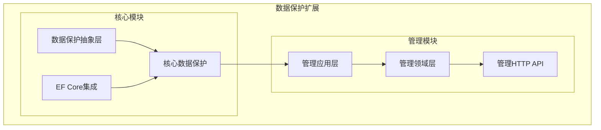
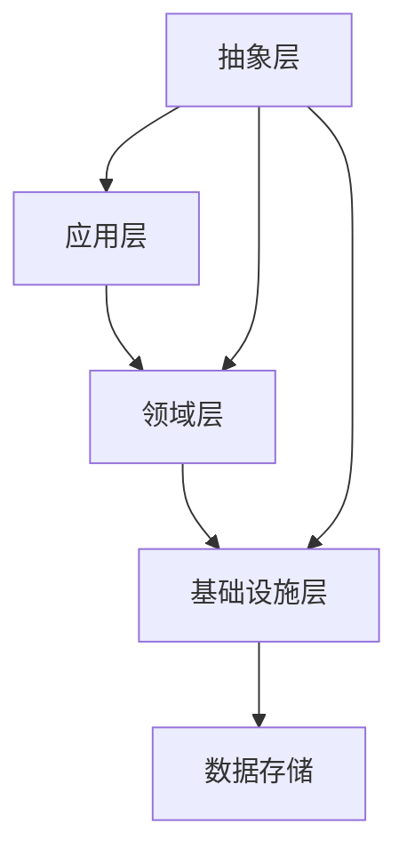
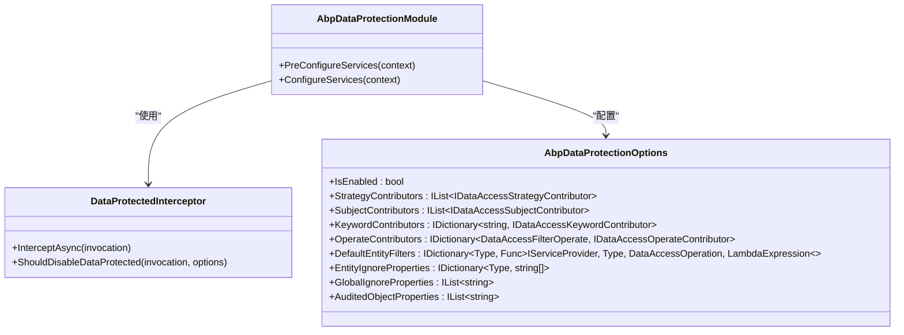
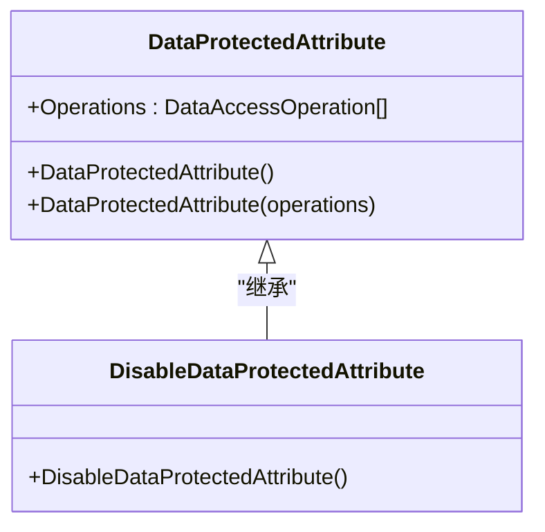
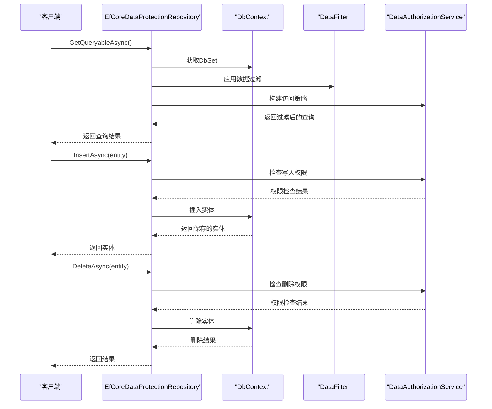
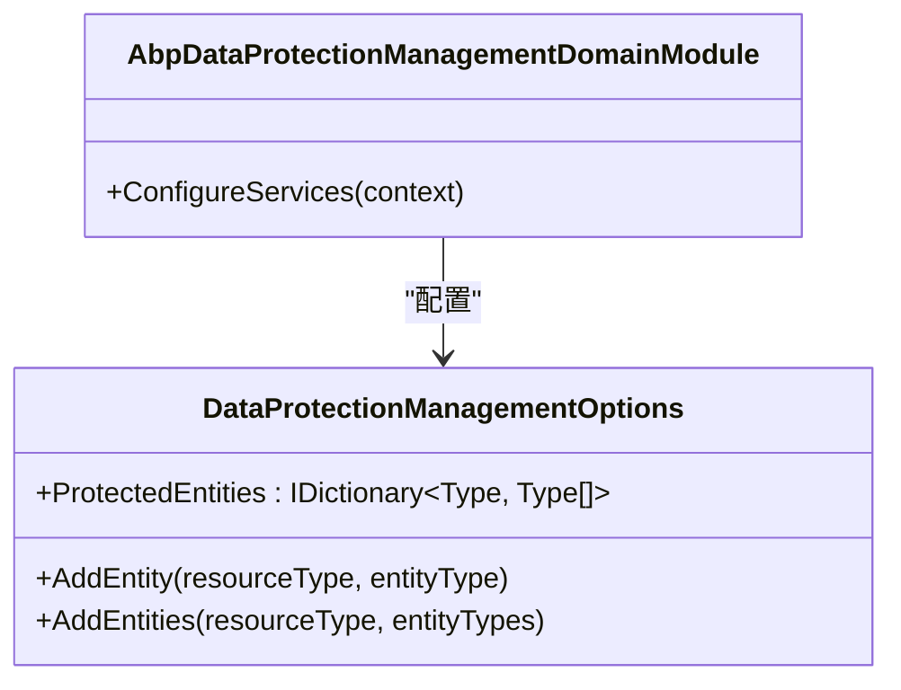
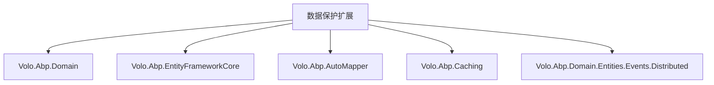

# 数据保护扩展

<cite>
**本文档引用的文件**
- [AbpDataProtectionModule.cs](file://aspnet-core/framework/data-protection/LINGYUN.Abp.DataProtection/LINGYUN/Abp/DataProtection/AbpDataProtectionModule.cs)
- [DataProtectedAttribute.cs](file://aspnet-core/framework/data-protection/LINGYUN.Abp.DataProtection.Abstractions/LINGYUN/Abp/DataProtection/DataProtectedAttribute.cs)
- [AbpDataProtectionOptions.cs](file://aspnet-core/framework/data-protection/LINGYUN.Abp.DataProtection/LINGYUN/Abp/DataProtection/AbpDataProtectionOptions.cs)
- [DataProtectedInterceptor.cs](file://aspnet-core/framework/data-protection/LINGYUN.Abp.DataProtection/LINGYUN/Abp/DataProtection/DataProtectedInterceptor.cs)
- [EfCoreDataProtectionRepository.cs](file://aspnet-core/framework/data-protection/LINGYUN.Abp.DataProtection.EntityFrameworkCore/LINGYUN/Abp/DataProtection/EntityFrameworkCore/EfCoreDataProtectionRepository.cs)
- [AbpDataProtectionManagementDomainModule.cs](file://aspnet-core/modules/data-protection/LINGYUN.Abp.DataProtectionManagement.Domain/LINGYUN/Abp/DataProtectionManagement/AbpDataProtectionManagementDomainModule.cs)
- [DataProtectionManagementOptions.cs](file://aspnet-core/modules/data-protection/LINGYUN.Abp.DataProtectionManagement.Domain/LINGYUN/Abp/DataProtectionManagement/DataProtectionManagementOptions.cs)
- [README.EN.md](file://aspnet-core/framework/data-protection/LINGYUN.Abp.DataProtection.EntityFrameworkCore/README.EN.md)
</cite>

## 目录
1. [简介](#简介)
2. [项目结构](#项目结构)
3. [核心组件](#核心组件)
4. [架构概述](#架构概述)
5. [详细组件分析](#详细组件分析)
6. [依赖分析](#依赖分析)
7. [性能考虑](#性能考虑)
8. [故障排除指南](#故障排除指南)
9. [结论](#结论)

## 简介
数据保护扩展是ABP框架中的一个关键模块，旨在为应用程序提供全面的数据安全保护机制。该扩展通过实现数据加密、解密、保护提供程序和Entity Framework Core集成，确保敏感数据在存储和传输过程中的安全性。本文档深入解释了数据保护功能的实现机制，包括数据加密、解密、保护提供程序和Entity Framework Core集成。详细描述了数据保护扩展的技术架构、配置方式和使用场景。为开发者提供了数据保护的最佳实践指南，包括如何配置保护密钥、如何实现数据保护策略以及如何确保数据安全性。文档包含实际代码示例，展示如何在应用中实现敏感数据的保护。

## 项目结构
数据保护扩展模块在项目中分为多个子模块，每个子模块负责不同的功能。主要包含以下几个部分：

- **LINGYUN.Abp.DataProtection**: 核心数据保护模块，包含数据保护的基本功能和拦截器。
- **LINGYUN.Abp.DataProtection.Abstractions**: 数据保护的抽象层，定义了数据保护相关的接口和属性。
- **LINGYUN.Abp.DataProtection.EntityFrameworkCore**: Entity Framework Core集成模块，提供与EF Core的深度集成。
- **LINGYUN.Abp.DataProtectionManagement.Application**: 数据保护管理应用层，提供数据保护管理的服务。
- **LINGYUN.Abp.DataProtectionManagement.Domain**: 数据保护管理领域层，包含数据保护管理的核心业务逻辑。
- **LINGYUN.Abp.DataProtectionManagement.HttpApi**: 数据保护管理HTTP API层，提供RESTful API接口。

**图示来源**
- [AbpDataProtectionModule.cs](file://aspnet-core/framework/data-protection/LINGYUN.Abp.DataProtection/LINGYUN/Abp/DataProtection/AbpDataProtectionModule.cs)
- [AbpDataProtectionManagementDomainModule.cs](file://aspnet-core/modules/data-protection/LINGYUN.Abp.DataProtectionManagement.Domain/LINGYUN/Abp/DataProtectionManagement/AbpDataProtectionManagementDomainModule.cs)

**本节来源**
- [AbpDataProtectionModule.cs](file://aspnet-core/framework/data-protection/LINGYUN.Abp.DataProtection/LINGYUN/Abp/DataProtection/AbpDataProtectionModule.cs)
- [AbpDataProtectionManagementDomainModule.cs](file://aspnet-core/modules/data-protection/LINGYUN.Abp.DataProtectionManagement.Domain/LINGYUN/Abp/DataProtectionManagement/AbpDataProtectionManagementDomainModule.cs)

## 核心组件
数据保护扩展的核心组件包括数据保护模块、数据保护抽象层、EF Core集成模块和数据保护管理模块。这些组件共同协作，提供全面的数据保护功能。

**本节来源**
- [AbpDataProtectionModule.cs](file://aspnet-core/framework/data-protection/LINGYUN.Abp.DataProtection/LINGYUN/Abp/DataProtection/AbpDataProtectionModule.cs)
- [DataProtectedAttribute.cs](file://aspnet-core/framework/data-protection/LINGYUN.Abp.DataProtection.Abstractions/LINGYUN/Abp/DataProtection/DataProtectedAttribute.cs)
- [AbpDataProtectionOptions.cs](file://aspnet-core/framework/data-protection/LINGYUN.Abp.DataProtection/LINGYUN/Abp/DataProtection/AbpDataProtectionOptions.cs)

## 架构概述
数据保护扩展的架构设计遵循分层原则，确保各层之间的职责清晰，便于维护和扩展。架构主要包括以下几个层次：

- **应用层**: 提供数据保护管理的服务，处理业务逻辑。
- **领域层**: 包含数据保护管理的核心业务逻辑，定义实体和规则。
- **基础设施层**: 提供与EF Core的集成，处理数据持久化。
- **抽象层**: 定义数据保护相关的接口和属性，提供统一的API。

**图示来源**
- [AbpDataProtectionModule.cs](file://aspnet-core/framework/data-protection/LINGYUN.Abp.DataProtection/LINGYUN/Abp/DataProtection/AbpDataProtectionModule.cs)
- [AbpDataProtectionManagementDomainModule.cs](file://aspnet-core/modules/data-protection/LINGYUN.Abp.DataProtectionManagement.Domain/LINGYUN/Abp/DataProtectionManagement/AbpDataProtectionManagementDomainModule.cs)

## 详细组件分析
### 核心数据保护模块分析
核心数据保护模块负责实现数据保护的基本功能，包括数据加密、解密和保护提供程序。该模块通过拦截器机制，在数据访问时自动应用保护策略。

#### 类图

**图示来源**
- [AbpDataProtectionModule.cs](file://aspnet-core/framework/data-protection/LINGYUN.Abp.DataProtection/LINGYUN/Abp/DataProtection/AbpDataProtectionModule.cs)
- [DataProtectedInterceptor.cs](file://aspnet-core/framework/data-protection/LINGYUN.Abp.DataProtection/LINGYUN/Abp/DataProtection/DataProtectedInterceptor.cs)
- [AbpDataProtectionOptions.cs](file://aspnet-core/framework/data-protection/LINGYUN.Abp.DataProtection/LINGYUN/Abp/DataProtection/AbpDataProtectionOptions.cs)

### 数据保护抽象层分析
数据保护抽象层定义了数据保护相关的接口和属性，提供统一的API。主要包含`DataProtectedAttribute`和`DisableDataProtectedAttribute`等属性。

#### 类图

**图示来源**
- [DataProtectedAttribute.cs](file://aspnet-core/framework/data-protection/LINGYUN.Abp.DataProtection.Abstractions/LINGYUN/Abp/DataProtection/DataProtectedAttribute.cs)

### EF Core集成模块分析
EF Core集成模块提供与Entity Framework Core的深度集成，确保数据在持久化过程中受到保护。该模块通过自定义存储库和拦截器，实现数据的自动保护。

#### 序列图

**图示来源**
- [EfCoreDataProtectionRepository.cs](file://aspnet-core/framework/data-protection/LINGYUN.Abp.DataProtection.EntityFrameworkCore/LINGYUN/Abp/DataProtection/EntityFrameworkCore/EfCoreDataProtectionRepository.cs)

### 数据保护管理模块分析
数据保护管理模块负责管理数据保护的配置和策略，提供应用服务和HTTP API接口。

#### 类图

**图示来源**
- [AbpDataProtectionManagementDomainModule.cs](file://aspnet-core/modules/data-protection/LINGYUN.Abp.DataProtectionManagement.Domain/LINGYUN/Abp/DataProtectionManagement/AbpDataProtectionManagementDomainModule.cs)
- [DataProtectionManagementOptions.cs](file://aspnet-core/modules/data-protection/LINGYUN.Abp.DataProtectionManagement.Domain/LINGYUN/Abp/DataProtectionManagement/DataProtectionManagementOptions.cs)

**本节来源**
- [AbpDataProtectionModule.cs](file://aspnet-core/framework/data-protection/LINGYUN.Abp.DataProtection/LINGYUN/Abp/DataProtection/AbpDataProtectionModule.cs)
- [DataProtectedAttribute.cs](file://aspnet-core/framework/data-protection/LINGYUN.Abp.DataProtection.Abstractions/LINGYUN/Abp/DataProtection/DataProtectedAttribute.cs)
- [AbpDataProtectionOptions.cs](file://aspnet-core/framework/data-protection/LINGYUN.Abp.DataProtection/LINGYUN/Abp/DataProtection/AbpDataProtectionOptions.cs)
- [DataProtectedInterceptor.cs](file://aspnet-core/framework/data-protection/LINGYUN.Abp.DataProtection/LINGYUN/Abp/DataProtection/DataProtectedInterceptor.cs)
- [EfCoreDataProtectionRepository.cs](file://aspnet-core/framework/data-protection/LINGYUN.Abp.DataProtection.EntityFrameworkCore/LINGYUN/Abp/DataProtection/EntityFrameworkCore/EfCoreDataProtectionRepository.cs)
- [AbpDataProtectionManagementDomainModule.cs](file://aspnet-core/modules/data-protection/LINGYUN.Abp.DataProtectionManagement.Domain/LINGYUN/Abp/DataProtectionManagement/AbpDataProtectionManagementDomainModule.cs)
- [DataProtectionManagementOptions.cs](file://aspnet-core/modules/data-protection/LINGYUN.Abp.DataProtectionManagement.Domain/LINGYUN/Abp/DataProtectionManagement/DataProtectionManagementOptions.cs)

## 依赖分析
数据保护扩展模块依赖于多个其他模块，确保其功能的完整性和一致性。主要依赖关系如下：

- **Volo.Abp.Domain**: 提供领域驱动设计的基础功能。
- **Volo.Abp.EntityFrameworkCore**: 提供Entity Framework Core的集成支持。
- **Volo.Abp.AutoMapper**: 提供对象映射功能。
- **Volo.Abp.Caching**: 提供缓存支持。
- **Volo.Abp.Domain.Entities.Events.Distributed**: 提供分布式事件支持。

**图示来源**
- [AbpDataProtectionModule.cs](file://aspnet-core/framework/data-protection/LINGYUN.Abp.DataProtection/LINGYUN/Abp/DataProtection/AbpDataProtectionModule.cs)
- [AbpDataProtectionManagementDomainModule.cs](file://aspnet-core/modules/data-protection/LINGYUN.Abp.DataProtectionManagement.Domain/LINGYUN/Abp/DataProtectionManagement/AbpDataProtectionManagementDomainModule.cs)

**本节来源**
- [AbpDataProtectionModule.cs](file://aspnet-core/framework/data-protection/LINGYUN.Abp.DataProtection/LINGYUN/Abp/DataProtection/AbpDataProtectionModule.cs)
- [AbpDataProtectionManagementDomainModule.cs](file://aspnet-core/modules/data-protection/LINGYUN.Abp.DataProtectionManagement.Domain/LINGYUN/Abp/DataProtectionManagement/AbpDataProtectionManagementDomainModule.cs)

## 性能考虑
在使用数据保护扩展时，需要注意以下性能考虑：

- **缓存**: 使用缓存减少数据库查询次数，提高性能。
- **索引**: 为常用查询字段创建索引，加快查询速度。
- **批量操作**: 尽量使用批量操作，减少数据库交互次数。
- **异步操作**: 使用异步操作，避免阻塞主线程。

## 故障排除指南
在使用数据保护扩展时，可能会遇到一些常见问题。以下是一些故障排除建议：

- **权限问题**: 确保用户具有足够的权限访问受保护的数据。
- **配置问题**: 检查数据保护配置是否正确，特别是`AbpDataProtectionOptions`和`DataProtectionManagementOptions`。
- **依赖问题**: 确保所有依赖模块已正确安装和配置。
- **日志**: 查看日志文件，获取详细的错误信息。

**本节来源**
- [AbpDataProtectionModule.cs](file://aspnet-core/framework/data-protection/LINGYUN.Abp.DataProtection/LINGYUN/Abp/DataProtection/AbpDataProtectionModule.cs)
- [DataProtectedInterceptor.cs](file://aspnet-core/framework/data-protection/LINGYUN.Abp.DataProtection/LINGYUN/Abp/DataProtection/DataProtectedInterceptor.cs)

## 结论
数据保护扩展为ABP框架提供了强大的数据安全保护功能。通过深入理解其架构和实现机制，开发者可以更好地利用该扩展，确保应用程序的数据安全。本文档详细介绍了数据保护扩展的技术架构、配置方式和使用场景，并提供了最佳实践指南，帮助开发者实现高效、安全的数据保护。