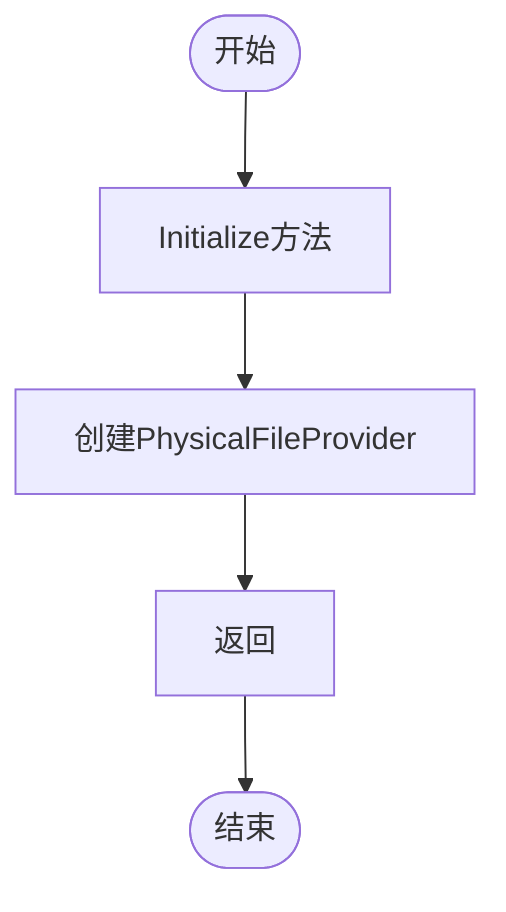

# JSON本地化

<cite>
**本文档中引用的文件**  
- [AbpLocalizationJsonModule.cs](file://aspnet-core/framework/localization/LINGYUN.Abp.Localization.Json/LINGYUN/Abp/Localization/Json/AbpLocalizationJsonModule.cs)
- [README.md](file://aspnet-core/framework/localization/LINGYUN.Abp.Localization.Json/README.md)
- [JsonLocalizationTest.cs](file://aspnet-core/tests/LINGYUN.Abp.Localization.Json.Tests/LINGYUN/Abp/Localization/Json/JsonLocalizationTest.cs)
- [LocalizationResourceExtensions.cs](file://aspnet-core/framework/localization/LINGYUN.Abp.Localization.Json/LINGYUN/Abp/Localization/Json/LocalizationResourceExtensions.cs)
- [JsonPhysicalFileLocalizationResourceContributor.cs](file://aspnet-core/framework/localization/LINGYUN.Abp.Localization.Json/LINGYUN/Abp/Localization/Json/JsonPhysicalFileLocalizationResourceContributor.cs)
</cite>

## 目录
1. [简介](#简介)
2. [项目结构](#项目结构)
3. [核心组件](#核心组件)
4. [架构概述](#架构概述)
5. [详细组件分析](#详细组件分析)
6. [依赖分析](#依赖分析)
7. [性能考虑](#性能考虑)
8. [故障排除指南](#故障排除指南)
9. [结论](#结论)
10. [附录](#附录)（如有必要）

## 简介
本文档详细介绍了ABP框架中基于JSON文件的本地化实现机制。该功能允许开发者使用JSON文件来管理应用程序的多语言文本，通过物理文件系统或虚拟文件系统加载本地化资源。文档涵盖了JSON本地化的技术架构、配置方式、使用场景以及最佳实践，为开发者提供了完整的JSON本地化支持指南。

## 项目结构
JSON本地化功能主要位于`aspnet-core/framework/localization/LINGYUN.Abp.Localization.Json`目录下，该模块实现了基于物理文件提供程序的JSON本地化文件集成。


**图示来源**
- [AbpLocalizationJsonModule.cs](file://aspnet-core/framework/localization/LINGYUN.Abp.Localization.Json/LINGYUN/Abp/Localization/Json/AbpLocalizationJsonModule.cs)
- [LocalizationResourceExtensions.cs](file://aspnet-core/framework/localization/LINGYUN.Abp.Localization.Json/LINGYUN/Abp/Localization/Json/LocalizationResourceExtensions.cs)
- [JsonPhysicalFileLocalizationResourceContributor.cs](file://aspnet-core/framework/localization/LINGYUN.Abp.Localization.Json/LINGYUN/Abp/Localization/Json/JsonPhysicalFileLocalizationResourceContributor.cs)

**节来源**
- [AbpLocalizationJsonModule.cs](file://aspnet-core/framework/localization/LINGYUN.Abp.Localization.Json/LINGYUN/Abp/Localization/Json/AbpLocalizationJsonModule.cs)
- [README.md](file://aspnet-core/framework/localization/LINGYUN.Abp.Localization.Json/README.md)

## 核心组件
JSON本地化模块的核心组件包括`AbpLocalizationJsonModule`、`LocalizationResourceExtensions`和`JsonPhysicalFileLocalizationResourceContributor`。这些组件共同实现了从JSON文件加载本地化文本的功能，支持物理文件系统和虚拟文件系统的集成。

**节来源**
- [AbpLocalizationJsonModule.cs](file://aspnet-core/framework/localization/LINGYUN.Abp.Localization.Json/LINGYUN/Abp/Localization/Json/AbpLocalizationJsonModule.cs)
- [LocalizationResourceExtensions.cs](file://aspnet-core/framework/localization/LINGYUN.Abp.Localization.Json/LINGYUN/Abp/Localization/Json/LocalizationResourceExtensions.cs)
- [JsonPhysicalFileLocalizationResourceContributor.cs](file://aspnet-core/framework/localization/LINGYUN.Abp.Localization.Json/LINGYUN/Abp/Localization/Json/JsonPhysicalFileLocalizationResourceContributor.cs)

## 架构概述
JSON本地化模块的架构基于ABP框架的本地化系统，通过扩展`LocalizationResource`类来支持JSON文件的加载。模块使用`PhysicalFileProvider`来访问本地文件系统中的JSON文件，并将这些文件解析为本地化字典。


**图示来源**
- [AbpLocalizationJsonModule.cs](file://aspnet-core/framework/localization/LINGYUN.Abp.Localization.Json/LINGYUN/Abp/Localization/Json/AbpLocalizationJsonModule.cs)
- [LocalizationResourceExtensions.cs](file://aspnet-core/framework/localization/LINGYUN.Abp.Localization.Json/LINGYUN/Abp/Localization/Json/LocalizationResourceExtensions.cs)
- [JsonPhysicalFileLocalizationResourceContributor.cs](file://aspnet-core/framework/localization/LINGYUN.Abp.Localization.Json/LINGYUN/Abp/Localization/Json/JsonPhysicalFileLocalizationResourceContributor.cs)

## 详细组件分析
### AbpLocalizationJsonModule 分析
`AbpLocalizationJsonModule`是JSON本地化模块的主模块类，它依赖于ABP框架的`AbpLocalizationModule`，为应用程序提供JSON本地化功能。

#### 模块配置
```csharp
[DependsOn(typeof(AbpLocalizationModule))]
public class AbpLocalizationJsonModule : AbpModule
{
}
```

**节来源**
- [AbpLocalizationJsonModule.cs](file://aspnet-core/framework/localization/LINGYUN.Abp.Localization.Json/LINGYUN/Abp/Localization/Json/AbpLocalizationJsonModule.cs)

### LocalizationResourceExtensions 分析
`LocalizationResourceExtensions`类提供了扩展方法`AddPhysicalJson`，用于向本地化资源添加物理JSON文件支持。

#### 扩展方法实现
```csharp
public static LocalizationResource AddPhysicalJson(
    [NotNull] this LocalizationResource localizationResource,
    [NotNull] string jsonFilePath)
{
    Check.NotNull(localizationResource, nameof(localizationResource));
    Check.NotNull(jsonFilePath, nameof(jsonFilePath));

    localizationResource.Contributors.Add(new JsonPhysicalFileLocalizationResourceContributor(jsonFilePath));

    return localizationResource;
}
```

**图示来源**
- [LocalizationResourceExtensions.cs](file://aspnet-core/framework/localization/LINGYUN.Abp.Localization.Json/LINGYUN/Abp/Localization/Json/LocalizationResourceExtensions.cs)

**节来源**
- [LocalizationResourceExtensions.cs](file://aspnet-core/framework/localization/LINGYUN.Abp.Localization.Json/LINGYUN/Abp/Localization/Json/LocalizationResourceExtensions.cs)

### JsonPhysicalFileLocalizationResourceContributor 分析
`JsonPhysicalFileLocalizationResourceContributor`是JSON本地化的核心实现类，负责从物理文件系统加载JSON文件并解析为本地化字典。

#### 初始化流程


#### 字典加载流程


**图示来源**
- [JsonPhysicalFileLocalizationResourceContributor.cs](file://aspnet-core/framework/localization/LINGYUN.Abp.Localization.Json/LINGYUN/Abp/Localization/Json/JsonPhysicalFileLocalizationResourceContributor.cs)

**节来源**
- [JsonPhysicalFileLocalizationResourceContributor.cs](file://aspnet-core/framework/localization/LINGYUN.Abp.Localization.Json/LINGYUN/Abp/Localization/Json/JsonPhysicalFileLocalizationResourceContributor.cs)

## 依赖分析
JSON本地化模块依赖于ABP框架的核心本地化模块，并使用.NET的文件提供程序系统来访问物理文件。


**图示来源**
- [AbpLocalizationJsonModule.cs](file://aspnet-core/framework/localization/LINGYUN.Abp.Localization.Json/LINGYUN/Abp/Localization/Json/AbpLocalizationJsonModule.cs)
- [JsonPhysicalFileLocalizationResourceContributor.cs](file://aspnet-core/framework/localization/LINGYUN.Abp.Localization.Json/LINGYUN/Abp/Localization/Json/JsonPhysicalFileLocalizationResourceContributor.cs)

**节来源**
- [AbpLocalizationJsonModule.cs](file://aspnet-core/framework/localization/LINGYUN.Abp.Localization.Json/LINGYUN/Abp/Localization/Json/AbpLocalizationJsonModule.cs)
- [JsonPhysicalFileLocalizationResourceContributor.cs](file://aspnet-core/framework/localization/LINGYUN.Abp.Localization.Json/LINGYUN/Abp/Localization/Json/JsonPhysicalFileLocalizationResourceContributor.cs)

## 性能考虑
JSON本地化模块在性能方面有以下特点：

1. **缓存机制**：模块使用内存缓存来存储已解析的本地化字典，避免重复解析JSON文件。
2. **文件监听**：通过`ChangeToken.OnChange`监听文件系统变化，当JSON文件被修改时自动清除缓存。
3. **延迟加载**：本地化字典在首次访问时才被创建和解析，减少启动时的开销。
4. **线程安全**：使用锁机制确保多线程环境下的安全访问。

## 故障排除指南
### 常见问题及解决方案
1. **JSON文件未被加载**
   - 检查文件路径是否正确
   - 确认文件扩展名为.json
   - 验证JSON文件格式是否正确

2. **本地化文本未更新**
   - 检查文件监听是否正常工作
   - 确认缓存是否被正确清除
   - 验证应用程序是否重新加载了本地化资源

3. **文化名称冲突**
   - 确保每个JSON文件中的文化名称唯一
   - 检查是否有重复的文化名称定义

**节来源**
- [JsonPhysicalFileLocalizationResourceContributor.cs](file://aspnet-core/framework/localization/LINGYUN.Abp.Localization.Json/LINGYUN/Abp/Localization/Json/JsonPhysicalFileLocalizationResourceContributor.cs)
- [JsonLocalizationTest.cs](file://aspnet-core/tests/LINGYUN.Abp.Localization.Json.Tests/LINGYUN/Abp/Localization/Json/JsonLocalizationTest.cs)

## 结论
JSON本地化模块为ABP应用程序提供了一种灵活的本地化解决方案，通过JSON文件管理多语言文本。该模块设计简洁，易于集成，支持物理文件系统和虚拟文件系统的集成。开发者可以轻松地创建和管理JSON本地化文件，实现动态更新和高性能的本地化支持。

## 附录
### JSON文件格式示例
```json
{
  "culture": "en",
  "texts": {
    "Hello China": "Hello China!"
  }
}
```

### 模块使用示例
```csharp
[DependsOn(
   typeof(AbpLocalizationJsonModule))]
public class YouProjectModule : AbpModule
{
    public override void ConfigureServices(ServiceConfigurationContext context)
    {
        Configure<AbpLocalizationOptions>(options =>
        {
            options.Resources
                .Add<YouResource>("en")
                .AddPhysicalJson(Path.Combine(Directory.GetCurrentDirectory(), "Resources"));
        });
    }
}
```