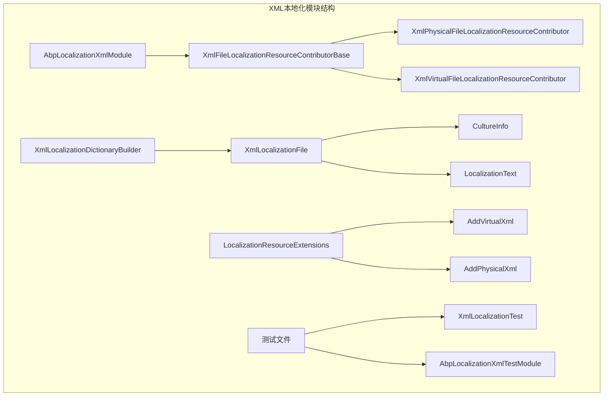
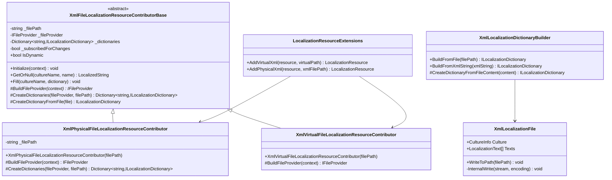
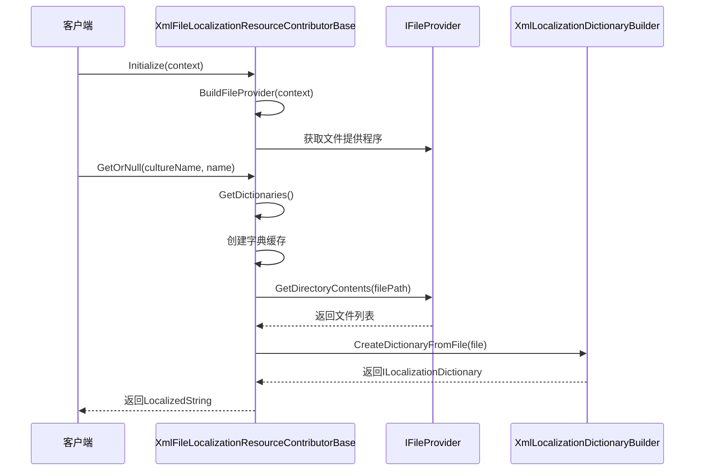
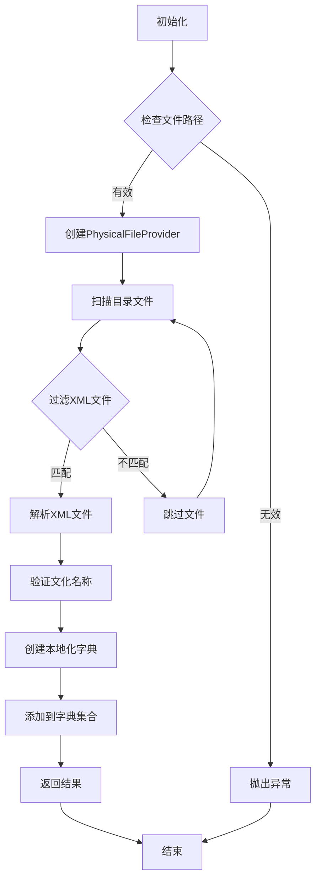
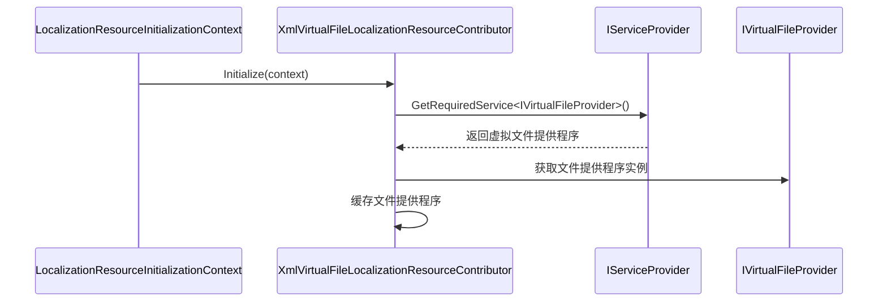
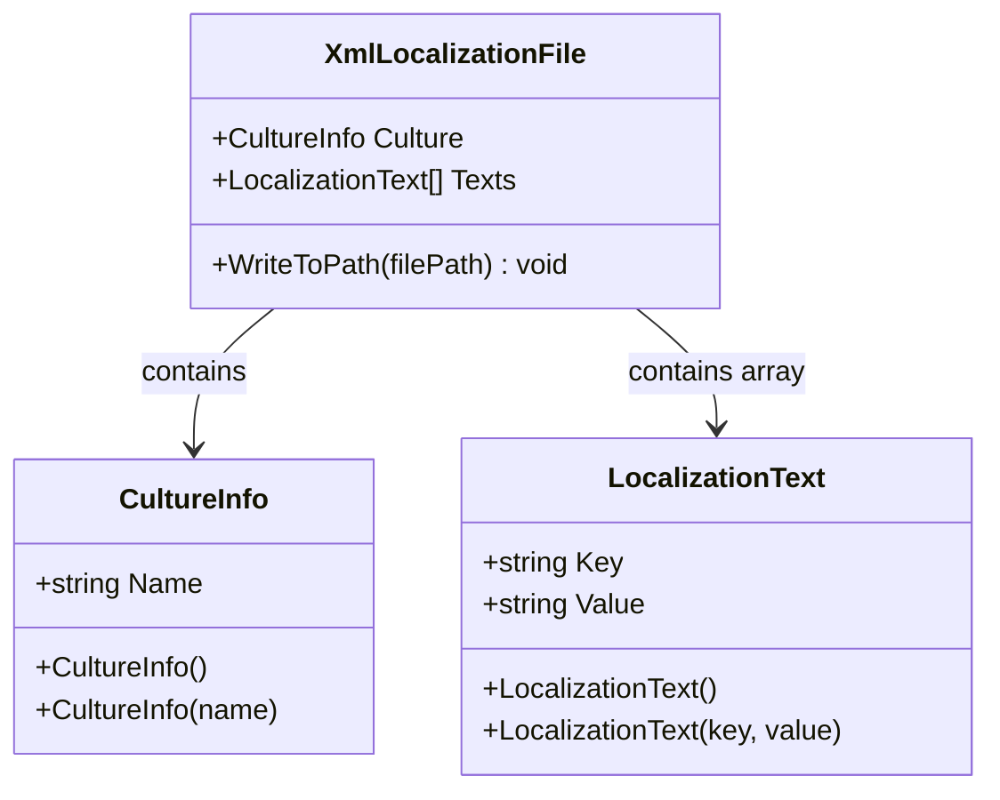
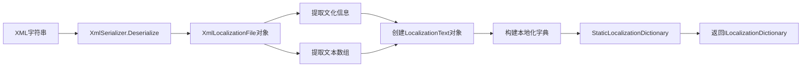

# XML本地化

<cite>
**本文档引用的文件**
- [AbpLocalizationXmlModule.cs](file://aspnet-core/framework/localization/LINGYUN.Abp.Localization.Xml/LINGYUN/Abp/Localization/Xml/AbpLocalizationXmlModule.cs)
- [XmlPhysicalFileLocalizationResourceContributor.cs](file://aspnet-core/framework/localization/LINGYUN.Abp.Localization.Xml/LINGYUN/Abp/Localization/Xml/XmlPhysicalFileLocalizationResourceContributor.cs)
- [XmlVirtualFileLocalizationResourceContributor.cs](file://aspnet-core/framework/localization/LINGYUN.Abp.Localization.Xml/LINGYUN/Abp/Localization/Xml/XmlVirtualFileLocalizationResourceContributor.cs)
- [XmlFileLocalizationResourceContributorBase.cs](file://aspnet-core/framework/localization/LINGYUN.Abp.Localization.Xml/LINGYUN/Abp/Localization/Xml/XmlFileLocalizationResourceContributorBase.cs)
- [XmlLocalizationDictionaryBuilder.cs](file://aspnet-core/framework/localization/LINGYUN.Abp.Localization.Xml/LINGYUN/Abp/Localization/Xml/XmlLocalizationDictionaryBuilder.cs)
- [XmlLocalizationFile.cs](file://aspnet-core/framework/localization/LINGYUN.Abp.Localization.Xml/LINGYUN/Abp/Localization/Xml/XmlLocalizationFile.cs)
- [LocalizationResourceExtensions.cs](file://aspnet-core/framework/localization/LINGYUN.Abp.Localization.Xml/LINGYUN/Abp/Localization/Xml/LocalizationResourceExtensions.cs)
- [README.md](file://aspnet-core/framework/localization/LINGYUN.Abp.Localization.Xml/README.md)
- [XmlLocalizationTest.cs](file://aspnet-core/tests/LINGYUN.Abp.Localization.Xml.Tests/LINGYUN/Abp/Localization/Xml/XmlLocalizationTest.cs)
- [AbpLocalizationXmlTestModule.cs](file://aspnet-core/tests/LINGYUN.Abp.Localization.Xml.Tests/LINGYUN/Abp/Localization/Xml/AbpLocalizationXmlTestModule.cs)
</cite>

## 目录
1. [简介](#简介)
2. [项目结构](#项目结构)
3. [核心组件](#核心组件)
4. [架构概览](#架构概览)
5. [详细组件分析](#详细组件分析)
6. [XML文件格式](#xml文件格式)
7. [配置和使用](#配置和使用)
8. [最佳实践](#最佳实践)
9. [性能考虑](#性能考虑)
10. [故障排除指南](#故障排除指南)
11. [结论](#结论)

## 简介

XML本地化是ABP框架中一个重要的本地化组件，它提供了基于XML文件的本地化资源支持。该模块内置了物理文件提供程序（PhysicalFileProvider）和虚拟文件提供程序（VirtualFileProvider）的实现，使得开发者可以灵活地选择本地化资源的存储方式。

XML本地化模块的主要特点包括：
- 支持从XML文件读取本地化资源
- 支持虚拟文件系统中的XML文件
- 支持物理文件系统中的XML文件
- 支持XML文件的序列化和反序列化
- 支持UTF-8编码的XML文件

## 项目结构

XML本地化模块位于ABP框架的本地化子系统中，其结构清晰明确：



**图表来源**
- [AbpLocalizationXmlModule.cs](file://aspnet-core/framework/localization/LINGYUN.Abp.Localization.Xml/LINGYUN/Abp/Localization/Xml/AbpLocalizationXmlModule.cs#L1-L10)
- [XmlFileLocalizationResourceContributorBase.cs](file://aspnet-core/framework/localization/LINGYUN.Abp.Localization.Xml/LINGYUN/Abp/Localization/Xml/XmlFileLocalizationResourceContributorBase.cs#L1-L20)

**章节来源**
- [AbpLocalizationXmlModule.cs](file://aspnet-core/framework/localization/LINGYUN.Abp.Localization.Xml/LINGYUN/Abp/Localization/Xml/AbpLocalizationXmlModule.cs#L1-L10)
- [README.md](file://aspnet-core/framework/localization/LINGYUN.Abp.Localization.Xml/README.md#L1-L50)

## 核心组件

XML本地化模块包含以下核心组件：

### 1. AbpLocalizationXmlModule
这是模块的入口点，继承自AbpModule并依赖于AbpLocalizationModule。

### 2. 文件提供程序
- **XmlPhysicalFileLocalizationResourceContributor**：处理物理文件系统的XML文件
- **XmlVirtualFileLocalizationResourceContributor**：处理虚拟文件系统的XML文件

### 3. 字典构建器
- **XmlLocalizationDictionaryBuilder**：负责将XML内容转换为本地化字典

### 4. 扩展方法
- **LocalizationResourceExtensions**：提供便捷的扩展方法来添加XML本地化资源

**章节来源**
- [AbpLocalizationXmlModule.cs](file://aspnet-core/framework/localization/LINGYUN.Abp.Localization.Xml/LINGYUN/Abp/Localization/Xml/AbpLocalizationXmlModule.cs#L1-L10)
- [XmlPhysicalFileLocalizationResourceContributor.cs](file://aspnet-core/framework/localization/LINGYUN.Abp.Localization.Xml/LINGYUN/Abp/Localization/Xml/XmlPhysicalFileLocalizationResourceContributor.cs#L1-L46)
- [XmlVirtualFileLocalizationResourceContributor.cs](file://aspnet-core/framework/localization/LINGYUN.Abp.Localization.Xml/LINGYUN/Abp/Localization/Xml/XmlVirtualFileLocalizationResourceContributor.cs#L1-L20)

## 架构概览

XML本地化模块采用分层架构设计，确保了良好的可扩展性和维护性：



**图表来源**
- [XmlFileLocalizationResourceContributorBase.cs](file://aspnet-core/framework/localization/LINGYUN.Abp.Localization.Xml/LINGYUN/Abp/Localization/Xml/XmlFileLocalizationResourceContributorBase.cs#L13-L50)
- [XmlPhysicalFileLocalizationResourceContributor.cs](file://aspnet-core/framework/localization/LINGYUN.Abp.Localization.Xml/LINGYUN/Abp/Localization/Xml/XmlPhysicalFileLocalizationResourceContributor.cs#L8-L25)
- [XmlVirtualFileLocalizationResourceContributor.cs](file://aspnet-core/framework/localization/LINGYUN.Abp.Localization.Xml/LINGYUN/Abp/Localization/Xml/XmlVirtualFileLocalizationResourceContributor.cs#L9-L18)

## 详细组件分析

### XmlFileLocalizationResourceContributorBase 抽象基类

这是所有XML本地化贡献者的基类，实现了ILocalizationResourceContributor接口：



**图表来源**
- [XmlFileLocalizationResourceContributorBase.cs](file://aspnet-core/framework/localization/LINGYUN.Abp.Localization.Xml/LINGYUN/Abp/Localization/Xml/XmlFileLocalizationResourceContributorBase.cs#L25-L60)

该基类的核心功能包括：

1. **延迟初始化**：只有在首次访问时才创建文件提供程序
2. **字典缓存**：缓存已解析的本地化字典以提高性能
3. **变更监听**：监听文件系统变更并自动刷新缓存
4. **线程安全**：使用锁机制确保多线程环境下的安全性

### XmlPhysicalFileLocalizationResourceContributor 实现

物理文件提供程序专门处理存储在文件系统中的XML文件：



**图表来源**
- [XmlPhysicalFileLocalizationResourceContributor.cs](file://aspnet-core/framework/localization/LINGYUN.Abp.Localization.Xml/LINGYUN/Abp/Localization/Xml/XmlPhysicalFileLocalizationResourceContributor.cs#L25-L45)

### XmlVirtualFileLocalizationResourceContributor 实现

虚拟文件提供程序处理嵌入在程序集中的XML文件：



**图表来源**
- [XmlVirtualFileLocalizationResourceContributor.cs](file://aspnet-core/framework/localization/LINGYUN.Abp.Localization.Xml/LINGYUN/Abp/Localization/Xml/XmlVirtualFileLocalizationResourceContributor.cs#L13-L18)

**章节来源**
- [XmlFileLocalizationResourceContributorBase.cs](file://aspnet-core/framework/localization/LINGYUN.Abp.Localization.Xml/LINGYUN/Abp/Localization/Xml/XmlFileLocalizationResourceContributorBase.cs#L1-L134)
- [XmlPhysicalFileLocalizationResourceContributor.cs](file://aspnet-core/framework/localization/LINGYUN.Abp.Localization.Xml/LINGYUN/Abp/Localization/Xml/XmlPhysicalFileLocalizationResourceContributor.cs#L1-L46)
- [XmlVirtualFileLocalizationResourceContributor.cs](file://aspnet-core/framework/localization/LINGYUN.Abp.Localization.Xml/LINGYUN/Abp/Localization/Xml/XmlVirtualFileLocalizationResourceContributor.cs#L1-L20)

## XML文件格式

XML本地化模块使用专门的XML格式来存储本地化文本：

### XML文件结构

```xml
<?xml version="1.0" encoding="utf-8"?>
<localization xmlns:xsi="http://www.w3.org/2001/XMLSchema-instance" 
              xmlns:xsd="http://www.w3.org/2001/XMLSchema" 
              xmlns="lingyun.abp">
 <culture name="zh-Hans" />
 <texts>
  <text key="Hello World" value="世界你好!" />
  <text key="C# Test" value="C#测试" />
 </texts>
</localization>
```

### 数据模型



**图表来源**
- [XmlLocalizationFile.cs](file://aspnet-core/framework/localization/LINGYUN.Abp.Localization.Xml/LINGYUN/Abp/Localization/Xml/XmlLocalizationFile.cs#L10-L30)

### 序列化和反序列化

XML本地化模块使用.NET的XmlSerializer来处理XML文件的序列化和反序列化：



**图表来源**
- [XmlLocalizationDictionaryBuilder.cs](file://aspnet-core/framework/localization/LINGYUN.Abp.Localization.Xml/LINGYUN/Abp/Localization/Xml/XmlLocalizationDictionaryBuilder.cs#L18-L45)

**章节来源**
- [XmlLocalizationFile.cs](file://aspnet-core/framework/localization/LINGYUN.Abp.Localization.Xml/LINGYUN/Abp/Localization/Xml/XmlLocalizationFile.cs#L1-L98)
- [XmlLocalizationDictionaryBuilder.cs](file://aspnet-core/framework/localization/LINGYUN.Abp.Localization.Xml/LINGYUN/Abp/Localization/Xml/XmlLocalizationDictionaryBuilder.cs#L1-L74)

## 配置和使用

### 基本配置

要使用XML本地化功能，首先需要安装包：

```bash
dotnet add package LINGYUN.Abp.Localization.Xml
```

然后在模块中添加依赖：

```csharp
[DependsOn(typeof(AbpLocalizationXmlModule))]
public class YouProjectModule : AbpModule
{
    public override void ConfigureServices(ServiceConfigurationContext context)
    {
        Configure<AbpVirtualFileSystemOptions>(options =>
        {
            options.FileSets.AddEmbedded<YouProjectModule>();
        });

        Configure<AbpLocalizationOptions>(options =>
        {
            options.Resources
                .Add<YouResource>("en")
                .AddVirtualXml("/YourVirtualPath/Localization")
                .AddPhysicalXml(Path.Combine(Directory.GetCurrentDirectory(), "Resources"));
        });
    }
}
```

### 扩展方法使用

模块提供了两个便捷的扩展方法：

1. **AddVirtualXml**：添加虚拟文件系统中的XML文件
```csharp
localizationResource.AddVirtualXml("/YourVirtualPath/Localization");
```

2. **AddPhysicalXml**：添加物理文件系统中的XML文件
```csharp
localizationResource.AddPhysicalXml("C:/YourPath/Localization");
```

### 测试示例

以下是使用XML本地化的完整测试示例：

```csharp
// 初始化测试数据
private static void Init()
{
    var zhHansfile = new XmlLocalizationFile("zh-Hans")
    {
        Texts = new LocalizationText[]
        {
            new LocalizationText("Hello World", "世界你好!"),
            new LocalizationText("C# Test", "C#测试")
        }
    };
    zhHansfile.WriteToPath("./TestResources");

    var enFile = new XmlLocalizationFile("en")
    {
        Texts = new LocalizationText[]
        {
            new LocalizationText("Hello World", "Hello World!"),
            new LocalizationText("C# Test", "C# Test!")
        }
    };
    enFile.WriteToPath("./TestResources");
}

// 使用本地化字符串
using (CultureHelper.Use("zh-Hans"))
{
    _localizer["Hello World"].Value.ShouldBe("世界你好!");
    _localizer["C# Test"].Value.ShouldBe("C#测试");
}

using (CultureHelper.Use("en"))
{
    _localizer["Hello World"].Value.ShouldBe("Hello World!");
    _localizer["C# Test"].Value.ShouldBe("C# Test!");
}
```

**章节来源**
- [README.md](file://aspnet-core/framework/localization/LINGYUN.Abp.Localization.Xml/README.md#L25-L50)
- [LocalizationResourceExtensions.cs](file://aspnet-core/framework/localization/LINGYUN.Abp.Localization.Xml/LINGYUN/Abp/Localization/Xml/LocalizationResourceExtensions.cs#L1-L45)
- [XmlLocalizationTest.cs](file://aspnet-core/tests/LINGYUN.Abp.Localization.Xml.Tests/LINGYUN/Abp/Localization/Xml/XmlLocalizationTest.cs#L1-L95)

## 最佳实践

### 1. 虚拟文件系统使用场景

**推荐用法**：
- 将XML文件嵌入到程序集中
- 适用于默认的、不需要动态修改的本地化资源

**优点**：
- 部署简单，无需额外文件
- 性能较好，直接从内存读取
- 版本控制友好

**配置示例**：
```csharp
Configure<AbpVirtualFileSystemOptions>(options =>
{
    options.FileSets.AddEmbedded<YourModule>();
});

Configure<AbpLocalizationOptions>(options =>
{
    options.Resources
        .Add<YourResource>("en")
        .AddVirtualXml("/Localization/Resources");
});
```

### 2. 物理文件系统使用场景

**推荐用法**：
- 存放在宿主项目的特定目录中
- 适用于需要动态修改或由外部系统管理的本地化资源

**优点**：
- 支持运行时修改
- 便于外部工具编辑
- 适合大型项目

**配置示例**：
```csharp
Configure<AbpLocalizationOptions>(options =>
{
    options.Resources
        .Add<YourResource>("en")
        .AddPhysicalXml(Path.Combine(Directory.GetCurrentDirectory(), "Localization"));
});
```

### 3. 文件命名规范

建议使用以下命名规范：
- 文化代码作为文件名：`zh-Hans.xml`, `en.xml`
- 使用UTF-8编码
- 包含XML声明：`<?xml version="1.0" encoding="utf-8"?>`

### 4. 错误处理

模块会自动处理以下错误情况：
- 重复的文化名称
- 缺失的文化信息
- 重复的键值
- 无效的XML格式

**章节来源**
- [README.md](file://aspnet-core/framework/localization/LINGYUN.Abp.Localization.Xml/README.md#L70-L102)

## 性能考虑

### 缓存策略

XML本地化模块采用了多层缓存策略来优化性能：

1. **文件提供程序缓存**：避免重复创建文件提供程序
2. **字典缓存**：缓存已解析的本地化字典
3. **变更监听**：自动检测文件变更并刷新缓存

### 内存优化

- 使用静态字典减少内存占用
- 延迟加载机制避免不必要的初始化
- 弱引用监听器防止内存泄漏

### 并发处理

- 使用读写锁保护共享资源
- 线程安全的字典操作
- 原子性的缓存更新

## 故障排除指南

### 常见问题及解决方案

#### 1. 文件未找到错误
**问题**：无法找到指定的XML文件
**解决方案**：
- 检查文件路径是否正确
- 确认文件权限设置
- 验证文件是否存在

#### 2. XML格式错误
**问题**：XML文件格式不符合规范
**解决方案**：
- 使用XML验证工具检查格式
- 确保包含正确的XML声明
- 验证XML命名空间

#### 3. 文化名称冲突
**问题**：多个文件具有相同的文化名称
**解决方案**：
- 检查文件中的文化名称设置
- 确保每个文化只有一个对应的文件
- 使用不同的文件名区分文化

#### 4. 编码问题
**问题**：XML文件编码不正确
**解决方案**：
- 确保使用UTF-8编码
- 在XML声明中指定编码：`encoding="utf-8"`
- 使用文本编辑器检查文件编码

### 调试技巧

1. **启用详细日志**：配置日志级别以获取更多调试信息
2. **检查文件路径**：确认文件路径是否正确解析
3. **验证XML格式**：使用在线工具验证XML格式
4. **测试单个文件**：单独测试XML文件的解析功能

**章节来源**
- [XmlLocalizationDictionaryBuilder.cs](file://aspnet-core/framework/localization/LINGYUN.Abp.Localization.Xml/LINGYUN/Abp/Localization/Xml/XmlLocalizationDictionaryBuilder.cs#L25-L45)
- [XmlFileLocalizationResourceContributorBase.cs](file://aspnet-core/framework/localization/LINGYUN.Abp.Localization.Xml/LINGYUN/Abp/Localization/Xml/XmlFileLocalizationResourceContributorBase.cs#L45-L70)

## 结论

XML本地化模块为ABP框架提供了强大而灵活的本地化解决方案。通过支持虚拟文件系统和物理文件系统的XML文件，它能够满足不同场景下的本地化需求。

### 主要优势

1. **灵活性**：支持多种文件存储方式
2. **易用性**：提供简洁的API和扩展方法
3. **性能**：采用多层缓存策略优化性能
4. **可靠性**：完善的错误处理和验证机制

### 适用场景

- 小型项目：使用虚拟文件系统简化部署
- 大型项目：使用物理文件系统支持动态修改
- 多语言应用：支持多种文化代码的本地化资源
- 团队协作：便于外部工具管理和编辑

XML本地化模块的设计充分体现了ABP框架的模块化思想和最佳实践，为开发者提供了高质量的本地化功能支持。通过遵循本文档中的最佳实践和配置指南，开发者可以轻松地在项目中实现完整的XML本地化功能。