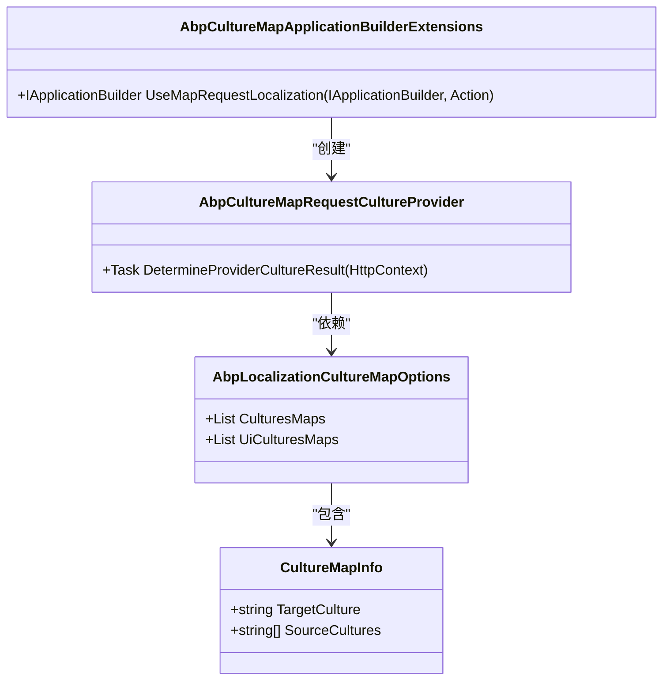
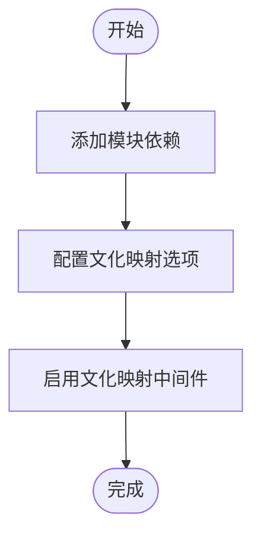
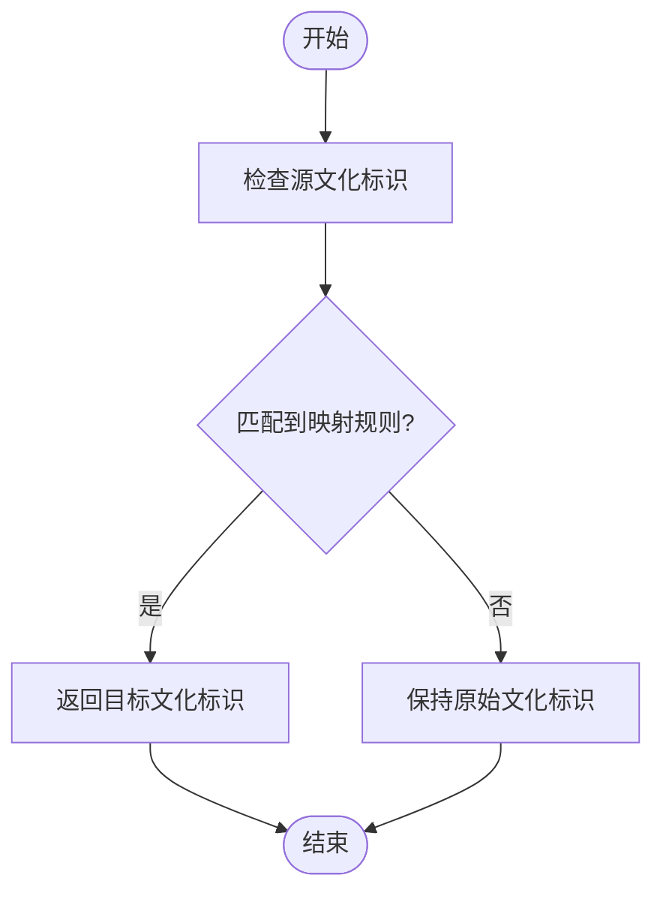
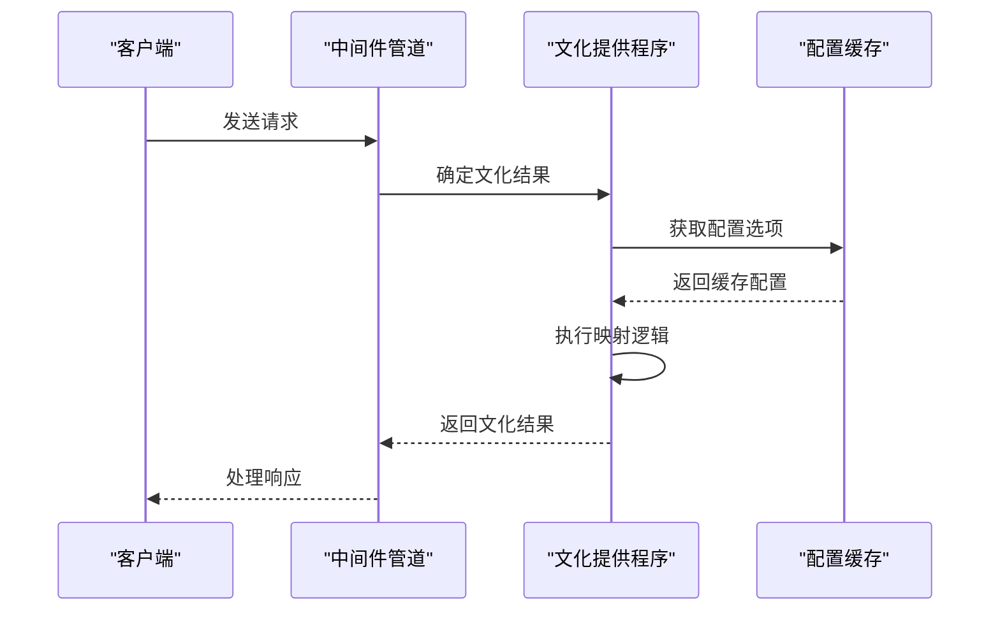

# 文化映射

<cite>
**本文档引用的文件**  
- [CultureMapInfo.cs](file://aspnet-core/framework/localization/LINGYUN.Abp.Localization.CultureMap/LINGYUN/Abp/Localization/CultureMap/CultureMapInfo.cs)
- [AbpLocalizationCultureMapOptions.cs](file://aspnet-core/framework/localization/LINGYUN.Abp.Localization.CultureMap/LINGYUN/Abp/Localization/CultureMap/AbpLocalizationCultureMapOptions.cs)
- [AbpCultureMapRequestCultureProvider.cs](file://aspnet-core/framework/localization/LINGYUN.Abp.Localization.CultureMap/LINGYUN/Abp/Localization/CultureMap/AbpCultureMapRequestCultureProvider.cs)
- [AbpLocalizationCultureMapModule.cs](file://aspnet-core/framework/localization/LINGYUN.Abp.Localization.CultureMap/LINGYUN/Abp/Localization/CultureMap/AbpLocalizationCultureMapModule.cs)
- [AbpCultureMapApplicationBuilderExtensions.cs](file://aspnet-core/framework/localization/LINGYUN.Abp.Localization.CultureMap/Microsoft/AspNetCore/Builder/AbpCultureMapApplicationBuilderExtensions.cs)
- [README.md](file://aspnet-core/framework/localization/LINGYUN.Abp.Localization.CultureMap/README.md)
- [AuthServerHttpApiHostModule.Configure.cs](file://aspnet-core/services/LY.MicroService.AuthServer.HttpApi.Host/AuthServerHttpApiHostModule.Configure.cs)
</cite>

## 目录
1. [简介](#简介)
2. [技术架构](#技术架构)
3. [配置方式](#配置方式)
4. [使用场景](#使用场景)
5. [最佳实践指南](#最佳实践指南)
6. [自定义文化映射规则](#自定义文化映射规则)
7. [文化映射冲突处理](#文化映射冲突处理)
8. [性能优化](#性能优化)
9. [实际代码示例](#实际代码示例)
10. [结论](#结论)

## 简介
文化映射功能旨在解决应用程序中存在多种区域性标识格式的问题。该功能允许开发者将不同格式的区域性标识（如zh、zh_CN、zh-CN）映射到标准格式（如zh-Hans），从而实现统一的本地化管理。本模块基于ABP框架的请求本地化机制，通过自定义文化提供程序实现文化映射功能。

**Section sources**
- [README.md](file://aspnet-core/framework/localization/LINGYUN.Abp.Localization.CultureMap/README.md#L0-L68)

## 技术架构
文化映射模块采用分层架构设计，主要包括配置选项、文化映射信息、文化提供程序和扩展方法四个核心组件。



**Diagram sources**
- [AbpLocalizationCultureMapOptions.cs](file://aspnet-core/framework/localization/LINGYUN.Abp.Localization.CultureMap/LINGYUN/Abp/Localization/CultureMap/AbpLocalizationCultureMapOptions.cs#L0-L15)
- [CultureMapInfo.cs](file://aspnet-core/framework/localization/LINGYUN.Abp.Localization.CultureMap/LINGYUN/Abp/Localization/CultureMap/CultureMapInfo.cs#L0-L7)
- [AbpCultureMapRequestCultureProvider.cs](file://aspnet-core/framework/localization/LINGYUN.Abp.Localization.CultureMap/LINGYUN/Abp/Localization/CultureMap/AbpCultureMapRequestCultureProvider.cs#L0-L61)
- [AbpCultureMapApplicationBuilderExtensions.cs](file://aspnet-core/framework/localization/LINGYUN.Abp.Localization.CultureMap/Microsoft/AspNetCore/Builder/AbpCultureMapApplicationBuilderExtensions.cs#L0-L18)

**Section sources**
- [AbpLocalizationCultureMapOptions.cs](file://aspnet-core/framework/localization/LINGYUN.Abp.Localization.CultureMap/LINGYUN/Abp/Localization/CultureMap/AbpLocalizationCultureMapOptions.cs#L0-L15)
- [CultureMapInfo.cs](file://aspnet-core/framework/localization/LINGYUN.Abp.Localization.CultureMap/LINGYUN/Abp/Localization/CultureMap/CultureMapInfo.cs#L0-L7)

## 配置方式
文化映射模块提供了灵活的配置选项，允许开发者根据实际需求进行定制化配置。

### 核心配置选项
- **CulturesMaps**：区域性映射列表，用于定义文化标识的映射关系
- **UiCulturesMaps**：UI区域性映射列表，用于定义用户界面文化标识的映射关系

每个映射项包含以下属性：
- **TargetCulture**：目标区域性标识
- **SourceCultures**：源区域性标识列表

### 配置步骤
1. 添加模块依赖
2. 配置文化映射选项
3. 启用文化映射中间件



**Diagram sources**
- [README.md](file://aspnet-core/framework/localization/LINGYUN.Abp.Localization.CultureMap/README.md#L69-L93)

**Section sources**
- [README.md](file://aspnet-core/framework/localization/LINGYUN.Abp.Localization.CultureMap/README.md#L69-L93)
- [AbpLocalizationCultureMapOptions.cs](file://aspnet-core/framework/localization/LINGYUN.Abp.Localization.CultureMap/LINGYUN/Abp/Localization/CultureMap/AbpLocalizationCultureMapOptions.cs#L0-L15)

## 使用场景
文化映射功能适用于多种实际应用场景，主要包括：

### 统一简体中文区域性标识
将多种简体中文区域性标识（如zh、zh_CN、zh-CN）统一映射到标准格式zh-Hans。

```csharp
options.CulturesMaps.Add(new CultureMapInfo
{
    TargetCulture = "zh-Hans",
    SourceCultures = new string[] { "zh", "zh_CN", "zh-CN" }
});
```

### 统一繁体中文区域性标识
将多种繁体中文区域性标识（如zh_TW、zh-TW、zh_HK、zh-HK）统一映射到标准格式zh-Hant。

```csharp
options.CulturesMaps.Add(new CultureMapInfo
{
    TargetCulture = "zh-Hant",
    SourceCultures = new string[] { "zh_TW", "zh-TW", "zh_HK", "zh-HK" }
});
```

### 多语言应用支持
在多语言应用中，将不同格式的区域性标识映射到统一的标准格式，简化本地化管理。

**Section sources**
- [README.md](file://aspnet-core/framework/localization/LINGYUN.Abp.Localization.CultureMap/README.md#L70-L93)

## 最佳实践指南
为了确保文化映射功能的正确使用和最佳性能，建议遵循以下最佳实践。

### 模块依赖配置
在模块类中添加对AbpLocalizationCultureMapModule的依赖。

```csharp
[DependsOn(
    typeof(AbpLocalizationCultureMapModule))]
public class YouProjectModule : AbpModule
{
    // 模块实现
}
```

### 文化映射初始化
在ConfigureServices方法中配置文化映射选项。

```csharp
public override void ConfigureServices(ServiceConfigurationContext context)
{
    Configure<AbpLocalizationCultureMapOptions>(options =>
    {
        var zhHansCultureMapInfo = new CultureMapInfo
        {
            TargetCulture = "zh-Hans",
            SourceCultures = new string[] { "zh", "zh_CN", "zh-CN" }
        };

        options.CulturesMaps.Add(zhHansCultureMapInfo);
        options.UiCulturesMaps.Add(zhHansCultureMapInfo);
    });
}
```

### 中间件启用
在OnApplicationInitialization方法中启用文化映射中间件。

```csharp
public override void OnApplicationInitialization(ApplicationInitializationContext context)
{
    var app = context.GetApplicationBuilder();

    app.UseMapRequestLocalization();
}
```

**Section sources**
- [README.md](file://aspnet-core/framework/localization/LINGYUN.Abp.Localization.CultureMap/README.md#L70-L93)

## 自定义文化映射规则
开发者可以根据实际需求定义自定义的文化映射规则。

### 创建文化映射信息
使用CultureMapInfo类创建文化映射信息对象。

```csharp
var cultureMapInfo = new CultureMapInfo
{
    TargetCulture = "目标文化标识",
    SourceCultures = new string[] { "源文化标识1", "源文化标识2" }
};
```

### 添加到配置选项
将创建的文化映射信息添加到CulturesMaps或UiCulturesMaps列表中。

```csharp
options.CulturesMaps.Add(cultureMapInfo);
options.UiCulturesMaps.Add(cultureMapInfo);
```

### 多重映射支持
支持为同一目标文化标识配置多个源文化标识。

```csharp
options.CulturesMaps.Add(new CultureMapInfo
{
    TargetCulture = "zh-Hans",
    SourceCultures = new string[] { "zh", "zh_CN", "zh-CN", "zh_SG", "zh-SG" }
});
```

**Section sources**
- [CultureMapInfo.cs](file://aspnet-core/framework/localization/LINGYUN.Abp.Localization.CultureMap/LINGYUN/Abp/Localization/CultureMap/CultureMapInfo.cs#L0-L7)
- [AbpLocalizationCultureMapOptions.cs](file://aspnet-core/framework/localization/LINGYUN.Abp.Localization.CultureMap/LINGYUN/Abp/Localization/CultureMap/AbpLocalizationCultureMapOptions.cs#L0-L15)

## 文化映射冲突处理
文化映射模块通过特定的处理机制来解决可能的文化映射冲突。

### 冲突解决策略
当多个源文化标识映射到同一目标文化标识时，模块采用以下策略：
- 按照配置顺序进行匹配
- 返回第一个匹配成功的映射结果
- 未匹配到的源文化标识保持原样

### 映射优先级
文化映射的优先级由配置顺序决定，先配置的映射规则具有更高的优先级。

### 冲突检测
模块在运行时会检测文化映射冲突，并通过日志记录相关信息。



**Diagram sources**
- [AbpCultureMapRequestCultureProvider.cs](file://aspnet-core/framework/localization/LINGYUN.Abp.Localization.CultureMap/LINGYUN/Abp/Localization/CultureMap/AbpCultureMapRequestCultureProvider.cs#L29-L60)

**Section sources**
- [AbpCultureMapRequestCultureProvider.cs](file://aspnet-core/framework/localization/LINGYUN.Abp.Localization.CultureMap/LINGYUN/Abp/Localization/CultureMap/AbpCultureMapRequestCultureProvider.cs#L29-L60)

## 性能优化
为了确保文化映射功能的高性能运行，建议采取以下优化措施。

### 缓存机制
利用ABP框架的依赖注入和配置缓存机制，避免重复创建配置对象。

### 配置优化
合理组织文化映射配置，减少不必要的映射规则。

### 中间件位置
将文化映射中间件放置在请求处理管道的早期位置，以提高处理效率。

### 异步处理
文化映射提供程序采用异步处理方式，确保不会阻塞主线程。



**Diagram sources**
- [AbpCultureMapRequestCultureProvider.cs](file://aspnet-core/framework/localization/LINGYUN.Abp.Localization.CultureMap/LINGYUN/Abp/Localization/CultureMap/AbpCultureMapRequestCultureProvider.cs#L0-L61)
- [AbpLocalizationCultureMapOptions.cs](file://aspnet-core/framework/localization/LINGYUN.Abp.Localization.CultureMap/LINGYUN/Abp/Localization/CultureMap/AbpLocalizationCultureMapOptions.cs#L0-L15)

**Section sources**
- [AbpCultureMapRequestCultureProvider.cs](file://aspnet-core/framework/localization/LINGYUN.Abp.Localization.CultureMap/LINGYUN/Abp/Localization/CultureMap/AbpCultureMapRequestCultureProvider.cs#L0-L61)

## 实际代码示例
以下是文化映射功能的实际应用代码示例。

### 模块配置示例
```csharp
[DependsOn(
    typeof(AbpLocalizationCultureMapModule))]
public class YouProjectModule : AbpModule
{
    public override void ConfigureServices(ServiceConfigurationContext context)
    {
        Configure<AbpLocalizationCultureMapOptions>(options =>
        {
            var zhHansCultureMapInfo = new CultureMapInfo
            {
                TargetCulture = "zh-Hans",
                SourceCultures = new string[] { "zh", "zh_CN", "zh-CN" }
            };

            options.CulturesMaps.Add(zhHansCultureMapInfo);
            options.UiCulturesMaps.Add(zhHansCultureMapInfo);
        });
    }

    public override void OnApplicationInitialization(ApplicationInitializationContext context)
    {
        var app = context.GetApplicationBuilder();

        app.UseMapRequestLocalization();
    }
}
```

### 具体项目配置
在实际项目中，文化映射配置通常与其他本地化配置一起使用。

```csharp
private void ConfigureLocalization()
{
    // 支持本地化语言类型
    Configure<AbpLocalizationOptions>(options =>
    {
        options.Languages.Add(new LanguageInfo("en", "en", "English"));
        options.Languages.Add(new LanguageInfo("zh-Hans", "zh-Hans", "简体中文"));
    });

    Configure<AbpLocalizationCultureMapOptions>(options =>
    {
        var zhHansCultureMapInfo = new CultureMapInfo
        {
            TargetCulture = "zh-Hans",
            SourceCultures = new string[] { "zh", "zh_CN", "zh-CN" }
        };

        options.CulturesMaps.Add(zhHansCultureMapInfo);
        options.UiCulturesMaps.Add(zhHansCultureMapInfo);
    });
}
```

**Section sources**
- [README.md](file://aspnet-core/framework/localization/LINGYUN.Abp.Localization.CultureMap/README.md#L70-L93)
- [AuthServerHttpApiHostModule.Configure.cs](file://aspnet-core/services/LY.MicroService.AuthServer.HttpApi.Host/AuthServerHttpApiHostModule.Configure.cs#L400-L532)

## 结论
文化映射功能为ABP框架应用程序提供了强大的区域性标识管理能力。通过将不同格式的区域性标识映射到标准格式，开发者可以更轻松地管理多语言应用的本地化需求。该功能具有以下优势：

- **灵活性**：支持自定义文化映射规则
- **易用性**：与ABP框架无缝集成
- **可扩展性**：支持区域性（Culture）和UI区域性（UICulture）的独立映射
- **高性能**：采用异步处理和缓存机制

通过遵循本文档提供的最佳实践指南，开发者可以有效地利用文化映射功能，提升应用程序的国际化和本地化能力。