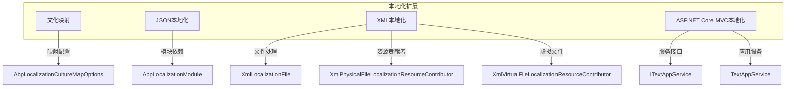
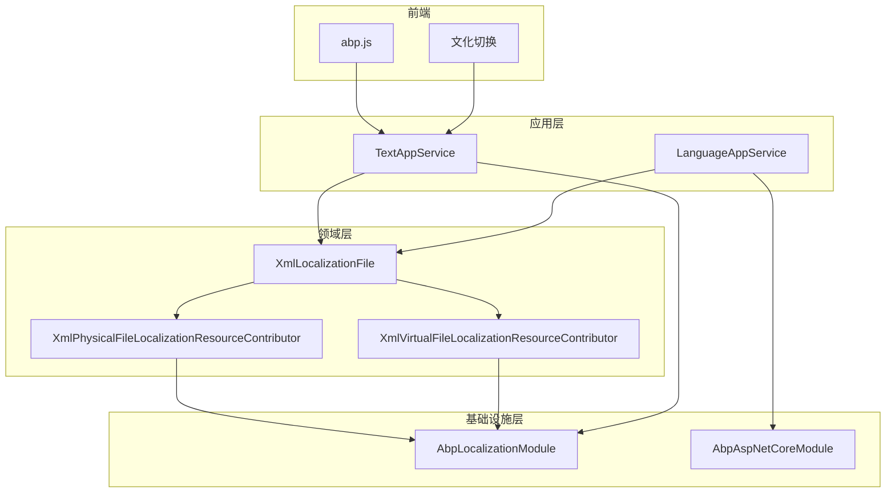
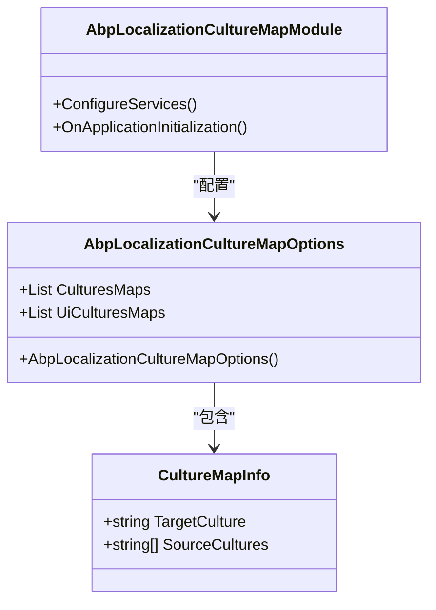
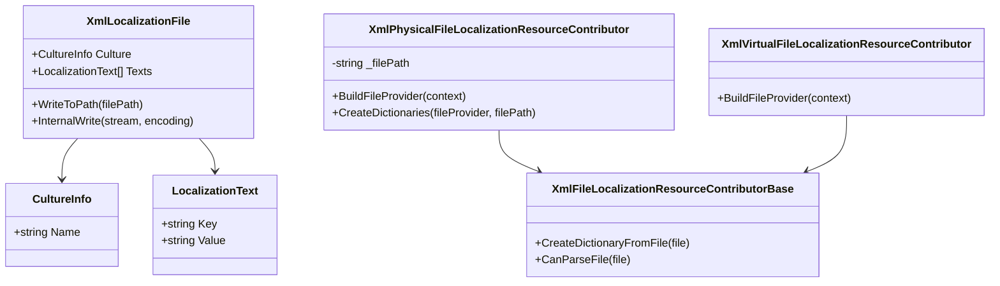
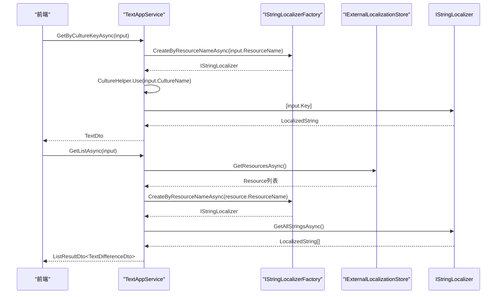
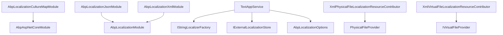

# 本地化扩展

<cite>
**本文档中引用的文件**  
- [AbpLocalizationCultureMapModule.cs](file://aspnet-core/framework/localization/LINGYUN.Abp.Localization.CultureMap/LINGYUN/Abp/Localization/CultureMap/AbpLocalizationCultureMapModule.cs)
- [AbpLocalizationJsonModule.cs](file://aspnet-core/framework/localization/LINGYUN.Abp.Localization.Json/LINGYUN/Abp/Localization/Json/AbpLocalizationJsonModule.cs)
- [AbpLocalizationXmlModule.cs](file://aspnet-core/framework/localization/LINGYUN.Abp.Localization.Xml/LINGYUN/Abp/Localization/Xml/AbpLocalizationXmlModule.cs)
- [CultureMapInfo.cs](file://aspnet-core/framework/localization/LINGYUN.Abp.Localization.CultureMap/LINGYUN/Abp/Localization/CultureMap/CultureMapInfo.cs)
- [AbpLocalizationCultureMapOptions.cs](file://aspnet-core/framework/localization/LINGYUN.Abp.Localization.CultureMap/LINGYUN/Abp/Localization/CultureMap/AbpLocalizationCultureMapOptions.cs)
- [XmlLocalizationFile.cs](file://aspnet-core/framework/localization/LINGYUN.Abp.Localization.Xml/LINGYUN/Abp/Localization/Xml/XmlLocalizationFile.cs)
- [XmlPhysicalFileLocalizationResourceContributor.cs](file://aspnet-core/framework/localization/LINGYUN.Abp.Localization.Xml/LINGYUN/Abp/Localization/Xml/XmlPhysicalFileLocalizationResourceContributor.cs)
- [XmlVirtualFileLocalizationResourceContributor.cs](file://aspnet-core/framework/localization/LINGYUN.Abp.Localization.Xml/LINGYUN/Abp/Localization/Xml/XmlVirtualFileLocalizationResourceContributor.cs)
- [TextAppService.cs](file://aspnet-core/framework/localization/LINGYUN.Abp.AspNetCore.Mvc.Localization/LINGYUN/Abp/AspNetCore/Mvc/Localization/TextAppService.cs)
- [LanguageAppService.cs](file://aspnet-core/framework/localization/LINGYUN.Abp.AspNetCore.Mvc.Localization/LINGYUN/Abp/AspNetCore/Mvc/Localization/LanguageAppService.cs)
- [ILanguageAppService.cs](file://aspnet-core/framework/localization/LINGYUN.Abp.AspNetCore.Mvc.Localization/LINGYUN/Abp/AspNetCore/Mvc/Localization/ILanguageAppService.cs)
- [ITextAppService.cs](file://aspnet-core/framework/localization/LINGYUN.Abp.AspNetCore.Mvc.Localization/LINGYUN/Abp/AspNetCore/Mvc/Localization/ITextAppService.cs)
- [GetTextsInput.cs](file://aspnet-core/framework/localization/LINGYUN.Abp.AspNetCore.Mvc.Localization/LINGYUN/Abp/AspNetCore/Mvc/Localization/GetTextsInput.cs)
- [TextDto.cs](file://aspnet-core/framework/localization/LINGYUN.Abp.AspNetCore.Mvc.Localization/LINGYUN/Abp/AspNetCore/Mvc/Localization/TextDto.cs)
- [zh-Hans.xml](file://aspnet-core/tests/LINGYUN.Abp.Localization.Xml.Tests/LINGYUN/Abp/Localization/Xml/Resources/zh-Hans.xml)
- [en.xml](file://aspnet-core/tests/LINGYUN.Abp.Localization.Xml.Tests/LINGYUN/Abp/Localization/Xml/Resources/en.xml)
- [abp.js](file://aspnet-core/services/LY.MicroService.IdentityServer/wwwroot/libs/abp/core/abp.js)
</cite>

## 目录

1. [简介](#简介)
2. [项目结构](#项目结构)
3. [核心组件](#核心组件)
4. [架构概述](#架构概述)
5. [详细组件分析](#详细组件分析)
6. [依赖分析](#依赖分析)
7. [性能考虑](#性能考虑)
8. [故障排除指南](#故障排除指南)
9. [结论](#结论)

## 简介

本项目提供了一套完整的本地化扩展解决方案，支持多语言文化映射、JSON和XML本地化文件处理。系统通过模块化设计实现了灵活的本地化功能，包括文化标识映射、物理和虚拟文件资源贡献者、以及前后端集成的本地化服务。开发者可以利用这些功能实现动态文化切换和高效的多语言支持。

## 项目结构

本地化扩展主要由四个核心模块组成：文化映射、JSON本地化、XML本地化和ASP.NET Core MVC本地化。这些模块共同构成了一个完整的本地化解决方案。

**Diagram sources**
- [AbpLocalizationCultureMapModule.cs](file://aspnet-core/framework/localization/LINGYUN.Abp.Localization.CultureMap/LINGYUN/Abp/Localization/CultureMap/AbpLocalizationCultureMapModule.cs)
- [AbpLocalizationJsonModule.cs](file://aspnet-core/framework/localization/LINGYUN.Abp.Localization.Json/LINGYUN/Abp/Localization/Json/AbpLocalizationJsonModule.cs)
- [AbpLocalizationXmlModule.cs](file://aspnet-core/framework/localization/LINGYUN.Abp.Localization.Xml/LINGYUN/Abp/Localization/Xml/AbpLocalizationXmlModule.cs)
- [TextAppService.cs](file://aspnet-core/framework/localization/LINGYUN.Abp.AspNetCore.Mvc.Localization/LINGYUN/Abp/AspNetCore/Mvc/Localization/TextAppService.cs)

**Section sources**
- [AbpLocalizationCultureMapModule.cs](file://aspnet-core/framework/localization/LINGYUN.Abp.Localization.CultureMap/LINGYUN/Abp/Localization/CultureMap/AbpLocalizationCultureMapModule.cs)
- [AbpLocalizationJsonModule.cs](file://aspnet-core/framework/localization/LINGYUN.Abp.Localization.Json/LINGYUN/Abp/Localization/Json/AbpLocalizationJsonModule.cs)
- [AbpLocalizationXmlModule.cs](file://aspnet-core/framework/localization/LINGYUN.Abp.Localization.Xml/LINGYUN/Abp/Localization/Xml/AbpLocalizationXmlModule.cs)

## 核心组件

本地化扩展的核心组件包括文化映射模块、JSON和XML本地化处理模块，以及ASP.NET Core MVC本地化服务。这些组件协同工作，提供了完整的多语言支持解决方案。

**Section sources**
- [AbpLocalizationCultureMapModule.cs](file://aspnet-core/framework/localization/LINGYUN.Abp.Localization.CultureMap/LINGYUN/Abp/Localization/CultureMap/AbpLocalizationCultureMapModule.cs)
- [AbpLocalizationJsonModule.cs](file://aspnet-core/framework/localization/LINGYUN.Abp.Localization.Json/LINGYUN/Abp/Localization/Json/AbpLocalizationJsonModule.cs)
- [AbpLocalizationXmlModule.cs](file://aspnet-core/framework/localization/LINGYUN.Abp.Localization.Xml/LINGYUN/Abp/Localization/Xml/AbpLocalizationXmlModule.cs)
- [TextAppService.cs](file://aspnet-core/framework/localization/LINGYUN.Abp.AspNetCore.Mvc.Localization/LINGYUN/Abp/AspNetCore/Mvc/Localization/TextAppService.cs)

## 架构概述

本地化扩展采用分层架构设计，从底层的文件处理到上层的服务接口，形成了完整的本地化功能链。

**Diagram sources**
- [TextAppService.cs](file://aspnet-core/framework/localization/LINGYUN.Abp.AspNetCore.Mvc.Localization/LINGYUN/Abp/AspNetCore/Mvc/Localization/TextAppService.cs)
- [LanguageAppService.cs](file://aspnet-core/framework/localization/LINGYUN.Abp.AspNetCore.Mvc.Localization/LINGYUN/Abp/AspNetCore/Mvc/Localization/LanguageAppService.cs)
- [XmlLocalizationFile.cs](file://aspnet-core/framework/localization/LINGYUN.Abp.Localization.Xml/LINGYUN/Abp/Localization/Xml/XmlLocalizationFile.cs)
- [XmlPhysicalFileLocalizationResourceContributor.cs](file://aspnet-core/framework/localization/LINGYUN.Abp.Localization.Xml/LINGYUN/Abp/Localization/Xml/XmlPhysicalFileLocalizationResourceContributor.cs)
- [abp.js](file://aspnet-core/services/LY.MicroService.IdentityServer/wwwroot/libs/abp/core/abp.js)

## 详细组件分析

### 文化映射分析

文化映射组件允许将多种格式的区域性标识映射到标准格式，解决了不同系统间文化标识不一致的问题。

**Diagram sources**
- [AbpLocalizationCultureMapOptions.cs](file://aspnet-core/framework/localization/LINGYUN.Abp.Localization.CultureMap/LINGYUN/Abp/Localization/CultureMap/AbpLocalizationCultureMapOptions.cs)
- [CultureMapInfo.cs](file://aspnet-core/framework/localization/LINGYUN.Abp.Localization.CultureMap/LINGYUN/Abp/Localization/CultureMap/CultureMapInfo.cs)
- [AbpLocalizationCultureMapModule.cs](file://aspnet-core/framework/localization/LINGYUN.Abp.Localization.CultureMap/LINGYUN/Abp/Localization/CultureMap/AbpLocalizationCultureMapModule.cs)

**Section sources**
- [AbpLocalizationCultureMapOptions.cs](file://aspnet-core/framework/localization/LINGYUN.Abp.Localization.CultureMap/LINGYUN/Abp/Localization/CultureMap/AbpLocalizationCultureMapOptions.cs)
- [CultureMapInfo.cs](file://aspnet-core/framework/localization/LINGYUN.Abp.Localization.CultureMap/LINGYUN/Abp/Localization/CultureMap/CultureMapInfo.cs)

### XML本地化分析

XML本地化组件提供了完整的XML格式本地化文件处理能力，支持物理文件和虚拟文件系统。

**Diagram sources**
- [XmlLocalizationFile.cs](file://aspnet-core/framework/localization/LINGYUN.Abp.Localization.Xml/LINGYUN/Abp/Localization/Xml/XmlLocalizationFile.cs)
- [XmlPhysicalFileLocalizationResourceContributor.cs](file://aspnet-core/framework/localization/LINGYUN.Abp.Localization.Xml/LINGYUN/Abp/Localization/Xml/XmlPhysicalFileLocalizationResourceContributor.cs)
- [XmlVirtualFileLocalizationResourceContributor.cs](file://aspnet-core/framework/localization/LINGYUN.Abp.Localization.Xml/LINGYUN/Abp/Localization/Xml/XmlVirtualFileLocalizationResourceContributor.cs)

**Section sources**
- [XmlLocalizationFile.cs](file://aspnet-core/framework/localization/LINGYUN.Abp.Localization.Xml/LINGYUN/Abp/Localization/Xml/XmlLocalizationFile.cs)
- [XmlPhysicalFileLocalizationResourceContributor.cs](file://aspnet-core/framework/localization/LINGYUN.Abp.Localization.Xml/LINGYUN/Abp/Localization/Xml/XmlPhysicalFileLocalizationResourceContributor.cs)

### 本地化服务分析

本地化服务组件提供了REST API接口，支持获取本地化文本和语言列表。

**Diagram sources**
- [TextAppService.cs](file://aspnet-core/framework/localization/LINGYUN.Abp.AspNetCore.Mvc.Localization/LINGYUN/Abp/AspNetCore/Mvc/Localization/TextAppService.cs)
- [ITextAppService.cs](file://aspnet-core/framework/localization/LINGYUN.Abp.AspNetCore.Mvc.Localization/LINGYUN/Abp/AspNetCore/Mvc/Localization/ITextAppService.cs)
- [GetTextsInput.cs](file://aspnet-core/framework/localization/LINGYUN.Abp.AspNetCore.Mvc.Localization/LINGYUN/Abp/AspNetCore/Mvc/Localization/GetTextsInput.cs)

**Section sources**
- [TextAppService.cs](file://aspnet-core/framework/localization/LINGYUN.Abp.AspNetCore.Mvc.Localization/LINGYUN/Abp/AspNetCore/Mvc/Localization/TextAppService.cs)
- [ITextAppService.cs](file://aspnet-core/framework/localization/LINGYUN.Abp.AspNetCore.Mvc.Localization/LINGYUN/Abp/AspNetCore/Mvc/Localization/ITextAppService.cs)

## 依赖分析

本地化扩展的依赖关系清晰，各模块之间耦合度低，便于独立使用和维护。

**Diagram sources**
- [AbpLocalizationCultureMapModule.cs](file://aspnet-core/framework/localization/LINGYUN.Abp.Localization.CultureMap/LINGYUN/Abp/Localization/CultureMap/AbpLocalizationCultureMapModule.cs)
- [AbpLocalizationJsonModule.cs](file://aspnet-core/framework/localization/LINGYUN.Abp.Localization.Json/LINGYUN/Abp/Localization/Json/AbpLocalizationJsonModule.cs)
- [AbpLocalizationXmlModule.cs](file://aspnet-core/framework/localization/LINGYUN.Abp.Localization.Xml/L