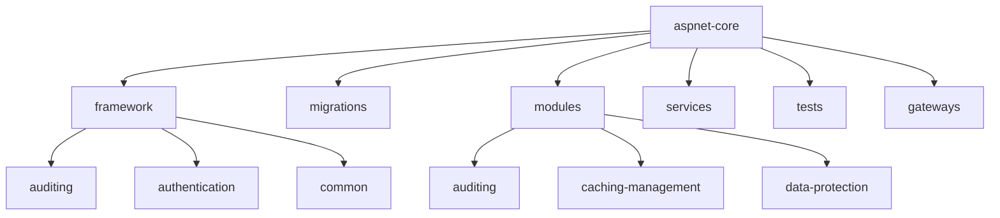
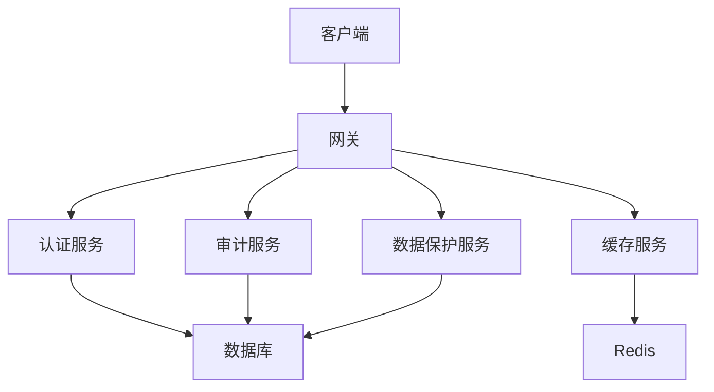
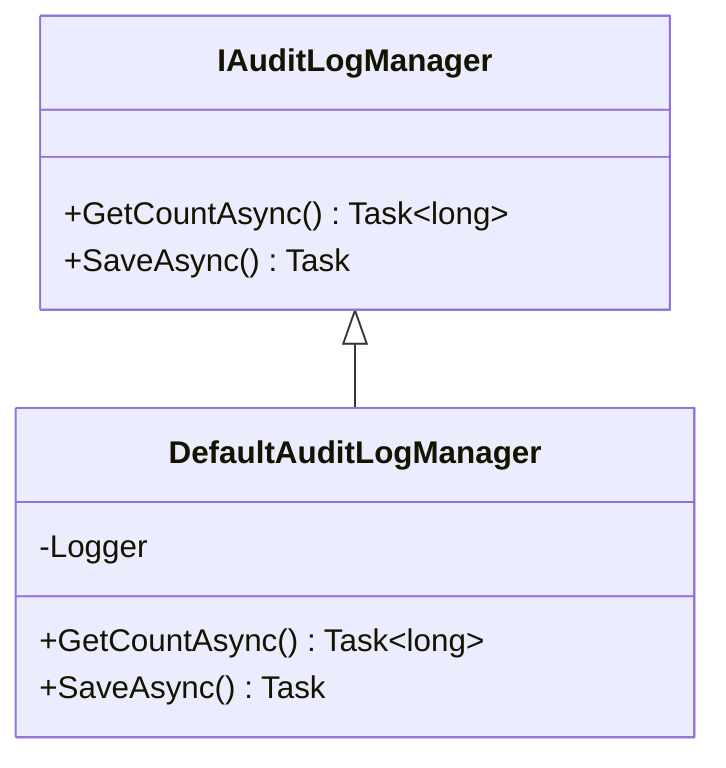
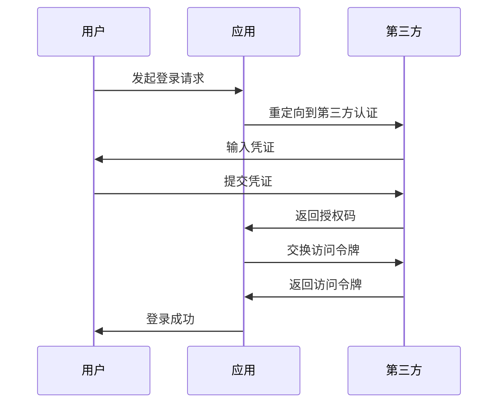
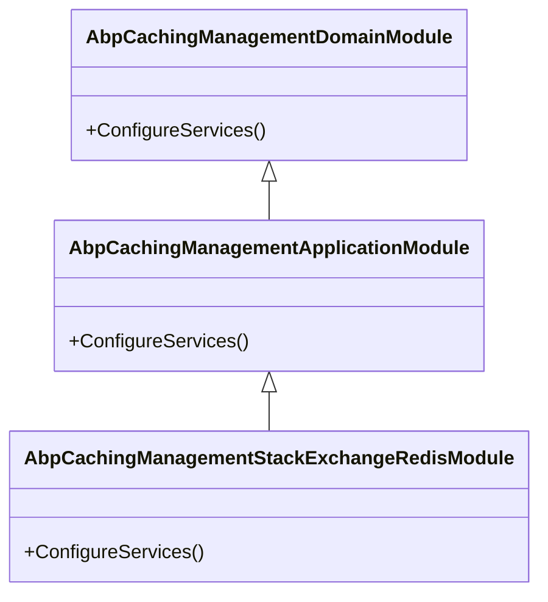
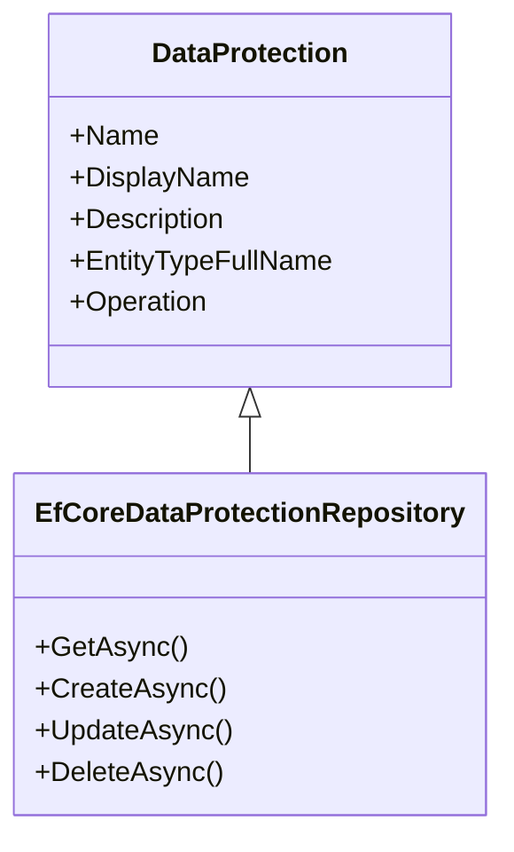

# 框架扩展

<cite>
**本文档中引用的文件**
- [MicroServiceApplicationsSingleModule.cs](file://aspnet-core/services/LY.MicroService.Applications.Single/MicroServiceApplicationsSingleModule.cs)
- [DefaultAuditLogManager.cs](file://aspnet-core/framework/auditing/LINGYUN.Abp.AuditLogging/LINGYUN/Abp/AuditLogging/DefaultAuditLogManager.cs)
- [README.md](file://aspnet-core/framework/auditing/LINGYUN.Abp.AuditLogging/README.md)
- [README.md](file://aspnet-core/framework/authentication/README.md)
- [AbpCachingManagementDomainModule.cs](file://aspnet-core/modules/caching-management/LINGYUN.Abp.CachingManagement.Domain/LINGYUN/Abp/CachingManagement/AbpCachingManagementDomainModule.cs)
- [DataProtectedResourceCache.cs](file://aspnet-core/framework/data-protection/LINGYUN.Abp.DataProtection/LINGYUN/Abp/DataProtection/Stores/DataProtectedResourceCache.cs)
- [README.md](file://aspnet-core/modules/data-protection/LINGYUN.Abp.DataProtectionManagement.EntityFrameworkCore/README.md)
- [ConfigureJavaScriptEngine.cs](file://aspnet-core/modules/elsa/LINGYUN.Abp.Elsa/LINGYUN/Abp/Elsa/Scripting/JavaScript/ConfigureJavaScriptEngine.cs)
</cite>

## 目录
1. [简介](#简介)
2. [项目结构](#项目结构)
3. [核心组件](#核心组件)
4. [架构概述](#架构概述)
5. [详细组件分析](#详细组件分析)
6. [依赖分析](#依赖分析)
7. [性能考虑](#性能考虑)
8. [故障排除指南](#故障排除指南)
9. [结论](#结论)

## 简介
本项目基于ABP框架构建，提供了一套完整的微服务解决方案。文档将深入分析框架扩展机制，包括审计日志、认证授权、分布式事务、缓存管理等核心功能的实现原理。通过详细的架构描述和配置说明，为开发者提供扩展框架功能的最佳实践指南。

## 项目结构
项目采用模块化设计，主要分为框架核心、迁移脚本、业务模块、服务层、测试和网关等部分。这种分层架构使得系统具有良好的可维护性和扩展性。

**图示来源**
- [MicroServiceApplicationsSingleModule.cs](file://aspnet-core/services/LY.MicroService.Applications.Single/MicroServiceApplicationsSingleModule.cs)

**章节来源**
- [MicroServiceApplicationsSingleModule.cs](file://aspnet-core/services/LY.MicroService.Applications.Single/MicroServiceApplicationsSingleModule.cs)

## 核心组件
项目的核心组件包括审计日志、认证授权、缓存管理和数据保护等模块。这些组件通过ABP框架的模块化机制进行组织和管理，实现了高内聚低耦合的设计原则。

**章节来源**
- [MicroServiceApplicationsSingleModule.cs](file://aspnet-core/services/LY.MicroService.Applications.Single/MicroServiceApplicationsSingleModule.cs)
- [DefaultAuditLogManager.cs](file://aspnet-core/framework/auditing/LINGYUN.Abp.AuditLogging/LINGYUN/Abp/AuditLogging/DefaultAuditLogManager.cs)

## 架构概述
系统采用微服务架构，通过ABP框架提供的模块化机制实现功能扩展。各模块之间通过依赖注入进行通信，确保了系统的松耦合和高可维护性。

**图示来源**
- [MicroServiceApplicationsSingleModule.cs](file://aspnet-core/services/LY.MicroService.Applications.Single/MicroServiceApplicationsSingleModule.cs)

## 详细组件分析

### 审计日志分析
审计日志模块提供了完整的日志记录功能，支持配置化启用和禁用，以及对特定类型的日志进行忽略。

**图示来源**
- [DefaultAuditLogManager.cs](file://aspnet-core/framework/auditing/LINGYUN.Abp.AuditLogging/LINGYUN/Abp/AuditLogging/DefaultAuditLogManager.cs)
- [README.md](file://aspnet-core/framework/auditing/LINGYUN.Abp.AuditLogging/README.md)

**章节来源**
- [DefaultAuditLogManager.cs](file://aspnet-core/framework/auditing/LINGYUN.Abp.AuditLogging/LINGYUN/Abp/AuditLogging/DefaultAuditLogManager.cs)
- [README.md](file://aspnet-core/framework/auditing/LINGYUN.Abp.AuditLogging/README.md)

### 认证授权分析
认证授权模块支持多种第三方登录方式，包括QQ和微信公众号登录，并与ABP身份系统深度集成。

**图示来源**
- [README.md](file://aspnet-core/framework/authentication/README.md)

**章节来源**
- [README.md](file://aspnet-core/framework/authentication/README.md)

### 缓存管理分析
缓存管理模块基于StackExchangeRedis实现，提供了分布式缓存功能，支持缓存的增删改查操作。

**图示来源**
- [AbpCachingManagementDomainModule.cs](file://aspnet-core/modules/caching-management/LINGYUN.Abp.CachingManagement.Domain/LINGYUN/Abp/CachingManagement/AbpCachingManagementDomainModule.cs)

**章节来源**
- [AbpCachingManagementDomainModule.cs](file://aspnet-core/modules/caching-management/LINGYUN.Abp.CachingManagement.Domain/LINGYUN/Abp/CachingManagement/AbpCachingManagementDomainModule.cs)

### 数据保护分析
数据保护模块提供了数据权限管理功能，通过EF Core实现数据访问，支持数据过滤和权限控制。

**图示来源**
- [README.md](file://aspnet-core/modules/data-protection/LINGYUN.Abp.DataProtectionManagement.EntityFrameworkCore/README.md)
- [DataProtectedResourceCache.cs](file://aspnet-core/framework/data-protection/LINGYUN.Abp.DataProtection/LINGYUN/Abp/DataProtection/Stores/DataProtectedResourceCache.cs)

**章节来源**
- [README.md](file://aspnet-core/modules/data-protection/LINGYUN.Abp.DataProtectionManagement.EntityFrameworkCore/README.md)
- [DataProtectedResourceCache.cs](file://aspnet-core/framework/data-protection/LINGYUN.Abp.DataProtection/LINGYUN/Abp/DataProtection/Stores/DataProtectedResourceCache.cs)

## 依赖分析
系统各模块之间通过明确的依赖关系进行组织，确保了模块间的松耦合。核心模块如审计日志、认证授权等作为基础服务被其他模块引用。

```mermaid
graph TD
A[MicroServiceApplicationsSingleModule] --> B[AbpAuditingApplicationModule]
A --> C[AbpAuditingHttpApiModule]
A --> D[AbpAuditLoggingEntityFrameworkCoreModule]
A --> E[AbpCachingManagementStackExchangeRedisModule]
A --> F[AbpCachingManagementApplicationModule]
A --> G[AbpCachingManagementHttpApiModule]
A --> H[AbpDataProtectionManagementApplicationModule]
A --> I[AbpDataProtectionManagementHttpApiModule]
A --> J[AbpDataProtectionManagementEntityFrameworkCoreModule]
```

**图示来源**
- [MicroServiceApplicationsSingleModule.cs](file://aspnet-core/services/LY.MicroService.Applications.Single/MicroServiceApplicationsSingleModule.cs)

**章节来源**
- [MicroServiceApplicationsSingleModule.cs](file://aspnet-core/services/LY.MicroService.Applications.Single/MicroServiceApplicationsSingleModule.cs)

## 性能考虑
系统在设计时充分考虑了性能因素，通过缓存、异步处理和分布式架构等手段提升系统性能。特别是缓存管理模块的引入，有效减少了数据库访问压力。

## 故障排除指南
当遇到问题时，建议首先检查相关模块的配置文件，确保配置项正确。其次查看日志文件，定位问题根源。对于复杂的分布式问题，可以利用ABP框架提供的调试工具进行分析。

**章节来源**
- [MicroServiceApplicationsSingleModule.cs](file://aspnet-core/services/LY.MicroService.Applications.Single/MicroServiceApplicationsSingleModule.cs)
- [DefaultAuditLogManager.cs](file://aspnet-core/framework/auditing/LINGYUN.Abp.AuditLogging/LINGYUN/Abp/AuditLogging/DefaultAuditLogManager.cs)

## 结论
通过对ABP框架扩展机制的深入分析，我们可以看到该框架提供了强大的模块化支持，使得开发者能够轻松地扩展和定制系统功能。无论是审计日志、认证授权还是缓存管理，都体现了良好的设计原则和实现方式。