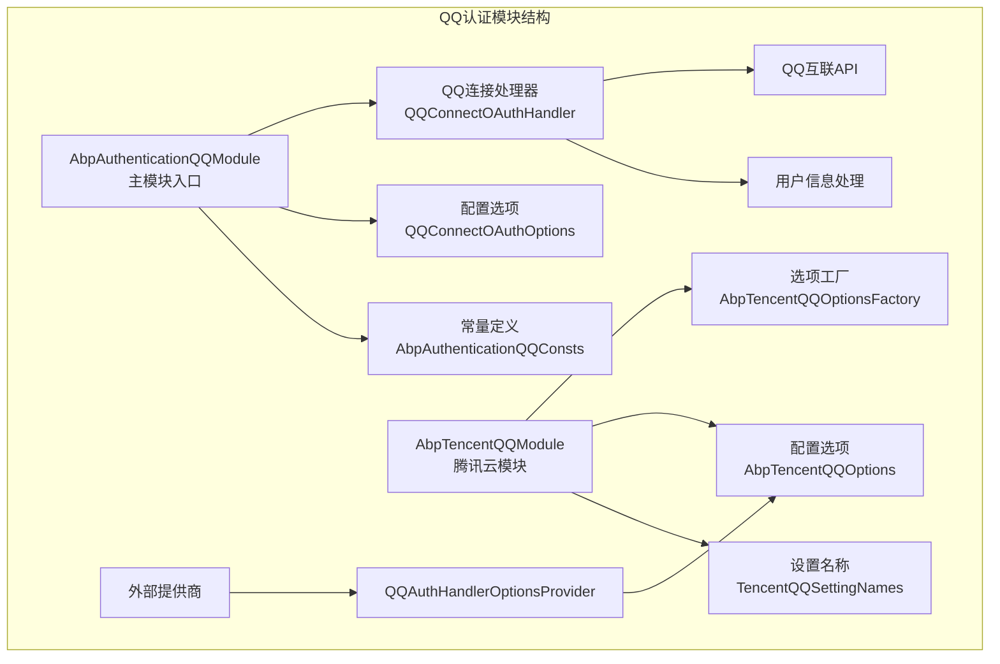
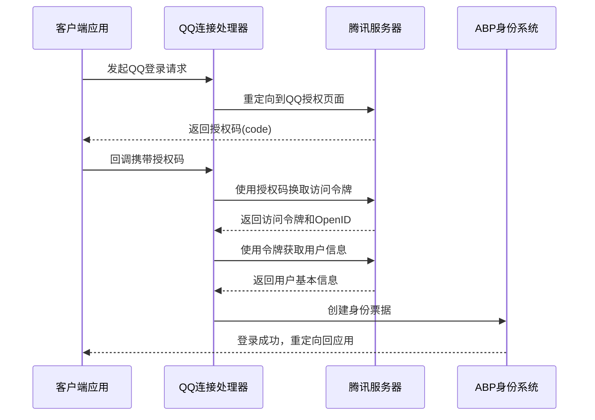
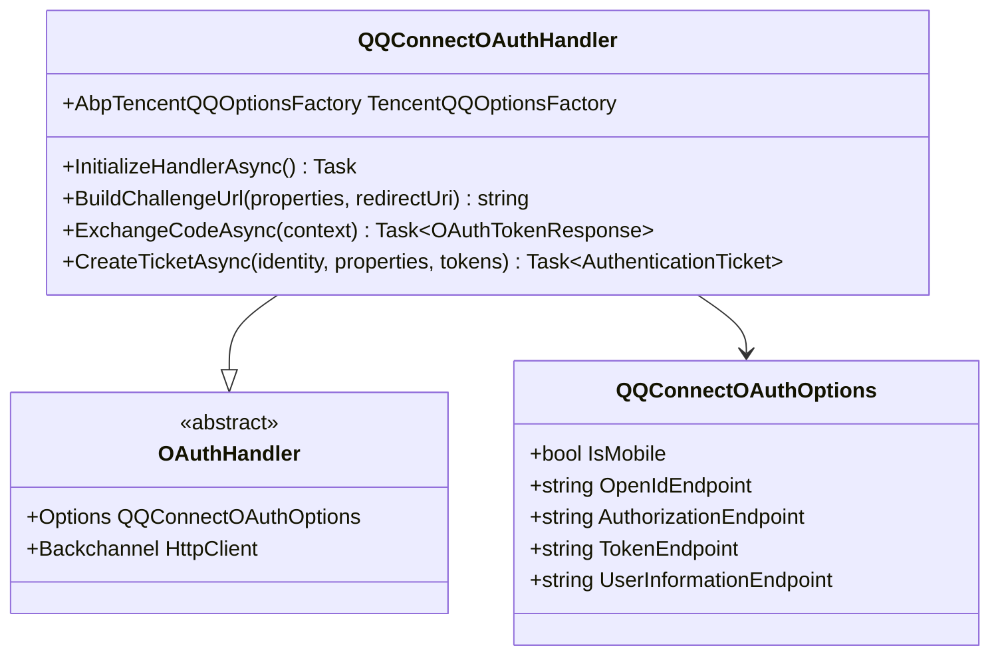
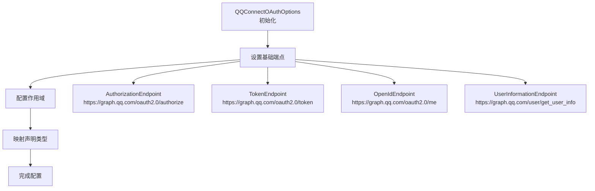
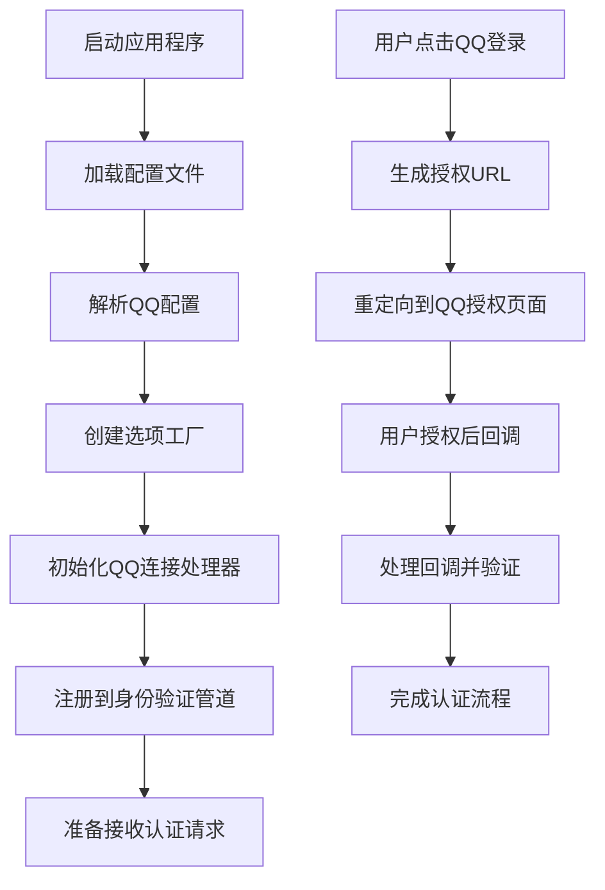
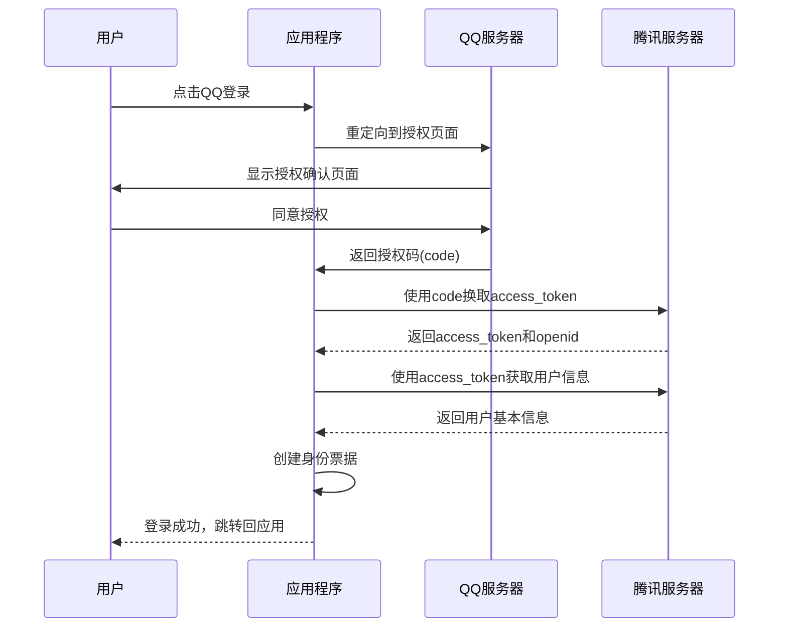

# QQ认证集成文档

<cite>
**本文档中引用的文件**
- [AbpAuthenticationQQModule.cs](file://aspnet-core/framework/authentication/LINGYUN.Abp.Authentication.QQ/LINGYUN/Abp/Authentication/QQ/AbpAuthenticationQQModule.cs)
- [AbpAuthenticationQQConsts.cs](file://aspnet-core/framework/authentication/LINGYUN.Abp.Authentication.QQ/LINGYUN/Abp/Authentication/QQ/AbpAuthenticationQQConsts.cs)
- [AbpQQClaimTypes.cs](file://aspnet-core/framework/authentication/LINGYUN.Abp.Authentication.QQ/LINGYUN/Abp/Authentication/QQ/AbpQQClaimTypes.cs)
- [QQConnectOAuthHandler.cs](file://aspnet-core/framework/authentication/LINGYUN.Abp.Authentication.QQ/Microsoft/AspNetCore/Authentication/QQ/QQConnectOAuthHandler.cs)
- [QQConnectOAuthOptions.cs](file://aspnet-core/framework/authentication/LINGYUN.Abp.Authentication.QQ/Microsoft/AspNetCore/Authentication/QQ/QQConnectOAuthOptions.cs)
- [QQAuthenticationExtensions.cs](file://aspnet-core/framework/authentication/LINGYUN.Abp.Authentication.QQ/Microsoft/AspNetCore/Authentication/QQAuthenticationExtensions.cs)
- [AbpTencentQQOptions.cs](file://aspnet-core/framework/cloud-tencent/LINGYUN.Abp.Tencent.QQ/LINGYUN/Abp/Tencent/QQ/AbpTencentQQOptions.cs)
- [AbpTencentQQOptionsFactory.cs](file://aspnet-core/framework/cloud-tencent/LINGYUN.Abp.Tencent.QQ/LINGYUN/Abp/Tencent/QQ/AbpTencentQQOptionsFactory.cs)
- [TencentQQSettingNames.cs](file://aspnet-core/framework/cloud-tencent/LINGYUN.Abp.Tencent.QQ/LINGYUN/Abp/Tencent/QQ/Settings/TencentQQSettingNames.cs)
- [AbpTencentQQModule.cs](file://aspnet-core/framework/cloud-tencent/LINGYUN.Abp.Tencent.QQ/LINGYUN/Abp/Tencent/QQ/AbpTencentQQModule.cs)
- [QQAuthHandlerOptionsProvider.cs](file://aspnet-core/modules/account/LINGYUN.Abp.Account.Web.OAuth/ExternalProviders/QQ/QQAuthHandlerOptionsProvider.cs)
- [README.md](file://aspnet-core/framework/authentication/LINGYUN.Abp.Authentication.QQ/README.md)
</cite>

## 目录
1. [简介](#简介)
2. [项目结构](#项目结构)
3. [核心组件](#核心组件)
4. [架构概览](#架构概览)
5. [详细组件分析](#详细组件分析)
6. [配置参数](#配置参数)
7. [认证流程](#认证流程)
8. [最佳实践](#最佳实践)
9. [故障排除](#故障排除)
10. [总结](#总结)

## 简介

QQ认证模块是ABP框架的一个扩展模块，专门用于集成QQ互联OAuth2.0认证功能。该模块提供了完整的QQ登录解决方案，包括用户身份验证、信息获取和与ABP身份系统的无缝集成。

### 主要特性

- **OAuth2.0认证协议**：完全遵循OAuth2.0标准
- **多平台支持**：支持移动端和PC端登录
- **用户信息获取**：自动获取QQ用户的基本信息（昵称、性别、头像等）
- **ABP集成**：与ABP框架的身份管理系统深度集成
- **灵活配置**：支持动态配置和运行时参数调整

## 项目结构

QQ认证模块采用分层架构设计，主要分为以下几个层次：



**图表来源**
- [AbpAuthenticationQQModule.cs](file://aspnet-core/framework/authentication/LINGYUN.Abp.Authentication.QQ/LINGYUN/Abp/Authentication/QQ/AbpAuthenticationQQModule.cs#L1-L16)
- [AbpTencentQQModule.cs](file://aspnet-core/framework/cloud-tencent/LINGYUN.Abp.Tencent.QQ/LINGYUN/Abp/Tencent/QQ/AbpTencentQQModule.cs#L1-L29)

**章节来源**
- [AbpAuthenticationQQModule.cs](file://aspnet-core/framework/authentication/LINGYUN.Abp.Authentication.QQ/LINGYUN/Abp/Authentication/QQ/AbpAuthenticationQQModule.cs#L1-L16)
- [AbpTencentQQModule.cs](file://aspnet-core/framework/cloud-tencent/LINGYUN.Abp.Tencent.QQ/LINGYUN/Abp/Tencent/QQ/AbpTencentQQModule.cs#L1-L29)

## 核心组件

### 1. 主模块入口

`AbpAuthenticationQQModule` 是整个QQ认证模块的入口点，负责注册和配置所有相关服务。

```csharp
[DependsOn(typeof(AbpTencentQQModule))]
public class AbpAuthenticationQQModule : AbpModule
{
    public override void ConfigureServices(ServiceConfigurationContext context)
    {
        context.Services
            .AddAuthentication()
            .AddQQConnect();
    }
}
```

### 2. 认证常量定义

`AbpAuthenticationQQConsts` 定义了QQ认证的核心常量：

```csharp
public static class AbpAuthenticationQQConsts
{
    public static string AuthenticationScheme { get; set; } = "QQ Connect";
    public static string DisplayName { get; set; } = "QQ Connect";
    public static string CallbackPath { get; set; } = "/signin-qq";
}
```

### 3. 腾讯云配置选项

`AbpTencentQQOptions` 封装了QQ互联所需的配置参数：

```csharp
public class AbpTencentQQOptions
{
    public string AppId { get; set; }          // QQ互联应用ID
    public string AppKey { get; set; }         // QQ互联应用密钥
    public bool IsMobile { get; set; }         // 是否移动端样式
}
```

**章节来源**
- [AbpAuthenticationQQModule.cs](file://aspnet-core/framework/authentication/LINGYUN.Abp.Authentication.QQ/LINGYUN/Abp/Authentication/QQ/AbpAuthenticationQQModule.cs#L1-L16)
- [AbpAuthenticationQQConsts.cs](file://aspnet-core/framework/authentication/LINGYUN.Abp.Authentication.QQ/LINGYUN/Abp/Authentication/QQ/AbpAuthenticationQQConsts.cs#L1-L7)
- [AbpTencentQQOptions.cs](file://aspnet-core/framework/cloud-tencent/LINGYUN.Abp.Tencent.QQ/LINGYUN/Abp/Tencent/QQ/AbpTencentQQOptions.cs#L1-L22)

## 架构概览

QQ认证模块采用分层架构设计，确保了模块的可维护性和扩展性：



**图表来源**
- [QQConnectOAuthHandler.cs](file://aspnet-core/framework/authentication/LINGYUN.Abp.Authentication.QQ/Microsoft/AspNetCore/Authentication/QQ/QQConnectOAuthHandler.cs#L42-L174)

## 详细组件分析

### QQ连接处理器 (QQConnectOAuthHandler)

这是QQ认证的核心处理器，继承自ASP.NET Core的OAuthHandler基类：



**图表来源**
- [QQConnectOAuthHandler.cs](file://aspnet-core/framework/authentication/LINGYUN.Abp.Authentication.QQ/Microsoft/AspNetCore/Authentication/QQ/QQConnectOAuthHandler.cs#L17-L41)
- [QQConnectOAuthOptions.cs](file://aspnet-core/framework/authentication/LINGYUN.Abp.Authentication.QQ/Microsoft/AspNetCore/Authentication/QQ/QQConnectOAuthOptions.cs#L8-L45)

#### 关键方法分析

1. **InitializeHandlerAsync()** - 初始化处理器，从配置工厂获取QQ配置
2. **BuildChallengeUrl()** - 构建授权URL，支持移动端样式
3. **ExchangeCodeAsync()** - 通过授权码换取访问令牌
4. **CreateTicketAsync()** - 创建身份票据并添加用户信息声明

### QQ连接选项 (QQConnectOAuthOptions)



**图表来源**
- [QQConnectOAuthOptions.cs](file://aspnet-core/framework/authentication/LINGYUN.Abp.Authentication.QQ/Microsoft/AspNetCore/Authentication/QQ/QQConnectOAuthOptions.cs#L17-L45)

### 身份声明类型

QQ认证模块定义了特定的身份声明类型：

```csharp
public class AbpQQClaimTypes
{
    public static string OpenId { get; set; } = "qq-openid";
    public static string NickName { get; set; } = "nickname";
    public static string Gender { get; set; } = "gender";
    public static string AvatarUrl { get; set; } = "avatar";
}
```

这些声明类型确保了QQ用户信息能够正确地映射到ABP的身份系统中。

**章节来源**
- [QQConnectOAuthHandler.cs](file://aspnet-core/framework/authentication/LINGYUN.Abp.Authentication.QQ/Microsoft/AspNetCore/Authentication/QQ/QQConnectOAuthHandler.cs#L17-L174)
- [QQConnectOAuthOptions.cs](file://aspnet-core/framework/authentication/LINGYUN.Abp.Authentication.QQ/Microsoft/AspNetCore/Authentication/QQ/QQConnectOAuthOptions.cs#L8-L45)
- [AbpQQClaimTypes.cs](file://aspnet-core/framework/authentication/LINGYUN.Abp.Authentication.QQ/LINGYUN/Abp/Authentication/QQ/AbpQQClaimTypes.cs#L1-L31)

## 配置参数

### 应用程序配置

在appsettings.json中配置QQ认证参数：

```json
{
  "Authentication": {
    "QQ": {
      "AppId": "你的QQ互联AppId",
      "AppKey": "你的QQ互联AppKey",
      "IsMobile": false,
      "ClaimsIssuer": "connect.qq.com",
      "CallbackPath": "/signin-qq",
      "Scope": ["get_user_info"]
    }
  }
}
```

### 设置名称规范

QQ认证使用以下设置名称：

```csharp
public static class TencentQQSettingNames
{
    public const string AppId = "TenantCloud.QQConnect.AppId";
    public const string AppKey = "TenantCloud.QQConnect.AppKey";
    public const string IsMobile = "TenantCloud.QQConnect.IsMobile";
}
```

### 配置流程



**章节来源**
- [TencentQQSettingNames.cs](file://aspnet-core/framework/cloud-tencent/LINGYUN.Abp.Tencent.QQ/LINGYUN/Abp/Tencent/QQ/Settings/TencentQQSettingNames.cs#L1-L16)
- [README.md](file://aspnet-core/framework/authentication/LINGYUN.Abp.Authentication.QQ/README.md#L15-L30)

## 认证流程

### OAuth2.0认证流程详解

QQ认证遵循标准的OAuth2.0授权码流程：



**图表来源**
- [QQConnectOAuthHandler.cs](file://aspnet-core/framework/authentication/LINGYUN.Abp.Authentication.QQ/Microsoft/AspNetCore/Authentication/QQ/QQConnectOAuthHandler.cs#L42-L174)

### 关键步骤说明

1. **授权请求阶段**
   - 构建授权URL，包含客户端ID、回调路径和作用域
   - 支持移动端样式参数

2. **令牌交换阶段**
   - 使用授权码向QQ服务器请求访问令牌
   - 验证响应状态和错误码

3. **用户信息获取阶段**
   - 使用访问令牌获取用户OpenID
   - 请求用户基本信息（昵称、性别、头像）

4. **身份票据创建阶段**
   - 将用户信息转换为身份声明
   - 创建符合ABP标准的身份票据

**章节来源**
- [QQConnectOAuthHandler.cs](file://aspnet-core/framework/authentication/LINGYUN.Abp.Authentication.QQ/Microsoft/AspNetCore/Authentication/QQ/QQConnectOAuthHandler.cs#L42-L174)

## 最佳实践

### 1. 模块引用配置

在您的项目模块中添加依赖：

```csharp
[DependsOn(typeof(AbpAuthenticationQQModule))]
public class YourProjectModule : AbpModule
{
    public override void ConfigureServices(ServiceConfigurationContext context)
    {
        // 其他配置...
        
        // 添加QQ登录支持
        context.Services.AddAuthentication()
            .AddQQConnect();
    }
}
```

### 2. QQ互联平台配置

在QQ互联管理中心申请应用：

1. **申请应用**：在QQ互联管理中心申请新的应用
2. **获取凭证**：记录AppId和AppKey
3. **配置回调**：设置正确的回调URL
4. **权限申请**：根据需要申请相应的用户权限

### 3. 安全考虑

- **HTTPS要求**：确保所有通信都通过HTTPS加密
- **回调验证**：严格验证回调参数的完整性
- **令牌安全**：妥善保管访问令牌和刷新令牌
- **用户数据保护**：遵循GDPR等隐私法规

### 4. 错误处理

```csharp
// 在应用程序中添加错误处理中间件
app.Use(async (context, next) =>
{
    try
    {
        await next();
    }
    catch (Exception ex)
    {
        // 记录QQ认证相关的异常
        if (ex.Message.Contains("QQ"))
        {
            // 处理QQ认证错误
        }
        throw;
    }
});
```

### 5. 性能优化

- **缓存策略**：合理缓存用户信息减少API调用
- **并发控制**：限制同时进行的认证请求数量
- **超时设置**：设置合理的HTTP请求超时时间

## 故障排除

### 常见问题及解决方案

#### 1. 授权失败

**症状**：用户无法完成QQ授权流程
**可能原因**：
- AppId/AppKey配置错误
- 回调URL不匹配
- 应用未获得相应权限

**解决方法**：
```csharp
// 检查配置
var appId = Configuration["Authentication:QQ:AppId"];
var appKey = Configuration["Authentication:QQ:AppKey"];

// 验证回调URL
var callbackPath = Configuration["Authentication:QQ:CallbackPath"] ?? "/signin-qq";
```

#### 2. 用户信息获取失败

**症状**：虽然认证成功，但无法获取用户信息
**可能原因**：
- 访问令牌过期
- 用户拒绝了某些权限
- QQ服务器异常

**解决方法**：
```csharp
// 添加日志记录
Logger.LogError("Failed to get user info: {ErrorCode} - {ErrorMessage}", 
    errorCode, errorMessage);
```

#### 3. 移动端适配问题

**症状**：移动端显示效果不佳
**解决方法**：
```json
{
  "Authentication": {
    "QQ": {
      "IsMobile": true
    }
  }
}
```

### 调试技巧

1. **启用详细日志**：在appsettings.json中启用详细日志记录
2. **网络抓包**：使用工具检查HTTP请求和响应
3. **断点调试**：在关键方法中设置断点
4. **单元测试**：编写针对QQ认证的单元测试

**章节来源**
- [QQConnectOAuthHandler.cs](file://aspnet-core/framework/authentication/LINGYUN.Abp.Authentication.QQ/Microsoft/AspNetCore/Authentication/QQ/QQConnectOAuthHandler.cs#L50-L174)
- [README.md](file://aspnet-core/framework/authentication/LINGYUN.Abp.Authentication.QQ/README.md#L31-L65)

## 总结

QQ认证模块是一个功能完善、设计精良的OAuth2.0认证解决方案。它不仅提供了完整的QQ登录功能，还与ABP框架的其他组件无缝集成，为开发者提供了便捷的开发体验。

### 主要优势

1. **标准化实现**：完全遵循OAuth2.0标准
2. **模块化设计**：清晰的分层架构便于维护
3. **灵活配置**：支持多种配置方式和运行时调整
4. **安全可靠**：内置错误处理和安全机制
5. **易于集成**：简单的API接口和丰富的文档

### 适用场景

- 需要集成QQ登录功能的企业应用
- 面向中国用户的Web应用程序
- 需要多渠道用户认证的系统
- 基于ABP框架构建的应用项目

通过本文档的详细介绍，开发者应该能够充分理解和掌握QQ认证模块的使用方法，并能够在实际项目中成功集成QQ登录功能。