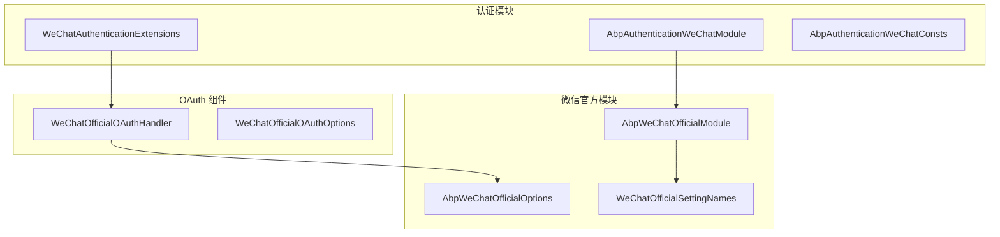
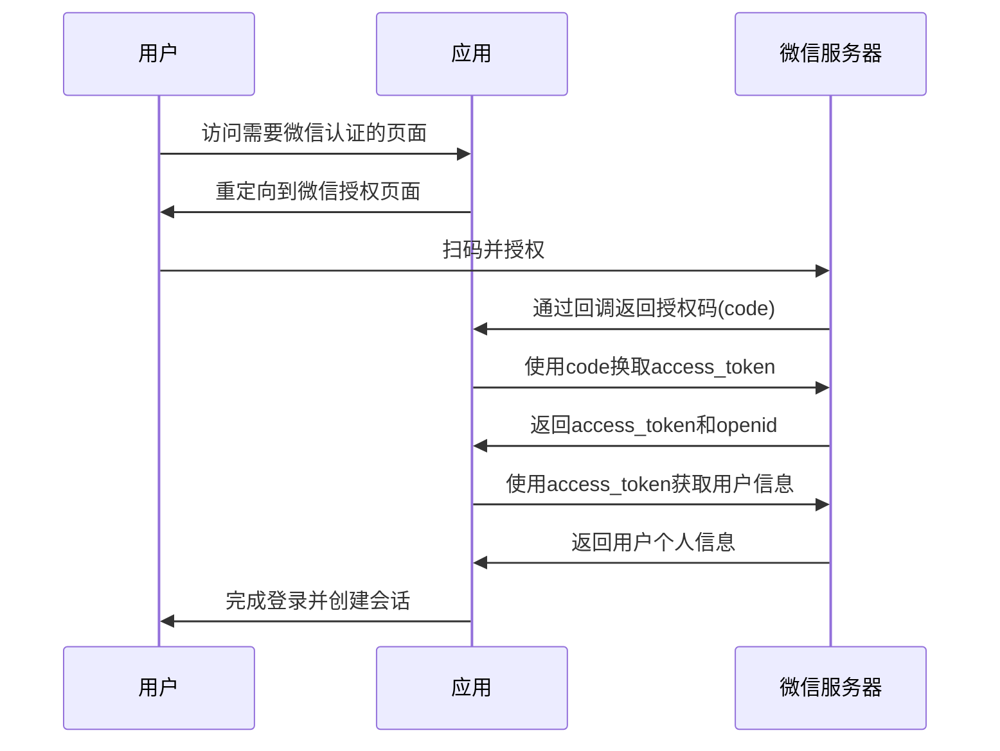
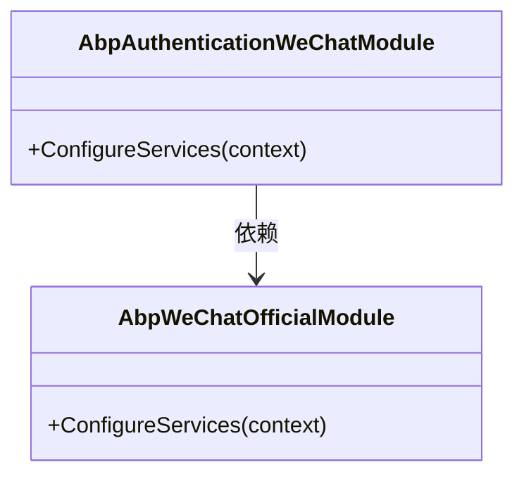
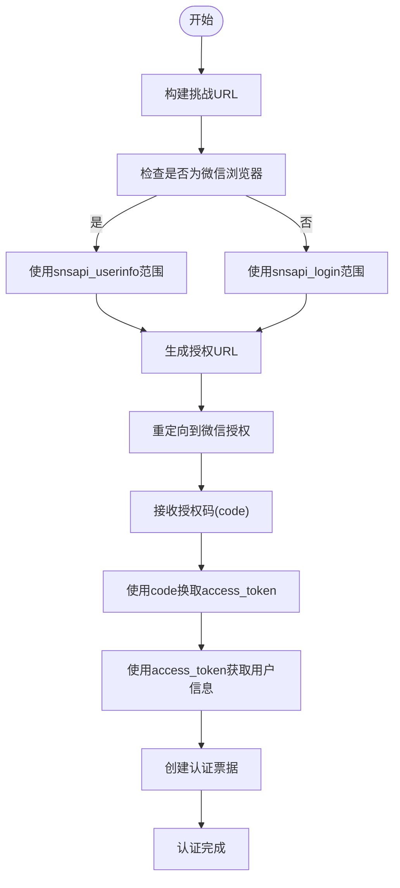
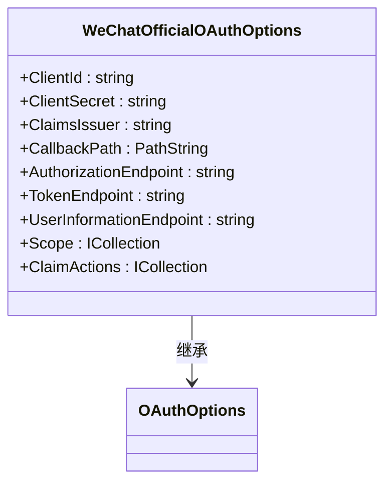
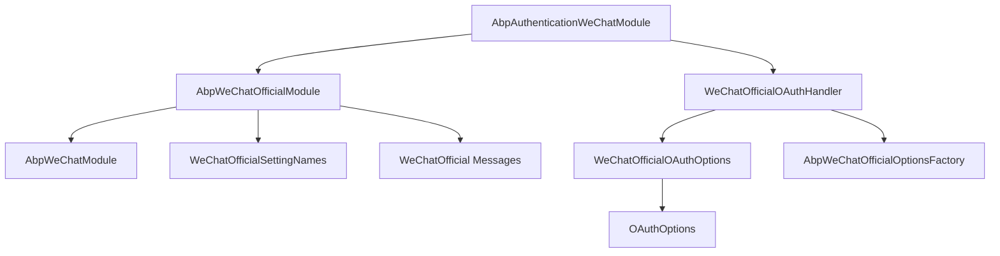

# 微信认证

<cite>
**本文档中引用的文件**  
- [AbpAuthenticationWeChatModule.cs](file://aspnet-core/framework/authentication/LINGYUN.Abp.Authentication.WeChat/LINGYUN/Abp/Authentication/WeChat/AbpAuthenticationWeChatModule.cs)
- [WeChatAuthenticationExtensions.cs](file://aspnet-core/framework/authentication/LINGYUN.Abp.Authentication.WeChat/Microsoft/AspNetCore/Authentication/WeChatAuthenticationExtensions.cs)
- [AbpAuthenticationWeChatConsts.cs](file://aspnet-core/framework/authentication/LINGYUN.Abp.Authentication.WeChat/LINGYUN/Abp/Authentication/WeChat/AbpAuthenticationWeChatConsts.cs)
- [WeChatOfficialOAuthOptions.cs](file://aspnet-core/framework/authentication/LINGYUN.Abp.Authentication.WeChat/Microsoft/AspNetCore/Authentication/WeChat/Official/WeChatOfficialOAuthOptions.cs)
- [WeChatOfficialOAuthHandler.cs](file://aspnet-core/framework/authentication/LINGYUN.Abp.Authentication.WeChat/Microsoft/AspNetCore/Authentication/WeChat/Official/WeChatOfficialOAuthHandler.cs)
- [AbpWeChatGlobalConsts.cs](file://aspnet-core/framework/wechat/LINGYUN.Abp.WeChat/LINGYUN/Abp/WeChat/AbpWeChatGlobalConsts.cs)
- [WeChatOfficialSettingNames.cs](file://aspnet-core/framework/wechat/LINGYUN.Abp.WeChat.Official/LINGYUN/Abp/WeChat/Official/Settings/WeChatOfficialSettingNames.cs)
- [AbpWeChatOfficialModule.cs](file://aspnet-core/framework/wechat/LINGYUN.Abp.WeChat.Official/LINGYUN/Abp/WeChat/Official/AbpWeChatOfficialModule.cs)
</cite>

## 目录
1. [简介](#简介)
2. [项目结构](#项目结构)
3. [核心组件](#核心组件)
4. [架构概述](#架构概述)
5. [详细组件分析](#详细组件分析)
6. [依赖分析](#依赖分析)
7. [性能考虑](#性能考虑)
8. [故障排除指南](#故障排除指南)
9. [结论](#结论)

## 简介
本文件详细阐述了在 ABP 框架中集成微信认证的实现机制。文档涵盖微信 OAuth2.0 认证流程、API 调用、用户信息获取和会话管理等关键方面。重点介绍微信认证扩展的技术架构、配置参数（如 AppId、AppSecret）及其使用场景。为开发者提供在应用中集成微信登录功能的最佳实践指南，包括如何配置微信开放平台应用、处理授权回调以及确保认证过程的安全性。

## 项目结构
微信认证功能在项目中通过模块化方式实现，主要分布在 `aspnet-core/framework/authentication` 和 `aspnet-core/framework/wechat` 目录下。认证模块依赖于微信官方模块，形成清晰的分层架构。

**Diagram sources**
- [AbpAuthenticationWeChatModule.cs](file://aspnet-core/framework/authentication/LINGYUN.Abp.Authentication.WeChat/LINGYUN/Abp/Authentication/WeChat/AbpAuthenticationWeChatModule.cs)
- [AbpWeChatOfficialModule.cs](file://aspnet-core/framework/wechat/LINGYUN.Abp.WeChat.Official/LINGYUN/Abp/WeChat/Official/AbpWeChatOfficialModule.cs)
- [WeChatOfficialSettingNames.cs](file://aspnet-core/framework/wechat/LINGYUN.Abp.WeChat.Official/LINGYUN/Abp/WeChat/Official/Settings/WeChatOfficialSettingNames.cs)

**Section sources**
- [AbpAuthenticationWeChatModule.cs](file://aspnet-core/framework/authentication/LINGYUN.Abp.Authentication.WeChat/LINGYUN/Abp/Authentication/WeChat/AbpAuthenticationWeChatModule.cs)
- [AbpWeChatOfficialModule.cs](file://aspnet-core/framework/wechat/LINGYUN.Abp.WeChat.Official/LINGYUN/Abp/WeChat/Official/AbpWeChatOfficialModule.cs)

## 核心组件
微信认证的核心组件包括认证模块、OAuth 处理器、选项配置和常量定义。这些组件协同工作，实现完整的微信 OAuth2.0 认证流程。

**Section sources**
- [WeChatAuthenticationExtensions.cs](file://aspnet-core/framework/authentication/LINGYUN.Abp.Authentication.WeChat/Microsoft/AspNetCore/Authentication/WeChatAuthenticationExtensions.cs)
- [WeChatOfficialOAuthHandler.cs](file://aspnet-core/framework/authentication/LINGYUN.Abp.Authentication.WeChat/Microsoft/AspNetCore/Authentication/WeChat/Official/WeChatOfficialOAuthHandler.cs)
- [AbpAuthenticationWeChatConsts.cs](file://aspnet-core/framework/authentication/LINGYUN.Abp.Authentication.WeChat/LINGYUN/Abp/Authentication/WeChat/AbpAuthenticationWeChatConsts.cs)

## 架构概述
微信认证采用模块化架构，通过 ABP 框架的依赖注入和模块系统实现功能扩展。认证流程遵循 OAuth2.0 标准，分为三个主要步骤：授权、令牌交换和用户信息获取。

**Diagram sources**
- [WeChatOfficialOAuthHandler.cs](file://aspnet-core/framework/authentication/LINGYUN.Abp.Authentication.WeChat/Microsoft/AspNetCore/Authentication/WeChat/Official/WeChatOfficialOAuthHandler.cs)
- [AbpAuthenticationWeChatConsts.cs](file://aspnet-core/framework/authentication/LINGYUN.Abp.Authentication.WeChat/LINGYUN/Abp/Authentication/WeChat/AbpAuthenticationWeChatConsts.cs)

## 详细组件分析

### 认证模块分析
`AbpAuthenticationWeChatModule` 是微信认证的主模块，通过依赖 `AbpWeChatOfficialModule` 实现功能扩展。模块在 `ConfigureServices` 方法中注册认证服务。

**Diagram sources**
- [AbpAuthenticationWeChatModule.cs](file://aspnet-core/framework/authentication/LINGYUN.Abp.Authentication.WeChat/LINGYUN/Abp/Authentication/WeChat/AbpAuthenticationWeChatModule.cs)
- [AbpWeChatOfficialModule.cs](file://aspnet-core/framework/wechat/LINGYUN.Abp.WeChat.Official/LINGYUN/Abp/WeChat/Official/AbpWeChatOfficialModule.cs)

**Section sources**
- [AbpAuthenticationWeChatModule.cs](file://aspnet-core/framework/authentication/LINGYUN.Abp.Authentication.WeChat/LINGYUN/Abp/Authentication/WeChat/AbpAuthenticationWeChatModule.cs)

### OAuth 处理器分析
`WeChatOfficialOAuthHandler` 是微信 OAuth2.0 认证的核心处理器，实现了完整的认证流程。

#### 认证流程分析

**Diagram sources**
- [WeChatOfficialOAuthHandler.cs](file://aspnet-core/framework/authentication/LINGYUN.Abp.Authentication.WeChat/Microsoft/AspNetCore/Authentication/WeChat/Official/WeChatOfficialOAuthHandler.cs)

**Section sources**
- [WeChatOfficialOAuthHandler.cs](file://aspnet-core/framework/authentication/LINGYUN.Abp.Authentication.WeChat/Microsoft/AspNetCore/Authentication/WeChat/Official/WeChatOfficialOAuthHandler.cs)

### 配置选项分析
微信认证的配置选项通过 `WeChatOfficialOAuthOptions` 类定义，包含认证所需的各种参数和默认值。

**Diagram sources**
- [WeChatOfficialOAuthOptions.cs](file://aspnet-core/framework/authentication/LINGYUN.Abp.Authentication.WeChat/Microsoft/AspNetCore/Authentication/WeChat/Official/WeChatOfficialOAuthOptions.cs)

**Section sources**
- [WeChatOfficialOAuthOptions.cs](file://aspnet-core/framework/authentication/LINGYUN.Abp.Authentication.WeChat/Microsoft/AspNetCore/Authentication/WeChat/Official/WeChatOfficialOAuthOptions.cs)

## 依赖分析
微信认证模块依赖于多个核心组件和外部服务，形成清晰的依赖关系。

**Diagram sources**
- [AbpAuthenticationWeChatModule.cs](file://aspnet-core/framework/authentication/LINGYUN.Abp.Authentication.WeChat/LINGYUN/Abp/Authentication/WeChat/AbpAuthenticationWeChatModule.cs)
- [AbpWeChatOfficialModule.cs](file://aspnet-core/framework/wechat/LINGYUN.Abp.WeChat.Official/LINGYUN/Abp/WeChat/Official/AbpWeChatOfficialModule.cs)
- [WeChatOfficialOAuthHandler.cs](file://aspnet-core/framework/authentication/LINGYUN.Abp.Authentication.WeChat/Microsoft/AspNetCore/Authentication/WeChat/Official/WeChatOfficialOAuthHandler.cs)

**Section sources**
- [AbpAuthenticationWeChatModule.cs](file://aspnet-core/framework/authentication/LINGYUN.Abp.Authentication.WeChat/LINGYUN/Abp/Authentication/WeChat/AbpAuthenticationWeChatModule.cs)
- [AbpWeChatOfficialModule.cs](file://aspnet-core/framework/wechat/LINGYUN.Abp.WeChat.Official/LINGYUN/Abp/WeChat/Official/AbpWeChatOfficialModule.cs)

## 性能考虑
微信认证的性能主要受网络延迟和 API 调用次数影响。建议实现适当的缓存策略来优化性能。

- **access_token 缓存**：access_token 有有效期，应缓存以避免频繁调用
- **用户信息缓存**：用户基本信息可以缓存一段时间
- **HTTP 客户端复用**：使用 HttpClientFactory 复用 HTTP 客户端实例
- **异步处理**：所有外部 API 调用都应使用异步方法

## 故障排除指南
### 常见问题及解决方案

| 问题 | 可能原因 | 解决方案 |
|------|---------|---------|
| 授权失败 | AppId 或 AppSecret 配置错误 | 检查配置中的 AppId 和 AppSecret 是否正确 |
| 回调地址不匹配 | 回调 URL 未在微信开放平台配置 | 在微信开放平台正确配置回调地址 |
| 用户信息获取失败 | access_token 过期 | 重新获取 access_token |
| 跨域问题 | 未正确配置 CORS | 在应用中正确配置 CORS 策略 |
| CSRF 验证失败 | CorrelationId 验证失败 | 检查认证属性和状态管理 |

**Section sources**
- [WeChatOfficialOAuthHandler.cs](file://aspnet-core/framework/authentication/LINGYUN.Abp.Authentication.WeChat/Microsoft/AspNetCore/Authentication/WeChat/Official/WeChatOfficialOAuthHandler.cs)
- [WeChatOfficialOAuthOptions.cs](file://aspnet-core/framework/authentication/LINGYUN.Abp.Authentication.WeChat/Microsoft/AspNetCore/Authentication/WeChat/Official/WeChatOfficialOAuthOptions.cs)

## 结论
微信认证模块通过标准化的 OAuth2.0 流程实现了安全可靠的用户身份验证。模块设计遵循 ABP 框架的最佳实践，具有良好的扩展性和可维护性。开发者可以通过简单的配置快速集成微信登录功能，同时确保认证过程的安全性。