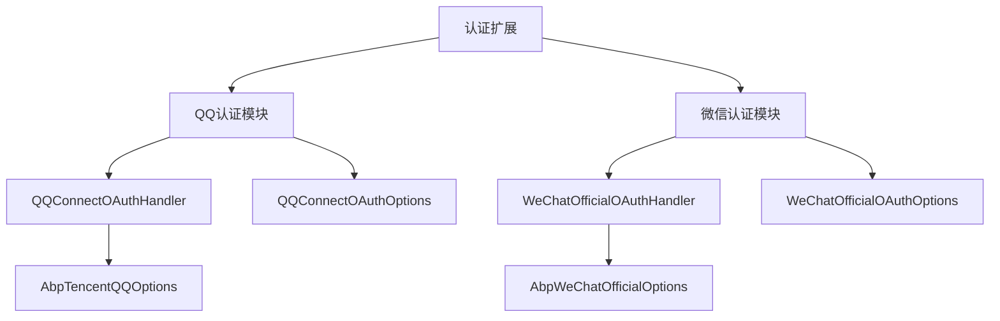
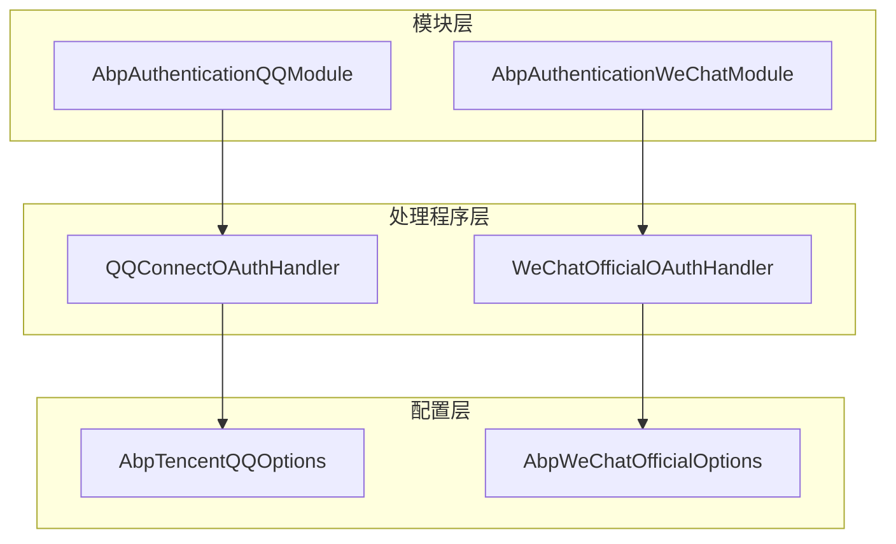
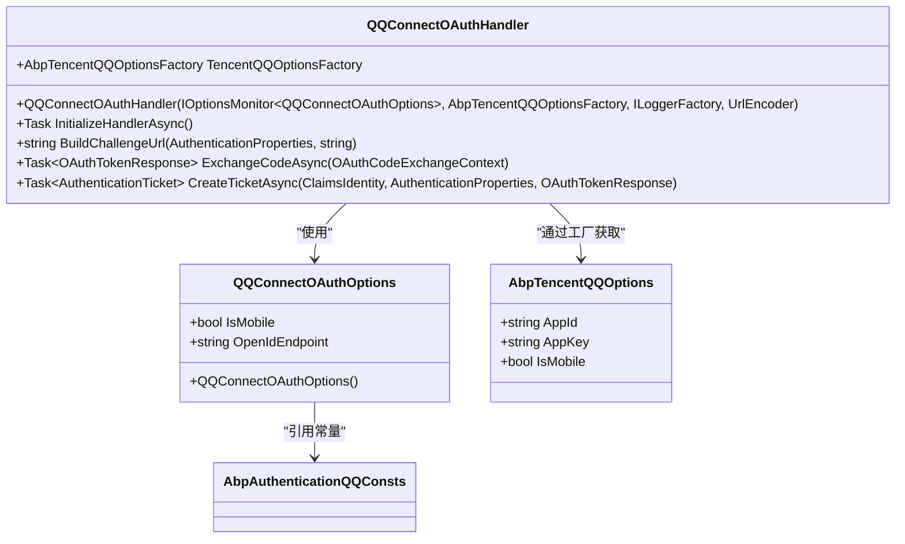
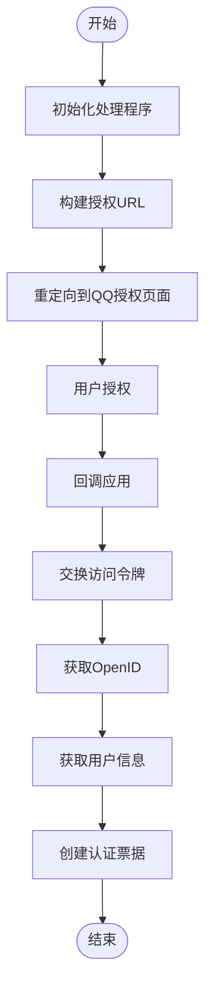
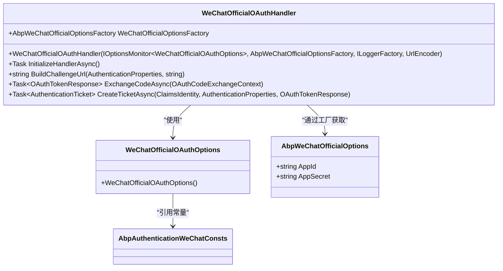
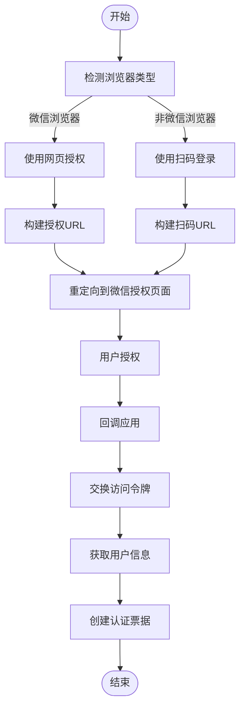
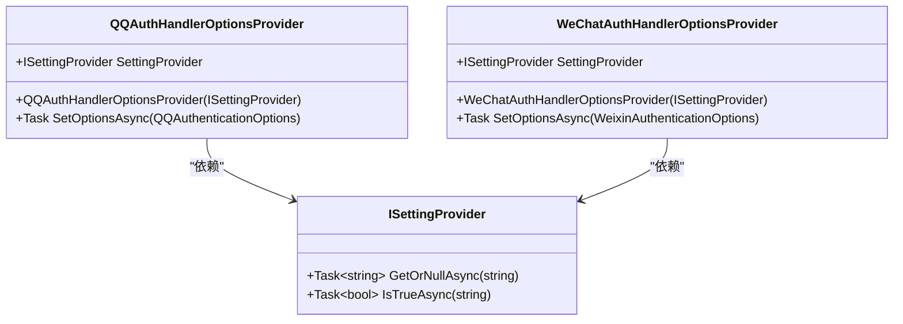
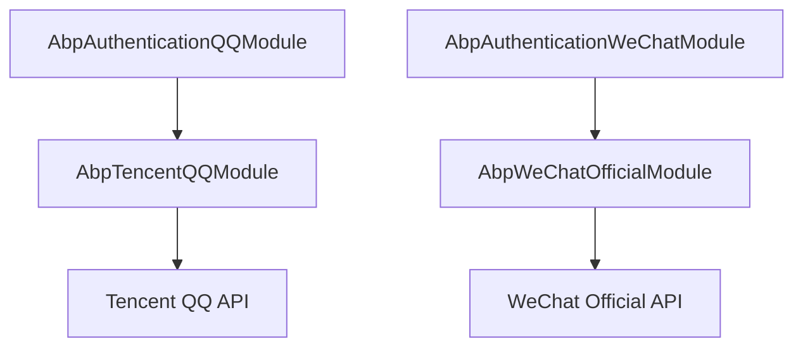

# 认证扩展

<cite>
**本文档引用的文件**
- [AbpAuthenticationQQModule.cs](file://aspnet-core/framework/authentication/LINGYUN.Abp.Authentication.QQ/LINGYUN/Abp/Authentication/QQ/AbpAuthenticationQQModule.cs)
- [QQConnectOAuthHandler.cs](file://aspnet-core/framework/authentication/LINGYUN.Abp.Authentication.QQ/Microsoft/AspNetCore/Authentication/QQ/QQConnectOAuthHandler.cs)
- [QQConnectOAuthOptions.cs](file://aspnet-core/framework/authentication/LINGYUN.Abp.Authentication.QQ/Microsoft/AspNetCore/Authentication/QQ/QQConnectOAuthOptions.cs)
- [AbpAuthenticationQQConsts.cs](file://aspnet-core/framework/authentication/LINGYUN.Abp.Authentication.QQ/LINGYUN/Abp/Authentication/QQ/AbpAuthenticationQQConsts.cs)
- [AbpTencentQQOptions.cs](file://aspnet-core/framework/cloud-tencent/LINGYUN.Abp.Tencent.QQ/LINGYUN/Abp/Tencent/QQ/AbpTencentQQOptions.cs)
- [AbpAuthenticationWeChatModule.cs](file://aspnet-core/framework/authentication/LINGYUN.Abp.Authentication.WeChat/LINGYUN/Abp/Authentication/WeChat/AbpAuthenticationWeChatModule.cs)
- [WeChatOfficialOAuthHandler.cs](file://aspnet-core/framework/authentication/LINGYUN.Abp.Authentication.WeChat/Microsoft/AspNetCore/Authentication/WeChat/Official/WeChatOfficialOAuthHandler.cs)
- [WeChatOfficialOAuthOptions.cs](file://aspnet-core/framework/authentication/LINGYUN.Abp.Authentication.WeChat/Microsoft/AspNetCore/Authentication/WeChat/Official/WeChatOfficialOAuthOptions.cs)
- [AbpAuthenticationWeChatConsts.cs](file://aspnet-core/framework/authentication/LINGYUN.Abp.Authentication.WeChat/LINGYUN/Abp/Authentication/WeChat/AbpAuthenticationWeChatConsts.cs)
- [AbpWeChatGlobalConsts.cs](file://aspnet-core/framework/wechat/LINGYUN.Abp.WeChat/LINGYUN/Abp/WeChat/AbpWeChatGlobalConsts.cs)
- [QQAuthHandlerOptionsProvider.cs](file://aspnet-core/modules/account/LINGYUN.Abp.Account.Web.OAuth/ExternalProviders/QQ/QQAuthHandlerOptionsProvider.cs)
- [WeChatAuthHandlerOptionsProvider.cs](file://aspnet-core/modules/account/LINGYUN.Abp.Account.Web.OAuth/ExternalProviders/WeChat/WeChatAuthHandlerOptionsProvider.cs)
</cite>

## 目录
1. [简介](#简介)
2. [项目结构](#项目结构)
3. [核心组件](#核心组件)
4. [架构概述](#架构概述)
5. [详细组件分析](#详细组件分析)
6. [依赖分析](#依赖分析)
7. [性能考虑](#性能考虑)
8. [故障排除指南](#故障排除指南)
9. [结论](#结论)

## 简介
本文档详细介绍了ABP框架中QQ和微信认证扩展的实现机制。文档深入探讨了OAuth2.0集成、身份验证流程、用户信息获取和令牌管理等关键技术细节。通过分析QQ和微信认证模块的架构设计、配置参数和使用场景，为开发者提供了第三方认证集成的最佳实践指南。文档还涵盖了如何配置认证服务、处理认证回调以及确保认证过程安全性的方法。

## 项目结构
本项目采用模块化设计，将QQ和微信认证功能分别封装在独立的模块中。认证扩展位于`aspnet-core/framework/authentication`目录下，分为`LINGYUN.Abp.Authentication.QQ`和`LINGYUN.Abp.Authentication.WeChat`两个主要模块。每个模块都实现了标准的ASP.NET Core认证处理程序，并与ABP框架的核心功能紧密集成。

**图示来源**
- [AbpAuthenticationQQModule.cs](file://aspnet-core/framework/authentication/LINGYUN.Abp.Authentication.QQ/LINGYUN/Abp/Authentication/QQ/AbpAuthenticationQQModule.cs)
- [AbpAuthenticationWeChatModule.cs](file://aspnet-core/framework/authentication/LINGYUN.Abp.Authentication.WeChat/LINGYUN/Abp/Authentication/WeChat/AbpAuthenticationWeChatModule.cs)

## 核心组件
QQ和微信认证扩展的核心组件包括认证处理程序（OAuthHandler）、认证选项（OAuthOptions）和配置常量。这些组件共同实现了OAuth2.0协议的完整流程，包括授权请求、令牌交换和用户信息获取。认证处理程序负责处理整个认证流程，而认证选项则定义了认证过程中的各种参数和端点。

**本节来源**
- [QQConnectOAuthHandler.cs](file://aspnet-core/framework/authentication/LINGYUN.Abp.Authentication.QQ/Microsoft/AspNetCore/Authentication/QQ/QQConnectOAuthHandler.cs)
- [WeChatOfficialOAuthHandler.cs](file://aspnet-core/framework/authentication/LINGYUN.Abp.Authentication.WeChat/Microsoft/AspNetCore/Authentication/WeChat/Official/WeChatOfficialOAuthHandler.cs)
- [QQConnectOAuthOptions.cs](file://aspnet-core/framework/authentication/LINGYUN.Abp.Authentication.QQ/Microsoft/AspNetCore/Authentication/QQ/QQConnectOAuthOptions.cs)
- [WeChatOfficialOAuthOptions.cs](file://aspnet-core/framework/authentication/LINGYUN.Abp.Authentication.WeChat/Microsoft/AspNetCore/Authentication/WeChat/Official/WeChatOfficialOAuthOptions.cs)

## 架构概述
QQ和微信认证扩展基于ASP.NET Core的认证框架构建，采用了标准的OAuth2.0实现模式。架构分为三层：模块层、处理程序层和配置层。模块层负责注册认证服务，处理程序层实现具体的认证逻辑，配置层管理认证所需的参数和选项。

**图示来源**
- [AbpAuthenticationQQModule.cs](file://aspnet-core/framework/authentication/LINGYUN.Abp.Authentication.QQ/LINGYUN/Abp/Authentication/QQ/AbpAuthenticationQQModule.cs)
- [AbpAuthenticationWeChatModule.cs](file://aspnet-core/framework/authentication/LINGYUN.Abp.Authentication.WeChat/LINGYUN/Abp/Authentication/WeChat/AbpAuthenticationWeChatModule.cs)
- [QQConnectOAuthHandler.cs](file://aspnet-core/framework/authentication/LINGYUN.Abp.Authentication.QQ/Microsoft/AspNetCore/Authentication/QQ/QQConnectOAuthHandler.cs)
- [WeChatOfficialOAuthHandler.cs](file://aspnet-core/framework/authentication/LINGYUN.Abp.Authentication.WeChat/Microsoft/AspNetCore/Authentication/WeChat/Official/WeChatOfficialOAuthHandler.cs)

## 详细组件分析

### QQ认证分析
QQ认证模块实现了QQ互联的OAuth2.0认证流程。该模块通过`QQConnectOAuthHandler`处理程序实现完整的认证过程，包括构建授权URL、交换访问令牌和获取用户信息。

#### QQ认证类图

**图示来源**
- [QQConnectOAuthHandler.cs](file://aspnet-core/framework/authentication/LINGYUN.Abp.Authentication.QQ/Microsoft/AspNetCore/Authentication/QQ/QQConnectOAuthHandler.cs)
- [QQConnectOAuthOptions.cs](file://aspnet-core/framework/authentication/LINGYUN.Abp.Authentication.QQ/Microsoft/AspNetCore/Authentication/QQ/QQConnectOAuthOptions.cs)
- [AbpTencentQQOptions.cs](file://aspnet-core/framework/cloud-tencent/LINGYUN.Abp.Tencent.QQ/LINGYUN/Abp/Tencent/QQ/AbpTencentQQOptions.cs)

#### QQ认证流程图

**图示来源**
- [QQConnectOAuthHandler.cs](file://aspnet-core/framework/authentication/LINGYUN.Abp.Authentication.QQ/Microsoft/AspNetCore/Authentication/QQ/QQConnectOAuthHandler.cs)

### 微信认证分析
微信认证模块实现了微信公众号的OAuth2.0认证流程。该模块支持两种认证模式：在微信客户端内和客户端外的网页登录。通过`WeChatOfficialOAuthHandler`处理程序实现完整的认证过程。

#### 微信认证类图

**图示来源**
- [WeChatOfficialOAuthHandler.cs](file://aspnet-core/framework/authentication/LINGYUN.Abp.Authentication.WeChat/Microsoft/AspNetCore/Authentication/WeChat/Official/WeChatOfficialOAuthHandler.cs)
- [WeChatOfficialOAuthOptions.cs](file://aspnet-core/framework/authentication/LINGYUN.Abp.Authentication.WeChat/Microsoft/AspNetCore/Authentication/WeChat/Official/WeChatOfficialOAuthOptions.cs)
- [AbpWeChatGlobalConsts.cs](file://aspnet-core/framework/wechat/LINGYUN.Abp.WeChat/LINGYUN/Abp/WeChat/AbpWeChatGlobalConsts.cs)

#### 微信认证流程图

**图示来源**
- [WeChatOfficialOAuthHandler.cs](file://aspnet-core/framework/authentication/LINGYUN.Abp.Authentication.WeChat/Microsoft/AspNetCore/Authentication/WeChat/Official/WeChatOfficialOAuthHandler.cs)

### 配置管理分析
认证扩展通过设置提供者模式实现了灵活的配置管理。系统支持从多种来源获取认证配置，包括appsettings.json文件和数据库设置。

#### 配置管理类图

**图示来源**
- [QQAuthHandlerOptionsProvider.cs](file://aspnet-core/modules/account/LINGYUN.Abp.Account.Web.OAuth/ExternalProviders/QQ/QQAuthHandlerOptionsProvider.cs)
- [WeChatAuthHandlerOptionsProvider.cs](file://aspnet-core/modules/account/LINGYUN.Abp.Account.Web.OAuth/ExternalProviders/WeChat/WeChatAuthHandlerOptionsProvider.cs)

## 依赖分析
QQ和微信认证扩展依赖于ABP框架的核心模块和特定的第三方服务模块。QQ认证依赖于`AbpTencentQQModule`，而微信认证依赖于`AbpWeChatOfficialModule`。这些依赖关系确保了认证扩展能够访问必要的配置和工具服务。

**图示来源**
- [AbpAuthenticationQQModule.cs](file://aspnet-core/framework/authentication/LINGYUN.Abp.Authentication.QQ/LINGYUN/Abp/Authentication/QQ/AbpAuthenticationQQModule.cs)
- [AbpAuthenticationWeChatModule.cs](file://aspnet-core/framework/authentication/LINGYUN.Abp.Authentication.WeChat/LINGYUN/Abp/Authentication/WeChat/AbpAuthenticationWeChatModule.cs)

## 性能考虑
认证扩展在设计时考虑了性能优化。通过异步处理所有网络请求，避免了线程阻塞。同时，认证处理程序的初始化过程被优化，配置信息的加载采用了延迟加载策略，减少了启动时间。令牌的验证和用户信息的获取都通过高效的HTTP客户端完成，确保了快速的响应时间。

## 故障排除指南
在使用QQ和微信认证扩展时，可能会遇到一些常见问题。以下是故障排除指南：

1. **认证回调失败**：检查回调路径是否正确配置，确保与认证服务提供商的设置一致。
2. **令牌交换失败**：验证AppId和AppSecret是否正确，检查网络连接是否正常。
3. **用户信息获取失败**：确认用户已授权必要的权限范围，检查API端点是否可用。
4. **跨域问题**：在开发环境中，确保正确配置了CORS策略。

**本节来源**
- [QQConnectOAuthHandler.cs](file://aspnet-core/framework/authentication/LINGYUN.Abp.Authentication.QQ/Microsoft/AspNetCore/Authentication/QQ/QQConnectOAuthHandler.cs)
- [WeChatOfficialOAuthHandler.cs](file://aspnet-core/framework/authentication/LINGYUN.Abp.Authentication.WeChat/Microsoft/AspNetCore/Authentication/WeChat/Official/WeChatOfficialOAuthHandler.cs)

## 结论
QQ和微信认证扩展为ABP应用程序提供了强大而灵活的第三方认证功能。通过标准化的OAuth2.0实现，开发者可以轻松集成这些流行的社交登录方式。扩展的设计考虑了安全性、性能和可维护性，支持多种配置方式和认证场景。通过遵循本文档中的最佳实践，开发者可以快速实现安全可靠的第三方认证功能。