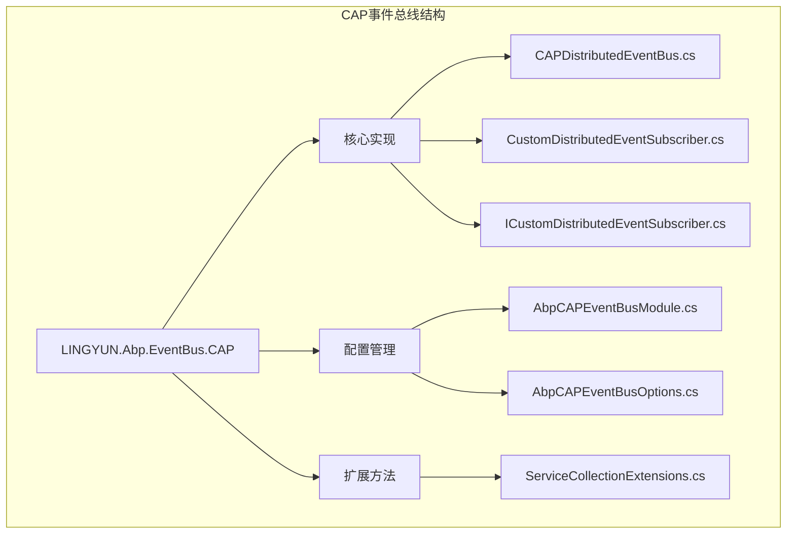
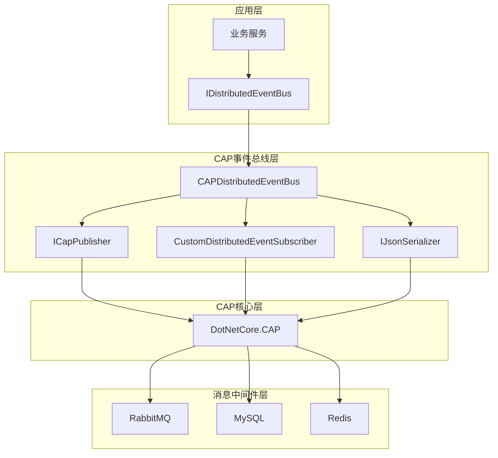
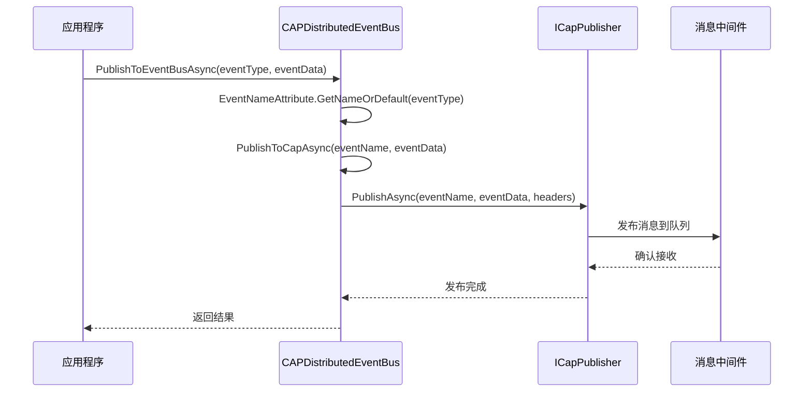
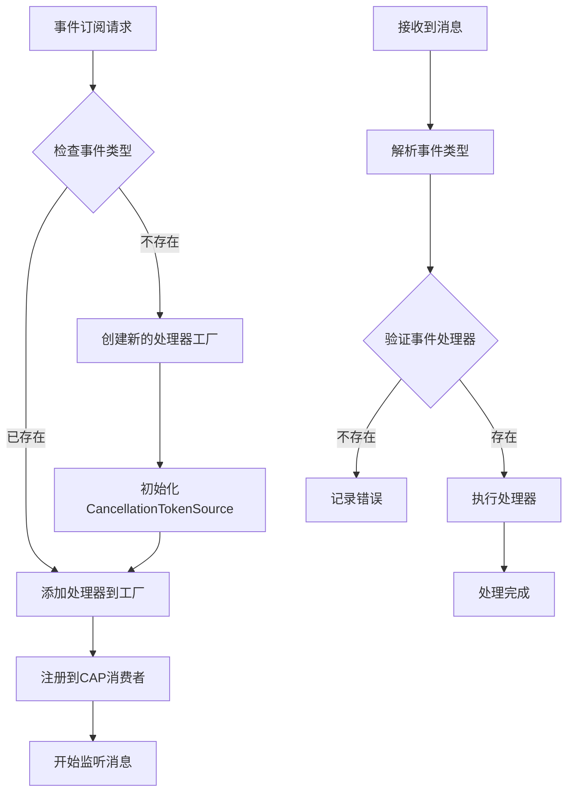
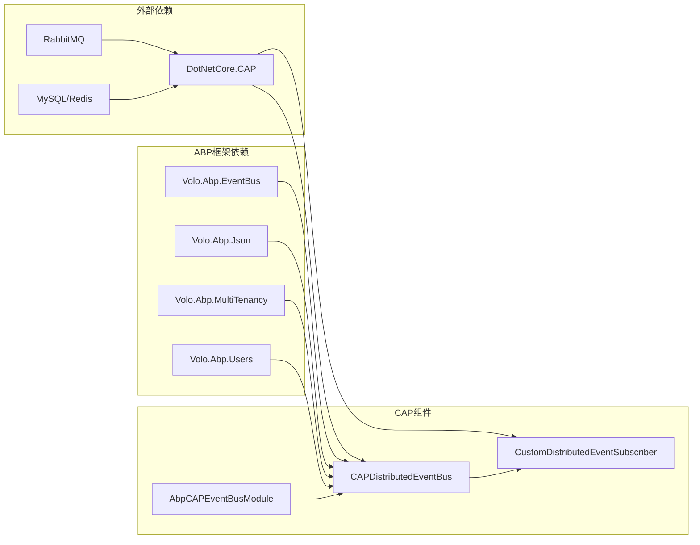

# CAP 事件总线

<cite>
**本文档中引用的文件**
- [CAPDistributedEventBus.cs](file://aspnet-core/framework/common/LINGYUN.Abp.EventBus.CAP/LINGYUN/Abp/EventBus/CAP/CAPDistributedEventBus.cs)
- [ServiceCollectionExtensions.cs](file://aspnet-core/framework/common/LINGYUN.Abp.EventBus.CAP/Microsoft/Extensions/DependencyInjection/ServiceCollectionExtensions.cs)
- [ICustomDistributedEventSubscriber.cs](file://aspnet-core/framework/common/LINGYUN.Abp.EventBus.CAP/LINGYUN/Abp/EventBus/CAP/ICustomDistributedEventSubscriber.cs)
- [CustomDistributedEventSubscriber.cs](file://aspnet-core/framework/common/LINGYUN.Abp.EventBus.CAP/LINGYUN/Abp/EventBus/CAP/CustomDistributedEventSubscriber.cs)
- [AbpCAPEventBusModule.cs](file://aspnet-core/framework/common/LINGYUN.Abp.EventBus.CAP/LINGYUN/Abp/EventBus/CAP/AbpCAPEventBusModule.cs)
- [AbpCAPEventBusOptions.cs](file://aspnet-core/framework/common/LINGYUN.Abp.EventBus.CAP/LINGYUN/Abp/EventBus/CAP/AbpCAPEventBusOptions.cs)
- [ChatMessageEventHandler.cs](file://aspnet-core/services/LY.AIO.Applications.Single/EventBus/Distributed/ChatMessageEventHandler.cs)
- [DataAccessResourceChangeEvent.cs](file://aspnet-core/framework/data-protection/LINGYUN.Abp.DataProtection.Abstractions/LINGYUN/Abp/DataProtection/DataAccessResourceChangeEvent.cs)
- [appsettings.Development.json](file://aspnet-core/templates/micro/content/host/PackageName.CompanyName.ProjectName.HttpApi.Host/appsettings.Development.json)
</cite>

## 目录
1. [简介](#简介)
2. [项目结构](#项目结构)
3. [核心组件](#核心组件)
4. [架构概览](#架构概览)
5. [详细组件分析](#详细组件分析)
6. [依赖关系分析](#依赖关系分析)
7. [性能考虑](#性能考虑)
8. [故障排除指南](#故障排除指南)
9. [结论](#结论)

## 简介

CAP（Cloud Events Application Protocol）事件总线是ABP框架中用于实现分布式事件处理的核心组件。它基于CAP理论，提供了可靠的事件发布/订阅机制，支持跨服务通信和分布式事务处理。CAP事件总线通过集成DotNetCore.CAP库，实现了消息的可靠传递和持久化存储。

该组件的主要特点包括：
- 基于CAP理论的分布式事件处理
- 支持多种消息中间件（RabbitMQ、Kafka等）
- 提供事件的可靠传递和重试机制
- 支持事务性消息处理
- 内置消息持久化和监控功能

## 项目结构

CAP事件总线的项目结构遵循ABP框架的标准组织方式，主要包含以下关键目录和文件：



**图表来源**
- [CAPDistributedEventBus.cs](file://aspnet-core/framework/common/LINGYUN.Abp.EventBus.CAP/LINGYUN/Abp/EventBus/CAP/CAPDistributedEventBus.cs#L1-L297)
- [AbpCAPEventBusModule.cs](file://aspnet-core/framework/common/LINGYUN.Abp.EventBus.CAP/LINGYUN/Abp/EventBus/CAP/AbpCAPEventBusModule.cs#L1-L52)

**章节来源**
- [CAPDistributedEventBus.cs](file://aspnet-core/framework/common/LINGYUN.Abp.EventBus.CAP/LINGYUN/Abp/EventBus/CAP/CAPDistributedEventBus.cs#L1-L50)
- [AbpCAPEventBusModule.cs](file://aspnet-core/framework/common/LINGYUN.Abp.EventBus.CAP/LINGYUN/Abp/EventBus/CAP/AbpCAPEventBusModule.cs#L1-L52)

## 核心组件

### CAP分布式事件总线 (CAPDistributedEventBus)

`CAPDistributedEventBus`是CAP事件总线的核心实现类，继承自`DistributedEventBusBase`并实现了`IDistributedEventBus`接口。它负责处理事件的发布、订阅和处理逻辑。

```csharp
[Dependency(ServiceLifetime.Singleton, ReplaceServices = true)]
[ExposeServices(typeof(IDistributedEventBus), typeof(CAPDistributedEventBus))]
public class CAPDistributedEventBus : DistributedEventBusBase, IDistributedEventBus
{
    protected ICapPublisher CapPublisher { get; }
    protected ICustomDistributedEventSubscriber CustomDistributedEventSubscriber { get; }
    protected ConcurrentDictionary<Type, List<IEventHandlerFactory>> HandlerFactories { get; }
    protected ConcurrentDictionary<string, Type> EventTypes { get; }
}
```

### 自定义分布式事件订阅者 (CustomDistributedEventSubscriber)

`CustomDistributedEventSubscriber`负责管理事件的订阅和取消订阅操作，它实现了`ICustomDistributedEventSubscriber`接口。

```csharp
internal class CustomDistributedEventSubscriber : ICustomDistributedEventSubscriber, ISingletonDependency
{
    protected CapOptions CapOptions { get; }
    protected IConsumerClientFactory ConsumerClientFactory { get; }
    protected ConcurrentDictionary<Type, List<IEventHandlerFactory>> HandlerFactories { get; }
    protected ConcurrentDictionary<string, CancellationTokenSource> EventStopingTokens { get; }
}
```

**章节来源**
- [CAPDistributedEventBus.cs](file://aspnet-core/framework/common/LINGYUN.Abp.EventBus.CAP/LINGYUN/Abp/EventBus/CAP/CAPDistributedEventBus.cs#L25-L45)
- [CustomDistributedEventSubscriber.cs](file://aspnet-core/framework/common/LINGYUN.Abp.EventBus.CAP/LINGYUN/Abp/EventBus/CAP/CustomDistributedEventSubscriber.cs#L17-L30)

## 架构概览

CAP事件总线采用分层架构设计，通过依赖注入和服务替换机制与ABP框架深度集成：



**图表来源**
- [CAPDistributedEventBus.cs](file://aspnet-core/framework/common/LINGYUN.Abp.EventBus.CAP/LINGYUN/Abp/EventBus/CAP/CAPDistributedEventBus.cs#L25-L45)
- [ServiceCollectionExtensions.cs](file://aspnet-core/framework/common/LINGYUN.Abp.EventBus.CAP/Microsoft/Extensions/DependencyInjection/ServiceCollectionExtensions.cs#L17-L27)

## 详细组件分析

### 事件发布流程

事件发布过程通过`PublishToEventBusAsync`方法实现，该方法负责将事件数据转换为CAP消息并发布到消息中间件：



**图表来源**
- [CAPDistributedEventBus.cs](file://aspnet-core/framework/common/LINGYUN.Abp.EventBus.CAP/LINGYUN/Abp/EventBus/CAP/CAPDistributedEventBus.cs#L115-L125)
- [CAPDistributedEventBus.cs](file://aspnet-core/framework/common/LINGYUN.Abp.EventBus.CAP/LINGYUN/Abp/EventBus/CAP/CAPDistributedEventBus.cs#L275-L297)

### 事件订阅流程

事件订阅通过`CustomDistributedEventSubscriber`类实现，它负责管理事件处理器的注册和执行：



**图表来源**
- [CustomDistributedEventSubscriber.cs](file://aspnet-core/framework/common/LINGYUN.Abp.EventBus.CAP/LINGYUN/Abp/EventBus/CAP/CustomDistributedEventSubscriber.cs#L32-L45)
- [CustomDistributedEventSubscriber.cs](file://aspnet-core/framework/common/LINGYUN.Abp.EventBus.CAP/LINGYUN/Abp/EventBus/CAP/CustomDistributedEventSubscriber.cs#L71-L106)

### 事件处理器实现

事件处理器需要实现`IDistributedEventHandler<TEvent>`接口，其中TEvent是具体的事件类型：

```csharp
public class ChatMessageEventHandler : IDistributedEventHandler<RealTimeEto<ChatMessage>>, ITransientDependency
{
    public async virtual Task HandleEventAsync(RealTimeEto<ChatMessage> eventData)
    {
        Logger.LogDebug($"Persistent chat message.");
        
        var message = eventData.Data;
        // 消息拦截
        await MessageBlocker.InterceptAsync(message);
        
        await MessageStore.StoreMessageAsync(message);
        
        // 发送消息
        foreach (var provider in MessageSenderProviderManager.Providers)
        {
            Logger.LogDebug($"Sending message with provider {provider.Name}");
            await provider.SendMessageAsync(message);
        }
    }
}
```

**章节来源**
- [CAPDistributedEventBus.cs](file://aspnet-core/framework/common/LINGYUN.Abp.EventBus.CAP/LINGYUN/Abp/EventBus/CAP/CAPDistributedEventBus.cs#L115-L125)
- [ChatMessageEventHandler.cs](file://aspnet-core/services/LY.AIO.Applications.Single/EventBus/Distributed/ChatMessageEventHandler.cs#L35-L55)

### 事件定义

事件类通常使用`[Serializable]`特性标记，并通过`[EventName]`属性指定事件名称：

```csharp
[Serializable]
[EventName("abp.data_protection.resource_changed")]
public class DataAccessResourceChangeEvent
{
    public bool IsEnabled { get; set; }
    public DataAccessResource Resource { get; set; }
    
    public DataAccessResourceChangeEvent(bool isEnabled, DataAccessResource resource)
    {
        IsEnabled = isEnabled;
        Resource = resource;
    }
}
```

**章节来源**
- [DataAccessResourceChangeEvent.cs](file://aspnet-core/framework/data-protection/LINGYUN.Abp.DataProtection.Abstractions/LINGYUN/Abp/DataProtection/DataAccessResourceChangeEvent.cs#L7-L22)

## 依赖关系分析

CAP事件总线的依赖关系体现了清晰的分层架构：



**图表来源**
- [CAPDistributedEventBus.cs](file://aspnet-core/framework/common/LINGYUN.Abp.EventBus.CAP/LINGYUN/Abp/EventBus/CAP/CAPDistributedEventBus.cs#L1-L25)
- [AbpCAPEventBusModule.cs](file://aspnet-core/framework/common/LINGYUN.Abp.EventBus.CAP/LINGYUN/Abp/EventBus/CAP/AbpCAPEventBusModule.cs#L12-L15)

**章节来源**
- [CAPDistributedEventBus.cs](file://aspnet-core/framework/common/LINGYUN.Abp.EventBus.CAP/LINGYUN/Abp/EventBus/CAP/CAPDistributedEventBus.cs#L1-L25)
- [AbpCAPEventBusModule.cs](file://aspnet-core/framework/common/LINGYUN.Abp.EventBus.CAP/LINGYUN/Abp/EventBus/CAP/AbpCAPEventBusModule.cs#L12-L52)

## 性能考虑

### 并发处理优化

CAP事件总线使用`ConcurrentDictionary`来存储事件处理器工厂，确保多线程环境下的安全访问：

```csharp
protected ConcurrentDictionary<Type, List<IEventHandlerFactory>> HandlerFactories { get; }
protected ConcurrentDictionary<string, Type> EventTypes { get; }
```

### 消息头信息

在发布消息时，系统会自动添加上下文信息到消息头中：

- 用户ID (`UserId`)
- 租户ID (`TenantId`)  
- 客户端ID (`ClientId`)
- 关联ID (`CorrelationId`)
- 消息ID (`MessageId`)

这些信息有助于追踪分布式事务和调试问题。

### 配置优化

建议根据实际需求调整以下配置参数：

```json
{
  "CAP": {
    "EventBus": {
      "FailedRetryInterval": 300,
      "FailedRetryCount": 10
    }
  }
}
```

## 故障排除指南

### 常见问题及解决方案

1. **事件无法订阅**
   - 检查事件处理器是否正确注册
   - 验证事件名称是否匹配
   - 确认消息中间件连接正常

2. **消息重复消费**
   - 检查消息确认机制
   - 验证事务配置
   - 查看重试策略设置

3. **性能问题**
   - 调整并发处理数量
   - 优化消息大小
   - 监控资源使用情况

### 监控和诊断

CAP内置了仪表板功能，可以通过以下URL访问：
```
http://localhost:port/cap
```

**章节来源**
- [appsettings.Development.json](file://aspnet-core/templates/micro/content/host/PackageName.CompanyName.ProjectName.HttpApi.Host/appsettings.Development.json#L92-L135)

## 结论

CAP事件总线是ABP框架中实现分布式事件处理的重要组件，它通过集成DotNetCore.CAP库，提供了可靠的消息传递机制。该组件具有以下优势：

1. **高可靠性**：基于CAP理论，确保事件的最终一致性
2. **易于使用**：简洁的API设计，降低开发复杂度
3. **可扩展性**：支持多种消息中间件和存储后端
4. **监控完善**：内置仪表板和日志记录功能

通过合理配置和使用CAP事件总线，开发者可以构建出高性能、高可用的分布式应用程序。建议在实际项目中结合具体需求，选择合适的消息中间件和存储方案，并建立完善的监控和告警机制。