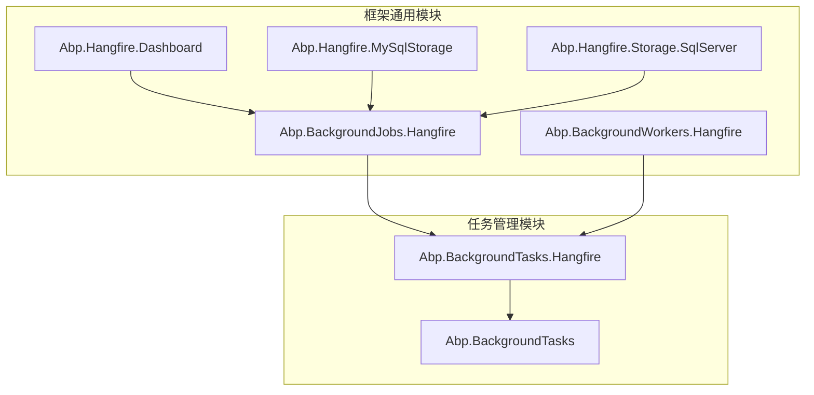
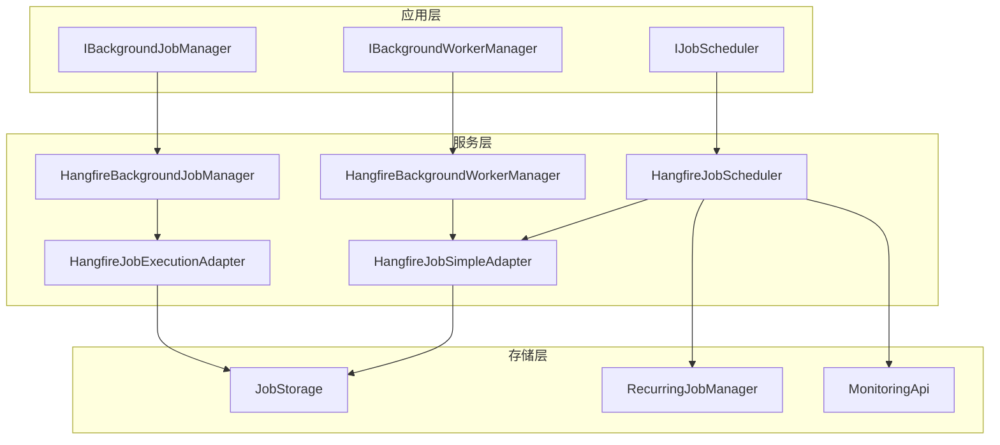
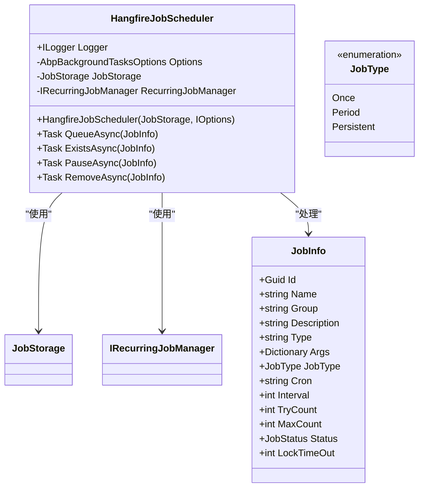
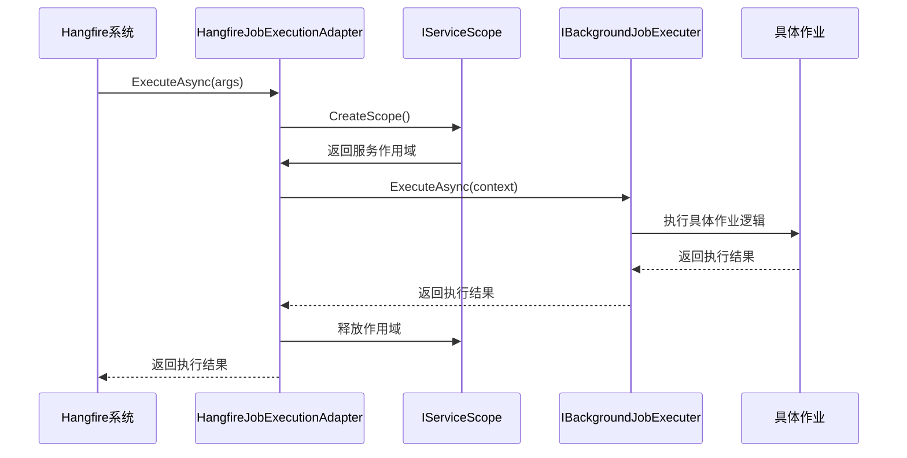
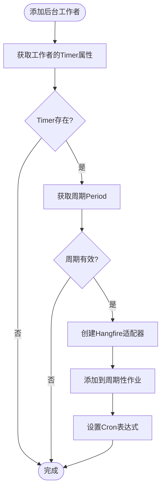
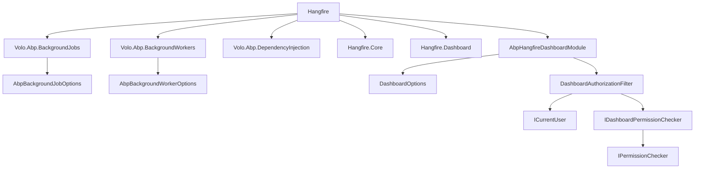

# Hangfire 后台作业

<cite>
**本文档引用文件**  
- [HangfireJobScheduler.cs](file://aspnet-core/modules/task-management/LINGYUN.Abp.BackgroundTasks.Hangfire/LINGYUN/Abp/BackgroundTasks/Hangfire/HangfireJobScheduler.cs)
- [HangfireBackgroundJobManager.cs](file://aspnet-core/framework/common/LINGYUN.Abp.BackgroundJobs.Hangfire/LINGYUN/Abp/BackgroundJobs/Hangfire/HangfireBackgroundJobManager.cs)
- [HangfireBackgroundWorkerManager.cs](file://aspnet-core/framework/common/LINGYUN.Abp.BackgroundWorkers.Hangfire/LINGYUN/Abp/BackgroundWorkers/Hangfire/HangfireBackgroundWorkerManager.cs)
- [AbpBackgroundJobsHangfireModule.cs](file://aspnet-core/framework/common/LINGYUN.Abp.BackgroundJobs.Hangfire/LINGYUN/Abp/BackgroundJobs/Hangfire/AbpBackgroundJobsHangfireModule.cs)
- [AbpBackgroundTasksHangfireModule.cs](file://aspnet-core/modules/task-management/LINGYUN.Abp.BackgroundTasks.Hangfire/LINGYUN/Abp/BackgroundTasks/Hangfire/AbpBackgroundTasksHangfireModule.cs)
- [HangfireJobExecutionAdapter.cs](file://aspnet-core/framework/common/LINGYUN.Abp.BackgroundJobs.Hangfire/LINGYUN/Abp/BackgroundJobs/Hangfire/HangfireJobExecutionAdapter.cs)
- [HangfireJobSimpleAdapter.cs](file://aspnet-core/modules/task-management/LINGYUN.Abp.BackgroundTasks.Hangfire/LINGYUN/Abp/BackgroundTasks/Hangfire/HangfireJobSimpleAdapter.cs)
- [AbpBackgroundJobOptions.cs](file://aspnet-core/framework/common/LINGYUN.Abp.BackgroundJobs.Hangfire/LINGYUN/Abp/BackgroundJobs/AbpBackgroundJobOptions.cs)
- [AbpHangfireOptions.cs](file://aspnet-core/framework/common/LINGYUN.Abp.BackgroundJobs.Hangfire/LINGYUN/Abp/BackgroundJobs/AbpHangfireOptions.cs)
- [README.md](file://aspnet-core/modules/task-management/LINGYUN.Abp.BackgroundTasks/README.md)
</cite>

## 目录
1. [简介](#简介)
2. [项目结构](#项目结构)
3. [核心组件](#核心组件)
4. [架构概述](#架构概述)
5. [详细组件分析](#详细组件分析)
6. [依赖分析](#依赖分析)
7. [性能考虑](#性能考虑)
8. [故障排除指南](#故障排除指南)
9. [结论](#结论)

## 简介
本文档详细介绍了在ABP框架中集成Hangfire后台作业系统的实现机制。文档涵盖了作业调度、持久化存储、监控面板集成等核心功能，深入解析了Hangfire的技术架构、配置方式和使用场景。通过实际代码示例，展示了如何定义、调度和监控后台作业，以及如何处理作业失败和重试，为开发者提供后台作业管理的最佳实践指南。

## 项目结构
项目中的Hangfire相关组件分布在多个模块中，主要分为基础框架模块和任务管理模块。基础框架模块提供了通用的Hangfire集成，而任务管理模块则实现了更高级的作业调度功能。

**图示来源**
- [AbpBackgroundJobsHangfireModule.cs](file://aspnet-core/framework/common/LINGYUN.Abp.BackgroundJobs.Hangfire/LINGYUN/Abp/BackgroundJobs/Hangfire/AbpBackgroundJobsHangfireModule.cs)
- [AbpBackgroundTasksHangfireModule.cs](file://aspnet-core/modules/task-management/LINGYUN.Abp.BackgroundTasks.Hangfire/LINGYUN/Abp/BackgroundTasks/Hangfire/AbpBackgroundTasksHangfireModule.cs)

## 核心组件
Hangfire在项目中实现了三个核心功能：作业管理、后台工作者管理和作业调度。这些组件通过依赖注入无缝集成到ABP框架中，提供了统一的后台作业处理接口。

**组件来源**
- [HangfireBackgroundJobManager.cs](file://aspnet-core/framework/common/LINGYUN.Abp.BackgroundJobs.Hangfire/LINGYUN/Abp/BackgroundJobs/Hangfire/HangfireBackgroundJobManager.cs)
- [HangfireBackgroundWorkerManager.cs](file://aspnet-core/framework/common/LINGYUN.Abp.BackgroundWorkers.Hangfire/LINGYUN/Abp/BackgroundWorkers/Hangfire/HangfireBackgroundWorkerManager.cs)
- [HangfireJobScheduler.cs](file://aspnet-core/modules/task-management/LINGYUN.Abp.BackgroundTasks.Hangfire/LINGYUN/Abp/BackgroundTasks/Hangfire/HangfireJobScheduler.cs)

## 架构概述
Hangfire架构采用分层设计，从上到下分为应用层、服务层和存储层。应用层通过统一接口与Hangfire交互，服务层处理作业的调度和执行逻辑，存储层负责作业的持久化。

**图示来源**
- [HangfireBackgroundJobManager.cs](file://aspnet-core/framework/common/LINGYUN.Abp.BackgroundJobs.Hangfire/LINGYUN/Abp/BackgroundJobs/Hangfire/HangfireBackgroundJobManager.cs)
- [HangfireBackgroundWorkerManager.cs](file://aspnet-core/framework/common/LINGYUN.Abp.BackgroundWorkers.Hangfire/LINGYUN/Abp/BackgroundWorkers/Hangfire/HangfireBackgroundWorkerManager.cs)
- [HangfireJobScheduler.cs](file://aspnet-core/modules/task-management/LINGYUN.Abp.BackgroundTasks.Hangfire/LINGYUN/Abp/BackgroundTasks/Hangfire/HangfireJobScheduler.cs)

## 详细组件分析

### 作业调度器分析
`HangfireJobScheduler`是任务管理模块的核心组件，负责管理各种类型的后台作业。它支持三种作业类型：一次性作业、周期性作业和持续性作业。

**图示来源**
- [HangfireJobScheduler.cs](file://aspnet-core/modules/task-management/LINGYUN.Abp.BackgroundTasks.Hangfire/LINGYUN/Abp/BackgroundTasks/Hangfire/HangfireJobScheduler.cs)
- [JobInfo.cs](file://aspnet-core/modules/task-management/LINGYUN.Abp.BackgroundTasks/LINGYUN/Abp/BackgroundTasks/JobInfo.cs)

### 作业执行适配器分析
`HangfireJobExecutionAdapter`和`HangfireJobSimpleAdapter`是作业执行的核心适配器，负责将Hangfire的作业执行请求转换为ABP框架的作业执行上下文。

**图示来源**
- [HangfireJobExecutionAdapter.cs](file://aspnet-core/framework/common/LINGYUN.Abp.BackgroundJobs.Hangfire/LINGYUN/Abp/BackgroundJobs/Hangfire/HangfireJobExecutionAdapter.cs)
- [HangfireJobSimpleAdapter.cs](file://aspnet-core/modules/task-management/LINGYUN.Abp.BackgroundTasks.Hangfire/LINGYUN/Abp/BackgroundTasks/Hangfire/HangfireJobSimpleAdapter.cs)

### 后台工作者管理分析
`HangfireBackgroundWorkerManager`将ABP框架的后台工作者与Hangfire系统集成，使得周期性后台工作者可以通过Hangfire进行调度。

**图示来源**
- [HangfireBackgroundWorkerManager.cs](file://aspnet-core/framework/common/LINGYUN.Abp.BackgroundWorkers.Hangfire/LINGYUN/Abp/BackgroundWorkers/Hangfire/HangfireBackgroundWorkerManager.cs)
- [HangfireBackgroundWorkerAdapter.cs](file://aspnet-core/framework/common/LINGYUN.Abp.BackgroundWorkers.Hangfire/LINGYUN/Abp/BackgroundWorkers/Hangfire/HangfireBackgroundWorkerAdapter.cs)

## 依赖分析
Hangfire组件依赖于多个ABP框架模块和外部库，形成了一个完整的后台作业处理生态系统。

**图示来源**
- [AbpBackgroundJobsHangfireModule.cs](file://aspnet-core/framework/common/LINGYUN.Abp.BackgroundJobs.Hangfire/LINGYUN/Abp/BackgroundJobs/Hangfire/AbpBackgroundJobsHangfireModule.cs)
- [AbpHangfireDashboardModule.cs](file://aspnet-core/framework/common/LINGYUN.Abp.Hangfire.Dashboard/LINGYUN/Abp/Hangfire/Dashboard/AbpHangfireDashboardModule.cs)

## 性能考虑
Hangfire的性能主要受存储后端、作业队列大小和执行并发度的影响。建议根据实际业务需求进行相应配置。

- **存储选择**：对于高并发场景，推荐使用Redis作为存储后端；对于数据一致性要求高的场景，可以使用SQL Server或MySQL。
- **作业批处理**：对于大量相似作业，建议使用批处理机制减少数据库压力。
- **监控配置**：合理配置监控频率，避免对生产环境造成过大性能影响。
- **资源隔离**：关键业务作业与非关键业务作业应分配到不同队列，确保关键业务的执行优先级。

## 故障排除指南
当Hangfire作业出现问题时，可以按照以下步骤进行排查：

1. **检查作业状态**：通过Hangfire仪表板查看作业的当前状态和执行历史。
2. **查看日志信息**：检查应用程序日志，特别是与Hangfire相关的错误信息。
3. **验证配置**：确认Hangfire配置正确，特别是存储连接字符串和仪表板权限配置。
4. **测试连接**：验证与存储后端的连接是否正常。
5. **检查依赖服务**：确保所有依赖服务（如数据库、Redis等）正常运行。

**故障排除来源**
- [HangfireJobScheduler.cs](file://aspnet-core/modules/task-management/LINGYUN.Abp.BackgroundTasks.Hangfire/LINGYUN/Abp/BackgroundTasks/Hangfire/HangfireJobScheduler.cs)
- [AbpBackgroundJobsHangfireModule.cs](file://aspnet-core/framework/common/LINGYUN.Abp.BackgroundJobs.Hangfire/LINGYUN/Abp/BackgroundJobs/Hangfire/AbpBackgroundJobsHangfireModule.cs)

## 结论
Hangfire在ABP框架中的集成提供了一个强大而灵活的后台作业处理解决方案。通过合理的配置和使用，可以有效管理各种后台任务，提高系统的可靠性和可维护性。建议开发者根据具体业务需求，充分利用Hangfire提供的各种功能，实现高效的后台作业管理。