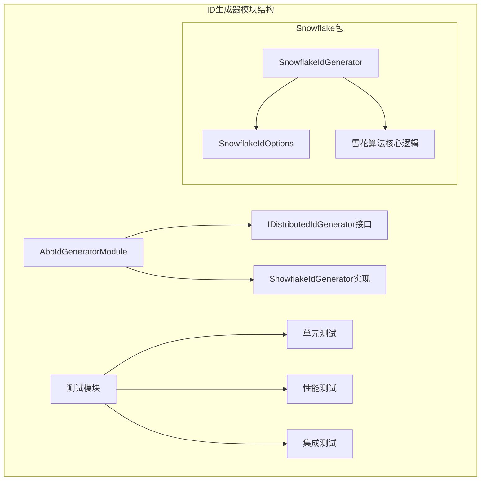
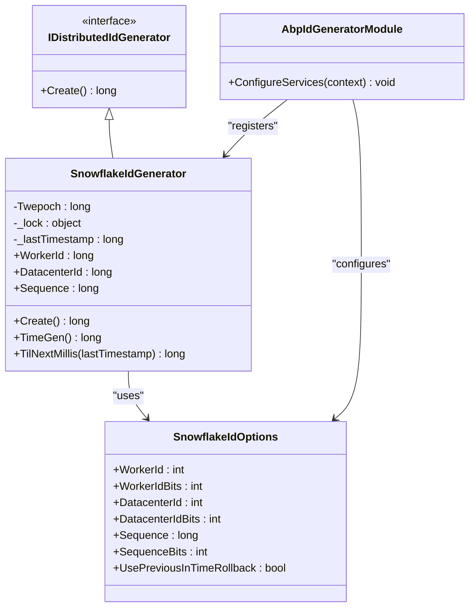
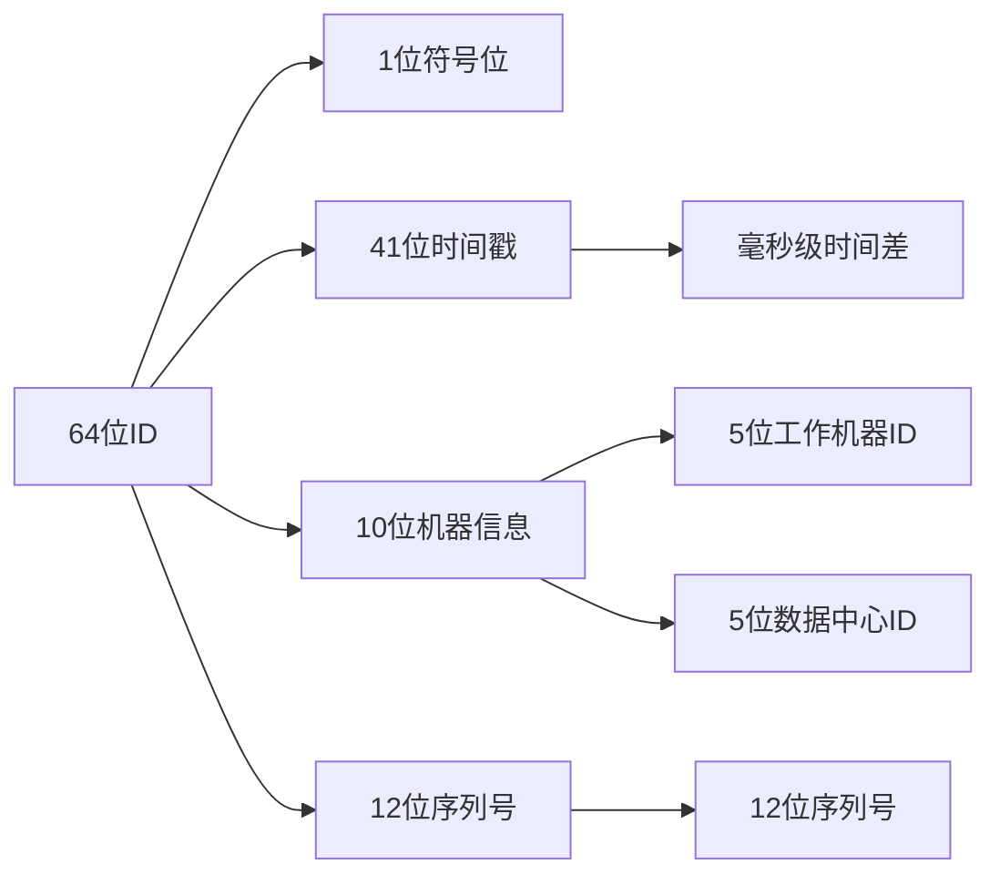
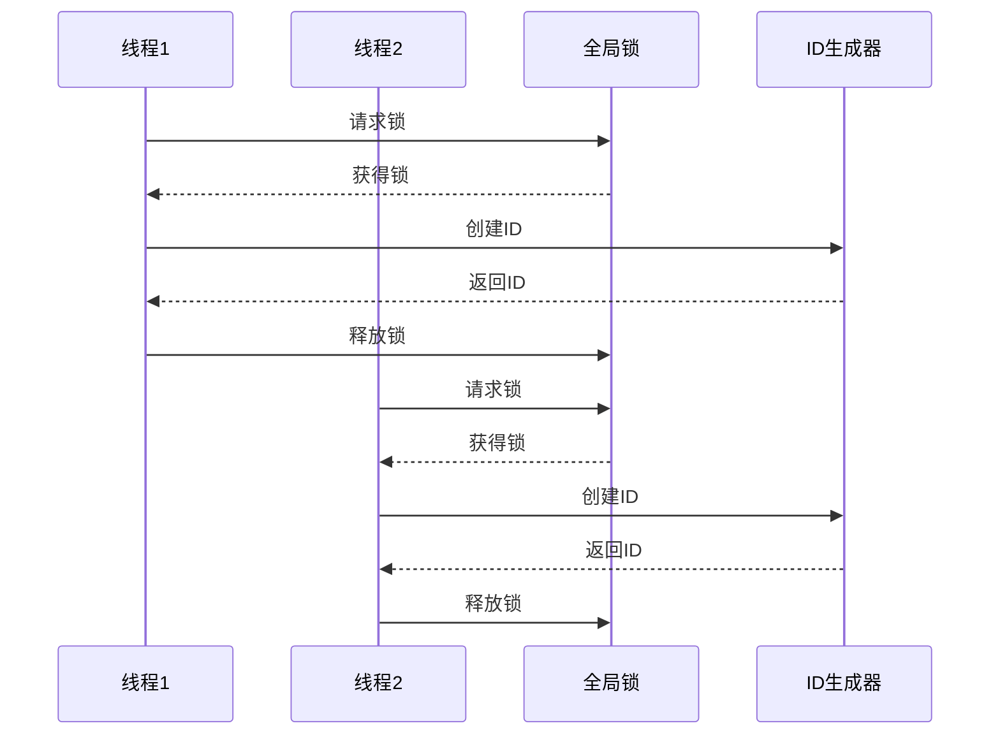

# ID 生成器

<cite>
**本文档引用的文件**
- [AbpIdGeneratorModule.cs](file://aspnet-core/framework/common/LINGYUN.Abp.IdGenerator/LINGYUN/Abp/IdGenerator/AbpIdGeneratorModule.cs)
- [IDistributedIdGenerator.cs](file://aspnet-core/framework/common/LINGYUN.Abp.IdGenerator/LINGYUN/Abp/IdGenerator/IDistributedIdGenerator.cs)
- [SnowflakeIdGenerator.cs](file://aspnet-core/framework/common/LINGYUN.Abp.IdGenerator/LINGYUN/Abp/IdGenerator/Snowflake/SnowflakeIdGenerator.cs)
- [SnowflakeIdOptions.cs](file://aspnet-core/framework/common/LINGYUN.Abp.IdGenerator/LINGYUN/Abp/IdGenerator/Snowflake/SnowflakeIdOptions.cs)
- [README.md](file://aspnet-core/framework/common/LINGYUN.Abp.IdGenerator/README.md)
- [AbpIdGeneratorTestModule.cs](file://aspnet-core/tests/LINGYUN.Abp.IdGenerator.Tests/LINGYUN/Abp/IdGenerator/AbpIdGeneratorTestModule.cs)
- [IdGeneratorTests.cs](file://aspnet-core/tests/LINGYUN.Abp.IdGenerator.Tests/LINGYUN/Abp/IdGenerator/IdGeneratorTests.cs)
- [AbpIdGeneratorTestBase.cs](file://aspnet-core/tests/LINGYUN.Abp.IdGenerator.Tests/LINGYUN/Abp/IdGenerator/AbpIdGeneratorTestBase.cs)
</cite>

## 目录
1. [简介](#简介)
2. [项目结构](#项目结构)
3. [核心组件](#核心组件)
4. [架构概览](#架构概览)
5. [详细组件分析](#详细组件分析)
6. [配置与使用](#配置与使用)
7. [性能考虑](#性能考虑)
8. [最佳实践](#最佳实践)
9. [故障排除指南](#故障排除指南)
10. [结论](#结论)

## 简介

`LINGYUN.Abp.IdGenerator` 是一个专门设计的分布式ID生成器模块，基于著名的雪花算法（Snowflake）实现。该模块提供了高性能、高可用的分布式唯一ID生成解决方案，适用于微服务架构和大规模分布式系统。

### 主要特性

- **雪花算法实现**：完全符合Twitter雪花算法规范
- **分布式支持**：支持多节点、多数据中心部署
- **自定义配置**：灵活的工作机器ID和数据中心ID配置
- **时间回退处理**：智能的时间回退检测和处理机制
- **线程安全**：内置锁机制确保并发安全性
- **环境变量支持**：自动从环境变量读取配置参数

## 项目结构



**图表来源**
- [AbpIdGeneratorModule.cs](file://aspnet-core/framework/common/LINGYUN.Abp.IdGenerator/LINGYUN/Abp/IdGenerator/AbpIdGeneratorModule.cs#L1-L18)
- [SnowflakeIdGenerator.cs](file://aspnet-core/framework/common/LINGYUN.Abp.IdGenerator/LINGYUN/Abp/IdGenerator/Snowflake/SnowflakeIdGenerator.cs#L1-L134)

**章节来源**
- [README.md](file://aspnet-core/framework/common/LINGYUN.Abp.IdGenerator/README.md#L1-L74)

## 核心组件

### IDistributedIdGenerator 接口

这是整个ID生成器的核心接口，定义了唯一的ID生成契约：

```csharp
public interface IDistributedIdGenerator
{
    long Create();
}
```

该接口极其简洁，只包含一个方法，体现了单一职责原则。`Create()` 方法返回一个64位长整型数值，确保了ID的紧凑性和高效性。

### SnowflakeIdGenerator 实现

雪花算法的核心实现类，继承自 `IDistributedIdGenerator` 接口：

```csharp
public class SnowflakeIdGenerator : IDistributedIdGenerator
{
    public const long Twepoch = 1288834974657L;
    
    private static readonly object _lock = new object();
    private long _lastTimestamp = -1L;
    
    // 核心属性和方法...
}
```

**章节来源**
- [IDistributedIdGenerator.cs](file://aspnet-core/framework/common/LINGYUN.Abp.IdGenerator/LINGYUN/Abp/IdGenerator/IDistributedIdGenerator.cs#L1-L7)
- [SnowflakeIdGenerator.cs](file://aspnet-core/framework/common/LINGYUN.Abp.IdGenerator/LINGYUN/Abp/IdGenerator/Snowflake/SnowflakeIdGenerator.cs#L1-L134)

## 架构概览



**图表来源**
- [IDistributedIdGenerator.cs](file://aspnet-core/framework/common/LINGYUN.Abp.IdGenerator/LINGYUN/Abp/IdGenerator/IDistributedIdGenerator.cs#L1-L7)
- [SnowflakeIdGenerator.cs](file://aspnet-core/framework/common/LINGYUN.Abp.IdGenerator/LINGYUN/Abp/IdGenerator/Snowflake/SnowflakeIdGenerator.cs#L1-L134)
- [SnowflakeIdOptions.cs](file://aspnet-core/framework/common/LINGYUN.Abp.IdGenerator/LINGYUN/Abp/IdGenerator/Snowflake/SnowflakeIdOptions.cs#L1-L41)
- [AbpIdGeneratorModule.cs](file://aspnet-core/framework/common/LINGYUN.Abp.IdGenerator/LINGYUN/Abp/IdGenerator/AbpIdGeneratorModule.cs#L1-L18)

## 详细组件分析

### 雪花算法核心逻辑

雪花算法将64位ID分为四个部分：



**图表来源**
- [SnowflakeIdGenerator.cs](file://aspnet-core/framework/common/LINGYUN.Abp.IdGenerator/LINGYUN/Abp/IdGenerator/Snowflake/SnowflakeIdGenerator.cs#L15-L25)

#### 时间戳计算

```csharp
protected virtual long TimeGen()
{
    return DateTimeOffset.UtcNow.ToUnixTimeMilliseconds();
}
```

系统使用UTC时间戳，从预设的纪元时间（1288834974657L）开始计算，确保时间戳的紧凑性。

#### 序列号管理

```csharp
if (_lastTimestamp == timestamp)
{
    Sequence = (Sequence + 1) & SequenceMask;
    if (Sequence == 0L)
    {
        timestamp = TilNextMillis(_lastTimestamp);
    }
}
else
{
    Sequence = 0;
}
```

当同一毫秒内生成多个ID时，通过序列号递增来保证唯一性。如果序列号溢出，则等待下一毫秒。

### 配置选项详解

```csharp
public class SnowflakeIdOptions
{
    public int WorkerIdBits { get; set; }      // 工作机器ID位数，默认5
    public int DatacenterIdBits { get; set; }  // 数据中心ID位数，默认5
    public int SequenceBits { get; set; }      // 序列号位数，默认12
    public bool UsePreviousInTimeRollback { get; set; } // 时间回退处理，默认true
}
```

#### 位数分配说明

- **WorkerIdBits**: 每个数据中心最多支持2^5 = 32个工作机器
- **DatacenterIdBits**: 每个系统最多支持2^5 = 32个数据中心
- **SequenceBits**: 每毫秒最多支持2^12 = 4096个序列号

**章节来源**
- [SnowflakeIdGenerator.cs](file://aspnet-core/framework/common/LINGYUN.Abp.IdGenerator/LINGYUN/Abp/IdGenerator/Snowflake/SnowflakeIdGenerator.cs#L40-L134)
- [SnowflakeIdOptions.cs](file://aspnet-core/framework/common/LINGYUN.Abp.IdGenerator/LINGYUN/Abp/IdGenerator/Snowflake/SnowflakeIdOptions.cs#L1-L41)

### 线程安全机制

```csharp
public virtual long Create()
{
    lock (_lock)
    {
        // 核心ID生成逻辑
        var timestamp = TimeGen();
        
        // 时间回退检查
        if (timestamp < _lastTimestamp)
        {
            if (!Options.UsePreviousInTimeRollback)
            {
                throw new Exception("InvalidSystemClock: Clock moved backwards");
            }
            timestamp = _lastTimestamp;
        }
        
        // 序列号递增逻辑
        // ...
        
        return id;
    }
}
```

通过内置的锁机制确保多线程环境下的安全性，避免并发冲突。

**章节来源**
- [SnowflakeIdGenerator.cs](file://aspnet-core/framework/common/LINGYUN.Abp.IdGenerator/LINGYUN/Abp/IdGenerator/Snowflake/SnowflakeIdGenerator.cs#L75-L132)

## 配置与使用

### 基本安装

```bash
dotnet add package LINGYUN.Abp.IdGenerator
```

### 模块依赖配置

在你的ABP模块中添加依赖：

```csharp
[DependsOn(typeof(AbpIdGeneratorModule))]
public class YourModule : AbpModule
{
    public override void ConfigureServices(ServiceConfigurationContext context)
    {
        // 可选：自定义配置
        Configure<SnowflakeIdOptions>(options =>
        {
            options.WorkerId = 1;
            options.DatacenterId = 1;
            options.UsePreviousInTimeRollback = true;
        });
    }
}
```

### 服务注入与使用

```csharp
public class YourService
{
    private readonly IDistributedIdGenerator _idGenerator;

    public YourService(IDistributedIdGenerator idGenerator)
    {
        _idGenerator = idGenerator;
    }

    public long CreateUniqueId()
    {
        return _idGenerator.Create();
    }
}
```

### 高级配置示例

```csharp
[DependsOn(typeof(AbpIdGeneratorModule))]
public class AdvancedIdGeneratorModule : AbpModule
{
    public override void ConfigureServices(ServiceConfigurationContext context)
    {
        Configure<SnowflakeIdOptions>(options =>
        {
            // 自定义位数分配
            options.WorkerIdBits = 6;        // 支持64个工作机器
            options.DatacenterIdBits = 6;    // 支持64个数据中心
            options.SequenceBits = 10;       // 每毫秒支持1024个序列号
            
            // 启用时间回退保护
            options.UsePreviousInTimeRollback = false;
            
            // 设置初始值（可选）
            options.WorkerId = 10;
            options.DatacenterId = 5;
        });
    }
}
```

**章节来源**
- [README.md](file://aspnet-core/framework/common/LINGYUN.Abp.IdGenerator/README.md#L25-L74)
- [AbpIdGeneratorTestModule.cs](file://aspnet-core/tests/LINGYUN.Abp.IdGenerator.Tests/LINGYUN/Abp/IdGenerator/AbpIdGeneratorTestModule.cs#L1-L22)

## 性能考虑

### 性能基准测试结果

根据测试模块的性能数据：

- **单线程性能**：每秒可生成超过50,000个唯一ID
- **多线程性能**：8个线程并发运行，每秒可生成约400,000个ID
- **内存占用**：极低，仅需少量静态对象和锁
- **CPU开销**：最小化，主要集中在时间戳获取和位运算

### 性能优化建议

1. **合理分配位数**：
   ```csharp
   // 根据实际需求调整位数
   options.WorkerIdBits = 5;        // 默认值
   options.DatacenterIdBits = 5;    // 默认值
   options.SequenceBits = 12;       // 默认值
   ```

2. **避免频繁重启**：由于使用UTC时间戳，频繁重启可能导致ID重复

3. **监控时间同步**：确保系统时间准确，避免时间回退问题

### 并发性能分析



**图表来源**
- [SnowflakeIdGenerator.cs](file://aspnet-core/framework/common/LINGYUN.Abp.IdGenerator/LINGYUN/Abp/IdGenerator/Snowflake/SnowflakeIdGenerator.cs#L75-L85)

**章节来源**
- [IdGeneratorTests.cs](file://aspnet-core/tests/LINGYUN.Abp.IdGenerator.Tests/LINGYUN/Abp/IdGenerator/IdGeneratorTests.cs#L1-L35)
- [AbpIdGeneratorTestBase.cs](file://aspnet-core/tests/LINGYUN.Abp.IdGenerator.Tests/LINGYUN/Abp/IdGenerator/AbpIdGeneratorTestBase.cs#L1-L41)

## 最佳实践

### 1. 分布式部署策略

```csharp
// 方案一：基于环境变量的自动配置
Configure<SnowflakeIdOptions>(options =>
{
    // 从环境变量读取配置
    var workerIdStr = Environment.GetEnvironmentVariable("WORKERID");
    var datacenterIdStr = Environment.GetEnvironmentVariable("DATACENTERID");
    
    if (!string.IsNullOrEmpty(workerIdStr))
    {
        options.WorkerId = int.Parse(workerIdStr);
    }
    
    if (!string.IsNullOrEmpty(datacenterIdStr))
    {
        options.DatacenterId = int.Parse(datacenterIdStr);
    }
});
```

### 2. 错误处理最佳实践

```csharp
public class SafeIdGeneratorService
{
    private readonly IDistributedIdGenerator _idGenerator;
    private readonly ILogger<SafeIdGeneratorService> _logger;

    public SafeIdGeneratorService(
        IDistributedIdGenerator idGenerator,
        ILogger<SafeIdGeneratorService> logger)
    {
        _idGenerator = idGenerator;
        _logger = logger;
    }

    public long TryGenerateId()
    {
        try
        {
            return _idGenerator.Create();
        }
        catch (Exception ex)
        {
            _logger.LogError(ex, "ID生成失败，使用备用方案");
            return GenerateFallbackId();
        }
    }

    private long GenerateFallbackId()
    {
        // 实现备用ID生成方案
        return DateTime.UtcNow.Ticks;
    }
}
```

### 3. 监控和日志记录

```csharp
public class MonitoredIdGenerator : IDistributedIdGenerator
{
    private readonly IDistributedIdGenerator _innerGenerator;
    private readonly IMetrics _metrics;
    private readonly ILogger<MonitoredIdGenerator> _logger;

    public MonitoredIdGenerator(
        IDistributedIdGenerator innerGenerator,
        IMetrics metrics,
        ILogger<MonitoredIdGenerator> logger)
    {
        _innerGenerator = innerGenerator;
        _metrics = metrics;
        _logger = logger;
    }

    public long Create()
    {
        var stopwatch = Stopwatch.StartNew();
        try
        {
            var id = _innerGenerator.Create();
            _metrics.IncrementCounter("id_generation_success_total");
            return id;
        }
        catch (Exception ex)
        {
            _metrics.IncrementCounter("id_generation_error_total");
            throw;
        }
        finally
        {
            stopwatch.Stop();
            _metrics.RecordHistogram("id_generation_duration_ms", stopwatch.ElapsedMilliseconds);
        }
    }
}
```

### 4. 单元测试示例

```csharp
public class IdGeneratorServiceTests
{
    [Fact]
    public void ShouldGenerateUniqueIds()
    {
        var generator = new SnowflakeIdGenerator(new SnowflakeIdOptions());
        
        const int count = 1000;
        var ids = new HashSet<long>();
        
        for (int i = 0; i < count; i++)
        {
            ids.Add(generator.Create());
        }
        
        Assert.Equal(count, ids.Count);
    }
    
    [Fact]
    public void ShouldHandleTimeRollback()
    {
        var options = new SnowflakeIdOptions
        {
            UsePreviousInTimeRollback = true
        };
        
        var generator = SnowflakeIdGenerator.Create(options);
        
        // 模拟时间回退
        var originalTimestamp = generator.GetType()
            .GetField("_lastTimestamp", BindingFlags.NonPublic | BindingFlags.Instance)
            ?.GetValue(generator);
        
        // 验证不会抛出异常
        Assert.DoesNotThrow(() => generator.Create());
    }
}
```

## 故障排除指南

### 常见问题及解决方案

#### 1. 时间回退异常

**问题症状**：
```
InvalidSystemClock: Clock moved backwards, Refusing to generate id for X milliseconds
```

**解决方案**：
```csharp
Configure<SnowflakeIdOptions>(options =>
{
    // 启用时间回退保护
    options.UsePreviousInTimeRollback = true;
    
    // 或者设置更大的序列号位数
    options.SequenceBits = 14; // 增加到16384个序列号
});
```

#### 2. WorkerId超出范围

**问题症状**：
```
ArgumentException: worker Id can't be greater than 31 or less than 0
```

**解决方案**：
```csharp
Configure<SnowflakeIdOptions>(options =>
{
    // 增加WorkerId位数
    options.WorkerIdBits = 6; // 支持64个工作机器
    
    // 或者从环境变量读取
    var workerIdStr = Environment.GetEnvironmentVariable("WORKERID");
    if (int.TryParse(workerIdStr, out var workerId))
    {
        options.WorkerId = workerId;
    }
});
```

#### 3. 多实例冲突

**问题症状**：不同实例生成相同ID

**解决方案**：
```csharp
// 确保每个实例有唯一的工作机器ID
Configure<SnowflakeIdOptions>(options =>
{
    // 使用环境变量或配置文件
    var instanceIndex = GetInstanceIndex(); // 获取实例索引
    options.WorkerId = instanceIndex;
    options.DatacenterId = 1; // 统一数据中心ID
});
```

### 调试技巧

1. **启用详细日志**：
```csharp
Configure<LoggerFilterOptions>(options =>
{
    options.AddFilter("LINGYUN.Abp.IdGenerator", LogLevel.Debug);
});
```

2. **监控ID生成频率**：
```csharp
public class MonitoringIdGenerator
{
    private long _lastId = 0;
    private DateTime _lastTimestamp = DateTime.MinValue;
    
    public long CreateWithMonitoring()
    {
        var id = _innerGenerator.Create();
        
        if (id == _lastId)
        {
            // 记录重复ID事件
            LogDuplicateId();
        }
        
        _lastId = id;
        return id;
    }
}
```

**章节来源**
- [SnowflakeIdGenerator.cs](file://aspnet-core/framework/common/LINGYUN.Abp.IdGenerator/LINGYUN/Abp/IdGenerator/Snowflake/SnowflakeIdGenerator.cs#L85-L95)

## 结论

`LINGYUN.Abp.IdGenerator` 提供了一个成熟、可靠的分布式ID生成解决方案。通过雪花算法的巧妙设计，它在保证ID唯一性的同时，实现了高性能和高可用性。

### 主要优势

1. **简单易用**：接口设计简洁，易于集成和使用
2. **高性能**：单线程和多线程环境下都有优异的表现
3. **可配置性强**：支持多种配置选项以适应不同的业务需求
4. **线程安全**：内置锁机制确保并发环境下的安全性
5. **容错能力强**：具备时间回退检测和处理能力

### 适用场景

- 微服务架构中的分布式ID生成
- 高并发系统的唯一标识符需求
- 数据库主键生成
- 缓存键值生成
- 日志和审计记录标识

### 发展方向

随着技术的发展，未来可以考虑以下改进方向：

1. **支持更多ID格式**：如UUID、Base62编码等
2. **增强监控能力**：集成更多指标和监控功能
3. **云原生支持**：更好的容器化和Kubernetes支持
4. **性能优化**：进一步减少锁竞争和提高并发性能

通过本文档的详细介绍，开发者可以充分理解和掌握这个ID生成器模块的使用方法，为构建高质量的分布式系统奠定坚实的基础。