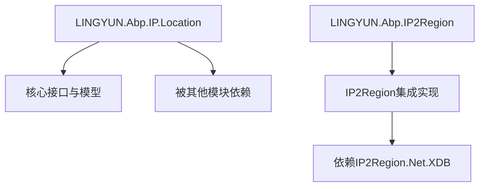
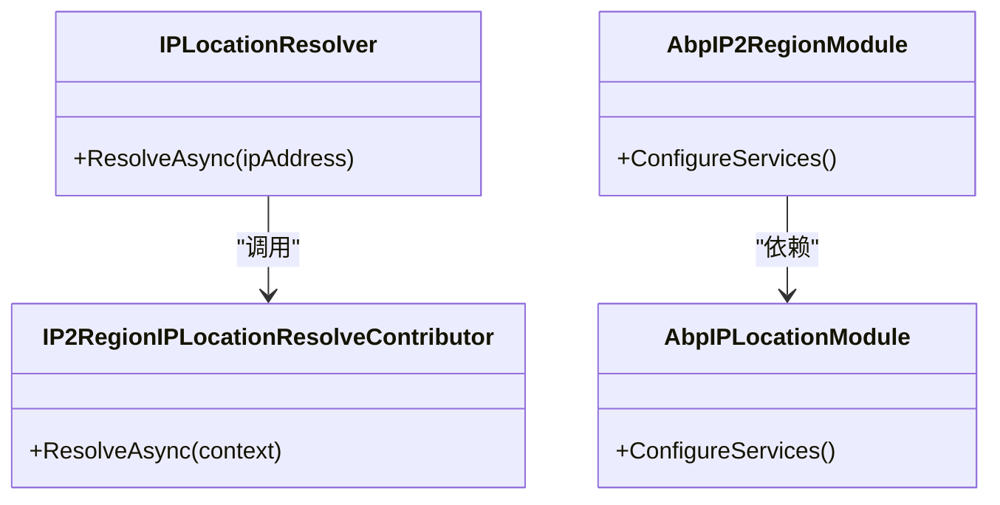
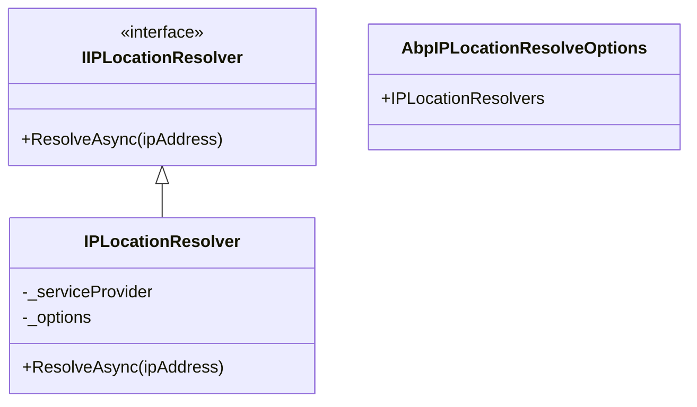
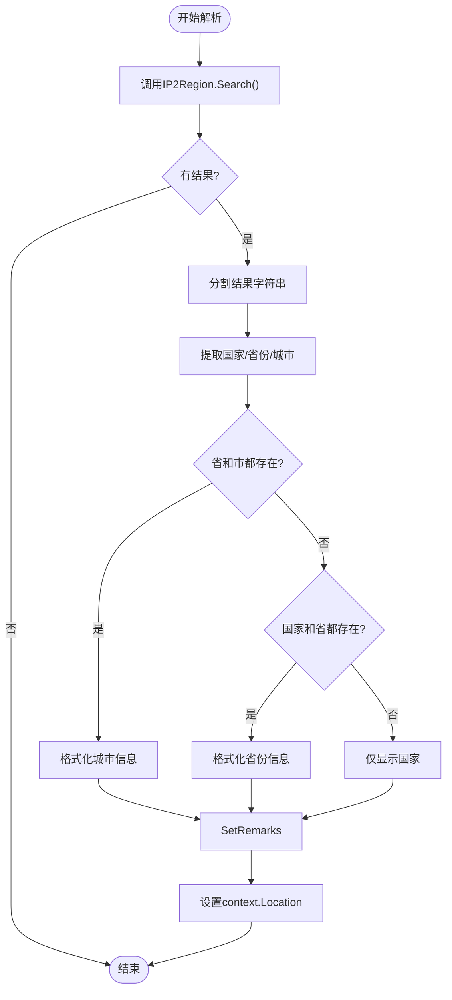
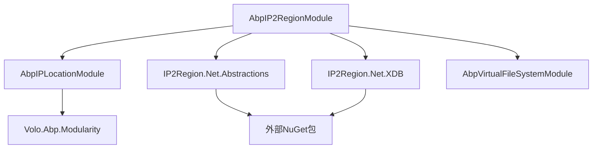

# IP 定位

<cite>
**本文档中引用的文件**  
- [AbpIPLocationModule.cs](file://aspnet-core/framework/common/LINGYUN.Abp.IP.Location/LINGYUN/Abp/IP/Location/AbpIPLocationModule.cs)
- [IPLocationResolver.cs](file://aspnet-core/framework/common/LINGYUN.Abp.IP.Location/LINGYUN/Abp/IP/Location/IPLocationResolver.cs)
- [AbpIPLocationResolveOptions.cs](file://aspnet-core/framework/common/LINGYUN.Abp.IP.Location/LINGYUN/Abp/IP/Location/AbpIPLocationResolveOptions.cs)
- [IP2RegionIPLocationResolveContributor.cs](file://aspnet-core/framework/common/LINGYUN.Abp.IP2Region/LINGYUN/Abp/IP2Region/IP2RegionIPLocationResolveContributor.cs)
- [AbpIP2RegionModule.cs](file://aspnet-core/framework/common/LINGYUN.Abp.IP2Region/LINGYUN/Abp/IP2Region/AbpIP2RegionModule.cs)
- [IPLocation.cs](file://aspnet-core/framework/common/LINGYUN.Abp.IP.Location/LINGYUN/Abp/IP/Location/IPLocation.cs)
- [IPLocationResolveResult.cs](file://aspnet-core/framework/common/LINGYUN.Abp.IP.Location/LINGYUN/Abp/IP/Location/IPLocationResolveResult.cs)
</cite>

## 目录
1. [简介](#简介)
2. [项目结构](#项目结构)
3. [核心组件](#核心组件)
4. [架构概述](#架构概述)
5. [详细组件分析](#详细组件分析)
6. [依赖分析](#依赖分析)
7. [性能考虑](#性能考虑)
8. [故障排除指南](#故障排除指南)
9. [结论](#结论)

## 简介
本文档深入解释了IP定位功能的实现机制，重点介绍基于IP2Region库的地理位置解析和缓存策略。文档详细描述了IP定位的技术架构、配置方式和使用场景，为开发者提供位置服务的最佳实践指南。通过实际代码示例，展示如何获取客户端IP地址并解析其地理位置信息。

## 项目结构
IP定位功能主要由两个模块组成：`LINGYUN.Abp.IP.Location` 和 `LINGYUN.Abp.IP2Region`。前者定义了IP定位的核心接口和数据结构，后者实现了基于IP2Region库的具体解析逻辑。



**图示来源**
- [AbpIPLocationModule.cs](file://aspnet-core/framework/common/LINGYUN.Abp.IP.Location/LINGYUN/Abp/IP/Location/AbpIPLocationModule.cs)
- [AbpIP2RegionModule.cs](file://aspnet-core/framework/common/LINGYUN.Abp.IP2Region/LINGYUN/Abp/IP2Region/AbpIP2RegionModule.cs)

**节来源**
- [AbpIPLocationModule.cs](file://aspnet-core/framework/common/LINGYUN.Abp.IP.Location/LINGYUN/Abp/IP/Location/AbpIPLocationModule.cs)
- [AbpIP2RegionModule.cs](file://aspnet-core/framework/common/LINGYUN.Abp.IP2Region/LINGYUN/Abp/IP2Region/AbpIP2RegionModule.cs)

## 核心组件
IP定位系统采用模块化设计，核心组件包括IP地址解析器、地理位置模型和解析贡献者。系统支持多级解析策略，可通过配置添加不同的解析实现。

**节来源**
- [IPLocationResolver.cs](file://aspnet-core/framework/common/LINGYUN.Abp.IP.Location/LINGYUN/Abp/IP/Location/IPLocationResolver.cs)
- [IPLocation.cs](file://aspnet-core/framework/common/LINGYUN.Abp.IP.Location/LINGYUN/Abp/IP/Location/IPLocation.cs)
- [IPLocationResolveResult.cs](file://aspnet-core/framework/common/LINGYUN.Abp.IP.Location/LINGYUN/Abp/IP/Location/IPLocationResolveResult.cs)

## 架构概述
系统采用分层架构设计，上层模块依赖下层提供的基础服务。IP2Region模块依赖于IP.Location模块定义的契约，并通过虚拟文件系统加载IP数据库。



**图示来源**
- [AbpIPLocationModule.cs](file://aspnet-core/framework/common/LINGYUN.Abp.IP.Location/LINGYUN/Abp/IP/Location/AbpIPLocationModule.cs)
- [AbpIP2RegionModule.cs](file://aspnet-core/framework/common/LINGYUN.Abp.IP2Region/LINGYUN/Abp/IP2Region/AbpIP2RegionModule.cs)

## 详细组件分析

### IP定位解析器分析
IP定位解析器是系统的核心服务，负责协调多个解析贡献者完成IP地址到地理位置的转换。

#### 对象导向组件：


**图示来源**
- [IPLocationResolver.cs](file://aspnet-core/framework/common/LINGYUN.Abp.IP.Location/LINGYUN/Abp/IP/Location/IPLocationResolver.cs)
- [AbpIPLocationResolveOptions.cs](file://aspnet-core/framework/common/LINGYUN.Abp.IP.Location/LINGYUN/Abp/IP/Location/AbpIPLocationResolveOptions.cs)

#### API/服务组件：
```mermaid
sequenceDiagram
participant Client as "客户端"
participant Resolver as "IPLocationResolver"
participant Context as "IPLocationResolveContext"
participant Contributor as "IP2Region贡献者"
Client->>Resolver : ResolveAsync("1.2.3.4")
Resolver->>Context : 创建上下文
loop 遍历所有解析器
Resolver->>Contributor : ResolveAsync(context)
Contributor->>Contributor : 调用IP2Region搜索
Contributor-->>Resolver : 设置解析结果
alt 已解析成功
break
end
end
Resolver-->>Client : 返回IPLocationResolveResult
```

**图示来源**
- [IPLocationResolver.cs](file://aspnet-core/framework/common/LINGYUN.Abp.IP.Location/LINGYUN/Abp/IP/Location/IPLocationResolver.cs)
- [IP2RegionIPLocationResolveContributor.cs](file://aspnet-core/framework/common/LINGYUN.Abp.IP2Region/LINGYUN/Abp/IP2Region/IP2RegionIPLocationResolveContributor.cs)

**节来源**
- [IPLocationResolver.cs](file://aspnet-core/framework/common/LINGYUN.Abp.IP.Location/LINGYUN/Abp/IP/Location/IPLocationResolver.cs)
- [IP2RegionIPLocationResolveContributor.cs](file://aspnet-core/framework/common/LINGYUN.Abp.IP2Region/LINGYUN/Abp/IP2Region/IP2RegionIPLocationResolveContributor.cs)

### IP2Region集成分析
IP2Region集成组件负责具体实现IP地址到地理位置的映射解析。

#### 复杂逻辑组件：


**图示来源**
- [IP2RegionIPLocationResolveContributor.cs](file://aspnet-core/framework/common/LINGYUN.Abp.IP2Region/LINGYUN/Abp/IP2Region/IP2RegionIPLocationResolveContributor.cs)

**节来源**
- [IP2RegionIPLocationResolveContributor.cs](file://aspnet-core/framework/common/LINGYUN.Abp.IP2Region/LINGYUN/Abp/IP2Region/IP2RegionIPLocationResolveContributor.cs)

## 依赖分析
IP定位系统具有清晰的依赖关系，各组件之间耦合度低，易于扩展和维护。



**图示来源**
- [AbpIP2RegionModule.cs](file://aspnet-core/framework/common/LINGYUN.Abp.IP2Region/LINGYUN/Abp/IP2Region/AbpIP2RegionModule.cs)
- [AbpIPLocationModule.cs](file://aspnet-core/framework/common/LINGYUN.Abp.IP.Location/LINGYUN/Abp/IP/Location/AbpIPLocationModule.cs)

**节来源**
- [AbpIP2RegionModule.cs](file://aspnet-core/framework/common/LINGYUN.Abp.IP2Region/LINGYUN/Abp/IP2Region/AbpIP2RegionModule.cs)
- [AbpIPLocationModule.cs](file://aspnet-core/framework/common/LINGYUN.Abp.IP.Location/LINGYUN/Abp/IP/Location/AbpIPLocationModule.cs)

## 性能考虑
IP2Region采用XDB格式的数据库文件，支持内存映射和文件缓存策略，确保了高性能的IP查询能力。系统通过单例模式注册ISearcher服务，避免重复创建搜索实例，提高了资源利用率。

## 故障排除指南
当IP定位功能无法正常工作时，请检查以下方面：
1. 确认`ip2region.xdb`数据库文件是否正确嵌入到程序集中
2. 检查虚拟文件系统配置是否正确添加了资源文件集
3. 验证IP地址格式是否符合标准IPv4格式
4. 确保AbpIP2RegionModule已正确添加到应用模块依赖中

**节来源**
- [AbpIP2RegionModule.cs](file://aspnet-core/framework/common/LINGYUN.Abp.IP2Region/LINGYUN/Abp/IP2Region/AbpIP2RegionModule.cs)
- [IP2RegionIPLocationResolveContributor.cs](file://aspnet-core/framework/common/LINGYUN.Abp.IP2Region/LINGYUN/Abp/IP2Region/IP2RegionIPLocationResolveContributor.cs)

## 结论
IP定位功能通过模块化设计实现了灵活可扩展的地理位置解析能力。基于IP2Region的实现提供了高效准确的IP查询服务，结合ABP框架的依赖注入和虚拟文件系统，确保了系统的稳定性和可维护性。开发者可以轻松集成此功能，为应用添加基于IP的位置服务能力。