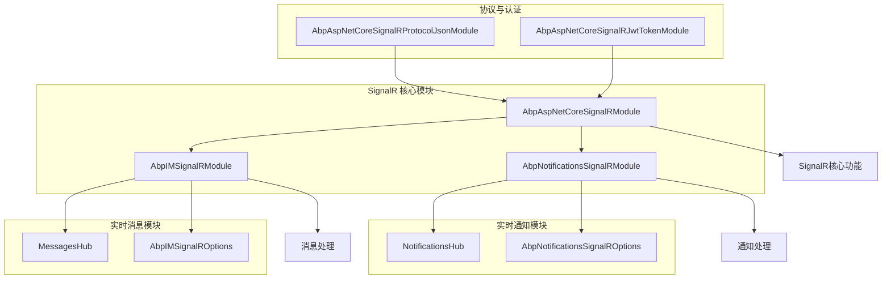
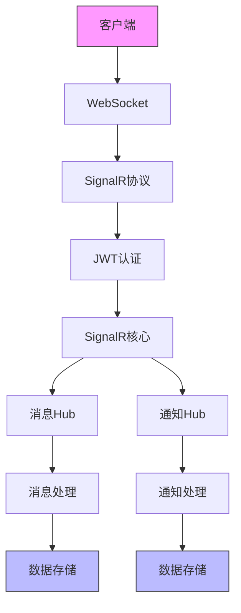
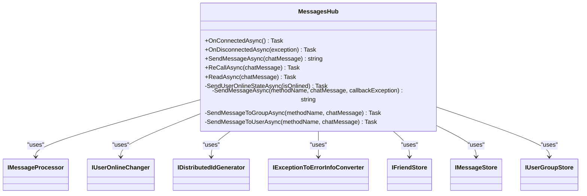
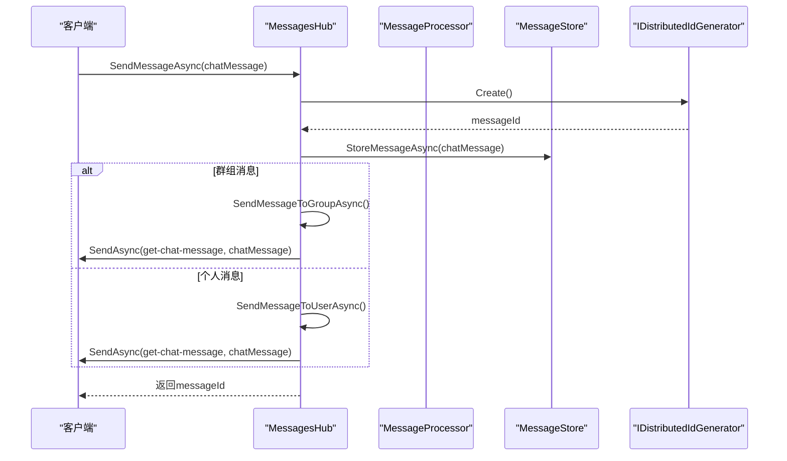
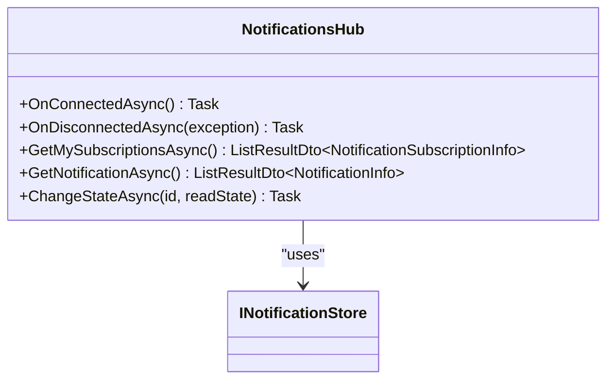
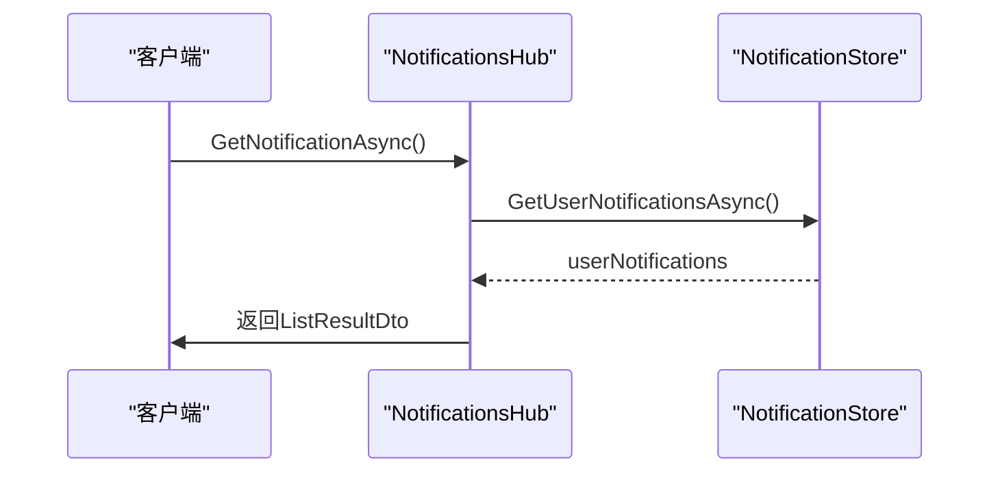
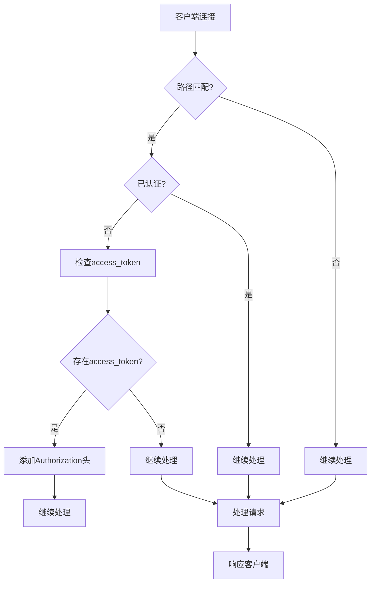
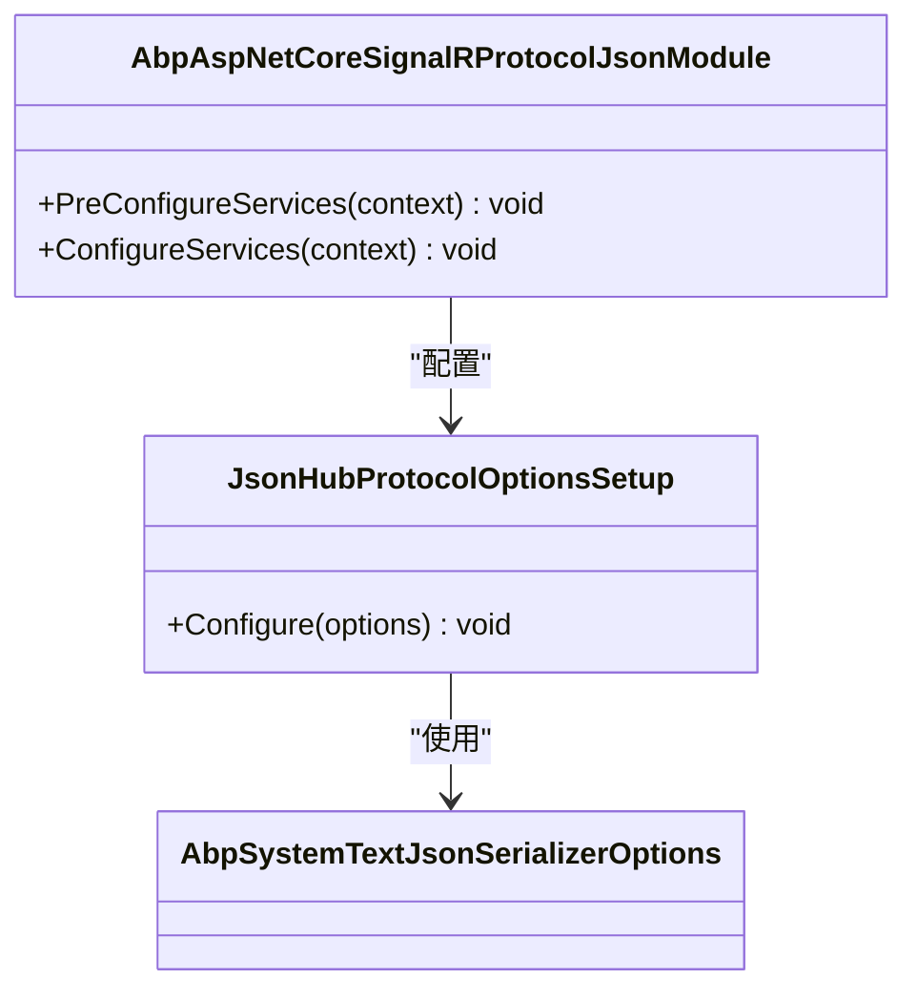
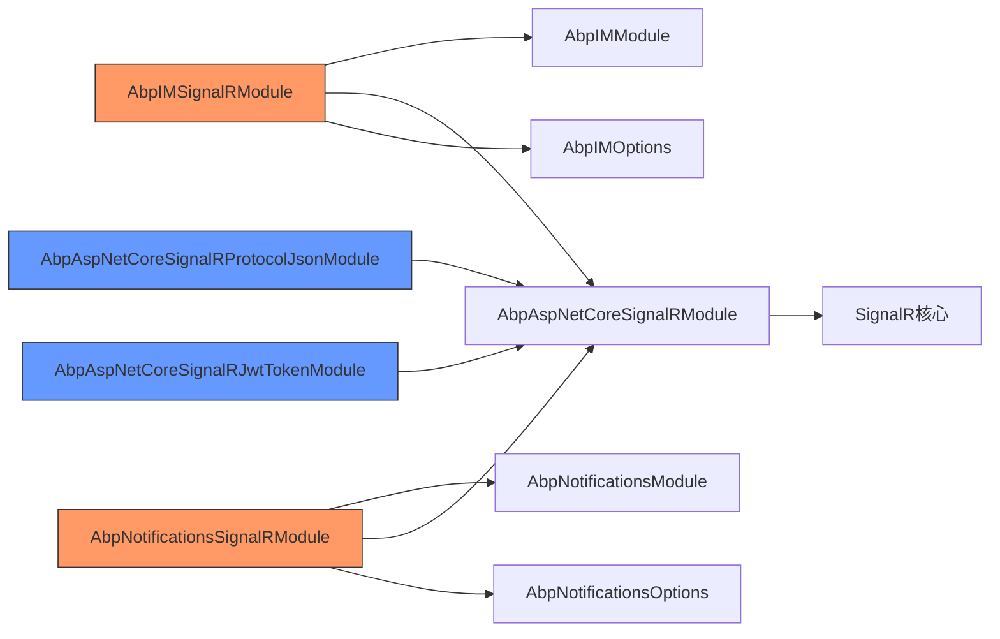

# SignalR 集成

<cite>
**本文档中引用的文件**  
- [AbpIMSignalRModule.cs](file://aspnet-core/modules/realtime-message/LINGYUN.Abp.IM.SignalR/LINGYUN/Abp/IM/SignalR/AbpIMSignalRModule.cs)
- [MessagesHub.cs](file://aspnet-core/modules/realtime-message/LINGYUN.Abp.IM.SignalR/LINGYUN/Abp/IM/SignalR/Hubs/MessagesHub.cs)
- [AbpIMSignalROptions.cs](file://aspnet-core/modules/realtime-message/LINGYUN.Abp.IM.SignalR/LINGYUN/Abp/IM/SignalR/AbpIMSignalROptions.cs)
- [NotificationsHub.cs](file://aspnet-core/modules/realtime-notifications/LINGYUN.Abp.Notifications.SignalR/LINGYUN/Abp/Notifications/SignalR/Hubs/NotificationsHub.cs)
- [AbpNotificationsSignalROptions.cs](file://aspnet-core/modules/realtime-notifications/LINGYUN.Abp.Notifications.SignalR/LINGYUN/Abp/Notifications/SignalR/AbpNotificationsSignalROptions.cs)
- [AbpAspNetCoreSignalRProtocolJsonModule.cs](file://aspnet-core/framework/common/LINGYUN.Abp.AspNetCore.SignalR.Protocol.Json/LINGYUN/Abp/AspNetCore/SignalR/Protocol/Json/AbpAspNetCoreSignalRProtocolJsonModule.cs)
- [JsonHubProtocolOptionsSetup.cs](file://aspnet-core/framework/common/LINGYUN.Abp.AspNetCore.SignalR.Protocol.Json/LINGYUN/Abp/AspNetCore/SignalR/Protocol/Json/JsonHubProtocolOptionsSetup.cs)
- [SignalRJwtTokenMiddleware.cs](file://aspnet-core/framework/common/LINGYUN.Abp.AspNetCore.SignalR/Microsoft/AspNetCore/Http/SignalRJwtTokenMiddleware.cs)
- [AbpAspNetCoreSignalRJwtTokenMapPathOptions.cs](file://aspnet-core/framework/common/LINGYUN.Abp.AspNetCore.SignalR/LINGYUN/Abp/AspNetCore/SignalR/JwtToken/AbpAspNetCoreSignalRJwtTokenMapPathOptions.cs)
- [SignalRJwtTokenApplicationBuilderExtensions.cs](file://aspnet-core/framework/common/LINGYUN.Abp.AspNetCore.SignalR/Microsoft/AspNetCore/Builder/SignalRJwtTokenApplicationBuilderExtensions.cs)
- [AbpAspNetCoreSignalRJwtTokenModule.cs](file://aspnet-core/framework/common/LINGYUN.Abp.AspNetCore.SignalR/LINGYUN/Abp/AspNetCore/SignalR/JwtToken/AbpAspNetCoreSignalRJwtTokenModule.cs)
</cite>

## 目录
1. [简介](#简介)
2. [项目结构](#项目结构)
3. [核心组件](#核心组件)
4. [架构概述](#架构概述)
5. [详细组件分析](#详细组件分析)
6. [依赖分析](#依赖分析)
7. [性能考虑](#性能考虑)
8. [故障排除指南](#故障排除指南)
9. [结论](#结论)

## 简介
本文档详细介绍了SignalR在ABP框架中的集成实现，重点阐述了JWT令牌认证、消息协议配置和WebSocket通信优化等关键技术。文档深入分析了实时消息和通知系统的实现机制，为开发者提供了SignalR使用的最佳实践指南。通过本指南，开发者可以了解如何在应用中集成和使用SignalR进行实时通信，包括客户端连接、服务器端推送和错误处理等关键功能。

## 项目结构
SignalR集成在项目中通过多个模块实现，主要分布在framework/common和modules/realtime-message、modules/realtime-notifications目录下。这种模块化设计使得SignalR功能可以灵活地集成到不同的业务场景中。

**Diagram sources**
- [AbpIMSignalRModule.cs](file://aspnet-core/modules/realtime-message/LINGYUN.Abp.IM.SignalR/LINGYUN/Abp/IM/SignalR/AbpIMSignalRModule.cs)
- [AbpAspNetCoreSignalRProtocolJsonModule.cs](file://aspnet-core/framework/common/LINGYUN.Abp.AspNetCore.SignalR.Protocol.Json/LINGYUN/Abp/AspNetCore/SignalR/Protocol/Json/AbpAspNetCoreSignalRProtocolJsonModule.cs)
- [AbpAspNetCoreSignalRJwtTokenModule.cs](file://aspnet-core/framework/common/LINGYUN.Abp.AspNetCore.SignalR/LINGYUN/Abp/AspNetCore/SignalR/JwtToken/AbpAspNetCoreSignalRJwtTokenModule.cs)

**Section sources**
- [AbpIMSignalRModule.cs](file://aspnet-core/modules/realtime-message/LINGYUN.Abp.IM.SignalR/LINGYUN/Abp/IM/SignalR/AbpIMSignalRModule.cs)
- [AbpAspNetCoreSignalRProtocolJsonModule.cs](file://aspnet-core/framework/common/LINGYUN.Abp.AspNetCore.SignalR.Protocol.Json/LINGYUN/Abp/AspNetCore/SignalR/Protocol/Json/AbpAspNetCoreSignalRProtocolJsonModule.cs)
- [AbpAspNetCoreSignalRJwtTokenModule.cs](file://aspnet-core/framework/common/LINGYUN.Abp.AspNetCore.SignalR/LINGYUN/Abp/AspNetCore/SignalR/JwtToken/AbpAspNetCoreSignalRJwtTokenModule.cs)

## 核心组件
SignalR集成的核心组件包括消息Hub、通知Hub、JWT令牌认证中间件和JSON协议配置模块。这些组件共同构成了实时通信的基础架构。

**Section sources**
- [MessagesHub.cs](file://aspnet-core/modules/realtime-message/LINGYUN.Abp.IM.SignalR/LINGYUN/Abp/IM/SignalR/Hubs/MessagesHub.cs)
- [NotificationsHub.cs](file://aspnet-core/modules/realtime-notifications/LINGYUN.Abp.Notifications.SignalR/LINGYUN/Abp/Notifications/SignalR/Hubs/NotificationsHub.cs)
- [SignalRJwtTokenMiddleware.cs](file://aspnet-core/framework/common/LINGYUN.Abp.AspNetCore.SignalR/Microsoft/AspNetCore/Http/SignalRJwtTokenMiddleware.cs)
- [JsonHubProtocolOptionsSetup.cs](file://aspnet-core/framework/common/LINGYUN.Abp.AspNetCore.SignalR.Protocol.Json/LINGYUN/Abp/AspNetCore/SignalR/Protocol/Json/JsonHubProtocolOptionsSetup.cs)

## 架构概述
SignalR集成采用分层架构设计，从底层协议到上层业务逻辑形成了完整的实时通信解决方案。架构分为四个主要层次：协议层、认证层、核心层和应用层。

**Diagram sources**
- [MessagesHub.cs](file://aspnet-core/modules/realtime-message/LINGYUN.Abp.IM.SignalR/LINGYUN/Abp/IM/SignalR/Hubs/MessagesHub.cs)
- [NotificationsHub.cs](file://aspnet-core/modules/realtime-notifications/LINGYUN.Abp.Notifications.SignalR/LINGYUN/Abp/Notifications/SignalR/Hubs/NotificationsHub.cs)
- [SignalRJwtTokenMiddleware.cs](file://aspnet-core/framework/common/LINGYUN.Abp.AspNetCore.SignalR/Microsoft/AspNetCore/Http/SignalRJwtTokenMiddleware.cs)

## 详细组件分析

### 消息系统分析
消息系统通过MessagesHub实现，提供了完整的实时消息通信功能，包括消息发送、撤回和已读状态更新。

#### 消息Hub类图

**Diagram sources**
- [MessagesHub.cs](file://aspnet-core/modules/realtime-message/LINGYUN.Abp.IM.SignalR/LINGYUN/Abp/IM/SignalR/Hubs/MessagesHub.cs)

#### 消息发送序列图

**Diagram sources**
- [MessagesHub.cs](file://aspnet-core/modules/realtime-message/LINGYUN.Abp.IM.SignalR/LINGYUN/Abp/IM/SignalR/Hubs/MessagesHub.cs)

### 通知系统分析
通知系统通过NotificationsHub实现，提供了通知订阅、获取和状态变更功能。

#### 通知Hub类图

**Diagram sources**
- [NotificationsHub.cs](file://aspnet-core/modules/realtime-notifications/LINGYUN.Abp.Notifications.SignalR/LINGYUN/Abp/Notifications/SignalR/Hubs/NotificationsHub.cs)

#### 通知获取序列图

**Diagram sources**
- [NotificationsHub.cs](file://aspnet-core/modules/realtime-notifications/LINGYUN.Abp.Notifications.SignalR/LINGYUN/Abp/Notifications/SignalR/Hubs/NotificationsHub.cs)

### 认证与协议分析

#### JWT令牌认证流程

**Diagram sources**
- [SignalRJwtTokenMiddleware.cs](file://aspnet-core/framework/common/LINGYUN.Abp.AspNetCore.SignalR/Microsoft/AspNetCore/Http/SignalRJwtTokenMiddleware.cs)

#### JSON协议配置

**Diagram sources**
- [AbpAspNetCoreSignalRProtocolJsonModule.cs](file://aspnet-core/framework/common/LINGYUN.Abp.AspNetCore.SignalR.Protocol.Json/LINGYUN/Abp/AspNetCore/SignalR/Protocol/Json/AbpAspNetCoreSignalRProtocolJsonModule.cs)
- [JsonHubProtocolOptionsSetup.cs](file://aspnet-core/framework/common/LINGYUN.Abp.AspNetCore.SignalR.Protocol.Json/LINGYUN/Abp/AspNetCore/SignalR/Protocol/Json/JsonHubProtocolOptionsSetup.cs)

**Section sources**
- [AbpAspNetCoreSignalRProtocolJsonModule.cs](file://aspnet-core/framework/common/LINGYUN.Abp.AspNetCore.SignalR.Protocol.Json/LINGYUN/Abp/AspNetCore/SignalR/Protocol/Json/AbpAspNetCoreSignalRProtocolJsonModule.cs)
- [JsonHubProtocolOptionsSetup.cs](file://aspnet-core/framework/common/LINGYUN.Abp.AspNetCore.SignalR.Protocol.Json/LINGYUN/Abp/AspNetCore/SignalR/Protocol/Json/JsonHubProtocolOptionsSetup.cs)
- [SignalRJwtTokenMiddleware.cs](file://aspnet-core/framework/common/LINGYUN.Abp.AspNetCore.SignalR/Microsoft/AspNetCore/Http/SignalRJwtTokenMiddleware.cs)
- [AbpAspNetCoreSignalRJwtTokenMapPathOptions.cs](file://aspnet-core/framework/common/LINGYUN.Abp.AspNetCore.SignalR/LINGYUN/Abp/AspNetCore/SignalR/JwtToken/AbpAspNetCoreSignalRJwtTokenMapPathOptions.cs)

## 依赖分析
SignalR集成依赖于多个ABP框架模块和外部组件，形成了复杂的依赖关系网络。

**Diagram sources**
- [AbpIMSignalRModule.cs](file://aspnet-core/modules/realtime-message/LINGYUN.Abp.IM.SignalR/LINGYUN/Abp/IM/SignalR/AbpIMSignalRModule.cs)
- [AbpNotificationsSignalRModule.cs](file://aspnet-core/modules/realtime-notifications/LINGYUN.Abp.Notifications.SignalR/LINGYUN/Abp/Notifications/SignalR/AbpNotificationsSignalRModule.cs)
- [AbpAspNetCoreSignalRProtocolJsonModule.cs](file://aspnet-core/framework/common/LINGYUN.Abp.AspNetCore.SignalR.Protocol.Json/LINGYUN/Abp/AspNetCore/SignalR/Protocol/Json/AbpAspNetCoreSignalRProtocolJsonModule.cs)
- [AbpAspNetCoreSignalRJwtTokenModule.cs](file://aspnet-core/framework/common/LINGYUN.Abp.AspNetCore.SignalR/LINGYUN/Abp/AspNetCore/SignalR/JwtToken/AbpAspNetCoreSignalRJwtTokenModule.cs)

**Section sources**
- [AbpIMSignalRModule.cs](file://aspnet-core/modules/realtime-message/LINGYUN.Abp.IM.SignalR/LINGYUN/Abp/IM/SignalR/AbpIMSignalRModule.cs)
- [AbpNotificationsSignalRModule.cs](file://aspnet-core/modules/realtime-notifications/LINGYUN.Abp.Notifications.SignalR/LINGYUN/Abp/Notifications/SignalR/AbpNotificationsSignalRModule.cs)
- [AbpAspNetCoreSignalRProtocolJsonModule.cs](file://aspnet-core/framework/common/LINGYUN.Abp.AspNetCore.SignalR.Protocol.Json/LINGYUN/Abp/AspNetCore/SignalR/Protocol/Json/AbpAspNetCoreSignalRProtocolJsonModule.cs)
- [AbpAspNetCoreSignalRJwtTokenModule.cs](file://aspnet-core/framework/common/LINGYUN.Abp.AspNetCore.SignalR/LINGYUN/Abp/AspNetCore/SignalR/JwtToken/AbpAspNetCoreSignalRJwtTokenModule.cs)

## 性能考虑
SignalR集成在设计时考虑了多项性能优化措施：

1. **连接管理**：通过OnConnectedAsync和OnDisconnectedAsync方法有效管理用户在线状态
2. **消息分组**：使用SignalR的Groups功能实现群组消息的高效广播
3. **ID生成**：使用分布式ID生成器避免数据库主键冲突
4. **异常处理**：通过异步异常处理避免阻塞主线程
5. **协议优化**：使用JSON协议并配置自定义序列化选项提高传输效率

这些优化措施确保了系统在高并发场景下的稳定性和响应速度。

## 故障排除指南
在使用SignalR集成时可能遇到以下常见问题及解决方案：

1. **连接失败**：检查JWT令牌是否正确传递，确保access_token参数在查询字符串中
2. **消息无法接收**：验证客户端方法名称是否与服务器端配置一致
3. **认证问题**：确认SignalR路径是否在JWT令牌映射路径中配置
4. **性能问题**：检查消息广播范围是否过大，考虑使用更精细的分组策略
5. **序列化错误**：确保JSON协议配置正确，检查自定义序列化选项

通过监控和日志记录可以快速定位和解决这些问题。

## 结论
SignalR集成在ABP框架中提供了强大而灵活的实时通信能力。通过模块化设计，将消息系统和通知系统分离，同时共享核心的SignalR功能。JWT令牌认证机制确保了通信的安全性，而JSON协议配置则优化了数据传输效率。这种设计不仅满足了当前的业务需求，还为未来的扩展提供了良好的基础。开发者可以基于此架构快速构建各种实时应用场景，如即时通讯、通知推送和状态同步等。