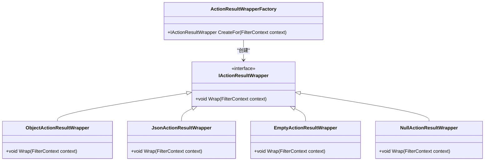

# 包装器与异常处理

<cite>
**本文档引用的文件**
- [WrapResult.cs](file://aspnet-core/framework/common/LINGYUN.Abp.Wrapper/LINGYUN/Abp/Wrapper/WrapResult.cs)
- [WrapResult`T.cs](file://aspnet-core/framework/common/LINGYUN.Abp.Wrapper/LINGYUN/Abp/Wrapper/WrapResult`T.cs)
- [AbpWrapperOptions.cs](file://aspnet-core/framework/common/LINGYUN.Abp.Wrapper/LINGYUN/Abp/Wrapper/AbpWrapperOptions.cs)
- [ExceptionWrapContext.cs](file://aspnet-core/framework/common/LINGYUN.Abp.Wrapper/LINGYUN/Abp/Wrapper/ExceptionWrapContext.cs)
- [DefaultExceptionWrapHandler.cs](file://aspnet-core/framework/common/LINGYUN.Abp.Wrapper/LINGYUN/Abp/Wrapper/DefaultExceptionWrapHandler.cs)
- [AbpAspNetCoreMvcWrapperModule.cs](file://aspnet-core/framework/mvc/LINGYUN.Abp.AspNetCore.Mvc.Wrapper/LINGYUN/Abp/AspNetCore/Mvc/Wrapper/AbpAspNetCoreMvcWrapperModule.cs)
- [AbpWrapResultFilter.cs](file://aspnet-core/framework/mvc/LINGYUN.Abp.AspNetCore.Mvc.Wrapper/LINGYUN/Abp/AspNetCore/Mvc/Wrapper/Filters/AbpWrapResultFilter.cs)
- [AbpExceptionWrapResultFilter.cs](file://aspnet-core/framework/mvc/LINGYUN.Abp.AspNetCore.Mvc.Wrapper/LINGYUN/Abp/AspNetCore/Mvc/Wrapper/ExceptionHandling/AbpExceptionWrapResultFilter.cs)
- [ObjectActionResultWrapper.cs](file://aspnet-core/framework/mvc/LINGYUN.Abp.AspNetCore.Mvc.Wrapper/LINGYUN/Abp/AspNetCore/Mvc/Wrapper/Wraping/ObjectActionResultWrapper.cs)
- [EmptyActionResultWrapper.cs](file://aspnet-core/framework/mvc/LINGYUN.Abp.AspNetCore.Mvc.Wrapper/LINGYUN/Abp/AspNetCore/Mvc/Wrapper/Wraping/EmptyActionResultWrapper.cs)
- [JsonActionResultWrapper.cs](file://aspnet-core/framework/mvc/LINGYUN.Abp.AspNetCore.Mvc.Wrapper/LINGYUN/Abp/AspNetCore/Mvc/Wrapper/Wraping/JsonActionResultWrapper.cs)
- [IgnoreWrapResultAttribute.cs](file://aspnet-core/framework/common/LINGYUN.Abp.Wrapper/LINGYUN/Abp/Wrapper/IgnoreWrapResultAttribute.cs)
- [IWrapDisabled.cs](file://aspnet-core/framework/common/LINGYUN.Abp.Wrapper/LINGYUN/Abp/Wrapper/IWrapDisabled.cs)
</cite>

## 目录
1. [简介](#简介)
2. [项目结构](#项目结构)
3. [核心组件](#核心组件)
4. [架构概述](#架构概述)
5. [详细组件分析](#详细组件分析)
6. [依赖分析](#依赖分析)
7. [性能考虑](#性能考虑)
8. [故障排除指南](#故障排除指南)
9. [结论](#结论)

## 简介
本文档深入探讨了ABP框架中统一响应包装和全局异常处理的实现机制。该功能通过LINGYUN.Abp.Wrapper模块提供，旨在标准化API响应格式、定义错误码体系并实现异常拦截。文档将详细描述其技术架构、配置方式和使用场景，为开发者提供API一致性设计的最佳实践指南。

## 项目结构
包装器与异常处理功能分布在多个相关模块中，主要位于aspnet-core/framework目录下。核心功能由LINGYUN.Abp.Wrapper基础模块提供，而MVC特定的实现则在LINGYUN.Abp.AspNetCore.Mvc.Wrapper模块中。

**图示来源**
- [AbpWrapperModule.cs](file://aspnet-core/framework/common/LINGYUN.Abp.Wrapper/LINGYUN/Abp/Wrapper/AbpWrapperModule.cs)
- [AbpAspNetCoreMvcWrapperModule.cs](file://aspnet-core/framework/mvc/LINGYUN.Abp.AspNetCore.Mvc.Wrapper/LINGYUN/Abp/AspNetCore/Mvc/Wrapper/AbpAspNetCoreMvcWrapperModule.cs)

**本节来源**
- [AbpWrapperModule.cs](file://aspnet-core/framework/common/LINGYUN.Abp.Wrapper/LINGYUN/Abp/Wrapper/AbpWrapperModule.cs)
- [AbpExceptionHandlingModule.cs](file://aspnet-core/framework/common/LINGYUN.Abp.ExceptionHandling/LINGYUN/Abp/ExceptionHandling/AbpExceptionHandlingModule.cs)

## 核心组件
包装器与异常处理系统由几个关键组件构成：响应包装结果类(WrapResult)、包装选项(AbpWrapperOptions)、异常包装上下文(ExceptionWrapContext)和异常处理器(DefaultExceptionWrapHandler)。这些组件协同工作，确保所有API响应都遵循统一的格式标准，并对异常情况进行一致的处理。

**本节来源**
- [WrapResult.cs](file://aspnet-core/framework/common/LINGYUN.Abp.Wrapper/LINGYUN/Abp/Wrapper/WrapResult.cs)
- [AbpWrapperOptions.cs](file://aspnet-core/framework/common/LINGYUN.Abp.Wrapper/LINGYUN/Abp/Wrapper/AbpWrapperOptions.cs)
- [ExceptionWrapContext.cs](file://aspnet-core/framework/common/LINGYUN.Abp.Wrapper/LINGYUN/Abp/Wrapper/ExceptionWrapContext.cs)
- [DefaultExceptionWrapHandler.cs](file://aspnet-core/framework/common/LINGYUN.Abp.Wrapper/LINGYUN/Abp/Wrapper/DefaultExceptionWrapHandler.cs)

## 架构概述
整个包装器与异常处理系统采用分层架构设计，从HTTP请求进入开始，经过一系列过滤器和处理器，最终生成标准化的响应。系统通过依赖注入机制灵活配置，支持自定义异常处理器和多种忽略策略。

**图示来源**
- [AbpWrapResultFilter.cs](file://aspnet-core/framework/mvc/LINGYUN.Abp.AspNetCore.Mvc.Wrapper/LINGYUN/Abp/AspNetCore/Mvc/Wrapper/Filters/AbpWrapResultFilter.cs)
- [AbpExceptionWrapResultFilter.cs](file://aspnet-core/framework/mvc/LINGYUN.Abp.AspNetCore.Mvc.Wrapper/LINGYUN/Abp/AspNetCore/Mvc/Wrapper/ExceptionHandling/AbpExceptionWrapResultFilter.cs)
- [DefaultHttpResponseWrapper.cs](file://aspnet-core/framework/common/LINGYUN.Abp.AspNetCore.Wrapper/LINGYUN/Abp/AspNetCore/Wrapper/DefaultHttpResponseWrapper.cs)

## 详细组件分析

### 响应包装结果分析
响应包装结果类是整个系统的核心数据结构，定义了统一的响应格式。

#### 类图

**图示来源**
- [WrapResult.cs](file://aspnet-core/framework/common/LINGYUN.Abp.Wrapper/LINGYUN/Abp/Wrapper/WrapResult.cs)
- [WrapResult`T.cs](file://aspnet-core/framework/common/LINGYUN.Abp.Wrapper/LINGYUN/Abp/Wrapper/WrapResult`T.cs)

#### 配置选项分析
AbpWrapperOptions类提供了丰富的配置选项，允许开发者根据需要定制包装行为。

| 配置项 | 描述 | 默认值 |
|-------|------|-------|
| IsEnabled | 是否启用包装器 | false |
| CodeWithSuccess | 成功时返回代码 | "0" |
| CodeWithUnhandled | 未处理异常代码 | "500" |
| ErrorWithEmptyResult | 资源为空时是否提示错误 | false |
| HttpStatusCode | 包装后的返回状态码 | 200 (OK) |
| IgnorePrefixUrls | 忽略的URL前缀列表 | - |
| IgnoreReturnTypes | 忽略的返回类型列表 | IRemoteStreamContent等 |

**本节来源**
- [AbpWrapperOptions.cs](file://aspnet-core/framework/common/LINGYUN.Abp.Wrapper/LINGYUN/Abp/Wrapper/AbpWrapperOptions.cs)

### 异常处理机制分析
异常处理机制通过异常包装上下文和处理器工厂实现，提供了灵活的异常处理能力。

#### 异常处理流程

**图示来源**
- [ExceptionWrapContext.cs](file://aspnet-core/framework/common/LINGYUN.Abp.Wrapper/LINGYUN/Abp/Wrapper/ExceptionWrapContext.cs)
- [DefaultExceptionWrapHandler.cs](file://aspnet-core/framework/common/LINGYUN.Abp.Wrapper/LINGYUN/Abp/Wrapper/DefaultExceptionWrapHandler.cs)
- [ExceptionWrapHandlerFactory.cs](file://aspnet-core/framework/common/LINGYUN.Abp.Wrapper/LINGYUN/Abp/Wrapper/ExceptionWrapHandlerFactory.cs)

#### 自定义异常处理器接口

**本节来源**
- [IExceptionWrapHandler.cs](file://aspnet-core/framework/common/LINGYUN.Abp.Wrapper/LINGYUN/Abp/Wrapper/IExceptionWrapHandler.cs)
- [DefaultExceptionWrapHandler.cs](file://aspnet-core/framework/common/LINGYUN.Abp.Wrapper/LINGYUN/Abp/Wrapper/DefaultExceptionWrapHandler.cs)
- [FakeExceptionWrapHandler.cs](file://aspnet-core/tests/LINGYUN.Abp.Wrapper.Tests/LINGYUN/Abp/Wrapper/FakeExceptionWrapHandler.cs)

### 包装器实现分析
包装器实现基于ASP.NET Core的过滤器机制，通过不同的包装器处理不同类型的结果。

#### 包装器工厂模式

**图示来源**
- [IActionResultWrapper.cs](file://aspnet-core/framework/mvc/LINGYUN.Abp.AspNetCore.Mvc.Wrapper/LINGYUN/Abp/AspNetCore/Mvc/Wrapper/Wraping/IActionResultWrapper.cs)
- [ActionResultWrapperFactory.cs](file://aspnet-core/framework/mvc/LINGYUN.Abp.AspNetCore.Mvc.Wrapper/LINGYUN/Abp/AspNetCore/Mvc/Wrapper/Wraping/ActionResultWrapperFactory.cs)
- [ObjectActionResultWrapper.cs](file://aspnet-core/framework/mvc/LINGYUN.Abp.AspNetCore.Mvc.Wrapper/LINGYUN/Abp/AspNetCore/Mvc/Wrapper/Wraping/ObjectActionResultWrapper.cs)
- [JsonActionResultWrapper.cs](file://aspnet-core/framework/mvc/LINGYUN.Abp.AspNetCore.Mvc.Wrapper/LINGYUN/Abp/AspNetCore/Mvc/Wrapper/Wraping/JsonActionResultWrapper.cs)
- [EmptyActionResultWrapper.cs](file://aspnet-core/framework/mvc/LINGYUN.Abp.AspNetCore.Mvc.Wrapper/LINGYUN/Abp/AspNetCore/Mvc/Wrapper/Wraping/EmptyActionResultWrapper.cs)

## 依赖分析
包装器与异常处理系统依赖于ABP框架的核心模块，并与其他功能模块紧密集成。

**图示来源**
- [AbpWrapperModule.cs](file://aspnet-core/framework/common/LINGYUN.Abp.Wrapper/LINGYUN/Abp/Wrapper/AbpWrapperModule.cs)
- [AbpAspNetCoreMvcWrapperModule.cs](file://aspnet-core/framework/mvc/LINGYUN.Abp.AspNetCore.Mvc.Wrapper/LINGYUN/Abp/AspNetCore/Mvc/Wrapper/AbpAspNetCoreMvcWrapperModule.cs)
- [AbpExceptionHandlingModule.cs](file://aspnet-core/framework/common/LINGYUN.Abp.ExceptionHandling/LINGYUN/Abp/ExceptionHandling/AbpExceptionHandlingModule.cs)

**本节来源**
- [AbpWrapperModule.cs](file://aspnet-core/framework/common/LINGYUN.Abp.Wrapper/LINGYUN/Abp/Wrapper/AbpWrapperModule.cs)
- [AbpAspNetCoreMvcWrapperModule.cs](file://aspnet-core/framework/mvc/LINGYUN.Abp.AspNetCore.Mvc.Wrapper/LINGYUN/Abp/AspNetCore/Mvc/Wrapper/AbpAspNetCoreMvcWrapperModule.cs)

## 性能考虑
由于包装器在每个请求的响应阶段都会执行，因此需要注意以下性能方面：

1. **序列化开销**：每次响应都需要进行JSON序列化，对于大对象可能会影响性能。
2. **内存分配**：频繁创建WrapResult对象可能导致GC压力增加。
3. **异常处理成本**：异常情况下的堆栈跟踪收集会带来额外开销。
4. **配置查找**：每次请求都需要从DI容器获取配置选项。

建议在生产环境中：
- 合理配置SendStackTraceToClients选项，避免在生产环境暴露详细堆栈信息
- 对大数据量的API考虑使用流式传输而非完整对象包装
- 定期监控GC表现，必要时优化对象池使用

## 故障排除指南
当遇到包装器相关问题时，可以参考以下常见问题及解决方案：

1. **响应未被包装**
   - 检查AbpWrapperOptions.IsEnabled是否设置为true
   - 确认控制器或方法没有使用[IgnoreWrapResult]特性
   - 检查返回类型是否在IgnoreReturnTypes列表中

2. **异常信息不正确**
   - 验证自定义异常处理器是否正确注册
   - 检查异常类型是否匹配处理器预期的类型
   - 确认本地化资源文件是否包含对应的错误消息

3. **性能下降**
   - 分析请求处理时间，定位瓶颈
   - 检查是否过度使用详细的异常信息返回
   - 考虑对高频接口优化包装逻辑

**本节来源**
- [IgnoreWrapResultAttribute.cs](file://aspnet-core/framework/common/LINGYUN.Abp.Wrapper/LINGYUN/Abp/Wrapper/IgnoreWrapResultAttribute.cs)
- [IWrapDisabled.cs](file://aspnet-core/framework/common/LINGYUN.Abp.Wrapper/LINGYUN/Abp/Wrapper/IWrapDisabled.cs)
- [AbpWrapperOptions.cs](file://aspnet-core/framework/common/LINGYUN.Abp.Wrapper/LINGYUN/Abp/Wrapper/AbpWrapperOptions.cs)

## 结论
LINGYUN.Abp.Wrapper模块提供了一套完整的API响应包装和异常处理解决方案。通过统一的响应格式、灵活的配置选项和可扩展的异常处理机制，大大提升了API的一致性和可维护性。开发者可以根据具体需求定制包装行为，同时保持系统的高性能和稳定性。