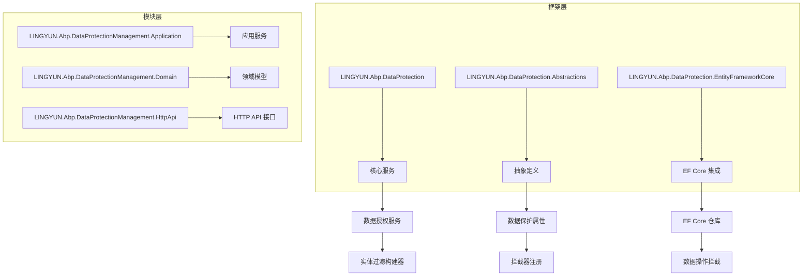
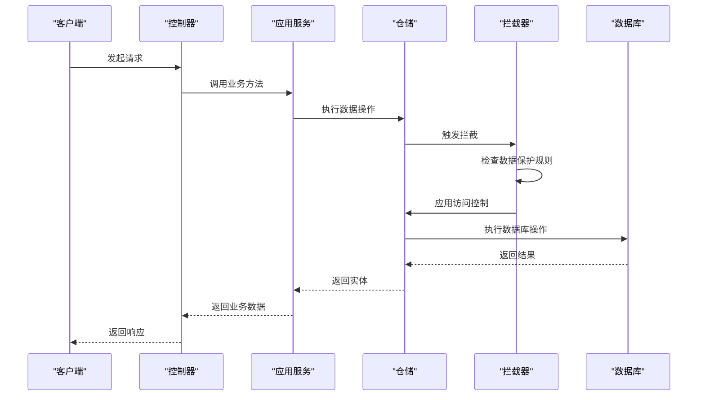
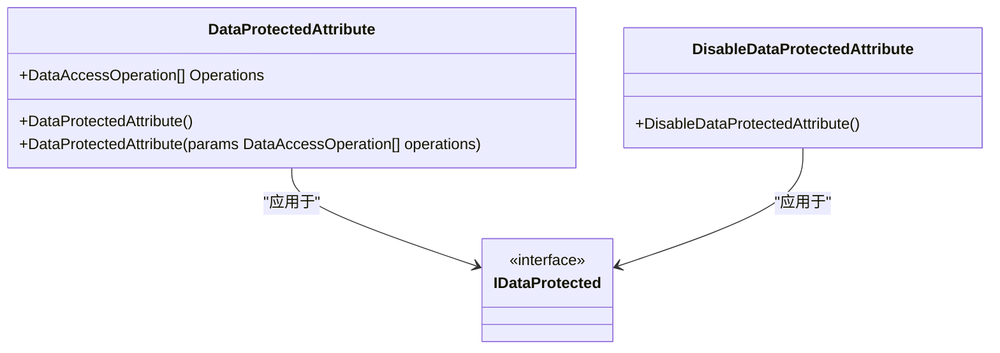
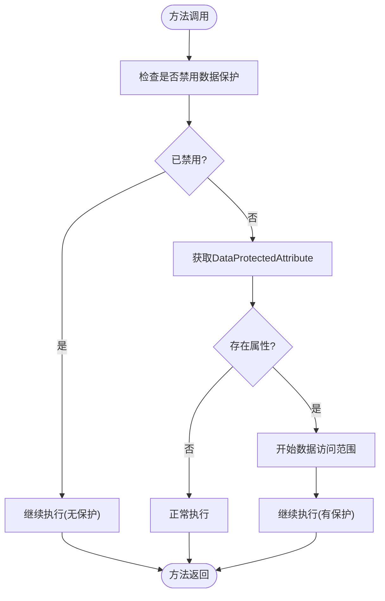
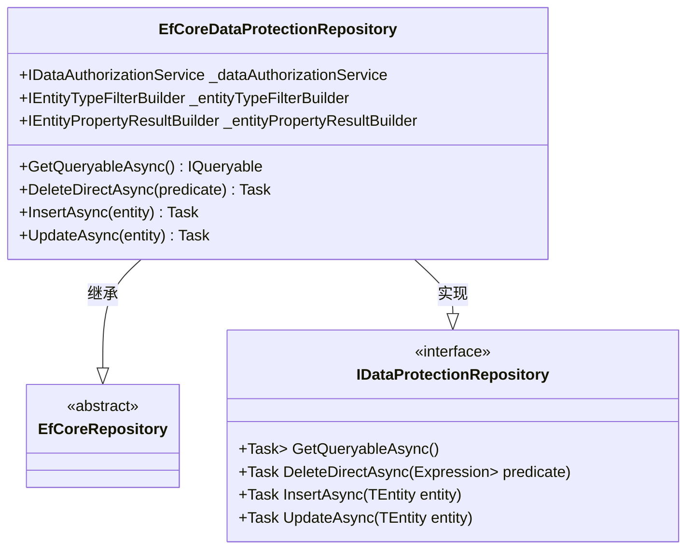
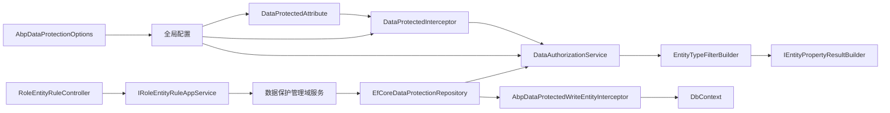

# 数据保护

<cite>
**本文档引用的文件**
- [DataProtectedAttribute.cs](file://aspnet-core/framework/data-protection/LINGYUN.Abp.DataProtection.Abstractions/LINGYUN/Abp/DataProtection/DataProtectedAttribute.cs)
- [DataAuthorizationService.cs](file://aspnet-core/framework/data-protection/LINGYUN.Abp.DataProtection/LINGYUN/Abp/DataProtection/DataAuthorizationService.cs)
- [DataProtectedInterceptor.cs](file://aspnet-core/framework/data-protection/LINGYUN.Abp.DataProtection/LINGYUN/Abp/DataProtection/DataProtectedInterceptor.cs)
- [AbpDataProtectionOptions.cs](file://aspnet-core/framework/data-protection/LINGYUN.Abp.DataProtection/LINGYUN/Abp/DataProtection/AbpDataProtectionOptions.cs)
- [EfCoreDataProtectionRepository.cs](file://aspnet-core/framework/data-protection/LINGYUN.Abp.DataProtection.EntityFrameworkCore/LINGYUN/Abp/DataProtection/EntityFrameworkCore/EfCoreDataProtectionRepository.cs)
- [RoleEntityRuleController.cs](file://aspnet-core/modules/data-protection/LINGYUN.Abp.DataProtectionManagement.HttpApi/LINGYUN/Abp/DataProtectionManagement/RoleEntityRuleController.cs)
- [Book.cs](file://aspnet-core/modules/demo/LINGYUN.Abp.Demo.Domain/LINGYUN/Abp/Demo/Books/Book.cs)
</cite>

## 目录
1. [简介](#简介)
2. [项目结构](#项目结构)
3. [核心组件](#核心组件)
4. [架构概述](#架构概述)
5. [详细组件分析](#详细组件分析)
6. [依赖关系分析](#依赖关系分析)
7. [性能考虑](#性能考虑)
8. [故障排除指南](#故障排除指南)
9. [结论](#结论)

## 简介
本文档深入探讨了 abp-next-admin 项目中的数据保护功能实现机制。该系统提供了一套完整的敏感数据加密、解密和存储策略，旨在确保应用程序的数据安全。文档详细描述了数据保护的技术架构、配置方式和使用场景，并为开发者提供了数据安全的最佳实践指南。

## 项目结构
数据保护功能在项目中通过多个模块协同工作来实现。主要包含框架层的数据保护核心功能和模块层的数据保护管理功能。



**Diagram sources**
- [DataProtectedAttribute.cs](file://aspnet-core/framework/data-protection/LINGYUN.Abp.DataProtection.Abstractions/LINGYUN/Abp/DataProtection/DataProtectedAttribute.cs)
- [DataAuthorizationService.cs](file://aspnet-core/framework/data-protection/LINGYUN.Abp.DataProtection/LINGYUN/Abp/DataProtection/DataAuthorizationService.cs)
- [EfCoreDataProtectionRepository.cs](file://aspnet-core/framework/data-protection/LINGYUN.Abp.DataProtection.EntityFrameworkCore/LINGYUN/Abp/DataProtection/EntityFrameworkCore/EfCoreDataProtectionRepository.cs)

**Section sources**
- [DataProtectedAttribute.cs](file://aspnet-core/framework/data-protection/LINGYUN.Abp.DataProtection.Abstractions/LINGYUN/Abp/DataProtection/DataProtectedAttribute.cs)
- [DataAuthorizationService.cs](file://aspnet-core/framework/data-protection/LINGYUN.Abp.DataProtection/LINGYUN/Abp/DataProtection/DataAuthorizationService.cs)
- [EfCoreDataProtectionRepository.cs](file://aspnet-core/framework/data-protection/LINGYUN.Abp.DataProtection.EntityFrameworkCore/LINGYUN/Abp/DataProtection/EntityFrameworkCore/EfCoreDataProtectionRepository.cs)

## 核心组件
数据保护系统的核心组件包括数据保护属性、数据授权服务、拦截器和EF Core仓库扩展。这些组件共同实现了对敏感数据的访问控制和保护机制。

**Section sources**
- [DataProtectedAttribute.cs](file://aspnet-core/framework/data-protection/LINGYUN.Abp.DataProtection.Abstractions/LINGYUN/Abp/DataProtection/DataProtectedAttribute.cs)
- [DataAuthorizationService.cs](file://aspnet-core/framework/data-protection/LINGYUN.Abp.DataProtection/LINGYUN/Abp/DataProtection/DataAuthorizationService.cs)
- [DataProtectedInterceptor.cs](file://aspnet-core/framework/data-protection/LINGYUN.Abp.DataProtection/LINGYUN/Abp/DataProtection/DataProtectedInterceptor.cs)

## 架构概述
数据保护系统的架构基于ABP框架的依赖注入和拦截器机制，通过AOP（面向切面编程）的方式实现对数据访问的透明保护。



**Diagram sources**
- [DataProtectedInterceptor.cs](file://aspnet-core/framework/data-protection/LINGYUN.Abp.DataProtection/LINGYUN/Abp/DataProtection/DataProtectedInterceptor.cs)
- [EfCoreDataProtectionRepository.cs](file://aspnet-core/framework/data-protection/LINGYUN.Abp.DataProtection.EntityFrameworkCore/LINGYUN/Abp/DataProtection/EntityFrameworkCore/EfCoreDataProtectionRepository.cs)

## 详细组件分析

### 数据保护属性分析
`DataProtectedAttribute` 是数据保护系统的核心特性之一，用于标记需要进行数据保护的类、方法或属性。



**Diagram sources**
- [DataProtectedAttribute.cs](file://aspnet-core/framework/data-protection/LINGYUN.Abp.DataProtection.Abstractions/LINGYUN/Abp/DataProtection/DataProtectedAttribute.cs)

**Section sources**
- [DataProtectedAttribute.cs](file://aspnet-core/framework/data-protection/LINGYUN.Abp.DataProtection.Abstractions/LINGYUN/Abp/DataProtection/DataProtectedAttribute.cs)

### 数据授权服务分析
`DataAuthorizationService` 负责执行实际的数据访问授权检查，是数据保护逻辑的核心实现。

```mermaid
flowchart TD
Start([开始]) --> BuildFilter["构建实体类型过滤器"]
BuildFilter --> CheckEmpty{"实体集合为空?"}
CheckEmpty --> |是| ReturnSuccess["返回授权成功"]
CheckEmpty --> |否| CompileExp["编译表达式"]
CompileExp --> ApplyFilter["应用过滤规则"]
ApplyFilter --> CheckAll{"所有实体都符合规则?"]
CheckAll --> |是| ReturnSuccess
CheckAll --> |否| ReturnFailed["返回授权失败"]
ReturnSuccess --> End([结束])
ReturnFailed --> End
```

**Diagram sources**
- [DataAuthorizationService.cs](file://aspnet-core/framework/data-protection/LINGYUN.Abp.DataProtection/LINGYUN/Abp/DataProtection/DataAuthorizationService.cs)

**Section sources**
- [DataAuthorizationService.cs](file://aspnet-core/framework/data-protection/LINGYUN.Abp.DataProtection/LINGYUN/Abp/DataProtection/DataAuthorizationService.cs)

### 拦截器机制分析
`DataProtectedInterceptor` 使用ABP框架的拦截器机制，在方法调用前后插入数据保护逻辑。



**Diagram sources**
- [DataProtectedInterceptor.cs](file://aspnet-core/framework/data-protection/LINGYUN.Abp.DataProtection/LINGYUN/Abp/DataProtection/DataProtectedInterceptor.cs)

**Section sources**
- [DataProtectedInterceptor.cs](file://aspnet-core/framework/data-protection/LINGYUN.Abp.DataProtection/LINGYUN/Abp/DataProtection/DataProtectedInterceptor.cs)

### EF Core 仓库扩展分析
`EfCoreDataProtectionRepository` 扩展了ABP的EF Core仓库，提供了数据保护感知的数据访问能力。



**Diagram sources**
- [EfCoreDataProtectionRepository.cs](file://aspnet-core/framework/data-protection/LINGYUN.Abp.DataProtection.EntityFrameworkCore/LINGYUN/Abp/DataProtection/EntityFrameworkCore/EfCoreDataProtectionRepository.cs)

**Section sources**
- [EfCoreDataProtectionRepository.cs](file://aspnet-core/framework/data-protection/LINGYUN.Abp.DataProtection.EntityFrameworkCore/LINGYUN/Abp/DataProtection/EntityFrameworkCore/EfCoreDataProtectionRepository.cs)

## 依赖关系分析
数据保护系统与其他ABP框架组件有着紧密的依赖关系，形成了一个完整的生态系统。



**Diagram sources**
- [DataProtectedAttribute.cs](file://aspnet-core/framework/data-protection/LINGYUN.Abp.DataProtection.Abstractions/LINGYUN/Abp/DataProtection/DataProtectedAttribute.cs)
- [DataProtectedInterceptor.cs](file://aspnet-core/framework/data-protection/LINGYUN.Abp.DataProtection/LINGYUN/Abp/DataProtection/DataProtectedInterceptor.cs)
- [DataAuthorizationService.cs](file://aspnet-core/framework/data-protection/LINGYUN.Abp.DataProtection/LINGYUN/Abp/DataProtection/DataAuthorizationService.cs)
- [EfCoreDataProtectionRepository.cs](file://aspnet-core/framework/data-protection/LINGYUN.Abp.DataProtection.EntityFrameworkCore/LINGYUN/Abp/DataProtection/EntityFrameworkCore/EfCoreDataProtectionRepository.cs)
- [RoleEntityRuleController.cs](file://aspnet-core/modules/data-protection/LINGYUN.Abp.DataProtectionManagement.HttpApi/LINGYUN/Abp/DataProtectionManagement/RoleEntityRuleController.cs)

**Section sources**
- [DataProtectedAttribute.cs](file://aspnet-core/framework/data-protection/LINGYUN.Abp.DataProtection.Abstractions/LINGYUN/Abp/DataProtection/DataProtectedAttribute.cs)
- [DataProtectedInterceptor.cs](file://aspnet-core/framework/data-protection/LINGYUN.Abp.DataProtection/LINGYUN/Abp/DataProtection/DataProtectedInterceptor.cs)
- [DataAuthorizationService.cs](file://aspnet-core/framework/data-protection/LINGYUN.Abp.DataProtection/LINGYUN/Abp/DataProtection/DataAuthorizationService.cs)
- [EfCoreDataProtectionRepository.cs](file://aspnet-core/framework/data-protection/LINGYUN.Abp.DataProtection.EntityFrameworkCore/LINGYUN/Abp/DataProtection/EntityFrameworkCore/EfCoreDataProtectionRepository.cs)

## 性能考虑
数据保护系统在设计时考虑了性能影响，通过缓存机制和高效的表达式编译来最小化运行时开销。

- **缓存策略**: 使用 `DataProtectedResourceCache` 和 `DataProtectedStrategyStateCache` 缓存频繁访问的数据保护规则
- **表达式编译**: 将LINQ表达式编译为委托以提高执行效率
- **批量操作**: 支持批量数据操作的优化处理
- **异步处理**: 所有关键操作都支持异步模式，避免阻塞线程

## 故障排除指南
当遇到数据保护相关的问题时，可以按照以下步骤进行排查：

**Section sources**
- [DataProtectedInterceptor.cs](file://aspnet-core/framework/data-protection/LINGYUN.Abp.DataProtection/LINGYUN/Abp/DataProtection/DataProtectedInterceptor.cs)
- [DataAuthorizationService.cs](file://aspnet-core/framework/data-protection/LINGYUN.Abp.DataProtection/LINGYUN/Abp/DataProtection/DataAuthorizationService.cs)
- [AbpDataProtectionOptions.cs](file://aspnet-core/framework/data-protection/LINGYUN.Abp.DataProtection/LINGYUN/Abp/DataProtection/AbpDataProtectionOptions.cs)

## 结论
abp-next-admin 项目中的数据保护系统提供了一套完整且灵活的解决方案，用于保护敏感数据的安全。通过属性标记、拦截器、授权服务和EF Core扩展的组合，实现了对数据访问的细粒度控制。开发者可以通过简单的配置和注解，快速为应用程序添加强大的数据保护功能，确保符合各种安全合规要求。