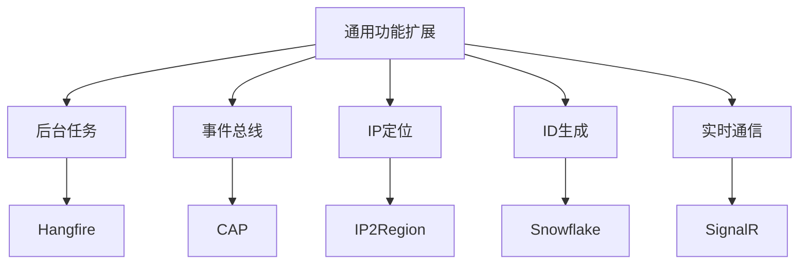
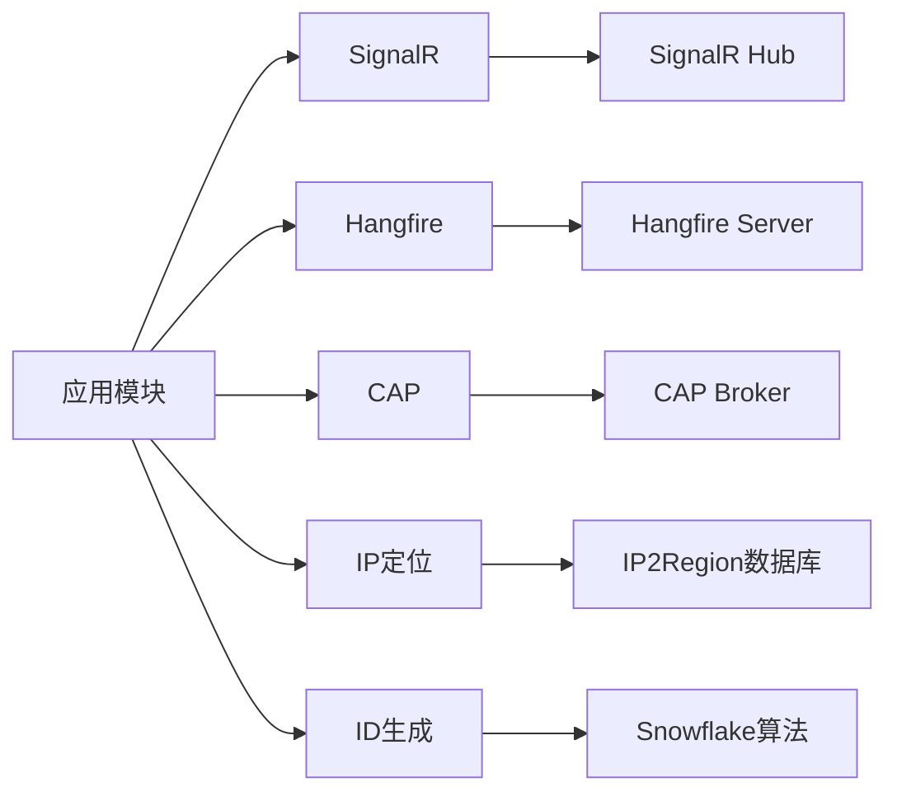
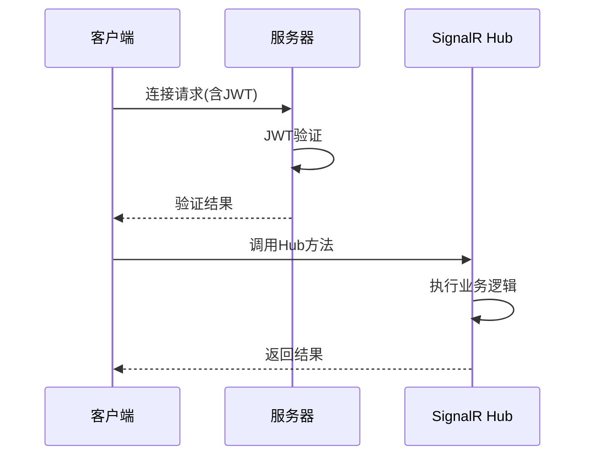
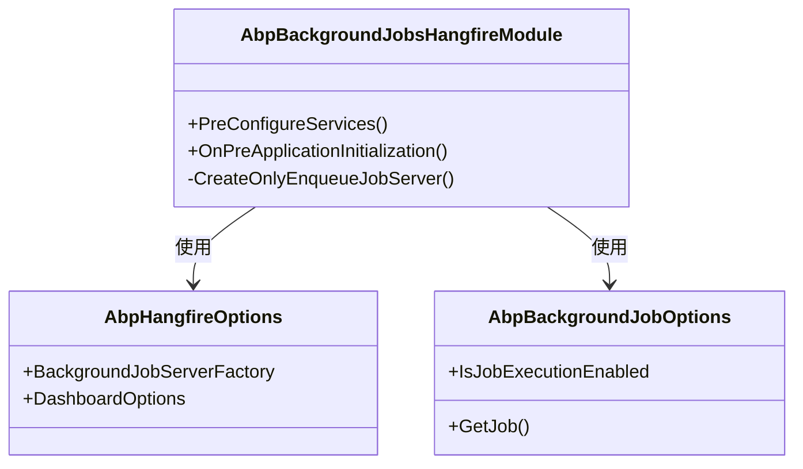
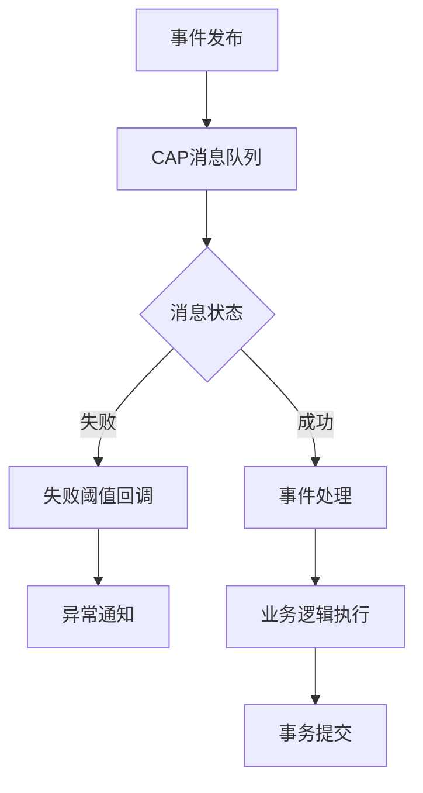
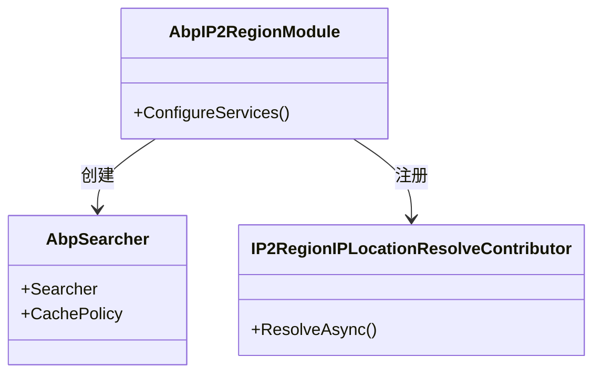
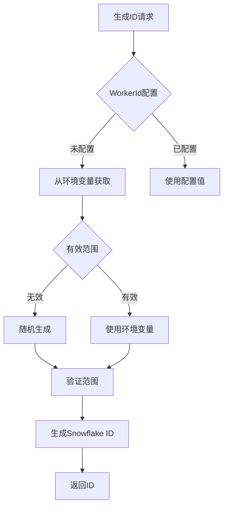
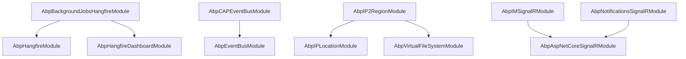

# 通用功能扩展

<cite>
**本文档中引用的文件**  
- [AbpBackgroundJobsHangfireModule.cs](file://aspnet-core/framework/common/LINGYUN.Abp.BackgroundJobs.Hangfire/LINGYUN/Abp/BackgroundJobs/Hangfire/AbpBackgroundJobsHangfireModule.cs)
- [AbpCAPEventBusModule.cs](file://aspnet-core/framework/common/LINGYUN.Abp.EventBus.CAP/LINGYUN/Abp/EventBus/CAP/AbpCAPEventBusModule.cs)
- [AbpIPLocationModule.cs](file://aspnet-core/framework/common/LINGYUN.Abp.IP.Location/LINGYUN/Abp/IP/Location/AbpIPLocationModule.cs)
- [AbpIP2RegionModule.cs](file://aspnet-core/framework/common/LINGYUN.Abp.IP2Region/LINGYUN/Abp/IP2Region/AbpIP2RegionModule.cs)
- [AbpIdGeneratorModule.cs](file://aspnet-core/framework/common/LINGYUN.Abp.IdGenerator/LINGYUN/Abp/IdGenerator/AbpIdGeneratorModule.cs)
- [SnowflakeIdGenerator.cs](file://aspnet-core/framework/common/LINGYUN.Abp.IdGenerator/LINGYUN/Abp/IdGenerator/Snowflake/SnowflakeIdGenerator.cs)
- [AbpAspNetCoreSignalRJwtTokenModule.cs](file://aspnet-core/framework/common/LINGYUN.Abp.AspNetCore.SignalR/LINGYUN/Abp/AspNetCore/SignalR/JwtToken/AbpAspNetCoreSignalRJwtTokenModule.cs)
- [AbpIMSignalRModule.cs](file://aspnet-core/modules/realtime-message/LINGYUN.Abp.IM.SignalR/LINGYUN/Abp/IM/SignalR/AbpIMSignalRModule.cs)
- [AbpNotificationsSignalRModule.cs](file://aspnet-core/modules/realtime-notifications/LINGYUN.Abp.Notifications.SignalR/LINGYUN/Abp/Notifications/SignalR/AbpNotificationsSignalRModule.cs)
</cite>

## 目录
1. [简介](#简介)
2. [项目结构](#项目结构)
3. [核心组件](#核心组件)
4. [架构概述](#架构概述)
5. [详细组件分析](#详细组件分析)
6. [依赖分析](#依赖分析)
7. [性能考虑](#性能考虑)
8. [故障排除指南](#故障排除指南)
9. [结论](#结论)

## 简介
本文档详细介绍了ABP框架中一系列通用功能扩展的实现机制，包括SignalR集成、Hangfire后台作业、CAP事件总线、IP定位、ID生成器等核心功能。文档深入解析了每个扩展的技术架构、配置方式和使用场景，并为开发者提供了最佳实践指南，涵盖配置、使用、常见问题处理和性能优化等方面。

## 项目结构
项目中的通用功能扩展主要位于`aspnet-core/framework/common`目录下，每个功能模块都以独立的NuGet包形式组织，遵循清晰的命名规范（LINGYUN.Abp.*）。这种模块化设计使得功能可以独立开发、测试和部署。

**图示来源**  
- [项目结构](file://aspnet-core/framework/common)

## 核心组件
本文档涵盖的核心通用功能扩展包括：
- **SignalR集成**：提供实时通信能力，支持JWT令牌认证
- **Hangfire后台作业**：实现可靠的后台任务调度和执行
- **CAP事件总线**：基于CAP框架的分布式事件总线实现
- **IP定位**：集成IP2Region实现高效的IP地理位置查询
- **ID生成器**：基于Snowflake算法的分布式ID生成

**组件来源**  
- [AbpBackgroundJobsHangfireModule.cs](file://aspnet-core/framework/common/LINGYUN.Abp.BackgroundJobs.Hangfire/LINGYUN/Abp/BackgroundJobs/Hangfire/AbpBackgroundJobsHangfireModule.cs)
- [AbpCAPEventBusModule.cs](file://aspnet-core/framework/common/LINGYUN.Abp.EventBus.CAP/LINGYUN/Abp/EventBus/CAP/AbpCAPEventBusModule.cs)
- [AbpIPLocationModule.cs](file://aspnet-core/framework/common/LINGYUN.Abp.IP.Location/LINGYUN/Abp/IP/Location/AbpIPLocationModule.cs)
- [AbpIdGeneratorModule.cs](file://aspnet-core/framework/common/LINGYUN.Abp.IdGenerator/LINGYUN/Abp/IdGenerator/AbpIdGeneratorModule.cs)

## 架构概述
通用功能扩展采用模块化架构设计，通过ABP框架的依赖注入和模块系统进行集成。各功能模块之间保持松耦合，通过标准接口进行通信。

**图示来源**  
- [AbpBackgroundJobsHangfireModule.cs](file://aspnet-core/framework/common/LINGYUN.Abp.BackgroundJobs.Hangfire/LINGYUN/Abp/BackgroundJobs/Hangfire/AbpBackgroundJobsHangfireModule.cs)
- [AbpCAPEventBusModule.cs](file://aspnet-core/framework/common/LINGYUN.Abp.EventBus.CAP/LINGYUN/Abp/EventBus/CAP/AbpCAPEventBusModule.cs)

## 详细组件分析

### SignalR集成分析
SignalR集成模块提供了实时通信能力，支持JWT令牌认证，确保通信安全。

**图示来源**  
- [AbpAspNetCoreSignalRJwtTokenModule.cs](file://aspnet-core/framework/common/LINGYUN.Abp.AspNetCore.SignalR/LINGYUN/Abp/AspNetCore/SignalR/JwtToken/AbpAspNetCoreSignalRJwtTokenModule.cs)
- [AbpIMSignalRModule.cs](file://aspnet-core/modules/realtime-message/LINGYUN.Abp.IM.SignalR/LINGYUN/Abp/IM/SignalR/AbpIMSignalRModule.cs)

### Hangfire后台作业分析
Hangfire模块提供了强大的后台任务调度能力，支持任务的持久化和监控。

**图示来源**  
- [AbpBackgroundJobsHangfireModule.cs](file://aspnet-core/framework/common/LINGYUN.Abp.BackgroundJobs.Hangfire/LINGYUN/Abp/BackgroundJobs/Hangfire/AbpBackgroundJobsHangfireModule.cs)

### CAP事件总线分析
CAP事件总线实现了可靠的分布式事件处理，确保消息的最终一致性。

**图示来源**  
- [AbpCAPEventBusModule.cs](file://aspnet-core/framework/common/LINGYUN.Abp.EventBus.CAP/LINGYUN/Abp/EventBus/CAP/AbpCAPEventBusModule.cs)

### IP定位分析
IP定位模块集成了IP2Region，提供高效的IP地理位置查询服务。

**图示来源**  
- [AbpIP2RegionModule.cs](file://aspnet-core/framework/common/LINGYUN.Abp.IP2Region/LINGYUN/Abp/IP2Region/AbpIP2RegionModule.cs)
- [AbpIPLocationModule.cs](file://aspnet-core/framework/common/LINGYUN.Abp.IP.Location/LINGYUN/Abp/IP/Location/AbpIPLocationModule.cs)

### ID生成器分析
ID生成器基于Snowflake算法，提供全局唯一的分布式ID。

**图示来源**  
- [SnowflakeIdGenerator.cs](file://aspnet-core/framework/common/LINGYUN.Abp.IdGenerator/LINGYUN/Abp/IdGenerator/Snowflake/SnowflakeIdGenerator.cs)

## 依赖分析
通用功能扩展模块之间存在明确的依赖关系，通过ABP模块系统的依赖机制进行管理。

**图示来源**  
- [AbpBackgroundJobsHangfireModule.cs](file://aspnet-core/framework/common/LINGYUN.Abp.BackgroundJobs.Hangfire/LINGYUN/Abp/BackgroundJobs/Hangfire/AbpBackgroundJobsHangfireModule.cs)
- [AbpCAPEventBusModule.cs](file://aspnet-core/framework/common/LINGYUN.Abp.EventBus.CAP/LINGYUN/