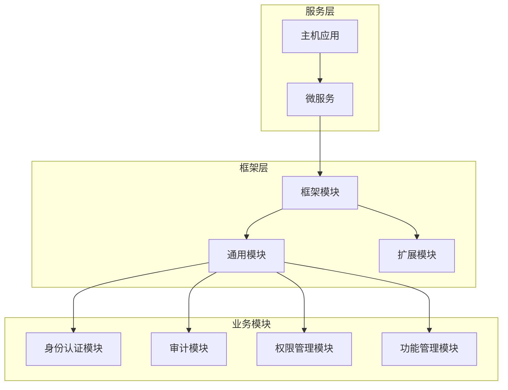
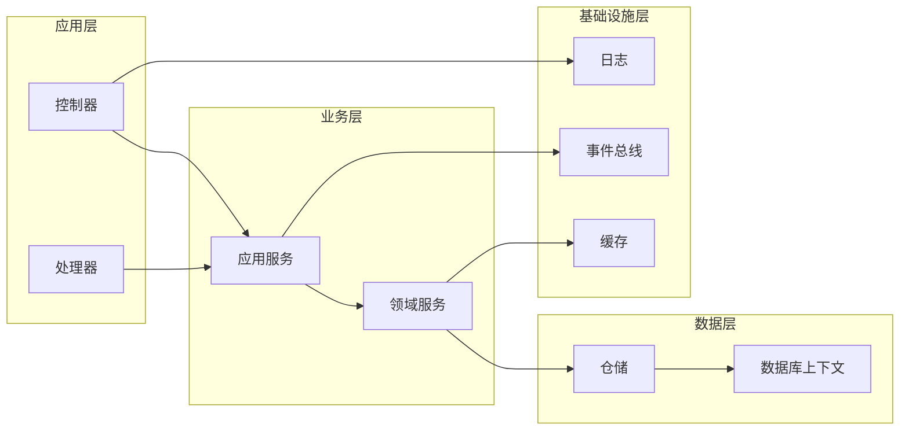
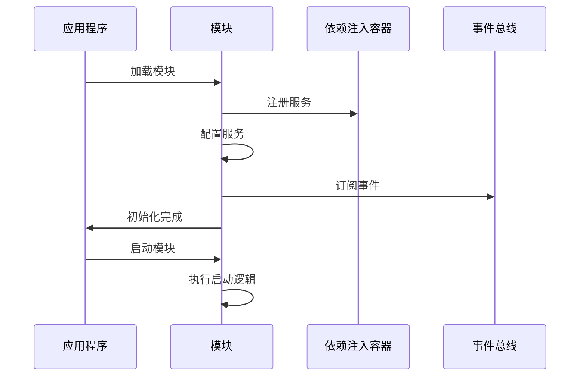
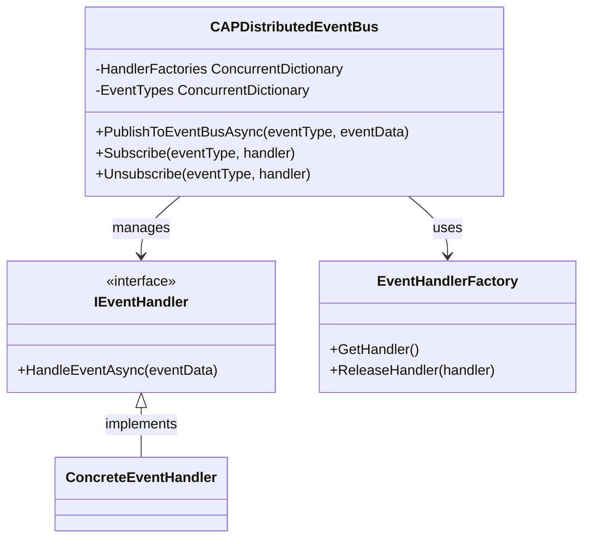
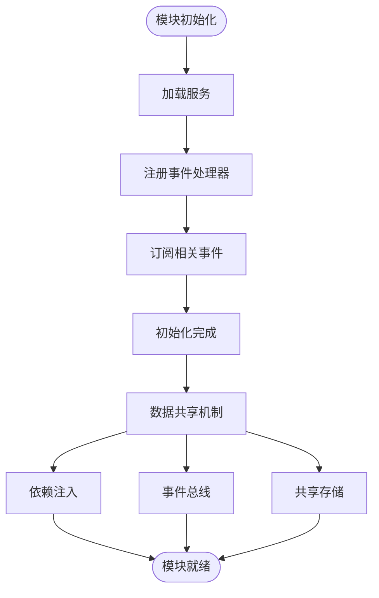
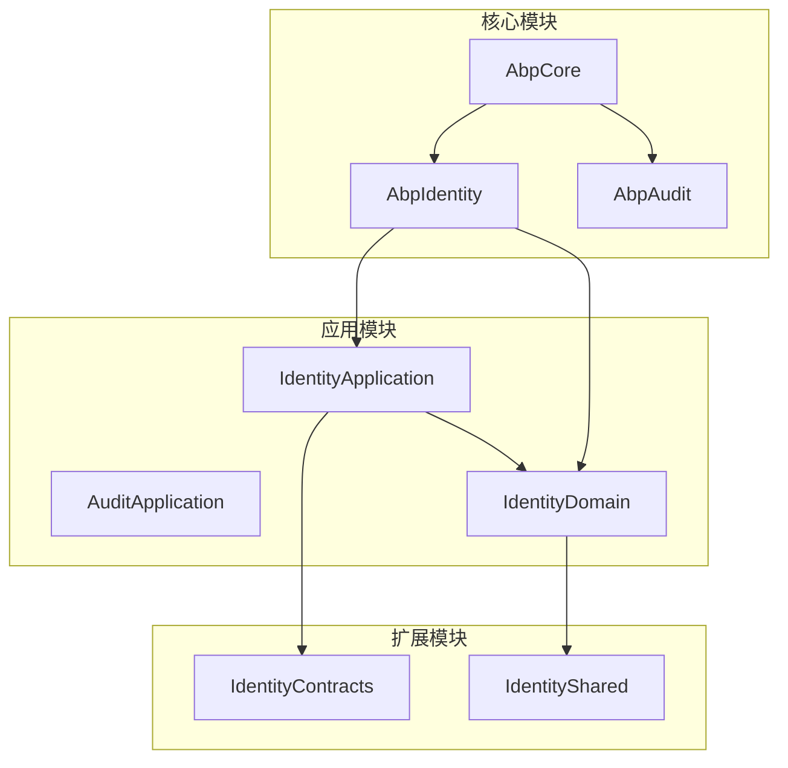

# 模块化设计

<cite>
**本文档中引用的文件**
- [AbpCommonModule.cs](file://aspnet-core/framework/common/LINGYUN.Abp.Core/AbpCommonModule.cs)
- [AbpIdentityApplicationModule.cs](file://aspnet-core/modules/identity/LINGYUN.Abp.Identity.Application/LINGYUN/Abp/Identity/AbpIdentityApplicationModule.cs)
- [AbpIdentityApplicationContractsModule.cs](file://aspnet-core/modules/identity/LINGYUN.Abp.Identity.Application.Contracts/LINGYUN/Abp/Identity/AbpIdentityApplicationContractsModule.cs)
- [AbpIdentityDomainModule.cs](file://aspnet-core/modules/identity/LINGYUN.Abp.Identity.Domain/LINGYUN/Abp/Identity/AbpIdentityDomainModule.cs)
- [AbpGdprHttpApiModule.cs](file://aspnet-core/modules/gdpr/LINGYUN.Abp.Gdpr.HttpApi/LINGYUN/Abp/Gdpr/AbpGdprHttpApiModule.cs)
- [AbpGdprDomainSharedModule.cs](file://aspnet-core/modules/gdpr/LINGYUN.Abp.Gdpr.Domain.Shared/LINGYUN/Abp/Gdpr/AbpGdprDomainSharedModule.cs)
- [Program.cs](file://aspnet-core/services/LY.MicroService.Applications.Single/Program.cs)
- [CAPDistributedEventBus.cs](file://aspnet-core/framework/common/LINGYUN.Abp.EventBus.CAP/LINGYUN/Abp/EventBus/CAP/CAPDistributedEventBus.cs)
- [CreateCommand.cs](file://aspnet-core/framework/cli/LINGYUN.Abp.Cli/LINGYUN/Abp/Cli/Commands/CreateCommand.cs)
</cite>

## 目录
1. [简介](#简介)
2. [项目结构概览](#项目结构概览)
3. [核心模块组件](#核心模块组件)
4. [架构概览](#架构概览)
5. [详细组件分析](#详细组件分析)
6. [依赖关系分析](#依赖关系分析)
7. [性能考虑](#性能考虑)
8. [故障排除指南](#故障排除指南)
9. [结论](#结论)

## 简介

ABP框架采用高度模块化的架构设计，通过清晰的模块边界和依赖管理机制，实现了功能的解耦和复用。这种设计模式不仅提高了代码的可维护性，还为开发者提供了灵活的扩展能力。

模块化设计的核心理念是将复杂的应用程序分解为独立的功能模块，每个模块负责特定的业务领域或技术功能。在ABP框架中，模块化设计体现在以下几个方面：

- **功能分离**：不同业务领域的功能被封装到独立的模块中
- **依赖管理**：通过明确的依赖声明实现模块间的松耦合
- **插件系统**：支持动态加载和卸载模块
- **事件驱动**：通过事件总线实现模块间的通信

## 项目结构概览

ABP框架的模块化结构按照功能域进行组织，主要分为以下几个层次：



**图表来源**
- [AbpCommonModule.cs](file://aspnet-core/framework/common/LINGYUN.Abp.Core/AbpCommonModule.cs#L1-L8)
- [AbpIdentityApplicationModule.cs](file://aspnet-core/modules/identity/LINGYUN.Abp.Identity.Application/LINGYUN/Abp/Identity/AbpIdentityApplicationModule.cs#L1-L42)

**章节来源**
- [AbpCommonModule.cs](file://aspnet-core/framework/common/LINGYUN.Abp.Core/AbpCommonModule.cs#L1-L8)
- [AbpIdentityApplicationModule.cs](file://aspnet-core/modules/identity/LINGYUN.Abp.Identity.Application/LINGYUN/Abp/Identity/AbpIdentityApplicationModule.cs#L1-L42)

## 核心模块组件

### 模块基类设计

ABP框架中的每个模块都继承自`AbpModule`基类，这个基类提供了模块生命周期管理和依赖注入的基础功能。

```csharp
[DependsOn(
    typeof(Volo.Abp.Identity.AbpIdentityApplicationModule),
    typeof(AbpIdentityApplicationContractsModule),
    typeof(AbpIdentityDomainModule))]
public class AbpIdentityApplicationModule : AbpModule
{
    public override void ConfigureServices(ServiceConfigurationContext context)
    {
        context.Services.AddAutoMapperObjectMapper<AbpIdentityApplicationModule>();
        
        Configure<AbpAutoMapperOptions>(options =>
        {
            options.AddProfile<AbpIdentityApplicationModuleAutoMapperProfile>(validate: true);
        });
    }
}
```

### 模块依赖声明

模块通过`[DependsOn]`特性声明对其他模块的依赖关系，这种声明式依赖管理确保了模块加载的正确顺序：

```csharp
[DependsOn(
    typeof(AbpIdentityDomainSharedModule),
    typeof(AbpDistributedLockingAbstractionsModule),
    typeof(Volo.Abp.Identity.AbpIdentityDomainModule))]
public class AbpIdentityDomainModule : AbpModule
{
    // 模块配置逻辑
}
```

**章节来源**
- [AbpIdentityApplicationModule.cs](file://aspnet-core/modules/identity/LINGYUN.Abp.Identity.Application/LINGYUN/Abp/Identity/AbpIdentityApplicationModule.cs#L1-L42)
- [AbpIdentityDomainModule.cs](file://aspnet-core/modules/identity/LINGYUN.Abp.Identity.Domain/LINGYUN/Abp/Identity/AbpIdentityDomainModule.cs#L1-L58)

## 架构概览

ABP框架的模块化架构采用了分层设计和事件驱动的通信机制：



**图表来源**
- [AbpIdentityApplicationModule.cs](file://aspnet-core/modules/identity/LINGYUN.Abp.Identity.Application/LINGYUN/Abp/Identity/AbpIdentityApplicationModule.cs#L1-L42)
- [AbpIdentityDomainModule.cs](file://aspnet-core/modules/identity/LINGYUN.Abp.Identity.Domain/LINGYUN/Abp/Identity/AbpIdentityDomainModule.cs#L1-L58)

## 详细组件分析

### 模块注册与初始化流程

模块的注册和初始化遵循严格的生命周期管理：



**图表来源**
- [AbpIdentityApplicationModule.cs](file://aspnet-core/modules/identity/LINGYUN.Abp.Identity.Application/LINGYUN/Abp/Identity/AbpIdentityApplicationModule.cs#L1-L42)
- [AbpIdentityDomainModule.cs](file://aspnet-core/modules/identity/LINGYUN.Abp.Identity.Domain/LINGYUN/Abp/Identity/AbpIdentityDomainModule.cs#L1-L58)

### 插件系统实现

ABP框架支持动态插件加载机制，允许运行时添加新的功能模块：

```csharp
await builder.AddApplicationAsync<WorkflowManagementHttpApiHostModule>(options =>
{
    var pluginFolder = Path.Combine(Directory.GetCurrentDirectory(), "Modules");
    DirectoryHelper.CreateIfNotExists(pluginFolder);
    options.PlugInSources.AddFolder(pluginFolder, SearchOption.AllDirectories);
});
```

### 事件驱动通信机制

模块间通过事件总线实现松耦合通信：



**图表来源**
- [CAPDistributedEventBus.cs](file://aspnet-core/framework/common/LINGYUN.Abp.EventBus.CAP/LINGYUN/Abp/EventBus/CAP/CAPDistributedEventBus.cs#L41-L78)

**章节来源**
- [Program.cs](file://aspnet-core/services/LY.MicroService.Applications.Single/Program.cs#L33-L45)
- [CAPDistributedEventBus.cs](file://aspnet-core/framework/common/LINGYUN.Abp.EventBus.CAP/LINGYUN/Abp/EventBus/CAP/CAPDistributedEventBus.cs#L41-L78)

### 模块间数据共享机制

ABP框架提供了多种模块间数据共享的方式：

1. **依赖注入服务**：通过IoC容器共享服务实例
2. **事件驱动**：通过分布式事件实现异步数据同步
3. **共享数据存储**：通过统一的数据存储层访问数据



**章节来源**
- [AbpIdentityApplicationModule.cs](file://aspnet-core/modules/identity/LINGYUN.Abp.Identity.Application/LINGYUN/Abp/Identity/AbpIdentityApplicationModule.cs#L1-L42)
- [AbpIdentityDomainModule.cs](file://aspnet-core/modules/identity/LINGYUN.Abp.Identity.Domain/LINGYUN/Abp/Identity/AbpIdentityDomainModule.cs#L1-L58)

## 依赖关系分析

ABP框架的模块依赖关系呈现树状结构，通过明确的依赖声明确保模块加载的正确顺序：



**图表来源**
- [AbpIdentityApplicationModule.cs](file://aspnet-core/modules/identity/LINGYUN.Abp.Identity.Application/LINGYUN/Abp/Identity/AbpIdentityApplicationModule.cs#L1-L42)
- [AbpIdentityApplicationContractsModule.cs](file://aspnet-core/modules/identity/LINGYUN.Abp.Identity.Application.Contracts/LINGYUN/Abp/Identity/AbpIdentityApplicationContractsModule.cs#L1-L14)

**章节来源**
- [AbpIdentityApplicationModule.cs](file://aspnet-core/modules/identity/LINGYUN.Abp.Identity.Application/LINGYUN/Abp/Identity/AbpIdentityApplicationModule.cs#L1-L42)
- [AbpIdentityApplicationContractsModule.cs](file://aspnet-core/modules/identity/LINGYUN.Abp.Identity.Application.Contracts/LINGYUN/Abp/Identity/AbpIdentityApplicationContractsModule.cs#L1-L14)
- [AbpIdentityDomainModule.cs](file://aspnet-core/modules/identity/LINGYUN.Abp.Identity.Domain/LINGYUN/Abp/Identity/AbpIdentityDomainModule.cs#L1-L58)

## 性能考虑

模块化设计在提高代码可维护性的同时，也需要考虑性能影响：

### 模块加载优化
- 使用延迟加载机制避免不必要的模块初始化
- 通过依赖分析确定最优的模块加载顺序
- 实现模块缓存机制减少重复加载开销

### 事件处理优化
- 使用异步事件处理避免阻塞主线程
- 实现事件批处理机制提高吞吐量
- 通过事件过滤减少不必要的事件传播

### 内存管理
- 合理使用依赖注入生命周期管理内存
- 实现事件处理器池化减少GC压力
- 优化模块间数据传输减少内存拷贝

## 故障排除指南

### 常见模块加载问题

1. **循环依赖问题**
   - 检查模块依赖声明是否存在循环引用
   - 使用依赖分析工具识别循环依赖路径
   - 重构模块结构消除循环依赖

2. **服务注册冲突**
   - 检查模块间服务注册命名冲突
   - 使用命名空间隔离服务注册
   - 实现服务版本控制机制

3. **事件处理异常**
   - 检查事件处理器注册状态
   - 实现事件处理异常捕获机制
   - 使用事件重试机制提高可靠性

**章节来源**
- [AbpGdprHttpApiModule.cs](file://aspnet-core/modules/gdpr/LINGYUN.Abp.Gdpr.HttpApi/LINGYUN/Abp/Gdpr/AbpGdprHttpApiModule.cs#L1-L40)
- [AbpGdprDomainSharedModule.cs](file://aspnet-core/modules/gdpr/LINGYUN.Abp.Gdpr.Domain.Shared/LINGYUN/Abp/Gdpr/AbpGdprDomainSharedModule.cs#L1-L37)

## 结论

ABP框架的模块化设计为现代应用程序开发提供了强大而灵活的架构基础。通过清晰的模块边界、声明式的依赖管理和事件驱动的通信机制，开发者可以构建出高度可维护和可扩展的应用程序。

### 主要优势

1. **高内聚低耦合**：每个模块专注于特定功能领域
2. **灵活扩展**：支持动态加载和卸载模块
3. **事件驱动**：通过事件总线实现模块间松耦合通信
4. **标准化开发**：提供统一的模块开发规范和最佳实践

### 开发建议

1. **遵循模块边界**：严格遵守模块职责边界，避免跨模块直接调用
2. **合理设计依赖**：最小化模块间依赖，优先使用事件通信
3. **实现配置隔离**：为每个模块提供独立的配置管理
4. **注重性能优化**：在模块化设计中平衡功能完整性和性能要求

通过深入理解和正确应用ABP框架的模块化设计理念，开发者可以构建出高质量、高性能的企业级应用程序。