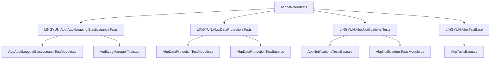
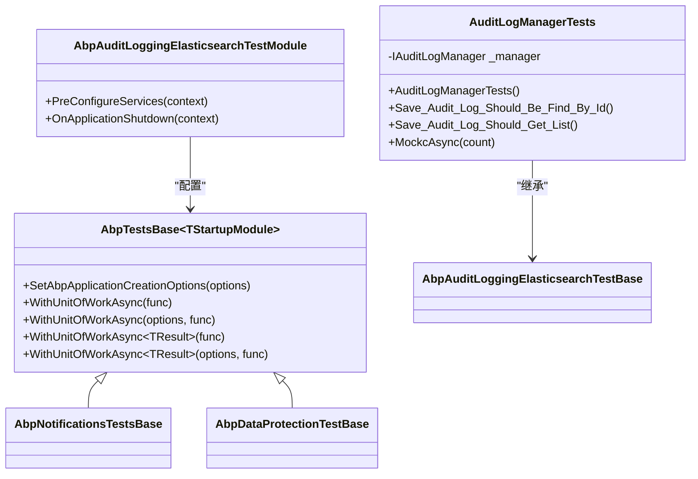
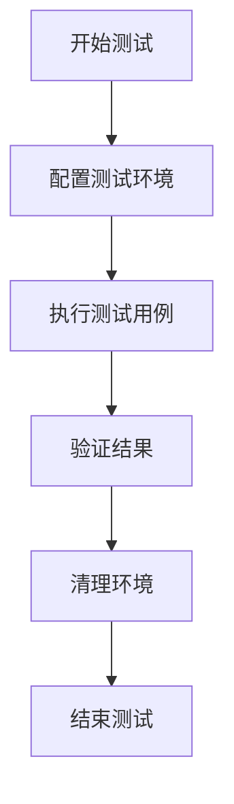
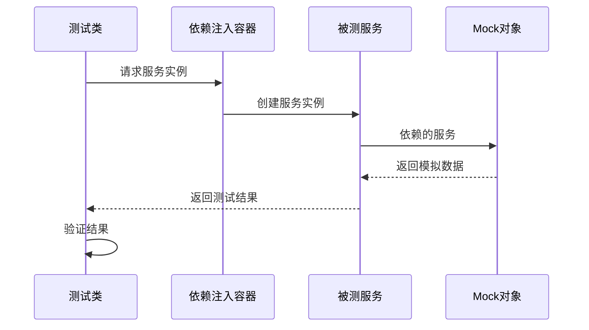
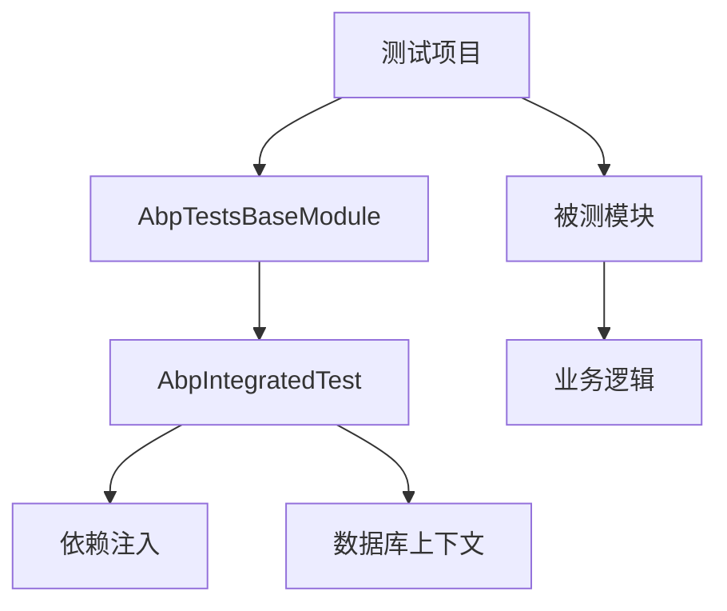

# 单元测试

<cite>
**本文档中引用的文件**  
- [AbpAuditLoggingElasticsearchTestModule.cs](file://aspnet-core/tests/LINGYUN.Abp.AuditLogging.Elasticsearch.Tests/LINGYUN/Abp/AuditLogging/Elasticsearch/AbpAuditLoggingElasticsearchTestModule.cs)
- [AuditLogManagerTests.cs](file://aspnet-core/tests/LINGYUN.Abp.AuditLogging.Elasticsearch.Tests/LINGYUN/Abp/AuditLogging/Elasticsearch/AuditLogManagerTests.cs)
- [AbpTestsBase.cs](file://aspnet-core/tests/LINGYUN.Abp.TestBase/LINGYUN/Abp/Tests/AbpTestsBase.cs)
- [AbpDataProtectionTestModule.cs](file://aspnet-core/tests/LINGYUN.Abp.DataProtection.Tests/LINGYUN/Abp/DataProtection/AbpDataProtectionTestModule.cs)
- [AbpDataProtectionTestBase.cs](file://aspnet-core/tests/LINGYUN.Abp.DataProtection.Tests/LINGYUN/Abp/DataProtection/AbpDataProtectionTestBase.cs)
- [AbpNotificationsTestsBase.cs](file://aspnet-core/tests/LINGYUN.Abp.Notifications.Tests/LINGYUN/Abp/Notifications/AbpNotificationsTestsBase.cs)
- [AbpNotificationsTestsModule.cs](file://aspnet-core/tests/LINGYUN.Abp.Notifications.Tests/LINGYUN/Abp/Notifications/AbpNotificationsTestsModule.cs)
- [NotificationsTestsDefinitionProvider_Tests.cs](file://aspnet-core/tests/LINGYUN.Abp.Notifications.Tests/LINGYUN/Abp/Notifications/NotificationsTestsDefinitionProvider_Tests.cs)
- [GlobalUsings.cs](file://aspnet-core/tests/LINGYUN.Abp.OssManagement.Nexus.Tests/GlobalUsings.cs)
</cite>

## 目录
1. [引言](#引言)
2. [项目结构](#项目结构)
3. [核心组件](#核心组件)
4. [架构概述](#架构概述)
5. [详细组件分析](#详细组件分析)
6. [依赖分析](#依赖分析)
7. [性能考虑](#性能考虑)
8. [故障排除指南](#故障排除指南)
9. [结论](#结论)

## 引言
本文档详细介绍了ABP Next Admin项目中的单元测试实践。文档涵盖了使用的测试框架、测试组织方式、为业务逻辑、服务和领域模型编写有效单元测试的方法。此外，还提供了测试命名约定、断言策略和测试隔离的最佳实践，并包含从代码库中提取的实际测试示例，展示如何使用Mock对象和测试替身。最后，文档解释了测试的构建和执行流程，以及如何在持续集成环境中运行单元测试。

## 项目结构
该项目的单元测试分布在`aspnet-core/tests`目录下，每个模块都有对应的测试项目。测试项目遵循一致的命名约定，通常以模块名称加上`.Tests`后缀。测试项目中包含了测试基类、测试模块和具体的测试类。

**图示来源**
- [AbpAuditLoggingElasticsearchTestModule.cs](file://aspnet-core/tests/LINGYUN.Abp.AuditLogging.Elasticsearch.Tests/LINGYUN/Abp/AuditLogging/Elasticsearch/AbpAuditLoggingElasticsearchTestModule.cs)
- [AuditLogManagerTests.cs](file://aspnet-core/tests/LINGYUN.Abp.AuditLogging.Elasticsearch.Tests/LINGYUN/Abp/AuditLogging/Elasticsearch/AuditLogManagerTests.cs)
- [AbpDataProtectionTestModule.cs](file://aspnet-core/tests/LINGYUN.Abp.DataProtection.Tests/LINGYUN/Abp/DataProtection/AbpDataProtectionTestModule.cs)
- [AbpDataProtectionTestBase.cs](file://aspnet-core/tests/LINGYUN.Abp.DataProtection.Tests/LINGYUN/Abp/DataProtection/AbpDataProtectionTestBase.cs)
- [AbpNotificationsTestsBase.cs](file://aspnet-core/tests/LINGYUN.Abp.Notifications.Tests/LINGYUN/Abp/Notifications/AbpNotificationsTestsBase.cs)
- [AbpNotificationsTestsModule.cs](file://aspnet-core/tests/LINGYUN.Abp.Notifications.Tests/LINGYUN/Abp/Notifications/AbpNotificationsTestsModule.cs)
- [AbpTestsBase.cs](file://aspnet-core/tests/LINGYUN.Abp.TestBase/LINGYUN/Abp/Tests/AbpTestsBase.cs)

**本节来源**
- [AbpAuditLoggingElasticsearchTestModule.cs](file://aspnet-core/tests/LINGYUN.Abp.AuditLogging.Elasticsearch.Tests/LINGYUN/Abp/AuditLogging/Elasticsearch/AbpAuditLoggingElasticsearchTestModule.cs)
- [AuditLogManagerTests.cs](file://aspnet-core/tests/LINGYUN.Abp.AuditLogging.Elasticsearch.Tests/LINGYUN/Abp/AuditLogging/Elasticsearch/AuditLogManagerTests.cs)
- [AbpDataProtectionTestModule.cs](file://aspnet-core/tests/LINGYUN.Abp.DataProtection.Tests/LINGYUN/Abp/DataProtection/AbpDataProtectionTestModule.cs)
- [AbpDataProtectionTestBase.cs](file://aspnet-core/tests/LINGYUN.Abp.DataProtection.Tests/LINGYUN/Abp/DataProtection/AbpDataProtectionTestBase.cs)
- [AbpNotificationsTestsBase.cs](file://aspnet-core/tests/LINGYUN.Abp.Notifications.Tests/LINGYUN/Abp/Notifications/AbpNotificationsTestsBase.cs)
- [AbpNotificationsTestsModule.cs](file://aspnet-core/tests/LINGYUN.Abp.Notifications.Tests/LINGYUN/Abp/Notifications/AbpNotificationsTestsModule.cs)
- [AbpTestsBase.cs](file://aspnet-core/tests/LINGYUN.Abp.TestBase/LINGYUN/Abp/Tests/AbpTestsBase.cs)

## 核心组件
单元测试的核心组件包括测试框架、测试基类、测试模块和具体的测试类。测试框架使用xUnit，测试基类提供通用的测试基础设施，测试模块配置测试环境，具体的测试类实现具体的测试用例。

**本节来源**
- [AbpTestsBase.cs](file://aspnet-core/tests/LINGYUN.Abp.TestBase/LINGYUN/Abp/Tests/AbpTestsBase.cs)
- [AbpAuditLoggingElasticsearchTestModule.cs](file://aspnet-core/tests/LINGYUN.Abp.AuditLogging.Elasticsearch.Tests/LINGYUN/Abp/AuditLogging/Elasticsearch/AbpAuditLoggingElasticsearchTestModule.cs)
- [AuditLogManagerTests.cs](file://aspnet-core/tests/LINGYUN.Abp.AuditLogging.Elasticsearch.Tests/LINGYUN/Abp/AuditLogging/Elasticsearch/AuditLogManagerTests.cs)

## 架构概述
单元测试的架构基于ABP框架的集成测试支持。测试基类继承自`AbpIntegratedTest<TStartupModule>`，提供了一个完整的应用环境，包括依赖注入、数据库上下文等。测试模块通过`[DependsOn]`属性声明依赖的模块，确保测试环境的正确配置。

**图示来源**
- [AbpTestsBase.cs](file://aspnet-core/tests/LINGYUN.Abp.TestBase/LINGYUN/Abp/Tests/AbpTestsBase.cs)
- [AbpAuditLoggingElasticsearchTestModule.cs](file://aspnet-core/tests/LINGYUN.Abp.AuditLogging.Elasticsearch.Tests/LINGYUN/Abp/AuditLogging/Elasticsearch/AbpAuditLoggingElasticsearchTestModule.cs)
- [AuditLogManagerTests.cs](file://aspnet-core/tests/LINGYUN.Abp.AuditLogging.Elasticsearch.Tests/LINGYUN/Abp/AuditLogging/Elasticsearch/AuditLogManagerTests.cs)

## 详细组件分析
### 测试框架和组织方式
项目使用xUnit作为单元测试框架，通过全局使用声明（Global Usings）引入`Xunit`和`Shouldly`，简化测试代码。测试文件组织清晰，每个模块有独立的测试项目，测试类命名遵循`[被测类名]Tests`的约定。

#### 测试命名约定
测试方法命名采用描述性命名，清晰表达测试目的，如`Save_Audit_Log_Should_Be_Find_By_Id`和`Save_Audit_Log_Should_Get_List`。

#### 断言策略
使用`Shouldly`库进行断言，提供更自然、可读性强的断言语法，如`ShouldNotBeNullOrWhiteSpace`、`ShouldNotBeNull`、`ShouldBe`等。

#### 测试隔离
通过`AbpIntegratedTest<TStartupModule>`基类确保每个测试在独立的应用环境中运行，避免测试间的相互影响。

**图示来源**
- [GlobalUsings.cs](file://aspnet-core/tests/LINGYUN.Abp.OssManagement.Nexus.Tests/GlobalUsings.cs)
- [AbpTestsBase.cs](file://aspnet-core/tests/LINGYUN.Abp.TestBase/LINGYUN/Abp/Tests/AbpTestsBase.cs)
- [AuditLogManagerTests.cs](file://aspnet-core/tests/LINGYUN.Abp.AuditLogging.Elasticsearch.Tests/LINGYUN/Abp/AuditLogging/Elasticsearch/AuditLogManagerTests.cs)

**本节来源**
- [GlobalUsings.cs](file://aspnet-core/tests/LINGYUN.Abp.OssManagement.Nexus.Tests/GlobalUsings.cs)
- [AbpTestsBase.cs](file://aspnet-core/tests/LINGYUN.Abp.TestBase/LINGYUN/Abp/Tests/AbpTestsBase.cs)
- [AuditLogManagerTests.cs](file://aspnet-core/tests/LINGYUN.Abp.AuditLogging.Elasticsearch.Tests/LINGYUN/Abp/AuditLogging/Elasticsearch/AuditLogManagerTests.cs)

### 业务逻辑测试
以通知模块的定义提供者测试为例，展示了如何为业务逻辑编写单元测试。测试类`NotificationsTestsDefinitionProvider_Tests`继承自`AbpNotificationsTestsBase`，利用ABP框架的依赖注入获取被测服务，通过`GetRequiredService`方法获取服务实例。

#### Mock对象和测试替身
在`AuditLogManagerTests`中，使用`Moq.AutoMock`库创建Mock对象，模拟依赖服务的行为，确保测试的独立性和可重复性。

**图示来源**
- [AuditLogManagerTests.cs](file://aspnet-core/tests/LINGYUN.Abp.AuditLogging.Elasticsearch.Tests/LINGYUN/Abp/AuditLogging/Elasticsearch/AuditLogManagerTests.cs)
- [AbpNotificationsTestsBase.cs](file://aspnet-core/tests/LINGYUN.Abp.Notifications.Tests/LINGYUN/Abp/Notifications/AbpNotificationsTestsBase.cs)

**本节来源**
- [AuditLogManagerTests.cs](file://aspnet-core/tests/LINGYUN.Abp.AuditLogging.Elasticsearch.Tests/LINGYUN/Abp/AuditLogging/Elasticsearch/AuditLogManagerTests.cs)
- [AbpNotificationsTestsBase.cs](file://aspnet-core/tests/LINGYUN.Abp.Notifications.Tests/LINGYUN/Abp/Notifications/AbpNotificationsTestsBase.cs)
- [AbpNotificationsTestsModule.cs](file://aspnet-core/tests/LINGYUN.Abp.Notifications.Tests/LINGYUN/Abp/Notifications/AbpNotificationsTestsModule.cs)
- [NotificationsTestsDefinitionProvider_Tests.cs](file://aspnet-core/tests/LINGYUN.Abp.Notifications.Tests/LINGYUN/Abp/Notifications/NotificationsTestsDefinitionProvider_Tests.cs)

## 依赖分析
单元测试项目依赖于ABP框架的核心测试模块`AbpTestsBaseModule`和被测模块。通过`[DependsOn]`属性声明依赖，确保测试环境的正确配置。测试基类`AbpTestsBase<TStartupModule>`提供通用的测试基础设施，减少重复代码。

**图示来源**
- [AbpAuditLoggingElasticsearchTestModule.cs](file://aspnet-core/tests/LINGYUN.Abp.AuditLogging.Elasticsearch.Tests/LINGYUN/Abp/AuditLogging/Elasticsearch/AbpAuditLoggingElasticsearchTestModule.cs)
- [AbpNotificationsTestsModule.cs](file://aspnet-core/tests/LINGYUN.Abp.Notifications.Tests/LINGYUN/Abp/Notifications/AbpNotificationsTestsModule.cs)
- [AbpTestsBase.cs](file://aspnet-core/tests/LINGYUN.Abp.TestBase/LINGYUN/Abp/Tests/AbpTestsBase.cs)

**本节来源**
- [AbpAuditLoggingElasticsearchTestModule.cs](file://aspnet-core/tests/LINGYUN.Abp.AuditLogging.Elasticsearch.Tests/LINGYUN/Abp/AuditLogging/Elasticsearch/AbpAuditLoggingElasticsearchTestModule.cs)
- [AbpNotificationsTestsModule.cs](file://aspnet-core/tests/LINGYUN.Abp.Notifications.Tests