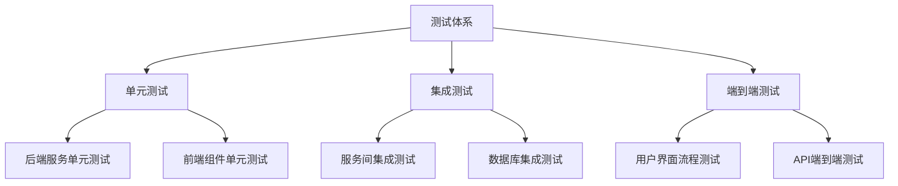
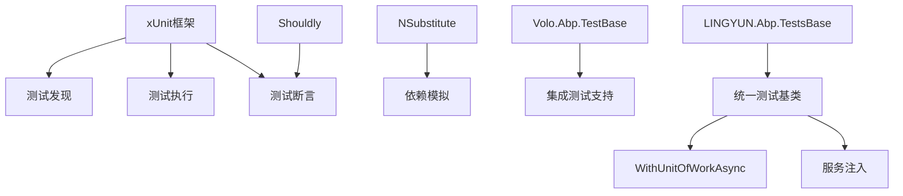
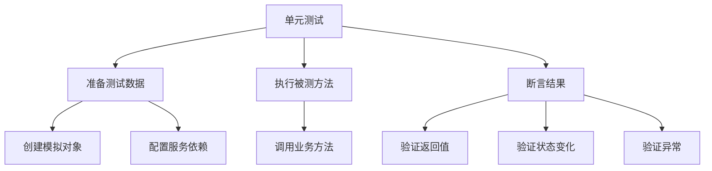
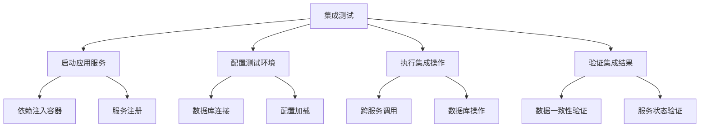
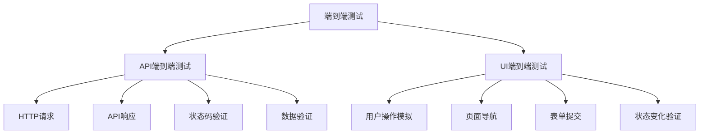

# 测试策略

<cite>
**本文档中引用的文件**  
- [AbpTestsBase.cs](file://aspnet-core/tests/LINGYUN.Abp.TestBase/LINGYUN/Abp/Tests/AbpTestsBase.cs)
- [AbpTestsBase.csproj](file://aspnet-core/tests/LINGYUN.Abp.TestBase/LINGYUN.Abp.TestsBase.csproj)
- [AbpAuditLoggingElasticsearchTestModule.cs](file://aspnet-core/tests/LINGYUN.Abp.AuditLogging.Elasticsearch.Tests/LINGYUN/Abp/AuditLogging/Elasticsearch/AbpAuditLoggingElasticsearchTestModule.cs)
- [AuditLogManagerTests.cs](file://aspnet-core/tests/LINGYUN.Abp.AuditLogging.Elasticsearch.Tests/LINGYUN/Abp/AuditLogging/Elasticsearch/AuditLogManagerTests.cs)
- [AbpDataProtectionTestModule.cs](file://aspnet-core/tests/LINGYUN.Abp.DataProtection.Tests/LINGYUN/Abp/DataProtection/AbpDataProtectionTestModule.cs)
- [ProtectionFieldTests.cs](file://aspnet-core/tests/LINGYUN.Abp.DataProtection.Tests/LINGYUN/Abp/DataProtection/ProtectionFieldTests.cs)
- [test.spec.ts](file://apps/vue/tests/test.spec.ts)
- [auth-login.spec.ts](file://apps/vben5/playground/__tests__/e2e/auth-login.spec.ts)
- [README.md](file://aspnet-core/templates/aio/content/README.md)
- [README.zh-CN.md](file://aspnet-core/templates/aio/content/README.zh-CN.md)
</cite>

## 目录
1. [引言](#引言)
2. [测试体系概述](#测试体系概述)
3. [测试框架与配置](#测试框架与配置)
4. [单元测试](#单元测试)
5. [集成测试](#集成测试)
6. [端到端测试](#端到端测试)
7. [测试覆盖率要求](#测试覆盖率要求)
8. [测试数据准备与清理机制](#测试数据准备与清理机制)
9. [高质量测试用例编写指导](#高质量测试用例编写指导)
10. [最佳实践](#最佳实践)

## 引言
本测试策略文档旨在全面介绍ABP Next Admin项目的测试体系，涵盖单元测试、集成测试和端到端测试。文档详细说明了测试框架的选择与配置、测试覆盖率要求、测试数据的准备与清理机制，并为开发团队提供编写高质量测试用例的指导原则和最佳实践。

## 测试体系概述
ABP Next Admin项目采用分层测试策略，包含单元测试、集成测试和端到端测试三个层次。测试体系基于xUnit框架构建，利用ABP框架提供的测试基础设施，确保代码质量和系统稳定性。

后端测试主要集中在`aspnet-core/tests`目录下，每个功能模块都有对应的测试项目，如`LINGYUN.Abp.AuditLogging.Elasticsearch.Tests`、`LINGYUN.Abp.DataProtection.Tests`等。前端测试位于`apps/vue/tests`和`apps/vben5/playground/__tests__`目录下，采用Jest和Playwright等工具进行组件和流程测试。

**Diagram sources**
- [AbpTestsBase.cs](file://aspnet-core/tests/LINGYUN.Abp.TestBase/LINGYUN/Abp/Tests/AbpTestsBase.cs)
- [test.spec.ts](file://apps/vue/tests/test.spec.ts)
- [auth-login.spec.ts](file://apps/vben5/playground/__tests__/e2e/auth-login.spec.ts)

## 测试框架与配置
项目采用xUnit作为主要的测试框架，结合Shouldly进行断言，NSubstitute用于模拟依赖。测试项目通过`Microsoft.NET.Test.Sdk`和`xunit.runner.visualstudio`包集成到Visual Studio测试运行器中。

测试基础项目`LINGYUN.Abp.TestsBase`为所有测试提供了统一的基础类和配置，确保测试环境的一致性。该项目引用了ABP框架的`Volo.Abp.TestBase`，利用其提供的集成测试支持。

**Diagram sources**
- [AbpTestsBase.csproj](file://aspnet-core/tests/LINGYUN.Abp.TestBase/LINGYUN.Abp.TestsBase.csproj)
- [AbpTestsBase.cs](file://aspnet-core/tests/LINGYUN.Abp.TestBase/LINGYUN/Abp/Tests/AbpTestsBase.cs)

**Section sources**
- [AbpTestsBase.csproj](file://aspnet-core/tests/LINGYUN.Abp.TestBase/LINGYUN.Abp.TestsBase.csproj)
- [AbpTestsBase.cs](file://aspnet-core/tests/LINGYUN.Abp.TestBase/LINGYUN/Abp/Tests/AbpTestsBase.cs)

## 单元测试
单元测试是项目测试体系的基础，主要验证单个类或方法的行为。在ABP Next Admin项目中，单元测试通过`AbpTestsBase<TStartupModule>`类提供基础支持，确保测试在隔离的环境中运行。

单元测试遵循AAA模式（Arrange-Act-Assert），即准备、执行和断言。测试类通常继承自特定模块的测试基类，如`AbpAuditLoggingElasticsearchTestBase`，这些基类已经配置了必要的服务和依赖。

**Diagram sources**
- [AuditLogManagerTests.cs](file://aspnet-core/tests/LINGYUN.Abp.AuditLogging.Elasticsearch.Tests/LINGYUN/Abp/AuditLogging/Elasticsearch/AuditLogManagerTests.cs)
- [ProtectionFieldTests.cs](file://aspnet-core/tests/LINGYUN.Abp.DataProtection.Tests/LINGYUN/Abp/DataProtection/ProtectionFieldTests.cs)

**Section sources**
- [AuditLogManagerTests.cs](file://aspnet-core/tests/LINGYUN.Abp.AuditLogging.Elasticsearch.Tests/LINGYUN/Abp/AuditLogging/Elasticsearch/AuditLogManagerTests.cs)
- [ProtectionFieldTests.cs](file://aspnet-core/tests/LINGYUN.Abp.DataProtection.Tests/LINGYUN/Abp/DataProtection/ProtectionFieldTests.cs)

## 集成测试
集成测试验证多个组件协同工作的正确性，特别是服务与数据库之间的交互。ABP框架提供了强大的集成测试支持，通过`AbpIntegratedTest<TStartupModule>`基类，可以启动完整的应用服务环境进行测试。

集成测试中使用`WithUnitOfWorkAsync`方法确保数据库操作在事务中执行，测试完成后自动回滚，保证测试的独立性和可重复性。对于需要持久化数据的场景，测试模块可以在`OnApplicationShutdown`方法中清理测试数据。

**Diagram sources**
- [AbpAuditLoggingElasticsearchTestModule.cs](file://aspnet-core/tests/LINGYUN.Abp.AuditLogging.Elasticsearch.Tests/LINGYUN/Abp/AuditLogging/Elasticsearch/AbpAuditLoggingElasticsearchTestModule.cs)
- [AbpDataProtectionTestModule.cs](file://aspnet-core/tests/LINGYUN.Abp.DataProtection.Tests/LINGYUN/Abp/DataProtection/AbpDataProtectionTestModule.cs)

**Section sources**
- [AbpAuditLoggingElasticsearchTestModule.cs](file://aspnet-core/tests/LINGYUN.Abp.AuditLogging.Elasticsearch.Tests/LINGYUN/Abp/AuditLogging/Elasticsearch/AbpAuditLoggingElasticsearchTestModule.cs)
- [AbpDataProtectionTestModule.cs](file://aspnet-core/tests/LINGYUN.Abp.DataProtection.Tests/LINGYUN/Abp/DataProtection/AbpDataProtectionTestModule.cs)

## 端到端测试
端到端测试模拟真实用户场景，验证整个系统的功能流程。前端项目包含两种类型的端到端测试：API端到端测试和用户界面流程测试。

API端到端测试通过调用实际的HTTP接口，验证后端服务的完整请求-响应流程。用户界面流程测试使用Playwright等工具模拟用户操作，验证UI组件的交互行为和状态变化。

**Diagram sources**
- [auth-login.spec.ts](file://apps/vben5/playground/__tests__/e2e/auth-login.spec.ts)
- [test.spec.ts](file://apps/vue/tests/test.spec.ts)

**Section sources**
- [auth-login.spec.ts](file://apps/vben5/playground/__tests__/e2e/auth-login.spec.ts)
- [test.spec.ts](file://apps/vue/tests/test.spec.ts)

## 测试覆盖率要求
项目要求核心业务逻辑的测试覆盖率不低于80%。覆盖率统计包括语句覆盖率、分支覆盖率和方法覆盖率三个维度。

对于关键模块如审计日志、数据保护、权限管理等，要求达到90%以上的覆盖率。测试覆盖率通过CI/CD流水线进行监控，未达到要求的代码变更将被阻止合并。

测试覆盖率的计算基于实际业务代码，排除自动生成的代码、配置文件和第三方库代码。团队定期审查覆盖率报告，识别测试薄弱环节并制定改进计划。

## 测试数据准备与清理机制
测试数据的准备和清理是确保测试可靠性的关键。项目采用多种机制来管理测试数据：

1. **事务回滚**：大多数集成测试使用`WithUnitOfWorkAsync`方法，在事务中执行测试操作，测试完成后自动回滚，确保数据库状态的清洁。

2. **测试专用数据库**：CI/CD环境中使用独立的测试数据库，避免与开发或生产环境的数据冲突。

3. **数据清理钩子**：在测试模块的`OnApplicationShutdown`方法中实现数据清理逻辑，如删除Elasticsearch索引等。

4. **模拟数据生成**：使用AutoMocker等工具生成测试数据，确保数据的一致性和可预测性。

5. **测试数据隔离**：每个测试用例使用独立的数据集，避免测试间的相互影响。

## 高质量测试用例编写指导
编写高质量的测试用例是确保软件质量的关键。以下是项目推荐的测试用例编写指导原则：

1. **单一职责**：每个测试用例只验证一个特定的行为或场景。

2. **可读性**：使用描述性的测试方法名，如`Save_Audit_Log_Should_Be_Find_By_Id`，清晰表达测试意图。

3. **可维护性**：避免过度模拟，只模拟必要的依赖，保持测试与实现的合理耦合。

4. **可重复性**：确保测试在任何环境下都能产生相同的结果，避免依赖外部状态。

5. **及时性**：测试代码应与生产代码同步编写，遵循测试驱动开发（TDD）原则。

6. **边界条件**：覆盖正常情况、异常情况和边界条件的测试。

7. **性能考虑**：避免在测试中进行耗时的操作，必要时使用模拟。

## 最佳实践
基于项目实践，总结以下测试最佳实践：

1. **分层测试策略**：合理分配单元测试、集成测试和端到端测试的比例，通常遵循测试金字塔模型。

2. **测试命名规范**：采用一致的命名约定，便于识别测试类型和目的。

3. **测试数据管理**：使用工厂模式或构建器模式创建测试数据，提高代码复用性。

4. **异步测试**：正确处理异步操作，使用async/await确保测试的准确性。

5. **错误处理测试**：专门编写测试用例验证异常处理逻辑。

6. **并发测试**：对于可能并发访问的代码，编写并发测试用例。

7. **环境隔离**：确保测试在隔离的环境中运行，避免相互干扰。

8. **持续集成**：将测试集成到CI/CD流水线，实现自动化执行和报告。

通过遵循这些最佳实践，可以建立可靠、高效的测试体系，为项目的持续交付提供质量保障。