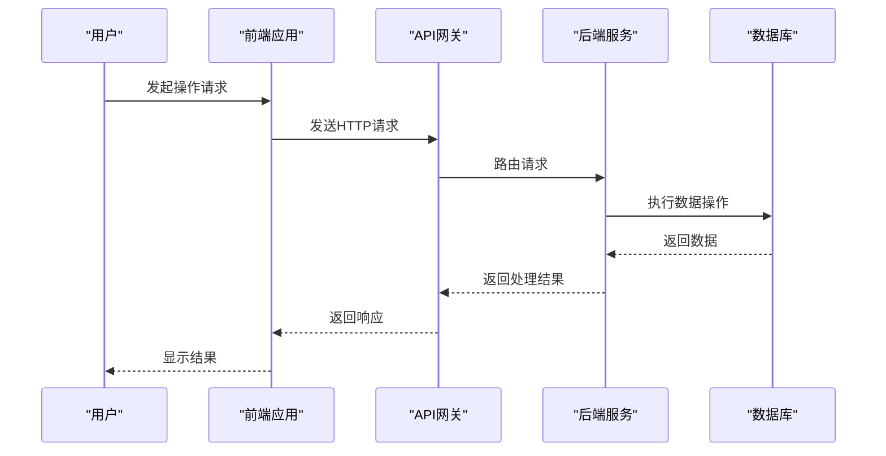
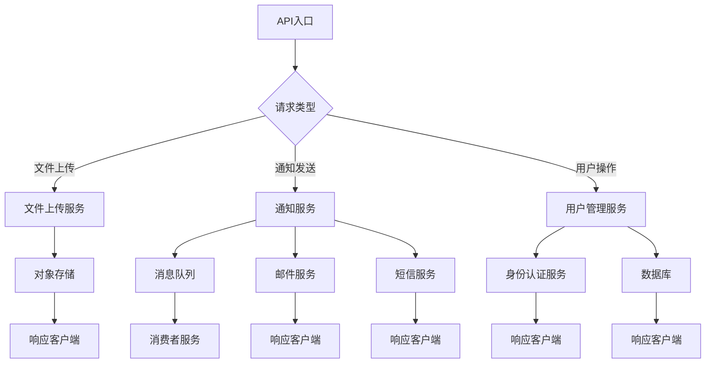
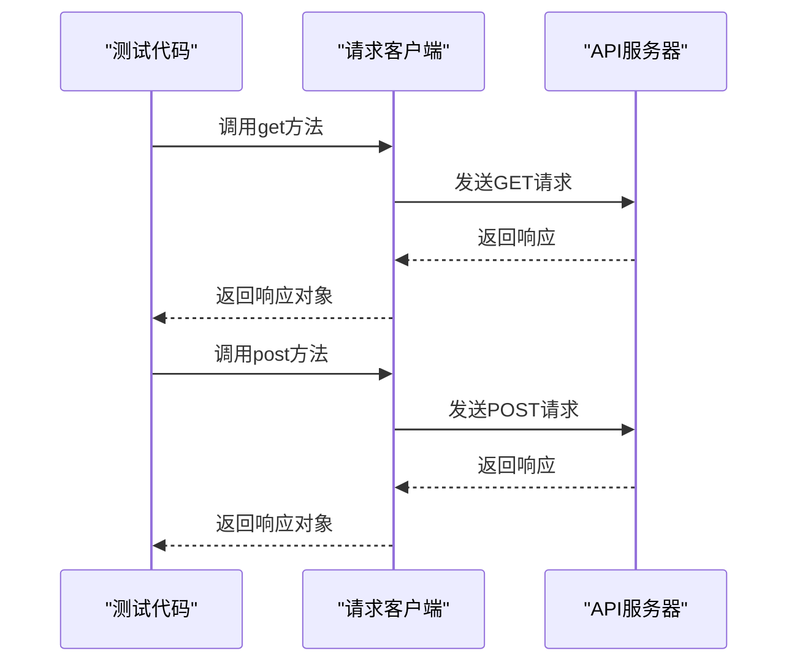
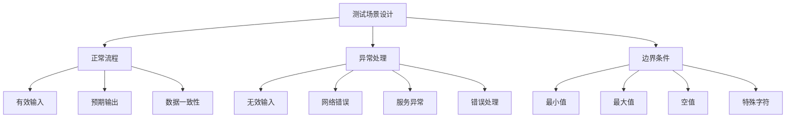
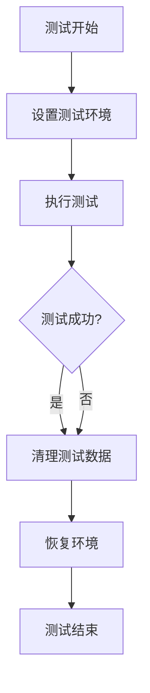

# 端到端测试

<cite>
**本文档引用的文件**  
- [request-client.test.ts](file://apps/react-admin/src/request-client/request-client.test.ts)
- [uploader.test.ts](file://apps/react-admin/src/request-client/modules/uploader.test.ts)
- [downloader.test.ts](file://apps/react-admin/src/request-client/modules/downloader.test.ts)
- [WrapResultController_Tests.cs](file://aspnet-core/tests/LINGYUN.Abp.AspNetCore.Mvc.Tests/LINGYUN/Abp/AspNetCore/Mvc/Results/WrapResultController_Tests.cs)
- [ProjectNameTestBase.cs](file://aspnet-core/templates/aio/content/tests/PackageName.CompanyName.ProjectName.TestBase/PackageName/CompanyName/ProjectName/ProjectNameTestBase.cs)
- [AbpAspNetCoreTestBase.cs](file://aspnet-core/tests/LINGYUN.Abp.AspNetCore.Tests/LINGYUN/Abp/AspNetCore/AbpAspNetCoreTestBase.cs)
- [ProjectNameDataSeederTests.cs](file://aspnet-core/templates/aio/content/tests/PackageName.CompanyName.ProjectName.Application.Tests/PackageName/CompanyName/ProjectName/DataSeeder/ProjectNameDataSeederTests.cs)
- [ProjectNameEntityFrameworkCoreTestModule.cs](file://aspnet-core/templates/aio/content/tests/PackageName.CompanyName.ProjectName.EntityFrameworkCore.Tests/PackageName/CompanyName/ProjectName/EntityFrameworkCore/ProjectNameEntityFrameworkCoreTestModule.cs)
</cite>

## 目录
1. [引言](#引言)
2. [端到端测试范围](#端到端测试范围)
3. [真实用户场景模拟](#真实用户场景模拟)
4. [跨微服务业务流程测试](#跨微服务业务流程测试)
5. [测试客户端使用方法](#测试客户端使用方法)
6. [测试场景设计指导](#测试场景设计指导)
7. [测试数据清理与环境隔离](#测试数据清理与环境隔离)
8. [结论](#结论)

## 引言
端到端测试是确保ABP Next Admin系统整体功能完整性和稳定性的关键环节。本文档详细描述了从API入口到数据存储的完整业务流程验证方法，涵盖了测试范围、真实场景模拟、跨服务流程测试、测试客户端使用、场景设计指导以及测试环境管理等方面，为开发团队提供全面的端到端测试指南。

## 端到端测试范围
端到端测试的范围覆盖了从API入口点到数据持久化层的完整业务流程验证。测试不仅验证单个API接口的正确性，更重要的是验证整个业务流程的完整性和数据一致性。测试范围包括但不限于：

- API请求的正确处理和响应
- 业务逻辑的正确执行
- 数据库操作的准确性和完整性
- 异常情况的正确处理
- 跨服务调用的协调性

测试通过模拟真实用户操作，验证系统在各种正常和异常情况下的行为是否符合预期。

**本节来源**
- [WrapResultController_Tests.cs](file://aspnet-core/tests/LINGYUN.Abp.AspNetCore.Mvc.Tests/LINGYUN/Abp/AspNetCore/Mvc/Results/WrapResultController_Tests.cs)
- [ProjectNameDataSeederTests.cs](file://aspnet-core/templates/aio/content/tests/PackageName.CompanyName.ProjectName.Application.Tests/PackageName/CompanyName/ProjectName/DataSeeder/ProjectNameDataSeederTests.cs)

## 真实用户场景模拟
端到端测试通过模拟真实用户场景来验证系统的功能完整性。测试用例设计基于实际业务需求和用户行为模式，确保测试结果能够真实反映系统在生产环境中的表现。

测试模拟包括：
- 用户登录和身份验证流程
- 数据创建、读取、更新和删除（CRUD）操作
- 文件上传和下载操作
- 通知发送和接收
- 复杂业务流程的完整执行

通过使用测试客户端发送HTTP请求并验证响应，测试能够准确模拟用户与系统的交互过程。

**图表来源**
- [request-client.test.ts](file://apps/react-admin/src/request-client/request-client.test.ts)
- [WrapResultController_Tests.cs](file://aspnet-core/tests/LINGYUN.Abp.AspNetCore.Mvc.Tests/LINGYUN/Abp/AspNetCore/Mvc/Results/WrapResultController_Tests.cs)

**本节来源**
- [request-client.test.ts](file://apps/react-admin/src/request-client/request-client.test.ts)
- [WrapResultController_Tests.cs](file://aspnet-core/tests/LINGYUN.Abp.AspNetCore.Mvc.Tests/LINGYUN/Abp/AspNetCore/Mvc/Results/WrapResultController_Tests.cs)

## 跨微服务业务流程测试
在微服务架构中，端到端测试需要验证跨多个微服务的业务流程。ABP Next Admin系统通过API网关协调各个微服务之间的调用，确保业务流程的完整性和一致性。

测试重点包括：
- 通知发送流程：验证从触发通知到实际发送的完整流程
- 文件上传下载：测试文件存储服务与其他服务的集成
- 用户管理：验证身份认证服务与用户管理服务的协同工作
- 数据同步：确保多个服务之间的数据一致性

通过模拟完整的业务流程，测试能够发现服务间集成的问题，确保系统整体的稳定性和可靠性。

**图表来源**
- [request-client.test.ts](file://apps/react-admin/src/request-client/request-client.test.ts)
- [uploader.test.ts](file://apps/react-admin/src/request-client/modules/uploader.test.ts)
- [downloader.test.ts](file://apps/react-admin/src/request-client/modules/downloader.test.ts)

**本节来源**
- [request-client.test.ts](file://apps/react-admin/src/request-client/request-client.test.ts)
- [uploader.test.ts](file://apps/react-admin/src/request-client/modules/uploader.test.ts)
- [downloader.test.ts](file://apps/react-admin/src/request-client/modules/downloader.test.ts)

## 测试客户端使用方法
测试客户端是执行端到端测试的核心工具，负责发送HTTP请求并验证响应。ABP Next Admin系统提供了完善的测试客户端，支持各种HTTP方法和数据格式。

### 发送HTTP请求
测试客户端支持以下HTTP方法：
- GET：获取资源
- POST：创建资源
- PUT：更新资源
- DELETE：删除资源

**图表来源**
- [request-client.test.ts](file://apps/react-admin/src/request-client/request-client.test.ts)

### 验证响应
测试客户端提供了丰富的响应验证方法，确保API返回结果的正确性：

- 验证HTTP状态码
- 验证响应数据结构
- 验证响应内容
- 验证异常处理

测试代码示例：
- [request-client.test.ts](file://apps/react-admin/src/request-client/request-client.test.ts)中的测试用例展示了如何使用测试客户端发送各种类型的请求并验证响应。

**本节来源**
- [request-client.test.ts](file://apps/react-admin/src/request-client/request-client.test.ts)
- [AbpAspNetCoreTestBase.cs](file://aspnet-core/tests/LINGYUN.Abp.AspNetCore.Tests/LINGYUN/Abp/AspNetCore/AbpAspNetCoreTestBase.cs)

## 测试场景设计指导
有效的测试场景设计是确保测试覆盖率和质量的关键。测试场景应涵盖正常流程、异常处理和边界条件，确保系统在各种情况下都能正确运行。

### 正常流程测试
正常流程测试验证系统在预期条件下的行为。测试用例应覆盖主要业务功能，确保核心流程的正确性。

测试要点：
- 输入有效数据
- 验证预期结果
- 检查数据一致性
- 验证业务规则

### 异常处理测试
异常处理测试验证系统在错误条件下的行为。测试用例应模拟各种异常情况，确保系统能够正确处理错误并提供有意义的反馈。

测试要点：
- 输入无效数据
- 模拟网络错误
- 模拟服务不可用
- 验证错误响应格式

### 边界条件测试
边界条件测试验证系统在极限条件下的行为。测试用例应覆盖输入范围的边界值，确保系统在极端情况下仍能正确运行。

测试要点：
- 最小/最大输入值
- 空值和null值
- 特殊字符
- 大数据量

**图表来源**
- [WrapResultController_Tests.cs](file://aspnet-core/tests/LINGYUN.Abp.AspNetCore.Mvc.Tests/LINGYUN/Abp/AspNetCore/Mvc/Results/WrapResultController_Tests.cs)
- [request-client.test.ts](file://apps/react-admin/src/request-client/request-client.test.ts)

**本节来源**
- [WrapResultController_Tests.cs](file://aspnet-core/tests/LINGYUN.Abp.AspNetCore.Mvc.Tests/LINGYUN/Abp/AspNetCore/Mvc/Results/WrapResultController_Tests.cs)
- [request-client.test.ts](file://apps/react-admin/src/request-client/request-client.test.ts)

## 测试数据清理与环境隔离
测试数据清理和环境隔离是确保测试稳定性和可靠性的关键因素。每个测试用例都应在独立的环境中运行，避免测试间的数据污染。

### 测试数据清理
每次测试执行后，必须清理测试过程中创建的数据，确保测试环境的清洁。ABP Next Admin系统通过以下机制实现测试数据清理：

- 使用单元工作（Unit of Work）模式管理数据库事务
- 在测试完成后回滚或清理数据
- 使用独立的测试数据库

### 环境隔离
测试环境应与开发和生产环境隔离，确保测试不会影响其他环境。ABP Next Admin系统通过以下方式实现环境隔离：

- 使用独立的测试数据库
- 配置独立的测试连接字符串
- 使用环境变量控制测试配置

测试基类提供了环境配置和数据清理的基础设施：

- [ProjectNameTestBase.cs](file://aspnet-core/templates/aio/content/tests/PackageName.CompanyName.ProjectName.TestBase/PackageName/CompanyName/ProjectName/ProjectNameTestBase.cs)定义了测试基类，提供了单元工作管理功能
- [ProjectNameEntityFrameworkCoreTestModule.cs](file://aspnet-core/templates/aio/content/tests/PackageName.CompanyName.ProjectName.EntityFrameworkCore.Tests/PackageName/CompanyName/ProjectName/EntityFrameworkCore/ProjectNameEntityFrameworkCoreTestModule.cs)配置了测试数据库连接

**图表来源**
- [ProjectNameTestBase.cs](file://aspnet-core/templates/aio/content/tests/PackageName.CompanyName.ProjectName.TestBase/PackageName/CompanyName/ProjectName/ProjectNameTestBase.cs)
- [ProjectNameEntityFrameworkCoreTestModule.cs](file://aspnet-core/templates/aio/content/tests/PackageName.CompanyName.ProjectName.EntityFrameworkCore.Tests/PackageName/CompanyName/ProjectName/EntityFrameworkCore/ProjectNameEntityFrameworkCoreTestModule.cs)

**本节来源**
- [ProjectNameTestBase.cs](file://aspnet-core/templates/aio/content/tests/PackageName.CompanyName.ProjectName.TestBase/PackageName/CompanyName/ProjectName/ProjectNameTestBase.cs)
- [ProjectNameEntityFrameworkCoreTestModule.cs](file://aspnet-core/templates/aio/content/tests/PackageName.CompanyName.ProjectName.EntityFrameworkCore.Tests/PackageName/CompanyName/ProjectName/EntityFrameworkCore/ProjectNameEntityFrameworkCoreTestModule.cs)
- [ProjectNameDataSeederTests.cs](file://aspnet-core/templates/aio/content/tests/PackageName.CompanyName.ProjectName.Application.Tests/PackageName/CompanyName/ProjectName/DataSeeder/ProjectNameDataSeederTests.cs)

## 结论
端到端测试是确保ABP Next Admin系统质量和稳定性的关键环节。通过全面的测试范围、真实用户场景模拟、跨微服务业务流程验证、有效的测试客户端使用、科学的测试场景设计以及严格的测试数据管理和环境隔离，可以确保系统在各种情况下都能正确运行。遵循本文档的指导，开发团队可以建立完善的端到端测试体系，提高软件质量和开发效率。