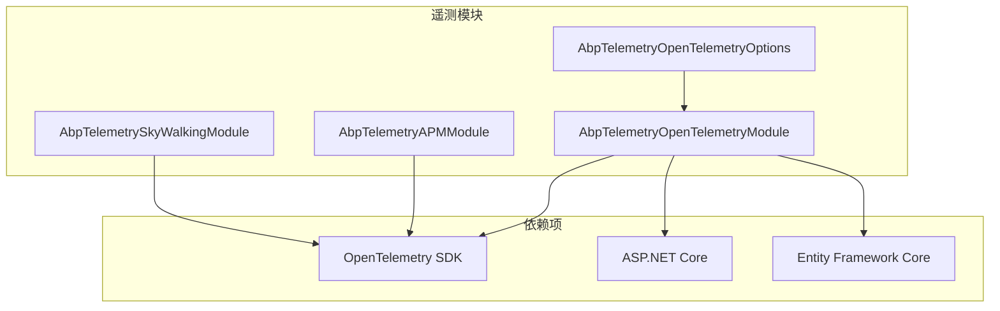
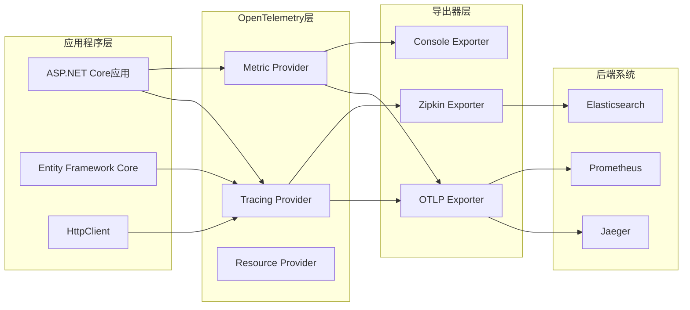
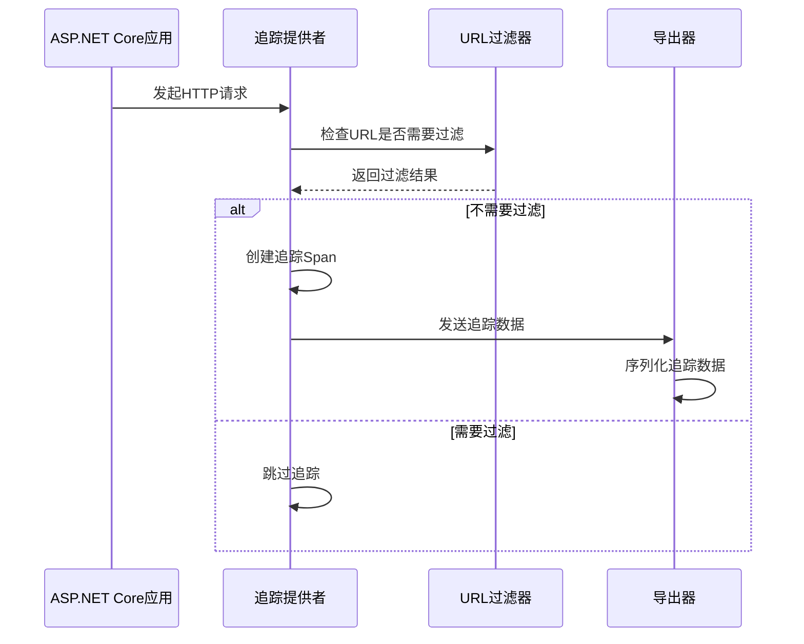
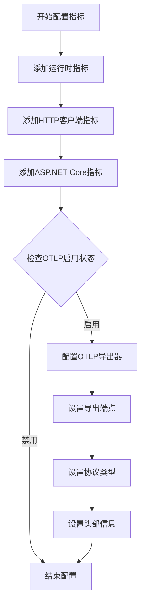
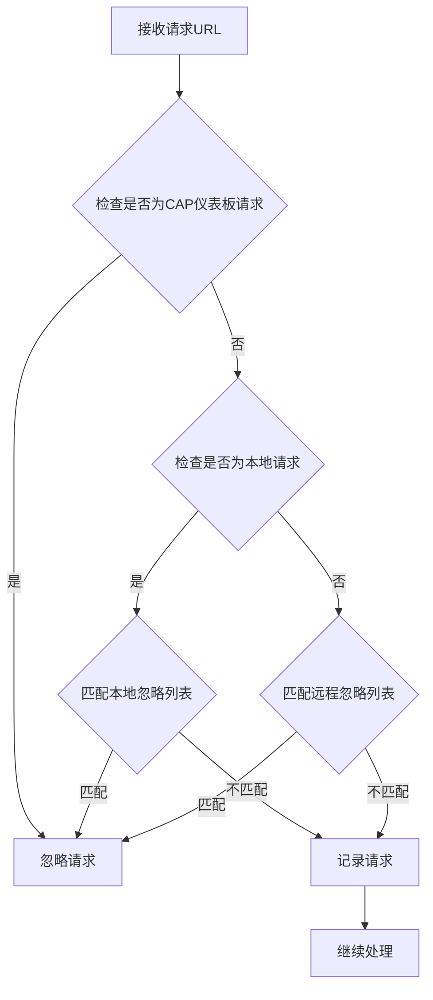

# OpenTelemetry集成

<cite>
**本文档中引用的文件**
- [AbpTelemetryOpenTelemetryModule.cs](file://aspnet-core/framework/telemetry/LINGYUN.Abp.Telemetry.OpenTelemetry/LINGYUN/Abp/Telemetry/OpenTelemetry/AbpTelemetryOpenTelemetryModule.cs)
- [AbpTelemetryOpenTelemetryOptions.cs](file://aspnet-core/framework/telemetry/LINGYUN.Abp.Telemetry.OpenTelemetry/LINGYUN/Abp/Telemetry/OpenTelemetry/AbpTelemetryOpenTelemetryOptions.cs)
- [AbpTelemetryAPMModule.cs](file://aspnet-core/framework/telemetry/LINGYUN.Abp.Telemetry.APM/LINGYUNG/Abp/Telemetry/APM/AbpTelemetryAPMModule.cs)
- [AbpTelemetrySkyWalkingModule.cs](file://aspnet-core/framework/telemetry/LINGYUN.Abp.Telemetry.SkyWalking/LINGYUN/Abp/Telemetry/SkyWalking/AbpTelemetrySkyWalkingModule.cs)
- [SkyWalkingServiceCollectionExtensions.cs](file://aspnet-core/framework/telemetry/LINGYUN.Abp.Telemetry.SkyWalking/Microsoft/Extensions/DependencyInjection/SkyWalkingServiceCollectionExtensions.cs)
</cite>

## 目录
1. [简介](#简介)
2. [项目结构](#项目结构)
3. [核心组件](#核心组件)
4. [架构概览](#架构概览)
5. [详细组件分析](#详细组件分析)
6. [配置选项详解](#配置选项详解)
7. [数据导出器配置](#数据导出器配置)
8. [实际使用示例](#实际使用示例)
9. [性能考虑](#性能考虑)
10. [故障排除指南](#故障排除指南)
11. [结论](#结论)

## 简介

OpenTelemetry是云原生计算基金会(CNCF)的一个开源项目，旨在提供标准化的可观测性数据收集和导出。在ABP框架中，OpenTelemetry集成通过`LINGYUN.Abp.Telemetry.OpenTelemetry`模块实现了对指标、日志和追踪数据的全面收集与导出功能。

该模块提供了以下核心功能：
- 自动化的应用程序性能监控(APM)
- 多种数据导出器支持（OTLP、Zipkin、控制台）
- 可配置的采样策略
- 与Prometheus、Jaeger等后端系统的无缝集成
- 针对ASP.NET Core应用的深度集成

## 项目结构

OpenTelemetry集成模块位于`aspnet-core/framework/telemetry`目录下，包含三个主要子模块：



**图表来源**
- [AbpTelemetryOpenTelemetryModule.cs](file://aspnet-core/framework/telemetry/LINGYUN.Abp.Telemetry.OpenTelemetry/LINGYUN/Abp/Telemetry/OpenTelemetry/AbpTelemetryOpenTelemetryModule.cs#L1-L161)
- [AbpTelemetryOpenTelemetryOptions.cs](file://aspnet-core/framework/telemetry/LINGYUN.Abp.Telemetry.OpenTelemetry/LINGYUN/Abp/Telemetry/OpenTelemetry/AbpTelemetryOpenTelemetryOptions.cs#L1-L59)

**章节来源**
- [AbpTelemetryOpenTelemetryModule.cs](file://aspnet-core/framework/telemetry/LINGYUN.Abp.Telemetry.OpenTelemetry/LINGYUN/Abp/Telemetry/OpenTelemetry/AbpTelemetryOpenTelemetryModule.cs#L1-L161)
- [AbpTelemetryOpenTelemetryOptions.cs](file://aspnet-core/framework/telemetry/LINGYUN.Abp.Telemetry.OpenTelemetry/LINGYUN/Abp/Telemetry/OpenTelemetry/AbpTelemetryOpenTelemetryOptions.cs#L1-L59)

## 核心组件

### AbpTelemetryOpenTelemetryModule

这是OpenTelemetry集成的核心模块，继承自`AbpModule`，负责配置和初始化OpenTelemetry功能。

```csharp
public class AbpTelemetryOpenTelemetryModule : AbpModule
{
    public override void PreConfigureServices(ServiceConfigurationContext context)
    {
        var configuration = context.Services.GetConfiguration();
        
        PreConfigure<AbpTelemetryOpenTelemetryOptions>(options =>
        {
            var ignureRequestLocalUrlPrefixs = configuration.GetSection("OpenTelemetry:IgnoreUrls:Local").Get<List<string>>();
            if (ignureRequestLocalUrlPrefixs != null)
            {
                options.IgnoreLocalRequestUrls = ignureRequestLocalUrlPrefixs;
            }
            var ignureRequestRemoteUrlPrefixs = configuration.GetSection("OpenTelemetry:IgnoreUrls:Remote").Get<List<string>>();
            if (ignureRequestRemoteUrlPrefixs != null)
            {
                options.IgnoreRemoteRequestUrls = ignureRequestRemoteUrlPrefixs;
            }
        });
    }
}
```

### AbpTelemetryOpenTelemetryOptions

该类定义了OpenTelemetry模块的配置选项，包括URL过滤规则和默认行为设置。

**章节来源**
- [AbpTelemetryOpenTelemetryModule.cs](file://aspnet-core/framework/telemetry/LINGYUN.Abp.Telemetry.OpenTelemetry/LINGYUN/Abp/Telemetry/OpenTelemetry/AbpTelemetryOpenTelemetryModule.cs#L13-L35)
- [AbpTelemetryOpenTelemetryOptions.cs](file://aspnet-core/framework/telemetry/LINGYUN.Abp.Telemetry.OpenTelemetry/LINGYUN/Abp/Telemetry/OpenTelemetry/AbpTelemetryOpenTelemetryOptions.cs#L1-L59)

## 架构概览

OpenTelemetry集成采用分层架构设计，支持多种数据类型和导出器：



**图表来源**
- [AbpTelemetryOpenTelemetryModule.cs](file://aspnet-core/framework/telemetry/LINGYUN.Abp.Telemetry.OpenTelemetry/LINGYUN/Abp/Telemetry/OpenTelemetry/AbpTelemetryOpenTelemetryModule.cs#L40-L70)
- [AbpTelemetryOpenTelemetryModule.cs](file://aspnet-core/framework/telemetry/LINGYUN.Abp.Telemetry.OpenTelemetry/LINGYUN/Abp/Telemetry/OpenTelemetry/AbpTelemetryOpenTelemetryModule.cs#L103-L159)

## 详细组件分析

### 追踪配置组件

追踪配置是OpenTelemetry集成的核心部分，负责收集和处理分布式追踪数据：



**图表来源**
- [AbpTelemetryOpenTelemetryModule.cs](file://aspnet-core/framework/telemetry/LINGYUN.Abp.Telemetry.OpenTelemetry/LINGYUN/Abp/Telemetry/OpenTelemetry/AbpTelemetryOpenTelemetryModule.cs#L66-L105)

### 指标配置组件

指标配置负责收集应用程序的运行时指标数据：



**图表来源**
- [AbpTelemetryOpenTelemetryModule.cs](file://aspnet-core/framework\telemetry\LINGYUN.Abp.Telemetry.OpenTelemetry\LINGYUN\Abp\Telemetry\OpenTelemetry\AbpTelemetryOpenTelemetryModule.cs#L141-L159)

**章节来源**
- [AbpTelemetryOpenTelemetryModule.cs](file://aspnet-core/framework/telemetry/LINGYUN.Abp.Telemetry.OpenTelemetry/LINGYUN/Abp/Telemetry/OpenTelemetry/AbpTelemetryOpenTelemetryModule.cs#L66-L159)

## 配置选项详解

### 基本配置选项

OpenTelemetry模块提供了丰富的配置选项来控制其行为：

```csharp
public class AbpTelemetryOpenTelemetryOptions
{
    /// <summary>
    /// 是否忽略CAP仪表板请求, 默认: true
    /// </summary>
    public bool IgnoreCapDashboardUrls { get; set; }
    
    /// <summary>
    /// 是否忽略ES请求, 默认: true
    /// </summary>
    public bool IgnoreElasticsearchUrls { get; set; }
    
    /// <summary>
    /// 忽略本地请求路径
    /// </summary>
    public List<string> IgnoreLocalRequestUrls { get; set; }
    
    /// <summary>
    /// 忽略远程请求路径
    /// </summary>
    public List<string> IgnoreRemoteRequestUrls { get; set; }
}
```

### URL过滤机制

模块内置了智能的URL过滤机制，可以自动忽略特定类型的请求：



**图表来源**
- [AbpTelemetryOpenTelemetryOptions.cs](file://aspnet-core/framework/telemetry/LINGYUN.Abp.Telemetry.OpenTelemetry/LINGYUN/Abp/Telemetry/OpenTelemetry/AbpTelemetryOpenTelemetryOptions.cs#L35-L59)

**章节来源**
- [AbpTelemetryOpenTelemetryOptions.cs](file://aspnet-core/framework/telemetry/LINGYUN.Abp.Telemetry.OpenTelemetry/LINGYUN/Abp/Telemetry/OpenTelemetry/AbpTelemetryOpenTelemetryOptions.cs#L1-L59)

## 数据导出器配置

### OTLP导出器配置

OpenTelemetry协议(OTLP)是最常用的导出协议，支持多种传输协议：

```csharp
// 追踪数据导出配置
if (configuration.GetValue("OpenTelemetry:Otlp:IsEnabled", false))
{
    tracing.AddOtlpExporter(otlpOptions =>
    {
        var otlpEndPoint = configuration["OpenTelemetry:Otlp:Endpoint"];
        Check.NotNullOrWhiteSpace(otlpEndPoint, nameof(otlpEndPoint));

        otlpOptions.Headers = configuration["OpenTelemetry:Otlp:Headers"];
        otlpOptions.Endpoint = new Uri(otlpEndPoint.EnsureEndsWith('/') + "v1/traces");
        otlpOptions.Protocol = configuration.GetValue("OpenTelemetry:Otlp:Protocol", otlpOptions.Protocol);
    });
}
```

### Zipkin导出器配置

Zipkin是另一个流行的分布式追踪系统：

```csharp
if (configuration.GetValue("OpenTelemetry:ZipKin:IsEnabled", false))
{
    tracing.AddZipkinExporter(zipKinOptions =>
    {
        var zipkinEndPoint = configuration["OpenTelemetry:ZipKin:Endpoint"];
        Check.NotNullOrWhiteSpace(zipkinEndPoint, nameof(zipkinEndPoint));

        zipKinOptions.Endpoint = new Uri(zipkinEndPoint);
    });
}
```

### 控制台导出器配置

用于开发和调试阶段的简单输出：

```csharp
if (configuration.GetValue("OpenTelemetry:Console:IsEnabled", false))
{
    tracing.AddConsoleExporter();
}
```

**章节来源**
- [AbpTelemetryOpenTelemetryModule.cs](file://aspnet-core/framework/telemetry/LINGYUN.Abp.Telemetry.OpenTelemetry/LINGYUN/Abp/Telemetry/OpenTelemetry/AbpTelemetryOpenTelemetryModule.cs#L103-L159)

## 实际使用示例

### 基本配置示例

在`appsettings.json`中启用OpenTelemetry：

```json
{
  "OpenTelemetry": {
    "IsEnabled": true,
    "ServiceName": "MyApplication",
    "IgnoreUrls": {
      "Local": [
        "/healthz",
        "/metrics"
      ],
      "Remote": [
        "/_bulk"
      ]
    },
    "Otlp": {
      "IsEnabled": true,
      "Endpoint": "http://jaeger:14268/api/traces",
      "Protocol": "HttpProtobuf"
    },
    "Console": {
      "IsEnabled": false
    },
    "ZipKin": {
      "IsEnabled": false,
      "Endpoint": "http://zipkin:9411/api/v2/spans"
    }
  }
}
```

### 启用模块的程序集配置

在应用程序启动类中注册模块：

```csharp
[DependsOn(typeof(AbpTelemetryOpenTelemetryModule))]
public class MyApplicationModule : AbpModule
{
    public override void ConfigureServices(ServiceConfigurationContext context)
    {
        // 其他配置...
    }
}
```

### 自定义采样策略

可以通过预配置动作来自定义采样策略：

```csharp
context.Services.PreConfigure<OpenTelemetryBuilder>(builder =>
{
    builder.WithTracing(tracingBuilder =>
    {
        tracingBuilder.SetSampler(new AlwaysOnSampler());
    });
});
```

## 性能考虑

### 内存管理

OpenTelemetry模块采用了以下策略来优化内存使用：

1. **智能URL过滤**：避免不必要的追踪数据收集
2. **可配置采样率**：减少数据量以降低内存占用
3. **异步导出**：避免阻塞主线程

### 网络优化

1. **批量导出**：支持批量发送追踪数据
2. **压缩传输**：支持gzip压缩以减少网络带宽
3. **连接复用**：重用HTTP连接以提高效率

## 故障排除指南

### 常见问题及解决方案

#### 1. 追踪数据未显示

**问题**：应用程序正常运行但没有看到追踪数据

**解决方案**：
- 检查`OpenTelemetry:IsEnabled`配置是否为true
- 确认导出器配置正确
- 验证后端系统是否正常运行

#### 2. 性能影响过大

**问题**：启用OpenTelemetry后应用程序性能下降

**解决方案**：
- 调整采样率配置
- 增加URL过滤规则以减少追踪范围
- 使用更高效的导出器

#### 3. 导出器连接失败

**问题**：无法连接到Jaeger或Prometheus

**解决方案**：
- 检查网络连通性
- 验证端点URL配置
- 检查防火墙设置

**章节来源**
- [AbpTelemetryOpenTelemetryModule.cs](file://aspnet-core/framework/telemetry/LINGYUN.Abp.Telemetry.OpenTelemetry/LINGYUN/Abp/Telemetry/OpenTelemetry/AbpTelemetryOpenTelemetryModule.cs#L40-L70)

## 结论

ABP框架的OpenTelemetry集成提供了一个强大而灵活的可观测性解决方案。通过`AbpTelemetryOpenTelemetryModule`和`AbpTelemetryOpenTelemetryOptions`的组合，开发者可以轻松地在应用程序中集成分布式追踪、指标收集和日志监控功能。

主要优势包括：

1. **开箱即用**：简单的配置即可启用完整的可观测性功能
2. **高度可配置**：支持多种导出器和自定义配置选项
3. **性能优化**：内置的过滤和采样机制确保最小性能影响
4. **生态系统兼容**：与主流的监控和追踪系统无缝集成

通过合理配置和使用这些组件，开发团队可以构建出具有完整可观测性的现代应用程序，从而更好地理解和优化系统性能。