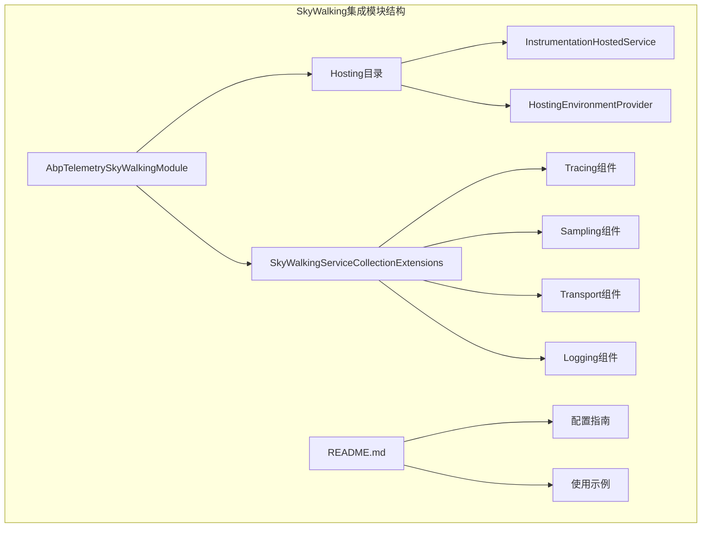
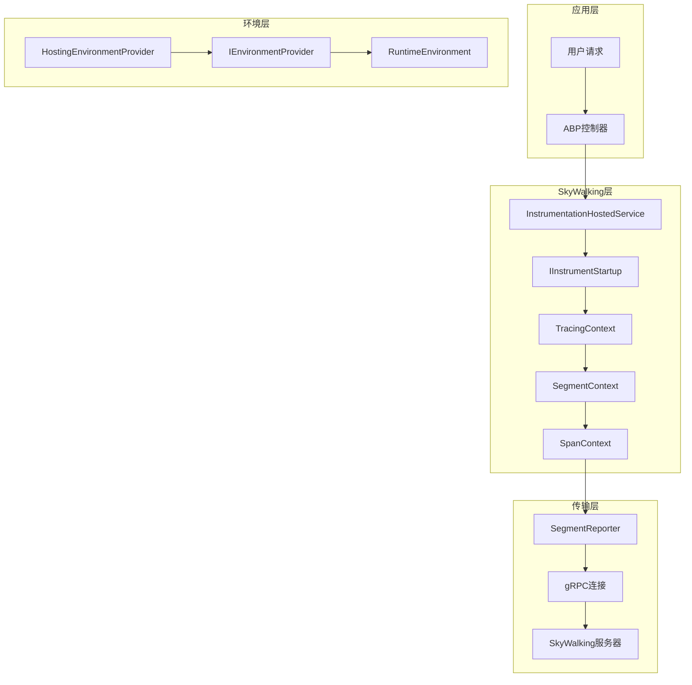
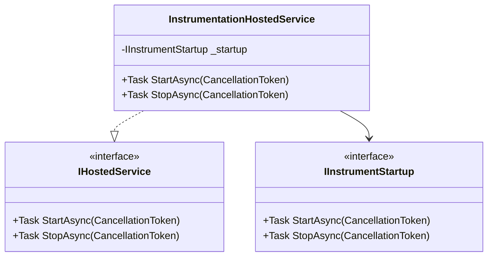
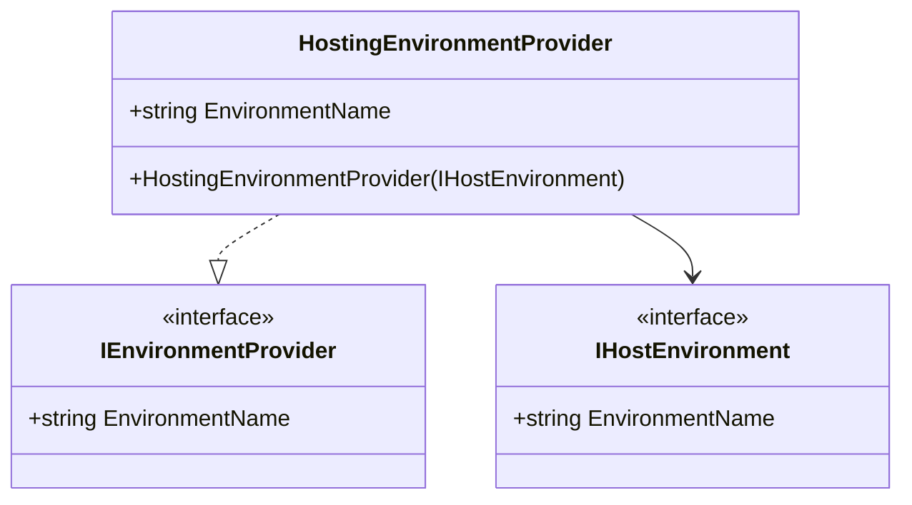
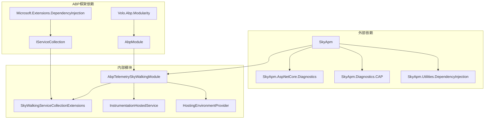
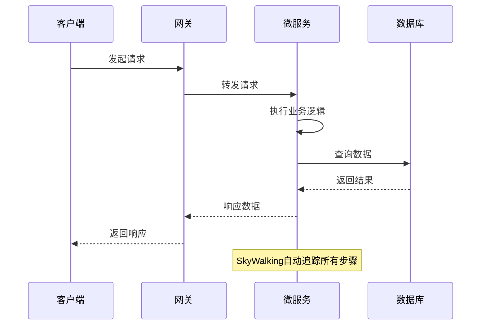

# SkyWalking集成

<cite>
**本文档中引用的文件**
- [AbpTelemetrySkyWalkingModule.cs](file://aspnet-core/framework/telemetry/LINGYUN.Abp.Telemetry.SkyWalking/LINGYUN/Abp/Telemetry/SkyWalking/AbpTelemetrySkyWalkingModule.cs)
- [SkyWalkingServiceCollectionExtensions.cs](file://aspnet-core/framework/telemetry/LINGYUN.Abp.Telemetry.SkyWalking/Microsoft/Extensions/DependencyInjection/SkyWalkingServiceCollectionExtensions.cs)
- [InstrumentationHostedService.cs](file://aspnet-core/framework/telemetry/LINGYUN.Abp.Telemetry.SkyWalking/LINGYUN/Abp/Telemetry/SkyWalking/Hosting/InstrumentationHostedService.cs)
- [HostingEnvironmentProvider.cs](file://aspnet-core/framework/telemetry/LINGYUN.Abp.Telemetry.SkyWalking/LINGYUN/Abp/Telemetry/SkyWalking/Hosting/HostingEnvironmentProvider.cs)
- [README.md](file://aspnet-core/framework/telemetry/LINGYUN.Abp.Telemetry.SkyWalking/README.md)
- [appsettings.json](file://aspnet-core/services/LY.MicroService.AuthServer.HttpApi.Host/appsettings.json)
</cite>

## 目录
1. [简介](#简介)
2. [项目结构](#项目结构)
3. [核心组件](#核心组件)
4. [架构概览](#架构概览)
5. [详细组件分析](#详细组件分析)
6. [依赖关系分析](#依赖关系分析)
7. [配置与使用](#配置与使用)
8. [最佳实践](#最佳实践)
9. [故障排除指南](#故障排除指南)
10. [总结](#总结)

## 简介

SkyWalking集成模块为ABP框架提供了完整的分布式追踪解决方案。该模块基于Apache SkyWalking技术栈，实现了自动化的性能监控、分布式追踪和应用程序性能管理(APM)功能。通过集成SkyWalking，开发者可以在微服务架构中轻松实现跨服务的链路追踪、性能指标收集和问题诊断。

该模块的核心特性包括：
- 自动化的分布式追踪埋点
- 多种数据源的自动监控（HTTP、数据库、消息队列等）
- 实时性能指标上报
- 微服务架构下的链路追踪
- 可配置的采样策略
- 与ABP框架深度集成

## 项目结构

SkyWalking集成模块采用清晰的分层架构设计，主要包含以下核心文件：



**图表来源**
- [AbpTelemetrySkyWalkingModule.cs](file://aspnet-core/framework/telemetry/LINGYUN.Abp.Telemetry.SkyWalking/LINGYUN/Abp/Telemetry/SkyWalking/AbpTelemetrySkyWalkingModule.cs#L1-L45)
- [SkyWalkingServiceCollectionExtensions.cs](file://aspnet-core/framework/telemetry/LINGYUN.Abp.Telemetry.SkyWalking/Microsoft/Extensions/DependencyInjection/SkyWalkingServiceCollectionExtensions.cs#L1-L119)

**章节来源**
- [AbpTelemetrySkyWalkingModule.cs](file://aspnet-core/framework/telemetry/LINGYUN.Abp.Telemetry.SkyWalking/LINGYUN/Abp/Telemetry/SkyWalking/AbpTelemetrySkyWalkingModule.cs#L1-L45)
- [README.md](file://aspnet-core/framework/telemetry/LINGYUN.Abp.Telemetry.SkyWalking/README.md#L1-L54)

## 核心组件

### AbpTelemetrySkyWalkingModule

这是SkyWalking集成的核心模块类，负责整个SkyWalking功能的初始化和配置。该模块继承自AbpModule，并在ConfigureServices方法中实现了智能的启用逻辑。

```csharp
public class AbpTelemetrySkyWalkingModule : AbpModule
{
    public override void ConfigureServices(ServiceConfigurationContext context)
    {
        var configuration = context.Services.GetConfiguration();
        var isSkywalkingEnabled = configuration["SkyWalking:IsEnabled"];
        if (isSkywalkingEnabled.IsNullOrWhiteSpace() || "false".Equals(isSkywalkingEnabled.ToLower()))
        {
            return;
        }

        var applicationName = configuration["SkyWalking:ServiceName"];
        if (applicationName.IsNullOrWhiteSpace())
        {
            applicationName = context.Services.GetApplicationName();
        }

        if (applicationName.IsNullOrWhiteSpace())
        {
            return;
        }

        Environment.SetEnvironmentVariable("SKYWALKING__SERVICENAME", applicationName);

        var skywalkingSetup = context.Services.GetPreConfigureActions<SkyApmExtensions>();

        context.Services.AddSkyWalking(setup =>
        {
            setup.AddAspNetCoreHosting();
            setup.AddCap();

            skywalkingSetup.Configure(setup);
        });
    }
}
```

### SkyWalkingServiceCollectionExtensions

这个静态扩展类提供了SkyWalking服务的完整注册和配置功能。它包含了多个私有方法来组织不同类型的SkyWalking组件：

- **AddTracing()**: 注册追踪相关的服务，包括上下文管理、段工厂、访问器等
- **AddSampling()**: 配置采样拦截器，支持随机采样和路径过滤
- **AddGrpcTransport()**: 设置gRPC传输层，包括连接管理和报告服务
- **AddSkyApmLogging()**: 配置SkyWalking的日志系统

**章节来源**
- [AbpTelemetrySkyWalkingModule.cs](file://aspnet-core/framework/telemetry/LINGYUN.Abp.Telemetry.SkyWalking/LINGYUN/Abp/Telemetry/SkyWalking/AbpTelemetrySkyWalkingModule.cs#L1-L45)
- [SkyWalkingServiceCollectionExtensions.cs](file://aspnet-core/framework\telemetry\LINGYUN.Abp.Telemetry.SkyWalking\Microsoft\Extensions\DependencyInjection\SkyWalkingServiceCollectionExtensions.cs#L1-L119)

## 架构概览

SkyWalking集成模块采用了分层架构设计，确保了良好的可维护性和扩展性：



**图表来源**
- [InstrumentationHostedService.cs](file://aspnet-core/framework/telemetry/LINGYUN.Abp.Telemetry.SkyWalking/LINGYUN/Abp/Telemetry/SkyWalking/Hosting/InstrumentationHostedService.cs#L1-L27)
- [HostingEnvironmentProvider.cs](file://aspnet-core/framework/telemetry/LINGYUN.Abp.Telemetry.SkyWalking/LINGYUN/Abp/Telemetry/SkyWalking/Hosting/HostingEnvironmentProvider.cs#L1-L15)

## 详细组件分析

### InstrumentationHostedService 分析

InstrumentationHostedService是SkyWalking集成中的关键组件，它实现了IHostedService接口，作为后台服务运行。



**图表来源**
- [InstrumentationHostedService.cs](file://aspnet-core/framework/telemetry/LINGYUN.Abp.Telemetry.SkyWalking/LINGYUN/Abp/Telemetry/SkyWalking/Hosting/InstrumentationHostedService.cs#L7-L26)

该服务的主要职责：
1. **生命周期管理**: 在应用启动时初始化SkyWalking追踪，在应用关闭时优雅地停止追踪
2. **依赖注入**: 通过构造函数注入IInstrumentStartup接口，实现解耦
3. **异步处理**: 支持CancellationToken，确保服务能够响应取消请求

### HostingEnvironmentProvider 分析

HostingEnvironmentProvider负责提供当前运行环境的信息，这对于SkyWalking正确标识服务实例至关重要。



**图表来源**
- [HostingEnvironmentProvider.cs](file://aspnet-core/framework/telemetry/LINGYUN.Abp.Telemetry.SkyWalking/LINGYUN/Abp/Telemetry/SkyWalking/Hosting/HostingEnvironmentProvider.cs#L6-L14)

**章节来源**
- [InstrumentationHostedService.cs](file://aspnet-core/framework/telemetry/LINGYUN.Abp.Telemetry.SkyWalking/LINGYUN/Abp/Telemetry/SkyWalking/Hosting/InstrumentationHostedService.cs#L1-L27)
- [HostingEnvironmentProvider.cs](file://aspnet-core/framework/telemetry/LINGYUN.Abp.Telemetry.SkyWalking/LINGYUN/Abp/Telemetry/SkyWalking/Hosting/HostingEnvironmentProvider.cs#L1-L15)

## 依赖关系分析

SkyWalking集成模块的依赖关系展现了清晰的分层结构：



**图表来源**
- [AbpTelemetrySkyWalkingModule.cs](file://aspnet-core/framework/telemetry/LINGYUN.Abp.Telemetry.SkyWalking/LINGYUN/Abp/Telemetry/SkyWalking/AbpTelemetrySkyWalkingModule.cs#L1-L6)
- [SkyWalkingServiceCollectionExtensions.cs](file://aspnet-core/framework/telemetry/LINGYUN.Abp.Telemetry.SkyWalking/Microsoft/Extensions\DependencyInjection/SkyWalkingServiceCollectionExtensions.cs#L1-L25)

**章节来源**
- [AbpTelemetrySkyWalkingModule.cs](file://aspnet-core/framework/telemetry/LINGYUN.Abp.Telemetry.SkyWalking/LINGYUN/Abp/Telemetry/SkyWalking/AbpTelemetrySkyWalkingModule.cs#L1-L45)
- [SkyWalkingServiceCollectionExtensions.cs](file://aspnet-core/framework/telemetry/LINGYUN.Abp.Telemetry.SkyWalking/Microsoft/Extensions\DependencyInjection/SkyWalkingServiceCollectionExtensions.cs#L1-L119)

## 配置与使用

### 基本配置

SkyWalking集成模块支持灵活的配置方式，可以通过appsettings.json文件进行配置：

```json
{
  "SkyWalking": {
    "IsEnabled": true,
    "ServiceName": "MyMicroservice"
  }
}
```

### 服务注册

在ABP模块中启用SkyWalking集成：

```csharp
[DependsOn(typeof(AbpTelemetrySkyWalkingModule))]
public class MyProjectModule : AbpModule
{
    public override void PreConfigureServices(ServiceConfigurationContext context)
    {
        PreConfigure<SkyApmExtensions>(skyapm =>
        {
            skyapm.AddCap();
            // 其他配置...
        });
    }
}
```

### 命令行工具配置

使用SkyAPM命令行工具生成配置文件：

```bash
# 切换到主程序目录
cd my-host-project-path

# 安装 skyapm 命令行工具
dotnet tool install -g SkyAPM.DotNet.CLI

# 生成 SkyWalking 配置文件
dotnet skyapm config auth_server localhost:11800
```

**章节来源**
- [appsettings.json](file://aspnet-core/services/LY.MicroService.AuthServer.HttpApi.Host/appsettings.json#L30-L33)
- [README.md](file://aspnet-core/framework/telemetry/LINGYUN.Abp.Telemetry.SkyWalking/README.md#L15-L40)

## 最佳实践

### 1. 启用条件控制

建议在生产环境中启用SkyWalking，在开发环境中禁用以减少性能开销：

```csharp
// appsettings.json
{
  "SkyWalking": {
    "IsEnabled": true
  }
}
```

### 2. 服务命名规范

为每个微服务设置唯一的服务名称：

```csharp
// appsettings.json
{
  "SkyWalking": {
    "ServiceName": "IdentityService"
  }
}
```

### 3. 配置预设选项

在模块的PreConfigureServices方法中添加自定义配置：

```csharp
public override void PreConfigureServices(ServiceConfigurationContext context)
{
    PreConfigure<SkyApmExtensions>(skyapm =>
    {
        skyapm.AddCap(); // 添加CAP消息队列支持
        // 添加其他自定义配置...
    });
}
```

### 4. 监控关键业务流程

确保重要的业务流程都被SkyWalking追踪：



## 故障排除指南

### 常见问题及解决方案

#### 1. SkyWalking未启用

**问题**: SkyWalking没有生效

**解决方案**:
- 检查appsettings.json中的IsEnabled配置
- 确保服务名称正确设置
- 验证环境变量是否正确设置

#### 2. 连接问题

**问题**: 无法连接到SkyWalking服务器

**解决方案**:
- 检查SkyWalking服务器地址和端口
- 验证网络连通性
- 确认防火墙设置

#### 3. 性能影响

**问题**: 启用SkyWalking后性能下降

**解决方案**:
- 调整采样率配置
- 优化追踪范围
- 在低负载时段启用

### 调试技巧

1. **启用调试日志**: 在appsettings.json中设置Serilog的最小日志级别为Debug
2. **检查环境变量**: 确认SKYWALKING__SERVICENAME环境变量已正确设置
3. **验证配置加载**: 确保SkyWalking配置正确加载到服务容器中

**章节来源**
- [AbpTelemetrySkyWalkingModule.cs](file://aspnet-core/framework/telemetry/LINGYUN.Abp.Telemetry.SkyWalking/LINGYUN/Abp/Telemetry/SkyWalking/AbpTelemetrySkyWalkingModule.cs#L11-L35)
- [README.md](file://aspnet-core/framework/telemetry/LINGYUN.Abp.Telemetry.SkyWalking/README.md#L40-L54)

## 总结

SkyWalking集成模块为ABP框架提供了强大而灵活的分布式追踪解决方案。通过AbpTelemetrySkyWalkingModule的智能配置、SkyWalkingServiceCollectionExtensions的全面服务注册、InstrumentationHostedService的生命周期管理以及HostingEnvironmentProvider的环境信息提供，该模块实现了：

1. **无缝集成**: 与ABP框架深度集成，无需复杂的配置过程
2. **自动追踪**: 自动化的分布式追踪埋点，覆盖HTTP、数据库、消息队列等多种场景
3. **高性能**: 优化的性能设计，支持高并发场景
4. **易于使用**: 简洁的配置方式和丰富的扩展点
5. **可观察性**: 提供完整的可观测性解决方案

该模块特别适合微服务架构的应用，能够帮助开发者快速构建具有完善监控能力的分布式系统。通过合理的配置和使用，可以显著提升系统的可观测性和运维效率。