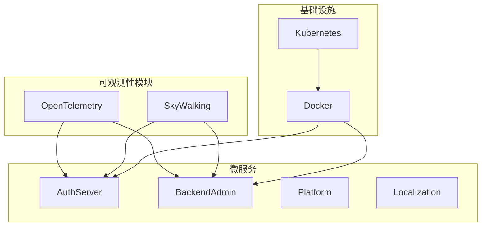
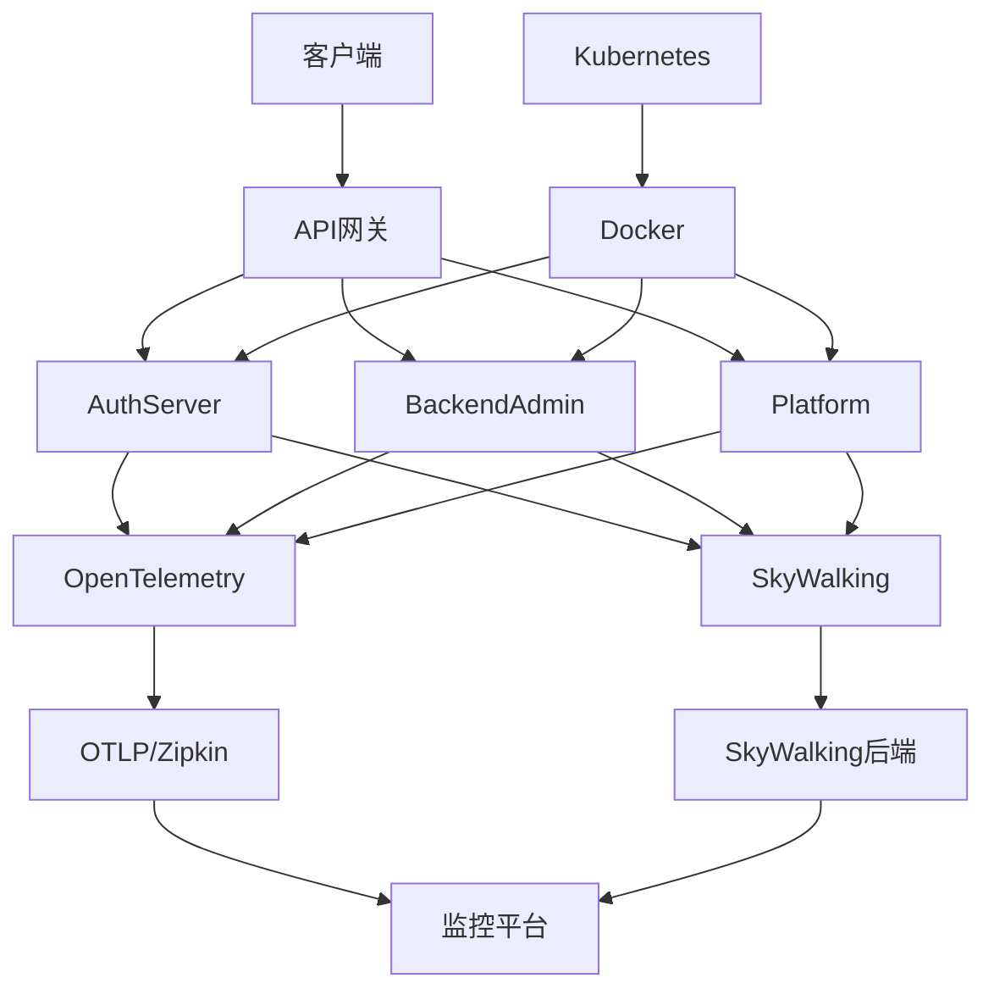

# 健康检查

<cite>
**本文档引用的文件**  
- [AbpTelemetryOpenTelemetryModule.cs](file://aspnet-core/framework/telemetry/LINGYUN.Abp.Telemetry.OpenTelemetry/LINGYUN/Abp/Telemetry/OpenTelemetry/AbpTelemetryOpenTelemetryModule.cs)
- [AbpTelemetrySkyWalkingModule.cs](file://aspnet-core/framework/telemetry/LINGYUN.Abp.Telemetry.SkyWalking/LINGYUN/Abp/Telemetry/SkyWalking/AbpTelemetrySkyWalkingModule.cs)
- [AbpTelemetryOpenTelemetryOptions.cs](file://aspnet-core/framework/telemetry/LINGYUN.Abp.Telemetry.OpenTelemetry/LINGYUN/Abp/Telemetry/OpenTelemetry/AbpTelemetryOpenTelemetryOptions.cs)
- [AuthServerHttpApiHostModule.Configure.cs](file://aspnet-core/services/LY.MicroService.AuthServer.HttpApi.Host/AuthServerHttpApiHostModule.Configure.cs)
- [BackendAdminHttpApiHostModule.Configure.cs](file://aspnet-core/services/LY.MicroService.BackendAdmin.HttpApi.Host/BackendAdminHttpApiHostModule.Configure.cs)
- [appsettings.json](file://aspnet-core/services/LY.MicroService.AuthServer.HttpApi.Host/appsettings.json)
- [appsettings.Development.json](file://aspnet-core/services/LY.MicroService.AuthServer.HttpApi.Host/appsettings.Development.json)
- [docker-compose.yml](file://docker-compose.yml)
- [SkyWalkingServiceCollectionExtensions.cs](file://aspnet-core/framework/telemetry/LINGYUN.Abp.Telemetry.SkyWalking/Microsoft/Extensions/DependencyInjection/SkyWalkingServiceCollectionExtensions.cs)
</cite>

## 目录
1. [介绍](#介绍)
2. [项目结构](#项目结构)
3. [核心组件](#核心组件)
4. [架构概述](#架构概述)
5. [详细组件分析](#详细组件分析)
6. [依赖分析](#依赖分析)
7. [性能考虑](#性能考虑)
8. [故障排除指南](#故障排除指南)
9. [结论](#结论)

## 介绍
本文档详细介绍了ABP Next Admin项目中基于OpenTelemetry和SkyWalking的健康检查机制。系统通过集成先进的可观测性工具，实现了对服务可用性、数据库连接、缓存服务等关键组件的全面监控。健康检查端点被配置为`/healthz`，并已集成到Docker Compose的健康检查配置中，确保容器化部署时的服务稳定性。文档还说明了如何在Kubernetes等容器编排平台中配置探针，以及如何实现自定义健康检查和告警规则。

## 项目结构
该项目采用微服务架构，包含多个服务模块，如AuthServer、BackendAdmin、LocalizationManagement等，每个服务都有独立的HTTP API主机。健康检查功能通过`AddHealthChecks()`方法在各个服务的模块配置中统一启用，并通过`MapHealthChecks`映射到`/healthz`端点。可观测性功能由`LINGYUN.Abp.Telemetry.OpenTelemetry`和`LINGYUN.Abp.Telemetry.SkyWalking`模块提供，支持OpenTelemetry和SkyWalking两种监控方案。



**图示来源**
- [AbpTelemetryOpenTelemetryModule.cs](file://aspnet-core/framework/telemetry/LINGYUN.Abp.Telemetry.OpenTelemetry/LINGYUN/Abp/Telemetry/OpenTelemetry/AbpTelemetryOpenTelemetryModule.cs)
- [AbpTelemetrySkyWalkingModule.cs](file://aspnet-core/framework/telemetry/LINGYUN.Abp.Telemetry.SkyWalking/LINGYUN/Abp/Telemetry/SkyWalking/AbpTelemetrySkyWalkingModule.cs)
- [docker-compose.yml](file://docker-compose.yml)

**本节来源**
- [AbpTelemetryOpenTelemetryModule.cs](file://aspnet-core/framework/telemetry/LINGYUN.Abp.Telemetry.OpenTelemetry/LINGYUN/Abp/Telemetry/OpenTelemetry/AbpTelemetryOpenTelemetryModule.cs)
- [AbpTelemetrySkyWalkingModule.cs](file://aspnet-core/framework/telemetry/LINGYUN.Abp.Telemetry.SkyWalking/LINGYUN/Abp/Telemetry/SkyWalking/AbpTelemetrySkyWalkingModule.cs)
- [docker-compose.yml](file://docker-compose.yml)

## 核心组件
系统健康检查的核心组件包括OpenTelemetry和SkyWalking两个可观测性模块，以及ASP.NET Core的健康检查中间件。OpenTelemetry模块通过`AbpTelemetryOpenTelemetryModule`配置分布式追踪和指标收集，而SkyWalking模块通过`AbpTelemetrySkyWalkingModule`集成SkyWalking APM。所有微服务通过`AddHealthChecks()`方法启用健康检查，并通过`MapHealthChecks`将端点映射到`/healthz`。

**本节来源**
- [AbpTelemetryOpenTelemetryModule.cs](file://aspnet-core/framework/telemetry/LINGYUN.Abp.Telemetry.OpenTelemetry/LINGYUN/Abp/Telemetry/OpenTelemetry/AbpTelemetryOpenTelemetryModule.cs)
- [AbpTelemetrySkyWalkingModule.cs](file://aspnet-core/framework/telemetry/LINGYUN.Abp.Telemetry.SkyWalking/LINGYUN/Abp/Telemetry/SkyWalking/AbpTelemetrySkyWalkingModule.cs)
- [AuthServerHttpApiHostModule.Configure.cs](file://aspnet-core/services/LY.MicroService.AuthServer.HttpApi.Host/AuthServerHttpApiHostModule.Configure.cs)

## 架构概述
系统的健康检查架构分为三层：应用层、可观测性层和基础设施层。应用层由多个微服务组成，每个服务都集成了健康检查中间件。可观测性层通过OpenTelemetry和SkyWalking收集服务的健康状态、性能指标和调用链路。基础设施层通过Docker Compose的健康检查配置和潜在的Kubernetes探针，确保服务的高可用性。



**图示来源**
- [AbpTelemetryOpenTelemetryModule.cs](file://aspnet-core/framework/telemetry/LINGYUN.Abp.Telemetry.OpenTelemetry/LINGYUN/Abp/Telemetry/OpenTelemetry/AbpTelemetryOpenTelemetryModule.cs)
- [AbpTelemetrySkyWalkingModule.cs](file://aspnet-core/framework/telemetry/LINGYUN.Abp.Telemetry.SkyWalking/LINGYUN/Abp/Telemetry/SkyWalking/AbpTelemetrySkyWalkingModule.cs)
- [docker-compose.yml](file://docker-compose.yml)

## 详细组件分析

### OpenTelemetry模块分析
OpenTelemetry模块负责收集分布式追踪和指标数据。它通过`WithTracing`和`WithMetrics`方法配置追踪和指标提供者，并支持多种导出器，如OTLP和Zipkin。健康检查请求`/healthz`被配置为忽略，以避免不必要的追踪记录。

```mermaid
classDiagram
    class AbpTelemetryOpenTelemetryModule {
        +ConfigureServices(ServiceConfigurationContext context)
        +PreConfigureServices(ServiceConfigurationContext context)
    }
    
    class AbpTelemetryOpenTelemetryOptions {
        +bool IgnoreCapDashboardUrls
        +bool IgnoreElasticsearchUrls
        +List~string~ IgnoreLocalRequestUrls
        +List~string~ IgnoreRemoteRequestUrls
        +bool IsIgnureLocalRequestUrl(string url)
    }
    
    AbpTelemetryOpenTelemetryModule