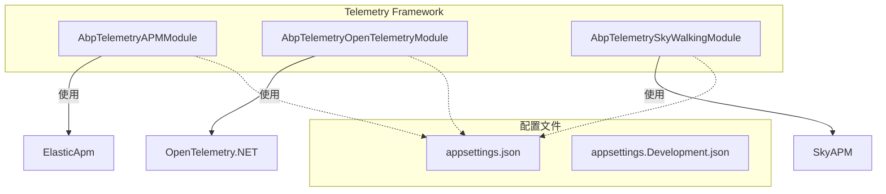
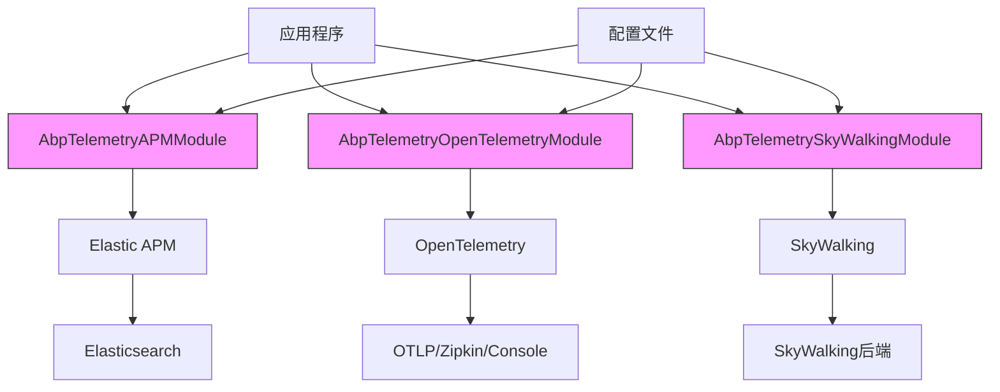
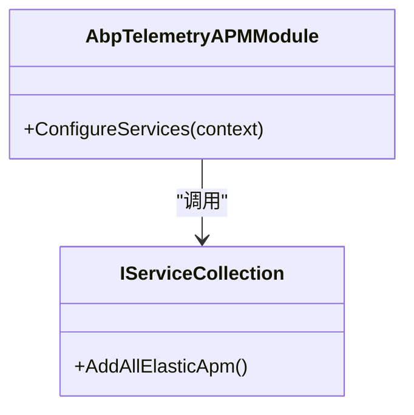
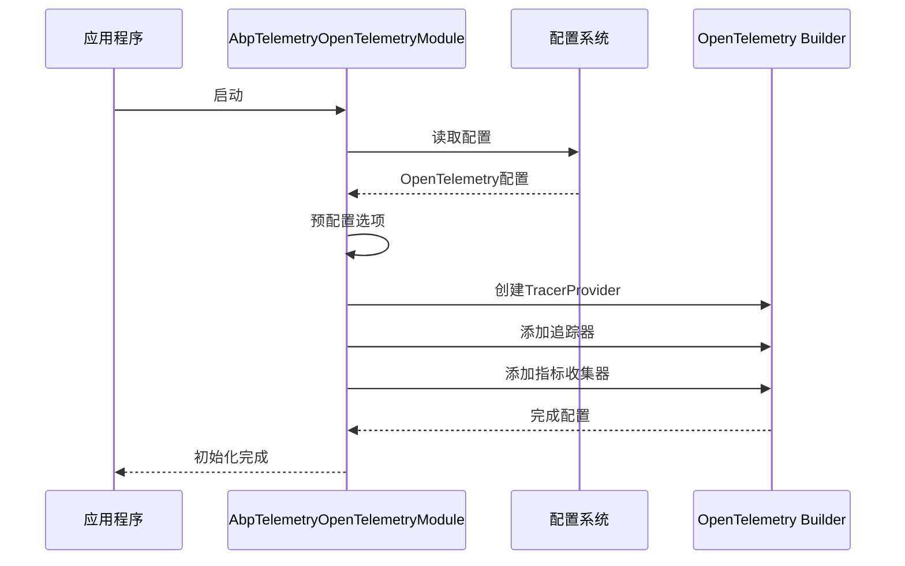
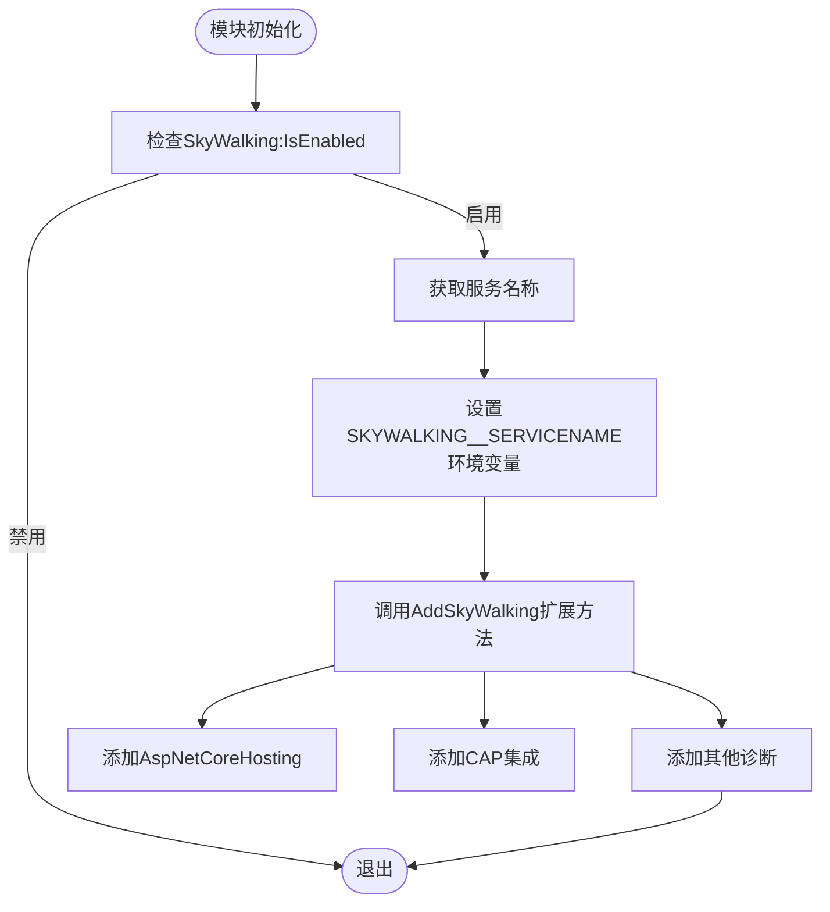
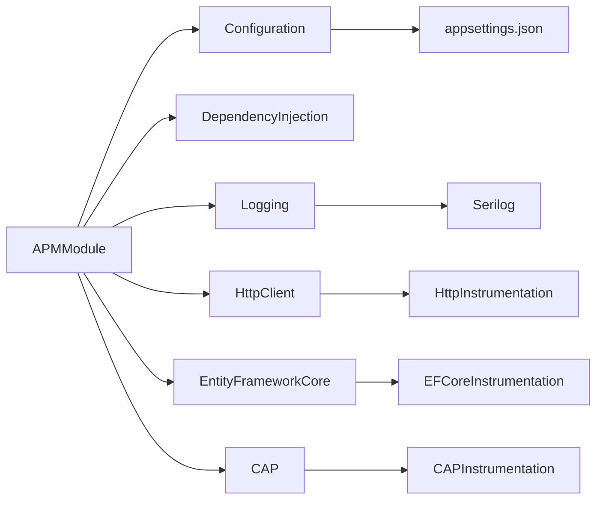

# 应用性能监控集成

<cite>
**本文档中引用的文件**  
- [AbpTelemetryAPMModule.cs](file://aspnet-core/framework/telemetry/LINGYUN.Abp.Telemetry.APM/LINGYUNG/Abp/Telemetry/APM/AbpTelemetryAPMModule.cs)
- [AbpTelemetryOpenTelemetryModule.cs](file://aspnet-core/framework/telemetry/LINGYUN.Abp.Telemetry.OpenTelemetry/LINGYUN/Abp/Telemetry/OpenTelemetry/AbpTelemetryOpenTelemetryModule.cs)
- [AbpTelemetrySkyWalkingModule.cs](file://aspnet-core/framework/telemetry/LINGYUN.Abp.Telemetry.SkyWalking/LINGYUN/Abp/Telemetry/SkyWalking/AbpTelemetrySkyWalkingModule.cs)
- [AbpTelemetryOpenTelemetryOptions.cs](file://aspnet-core/framework/telemetry/LINGYUN.Abp.Telemetry.OpenTelemetry/LINGYUN/Abp/Telemetry/OpenTelemetry/AbpTelemetryOpenTelemetryOptions.cs)
- [SkyWalkingServiceCollectionExtensions.cs](file://aspnet-core/framework/telemetry/LINGYUN.Abp.Telemetry.SkyWalking/Microsoft/Extensions/DependencyInjection/SkyWalkingServiceCollectionExtensions.cs)
- [appsettings.json](file://aspnet-core/services/LY.MicroService.Applications.Single/appsettings.json)
</cite>

## 目录
1. [引言](#引言)
2. [项目结构](#项目结构)
3. [核心组件](#核心组件)
4. [架构概述](#架构概述)
5. [详细组件分析](#详细组件分析)
6. [依赖分析](#依赖分析)
7. [性能考虑](#性能考虑)
8. [故障排除指南](#故障排除指南)
9. [结论](#结论)

## 引言
本文档详细介绍了ABP框架中应用性能监控（APM）的集成机制，重点分析了`AbpTelemetryAPMModule`模块的实现原理。文档涵盖了性能指标的收集与上报、模块配置与初始化过程，以及与后端监控系统的集成方法。通过深入解析代码实现和配置选项，为开发人员提供了一套完整的性能监控解决方案，帮助诊断和优化系统性能瓶颈。

## 项目结构
该项目采用模块化架构，APM相关功能位于`aspnet-core/framework/telemetry`目录下，包含多个独立的监控模块：

**Diagram sources**  
- [AbpTelemetryAPMModule.cs](file://aspnet-core/framework/telemetry/LINGYUN.Abp.Telemetry.APM/LINGYUNG/Abp/Telemetry/APM/AbpTelemetryAPMModule.cs)
- [AbpTelemetryOpenTelemetryModule.cs](file://aspnet-core/framework/telemetry/LINGYUN.Abp.Telemetry.OpenTelemetry/LINGYUN/Abp/Telemetry/OpenTelemetry/AbpTelemetryOpenTelemetryModule.cs)
- [AbpTelemetrySkyWalkingModule.cs](file://aspnet-core/framework/telemetry/LINGYUN.Abp.Telemetry.SkyWalking/LINGYUN/Abp/Telemetry/SkyWalking/AbpTelemetrySkyWalkingModule.cs)

**Section sources**
- [AbpTelemetryAPMModule.cs](file://aspnet-core/framework/telemetry/LINGYUN.Abp.Telemetry.APM/LINGYUNG/Abp/Telemetry/APM/AbpTelemetryAPMModule.cs)
- [AbpTelemetryOpenTelemetryModule.cs](file://aspnet-core/framework/telemetry/LINGYUN.Abp.Telemetry.OpenTelemetry/LINGYUN/Abp/Telemetry/OpenTelemetry/AbpTelemetryOpenTelemetryModule.cs)

## 核心组件
本节分析APM集成的核心组件，包括Elastic APM、OpenTelemetry和SkyWalking三种监控方案的实现机制。

**Section sources**
- [AbpTelemetryAPMModule.cs](file://aspnet-core/framework/telemetry/LINGYUN.Abp.Telemetry.APM/LINGYUNG/Abp/Telemetry/APM/AbpTelemetryAPMModule.cs)
- [AbpTelemetryOpenTelemetryModule.cs](file://aspnet-core/framework/telemetry/LINGYUN.Abp.Telemetry.OpenTelemetry/LINGYUN/Abp/Telemetry/OpenTelemetry/AbpTelemetryOpenTelemetryModule.cs)
- [AbpTelemetrySkyWalkingModule.cs](file://aspnet-core/framework/telemetry/LINGYUN.Abp.Telemetry.SkyWalking/LINGYUN/Abp/Telemetry/SkyWalking/AbpTelemetrySkyWalkingModule.cs)

## 架构概述
APM模块采用依赖注入和配置驱动的设计模式，通过模块化方式集成不同的监控系统。

**Diagram sources**  
- [AbpTelemetryAPMModule.cs](file://aspnet-core/framework/telemetry/LINGYUN.Abp.Telemetry.APM/LINGYUNG/Abp/Telemetry/APM/AbpTelemetryAPMModule.cs)
- [AbpTelemetryOpenTelemetryModule.cs](file://aspnet-core/framework/telemetry/LINGYUN.Abp.Telemetry.OpenTelemetry/LINGYUN/Abp/Telemetry/OpenTelemetry/AbpTelemetryOpenTelemetryModule.cs)
- [AbpTelemetrySkyWalkingModule.cs](file://aspnet-core/framework/telemetry/LINGYUN.Abp.Telemetry.SkyWalking/LINGYUN/Abp/Telemetry/SkyWalking/AbpTelemetrySkyWalkingModule.cs)

## 详细组件分析
### AbpTelemetryAPMModule分析
`AbpTelemetryAPMModule`是Elastic APM的集成模块，负责收集和上报应用性能指标。

**Diagram sources**  
- [AbpTelemetryAPMModule.cs](file://aspnet-core/framework/telemetry/LINGYUN.Abp.Telemetry.APM/LINGYUNG/Abp/Telemetry/APM/AbpTelemetryAPMModule.cs)

**Section sources**
- [AbpTelemetryAPMModule.cs](file://aspnet-core/framework/telemetry/LINGYUN.Abp.Telemetry.APM/LINGYUNG/Abp/Telemetry/APM/AbpTelemetryAPMModule.cs)

### AbpTelemetryOpenTelemetryModule分析
`AbpTelemetryOpenTelemetryModule`实现了OpenTelemetry标准，支持多种监控后端。

**Diagram sources**  
- [AbpTelemetryOpenTelemetryModule.cs](file://aspnet-core/framework/telemetry/LINGYUN.Abp.Telemetry.OpenTelemetry/LINGYUN/Abp/Telemetry/OpenTelemetry/AbpTelemetryOpenTelemetryModule.cs)
- [AbpTelemetryOpenTelemetryOptions.cs](file://aspnet-core/framework/telemetry/LINGYUN.Abp.Telemetry.OpenTelemetry/LINGYUN/Abp/Telemetry/OpenTelemetry/AbpTelemetryOpenTelemetryOptions.cs)

**Section sources**
- [AbpTelemetryOpenTelemetryModule.cs](file://aspnet-core/framework/telemetry/LINGYUN.Abp.Telemetry.OpenTelemetry/LINGYUN/Abp/Telemetry/OpenTelemetry/AbpTelemetryOpenTelemetryModule.cs)
- [AbpTelemetryOpenTelemetryOptions.cs](file://aspnet-core/framework/telemetry/LINGYUN.Abp.Telemetry.OpenTelemetry/LINGYUN/Abp/Telemetry/OpenTelemetry/AbpTelemetryOpenTelemetryOptions.cs)

### AbpTelemetrySkyWalkingModule分析
`AbpTelemetrySkyWalkingModule`集成了SkyWalking分布式追踪系统。

**Diagram sources**  
- [AbpTelemetrySkyWalkingModule.cs](file://aspnet-core/framework/telemetry/LINGYUN.Abp.Telemetry.SkyWalking/LINGYUN/Abp/Telemetry/SkyWalking/AbpTelemetrySkyWalkingModule.cs)
- [SkyWalkingServiceCollectionExtensions.cs](file://aspnet-core/framework/telemetry/LINGYUN.Abp.Telemetry.SkyWalking/Microsoft/Extensions/DependencyInjection/SkyWalkingServiceCollectionExtensions.cs)

**Section sources**
- [AbpTelemetrySkyWalkingModule.cs](file://aspnet-core/framework/telemetry/LINGYUN.Abp.Telemetry.SkyWalking/LINGYUN/Abp/Telemetry/SkyWalking/AbpTelemetrySkyWalkingModule.cs)
- [SkyWalkingServiceCollectionExtensions.cs](file://aspnet-core/framework/telemetry/LINGYUN.Abp.Telemetry.SkyWalking/Microsoft/Extensions/DependencyInjection/SkyWalkingServiceCollectionExtensions.cs)

## 依赖分析
APM模块与其他组件的依赖关系如下：

**Diagram sources**  
- [AbpTelemetryOpenTelemetryModule.cs](file://aspnet-core/framework/telemetry/LINGYUN.Abp.Telemetry.OpenTelemetry/LINGYUN/Abp/Telemetry/OpenTelemetry/AbpTelemetryOpenTelemetryModule.cs)
- [AbpTelemetrySkyWalkingModule.cs](file://aspnet-core/framework/telemetry/LINGYUN.Abp.Telemetry.SkyWalking/LINGYUN/Abp/Telemetry/SkyWalking/AbpTelemetrySkyWalkingModule.cs)

**Section sources**
- [AbpTelemetryOpenTelemetryModule.cs](file://aspnet-core/framework/telemetry/LINGYUN.Abp.Telemetry.OpenTelemetry/LINGYUN/Abp/Telemetry/OpenTelemetry/AbpTelemetryOpenTelemetryModule.cs)
- [AbpTelemetrySkyWalkingModule.cs](file://aspnet-core/framework/telemetry/LINGYUN.Abp.Telemetry.SkyWalking/LINGYUN/Abp/Telemetry/SkyWalking/AbpTelemetrySkyWalkingModule.cs)

## 性能考虑
APM监控对系统性能有一定影响，需要合理配置以平衡监控需求和性能开销。

- **采样率配置**：通过采样减少数据量，降低性能影响
- **忽略路径配置**：避免对健康检查等高频请求进行监控
- **异步上报**：所有监控数据通过异步方式上报，避免阻塞主流程
- **批量上报**：数据批量发送，减少网络开销
- **资源限制**：设置内存队列大小，防止内存溢出

## 故障排除指南
### 常见问题及解决方案
- **监控数据未上报**：检查配置文件中`OpenTelemetry:IsEnabled`或`SkyWalking:IsEnabled`是否设置为true
- **服务名称不正确**：确保`OpenTelemetry:ServiceName`或`SkyWalking:ServiceName`配置正确
- **端点连接失败**：验证OTLP或Zipkin端点地址是否正确可达
- **性能下降明显**：调整采样率或忽略不必要的监控路径

**Section sources**
- [AbpTelemetryOpenTelemetryModule.cs](file://aspnet-core/framework/telemetry/LINGYUN.Abp.Telemetry.OpenTelemetry/LINGYUN/Abp/Telemetry/OpenTelemetry/AbpTelemetryOpenTelemetryModule.cs)
- [AbpTelemetrySkyWalkingModule.cs](file://aspnet-core/framework/telemetry/LINGYUN.Abp.Telemetry.SkyWalking/LINGYUN/Abp/Telemetry/SkyWalking/AbpTelemetrySkyWalkingModule.cs)

## 结论
本文档详细介绍了ABP框架中APM模块的集成机制，涵盖了Elastic APM、OpenTelemetry和SkyWalking三种主流监控方案。通过模块化设计和配置驱动的方式，开发人员可以灵活选择适合的监控方案，并根据实际需求进行定制化配置。合理的APM集成不仅能帮助及时发现性能瓶颈，还能为系统优化提供数据支持，是构建高可用、高性能应用的重要组成部分。