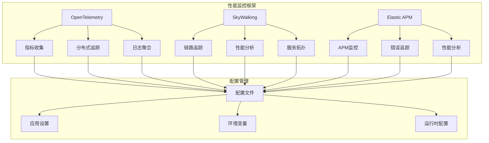
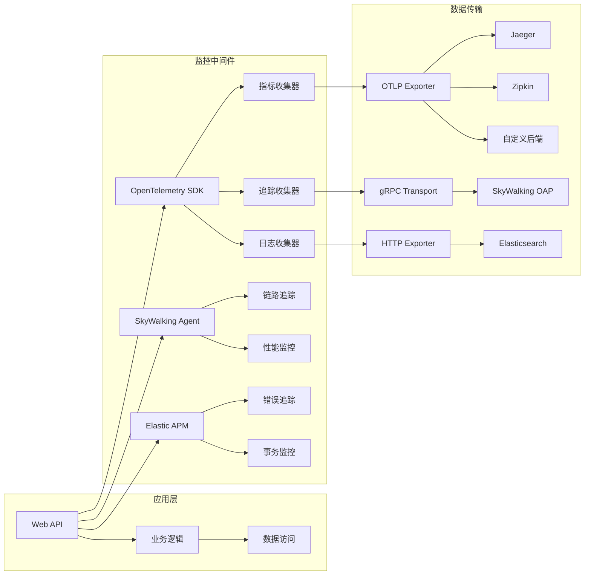
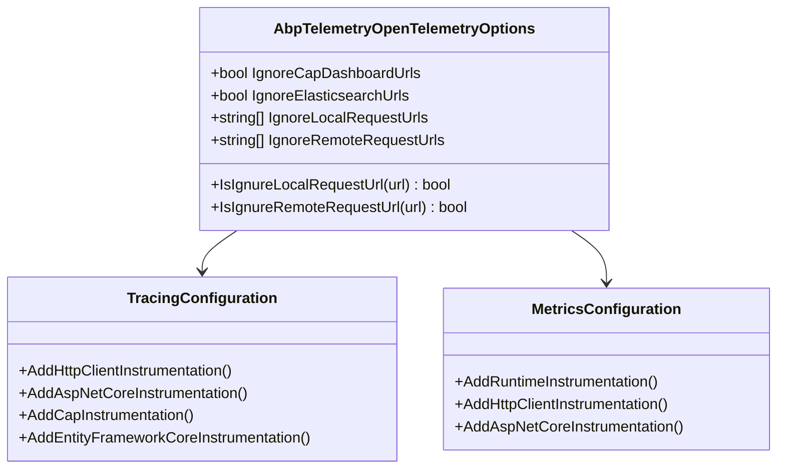
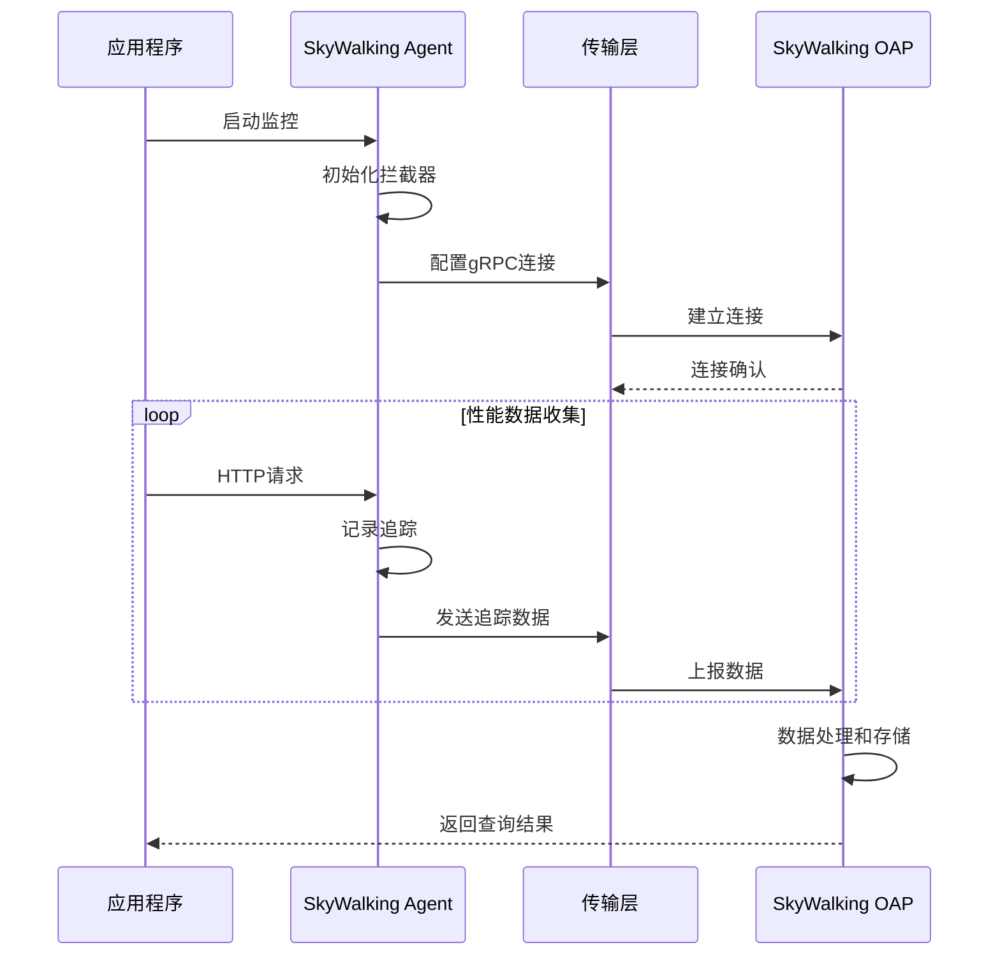
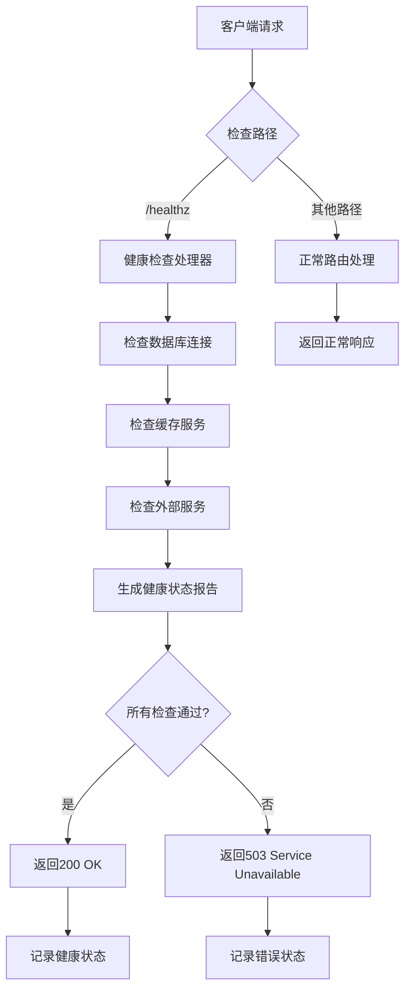
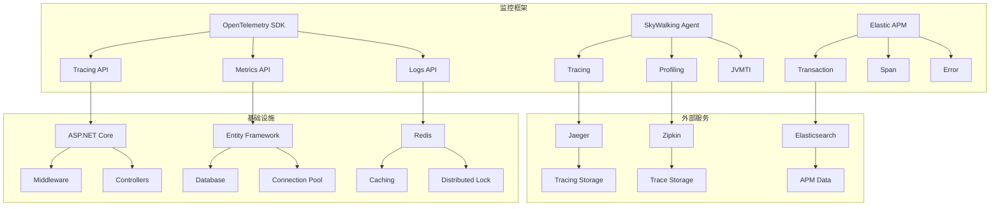

# 性能监控

<cite>
**本文档中引用的文件**
- [AbpTelemetryOpenTelemetryModule.cs](file://aspnet-core/framework/telemetry/LINGYUN.Abp.Telemetry.OpenTelemetry/LINGYUN/Abp/Telemetry/OpenTelemetry/AbpTelemetryOpenTelemetryModule.cs)
- [AbpTelemetryOpenTelemetryOptions.cs](file://aspnet-core/framework/telemetry/LINGYUN.Abp.Telemetry.OpenTelemetry/LINGYUN/Abp/Telemetry/OpenTelemetry/AbpTelemetryOpenTelemetryOptions.cs)
- [AbpTelemetrySkyWalkingModule.cs](file://aspnet-core/framework/telemetry/LINGYUN.Abp.Telemetry.SkyWalking/LINGYUN/Abp/Telemetry/SkyWalking/AbpTelemetrySkyWalkingModule.cs)
- [SkyWalkingServiceCollectionExtensions.cs](file://aspnet-core/framework/telemetry/LINGYUN.Abp.Telemetry.SkyWalking/Microsoft/Extensions/DependencyInjection/SkyWalkingServiceCollectionExtensions.cs)
- [AbpTelemetryAPMModule.cs](file://aspnet-core/framework/telemetry/LINGYUN.Abp.Telemetry.APM/LINGYUNG/Abp/Telemetry/APM/AbpTelemetryAPMModule.cs)
- [AuthServerHttpApiHostModule.Configure.cs](file://aspnet-core/services/LY.MicroService.AuthServer.HttpApi.Host/AuthServerHttpApiHostModule.Configure.cs)
- [appsettings.Development.json](file://aspnet-core/templates/micro/content/host/PackageName.CompanyName.ProjectName.HttpApi.Host/appsettings.Development.json)
- [docker-compose.yml](file://docker-compose.yml)
</cite>

## 目录
1. [简介](#简介)
2. [项目结构](#项目结构)
3. [核心组件](#核心组件)
4. [架构概览](#架构概览)
5. [详细组件分析](#详细组件分析)
6. [依赖关系分析](#依赖关系分析)
7. [性能考虑](#性能考虑)
8. [故障排除指南](#故障排除指南)
9. [结论](#结论)

## 简介

本项目提供了完整的应用性能监控（APM）解决方案，集成了多种监控技术，包括OpenTelemetry、SkyWalking和Elastic APM。这些监控工具能够帮助运维团队实时监控系统性能，识别性能瓶颈，并提供全面的分布式追踪功能。

性能监控系统主要包含以下核心功能：
- **指标收集**：自动收集系统关键性能指标
- **分布式追踪**：跨服务调用链路追踪
- **健康检查**：服务健康状态监控
- **告警机制**：基于阈值的智能告警
- **可视化展示**：丰富的监控数据可视化界面

## 项目结构

性能监控模块位于`aspnet-core/framework/telemetry`目录下，包含三个主要的监控框架集成：



**图表来源**
- [AbpTelemetryOpenTelemetryModule.cs](file://aspnet-core/framework/telemetry/LINGYUN.Abp.Telemetry.OpenTelemetry/LINGYUN/Abp/Telemetry/OpenTelemetry/AbpTelemetryOpenTelemetryModule.cs#L1-L161)
- [AbpTelemetrySkyWalkingModule.cs](file://aspnet-core/framework/telemetry/LINGYUN.Abp.Telemetry.SkyWalking/LINGYUN/Abp/Telemetry/SkyWalking/AbpTelemetrySkyWalkingModule.cs#L1-L45)

**章节来源**
- [AbpTelemetryOpenTelemetryModule.cs](file://aspnet-core/framework/telemetry/LINGYUN.Abp.Telemetry.OpenTelemetry/LINGYUN/Abp/Telemetry/OpenTelemetry/AbpTelemetryOpenTelemetryModule.cs#L1-L161)
- [AbpTelemetrySkyWalkingModule.cs](file://aspnet-core/framework/telemetry/LINGYUN.Abp.Telemetry.SkyWalking/LINGYUN/Abp/Telemetry/SkyWalking/AbpTelemetrySkyWalkingModule.cs#L1-L45)

## 核心组件

### OpenTelemetry 集成

OpenTelemetry是现代应用性能监控的标准框架，支持多种导出器和处理器。

```csharp
public class AbpTelemetryOpenTelemetryModule : AbpModule
{
    public override void ConfigureServices(ServiceConfigurationContext context)
    {
        var configuration = context.Services.GetConfiguration();
        
        if (!configuration.GetValue("OpenTelemetry:IsEnabled", false))
        {
            return;
        }
        
        var openTelmetryBuilder = context.Services
            .AddOpenTelemetry()
            .ConfigureResource(resource =>
            {
                resource.AddService(applicationName);
            })
            .WithTracing(tracing =>
            {
                tracing.AddSource(applicationName);
                ConfigureTracing(tracing, configuration, openTelemetyOptions);
            })
            .WithMetrics(metrics =>
            {
                ConfigureMetrics(metrics, configuration);
            });
    }
}
```

### SkyWalking 集成

SkyWalking是一个开源的分布式追踪系统，提供强大的链路追踪和性能分析能力。

```csharp
public class AbpTelemetrySkyWalkingModule : AbpModule
{
    public override void ConfigureServices(ServiceConfigurationContext context)
    {
        var configuration = context.Services.GetConfiguration();
        var isSkywalkingEnabled = configuration["SkyWalking:IsEnabled"];
        
        if (isSkywalkingEnabled.IsNullOrWhiteSpace() || "false".Equals(isSkywalkingEnabled.ToLower()))
        {
            return;
        }
        
        context.Services.AddSkyWalking(setup =>
        {
            setup.AddAspNetCoreHosting();
            setup.AddCap();
        });
    }
}
```

**章节来源**
- [AbpTelemetryOpenTelemetryModule.cs](file://aspnet-core/framework/telemetry/LINGYUN.Abp.Telemetry.OpenTelemetry/LINGYUN/Abp/Telemetry/OpenTelemetry/AbpTelemetryOpenTelemetryModule.cs#L30-L50)
- [AbpTelemetrySkyWalkingModule.cs](file://aspnet-core/framework/telemetry/LINGYUN.Abp.Telemetry.SkyWalking/LINGYUN/Abp/Telemetry/SkyWalking/AbpTelemetrySkyWalkingModule.cs#L10-L40)

## 架构概览

性能监控系统采用分层架构设计，支持多种监控后端：



**图表来源**
- [AbpTelemetryOpenTelemetryModule.cs](file://aspnet-core/framework/telemetry/LINGYUN.Abp.Telemetry.OpenTelemetry/LINGYUN/Abp/Telemetry/OpenTelemetry/AbpTelemetryOpenTelemetryModule.cs#L50-L120)
- [SkyWalkingServiceCollectionExtensions.cs](file://aspnet-core/framework/telemetry/LINGYUN.Abp.Telemetry.SkyWalking/Microsoft/Extensions/DependencyInjection/SkyWalkingServiceCollectionExtensions.cs#L35-L85)

## 详细组件分析

### OpenTelemetry 配置选项

OpenTelemetry提供了灵活的配置选项，支持多种导出器和过滤规则：



**图表来源**
- [AbpTelemetryOpenTelemetryOptions.cs](file://aspnet-core/framework/telemetry/LINGYUN.Abp.Telemetry.OpenTelemetry/LINGYUN/Abp/Telemetry/OpenTelemetry/AbpTelemetryOpenTelemetryOptions.cs#L1-L59)

### SkyWalking 配置扩展

SkyWalking通过扩展配置支持更复杂的监控场景：



**图表来源**
- [SkyWalkingServiceCollectionExtensions.cs](file://aspnet-core/framework/telemetry/LINGYUN.Abp.Telemetry.SkyWalking/Microsoft/Extensions/DependencyInjection/SkyWalkingServiceCollectionExtensions.cs#L35-L85)

### 健康检查端点

系统提供了统一的健康检查端点，用于监控服务状态：



**图表来源**
- [AuthServerHttpApiHostModule.Configure.cs](file://aspnet-core/services/LY.MicroService.AuthServer.HttpApi.Host/AuthServerHttpApiHostModule.Configure.cs#L220-L230)

**章节来源**
- [AbpTelemetryOpenTelemetryOptions.cs](file://aspnet-core/framework/telemetry/LINGYUN.Abp.Telemetry.OpenTelemetry/LINGYUN/Abp/Telemetry/OpenTelemetry/AbpTelemetryOpenTelemetryOptions.cs#L1-L59)
- [SkyWalkingServiceCollectionExtensions.cs](file://aspnet-core/framework/telemetry/LINGYUN.Abp.Telemetry.SkyWalking/Microsoft/Extensions/DependencyInjection/SkyWalkingServiceCollectionExtensions.cs#L35-L117)

## 依赖关系分析

性能监控系统的依赖关系复杂，涉及多个组件和服务：



**图表来源**
- [AbpTelemetryOpenTelemetryModule.cs](file://aspnet-core/framework/telemetry/LINGYUN.Abp.Telemetry.OpenTelemetry/LINGYUN/Abp/Telemetry/OpenTelemetry/AbpTelemetryOpenTelemetryModule.cs#L50-L120)
- [SkyWalkingServiceCollectionExtensions.cs](file://aspnet-core/framework/telemetry/LINGYUN.Abp.Telemetry.SkyWalking/Microsoft/Extensions/DependencyInjection/SkyWalkingServiceCollectionExtensions.cs#L1-L117)

**章节来源**
- [AbpTelemetryOpenTelemetryModule.cs](file://aspnet-core/framework/telemetry/LINGYUN.Abp.Telemetry.OpenTelemetry/LINGYUN/Abp/Telemetry/OpenTelemetry/AbpTelemetryOpenTelemetryModule.cs#L1-L161)
- [AbpTelemetrySkyWalkingModule.cs](file://aspnet-core/framework/telemetry/LINGYUN.Abp.Telemetry.SkyWalking/LINGYUN/Abp/Telemetry/SkyWalking/AbpTelemetrySkyWalkingModule.cs#L1-L45)

## 性能考虑

### 监控开销优化

性能监控系统在设计时充分考虑了对应用性能的影响：

1. **采样策略**：SkyWalking支持多种采样策略，避免全量监控导致的性能下降
2. **异步传输**：所有监控数据都采用异步方式传输，不影响主线程执行
3. **批量处理**：监控数据批量发送，减少网络开销
4. **内存管理**：合理控制监控数据的内存占用

### 配置优化建议

```json
{
  "OpenTelemetry": {
    "IsEnabled": true,
    "Console": {
      "IsEnabled": false
    },
    "Otlp": {
      "Endpoint": "http://otel-collector:4317",
      "IsEnabled": true
    }
  },
  "SkyWalking": {
    "IsEnabled": true,
    "Sampling": {
      "Percentage": "1.0"
    },
    "Transport": {
      "BatchSize": "1000",
      "Interval": "1000"
    }
  }
}
```

## 故障排除指南

### 常见问题及解决方案

1. **监控数据丢失**
   - 检查网络连接是否正常
   - 验证监控后端服务是否可用
   - 调整传输配置参数

2. **性能影响过大**
   - 减少采样百分比
   - 关闭不必要的监控功能
   - 优化传输频率

3. **配置错误**
   - 检查配置文件语法
   - 验证环境变量设置
   - 确认服务发现配置

### 监控指标说明

系统自动收集以下关键性能指标：

- **响应时间**：HTTP请求的平均响应时间
- **吞吐量**：每秒处理的请求数量
- **错误率**：失败请求占总请求数的比例
- **CPU使用率**：应用程序的CPU占用情况
- **内存使用率**：应用程序的内存占用情况
- **数据库连接数**：活跃的数据库连接数量

**章节来源**
- [appsettings.Development.json](file://aspnet-core/templates/micro/content/host/PackageName.CompanyName.ProjectName.HttpApi.Host/appsettings.Development.json#L40-L97)
- [docker-compose.yml](file://docker-compose.yml#L10-L25)

## 结论

本性能监控系统提供了完整的企业级监控解决方案，支持多种主流的监控框架。通过合理的配置和优化，可以在不影响应用性能的前提下，获得全面的系统监控能力。

系统的主要优势包括：
- **多框架支持**：兼容OpenTelemetry、SkyWalking等多种监控框架
- **灵活配置**：支持动态配置和运行时调整
- **高性能**：最小化监控对应用性能的影响
- **易于部署**：支持容器化部署和云原生环境

运维团队可以根据实际需求选择合适的监控方案，并通过配置文件进行个性化定制，确保系统监控的有效性和可靠性。