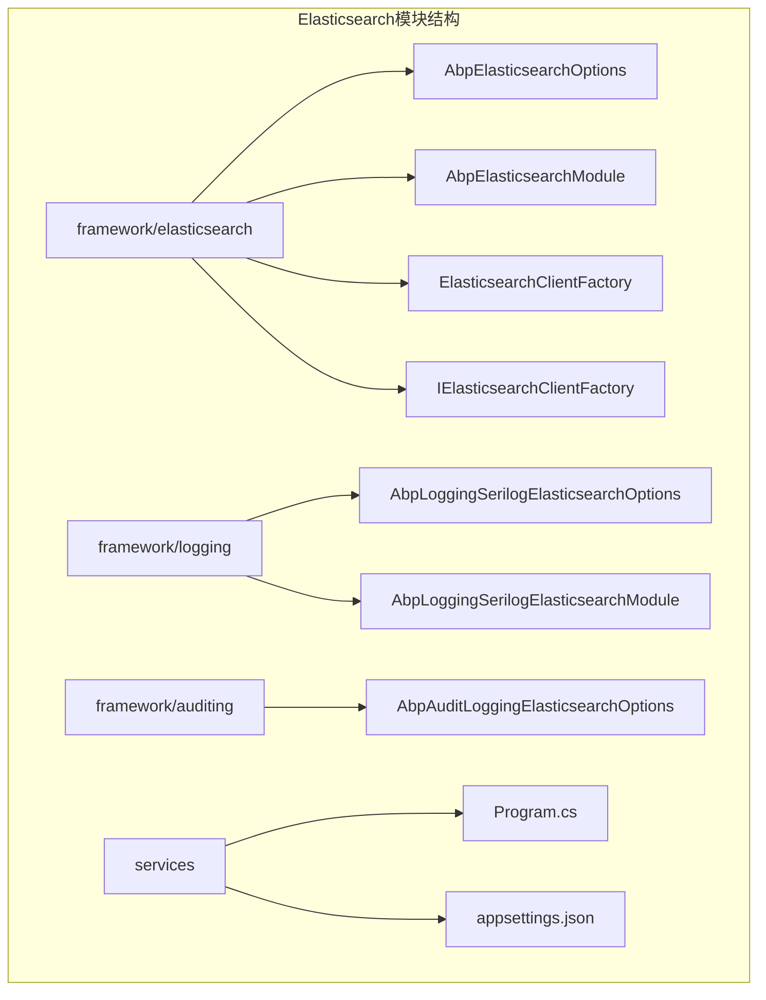
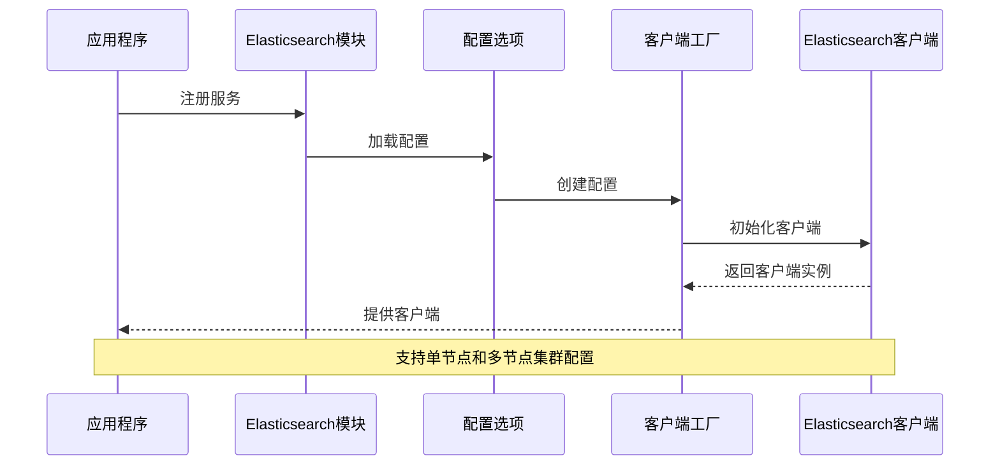
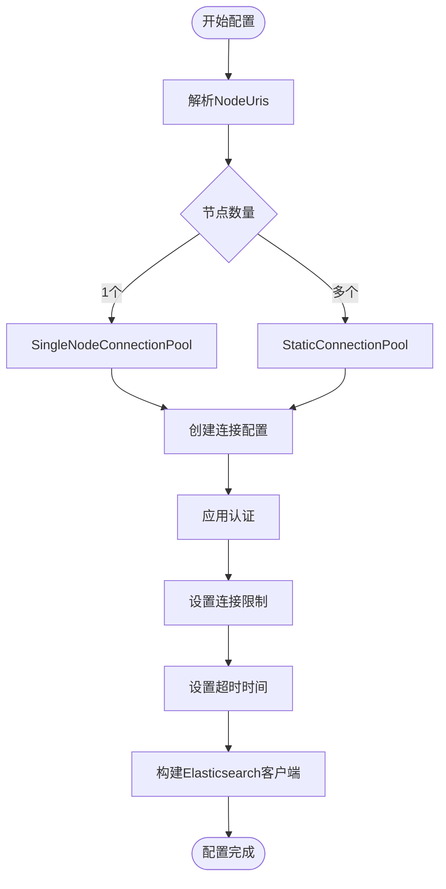
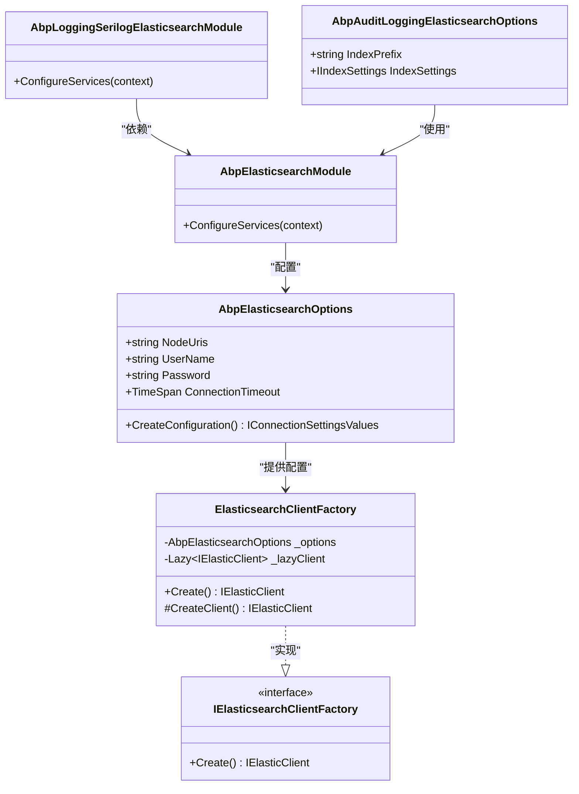

# Elasticsearch连接配置

<cite>
**本文档引用的文件**
- [AbpElasticsearchOptions.cs](file://aspnet-core/framework/elasticsearch/LINGYUN.Abp.Elasticsearch/LINGYUN/Abp/Elasticsearch/AbpElasticsearchOptions.cs)
- [AbpElasticsearchModule.cs](file://aspnet-core/framework/elasticsearch/LINGYUN.Abp.Elasticsearch/LINGYUN/Abp/Elasticsearch/AbpElasticsearchModule.cs)
- [ElasticsearchClientFactory.cs](file://aspnet-core/framework/elasticsearch/LINGYUN.Abp.Elasticsearch/LINGYUN/Abp/Elasticsearch/ElasticsearchClientFactory.cs)
- [AbpLoggingSerilogElasticsearchOptions.cs](file://aspnet-core/framework/logging/LINGYUN.Abp.Logging.Serilog.Elasticsearch/LINGYUN/Abp/AuditLogging/Serilog/Elasticsearch/AbpLoggingSerilogElasticsearchOptions.cs)
- [AbpAuditLoggingElasticsearchOptions.cs](file://aspnet-core/framework/auditing/LINGYUN.Abp.AuditLogging.Elasticsearch/LINGYUN/Abp/AuditLogging/Elasticsearch/AbpAuditLoggingElasticsearchOptions.cs)
- [AbpLoggingSerilogElasticsearchModule.cs](file://aspnet-core/framework/logging/LINGYUN.Abp.Logging.Serilog.Elasticsearch/LINGYUN/Abp/AuditLogging/Serilog/Elasticsearch/AbpLoggingSerilogElasticsearchModule.cs)
- [Program.cs](file://aspnet-core/services/LY.MicroService.Applications.Single/Program.cs)
- [appsettings.json](file://aspnet-core/services/LY.MicroService.Applications.Single/appsettings.json)
</cite>

## 目录
1. [简介](#简介)
2. [项目结构](#项目结构)
3. [核心组件](#核心组件)
4. [架构概览](#架构概览)
5. [详细组件分析](#详细组件分析)
6. [依赖关系分析](#依赖关系分析)
7. [性能考虑](#性能考虑)
8. [故障排除指南](#故障排除指南)
9. [结论](#结论)

## 简介

本文档详细介绍了在ABP框架中配置Elasticsearch连接的方法，重点说明如何使用Serilog的Elasticsearch Sink进行日志记录。Elasticsearch是一个分布式搜索引擎，广泛用于存储和检索大量数据。在ABP框架中，通过专门的模块实现了对Elasticsearch的集成支持，包括连接配置、认证管理、集群部署等多个方面。

该框架提供了完整的Elasticsearch集成解决方案，支持单节点和多节点集群配置，具备基本的身份验证功能，并且可以灵活配置连接参数如超时时间和连接限制等。

## 项目结构

ABP框架中的Elasticsearch相关模块主要分布在以下目录结构中：



**图表来源**
- [AbpElasticsearchOptions.cs](file://aspnet-core/framework/elasticsearch/LINGYUN.Abp.Elasticsearch/LINGYUN/Abp/Elasticsearch/AbpElasticsearchOptions.cs#L1-L71)
- [AbpElasticsearchModule.cs](file://aspnet-core/framework/elasticsearch/LINGYUN.Abp.Elasticsearch/LINGYUN/Abp/Elasticsearch/AbpElasticsearchModule.cs#L1-L13)

**章节来源**
- [AbpElasticsearchOptions.cs](file://aspnet-core/framework/elasticsearch/LINGYUN.Abp.Elasticsearch/LINGYUN/Abp/Elasticsearch/AbpElasticsearchOptions.cs#L1-L71)
- [AbpElasticsearchModule.cs](file://aspnet-core/framework/elasticsearch/LINGYUN.Abp.Elasticsearch/LINGYUN/Abp/Elasticsearch/AbpElasticsearchModule.cs#L1-L13)

## 核心组件

### AbpElasticsearchOptions 配置类

`AbpElasticsearchOptions`是Elasticsearch连接配置的核心类，提供了丰富的配置选项：

```csharp
public class AbpElasticsearchOptions
{
    // 字段命名约定：true为camelCase，false为CamelCase
    public bool FieldCamelCase { get; set; }
    
    // 是否禁用直接流式传输
    public bool DisableDirectStreaming { get; set; }
    
    // 节点URI，支持逗号或分号分隔的多个节点
    public string NodeUris { get; set; }
    
    // 连接限制，默认值由NEST库定义
    public int ConnectionLimit { get; set; }
    
    // 用户名（用于基本认证）
    public string? UserName { get; set; }
    
    // 密码（用于基本认证）
    public string? Password { get; set; }
    
    // 连接超时时间
    public TimeSpan ConnectionTimeout { get; set; }
    
    // 自定义连接对象
    public IConnection Connection { get; set; }
    
    // 序列化工厂
    public ConnectionSettings.SourceSerializerFactory SerializerFactory { get; set; }
}
```

### ElasticsearchClientFactory 工厂类

`ElasticsearchClientFactory`负责创建和管理Elasticsearch客户端实例：

```csharp
public class ElasticsearchClientFactory : IElasticsearchClientFactory, ISingletonDependency
{
    private readonly AbpElasticsearchOptions _options;
    private readonly Lazy<IElasticClient> _lazyClient;

    public IElasticClient Create() => _lazyClient.Value;
    
    protected virtual IElasticClient CreateClient()
    {
        var configuration = _options.CreateConfiguration();
        var client = new ElasticClient(configuration);
        return client;
    }
}
```

**章节来源**
- [AbpElasticsearchOptions.cs](file://aspnet-core/framework/elasticsearch/LINGYUN.Abp.Elasticsearch/LINGYUN/Abp/Elasticsearch/AbpElasticsearchOptions.cs#L8-L71)
- [ElasticsearchClientFactory.cs](file://aspnet-core/framework/elasticsearch/LINGYUN.Abp.Elasticsearch/LINGYUN/Abp/Elasticsearch/ElasticsearchClientFactory.cs#L7-L31)

## 架构概览

Elasticsearch连接配置的整体架构采用模块化设计，通过依赖注入和服务注册实现松耦合：



**图表来源**
- [AbpElasticsearchModule.cs](file://aspnet-core/framework/elasticsearch/LINGYUN.Abp.Elasticsearch/LINGYUN/Abp/Elasticsearch/AbpElasticsearchModule.cs#L7-L12)
- [ElasticsearchClientFactory.cs](file://aspnet-core/framework/elasticsearch/LINGYUN.Abp.Elasticsearch/LINGYUN/Abp/Elasticsearch/ElasticsearchClientFactory.cs#L15-L31)

## 详细组件分析

### 连接池配置

根据`AbpElasticsearchOptions`的实现，系统会自动根据节点数量选择合适的连接池类型：



**图表来源**
- [AbpElasticsearchOptions.cs](file://aspnet-core/framework/elasticsearch/LINGYUN.Abp.Elasticsearch/LINGYUN/Abp/Elasticsearch/AbpElasticsearchOptions.cs#L38-L71)

### Serilog Elasticsearch配置

对于日志记录，框架提供了专门的配置类：

```csharp
public class AbpLoggingSerilogElasticsearchOptions
{
    // 索引格式，默认为"logstash-{0:yyyy.MM.dd}"
    public string IndexFormat { get; set; }
}
```

### 审计日志配置

审计模块也有自己的Elasticsearch配置选项：

```csharp
public class AbpAuditLoggingElasticsearchOptions
{
    // 默认索引前缀："auditlogging"
    public const string DefaultIndexPrefix = "auditlogging";
    
    // 索引前缀
    public string IndexPrefix { get; set; }
    
    // 索引设置
    public IIndexSettings IndexSettings { get; set; }
}
```

**章节来源**
- [AbpElasticsearchOptions.cs](file://aspnet-core/framework/elasticsearch/LINGYUN.Abp.Elasticsearch/LINGYUN/Abp/Elasticsearch/AbpElasticsearchOptions.cs#L38-L71)
- [AbpLoggingSerilogElasticsearchOptions.cs](file://aspnet-core/framework/logging/LINGYUN.Abp.Logging.Serilog.Elasticsearch/LINGYUN/Abp/AuditLogging/Serilog/Elasticsearch/AbpLoggingSerilogElasticsearchOptions.cs#L3-L11)
- [AbpAuditLoggingElasticsearchOptions.cs](file://aspnet-core/framework/auditing/LINGYUN.Abp.AuditLogging.Elasticsearch/LINGYUN/Abp/AuditLogging/Elasticsearch/AbpAuditLoggingElasticsearchOptions.cs#L5-L16)

## 依赖关系分析

Elasticsearch模块的依赖关系图展示了各组件之间的相互依赖：



**图表来源**
- [AbpElasticsearchModule.cs](file://aspnet-core/framework/elasticsearch/LINGYUN.Abp.Elasticsearch/LINGYUN/Abp/Elasticsearch/AbpElasticsearchModule.cs#L6-L12)
- [ElasticsearchClientFactory.cs](file://aspnet-core/framework/elasticsearch/LINGYUN.Abp.Elasticsearch/LINGYUN/Abp/Elasticsearch/ElasticsearchClientFactory.cs#L7-L31)

**章节来源**
- [AbpElasticsearchModule.cs](file://aspnet-core/framework/elasticsearch/LINGYUN.Abp.Elasticsearch/LINGYUN/Abp/Elasticsearch/AbpElasticsearchModule.cs#L1-L13)
- [ElasticsearchClientFactory.cs](file://aspnet-core/framework/elasticsearch/LINGYUN.Abp.Elasticsearch/LINGYUN/Abp/Elasticsearch/ElasticsearchClientFactory.cs#L1-L31)

## 性能考虑

### 连接池优化

系统根据节点数量自动选择最优的连接池策略：
- 单节点使用`SingleNodeConnectionPool`，适合简单的部署场景
- 多节点使用`StaticConnectionPool`，支持负载均衡和故障转移

### 连接限制和超时

默认的连接限制和超时时间由NEST库定义，但可以通过配置进行自定义：
- `ConnectionLimit`：控制并发连接数，防止资源耗尽
- `ConnectionTimeout`：设置请求超时时间，避免长时间等待

### 流式传输优化

`DisableDirectStreaming`选项允许禁用直接流式传输，这在某些网络环境下可能提高稳定性。

## 故障排除指南

### 常见连接问题

1. **节点URI格式错误**
   - 确保URI格式正确，例如：`http://localhost:9200`
   - 支持多个节点，用逗号或分号分隔

2. **认证失败**
   - 检查用户名和密码是否正确
   - 确认Elasticsearch启用了基本认证

3. **网络连接问题**
   - 检查防火墙设置
   - 验证网络连通性

### SSL/TLS配置

虽然当前版本没有显式的SSL配置选项，但可以通过自定义`IConnection`接口实现：

```csharp
// 示例：自定义SSL连接配置
var sslConnection = new HttpConnection(new ConnectionConfiguration()
{
    ServerCertificateValidationCallback = (sender, cert, chain, errors) => true
});

var options = new AbpElasticsearchOptions
{
    NodeUris = "https://localhost:9200",
    Connection = sslConnection
};
```

### 网络隔离环境

在企业内部网络环境中，可能需要特殊的配置：

1. **代理服务器配置**
2. **证书信任配置**
3. **DNS解析配置**

**章节来源**
- [AbpElasticsearchOptions.cs](file://aspnet-core/framework/elasticsearch/LINGYUN.Abp.Elasticsearch/LINGYUN/Abp/Elasticsearch/AbpElasticsearchOptions.cs#L38-L71)

## 结论

ABP框架为Elasticsearch提供了完整而灵活的集成方案。通过模块化的架构设计，开发者可以轻松地在应用程序中集成Elasticsearch功能，无论是用于日志记录、审计跟踪还是其他数据存储需求。

主要特性包括：
- 支持单节点和多节点集群配置
- 内置基本认证支持
- 可配置的连接参数
- 与Serilog和审计模块的深度集成
- 灵活的索引管理和配置选项

通过合理的配置和最佳实践，可以在各种环境中稳定可靠地使用Elasticsearch作为数据存储解决方案。