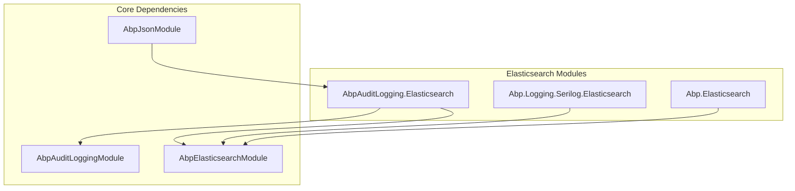
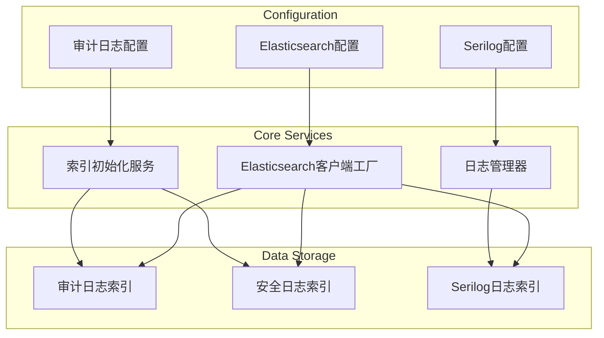
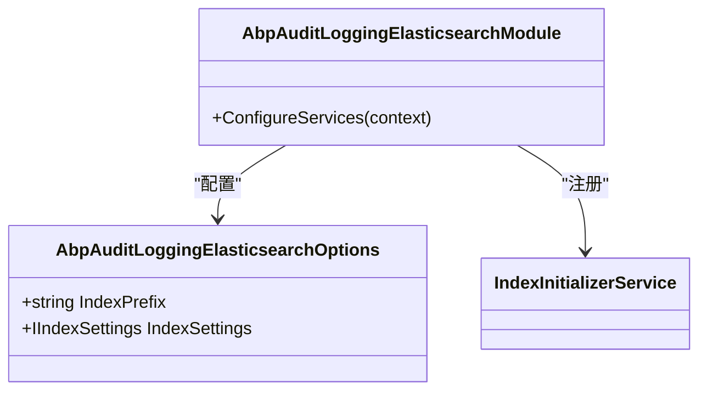
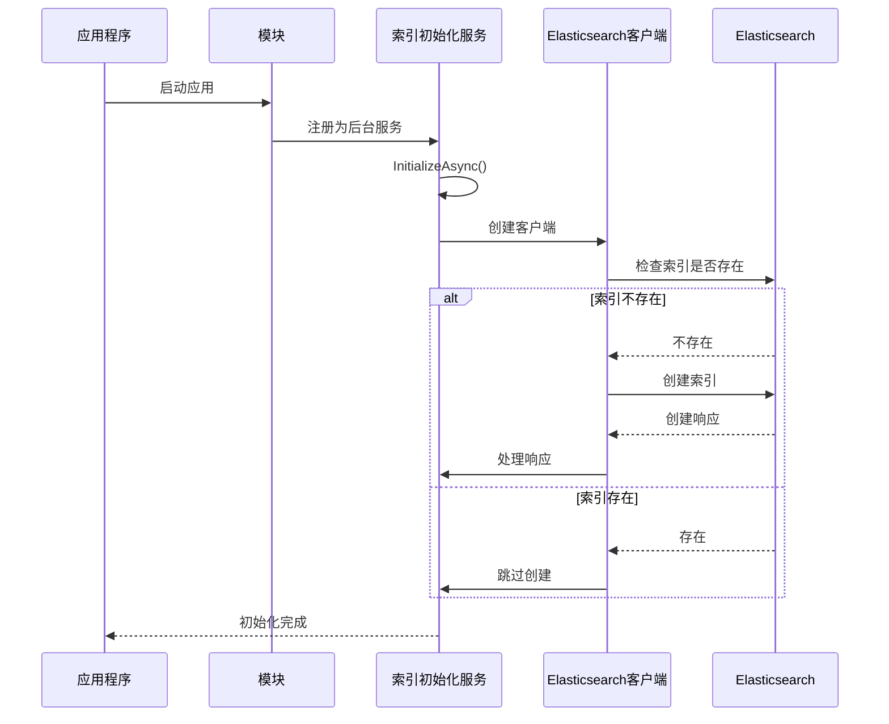
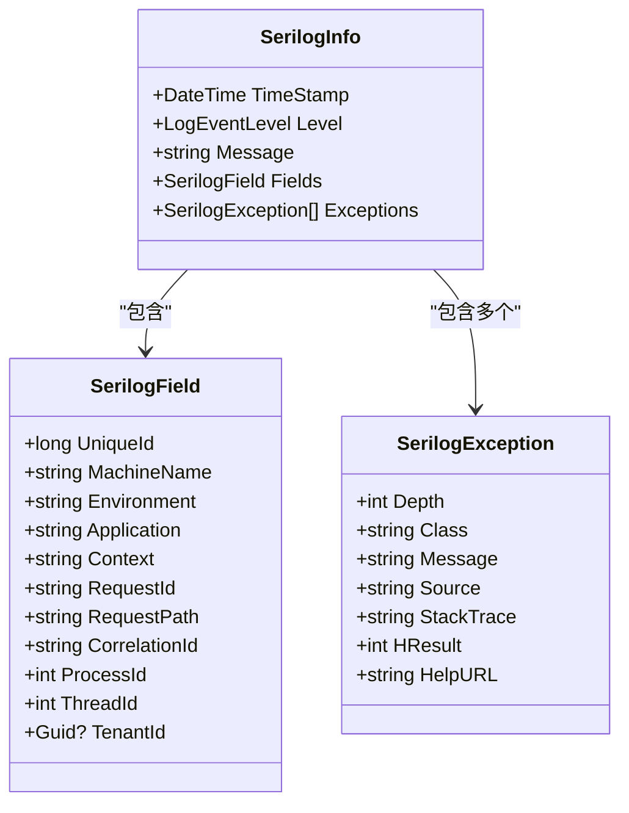
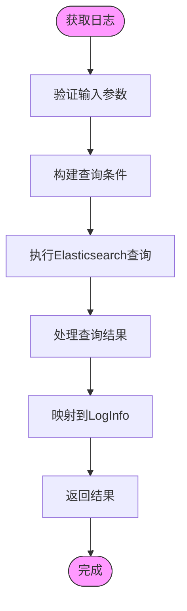
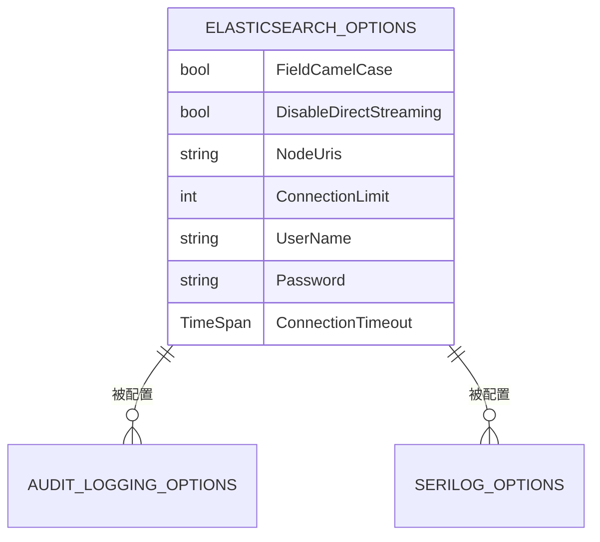
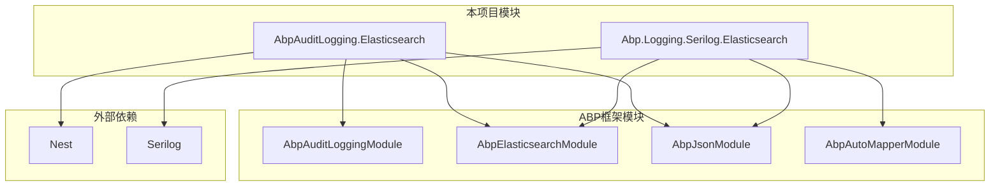

# Elasticsearch集成

<cite>
**本文档引用的文件**
- [AbpAuditLoggingElasticsearchModule.cs](file://aspnet-core/framework/auditing/LINGYUN.Abp.AuditLogging.Elasticsearch/LINGYUN/Abp/AuditLogging/Elasticsearch/AbpAuditLoggingElasticsearchModule.cs)
- [AbpAuditLoggingElasticsearchOptions.cs](file://aspnet-core/framework/auditing/LINGYUN.Abp.AuditLogging.Elasticsearch/LINGYUN/Abp/AuditLogging/Elasticsearch/AbpAuditLoggingElasticsearchOptions.cs)
- [IndexInitializer.cs](file://aspnet-core/framework/auditing/LINGYUN.Abp.AuditLogging.Elasticsearch/LINGYUN/Abp/AuditLogging/Elasticsearch/IndexInitializer.cs)
- [ElasticsearchSecurityLogManager.cs](file://aspnet-core/framework/auditing/LINGYUN.Abp.AuditLogging.Elasticsearch/LINGYUN/Abp/AuditLogging/Elasticsearch/ElasticsearchSecurityLogManager.cs)
- [AbpLoggingSerilogElasticsearchModule.cs](file://aspnet-core/framework/logging/LINGYUN.Abp.Logging.Serilog.Elasticsearch/LINGYUN/Abp/AuditLogging/Serilog/Elasticsearch/AbpLoggingSerilogElasticsearchModule.cs)
- [AbpLoggingSerilogElasticsearchOptions.cs](file://aspnet-core/framework/logging/LINGYUN.Abp.Logging.Serilog.Elasticsearch/LINGYUN/Abp/AuditLogging/Serilog/Elasticsearch/AbpLoggingSerilogElasticsearchOptions.cs)
- [SerilogElasticsearchLoggingManager.cs](file://aspnet-core/framework/logging/LINGYUN.Abp.Logging.Serilog.Elasticsearch/LINGYUN/Abp/AuditLogging/Serilog/Elasticsearch/SerilogElasticsearchLoggingManager.cs)
- [SerilogField.cs](file://aspnet-core/framework/logging/LINGYUN.Abp.Logging.Serilog.Elasticsearch/LINGYUN/Abp/AuditLogging/Serilog/Elasticsearch/SerilogField.cs)
- [AbpElasticsearchModule.cs](file://aspnet-core/framework/elasticsearch/LINGYUN.Abp.Elasticsearch/LINGYUN/Abp/Elasticsearch/AbpElasticsearchModule.cs)
- [AbpElasticsearchOptions.cs](file://aspnet-core/framework/elasticsearch/LINGYUN.Abp.Elasticsearch/LINGYUN/Abp/Elasticsearch/AbpElasticsearchOptions.cs)
</cite>

## 目录
1. [简介](#简介)
2. [项目结构](#项目结构)
3. [核心组件](#核心组件)
4. [架构概述](#架构概述)
5. [详细组件分析](#详细组件分析)
6. [依赖分析](#依赖分析)
7. [性能考虑](#性能考虑)
8. [故障排除指南](#故障排除指南)
9. [结论](#结论)

## 简介
本文档详细介绍了在ABP框架中如何将Serilog日志输出到Elasticsearch进行集中存储和分析。文档涵盖了连接配置、索引策略、数据映射和查询优化等关键方面，深入解释了日志数据在Elasticsearch中的存储结构，以及如何通过Kibana进行可视化查询和监控。提供了实际代码示例展示Elasticsearch Sink的配置和使用方法，以及处理大规模日志数据的性能优化策略。

## 项目结构
该项目是一个基于ABP框架的微服务架构，其中包含了多个与Elasticsearch集成的模块。主要的Elasticsearch相关模块位于`aspnet-core/framework`目录下，包括审计日志、安全日志和Serilog日志记录等组件。

**Diagram sources**
- [AbpAuditLoggingElasticsearchModule.cs](file://aspnet-core/framework/auditing/LINGYUN.Abp.AuditLogging.Elasticsearch/LINGYUN/Abp/AuditLogging/Elasticsearch/AbpAuditLoggingElasticsearchModule.cs)
- [AbpLoggingSerilogElasticsearchModule.cs](file://aspnet-core/framework/logging/LINGYUN.Abp.Logging.Serilog.Elasticsearch/LINGYUN/Abp/AuditLogging/Serilog/Elasticsearch/AbpLoggingSerilogElasticsearchModule.cs)

**Section sources**
- [AbpAuditLoggingElasticsearchModule.cs](file://aspnet-core/framework/auditing/LINGYUN.Abp.AuditLogging.Elasticsearch/LINGYUN/Abp/AuditLogging/Elasticsearch/AbpAuditLoggingElasticsearchModule.cs)
- [AbpLoggingSerilogElasticsearchModule.cs](file://aspnet-core/framework/logging/LINGYUN.Abp.Logging.Serilog.Elasticsearch/LINGYUN/Abp/AuditLogging/Serilog/Elasticsearch/AbpLoggingSerilogElasticsearchModule.cs)

## 核心组件
本项目的核心Elasticsearch集成组件包括审计日志模块、安全日志管理器和Serilog日志记录器。这些组件共同实现了日志数据的收集、存储和查询功能。

**Section sources**
- [AbpAuditLoggingElasticsearchModule.cs](file://aspnet-core/framework/auditing/LINGYUN.Abp.AuditLogging.Elasticsearch/LINGYUN/Abp/AuditLogging/Elasticsearch/AbpAuditLoggingElasticsearchModule.cs)
- [ElasticsearchSecurityLogManager.cs](file://aspnet-core/framework/auditing/LINGYUN.Abp.AuditLogging.Elasticsearch/LINGYUN/Abp/AuditLogging/Elasticsearch/ElasticsearchSecurityLogManager.cs)
- [SerilogElasticsearchLoggingManager.cs](file://aspnet-core/framework/logging/LINGYUN.Abp.Logging.Serilog.Elasticsearch/LINGYUN/Abp/AuditLogging/Serilog/Elasticsearch/SerilogElasticsearchLoggingManager.cs)

## 架构概述
系统的Elasticsearch集成架构基于ABP框架的模块化设计，通过依赖注入和配置系统实现灵活的集成。核心架构包括Elasticsearch客户端工厂、索引初始化服务和日志管理器等组件。

**Diagram sources**
- [AbpElasticsearchOptions.cs](file://aspnet-core/framework/elasticsearch/LINGYUN.Abp.Elasticsearch/LINGYUN/Abp/Elasticsearch/AbpElasticsearchOptions.cs)
- [AbpAuditLoggingElasticsearchOptions.cs](file://aspnet-core/framework/auditing/LINGYUN.Abp.AuditLogging.Elasticsearch/LINGYUN/Abp/AuditLogging/Elasticsearch/AbpAuditLoggingElasticsearchOptions.cs)
- [AbpLoggingSerilogElasticsearchOptions.cs](file://aspnet-core/framework/logging/LINGYUN.Abp.Logging.Serilog.Elasticsearch/LINGYUN/Abp/AuditLogging/Serilog/Elasticsearch/AbpLoggingSerilogElasticsearchOptions.cs)

## 详细组件分析

### 审计日志模块分析
审计日志模块负责将系统审计日志存储到Elasticsearch中，提供了完整的CRUD操作和查询功能。

#### 模块配置

**Diagram sources**
- [AbpAuditLoggingElasticsearchModule.cs](file://aspnet-core/framework/auditing/LINGYUN.Abp.AuditLogging.Elasticsearch/LINGYUN/Abp/AuditLogging/Elasticsearch/AbpAuditLoggingElasticsearchModule.cs)
- [AbpAuditLoggingElasticsearchOptions.cs](file://aspnet-core/framework/auditing/LINGYUN.Abp.AuditLogging.Elasticsearch/LINGYUN/Abp/AuditLogging/Elasticsearch/AbpAuditLoggingElasticsearchOptions.cs)

#### 索引初始化流程

**Diagram sources**
- [IndexInitializer.cs](file://aspnet-core/framework/auditing/LINGYUN.Abp.AuditLogging.Elasticsearch/LINGYUN/Abp/AuditLogging/Elasticsearch/IndexInitializer.cs)
- [AbpElasticsearchOptions.cs](file://aspnet-core/framework/elasticsearch/LINGYUN.Abp.Elasticsearch/LINGYUN/Abp/Elasticsearch/AbpElasticsearchOptions.cs)

### Serilog日志模块分析
Serilog日志模块负责将应用程序日志输出到Elasticsearch，提供了丰富的日志字段和查询功能。

#### 日志数据结构

**Diagram sources**
- [SerilogInfo.cs](file://aspnet-core/framework/logging/LINGYUN.Abp.Logging.Serilog.Elasticsearch/LINGYUN/Abp/AuditLogging/Serilog/Elasticsearch/SerilogInfo.cs)
- [SerilogField.cs](file://aspnet-core/framework/logging/LINGYUN.Abp.Logging.Serilog.Elasticsearch/LINGYUN/Abp/AuditLogging/Serilog/Elasticsearch/SerilogField.cs)
- [SerilogException.cs](file://aspnet-core/framework/logging/LINGYUN.Abp.Logging.Serilog.Elasticsearch/LINGYUN/Abp/AuditLogging/Serilog/Elasticsearch/SerilogException.cs)

#### 日志查询流程

**Diagram sources**
- [SerilogElasticsearchLoggingManager.cs](file://aspnet-core/framework/logging/LINGYUN.Abp.Logging.Serilog.Elasticsearch/LINGYUN/Abp/AuditLogging/Serilog/Elasticsearch/SerilogElasticsearchLoggingManager.cs)
- [AbpLoggingSerilogElasticsearchMapperProfile.cs](file://aspnet-core/framework/logging/LINGYUN.Abp.Logging.Serilog.Elasticsearch/LINGYUN/Abp/AuditLogging/Serilog/Elasticsearch/AbpLoggingSerilogElasticsearchMapperProfile.cs)

**Section sources**
- [SerilogElasticsearchLoggingManager.cs](file://aspnet-core/framework/logging/LINGYUN.Abp.Logging.Serilog.Elasticsearch/LINGYUN/Abp/AuditLogging/Serilog/Elasticsearch/SerilogElasticsearchLoggingManager.cs)
- [SerilogField.cs](file://aspnet-core/framework/logging/LINGYUN.Abp.Logging.Serilog.Elasticsearch/LINGYUN/Abp/AuditLogging/Serilog/Elasticsearch/SerilogField.cs)

### Elasticsearch基础模块分析
Elasticsearch基础模块提供了通用的Elasticsearch连接和配置功能，被其他模块所依赖。

#### 配置结构

**Diagram sources**
- [AbpElasticsearchOptions.cs](file://aspnet-core/framework/elasticsearch/LINGYUN.Abp.Elasticsearch/LINGYUN/Abp/Elasticsearch/AbpElasticsearchOptions.cs)
- [AbpAuditLoggingElasticsearchOptions.cs](file://aspnet-core/framework/auditing/LINGYUN.Abp.AuditLogging.Elasticsearch/LINGYUN/Abp/AuditLogging/Elasticsearch/AbpAuditLoggingElasticsearchOptions.cs)
- [AbpLoggingSerilogElasticsearchOptions.cs](file://aspnet-core/framework/logging/LINGYUN.Abp.Logging.Serilog.Elasticsearch/LINGYUN/Abp/AuditLogging/Serilog/Elasticsearch/AbpLoggingSerilogElasticsearchOptions.cs)

## 依赖分析
Elasticsearch集成模块依赖于ABP框架的核心模块和Nest客户端库，通过模块化设计实现了松耦合的架构。

**Diagram sources**
- [AbpAuditLoggingElasticsearchModule.cs](file://aspnet-core/framework/auditing/LINGYUN.Abp.AuditLogging.Elasticsearch/LINGYUN/Abp/AuditLogging/Elasticsearch/AbpAuditLoggingElasticsearchModule.cs)
- [AbpLoggingSerilogElasticsearchModule.cs](file://aspnet-core/framework/logging/LINGYUN.Abp.Logging.Serilog.Elasticsearch/LINGYUN/Abp/AuditLogging/Serilog/Elasticsearch/AbpLoggingSerilogElasticsearchModule.cs)

**Section sources**
- [AbpAuditLoggingElasticsearchModule.cs](file://aspnet-core/framework/auditing/LINGYUN.Abp.AuditLogging.Elasticsearch/LINGYUN/Abp/AuditLogging/Elasticsearch/AbpAuditLoggingElasticsearchModule.cs)
- [AbpLoggingSerilogElasticsearchModule.cs](file://aspnet-core/framework/logging/LINGYUN.Abp.Logging.Serilog.Elasticsearch/LINGYUN/Abp/AuditLogging/Serilog/Elasticsearch/AbpLoggingSerilogElasticsearchModule.cs)

## 性能考虑
在处理大规模日志数据时，需要考虑以下性能优化策略：

1. **索引策略**：使用时间序列索引格式（如logstash-{0:yyyy.MM.dd}）来管理日志数据，便于按时间范围查询和删除旧数据。
2. **批量操作**：对于大量日志写入，应