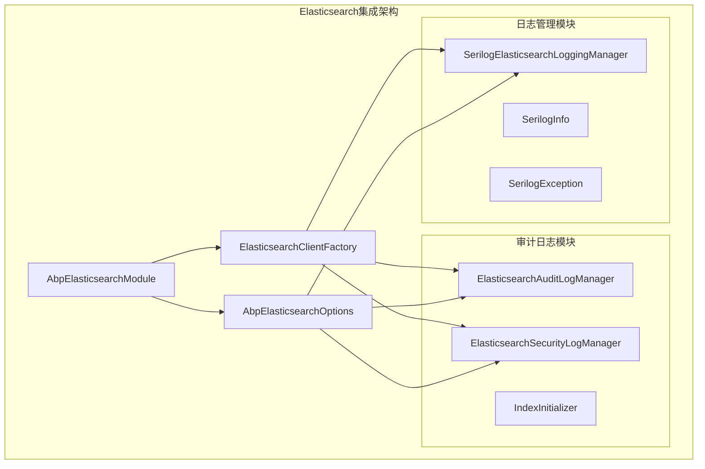
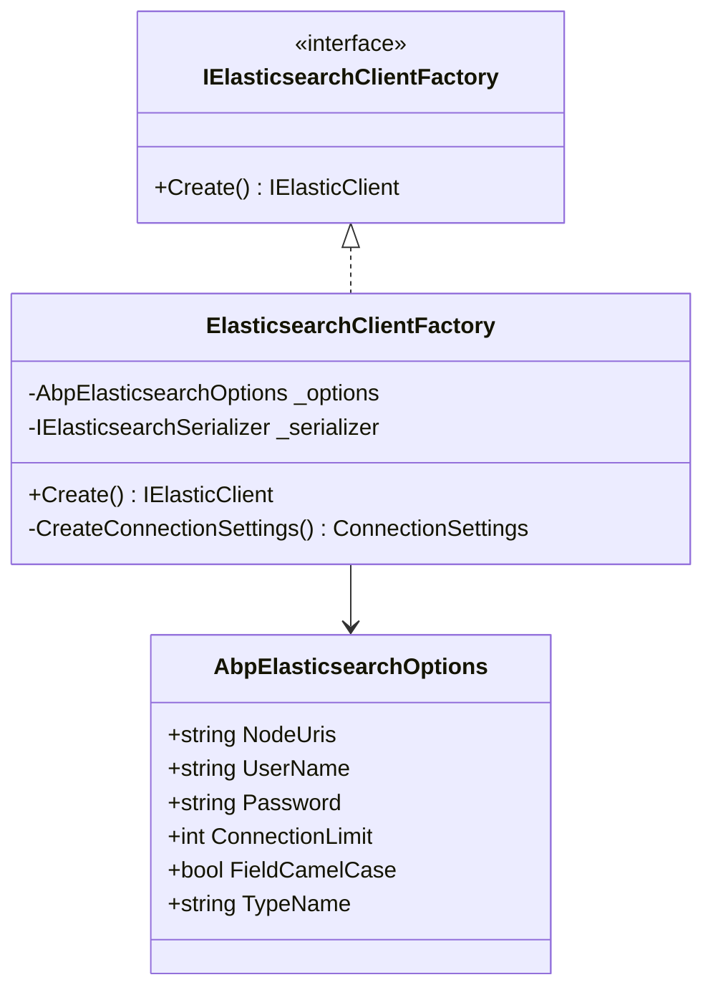
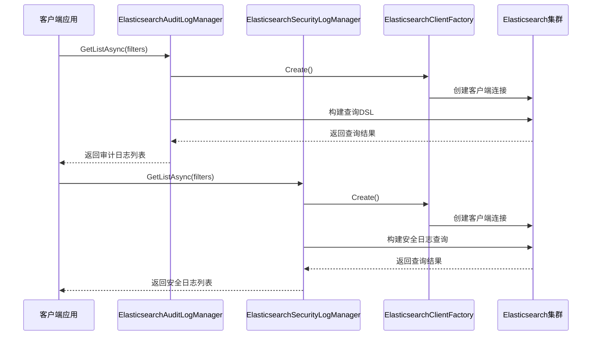
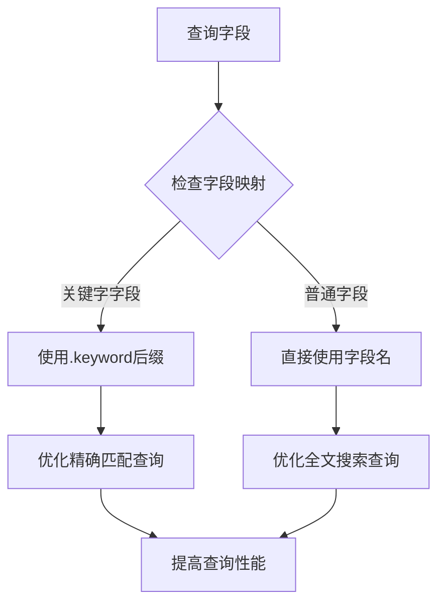
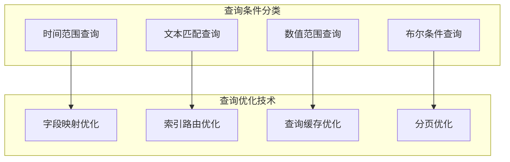

# Elasticsearch查询优化与可视化

<cite>
**本文档中引用的文件**
- [AbpElasticsearchModule.cs](file://aspnet-core/framework/elasticsearch/LINGYUN.Abp.Elasticsearch/LINGYUN/Abp/Elasticsearch/AbpElasticsearchModule.cs)
- [AbpElasticsearchOptions.cs](file://aspnet-core/framework/elasticsearch/LINGYUN.Abp.Elasticsearch/LINGYUN/Abp/Elasticsearch/AbpElasticsearchOptions.cs)
- [ElasticsearchClientFactory.cs](file://aspnet-core/framework/elasticsearch/LINGYUN.Abp.Elasticsearch/LINGYUN/Abp/Elasticsearch/ElasticsearchClientFactory.cs)
- [ElasticsearchAuditLogManager.cs](file://aspnet-core/framework/auditing/LINGYUN.Abp.AuditLogging.Elasticsearch/LINGYUN/Abp/AuditLogging/Elasticsearch/ElasticsearchAuditLogManager.cs)
- [ElasticsearchSecurityLogManager.cs](file://aspnet-core/framework/auditing/LINGYUN.Abp.AuditLogging.Elasticsearch/LINGYUN/Abp/AuditLogging/Elasticsearch/ElasticsearchSecurityLogManager.cs)
- [SerilogElasticsearchLoggingManager.cs](file://aspnet-core/framework/logging/LINGYUN.Abp.Logging.Serilog.Elasticsearch/LINGYUN/Abp/AuditLogging/Serilog/Elasticsearch/SerilogElasticsearchLoggingManager.cs)
- [AbpAuditLoggingElasticsearchOptions.cs](file://aspnet-core/framework/auditing/LINGYUN.Abp.AuditLogging.Elasticsearch/LINGYUN/Abp/AuditLogging/Elasticsearch/AbpAuditLoggingElasticsearchOptions.cs)
- [AbpLoggingSerilogElasticsearchOptions.cs](file://aspnet-core/framework/logging/LINGYUN.Abp.Logging.Serilog.Elasticsearch/LINGYUN/Abp/AuditLogging/Serilog/Elasticsearch/AbpLoggingSerilogElasticsearchOptions.cs)
</cite>

## 目录
1. [简介](#简介)
2. [项目架构概览](#项目架构概览)
3. [核心组件分析](#核心组件分析)
4. [查询优化策略](#查询优化策略)
5. [可视化与监控](#可视化与监控)
6. [最佳实践指南](#最佳实践指南)
7. [故障排除](#故障排除)
8. [总结](#总结)

## 简介

本文档基于ABP框架中的Elasticsearch集成模块，深入探讨如何构建高效的日志查询语句，包括使用Kibana进行日志搜索、过滤和聚合分析的最佳实践。文档涵盖了日志字段的映射配置如何影响查询性能，以及如何优化字段数据类型和分词器设置。

该系统提供了完整的Elasticsearch查询优化解决方案，支持审计日志、安全日志和应用程序日志的高效存储和检索。通过合理的索引设计和查询优化，可以显著提升大规模日志系统的查询性能和用户体验。

## 项目架构概览

基于ABP框架的Elasticsearch集成采用了模块化设计，主要包含以下核心模块：



**图表来源**
- [AbpElasticsearchModule.cs](file://aspnet-core/framework/elasticsearch/LINGYUN.Abp.Elasticsearch/LINGYUN/Abp/Elasticsearch/AbpElasticsearchModule.cs#L1-L50)
- [ElasticsearchClientFactory.cs](file://aspnet-core/framework/elasticsearch/LINGYUN.Abp.Elasticsearch/LINGYUN/Abp/Elasticsearch/ElasticsearchClientFactory.cs#L1-L100)

**章节来源**
- [AbpElasticsearchModule.cs](file://aspnet-core/framework/elasticsearch/LINGYUN.Abp.Elasticsearch/LINGYUN/Abp/Elasticsearch/AbpElasticsearchModule.cs#L1-L50)
- [AbpElasticsearchOptions.cs](file://aspnet-core/framework/elasticsearch/LINGYUN.Abp.Elasticsearch/LINGYUN/Abp/Elasticsearch/AbpElasticsearchOptions.cs#L1-L50)

## 核心组件分析

### Elasticsearch客户端工厂

ElasticsearchClientFactory是整个系统的核心组件，负责创建和管理Elasticsearch客户端实例：



**图表来源**
- [ElasticsearchClientFactory.cs](file://aspnet-core/framework/elasticsearch/LINGYUN.Abp.Elasticsearch/LINGYUN/Abp/Elasticsearch/ElasticsearchClientFactory.cs#L1-L100)
- [AbpElasticsearchOptions.cs](file://aspnet-core/framework/elasticsearch/LINGYUN.Abp.Elasticsearch/LINGYUN/Abp/Elasticsearch/AbpElasticsearchOptions.cs#L1-L50)

### 审计日志管理系统

审计日志管理系统提供了完整的审计日志和安全日志存储功能：



**图表来源**
- [ElasticsearchAuditLogManager.cs](file://aspnet-core/framework/auditing/LINGYUN.Abp.AuditLogging.Elasticsearch/LINGYUN/Abp/AuditLogging/Elasticsearch/ElasticsearchAuditLogManager.cs#L50-L150)
- [ElasticsearchSecurityLogManager.cs](file://aspnet-core/framework/auditing/LINGYUN.Abp.AuditLogging.Elasticsearch/LINGYUN/Abp/AuditLogging/Elasticsearch/ElasticsearchSecurityLogManager.cs#L50-L150)

**章节来源**
- [ElasticsearchAuditLogManager.cs](file://aspnet-core/framework/auditing/LINGYUN.Abp.AuditLogging.Elasticsearch/LINGYUN/Abp/AuditLogging/Elasticsearch/ElasticsearchAuditLogManager.cs#L1-L386)
- [ElasticsearchSecurityLogManager.cs](file://aspnet-core/framework/auditing/LINGYUN.Abp.AuditLogging.Elasticsearch/LINGYUN/Abp/AuditLogging/Elasticsearch/ElasticsearchSecurityLogManager.cs#L1-L285)

## 查询优化策略

### 字段映射优化

系统通过字段映射机制优化查询性能，特别是针对关键字字段使用`.keyword`后缀：



**图表来源**
- [ElasticsearchAuditLogManager.cs](file://aspnet-core/framework/auditing/LINGYUN.Abp.AuditLogging.Elasticsearch/LINGYUN/Abp/AuditLogging/Elasticsearch/ElasticsearchAuditLogManager.cs#L350-L386)
- [ElasticsearchSecurityLogManager.cs](file://aspnet-core/framework/auditing/LINGYUN.Abp.AuditLogging.Elasticsearch/LINGYUN/Abp/AuditLogging/Elasticsearch/ElasticsearchSecurityLogManager.cs#L250-L285)

### 查询构建优化

系统实现了智能的查询构建器，支持动态查询条件组合：

```csharp
protected virtual List<Func<QueryContainerDescriptor<T>, QueryContainer>> BuildQueryDescriptor(
    DateTime? startTime = null,
    DateTime? endTime = null,
    // 其他查询参数...
)
{
    var querys = new List<Func<QueryContainerDescriptor<T>, QueryContainer>>();
    
    if (startTime.HasValue)
    {
        querys.Add((log) => log.DateRange((q) => q.Field(GetField(nameof(Timestamp)))
            .GreaterThanOrEquals(_clock.Normalize(startTime.Value))));
    }
    
    // 其他查询条件添加逻辑...
    
    return querys;
}
```

### 索引设计优化

系统支持多租户隔离和动态索引命名：

```mermaid
graph LR
A[租户ID] --> B[索引命名规范化]
B --> C[动态索引创建]
C --> D[跨租户查询路由]
subgraph "索引命名规则"
E[audit-log]
F[security-log]
G[logstash-{0:yyyy.MM.dd}]
end
C --> E
C --> F
C --> G
```

**图表来源**
- [IndexInitializer.cs](file://aspnet-core/framework/auditing/LINGYUN.Abp.AuditLogging.Elasticsearch/LINGYUN/Abp/AuditLogging/Elasticsearch/IndexInitializer.cs#L34-L105)

**章节来源**
- [ElasticsearchAuditLogManager.cs](file://aspnet-core/framework/auditing/LINGYUN.Abp.AuditLogging.Elasticsearch/LINGYUN/Abp/AuditLogging/Elasticsearch/ElasticsearchAuditLogManager.cs#L200-L350)
- [ElasticsearchSecurityLogManager.cs](file://aspnet-core/framework/auditing/LINGYUN.Abp.AuditLogging.Elasticsearch/LINGYUN/Abp/AuditLogging/Elasticsearch/ElasticsearchSecurityLogManager.cs#L150-L250)

## 可视化与监控

### 日志查询可视化

系统提供了丰富的查询条件支持，便于构建复杂的可视化查询：



### 性能监控指标

系统支持多种性能监控指标的查询和分析：

```csharp
// 示例：获取错误日志统计
var errorLogs = await _loggingManager.GetCountAsync(
    startTime: DateTime.Now.AddDays(-1),
    level: LogLevel.Error,
    hasException: true
);

// 示例：性能瓶颈分析
var slowQueries = await _auditLogManager.GetListAsync(
    maxExecutionDuration: 5000, // 超过5秒的慢查询
    sorting: "ExecutionDuration desc",
    maxResultCount: 100
);
```

**章节来源**
- [SerilogElasticsearchLoggingManager.cs](file://aspnet-core/framework/logging/LINGYUN.Abp.Logging.Serilog.Elasticsearch/LINGYUN/Abp/AuditLogging/Serilog/Elasticsearch/SerilogElasticsearchLoggingManager.cs#L100-L200)

## 最佳实践指南

### 常见查询场景示例

#### 错误日志追踪

```csharp
// 获取最近24小时的所有错误日志
var errors = await _loggingManager.GetListAsync(
    startTime: DateTime.Now.AddDays(-1),
    level: LogLevel.Error,
    maxResultCount: 100,
    includeDetails: true
);

// 获取特定应用的错误日志
var appErrors = await _loggingManager.GetListAsync(
    startTime: DateTime.Now.AddDays(-7),
    application: "MyApp",
    level: LogLevel.Error
);
```

#### 性能瓶颈分析

```csharp
// 查找执行时间超过1秒的审计日志
var slowLogs = await _auditLogManager.GetListAsync(
    maxExecutionDuration: 1000,
    sorting: "ExecutionDuration desc",
    maxResultCount: 50
);

// 分析特定用户的性能问题
var userSlowLogs = await _auditLogManager.GetListAsync(
    userId: targetUserId,
    maxExecutionDuration: 2000,
    sorting: "ExecutionTime desc"
);
```

#### 安全审计

```csharp
// 获取特定时间段的安全事件
var securityEvents = await _securityLogManager.GetListAsync(
    startTime: DateTime.Now.AddDays(-3),
    endTime: DateTime.Now,
    identity: "Login",
    action: "Failed"
);

// 分析异常登录行为
var unusualLogins = await _securityLogManager.GetListAsync(
    startTime: DateTime.Now.AddDays(-1),
    identity: "Login",
    hasException: true
);
```

### Kibana仪表板配置建议

基于系统的设计，建议在Kibana中创建以下仪表板：

1. **实时监控仪表板**
   - 错误率趋势图
   - 性能指标监控
   - 安全事件告警

2. **分析查询仪表板**
   - 日志分布统计
   - 用户行为分析
   - 系统健康度评估

3. **告警配置**
   - 异常日志告警
   - 性能阈值告警
   - 安全事件告警

### 字段映射配置优化

推荐的字段映射配置：

```json
{
  "properties": {
    "ApplicationName": {
      "type": "keyword",
      "normalizer": "lowercase_normalizer"
    },
    "UserName": {
      "type": "keyword",
      "normalizer": "lowercase_normalizer"
    },
    "ClientIpAddress": {
      "type": "ip"
    },
    "ExecutionTime": {
      "type": "date",
      "format": "strict_date_optional_time||epoch_millis"
    }
  }
}
```

**章节来源**
- [SerilogElasticsearchLoggingManager.cs](file://aspnet-core/framework/logging/LINGYUN.Abp.Logging.Serilog.Elasticsearch/LINGYUN/Abp/AuditLogging/Serilog/Elasticsearch/SerilogElasticsearchLoggingManager.cs#L200-L350)

## 故障排除

### 常见查询问题

#### 查询性能问题

1. **问题症状**：查询响应时间过长
2. **可能原因**：
   - 缺乏适当的字段映射
   - 查询条件过于宽泛
   - 索引未正确分片

3. **解决方案**：
   ```csharp
   // 使用精确匹配代替通配符查询
   // 不推荐
   query.Wildcard(q => q.Field("FieldName").Value("*value*"))
   
   // 推荐
   query.Term(q => q.Field("FieldName.keyword").Value("value"))
   ```

#### 数据丢失问题

1. **问题症状**：查询结果为空
2. **可能原因**：
   - 索引名称不匹配
   - 租户隔离配置错误
   - 时间范围设置不当

3. **解决方案**：
   ```csharp
   // 检查索引是否存在
   var indexExists = await client.Indices.ExistsAsync(indexName);
   
   // 验证租户配置
   if (_currentTenant.IsAvailable)
   {
       // 添加租户过滤条件
       querys.Add(q => q.Term(t => t.Field("fields.TenantId").Value(_currentTenant.GetId())));
   }
   ```

### 性能调优建议

#### 索引优化

1. **合理设置分片数量**：避免过多的小分片
2. **使用合适的副本数量**：平衡可用性和性能
3. **定期优化索引**：合并小分片

#### 查询优化

1. **使用过滤器上下文**：对于非评分查询使用filter
2. **限制返回字段**：只获取需要的数据
3. **合理使用缓存**：利用查询结果缓存

**章节来源**
- [ElasticsearchAuditLogManager.cs](file://aspnet-core/framework/auditing/LINGYUN.Abp.AuditLogging.Elasticsearch/LINGYUN/Abp/AuditLogging/Elasticsearch/ElasticsearchAuditLogManager.cs#L300-L386)

## 总结

本文档详细介绍了基于ABP框架的Elasticsearch查询优化和可视化解决方案。通过合理的索引设计、查询优化策略和字段映射配置，可以显著提升日志系统的查询性能和用户体验。

关键要点包括：

1. **模块化设计**：清晰的职责分离和依赖注入
2. **查询优化**：智能的查询构建和字段映射优化
3. **性能监控**：全面的性能指标和告警机制
4. **最佳实践**：丰富的查询场景和配置建议

通过遵循本文档的指导原则和最佳实践，开发团队可以构建高性能、可扩展的日志查询系统，为运维和开发人员提供强大的日志分析能力。