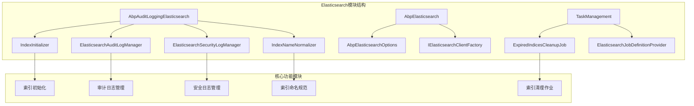
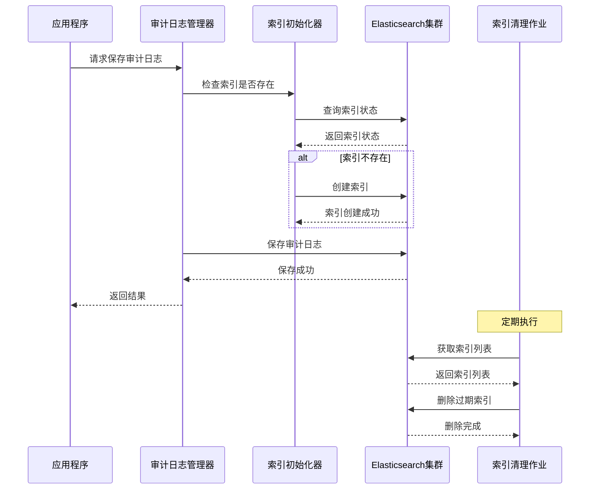
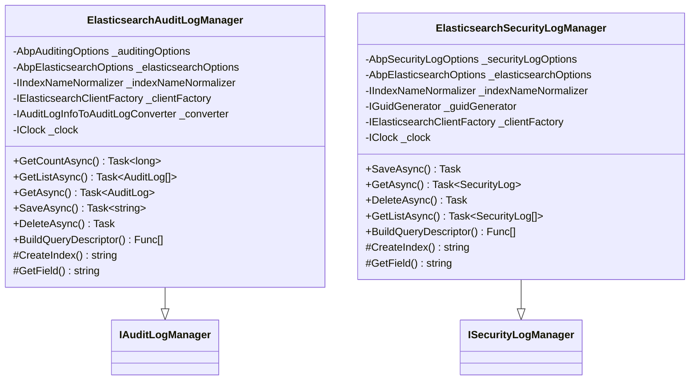
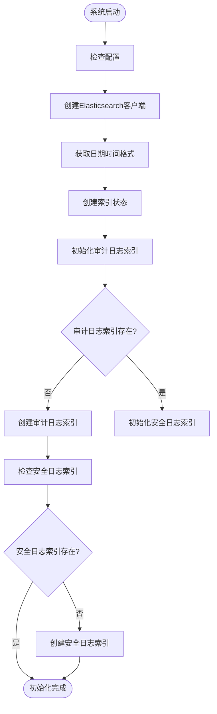

# Elasticsearch索引策略与管理

<cite>
**本文档中引用的文件**
- [AbpAuditLoggingElasticsearchOptions.cs](file://aspnet-core/framework/auditing/LINGYUN.Abp.AuditLogging.Elasticsearch/LINGYUN/Abp/AuditLogging/Elasticsearch/AbpAuditLoggingElasticsearchOptions.cs)
- [IndexInitializer.cs](file://aspnet-core/framework/auditing/LINGYUN.Abp.AuditLogging.Elasticsearch/LINGYUN/Abp/AuditLogging/Elasticsearch/IndexInitializer.cs)
- [ElasticsearchAuditLogManager.cs](file://aspnet-core/framework/auditing/LINGYUN.Abp.AuditLogging.Elasticsearch/LINGYUN/Abp/AuditLogging/Elasticsearch/ElasticsearchAuditLogManager.cs)
- [ElasticsearchSecurityLogManager.cs](file://aspnet-core/framework/auditing/LINGYUN.Abp.AuditLogging.Elasticsearch/LINGYUN/Abp/AuditLogging/Elasticsearch/ElasticsearchSecurityLogManager.cs)
- [IndexNameNormalizer.cs](file://aspnet-core/framework/auditing/LINGYUN.Abp.AuditLogging.Elasticsearch/LINGYUN/Abp/AuditLogging/Elasticsearch/IndexNameNormalizer.cs)
- [AbpElasticsearchOptions.cs](file://aspnet-core/framework/elasticsearch/LINGYUN.Abp.Elasticsearch/LINGYUN/Abp/Elasticsearch/AbpElasticsearchOptions.cs)
- [ExpiredIndicesCleanupJob.cs](file://aspnet-core/modules/task-management/LINGYUN.Abp.Elasticsearch.Jobs/LINGYUN/Abp/Elasticsearch/Jobs/ExpiredIndicesCleanupJob.cs)
- [README.md](file://aspnet-core/framework/auditing/LINGYUN.Abp.AuditLogging.Elasticsearch/README.md)
- [README.EN.md](file://aspnet-core/framework/auditing/LINGYUN.Abp.AuditLogging.Elasticsearch/README.EN.md)
</cite>

## 目录
1. [简介](#简介)
2. [项目结构](#项目结构)
3. [核心组件](#核心组件)
4. [架构概览](#架构概览)
5. [详细组件分析](#详细组件分析)
6. [索引命名规则](#索引命名规则)
7. [生命周期管理](#生命周期管理)
8. [性能优化建议](#性能优化建议)
9. [故障排除指南](#故障排除指南)
10. [结论](#结论)

## 简介

本文档详细介绍了ABP框架中基于Elasticsearch的日志索引管理系统。该系统提供了完整的审计日志和安全日志管理功能，包括自动索引初始化、多租户支持、索引生命周期管理和过期索引清理等核心特性。

系统采用模块化设计，通过依赖注入和配置驱动的方式实现灵活的索引管理策略。主要功能包括：
- 自动索引创建和初始化
- 多租户索引隔离
- 基于时间的索引滚动策略
- 索引生命周期管理
- 存储成本控制
- 性能优化配置

## 项目结构



**图表来源**
- [AbpAuditLoggingElasticsearchOptions.cs](file://aspnet-core/framework/auditing/LINGYUN.Abp.AuditLogging.Elasticsearch/LINGYUN/Abp/AuditLogging/Elasticsearch/AbpAuditLoggingElasticsearchOptions.cs#L1-L17)
- [IndexInitializer.cs](file://aspnet-core/framework/auditing/LINGYUN.Abp.AuditLogging.Elasticsearch/LINGYUN/Abp/AuditLogging/Elasticsearch/IndexInitializer.cs#L1-L107)

**章节来源**
- [README.md](file://aspnet-core/framework/auditing/LINGYUN.Abp.AuditLogging.Elasticsearch/README.md#L1-L38)
- [README.EN.md](file://aspnet-core/framework/auditing/LINGYUN.Abp.AuditLogging.Elasticsearch/README.EN.md#L1-L62)

## 核心组件

### AbpAuditLoggingElasticsearchOptions

这是Elasticsearch审计日志模块的核心配置类，定义了索引前缀和索引设置：

```csharp
public class AbpAuditLoggingElasticsearchOptions
{
    public const string DefaultIndexPrefix = "auditlogging";
    public string IndexPrefix { get; set; }
    public IIndexSettings IndexSettings { get; set; }

    public AbpAuditLoggingElasticsearchOptions()
    {
        IndexPrefix = DefaultIndexPrefix;
        IndexSettings = new IndexSettings();
    }
}
```

### IndexInitializer

负责自动初始化审计日志和安全日志索引，确保在首次使用时创建必要的索引结构：

```csharp
public async virtual Task InitializeAsync()
{
    var client = _clientFactory.Create();
    var dateTimeFormat = !_jsonOptions.OutputDateTimeFormat.IsNullOrWhiteSpace()
        ? $"{_jsonOptions.OutputDateTimeFormat}||strict_date_optional_time||epoch_millis" 
        : "strict_date_optional_time||epoch_millis";
    var indexState = new IndexState
    {
        Settings = _elasticsearchOptions.IndexSettings,
    };
    await InitlizeAuditLogIndex(client, indexState, dateTimeFormat);
    await InitlizeSecurityLogIndex(client, indexState, dateTimeFormat);
}
```

**章节来源**
- [AbpAuditLoggingElasticsearchOptions.cs](file://aspnet-core/framework/auditing/LINGYUN.Abp.AuditLogging.Elasticsearch/LINGYUN/Abp/AuditLogging/Elasticsearch/AbpAuditLoggingElasticsearchOptions.cs#L1-L17)
- [IndexInitializer.cs](file://aspnet-core/framework/auditing/LINGYUN.Abp.AuditLogging.Elasticsearch/LINGYUN/Abp/AuditLogging/Elasticsearch/IndexInitializer.cs#L34-L45)

## 架构概览



**图表来源**
- [ElasticsearchAuditLogManager.cs](file://aspnet-core/framework/auditing/LINGYUN.Abp.AuditLogging.Elasticsearch/LINGYUN/Abp/AuditLogging/Elasticsearch/ElasticsearchAuditLogManager.cs#L145-L189)
- [IndexInitializer.cs](file://aspnet-core/framework/auditing/LINGYUN.Abp.AuditLogging.Elasticsearch/LINGYUN/Abp/AuditLogging/Elasticsearch/IndexInitializer.cs#L34-L62)

## 详细组件分析

### ElasticsearchAuditLogManager

审计日志管理器是系统的核心组件，负责处理所有审计日志的CRUD操作：



**图表来源**
- [ElasticsearchAuditLogManager.cs](file://aspnet-core/framework/auditing/LINGYUN.Abp.AuditLogging.Elasticsearch/LINGYUN/Abp/AuditLogging/Elasticsearch/ElasticsearchAuditLogManager.cs#L18-L35)
- [ElasticsearchSecurityLogManager.cs](file://aspnet-core/framework/auditing/LINGYUN.Abp.AuditLogging.Elasticsearch/LINGYUN/Abp/AuditLogging/Elasticsearch/ElasticsearchSecurityLogManager.cs#L18-L35)

### 索引映射配置

系统为审计日志和安全日志分别定义了详细的索引映射：

#### 审计日志索引映射

```csharp
.map.AutoMap()
.Properties(mp =>
    mp.Date(p => p.Name(n => n.ExecutionTime).Format(dateTimeFormat))
      .Object<ExtraPropertyDictionary>(p => p.Name(n => n.ExtraProperties))
      .Nested<EntityChange>(n =>
         n.AutoMap()
          .Name(nameof(AuditLog.EntityChanges))
          .Properties(np =>
             np.Object<ExtraPropertyDictionary>(p => p.Name(n => n.ExtraProperties))
               .Date(p => p.Name(n => n.ChangeTime).Format(dateTimeFormat))
               .Nested<EntityPropertyChange>(npn => npn.Name(nameof(EntityChange.PropertyChanges)))))
      .Nested<AuditLogAction>(n => n.Name(nameof(AuditLog.Actions))
         .AutoMap()
         .Properties((np => 
             np.Object<ExtraPropertyDictionary>(p => p.Name(n => n.ExtraProperties))
               .Date(p => p.Name(n => n.ExecutionTime).Format(dateTimeFormat))))))
```

#### 安全日志索引映射

```csharp
.map.AutoMap()
.Properties(mp => 
     mp.Object<ExtraPropertyDictionary>(p => p.Name(n => n.ExtraProperties))
       .Date(p => p.Name(n => n.CreationTime).Format(dateTimeFormat))));
```

**章节来源**
- [IndexInitializer.cs](file://aspnet-core/framework/auditing/LINGYUN.Abp.AuditLogging.Elasticsearch/LINGYUN/Abp/AuditLogging/Elasticsearch/IndexInitializer.cs#L47-L75)
- [IndexInitializer.cs](file://aspnet-core/framework/auditing/LINGYUN.Abp.AuditLogging.Elasticsearch/LINGYUN/Abp/AuditLogging/Elasticsearch/IndexInitializer.cs#L83-L95)

## 索引命名规则

### 基本命名规范

系统实现了智能的索引命名机制，支持多租户环境下的索引隔离：

```csharp
public string NormalizeIndex(string index)
{
    if (_currentTenant.IsAvailable)
    {
        return $"{_options.IndexPrefix}-{index}-{_currentTenant.Id:N}";
    }
    return _options.IndexPrefix.IsNullOrWhiteSpace()
        ? index
        : $"{_options.IndexPrefix}-{index}";
}
```

### 索引命名模式

1. **单租户环境**：`{prefix}-{index}`
2. **多租户环境**：`{prefix}-{index}-{tenantId}`

### 默认索引前缀

- 审计日志：`auditlogging-audit-log-{tenantId}`
- 安全日志：`auditlogging-security-log-{tenantId}`

**章节来源**
- [IndexNameNormalizer.cs](file://aspnet-core/framework/auditing/LINGYUN.Abp.AuditLogging.Elasticsearch/LINGYUN/Abp/AuditLogging/Elasticsearch/IndexNameNormalizer.cs#L20-L28)

## 生命周期管理

### 索引初始化流程



**图表来源**
- [IndexInitializer.cs](file://aspnet-core/framework/auditing/LINGYUN.Abp.AuditLogging.Elasticsearch/LINGYUN/Abp/AuditLogging/Elasticsearch/IndexInitializer.cs#L34-L45)

### 过期索引清理

系统提供了自动的过期索引清理功能：

```csharp
public async virtual Task ExecuteAsync(JobRunnableContext context)
{
    var timeZone = TimeZoneInfo.Utc;
    var indexPrefix = context.GetString(PropertyIndexPrefix);
    var timeZoneString = context.GetOrDefaultString(PropertyTimeZone, "utc");
    var expirationSecond = context.GetOrDefaultJobData(PropertyExpirationTime, 5184000L); // 60天

    var elasticClientFactory = context.GetRequiredService<IElasticsearchClientFactory>();
    var elasticClient = elasticClientFactory.Create();

    var clock = context.GetRequiredService<IClock>();
    var expirationTime = clock.Now.AddSeconds(-expirationSecond);
    
    // 获取索引设置并删除过期索引
    var settingResponse = await elasticClient.Indices.GetSettingsAsync(indexPrefix);
    // ... 索引清理逻辑
}
```

**章节来源**
- [ExpiredIndicesCleanupJob.cs](file://aspnet-core/modules/task-management/LINGYUN.Abp.Elasticsearch.Jobs/LINGYUN/Abp/Elasticsearch/Jobs/ExpiredIndicesCleanupJob.cs#L45-L70)

## 性能优化建议

### 分片和副本配置策略

1. **初始索引配置**
   ```json
   {
     "number_of_shards": 3,
     "number_of_replicas": 1,
     "refresh_interval": "30s",
     "codec": "best_compression"
   }
   ```

2. **热温冷架构**
   - 热节点：最近30天的数据
   - 温节点：30-90天的数据
   - 冷节点：超过90天的数据

3. **索引别名管理**
   ```json
   {
     "actions": [
       {
         "add": {
           "index": "audit-log-000001",
           "alias": "audit-log-write"
         }
       }
     ]
   }
   ```

### 查询性能优化

1. **字段映射优化**
   - 使用keyword字段进行精确匹配
   - 合理使用nested对象处理复杂数据结构
   - 避免过度使用动态映射

2. **查询优化**
   ```csharp
   // 使用Source过滤减少传输数据量
   .Source(log => log.IncludeAll().Exclude(f => f.Actions))
   // 合理使用排序字段
   .Sort(log => log.Field("ExecutionTime", SortOrder.Descending))
   ```

3. **批量操作**
   ```csharp
   // 使用Bulk API提高写入性能
   await client.BulkAsync(dsl => dsl
       .Index(CreateIndex())
       .Create<AuditLog>(ct => ct.Id(auditLog.Id).Document(auditLog)));
   ```

### 存储成本控制

1. **数据保留策略**
   - 设置合理的过期时间（默认60天）
   - 实施分层存储策略
   - 使用压缩算法减少存储空间

2. **索引优化**
   - 合理设置分片数量
   - 使用合适的副本数
   - 定期合并小索引

## 故障排除指南

### 常见问题及解决方案

1. **索引创建失败**
   ```csharp
   if (!indexCreateResponse.IsValid)
   {
       Logger.LogWarning("Failed to initialize index and audit log may not be retrieved.");
       Logger.LogWarning(indexCreateResponse.OriginalException.ToString());
   }
   ```

2. **查询超时**
   - 检查Elasticsearch集群健康状态
   - 优化查询条件
   - 调整分片和副本配置

3. **内存不足**
   - 监控JVM堆内存使用情况
   - 调整bulk操作批次大小
   - 实施数据归档策略

### 日志监控

系统提供了完善的日志记录机制：

```csharp
Logger.LogWarning("Failed to initialize index and audit log may not be retrieved.");
Logger.LogException(ex, Microsoft.Extensions.Logging.LogLevel.Error);
```

**章节来源**
- [IndexInitializer.cs](file://aspnet-core/framework/auditing/LINGYUN.Abp.AuditLogging.Elasticsearch/LINGYUN/Abp/AuditLogging/Elasticsearch/IndexInitializer.cs#L75-L80)
- [ElasticsearchAuditLogManager.cs](file://aspnet-core/framework/auditing/LINGYUN.Abp.AuditLogging.Elasticsearch/LINGYUN/Abp/AuditLogging/Elasticsearch/ElasticsearchAuditLogManager.cs#L130-L135)

## 结论

ABP框架的Elasticsearch索引管理系统提供了完整而强大的日志管理解决方案。通过模块化的架构设计、智能的索引命名规则、自动化的生命周期管理和灵活的配置选项，系统能够满足各种规模应用的需求。

### 主要优势

1. **自动化程度高**：从索引创建到清理全程自动化
2. **多租户支持**：完善的租户隔离机制
3. **性能优化**：内置多种性能优化策略
4. **易于维护**：清晰的代码结构和完善的错误处理

### 最佳实践建议

1. 根据业务需求合理配置索引前缀
2. 定期监控索引健康状况
3. 实施适当的数据保留策略
4. 根据查询模式优化索引映射
5. 建立完善的监控和告警机制

通过遵循本文档提供的指导原则和最佳实践，开发者可以构建高效、可靠且可扩展的Elasticsearch索引管理系统。